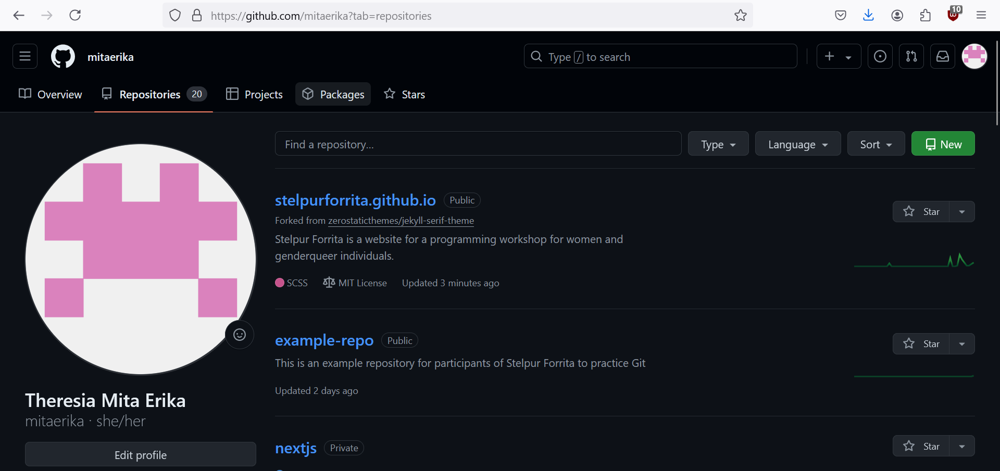
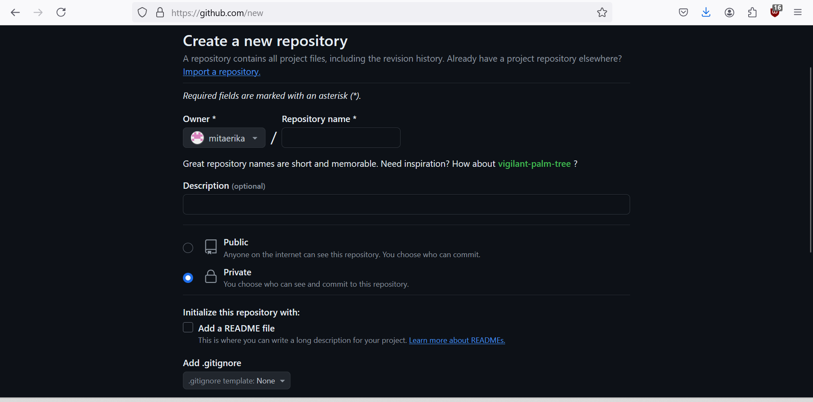
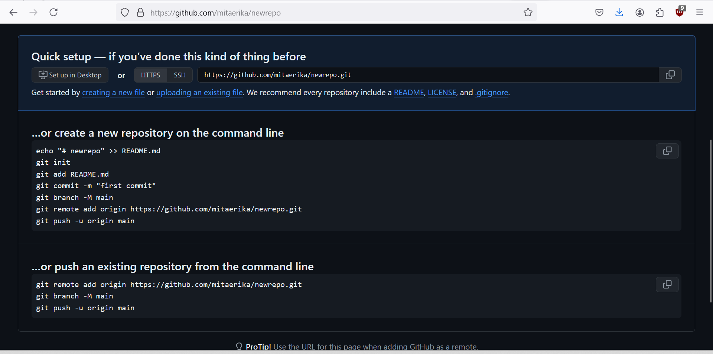
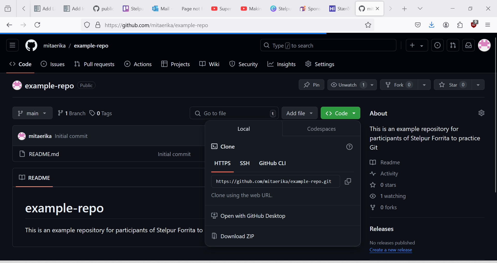

Day 1 - Git and GitHub
======================

Working with repositories
-------------------------
The simplest exercise to start learning Git is to create our own repository on GitHub and pushing code into it.

Create a new repository
~~~~~~~~~~~~~~~~~~~~~~~~~~~~~~~~
After creating a GitHub account, click on `Repository` from the top menu.
Click on the `New` button to create a new repository.

The page will then allow you to set the name of your repository and whether to have it `public` or `private`.
In this exercise, you don't need to open the access to your repository to everyone on the internet so we can set it to `private`.
No matter the visibilitysetting, you can limit the access to edit your project to a selected people you appoint as `Collaborators` under `Settings`.

Once you click on the `Create repository` button, you have your brand new empty repository.
GitHub will then show you ways to populate your new empty repository with your code/project. 

Cloning a repository to your machine
~~~~~~~~~~~~~~~~~~~~~~~~~~~~~~~~~~~~~~~
Since we have created a remote repository, we can try and copy it to our computers to create a local repository.
Local repository does not require you to upload the progressional changes to your code over the internet.
Because of this, when you are working with a local repository, saving your changes would not take as much time as it would if you save each and every changes to the remote repository.

Given a remote repository on GitHub such as `this example repository <https://github.com/mitaerika/example-repo>`_, let's try to set up the local repository.

Say that we have this file directory ``C:\Users\username\Documents`` and we want to put the project under Documents like so: ::

    C:/
    |- Users 
        |- username
            |- Documents
                |- <new location for the project folder>

Then we do the following:

1. Open the Command Line Interface (CLI).
On Windows, it is called the Command Prompt (shortcut: `Windows+r` key then type `cmd`).
On Mac or Linux systems, it is called the Terminal (shortcut: `Command+t` key).

2. Navigate to the correct directory ``C:\Users\username\Documents``.
We can go further down the directory with ``cd <next folder name>``.

3. Get the repository web url, this is usually the url of the repository ending with ``.git``.

4. Run the following code

.. code-block::

    git clone <weburl>

.. note:: 
    **Success metric:** The project folder for ``example-repo`` exists at ``C:\Users\username\Documents\example-repo``.

Push your changes to the remote repository
~~~~~~~~~~~~~~~~~~~~~~~~~~~~~~~~~~~~~~~~~~~~~
After working on your local repository, it is good practice to check which branch we are working on and what files have been added/modified.
To do this we type in the command ``git status`` on the CLI on the local repository folder, for example ``C:\Users\username\Documents\example-repo``.

Then, we put the new/modified files to the staging area by using the command ``git add <file name>``.
We can use the command ``git add .`` if you want to commit the changes to all files.

When we are happy with the collection of files we have, we can commit the changes to the project.
For this we use the command ``git commit -m "<commit message>"``.

Committing a change will involve a commit message which acts as documentation on what we did to the project.
Documentation is important as it will help future you trace any mistakes that happened in the past so that you can fix it.
Employers also often check your GitHub public repositories to see the quality of your work and documentation as it is an important skill to have when working in teams.

**Further reading**: `How to make quality commit messages <https://gist.github.com/luismts/495d982e8c5b1a0ced4a57cf3d93cf60>`_ 

After committing the changes, we can push the change to the remote repository.
To do this, the command is ``git push``.
The first push from the local repository to the remote repository sometimes need you to establish the connection between the two.
GitHub will provide you with the correct command to do so.

