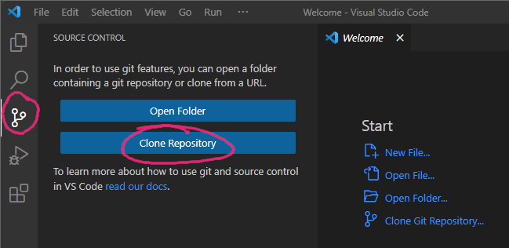

Undirbúningur
=============

Anaconda
--------

Fyrsta verk er að setja upp `Conda <https://conda.io>`_ sem er pakkastjóri 
fyrir Python og fleiri forritunarmál. Hentugast er að gera það 
með því að setja upp 
`Anaconda <https://anaconda.org>`_ eða 
`Miniconda <https://docs.conda.io/en/latest/miniconda.html>`_. 
Miniconda er minni og dugar fínt hér. En fyrir þau sem ætla að nota 
Python í vísindalega útreikninga þá er Anaconda hugsanlega álitlegra, 
sjá `Anaconda vs. Miniconda <https://docs.conda.io/projects/conda/en/stable/user-guide/install/download.html#anaconda-or-miniconda>`_.

Hægt er að hlaða þeim niður hér:

* Miniconda: https://docs.conda.io/en/main/miniconda.html#latest-miniconda-installer-links

* Anaconda: https://docs.anaconda.com/anaconda/install/

Pakkastjórar
~~~~~~~~~~~~

Einnig er mögulegt að nota pakkastjóra til að setja upp Miniconda/Anaconda. 

Á Windows er hægt að nota `Winget <https://learn.microsoft.com/en-us/windows/package-manager/winget/>`_, 
þ.e. opna skjhermi (terminal) og skrifa

.. code-block::
   
    winget install --id=Anaconda.Miniconda3  -e

eða 

.. code-block::

   winget install -e --id Anaconda.Anaconda3

Sambærilegar skipanir eru til í flestum Linux-útgáfum. 

Ritill 
------

Við þurfum einhvern góðan textaritil, t.d. `Visual Studio Code <https://code.visualstudio.com/>`_.
En einnig má nota *Vim*, *Nvim*, *Emacs*, *Sublime* o.s.frv.

Git
---

Næsta mál er að setja upp `Git <https://git-scm.com/>`_. Það má gera það hvort sem er með 
því að hlaða forritinu niður hér, https://git-scm.com/download/win, eða með því að nota
pakkastjóra

.. code-block::

    winget install -e --id Git.Git

Sambærilegar skipanir eru til í flestum Linux-útgáfum:

.. code-block::

    apt-get install git

og þeir sem nota Homebrew á MacOS keyra:

.. code-block::

    brew install git

.. youtube:: 2ReR1YJrNOM

Edbook hlaðið niður
-------------------

Nú þarf að hlaða niður öllum skránum frá https://github.com/edbook/haskoli-islands 
og er það gert með Git. Í VSCode er smellt á Git-merkið vinstra megin og 
valið *Clone repository*. Þá er slegið inn `https://github.com/edbook/haskoli-islands`,
ýtt á Enter, valin mappa þar sem geyma á skrárnar og smellt á Ok.
Þegar búið er að hlaða þeim niður þá er smellt á *Open*.

.. note::
   Í VSCode er hægt að opna heila möppu í einu og flakka á milli skráa með valmyndinni 
   vinstra megin. Það er ráðlegt að gera þetta frekar en að opna stakar skrár, þ.e. fara í
   *File->Open Folder* og opna *haskoli-islands*-möppuna. 

Conda-umhverfi sett upp
-----------------------

Næst er að setja upp Conda-umhverfið sem inniheldur allt sem þarf til að 
þýða (compile) nóturnar. Í VSCode er smellt á *Terminal* og svo
*New Terminal*. Þá birtist skjáhermir niðri þar sem við keyrum

.. code-block:: 

   conda env create -f environment.yml

Þetta tekur smástund því Conda er að ná í alla pakkana sem til þarf.

Næst þarf að virkja umhverfið með 

.. code-block::

   conda activate edbook

.. Note::
    
    Það ætti að standa *(edbook)* fremst í skipanalínunni 

Stillingar fyrir nýtt verkefni
------------------------------

Smellið á  *projects* og veljið möppuna með nýja verkefninu og smellið þar á *conf.py*.
Þar þarf að breyta línum 9, 10, 11 og 12. Að öðru leyti ætti ekki að þurfa að breyta þessari skrá. 

Línurnar sem þarf að breyta

.. code-block:: 
   :lineno-start: 8

   #################### PROJECT ######################
   project = "Sniðmát fyrir Edbook (TMP001G)"
   projectid = "tmp001g"
   copyright = "2023, Jónmundur Gunnuson"
   author = "Jónmundur Gunnuson <asdf@hi.is>"
   year = str(datetime.datetime.now().year)
   version = year  # The short X.Y version.
   release = year  # The full version, including alpha/beta/rc tags.
   ###################################################

