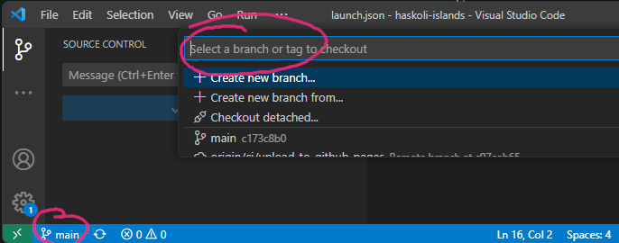

Búa til nýtt verkefni
=====================

Nýtt Git-branch
-----------------------

Það telst ekki góð latína að vinna á main-greininni á Git. Það er því ráðlagt að búa til 
nýja grein (branch) fyrir nýja verkefnið. Í VSCode er smellt á *Main* neðst til vinstri, 
skrifið nafnið á verkefninu (ef um er að ræða nótur fyrirnámskeið þá er númerið á því upplagt
nafn) og smellið á *Create new branch*. Framvegis er svo hægt að fylgjast með neðst til vinstri 
í hvaða grein er verið að vinna.

Hér er aðeins farið í það hvernig unnið er með Git í VSCode

.. youtube:: i_23KUAEtUM

Afrita tmp001
-------------

Nú þarf að afrita möppuna `tmp001g` sem er í `haskoli-islands/projects`-möppunni yfir í nýja möppu svo
hægt sé að byrja að 

.. code-block:: 

   cp projects/tmp001g projects/new001g

þar sem *new001g* er heitið á nýja verkefninu. 

