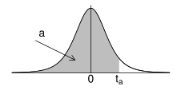
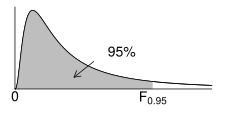

Töflur
======

.. _a.normaltafla:

T.1: Stöðluð normaldreifing - z-gildi
-------------------------------------

.. figure:: myndir/normal_plot.svg
    :align: center
    :alt: Mynd

Taflan gefur gildi á :math:`\Phi`, það er líkurnar á að :math:`Z` taki
gildi sem er minna en :math:`z`, þar sem :math:`Z` fylgir staðlaðri
normaldreifingu, sem við munum er normaldreifingu með meðaltal 0 og
staðalfrávik 1. Vinstra megin í töflunni er talið upp gildi :math:`\Phi`
miðað við neikvætt gildi á :math:`z`, meðan hægra megin í töfluna er
talið upp gildi :math:`\Phi` miðað við jákvætt gildi á :math:`z`.

+--------------------------+--------------------------+----+--------------------------+--------------------------+
| :math:`\mathbf{z}`       | :math:`\Phi(\mathbf{z})` |    | :math:`\mathbf{z}`       | :math:`\Phi(\mathbf{z})` |
+==========================+==========================+====+==========================+==========================+
| 0.00                     | 0.5000                   |    | 0.00                     | 0.5000                   |
+--------------------------+--------------------------+----+--------------------------+--------------------------+
| -0.01                    | 0.4960                   |    | 0.01                     | 0.5040                   |
+--------------------------+--------------------------+----+--------------------------+--------------------------+
| -0.02                    | 0.4920                   |    | 0.02                     | 0.5080                   |
+--------------------------+--------------------------+----+--------------------------+--------------------------+
| -0.03                    | 0.4880                   |    | 0.03                     | 0.5120                   |
+--------------------------+--------------------------+----+--------------------------+--------------------------+
| -0.04                    | 0.4840                   |    | 0.04                     | 0.5160                   |
+--------------------------+--------------------------+----+--------------------------+--------------------------+
| -0.05                    | 0.4801                   |    | 0.05                     | 0.5199                   |
+--------------------------+--------------------------+----+--------------------------+--------------------------+
| -0.06                    | 0.4761                   |    | 0.06                     | 0.5239                   |
+--------------------------+--------------------------+----+--------------------------+--------------------------+
| -0.07                    | 0.4721                   |    | 0.07                     | 0.5279                   |
+--------------------------+--------------------------+----+--------------------------+--------------------------+
| -0.08                    | 0.4681                   |    | 0.08                     | 0.5319                   |
+--------------------------+--------------------------+----+--------------------------+--------------------------+
| -0.09                    | 0.4641                   |    | 0.09                     | 0.5359                   |
+--------------------------+--------------------------+----+--------------------------+--------------------------+
| -0.10                    | 0.4602                   |    | 0.10                     | 0.5398                   |
+--------------------------+--------------------------+----+--------------------------+--------------------------+
| -0.11                    | 0.4562                   |    | 0.11                     | 0.5438                   |
+--------------------------+--------------------------+----+--------------------------+--------------------------+
| -0.12                    | 0.4522                   |    | 0.12                     | 0.5478                   |
+--------------------------+--------------------------+----+--------------------------+--------------------------+
| -0.13                    | 0.4483                   |    | 0.13                     | 0.5517                   |
+--------------------------+--------------------------+----+--------------------------+--------------------------+
| -0.14                    | 0.4443                   |    | 0.14                     | 0.5557                   |
+--------------------------+--------------------------+----+--------------------------+--------------------------+
| -0.15                    | 0.4404                   |    | 0.15                     | 0.5596                   |
+--------------------------+--------------------------+----+--------------------------+--------------------------+
| -0.16                    | 0.4364                   |    | 0.16                     | 0.5636                   |
+--------------------------+--------------------------+----+--------------------------+--------------------------+
| -0.17                    | 0.4325                   |    | 0.17                     | 0.5675                   |
+--------------------------+--------------------------+----+--------------------------+--------------------------+
| -0.18                    | 0.4286                   |    | 0.18                     | 0.5714                   |
+--------------------------+--------------------------+----+--------------------------+--------------------------+
| -0.19                    | 0.4247                   |    | 0.19                     | 0.5753                   |
+--------------------------+--------------------------+----+--------------------------+--------------------------+
| -0.20                    | 0.4207                   |    | 0.20                     | 0.5793                   |
+--------------------------+--------------------------+----+--------------------------+--------------------------+
| -0.21                    | 0.4168                   |    | 0.21                     | 0.5832                   |
+--------------------------+--------------------------+----+--------------------------+--------------------------+
| -0.22                    | 0.4129                   |    | 0.22                     | 0.5871                   |
+--------------------------+--------------------------+----+--------------------------+--------------------------+
| -0.23                    | 0.4090                   |    | 0.23                     | 0.5910                   |
+--------------------------+--------------------------+----+--------------------------+--------------------------+
| -0.24                    | 0.4052                   |    | 0.24                     | 0.5948                   |
+--------------------------+--------------------------+----+--------------------------+--------------------------+
| -0.25                    | 0.4013                   |    | 0.25                     | 0.5987                   |
+--------------------------+--------------------------+----+--------------------------+--------------------------+
| -0.26                    | 0.3974                   |    | 0.26                     | 0.6026                   |
+--------------------------+--------------------------+----+--------------------------+--------------------------+
| -0.27                    | 0.3936                   |    | 0.27                     | 0.6064                   |
+--------------------------+--------------------------+----+--------------------------+--------------------------+
| -0.28                    | 0.3897                   |    | 0.28                     | 0.6103                   |
+--------------------------+--------------------------+----+--------------------------+--------------------------+
| -0.29                    | 0.3859                   |    | 0.29                     | 0.6141                   |
+--------------------------+--------------------------+----+--------------------------+--------------------------+
| -0.30                    | 0.3821                   |    | 0.30                     | 0.6179                   |
+--------------------------+--------------------------+----+--------------------------+--------------------------+
| -0.31                    | 0.3783                   |    | 0.31                     | 0.6217                   |
+--------------------------+--------------------------+----+--------------------------+--------------------------+
| -0.32                    | 0.3745                   |    | 0.32                     | 0.6255                   |
+--------------------------+--------------------------+----+--------------------------+--------------------------+
| -0.33                    | 0.3707                   |    | 0.33                     | 0.6293                   |
+--------------------------+--------------------------+----+--------------------------+--------------------------+
| -0.34                    | 0.3669                   |    | 0.34                     | 0.6331                   |
+--------------------------+--------------------------+----+--------------------------+--------------------------+
| -0.35                    | 0.3632                   |    | 0.35                     | 0.6368                   |
+--------------------------+--------------------------+----+--------------------------+--------------------------+
| -0.36                    | 0.3594                   |    | 0.36                     | 0.6406                   |
+--------------------------+--------------------------+----+--------------------------+--------------------------+
| -0.37                    | 0.3557                   |    | 0.37                     | 0.6443                   |
+--------------------------+--------------------------+----+--------------------------+--------------------------+
| -0.38                    | 0.3520                   |    | 0.38                     | 0.6480                   |
+--------------------------+--------------------------+----+--------------------------+--------------------------+
| -0.39                    | 0.3483                   |    | 0.39                     | 0.6517                   |
+--------------------------+--------------------------+----+--------------------------+--------------------------+
| -0.40                    | 0.3446                   |    | 0.40                     | 0.6554                   |
+--------------------------+--------------------------+----+--------------------------+--------------------------+
| -0.41                    | 0.3409                   |    | 0.41                     | 0.6591                   |
+--------------------------+--------------------------+----+--------------------------+--------------------------+
| -0.42                    | 0.3372                   |    | 0.42                     | 0.6628                   |
+--------------------------+--------------------------+----+--------------------------+--------------------------+
| -0.43                    | 0.3336                   |    | 0.43                     | 0.6664                   |
+--------------------------+--------------------------+----+--------------------------+--------------------------+
| -0.44                    | 0.3300                   |    | 0.44                     | 0.6700                   |
+--------------------------+--------------------------+----+--------------------------+--------------------------+
| -0.45                    | 0.3264                   |    | 0.45                     | 0.6736                   |
+--------------------------+--------------------------+----+--------------------------+--------------------------+
| -0.46                    | 0.3228                   |    | 0.46                     | 0.6772                   |
+--------------------------+--------------------------+----+--------------------------+--------------------------+
| -0.47                    | 0.3192                   |    | 0.47                     | 0.6808                   |
+--------------------------+--------------------------+----+--------------------------+--------------------------+
| -0.48                    | 0.3156                   |    | 0.48                     | 0.6844                   |
+--------------------------+--------------------------+----+--------------------------+--------------------------+
| -0.49                    | 0.3121                   |    | 0.49                     | 0.6879                   |
+--------------------------+--------------------------+----+--------------------------+--------------------------+
| -0.50                    | 0.3085                   |    | 0.50                     | 0.6915                   |
+--------------------------+--------------------------+----+--------------------------+--------------------------+
| -0.51                    | 0.3050                   |    | 0.51                     | 0.6950                   |
+--------------------------+--------------------------+----+--------------------------+--------------------------+
| -0.52                    | 0.3015                   |    | 0.52                     | 0.6985                   |
+--------------------------+--------------------------+----+--------------------------+--------------------------+
| -0.53                    | 0.2981                   |    | 0.53                     | 0.7019                   |
+--------------------------+--------------------------+----+--------------------------+--------------------------+
| -0.54                    | 0.2946                   |    | 0.54                     | 0.7054                   |
+--------------------------+--------------------------+----+--------------------------+--------------------------+
| -0.55                    | 0.2912                   |    | 0.55                     | 0.7088                   |
+--------------------------+--------------------------+----+--------------------------+--------------------------+
| -0.56                    | 0.2877                   |    | 0.56                     | 0.7123                   |
+--------------------------+--------------------------+----+--------------------------+--------------------------+
| -0.57                    | 0.2843                   |    | 0.57                     | 0.7157                   |
+--------------------------+--------------------------+----+--------------------------+--------------------------+
| -0.58                    | 0.2810                   |    | 0.58                     | 0.7190                   |
+--------------------------+--------------------------+----+--------------------------+--------------------------+
| -0.59                    | 0.2776                   |    | 0.59                     | 0.7224                   |
+--------------------------+--------------------------+----+--------------------------+--------------------------+
| -0.60                    | 0.2743                   |    | 0.60                     | 0.7257                   |
+--------------------------+--------------------------+----+--------------------------+--------------------------+
| -0.61                    | 0.2709                   |    | 0.61                     | 0.7291                   |
+--------------------------+--------------------------+----+--------------------------+--------------------------+
| -0.62                    | 0.2676                   |    | 0.62                     | 0.7324                   |
+--------------------------+--------------------------+----+--------------------------+--------------------------+
| -0.63                    | 0.2643                   |    | 0.63                     | 0.7357                   |
+--------------------------+--------------------------+----+--------------------------+--------------------------+
| -0.64                    | 0.2611                   |    | 0.64                     | 0.7389                   |
+--------------------------+--------------------------+----+--------------------------+--------------------------+
| -0.65                    | 0.2578                   |    | 0.65                     | 0.7422                   |
+--------------------------+--------------------------+----+--------------------------+--------------------------+
| -0.66                    | 0.2546                   |    | 0.66                     | 0.7454                   |
+--------------------------+--------------------------+----+--------------------------+--------------------------+
| -0.67                    | 0.2514                   |    | 0.67                     | 0.7486                   |
+--------------------------+--------------------------+----+--------------------------+--------------------------+
| -0.68                    | 0.2483                   |    | 0.68                     | 0.7517                   |
+--------------------------+--------------------------+----+--------------------------+--------------------------+
| -0.69                    | 0.2451                   |    | 0.69                     | 0.7549                   |
+--------------------------+--------------------------+----+--------------------------+--------------------------+
| -0.70                    | 0.2420                   |    | 0.70                     | 0.7580                   |
+--------------------------+--------------------------+----+--------------------------+--------------------------+
| -0.71                    | 0.2389                   |    | 0.71                     | 0.7611                   |
+--------------------------+--------------------------+----+--------------------------+--------------------------+
| -0.72                    | 0.2358                   |    | 0.72                     | 0.7642                   |
+--------------------------+--------------------------+----+--------------------------+--------------------------+
| -0.73                    | 0.2327                   |    | 0.73                     | 0.7673                   |
+--------------------------+--------------------------+----+--------------------------+--------------------------+
| -0.74                    | 0.2296                   |    | 0.74                     | 0.7704                   |
+--------------------------+--------------------------+----+--------------------------+--------------------------+
| -0.75                    | 0.2266                   |    | 0.75                     | 0.7734                   |
+--------------------------+--------------------------+----+--------------------------+--------------------------+
| -0.76                    | 0.2236                   |    | 0.76                     | 0.7764                   |
+--------------------------+--------------------------+----+--------------------------+--------------------------+
| -0.77                    | 0.2206                   |    | 0.77                     | 0.7794                   |
+--------------------------+--------------------------+----+--------------------------+--------------------------+
| -0.78                    | 0.2177                   |    | 0.78                     | 0.7823                   |
+--------------------------+--------------------------+----+--------------------------+--------------------------+
| -0.79                    | 0.2148                   |    | 0.79                     | 0.7852                   |
+--------------------------+--------------------------+----+--------------------------+--------------------------+
| -0.80                    | 0.2119                   |    | 0.80                     | 0.7881                   |
+--------------------------+--------------------------+----+--------------------------+--------------------------+
| -0.81                    | 0.2090                   |    | 0.81                     | 0.7910                   |
+--------------------------+--------------------------+----+--------------------------+--------------------------+
| -0.82                    | 0.2061                   |    | 0.82                     | 0.7939                   |
+--------------------------+--------------------------+----+--------------------------+--------------------------+
| -0.83                    | 0.2033                   |    | 0.83                     | 0.7967                   |
+--------------------------+--------------------------+----+--------------------------+--------------------------+
| -0.84                    | 0.2005                   |    | 0.84                     | 0.7995                   |
+--------------------------+--------------------------+----+--------------------------+--------------------------+
| -0.85                    | 0.1977                   |    | 0.85                     | 0.8023                   |
+--------------------------+--------------------------+----+--------------------------+--------------------------+
| -0.86                    | 0.1949                   |    | 0.86                     | 0.8051                   |
+--------------------------+--------------------------+----+--------------------------+--------------------------+
| -0.87                    | 0.1922                   |    | 0.87                     | 0.8078                   |
+--------------------------+--------------------------+----+--------------------------+--------------------------+
| -0.88                    | 0.1894                   |    | 0.88                     | 0.8106                   |
+--------------------------+--------------------------+----+--------------------------+--------------------------+
| -0.89                    | 0.1867                   |    | 0.89                     | 0.8133                   |
+--------------------------+--------------------------+----+--------------------------+--------------------------+
| -0.90                    | 0.1841                   |    | 0.90                     | 0.8159                   |
+--------------------------+--------------------------+----+--------------------------+--------------------------+
| -0.91                    | 0.1814                   |    | 0.91                     | 0.8186                   |
+--------------------------+--------------------------+----+--------------------------+--------------------------+
| -0.92                    | 0.1788                   |    | 0.92                     | 0.8212                   |
+--------------------------+--------------------------+----+--------------------------+--------------------------+
| -0.93                    | 0.1762                   |    | 0.93                     | 0.8238                   |
+--------------------------+--------------------------+----+--------------------------+--------------------------+
| -0.94                    | 0.1736                   |    | 0.94                     | 0.8264                   |
+--------------------------+--------------------------+----+--------------------------+--------------------------+
| -0.95                    | 0.1711                   |    | 0.95                     | 0.8289                   |
+--------------------------+--------------------------+----+--------------------------+--------------------------+
| -0.96                    | 0.1685                   |    | 0.96                     | 0.8315                   |
+--------------------------+--------------------------+----+--------------------------+--------------------------+
| -0.97                    | 0.1660                   |    | 0.97                     | 0.8340                   |
+--------------------------+--------------------------+----+--------------------------+--------------------------+
| -0.98                    | 0.1635                   |    | 0.98                     | 0.8365                   |
+--------------------------+--------------------------+----+--------------------------+--------------------------+
| -0.99                    | 0.1611                   |    | 0.99                     | 0.8389                   |
+--------------------------+--------------------------+----+--------------------------+--------------------------+
| -1.00                    | 0.1587                   |    | 1.00                     | 0.8413                   |
+--------------------------+--------------------------+----+--------------------------+--------------------------+
| -1.01                    | 0.1562                   |    | 1.01                     | 0.8438                   |
+--------------------------+--------------------------+----+--------------------------+--------------------------+
| -1.02                    | 0.1539                   |    | 1.02                     | 0.8461                   |
+--------------------------+--------------------------+----+--------------------------+--------------------------+
| -1.03                    | 0.1515                   |    | 1.03                     | 0.8485                   |
+--------------------------+--------------------------+----+--------------------------+--------------------------+
| -1.04                    | 0.1492                   |    | 1.04                     | 0.8508                   |
+--------------------------+--------------------------+----+--------------------------+--------------------------+
| -1.05                    | 0.1469                   |    | 1.05                     | 0.8531                   |
+--------------------------+--------------------------+----+--------------------------+--------------------------+
| -1.06                    | 0.1446                   |    | 1.06                     | 0.8554                   |
+--------------------------+--------------------------+----+--------------------------+--------------------------+
| -1.07                    | 0.1423                   |    | 1.07                     | 0.8577                   |
+--------------------------+--------------------------+----+--------------------------+--------------------------+
| -1.08                    | 0.1401                   |    | 1.08                     | 0.8599                   |
+--------------------------+--------------------------+----+--------------------------+--------------------------+
| -1.09                    | 0.1379                   |    | 1.09                     | 0.8621                   |
+--------------------------+--------------------------+----+--------------------------+--------------------------+
| -1.10                    | 0.1357                   |    | 1.10                     | 0.8643                   |
+--------------------------+--------------------------+----+--------------------------+--------------------------+
| -1.11                    | 0.1335                   |    | 1.11                     | 0.8665                   |
+--------------------------+--------------------------+----+--------------------------+--------------------------+
| -1.12                    | 0.1314                   |    | 1.12                     | 0.8686                   |
+--------------------------+--------------------------+----+--------------------------+--------------------------+
| -1.13                    | 0.1292                   |    | 1.13                     | 0.8708                   |
+--------------------------+--------------------------+----+--------------------------+--------------------------+
| -1.14                    | 0.1271                   |    | 1.14                     | 0.8729                   |
+--------------------------+--------------------------+----+--------------------------+--------------------------+
| -1.15                    | 0.1251                   |    | 1.15                     | 0.8749                   |
+--------------------------+--------------------------+----+--------------------------+--------------------------+
| -1.16                    | 0.1230                   |    | 1.16                     | 0.8770                   |
+--------------------------+--------------------------+----+--------------------------+--------------------------+
| -1.17                    | 0.1210                   |    | 1.17                     | 0.8790                   |
+--------------------------+--------------------------+----+--------------------------+--------------------------+
| -1.18                    | 0.1190                   |    | 1.18                     | 0.8810                   |
+--------------------------+--------------------------+----+--------------------------+--------------------------+
| -1.19                    | 0.1170                   |    | 1.19                     | 0.8830                   |
+--------------------------+--------------------------+----+--------------------------+--------------------------+
| -1.20                    | 0.1151                   |    | 1.20                     | 0.8849                   |
+--------------------------+--------------------------+----+--------------------------+--------------------------+
| -1.21                    | 0.1131                   |    | 1.21                     | 0.8869                   |
+--------------------------+--------------------------+----+--------------------------+--------------------------+
| -1.22                    | 0.1112                   |    | 1.22                     | 0.8888                   |
+--------------------------+--------------------------+----+--------------------------+--------------------------+
| -1.23                    | 0.1093                   |    | 1.23                     | 0.8907                   |
+--------------------------+--------------------------+----+--------------------------+--------------------------+
| -1.24                    | 0.1075                   |    | 1.24                     | 0.8925                   |
+--------------------------+--------------------------+----+--------------------------+--------------------------+
| -1.25                    | 0.1056                   |    | 1.25                     | 0.8944                   |
+--------------------------+--------------------------+----+--------------------------+--------------------------+
| -1.26                    | 0.1038                   |    | 1.26                     | 0.8962                   |
+--------------------------+--------------------------+----+--------------------------+--------------------------+
| -1.27                    | 0.1020                   |    | 1.27                     | 0.8980                   |
+--------------------------+--------------------------+----+--------------------------+--------------------------+
| -1.28                    | 0.1003                   |    | 1.28                     | 0.8997                   |
+--------------------------+--------------------------+----+--------------------------+--------------------------+
| -1.29                    | 0.0985                   |    | 1.29                     | 0.9015                   |
+--------------------------+--------------------------+----+--------------------------+--------------------------+
| -1.30                    | 0.0968                   |    | 1.30                     | 0.9032                   |
+--------------------------+--------------------------+----+--------------------------+--------------------------+
| -1.31                    | 0.0951                   |    | 1.31                     | 0.9049                   |
+--------------------------+--------------------------+----+--------------------------+--------------------------+
| -1.32                    | 0.0934                   |    | 1.32                     | 0.9066                   |
+--------------------------+--------------------------+----+--------------------------+--------------------------+
| -1.33                    | 0.0918                   |    | 1.33                     | 0.9082                   |
+--------------------------+--------------------------+----+--------------------------+--------------------------+
| -1.34                    | 0.0901                   |    | 1.34                     | 0.9099                   |
+--------------------------+--------------------------+----+--------------------------+--------------------------+
| -1.35                    | 0.0885                   |    | 1.35                     | 0.9115                   |
+--------------------------+--------------------------+----+--------------------------+--------------------------+
| -1.36                    | 0.0869                   |    | 1.36                     | 0.9131                   |
+--------------------------+--------------------------+----+--------------------------+--------------------------+
| -1.37                    | 0.0853                   |    | 1.37                     | 0.9147                   |
+--------------------------+--------------------------+----+--------------------------+--------------------------+
| -1.38                    | 0.0838                   |    | 1.38                     | 0.9162                   |
+--------------------------+--------------------------+----+--------------------------+--------------------------+
| -1.39                    | 0.0823                   |    | 1.39                     | 0.9177                   |
+--------------------------+--------------------------+----+--------------------------+--------------------------+
| -1.40                    | 0.0808                   |    | 1.40                     | 0.9192                   |
+--------------------------+--------------------------+----+--------------------------+--------------------------+
| -1.41                    | 0.0793                   |    | 1.41                     | 0.9207                   |
+--------------------------+--------------------------+----+--------------------------+--------------------------+
| -1.42                    | 0.0778                   |    | 1.42                     | 0.9222                   |
+--------------------------+--------------------------+----+--------------------------+--------------------------+
| -1.43                    | 0.0764                   |    | 1.43                     | 0.9236                   |
+--------------------------+--------------------------+----+--------------------------+--------------------------+
| -1.44                    | 0.0749                   |    | 1.44                     | 0.9251                   |
+--------------------------+--------------------------+----+--------------------------+--------------------------+
| -1.45                    | 0.0735                   |    | 1.45                     | 0.9265                   |
+--------------------------+--------------------------+----+--------------------------+--------------------------+
| -1.46                    | 0.0721                   |    | 1.46                     | 0.9279                   |
+--------------------------+--------------------------+----+--------------------------+--------------------------+
| -1.47                    | 0.0708                   |    | 1.47                     | 0.9292                   |
+--------------------------+--------------------------+----+--------------------------+--------------------------+
| -1.48                    | 0.0694                   |    | 1.48                     | 0.9306                   |
+--------------------------+--------------------------+----+--------------------------+--------------------------+
| -1.49                    | 0.0681                   |    | 1.49                     | 0.9319                   |
+--------------------------+--------------------------+----+--------------------------+--------------------------+
| -1.50                    | 0.0668                   |    | 1.50                     | 0.9332                   |
+--------------------------+--------------------------+----+--------------------------+--------------------------+
| -1.51                    | 0.0655                   |    | 1.51                     | 0.9345                   |
+--------------------------+--------------------------+----+--------------------------+--------------------------+
| -1.52                    | 0.0643                   |    | 1.52                     | 0.9357                   |
+--------------------------+--------------------------+----+--------------------------+--------------------------+
| -1.53                    | 0.0630                   |    | 1.53                     | 0.9370                   |
+--------------------------+--------------------------+----+--------------------------+--------------------------+
| -1.54                    | 0.0618                   |    | 1.54                     | 0.9382                   |
+--------------------------+--------------------------+----+--------------------------+--------------------------+
| -1.55                    | 0.0606                   |    | 1.55                     | 0.9394                   |
+--------------------------+--------------------------+----+--------------------------+--------------------------+
| -1.56                    | 0.0594                   |    | 1.56                     | 0.9406                   |
+--------------------------+--------------------------+----+--------------------------+--------------------------+
| -1.57                    | 0.0582                   |    | 1.57                     | 0.9418                   |
+--------------------------+--------------------------+----+--------------------------+--------------------------+
| -1.58                    | 0.0571                   |    | 1.58                     | 0.9429                   |
+--------------------------+--------------------------+----+--------------------------+--------------------------+
| -1.59                    | 0.0559                   |    | 1.59                     | 0.9441                   |
+--------------------------+--------------------------+----+--------------------------+--------------------------+
| -1.60                    | 0.0548                   |    | 1.60                     | 0.9452                   |
+--------------------------+--------------------------+----+--------------------------+--------------------------+
| -1.61                    | 0.0537                   |    | 1.61                     | 0.9463                   |
+--------------------------+--------------------------+----+--------------------------+--------------------------+
| -1.62                    | 0.0526                   |    | 1.62                     | 0.9474                   |
+--------------------------+--------------------------+----+--------------------------+--------------------------+
| -1.63                    | 0.0516                   |    | 1.63                     | 0.9484                   |
+--------------------------+--------------------------+----+--------------------------+--------------------------+
| -1.64                    | 0.0505                   |    | 1.64                     | 0.9495                   |
+--------------------------+--------------------------+----+--------------------------+--------------------------+
| -1.65                    | 0.0495                   |    | 1.65                     | 0.9505                   |
+--------------------------+--------------------------+----+--------------------------+--------------------------+
| -1.66                    | 0.0485                   |    | 1.66                     | 0.9515                   |
+--------------------------+--------------------------+----+--------------------------+--------------------------+
| -1.67                    | 0.0475                   |    | 1.67                     | 0.9525                   |
+--------------------------+--------------------------+----+--------------------------+--------------------------+
| -1.68                    | 0.0465                   |    | 1.68                     | 0.9535                   |
+--------------------------+--------------------------+----+--------------------------+--------------------------+
| -1.69                    | 0.0455                   |    | 1.69                     | 0.9545                   |
+--------------------------+--------------------------+----+--------------------------+--------------------------+
| -1.70                    | 0.0446                   |    | 1.70                     | 0.9554                   |
+--------------------------+--------------------------+----+--------------------------+--------------------------+
| -1.71                    | 0.0436                   |    | 1.71                     | 0.9564                   |
+--------------------------+--------------------------+----+--------------------------+--------------------------+
| -1.72                    | 0.0427                   |    | 1.72                     | 0.9573                   |
+--------------------------+--------------------------+----+--------------------------+--------------------------+
| -1.73                    | 0.0418                   |    | 1.73                     | 0.9582                   |
+--------------------------+--------------------------+----+--------------------------+--------------------------+
| -1.74                    | 0.0409                   |    | 1.74                     | 0.9591                   |
+--------------------------+--------------------------+----+--------------------------+--------------------------+
| -1.75                    | 0.0401                   |    | 1.75                     | 0.9599                   |
+--------------------------+--------------------------+----+--------------------------+--------------------------+
| -1.76                    | 0.0392                   |    | 1.76                     | 0.9608                   |
+--------------------------+--------------------------+----+--------------------------+--------------------------+
| -1.77                    | 0.0384                   |    | 1.77                     | 0.9616                   |
+--------------------------+--------------------------+----+--------------------------+--------------------------+
| -1.78                    | 0.0375                   |    | 1.78                     | 0.9625                   |
+--------------------------+--------------------------+----+--------------------------+--------------------------+
| -1.79                    | 0.0367                   |    | 1.79                     | 0.9633                   |
+--------------------------+--------------------------+----+--------------------------+--------------------------+
| -1.80                    | 0.0359                   |    | 1.80                     | 0.9641                   |
+--------------------------+--------------------------+----+--------------------------+--------------------------+
| -1.81                    | 0.0351                   |    | 1.81                     | 0.9649                   |
+--------------------------+--------------------------+----+--------------------------+--------------------------+
| -1.82                    | 0.0344                   |    | 1.82                     | 0.9656                   |
+--------------------------+--------------------------+----+--------------------------+--------------------------+
| -1.83                    | 0.0336                   |    | 1.83                     | 0.9664                   |
+--------------------------+--------------------------+----+--------------------------+--------------------------+
| -1.84                    | 0.0329                   |    | 1.84                     | 0.9671                   |
+--------------------------+--------------------------+----+--------------------------+--------------------------+
| -1.85                    | 0.0322                   |    | 1.85                     | 0.9678                   |
+--------------------------+--------------------------+----+--------------------------+--------------------------+
| -1.86                    | 0.0314                   |    | 1.86                     | 0.9686                   |
+--------------------------+--------------------------+----+--------------------------+--------------------------+
| -1.87                    | 0.0307                   |    | 1.87                     | 0.9693                   |
+--------------------------+--------------------------+----+--------------------------+--------------------------+
| -1.88                    | 0.0301                   |    | 1.88                     | 0.9699                   |
+--------------------------+--------------------------+----+--------------------------+--------------------------+
| -1.89                    | 0.0294                   |    | 1.89                     | 0.9706                   |
+--------------------------+--------------------------+----+--------------------------+--------------------------+
| -1.90                    | 0.0287                   |    | 1.90                     | 0.9713                   |
+--------------------------+--------------------------+----+--------------------------+--------------------------+
| -1.91                    | 0.0281                   |    | 1.91                     | 0.9719                   |
+--------------------------+--------------------------+----+--------------------------+--------------------------+
| -1.92                    | 0.0274                   |    | 1.92                     | 0.9726                   |
+--------------------------+--------------------------+----+--------------------------+--------------------------+
| -1.93                    | 0.0268                   |    | 1.93                     | 0.9732                   |
+--------------------------+--------------------------+----+--------------------------+--------------------------+
| -1.94                    | 0.0262                   |    | 1.94                     | 0.9738                   |
+--------------------------+--------------------------+----+--------------------------+--------------------------+
| -1.95                    | 0.0256                   |    | 1.95                     | 0.9744                   |
+--------------------------+--------------------------+----+--------------------------+--------------------------+
| -1.96                    | 0.0250                   |    | 1.96                     | 0.9750                   |
+--------------------------+--------------------------+----+--------------------------+--------------------------+
| -1.97                    | 0.0244                   |    | 1.97                     | 0.9756                   |
+--------------------------+--------------------------+----+--------------------------+--------------------------+
| -1.98                    | 0.0239                   |    | 1.98                     | 0.9761                   |
+--------------------------+--------------------------+----+--------------------------+--------------------------+
| -1.99                    | 0.0233                   |    | 1.99                     | 0.9767                   |
+--------------------------+--------------------------+----+--------------------------+--------------------------+
| -2.00                    | 0.0228                   |    | 2.00                     | 0.9772                   |
+--------------------------+--------------------------+----+--------------------------+--------------------------+
| -2.01                    | 0.0222                   |    | 2.01                     | 0.9778                   |
+--------------------------+--------------------------+----+--------------------------+--------------------------+
| -2.02                    | 0.0217                   |    | 2.02                     | 0.9783                   |
+--------------------------+--------------------------+----+--------------------------+--------------------------+
| -2.03                    | 0.0212                   |    | 2.03                     | 0.9788                   |
+--------------------------+--------------------------+----+--------------------------+--------------------------+
| -2.04                    | 0.0207                   |    | 2.04                     | 0.9793                   |
+--------------------------+--------------------------+----+--------------------------+--------------------------+
| -2.05                    | 0.0202                   |    | 2.05                     | 0.9798                   |
+--------------------------+--------------------------+----+--------------------------+--------------------------+
| -2.06                    | 0.0197                   |    | 2.06                     | 0.9803                   |
+--------------------------+--------------------------+----+--------------------------+--------------------------+
| -2.07                    | 0.0192                   |    | 2.07                     | 0.9808                   |
+--------------------------+--------------------------+----+--------------------------+--------------------------+
| -2.08                    | 0.0188                   |    | 2.08                     | 0.9812                   |
+--------------------------+--------------------------+----+--------------------------+--------------------------+
| -2.09                    | 0.0183                   |    | 2.09                     | 0.9817                   |
+--------------------------+--------------------------+----+--------------------------+--------------------------+
| -2.10                    | 0.0179                   |    | 2.10                     | 0.9821                   |
+--------------------------+--------------------------+----+--------------------------+--------------------------+
| -2.11                    | 0.0174                   |    | 2.11                     | 0.9826                   |
+--------------------------+--------------------------+----+--------------------------+--------------------------+
| -2.12                    | 0.0170                   |    | 2.12                     | 0.9830                   |
+--------------------------+--------------------------+----+--------------------------+--------------------------+
| -2.13                    | 0.0166                   |    | 2.13                     | 0.9834                   |
+--------------------------+--------------------------+----+--------------------------+--------------------------+
| -2.14                    | 0.0162                   |    | 2.14                     | 0.9838                   |
+--------------------------+--------------------------+----+--------------------------+--------------------------+
| -2.15                    | 0.0158                   |    | 2.15                     | 0.9842                   |
+--------------------------+--------------------------+----+--------------------------+--------------------------+
| -2.16                    | 0.0154                   |    | 2.16                     | 0.9846                   |
+--------------------------+--------------------------+----+--------------------------+--------------------------+
| -2.17                    | 0.0150                   |    | 2.17                     | 0.9850                   |
+--------------------------+--------------------------+----+--------------------------+--------------------------+
| -2.18                    | 0.0146                   |    | 2.18                     | 0.9854                   |
+--------------------------+--------------------------+----+--------------------------+--------------------------+
| -2.19                    | 0.0143                   |    | 2.19                     | 0.9857                   |
+--------------------------+--------------------------+----+--------------------------+--------------------------+
| -2.20                    | 0.0139                   |    | 2.20                     | 0.9861                   |
+--------------------------+--------------------------+----+--------------------------+--------------------------+
| -2.21                    | 0.0136                   |    | 2.21                     | 0.9864                   |
+--------------------------+--------------------------+----+--------------------------+--------------------------+
| -2.22                    | 0.0132                   |    | 2.22                     | 0.9868                   |
+--------------------------+--------------------------+----+--------------------------+--------------------------+
| -2.23                    | 0.0129                   |    | 2.23                     | 0.9871                   |
+--------------------------+--------------------------+----+--------------------------+--------------------------+
| -2.24                    | 0.0125                   |    | 2.24                     | 0.9875                   |
+--------------------------+--------------------------+----+--------------------------+--------------------------+
| -2.25                    | 0.0122                   |    | 2.25                     | 0.9878                   |
+--------------------------+--------------------------+----+--------------------------+--------------------------+
| -2.26                    | 0.0119                   |    | 2.26                     | 0.9881                   |
+--------------------------+--------------------------+----+--------------------------+--------------------------+
| -2.27                    | 0.0116                   |    | 2.27                     | 0.9884                   |
+--------------------------+--------------------------+----+--------------------------+--------------------------+
| -2.28                    | 0.0113                   |    | 2.28                     | 0.9887                   |
+--------------------------+--------------------------+----+--------------------------+--------------------------+
| -2.29                    | 0.0110                   |    | 2.29                     | 0.9890                   |
+--------------------------+--------------------------+----+--------------------------+--------------------------+
| -2.30                    | 0.0107                   |    | 2.30                     | 0.9893                   |
+--------------------------+--------------------------+----+--------------------------+--------------------------+
| -2.31                    | 0.0104                   |    | 2.31                     | 0.9896                   |
+--------------------------+--------------------------+----+--------------------------+--------------------------+
| -2.32                    | 0.0102                   |    | 2.32                     | 0.9898                   |
+--------------------------+--------------------------+----+--------------------------+--------------------------+
| -2.33                    | 0.0099                   |    | 2.33                     | 0.9901                   |
+--------------------------+--------------------------+----+--------------------------+--------------------------+
| -2.34                    | 0.0096                   |    | 2.34                     | 0.9904                   |
+--------------------------+--------------------------+----+--------------------------+--------------------------+
| -2.35                    | 0.0094                   |    | 2.35                     | 0.9906                   |
+--------------------------+--------------------------+----+--------------------------+--------------------------+
| -2.36                    | 0.0091                   |    | 2.36                     | 0.9909                   |
+--------------------------+--------------------------+----+--------------------------+--------------------------+
| -2.37                    | 0.0089                   |    | 2.37                     | 0.9911                   |
+--------------------------+--------------------------+----+--------------------------+--------------------------+
| -2.38                    | 0.0087                   |    | 2.38                     | 0.9913                   |
+--------------------------+--------------------------+----+--------------------------+--------------------------+
| -2.39                    | 0.0084                   |    | 2.39                     | 0.9916                   |
+--------------------------+--------------------------+----+--------------------------+--------------------------+
| -2.40                    | 0.0082                   |    | 2.40                     | 0.9918                   |
+--------------------------+--------------------------+----+--------------------------+--------------------------+
| -2.41                    | 0.0080                   |    | 2.41                     | 0.9920                   |
+--------------------------+--------------------------+----+--------------------------+--------------------------+
| -2.42                    | 0.0078                   |    | 2.42                     | 0.9922                   |
+--------------------------+--------------------------+----+--------------------------+--------------------------+
| -2.43                    | 0.0075                   |    | 2.43                     | 0.9925                   |
+--------------------------+--------------------------+----+--------------------------+--------------------------+
| -2.44                    | 0.0073                   |    | 2.44                     | 0.9927                   |
+--------------------------+--------------------------+----+--------------------------+--------------------------+
| -2.45                    | 0.0071                   |    | 2.45                     | 0.9929                   |
+--------------------------+--------------------------+----+--------------------------+--------------------------+
| -2.46                    | 0.0069                   |    | 2.46                     | 0.9931                   |
+--------------------------+--------------------------+----+--------------------------+--------------------------+
| -2.47                    | 0.0068                   |    | 2.47                     | 0.9932                   |
+--------------------------+--------------------------+----+--------------------------+--------------------------+
| -2.48                    | 0.0066                   |    | 2.48                     | 0.9934                   |
+--------------------------+--------------------------+----+--------------------------+--------------------------+
| -2.49                    | 0.0064                   |    | 2.49                     | 0.9936                   |
+--------------------------+--------------------------+----+--------------------------+--------------------------+
| -2.50                    | 0.0062                   |    | 2.50                     | 0.9938                   |
+--------------------------+--------------------------+----+--------------------------+--------------------------+
| -2.51                    | 0.0060                   |    | 2.51                     | 0.9940                   |
+--------------------------+--------------------------+----+--------------------------+--------------------------+
| -2.52                    | 0.0059                   |    | 2.52                     | 0.9941                   |
+--------------------------+--------------------------+----+--------------------------+--------------------------+
| -2.53                    | 0.0057                   |    | 2.53                     | 0.9943                   |
+--------------------------+--------------------------+----+--------------------------+--------------------------+
| -2.54                    | 0.0055                   |    | 2.54                     | 0.9945                   |
+--------------------------+--------------------------+----+--------------------------+--------------------------+
| -2.55                    | 0.0054                   |    | 2.55                     | 0.9946                   |
+--------------------------+--------------------------+----+--------------------------+--------------------------+
| -2.56                    | 0.0052                   |    | 2.56                     | 0.9948                   |
+--------------------------+--------------------------+----+--------------------------+--------------------------+
| -2.57                    | 0.0051                   |    | 2.57                     | 0.9949                   |
+--------------------------+--------------------------+----+--------------------------+--------------------------+
| -2.58                    | 0.0049                   |    | 2.58                     | 0.9951                   |
+--------------------------+--------------------------+----+--------------------------+--------------------------+
| -2.59                    | 0.0048                   |    | 2.59                     | 0.9952                   |
+--------------------------+--------------------------+----+--------------------------+--------------------------+
| -2.60                    | 0.0047                   |    | 2.60                     | 0.9953                   |
+--------------------------+--------------------------+----+--------------------------+--------------------------+
| -2.61                    | 0.0045                   |    | 2.61                     | 0.9955                   |
+--------------------------+--------------------------+----+--------------------------+--------------------------+
| -2.62                    | 0.0044                   |    | 2.62                     | 0.9956                   |
+--------------------------+--------------------------+----+--------------------------+--------------------------+
| -2.63                    | 0.0043                   |    | 2.63                     | 0.9957                   |
+--------------------------+--------------------------+----+--------------------------+--------------------------+
| -2.64                    | 0.0041                   |    | 2.64                     | 0.9959                   |
+--------------------------+--------------------------+----+--------------------------+--------------------------+
| -2.65                    | 0.0040                   |    | 2.65                     | 0.9960                   |
+--------------------------+--------------------------+----+--------------------------+--------------------------+
| -2.66                    | 0.0039                   |    | 2.66                     | 0.9961                   |
+--------------------------+--------------------------+----+--------------------------+--------------------------+
| -2.67                    | 0.0038                   |    | 2.67                     | 0.9962                   |
+--------------------------+--------------------------+----+--------------------------+--------------------------+
| -2.68                    | 0.0037                   |    | 2.68                     | 0.9963                   |
+--------------------------+--------------------------+----+--------------------------+--------------------------+
| -2.69                    | 0.0036                   |    | 2.69                     | 0.9964                   |
+--------------------------+--------------------------+----+--------------------------+--------------------------+
| -2.70                    | 0.0035                   |    | 2.70                     | 0.9965                   |
+--------------------------+--------------------------+----+--------------------------+--------------------------+
| -2.71                    | 0.0034                   |    | 2.71                     | 0.9966                   |
+--------------------------+--------------------------+----+--------------------------+--------------------------+
| -2.72                    | 0.0033                   |    | 2.72                     | 0.9967                   |
+--------------------------+--------------------------+----+--------------------------+--------------------------+
| -2.73                    | 0.0032                   |    | 2.73                     | 0.9968                   |
+--------------------------+--------------------------+----+--------------------------+--------------------------+
| -2.74                    | 0.0031                   |    | 2.74                     | 0.9969                   |
+--------------------------+--------------------------+----+--------------------------+--------------------------+
| -2.75                    | 0.0030                   |    | 2.75                     | 0.9970                   |
+--------------------------+--------------------------+----+--------------------------+--------------------------+
| -2.76                    | 0.0029                   |    | 2.76                     | 0.9971                   |
+--------------------------+--------------------------+----+--------------------------+--------------------------+
| -2.77                    | 0.0028                   |    | 2.77                     | 0.9972                   |
+--------------------------+--------------------------+----+--------------------------+--------------------------+
| -2.78                    | 0.0027                   |    | 2.78                     | 0.9973                   |
+--------------------------+--------------------------+----+--------------------------+--------------------------+
| -2.79                    | 0.0026                   |    | 2.79                     | 0.9974                   |
+--------------------------+--------------------------+----+--------------------------+--------------------------+
| -2.80                    | 0.0026                   |    | 2.80                     | 0.9974                   |
+--------------------------+--------------------------+----+--------------------------+--------------------------+
| -2.81                    | 0.0025                   |    | 2.81                     | 0.9975                   |
+--------------------------+--------------------------+----+--------------------------+--------------------------+
| -2.82                    | 0.0024                   |    | 2.82                     | 0.9976                   |
+--------------------------+--------------------------+----+--------------------------+--------------------------+
| -2.83                    | 0.0023                   |    | 2.83                     | 0.9977                   |
+--------------------------+--------------------------+----+--------------------------+--------------------------+
| -2.84                    | 0.0023                   |    | 2.84                     | 0.9977                   |
+--------------------------+--------------------------+----+--------------------------+--------------------------+
| -2.85                    | 0.0022                   |    | 2.85                     | 0.9978                   |
+--------------------------+--------------------------+----+--------------------------+--------------------------+
| -2.86                    | 0.0021                   |    | 2.86                     | 0.9979                   |
+--------------------------+--------------------------+----+--------------------------+--------------------------+
| -2.87                    | 0.0021                   |    | 2.87                     | 0.9979                   |
+--------------------------+--------------------------+----+--------------------------+--------------------------+
| -2.88                    | 0.0020                   |    | 2.88                     | 0.9980                   |
+--------------------------+--------------------------+----+--------------------------+--------------------------+
| -2.89                    | 0.0019                   |    | 2.89                     | 0.9981                   |
+--------------------------+--------------------------+----+--------------------------+--------------------------+
| -2.90                    | 0.0019                   |    | 2.90                     | 0.9981                   |
+--------------------------+--------------------------+----+--------------------------+--------------------------+
| -2.91                    | 0.0018                   |    | 2.91                     | 0.9982                   |
+--------------------------+--------------------------+----+--------------------------+--------------------------+
| -2.92                    | 0.0018                   |    | 2.92                     | 0.9982                   |
+--------------------------+--------------------------+----+--------------------------+--------------------------+
| -2.93                    | 0.0017                   |    | 2.93                     | 0.9983                   |
+--------------------------+--------------------------+----+--------------------------+--------------------------+
| -2.94                    | 0.0016                   |    | 2.94                     | 0.9984                   |
+--------------------------+--------------------------+----+--------------------------+--------------------------+
| -2.95                    | 0.0016                   |    | 2.95                     | 0.9984                   |
+--------------------------+--------------------------+----+--------------------------+--------------------------+
| -2.96                    | 0.0015                   |    | 2.96                     | 0.9985                   |
+--------------------------+--------------------------+----+--------------------------+--------------------------+
| -2.97                    | 0.0015                   |    | 2.97                     | 0.9985                   |
+--------------------------+--------------------------+----+--------------------------+--------------------------+
| -2.98                    | 0.0014                   |    | 2.98                     | 0.9986                   |
+--------------------------+--------------------------+----+--------------------------+--------------------------+
| -2.99                    | 0.0014                   |    | 2.99                     | 0.9986                   |
+--------------------------+--------------------------+----+--------------------------+--------------------------+
| -3.00                    | 0.0013                   |    | 3.00                     | 0.9987                   |
+--------------------------+--------------------------+----+--------------------------+--------------------------+
| -3.01                    | 0.0013                   |    | 3.01                     | 0.9987                   |
+--------------------------+--------------------------+----+--------------------------+--------------------------+
| -3.02                    | 0.0013                   |    | 3.02                     | 0.9987                   |
+--------------------------+--------------------------+----+--------------------------+--------------------------+
| -3.03                    | 0.0012                   |    | 3.03                     | 0.9988                   |
+--------------------------+--------------------------+----+--------------------------+--------------------------+
| -3.04                    | 0.0012                   |    | 3.04                     | 0.9988                   |
+--------------------------+--------------------------+----+--------------------------+--------------------------+
| -3.05                    | 0.0011                   |    | 3.05                     | 0.9989                   |
+--------------------------+--------------------------+----+--------------------------+--------------------------+
| -3.06                    | 0.0011                   |    | 3.06                     | 0.9989                   |
+--------------------------+--------------------------+----+--------------------------+--------------------------+
| -3.07                    | 0.0011                   |    | 3.07                     | 0.9989                   |
+--------------------------+--------------------------+----+--------------------------+--------------------------+
| -3.08                    | 0.0010                   |    | 3.08                     | 0.9990                   |
+--------------------------+--------------------------+----+--------------------------+--------------------------+
| -3.09                    | 0.0010                   |    | 3.09                     | 0.9990                   |
+--------------------------+--------------------------+----+--------------------------+--------------------------+
| -3.10                    | 0.0010                   |    | 3.10                     | 0.9990                   |
+--------------------------+--------------------------+----+--------------------------+--------------------------+
| -3.11                    | 0.0009                   |    | 3.11                     | 0.9991                   |
+--------------------------+--------------------------+----+--------------------------+--------------------------+
| -3.12                    | 0.0009                   |    | 3.12                     | 0.9991                   |
+--------------------------+--------------------------+----+--------------------------+--------------------------+
| -3.13                    | 0.0009                   |    | 3.13                     | 0.9991                   |
+--------------------------+--------------------------+----+--------------------------+--------------------------+
| -3.14                    | 0.0008                   |    | 3.14                     | 0.9992                   |
+--------------------------+--------------------------+----+--------------------------+--------------------------+
| -3.15                    | 0.0008                   |    | 3.15                     | 0.9992                   |
+--------------------------+--------------------------+----+--------------------------+--------------------------+
| -3.16                    | 0.0008                   |    | 3.16                     | 0.9992                   |
+--------------------------+--------------------------+----+--------------------------+--------------------------+
| -3.17                    | 0.0008                   |    | 3.17                     | 0.9992                   |
+--------------------------+--------------------------+----+--------------------------+--------------------------+
| -3.18                    | 0.0007                   |    | 3.18                     | 0.9993                   |
+--------------------------+--------------------------+----+--------------------------+--------------------------+
| -3.19                    | 0.0007                   |    | 3.19                     | 0.9993                   |
+--------------------------+--------------------------+----+--------------------------+--------------------------+
| -3.20                    | 0.0007                   |    | 3.20                     | 0.9993                   |
+--------------------------+--------------------------+----+--------------------------+--------------------------+
| -3.21                    | 0.0007                   |    | 3.21                     | 0.9993                   |
+--------------------------+--------------------------+----+--------------------------+--------------------------+
| -3.22                    | 0.0006                   |    | 3.22                     | 0.9994                   |
+--------------------------+--------------------------+----+--------------------------+--------------------------+
| -3.23                    | 0.0006                   |    | 3.23                     | 0.9994                   |
+--------------------------+--------------------------+----+--------------------------+--------------------------+
| -3.24                    | 0.0006                   |    | 3.24                     | 0.9994                   |
+--------------------------+--------------------------+----+--------------------------+--------------------------+
| -3.25                    | 0.0006                   |    | 3.25                     | 0.9994                   |
+--------------------------+--------------------------+----+--------------------------+--------------------------+
| -3.26                    | 0.0006                   |    | 3.26                     | 0.9994                   |
+--------------------------+--------------------------+----+--------------------------+--------------------------+
| -3.27                    | 0.0005                   |    | 3.27                     | 0.9995                   |
+--------------------------+--------------------------+----+--------------------------+--------------------------+
| -3.28                    | 0.0005                   |    | 3.28                     | 0.9995                   |
+--------------------------+--------------------------+----+--------------------------+--------------------------+
| -3.29                    | 0.0005                   |    | 3.29                     | 0.9995                   |
+--------------------------+--------------------------+----+--------------------------+--------------------------+
| -3.30                    | 0.0005                   |    | 3.30                     | 0.9995                   |
+--------------------------+--------------------------+----+--------------------------+--------------------------+
| -3.31                    | 0.0005                   |    | 3.31                     | 0.9995                   |
+--------------------------+--------------------------+----+--------------------------+--------------------------+
| -3.32                    | 0.0005                   |    | 3.32                     | 0.9995                   |
+--------------------------+--------------------------+----+--------------------------+--------------------------+
| -3.33                    | 0.0004                   |    | 3.33                     | 0.9996                   |
+--------------------------+--------------------------+----+--------------------------+--------------------------+
| -3.34                    | 0.0004                   |    | 3.34                     | 0.9996                   |
+--------------------------+--------------------------+----+--------------------------+--------------------------+
| -3.35                    | 0.0004                   |    | 3.35                     | 0.9996                   |
+--------------------------+--------------------------+----+--------------------------+--------------------------+
| -3.36                    | 0.0004                   |    | 3.36                     | 0.9996                   |
+--------------------------+--------------------------+----+--------------------------+--------------------------+
| -3.37                    | 0.0004                   |    | 3.37                     | 0.9996                   |
+--------------------------+--------------------------+----+--------------------------+--------------------------+
| -3.38                    | 0.0004                   |    | 3.38                     | 0.9996                   |
+--------------------------+--------------------------+----+--------------------------+--------------------------+
| -3.39                    | 0.0003                   |    | 3.39                     | 0.9997                   |
+--------------------------+--------------------------+----+--------------------------+--------------------------+
| -3.40                    | 0.0003                   |    | 3.40                     | 0.9997                   |
+--------------------------+--------------------------+----+--------------------------+--------------------------+
| -3.41                    | 0.0003                   |    | 3.41                     | 0.9997                   |
+--------------------------+--------------------------+----+--------------------------+--------------------------+
| -3.42                    | 0.0003                   |    | 3.42                     | 0.9997                   |
+--------------------------+--------------------------+----+--------------------------+--------------------------+
| -3.43                    | 0.0003                   |    | 3.43                     | 0.9997                   |
+--------------------------+--------------------------+----+--------------------------+--------------------------+
| -3.44                    | 0.0003                   |    | 3.44                     | 0.9997                   |
+--------------------------+--------------------------+----+--------------------------+--------------------------+
| -3.45                    | 0.0003                   |    | 3.45                     | 0.9997                   |
+--------------------------+--------------------------+----+--------------------------+--------------------------+
| -3.46                    | 0.0003                   |    | 3.46                     | 0.9997                   |
+--------------------------+--------------------------+----+--------------------------+--------------------------+
| -3.47                    | 0.0003                   |    | 3.47                     | 0.9997                   |
+--------------------------+--------------------------+----+--------------------------+--------------------------+
| -3.48                    | 0.0003                   |    | 3.48                     | 0.9997                   |
+--------------------------+--------------------------+----+--------------------------+--------------------------+
| -3.49                    | 0.0002                   |    | 3.49                     | 0.9998                   |
+--------------------------+--------------------------+----+--------------------------+--------------------------+
| -3.50                    | 0.0002                   |    | 3.50                     | 0.9998                   |
+--------------------------+--------------------------+----+--------------------------+--------------------------+

.. _a.ttafla:

T.2: t-dreifing
---------------

Taflan gefur :math:`t_{a}`. Um :math:`t_{a}` gildir að slembistærð sem
fylgir :math:`t`-dreifingu með :math:`k` frígráður hefur líkurnar
:math:`a` að taka gildi sem er minna en :math:`t_a`.

+----------+------+------+-----+-----+-----+-----+-----+-----+-----+------+
|:math:`a=`|0.75  |0.80  |0.85 |0.90 |0.95 |0.975|0.99 |0.995|0.999|0.9995|
+==========+======+======+=====+=====+=====+=====+=====+=====+=====+======+
|:math:`k` |      |      |     |     |     |     |     |     |     |      |
+----------+------+------+-----+-----+-----+-----+-----+-----+-----+------+
|1         |1     |1.376 |1.963|3.078|6.314|12.71|31.82|63.66|318.3|636.6 |
+----------+------+------+-----+-----+-----+-----+-----+-----+-----+------+
|2         |0.8165|1.061 |1.386|1.886|2.92 |4.303|6.965|9.925|22.33|31.6  |
+----------+------+------+-----+-----+-----+-----+-----+-----+-----+------+
|3         |0.7649|0.9785|1.25 |1.638|2.353|3.182|4.541|5.841|10.21|12.92 |
+----------+------+------+-----+-----+-----+-----+-----+-----+-----+------+
|4         |0.7407|0.941 |1.19 |1.533|2.132|2.776|3.747|4.604|7.173|8.61  |
+----------+------+------+-----+-----+-----+-----+-----+-----+-----+------+
|5         |0.7267|0.9195|1.156|1.476|2.015|2.571|3.365|4.032|5.893|6.869 |
+----------+------+------+-----+-----+-----+-----+-----+-----+-----+------+
|6         |0.7176|0.9057|1.134|1.44 |1.943|2.447|3.143|3.707|5.208|5.959 |
+----------+------+------+-----+-----+-----+-----+-----+-----+-----+------+
|7         |0.7111|0.896 |1.119|1.415|1.895|2.365|2.998|3.499|4.785|5.408 |
+----------+------+------+-----+-----+-----+-----+-----+-----+-----+------+
|8         |0.7064|0.8889|1.108|1.397|1.86 |2.306|2.896|3.355|4.501|5.041 |
+----------+------+------+-----+-----+-----+-----+-----+-----+-----+------+
|9         |0.7027|0.8834|1.1  |1.383|1.833|2.262|2.821|3.25 |4.297|4.781 |
+----------+------+------+-----+-----+-----+-----+-----+-----+-----+------+
|10        |0.6998|0.8791|1.093|1.372|1.812|2.228|2.764|3.169|4.144|4.587 |
+----------+------+------+-----+-----+-----+-----+-----+-----+-----+------+
|11        |0.6974|0.8755|1.088|1.363|1.796|2.201|2.718|3.106|4.025|4.437 |
+----------+------+------+-----+-----+-----+-----+-----+-----+-----+------+
|12        |0.6955|0.8726|1.083|1.356|1.782|2.179|2.681|3.055|3.93 |4.318 |
+----------+------+------+-----+-----+-----+-----+-----+-----+-----+------+
|13        |0.6938|0.8702|1.079|1.35 |1.771|2.16 |2.65 |3.012|3.852|4.221 |
+----------+------+------+-----+-----+-----+-----+-----+-----+-----+------+
|14        |0.6924|0.8681|1.076|1.345|1.761|2.145|2.624|2.977|3.787|4.14  |
+----------+------+------+-----+-----+-----+-----+-----+-----+-----+------+
|15        |0.6912|0.8662|1.074|1.341|1.753|2.131|2.602|2.947|3.733|4.073 |
+----------+------+------+-----+-----+-----+-----+-----+-----+-----+------+
|16        |0.6901|0.8647|1.071|1.337|1.746|2.12 |2.583|2.921|3.686|4.015 |
+----------+------+------+-----+-----+-----+-----+-----+-----+-----+------+
|17        |0.6892|0.8633|1.069|1.333|1.74 |2.11 |2.567|2.898|3.646|3.965 |
+----------+------+------+-----+-----+-----+-----+-----+-----+-----+------+
|18        |0.6884|0.862 |1.067|1.33 |1.734|2.101|2.552|2.878|3.61 |3.922 |
+----------+------+------+-----+-----+-----+-----+-----+-----+-----+------+
|19        |0.6876|0.861 |1.066|1.328|1.729|2.093|2.539|2.861|3.579|3.883 |
+----------+------+------+-----+-----+-----+-----+-----+-----+-----+------+
|20        |0.687 |0.86  |1.064|1.325|1.725|2.086|2.528|2.845|3.552|3.85  |
+----------+------+------+-----+-----+-----+-----+-----+-----+-----+------+
|21        |0.6864|0.8591|1.063|1.323|1.721|2.08 |2.518|2.831|3.527|3.819 |
+----------+------+------+-----+-----+-----+-----+-----+-----+-----+------+
|22        |0.6858|0.8583|1.061|1.321|1.717|2.074|2.508|2.819|3.505|3.792 |
+----------+------+------+-----+-----+-----+-----+-----+-----+-----+------+
|23        |0.6853|0.8575|1.06 |1.319|1.714|2.069|2.5  |2.807|3.485|3.768 |
+----------+------+------+-----+-----+-----+-----+-----+-----+-----+------+
|24        |0.6848|0.8569|1.059|1.318|1.711|2.064|2.492|2.797|3.467|3.745 |
+----------+------+------+-----+-----+-----+-----+-----+-----+-----+------+
|25        |0.6844|0.8562|1.058|1.316|1.708|2.06 |2.485|2.787|3.45 |3.725 |
+----------+------+------+-----+-----+-----+-----+-----+-----+-----+------+
|26        |0.684 |0.8557|1.058|1.315|1.706|2.056|2.479|2.779|3.435|3.707 |
+----------+------+------+-----+-----+-----+-----+-----+-----+-----+------+
|27        |0.6837|0.8551|1.057|1.314|1.703|2.052|2.473|2.771|3.421|3.69  |
+----------+------+------+-----+-----+-----+-----+-----+-----+-----+------+
|28        |0.6834|0.8546|1.056|1.313|1.701|2.048|2.467|2.763|3.408|3.674 |
+----------+------+------+-----+-----+-----+-----+-----+-----+-----+------+
|29        |0.683 |0.8542|1.055|1.311|1.699|2.045|2.462|2.756|3.396|3.659 |
+----------+------+------+-----+-----+-----+-----+-----+-----+-----+------+
|30        |0.6828|0.8538|1.055|1.31 |1.697|2.042|2.457|2.75 |3.385|3.646 |
+----------+------+------+-----+-----+-----+-----+-----+-----+-----+------+
|32        |0.6822|0.853 |1.054|1.309|1.694|2.037|2.449|2.738|3.365|3.622 |
+----------+------+------+-----+-----+-----+-----+-----+-----+-----+------+
|34        |0.6818|0.8523|1.052|1.307|1.691|2.032|2.441|2.728|3.348|3.601 |
+----------+------+------+-----+-----+-----+-----+-----+-----+-----+------+
|36        |0.6814|0.8517|1.052|1.306|1.688|2.028|2.434|2.719|3.333|3.582 |
+----------+------+------+-----+-----+-----+-----+-----+-----+-----+------+
|38        |0.681 |0.8512|1.051|1.304|1.686|2.024|2.429|2.712|3.319|3.566 |
+----------+------+------+-----+-----+-----+-----+-----+-----+-----+------+
|40        |0.6807|0.8507|1.05 |1.303|1.684|2.021|2.423|2.704|3.307|3.551 |
+----------+------+------+-----+-----+-----+-----+-----+-----+-----+------+
|50        |0.6794|0.8489|1.047|1.299|1.676|2.009|2.403|2.678|3.261|3.496 |
+----------+------+------+-----+-----+-----+-----+-----+-----+-----+------+
|60        |0.6786|0.8477|1.045|1.296|1.671|2    |2.39 |2.66 |3.232|3.46  |
+----------+------+------+-----+-----+-----+-----+-----+-----+-----+------+
|100       |0.677 |0.8452|1.042|1.29 |1.66 |1.984|2.364|2.626|3.174|3.39  |
+----------+------+------+-----+-----+-----+-----+-----+-----+-----+------+
|120       |0.6765|0.8446|1.041|1.289|1.658|1.98 |2.358|2.617|3.16 |3.373 |
+----------+------+------+-----+-----+-----+-----+-----+-----+-----+------+

.. _a.chisqtafla:

T.3: :math:`\chi^2`-dreifing
----------------------------

.. figure:: myndir/chisq_plot_vinstri.svg
    :align: center
    :alt: Mynd

Taflan gefur :math:`\chi^2_{a}`. Um :math:`\chi^2_{a}` gildir að
slembistærð sem fylgir :math:`\chi^2`-dreifingu með :math:`k` frígráður
hefur líkurnar :math:`a` að taka gildi sem er minna en :math:`\chi^2_a`.

+--------------+-------------+------------+------------+-----------+---------+---------+---------+---------+
| :math:`a=`   | 0.005       | 0.01       | 0.025      | 0.05      | 0.95    | 0.975   | 0.99    | 0.995   |
+==============+=============+============+============+===========+=========+=========+=========+=========+
| :math:`k`    |             |            |            |           |         |         |         |         |
+--------------+-------------+------------+------------+-----------+---------+---------+---------+---------+
| 1            | 0.0000393   | 0.000157   | 0.000982   | 0.00393   | 3.841   | 5.024   | 6.635   | 7.879   |
+--------------+-------------+------------+------------+-----------+---------+---------+---------+---------+
| 2            | 0.0100      | 0.0201     | 0.05064    | 0.1026    | 5.991   | 7.378   | 9.21    | 10.6    |
+--------------+-------------+------------+------------+-----------+---------+---------+---------+---------+
| 3            | 0.0717      | 0.1148     | 0.2158     | 0.3518    | 7.815   | 9.348   | 11.34   | 12.84   |
+--------------+-------------+------------+------------+-----------+---------+---------+---------+---------+
| 4            | 0.207       | 0.2971     | 0.4844     | 0.7107    | 9.488   | 11.14   | 13.28   | 14.86   |
+--------------+-------------+------------+------------+-----------+---------+---------+---------+---------+
| 5            | 0.4117      | 0.5543     | 0.8312     | 1.145     | 11.07   | 12.83   | 15.09   | 16.75   |
+--------------+-------------+------------+------------+-----------+---------+---------+---------+---------+
| 6            | 0.6757      | 0.8721     | 1.237      | 1.635     | 12.59   | 14.45   | 16.81   | 18.55   |
+--------------+-------------+------------+------------+-----------+---------+---------+---------+---------+
| 7            | 0.9893      | 1.239      | 1.69       | 2.167     | 14.07   | 16.01   | 18.48   | 20.28   |
+--------------+-------------+------------+------------+-----------+---------+---------+---------+---------+
| 8            | 1.344       | 1.646      | 2.18       | 2.733     | 15.51   | 17.53   | 20.09   | 21.95   |
+--------------+-------------+------------+------------+-----------+---------+---------+---------+---------+
| 9            | 1.735       | 2.088      | 2.7        | 3.325     | 16.92   | 19.02   | 21.67   | 23.59   |
+--------------+-------------+------------+------------+-----------+---------+---------+---------+---------+
| 10           | 2.156       | 2.558      | 3.247      | 3.94      | 18.31   | 20.48   | 23.21   | 25.19   |
+--------------+-------------+------------+------------+-----------+---------+---------+---------+---------+
| 11           | 2.603       | 3.053      | 3.816      | 4.575     | 19.68   | 21.92   | 24.72   | 26.76   |
+--------------+-------------+------------+------------+-----------+---------+---------+---------+---------+
| 12           | 3.074       | 3.571      | 4.404      | 5.226     | 21.03   | 23.34   | 26.22   | 28.3    |
+--------------+-------------+------------+------------+-----------+---------+---------+---------+---------+
| 13           | 3.565       | 4.107      | 5.009      | 5.892     | 22.36   | 24.74   | 27.69   | 29.82   |
+--------------+-------------+------------+------------+-----------+---------+---------+---------+---------+
| 14           | 4.075       | 4.66       | 5.629      | 6.571     | 23.68   | 26.12   | 29.14   | 31.32   |
+--------------+-------------+------------+------------+-----------+---------+---------+---------+---------+
| 15           | 4.601       | 5.229      | 6.262      | 7.261     | 25      | 27.49   | 30.58   | 32.8    |
+--------------+-------------+------------+------------+-----------+---------+---------+---------+---------+
| 16           | 5.142       | 5.812      | 6.908      | 7.962     | 26.3    | 28.85   | 32      | 34.27   |
+--------------+-------------+------------+------------+-----------+---------+---------+---------+---------+
| 17           | 5.697       | 6.408      | 7.564      | 8.672     | 27.59   | 30.19   | 33.41   | 35.72   |
+--------------+-------------+------------+------------+-----------+---------+---------+---------+---------+
| 18           | 6.265       | 7.015      | 8.231      | 9.39      | 28.87   | 31.53   | 34.81   | 37.16   |
+--------------+-------------+------------+------------+-----------+---------+---------+---------+---------+
| 19           | 6.844       | 7.633      | 8.907      | 10.12     | 30.14   | 32.85   | 36.19   | 38.58   |
+--------------+-------------+------------+------------+-----------+---------+---------+---------+---------+
| 20           | 7.434       | 8.26       | 9.591      | 10.85     | 31.41   | 34.17   | 37.57   | 40      |
+--------------+-------------+------------+------------+-----------+---------+---------+---------+---------+
| 21           | 8.034       | 8.897      | 10.28      | 11.59     | 32.67   | 35.48   | 38.93   | 41.4    |
+--------------+-------------+------------+------------+-----------+---------+---------+---------+---------+
| 22           | 8.643       | 9.542      | 10.98      | 12.34     | 33.92   | 36.78   | 40.29   | 42.8    |
+--------------+-------------+------------+------------+-----------+---------+---------+---------+---------+
| 23           | 9.26        | 10.2       | 11.69      | 13.09     | 35.17   | 38.08   | 41.64   | 44.18   |
+--------------+-------------+------------+------------+-----------+---------+---------+---------+---------+
| 24           | 9.886       | 10.86      | 12.4       | 13.85     | 36.42   | 39.36   | 42.98   | 45.56   |
+--------------+-------------+------------+------------+-----------+---------+---------+---------+---------+
| 25           | 10.52       | 11.52      | 13.12      | 14.61     | 37.65   | 40.65   | 44.31   | 46.93   |
+--------------+-------------+------------+------------+-----------+---------+---------+---------+---------+
| 26           | 11.16       | 12.2       | 13.84      | 15.38     | 38.89   | 41.92   | 45.64   | 48.29   |
+--------------+-------------+------------+------------+-----------+---------+---------+---------+---------+
| 27           | 11.81       | 12.88      | 14.57      | 16.15     | 40.11   | 43.19   | 46.96   | 49.64   |
+--------------+-------------+------------+------------+-----------+---------+---------+---------+---------+
| 28           | 12.46       | 13.56      | 15.31      | 16.93     | 41.34   | 44.46   | 48.28   | 50.99   |
+--------------+-------------+------------+------------+-----------+---------+---------+---------+---------+
| 29           | 13.12       | 14.26      | 16.05      | 17.71     | 42.56   | 45.72   | 49.59   | 52.34   |
+--------------+-------------+------------+------------+-----------+---------+---------+---------+---------+
| 30           | 13.79       | 14.95      | 16.79      | 18.49     | 43.77   | 46.98   | 50.89   | 53.67   |
+--------------+-------------+------------+------------+-----------+---------+---------+---------+---------+
| 32           | 15.13       | 16.36      | 18.29      | 20.07     | 46.19   | 49.48   | 53.49   | 56.33   |
+--------------+-------------+------------+------------+-----------+---------+---------+---------+---------+
| 34           | 16.5        | 17.79      | 19.81      | 21.66     | 48.6    | 51.97   | 56.06   | 58.96   |
+--------------+-------------+------------+------------+-----------+---------+---------+---------+---------+
| 36           | 17.89       | 19.23      | 21.34      | 23.27     | 51      | 54.44   | 58.62   | 61.58   |
+--------------+-------------+------------+------------+-----------+---------+---------+---------+---------+
| 38           | 19.29       | 20.69      | 22.88      | 24.88     | 53.38   | 56.9    | 61.16   | 64.18   |
+--------------+-------------+------------+------------+-----------+---------+---------+---------+---------+
| 40           | 20.71       | 22.16      | 24.43      | 26.51     | 55.76   | 59.34   | 63.69   | 66.77   |
+--------------+-------------+------------+------------+-----------+---------+---------+---------+---------+
| 50           | 27.99       | 29.71      | 32.36      | 34.76     | 67.5    | 71.42   | 76.15   | 79.49   |
+--------------+-------------+------------+------------+-----------+---------+---------+---------+---------+
| 60           | 35.53       | 37.48      | 40.48      | 43.19     | 79.08   | 83.3    | 88.38   | 91.95   |
+--------------+-------------+------------+------------+-----------+---------+---------+---------+---------+
| 100          | 67.33       | 70.06      | 74.22      | 77.93     | 124.3   | 129.6   | 135.8   | 140.2   |
+--------------+-------------+------------+------------+-----------+---------+---------+---------+---------+
| 120          | 83.85       | 86.92      | 91.57      | 95.7      | 146.6   | 152.2   | 159     | 163.6   |
+--------------+-------------+------------+------------+-----------+---------+---------+---------+---------+

.. _a.ftafla10:

T.4: F-dreifing - :math:`a=0.90`
--------------------------------

.. figure:: myndir/f_plot90_vinstri.svg
    :align: center
    :alt: Mynd

Taflan gefur :math:`F_{0.90}`. Um :math:`F_{0.90}` gildir að slembistærð
sem fylgir :math:`F`-dreifingu með :math:`v_1` og :math:`v_2` frígráður
hefur líkurnar :math:`0.90` að taka gildi sem er minna en
:math:`F_{0.90}`.

+------------------+---------+---------+---------+---------+---------+---------+---------+---------+---------+---------+---------+---------+---------+------------------+
| :math:`v_1`      | 1       | 2       | 3       | 4       | 5       | 6       | 7       | 8       | 9       | 10      | 12      | 20      | 25      | :math:`\infty`   |
+------------------+---------+---------+---------+---------+---------+---------+---------+---------+---------+---------+---------+---------+---------+------------------+
| :math:`v_2`      |         |         |         |         |         |         |         |         |         |         |         |         |         |                  |
+------------------+---------+---------+---------+---------+---------+---------+---------+---------+---------+---------+---------+---------+---------+------------------+
| 1                | 39.86   | 49.5    | 53.59   | 55.83   | 57.24   | 58.2    | 58.91   | 59.44   | 59.86   | 60.19   | 60.71   | 61.74   | 62.05   | 63.33            |
+------------------+---------+---------+---------+---------+---------+---------+---------+---------+---------+---------+---------+---------+---------+------------------+
| 2                | 8.526   | 9       | 9.162   | 9.243   | 9.293   | 9.326   | 9.349   | 9.367   | 9.381   | 9.392   | 9.408   | 9.441   | 9.451   | 9.491            |
+------------------+---------+---------+---------+---------+---------+---------+---------+---------+---------+---------+---------+---------+---------+------------------+
| 3                | 5.538   | 5.462   | 5.391   | 5.343   | 5.309   | 5.285   | 5.266   | 5.252   | 5.24    | 5.23    | 5.216   | 5.184   | 5.175   | 5.134            |
+------------------+---------+---------+---------+---------+---------+---------+---------+---------+---------+---------+---------+---------+---------+------------------+
| 4                | 4.545   | 4.325   | 4.191   | 4.107   | 4.051   | 4.01    | 3.979   | 3.955   | 3.936   | 3.92    | 3.896   | 3.844   | 3.828   | 3.761            |
+------------------+---------+---------+---------+---------+---------+---------+---------+---------+---------+---------+---------+---------+---------+------------------+
| 5                | 4.06    | 3.78    | 3.619   | 3.52    | 3.453   | 3.405   | 3.368   | 3.339   | 3.316   | 3.297   | 3.268   | 3.207   | 3.187   | 3.105            |
+------------------+---------+---------+---------+---------+---------+---------+---------+---------+---------+---------+---------+---------+---------+------------------+
| 6                | 3.776   | 3.463   | 3.289   | 3.181   | 3.108   | 3.055   | 3.014   | 2.983   | 2.958   | 2.937   | 2.905   | 2.836   | 2.815   | 2.722            |
+------------------+---------+---------+---------+---------+---------+---------+---------+---------+---------+---------+---------+---------+---------+------------------+
| 7                | 3.589   | 3.257   | 3.074   | 2.961   | 2.883   | 2.827   | 2.785   | 2.752   | 2.725   | 2.703   | 2.668   | 2.595   | 2.571   | 2.471            |
+------------------+---------+---------+---------+---------+---------+---------+---------+---------+---------+---------+---------+---------+---------+------------------+
| 8                | 3.458   | 3.113   | 2.924   | 2.806   | 2.726   | 2.668   | 2.624   | 2.589   | 2.561   | 2.538   | 2.502   | 2.425   | 2.4     | 2.293            |
+------------------+---------+---------+---------+---------+---------+---------+---------+---------+---------+---------+---------+---------+---------+------------------+
| 9                | 3.36    | 3.006   | 2.813   | 2.693   | 2.611   | 2.551   | 2.505   | 2.469   | 2.44    | 2.416   | 2.379   | 2.298   | 2.272   | 2.159            |
+------------------+---------+---------+---------+---------+---------+---------+---------+---------+---------+---------+---------+---------+---------+------------------+
| 10               | 3.285   | 2.924   | 2.728   | 2.605   | 2.522   | 2.461   | 2.414   | 2.377   | 2.347   | 2.323   | 2.284   | 2.201   | 2.174   | 2.055            |
+------------------+---------+---------+---------+---------+---------+---------+---------+---------+---------+---------+---------+---------+---------+------------------+
| 11               | 3.225   | 2.86    | 2.66    | 2.536   | 2.451   | 2.389   | 2.342   | 2.304   | 2.274   | 2.248   | 2.209   | 2.123   | 2.095   | 1.972            |
+------------------+---------+---------+---------+---------+---------+---------+---------+---------+---------+---------+---------+---------+---------+------------------+
| 12               | 3.177   | 2.807   | 2.606   | 2.48    | 2.394   | 2.331   | 2.283   | 2.245   | 2.214   | 2.188   | 2.147   | 2.06    | 2.031   | 1.904            |
+------------------+---------+---------+---------+---------+---------+---------+---------+---------+---------+---------+---------+---------+---------+------------------+
| 13               | 3.136   | 2.763   | 2.56    | 2.434   | 2.347   | 2.283   | 2.234   | 2.195   | 2.164   | 2.138   | 2.097   | 2.007   | 1.978   | 1.846            |
+------------------+---------+---------+---------+---------+---------+---------+---------+---------+---------+---------+---------+---------+---------+------------------+
| 14               | 3.102   | 2.726   | 2.522   | 2.395   | 2.307   | 2.243   | 2.193   | 2.154   | 2.122   | 2.095   | 2.054   | 1.962   | 1.933   | 1.797            |
+------------------+---------+---------+---------+---------+---------+---------+---------+---------+---------+---------+---------+---------+---------+------------------+
| 15               | 3.073   | 2.695   | 2.49    | 2.361   | 2.273   | 2.208   | 2.158   | 2.119   | 2.086   | 2.059   | 2.017   | 1.924   | 1.894   | 1.755            |
+------------------+---------+---------+---------+---------+---------+---------+---------+---------+---------+---------+---------+---------+---------+------------------+
| 16               | 3.048   | 2.668   | 2.462   | 2.333   | 2.244   | 2.178   | 2.128   | 2.088   | 2.055   | 2.028   | 1.985   | 1.891   | 1.86    | 1.718            |
+------------------+---------+---------+---------+---------+---------+---------+---------+---------+---------+---------+---------+---------+---------+------------------+
| 17               | 3.026   | 2.645   | 2.437   | 2.308   | 2.218   | 2.152   | 2.102   | 2.061   | 2.028   | 2.001   | 1.958   | 1.862   | 1.831   | 1.686            |
+------------------+---------+---------+---------+---------+---------+---------+---------+---------+---------+---------+---------+---------+---------+------------------+
| 18               | 3.007   | 2.624   | 2.416   | 2.286   | 2.196   | 2.13    | 2.079   | 2.038   | 2.005   | 1.977   | 1.933   | 1.837   | 1.805   | 1.657            |
+------------------+---------+---------+---------+---------+---------+---------+---------+---------+---------+---------+---------+---------+---------+------------------+
| 19               | 2.99    | 2.606   | 2.397   | 2.266   | 2.176   | 2.109   | 2.058   | 2.017   | 1.984   | 1.956   | 1.912   | 1.814   | 1.782   | 1.631            |
+------------------+---------+---------+---------+---------+---------+---------+---------+---------+---------+---------+---------+---------+---------+------------------+
| 20               | 2.975   | 2.589   | 2.38    | 2.249   | 2.158   | 2.091   | 2.04    | 1.999   | 1.965   | 1.937   | 1.892   | 1.794   | 1.761   | 1.607            |
+------------------+---------+---------+---------+---------+---------+---------+---------+---------+---------+---------+---------+---------+---------+------------------+
| 21               | 2.961   | 2.575   | 2.365   | 2.233   | 2.142   | 2.075   | 2.023   | 1.982   | 1.948   | 1.92    | 1.875   | 1.776   | 1.742   | 1.586            |
+------------------+---------+---------+---------+---------+---------+---------+---------+---------+---------+---------+---------+---------+---------+------------------+
| 22               | 2.949   | 2.561   | 2.351   | 2.219   | 2.128   | 2.06    | 2.008   | 1.967   | 1.933   | 1.904   | 1.859   | 1.759   | 1.726   | 1.567            |
+------------------+---------+---------+---------+---------+---------+---------+---------+---------+---------+---------+---------+---------+---------+------------------+
| 23               | 2.937   | 2.549   | 2.339   | 2.207   | 2.115   | 2.047   | 1.995   | 1.953   | 1.919   | 1.89    | 1.845   | 1.744   | 1.71    | 1.549            |
+------------------+---------+---------+---------+---------+---------+---------+---------+---------+---------+---------+---------+---------+---------+------------------+
| 24               | 2.927   | 2.538   | 2.327   | 2.195   | 2.103   | 2.035   | 1.983   | 1.941   | 1.906   | 1.877   | 1.832   | 1.73    | 1.696   | 1.533            |
+------------------+---------+---------+---------+---------+---------+---------+---------+---------+---------+---------+---------+---------+---------+------------------+
| 25               | 2.918   | 2.528   | 2.317   | 2.184   | 2.092   | 2.024   | 1.971   | 1.929   | 1.895   | 1.866   | 1.82    | 1.718   | 1.683   | 1.518            |
+------------------+---------+---------+---------+---------+---------+---------+---------+---------+---------+---------+---------+---------+---------+------------------+
| 26               | 2.909   | 2.519   | 2.307   | 2.174   | 2.082   | 2.014   | 1.961   | 1.919   | 1.884   | 1.855   | 1.809   | 1.706   | 1.671   | 1.504            |
+------------------+---------+---------+---------+---------+---------+---------+---------+---------+---------+---------+---------+---------+---------+------------------+
| 27               | 2.901   | 2.511   | 2.299   | 2.165   | 2.073   | 2.005   | 1.952   | 1.909   | 1.874   | 1.845   | 1.799   | 1.695   | 1.66    | 1.491            |
+------------------+---------+---------+---------+---------+---------+---------+---------+---------+---------+---------+---------+---------+---------+------------------+
| 28               | 2.894   | 2.503   | 2.291   | 2.157   | 2.064   | 1.996   | 1.943   | 1.9     | 1.865   | 1.836   | 1.79    | 1.685   | 1.65    | 1.478            |
+------------------+---------+---------+---------+---------+---------+---------+---------+---------+---------+---------+---------+---------+---------+------------------+
| 29               | 2.887   | 2.495   | 2.283   | 2.149   | 2.057   | 1.988   | 1.935   | 1.892   | 1.857   | 1.827   | 1.781   | 1.676   | 1.64    | 1.467            |
+------------------+---------+---------+---------+---------+---------+---------+---------+---------+---------+---------+---------+---------+---------+------------------+
| 30               | 2.881   | 2.489   | 2.276   | 2.142   | 2.049   | 1.98    | 1.927   | 1.884   | 1.849   | 1.819   | 1.773   | 1.667   | 1.632   | 1.456            |
+------------------+---------+---------+---------+---------+---------+---------+---------+---------+---------+---------+---------+---------+---------+------------------+
| 32               | 2.869   | 2.477   | 2.263   | 2.129   | 2.036   | 1.967   | 1.913   | 1.87    | 1.835   | 1.805   | 1.758   | 1.652   | 1.616   | 1.437            |
+------------------+---------+---------+---------+---------+---------+---------+---------+---------+---------+---------+---------+---------+---------+------------------+
| 34               | 2.859   | 2.466   | 2.252   | 2.118   | 2.024   | 1.955   | 1.901   | 1.858   | 1.822   | 1.793   | 1.745   | 1.638   | 1.601   | 1.419            |
+------------------+---------+---------+---------+---------+---------+---------+---------+---------+---------+---------+---------+---------+---------+------------------+
| 36               | 2.85    | 2.456   | 2.243   | 2.108   | 2.014   | 1.945   | 1.891   | 1.847   | 1.811   | 1.781   | 1.734   | 1.626   | 1.589   | 1.404            |
+------------------+---------+---------+---------+---------+---------+---------+---------+---------+---------+---------+---------+---------+---------+------------------+
| 38               | 2.842   | 2.448   | 2.234   | 2.099   | 2.005   | 1.935   | 1.881   | 1.838   | 1.802   | 1.772   | 1.724   | 1.615   | 1.578   | 1.39             |
+------------------+---------+---------+---------+---------+---------+---------+---------+---------+---------+---------+---------+---------+---------+------------------+
| 40               | 2.835   | 2.44    | 2.226   | 2.091   | 1.997   | 1.927   | 1.873   | 1.829   | 1.793   | 1.763   | 1.715   | 1.605   | 1.568   | 1.377            |
+------------------+---------+---------+---------+---------+---------+---------+---------+---------+---------+---------+---------+---------+---------+------------------+
| 60               | 2.791   | 2.393   | 2.177   | 2.041   | 1.946   | 1.875   | 1.819   | 1.775   | 1.738   | 1.707   | 1.657   | 1.543   | 1.504   | 1.291            |
+------------------+---------+---------+---------+---------+---------+---------+---------+---------+---------+---------+---------+---------+---------+------------------+
| 120              | 2.748   | 2.347   | 2.13    | 1.992   | 1.896   | 1.824   | 1.767   | 1.722   | 1.684   | 1.652   | 1.601   | 1.482   | 1.44    | 1.193            |
+------------------+---------+---------+---------+---------+---------+---------+---------+---------+---------+---------+---------+---------+---------+------------------+
| :math:`\infty`   | 2.706   | 2.303   | 2.084   | 1.945   | 1.847   | 1.774   | 1.717   | 1.67    | 1.632   | 1.599   | 1.546   | 1.421   | 1.375   | 1                |
+------------------+---------+---------+---------+---------+---------+---------+---------+---------+---------+---------+---------+---------+---------+------------------+

.. _a.ftafla5:

T.5: F-dreifing - :math:`a=0.95`
--------------------------------

Taflan gefur :math:`F_{0.95}`. Um :math:`F_{0.95}` gildir að slembistærð
sem fylgir :math:`F`-dreifingu með :math:`v_1` og :math:`v_2` frígráður
hefur líkurnar :math:`0.95` að taka gildi sem er minna en
:math:`F_{0.95}`.

+------------------+---------+---------+---------+---------+---------+---------+---------+---------+---------+---------+---------+---------+---------+------------------+
| :math:`v_1`      | 1       | 2       | 3       | 4       | 5       | 6       | 7       | 8       | 9       | 10      | 12      | 20      | 25      | :math:`\infty`   |
+------------------+---------+---------+---------+---------+---------+---------+---------+---------+---------+---------+---------+---------+---------+------------------+
| :math:`v_2`      |         |         |         |         |         |         |         |         |         |         |         |         |         |                  |
+------------------+---------+---------+---------+---------+---------+---------+---------+---------+---------+---------+---------+---------+---------+------------------+
| 1                | 161.4   | 199.5   | 215.7   | 224.6   | 230.2   | 234     | 236.8   | 238.9   | 240.5   | 241.9   | 243.9   | 248     | 249.3   | 254.3            |
+------------------+---------+---------+---------+---------+---------+---------+---------+---------+---------+---------+---------+---------+---------+------------------+
| 2                | 18.51   | 19      | 19.16   | 19.25   | 19.3    | 19.33   | 19.35   | 19.37   | 19.38   | 19.4    | 19.41   | 19.45   | 19.46   | 19.5             |
+------------------+---------+---------+---------+---------+---------+---------+---------+---------+---------+---------+---------+---------+---------+------------------+
| 3                | 10.13   | 9.552   | 9.277   | 9.117   | 9.013   | 8.941   | 8.887   | 8.845   | 8.812   | 8.786   | 8.745   | 8.66    | 8.634   | 8.526            |
+------------------+---------+---------+---------+---------+---------+---------+---------+---------+---------+---------+---------+---------+---------+------------------+
| 4                | 7.709   | 6.944   | 6.591   | 6.388   | 6.256   | 6.163   | 6.094   | 6.041   | 5.999   | 5.964   | 5.912   | 5.803   | 5.769   | 5.628            |
+------------------+---------+---------+---------+---------+---------+---------+---------+---------+---------+---------+---------+---------+---------+------------------+
| 5                | 6.608   | 5.786   | 5.409   | 5.192   | 5.05    | 4.95    | 4.876   | 4.818   | 4.772   | 4.735   | 4.678   | 4.558   | 4.521   | 4.365            |
+------------------+---------+---------+---------+---------+---------+---------+---------+---------+---------+---------+---------+---------+---------+------------------+
| 6                | 5.987   | 5.143   | 4.757   | 4.534   | 4.387   | 4.284   | 4.207   | 4.147   | 4.099   | 4.06    | 4       | 3.874   | 3.835   | 3.669            |
+------------------+---------+---------+---------+---------+---------+---------+---------+---------+---------+---------+---------+---------+---------+------------------+
| 7                | 5.591   | 4.737   | 4.347   | 4.12    | 3.972   | 3.866   | 3.787   | 3.726   | 3.677   | 3.637   | 3.575   | 3.445   | 3.404   | 3.23             |
+------------------+---------+---------+---------+---------+---------+---------+---------+---------+---------+---------+---------+---------+---------+------------------+
| 8                | 5.318   | 4.459   | 4.066   | 3.838   | 3.687   | 3.581   | 3.5     | 3.438   | 3.388   | 3.347   | 3.284   | 3.15    | 3.108   | 2.928            |
+------------------+---------+---------+---------+---------+---------+---------+---------+---------+---------+---------+---------+---------+---------+------------------+
| 9                | 5.117   | 4.256   | 3.863   | 3.633   | 3.482   | 3.374   | 3.293   | 3.23    | 3.179   | 3.137   | 3.073   | 2.936   | 2.893   | 2.707            |
+------------------+---------+---------+---------+---------+---------+---------+---------+---------+---------+---------+---------+---------+---------+------------------+
| 10               | 4.965   | 4.103   | 3.708   | 3.478   | 3.326   | 3.217   | 3.135   | 3.072   | 3.02    | 2.978   | 2.913   | 2.774   | 2.73    | 2.538            |
+------------------+---------+---------+---------+---------+---------+---------+---------+---------+---------+---------+---------+---------+---------+------------------+
| 11               | 4.844   | 3.982   | 3.587   | 3.357   | 3.204   | 3.095   | 3.012   | 2.948   | 2.896   | 2.854   | 2.788   | 2.646   | 2.601   | 2.404            |
+------------------+---------+---------+---------+---------+---------+---------+---------+---------+---------+---------+---------+---------+---------+------------------+
| 12               | 4.747   | 3.885   | 3.49    | 3.259   | 3.106   | 2.996   | 2.913   | 2.849   | 2.796   | 2.753   | 2.687   | 2.544   | 2.498   | 2.296            |
+------------------+---------+---------+---------+---------+---------+---------+---------+---------+---------+---------+---------+---------+---------+------------------+
| 13               | 4.667   | 3.806   | 3.411   | 3.179   | 3.025   | 2.915   | 2.832   | 2.767   | 2.714   | 2.671   | 2.604   | 2.459   | 2.412   | 2.206            |
+------------------+---------+---------+---------+---------+---------+---------+---------+---------+---------+---------+---------+---------+---------+------------------+
| 14               | 4.6     | 3.739   | 3.344   | 3.112   | 2.958   | 2.848   | 2.764   | 2.699   | 2.646   | 2.602   | 2.534   | 2.388   | 2.341   | 2.131            |
+------------------+---------+---------+---------+---------+---------+---------+---------+---------+---------+---------+---------+---------+---------+------------------+
| 15               | 4.543   | 3.682   | 3.287   | 3.056   | 2.901   | 2.79    | 2.707   | 2.641   | 2.588   | 2.544   | 2.475   | 2.328   | 2.28    | 2.066            |
+------------------+---------+---------+---------+---------+---------+---------+---------+---------+---------+---------+---------+---------+---------+------------------+
| 16               | 4.494   | 3.634   | 3.239   | 3.007   | 2.852   | 2.741   | 2.657   | 2.591   | 2.538   | 2.494   | 2.425   | 2.276   | 2.227   | 2.01             |
+------------------+---------+---------+---------+---------+---------+---------+---------+---------+---------+---------+---------+---------+---------+------------------+
| 17               | 4.451   | 3.592   | 3.197   | 2.965   | 2.81    | 2.699   | 2.614   | 2.548   | 2.494   | 2.45    | 2.381   | 2.23    | 2.181   | 1.96             |
+------------------+---------+---------+---------+---------+---------+---------+---------+---------+---------+---------+---------+---------+---------+------------------+
| 18               | 4.414   | 3.555   | 3.16    | 2.928   | 2.773   | 2.661   | 2.577   | 2.51    | 2.456   | 2.412   | 2.342   | 2.191   | 2.141   | 1.917            |
+------------------+---------+---------+---------+---------+---------+---------+---------+---------+---------+---------+---------+---------+---------+------------------+
| 19               | 4.381   | 3.522   | 3.127   | 2.895   | 2.74    | 2.628   | 2.544   | 2.477   | 2.423   | 2.378   | 2.308   | 2.155   | 2.106   | 1.878            |
+------------------+---------+---------+---------+---------+---------+---------+---------+---------+---------+---------+---------+---------+---------+------------------+
| 20               | 4.351   | 3.493   | 3.098   | 2.866   | 2.711   | 2.599   | 2.514   | 2.447   | 2.393   | 2.348   | 2.278   | 2.124   | 2.074   | 1.843            |
+------------------+---------+---------+---------+---------+---------+---------+---------+---------+---------+---------+---------+---------+---------+------------------+
| 21               | 4.325   | 3.467   | 3.072   | 2.84    | 2.685   | 2.573   | 2.488   | 2.42    | 2.366   | 2.321   | 2.25    | 2.096   | 2.045   | 1.812            |
+------------------+---------+---------+---------+---------+---------+---------+---------+---------+---------+---------+---------+---------+---------+------------------+
| 22               | 4.301   | 3.443   | 3.049   | 2.817   | 2.661   | 2.549   | 2.464   | 2.397   | 2.342   | 2.297   | 2.226   | 2.071   | 2.02    | 1.783            |
+------------------+---------+---------+---------+---------+---------+---------+---------+---------+---------+---------+---------+---------+---------+------------------+
| 23               | 4.279   | 3.422   | 3.028   | 2.796   | 2.64    | 2.528   | 2.442   | 2.375   | 2.32    | 2.275   | 2.204   | 2.048   | 1.996   | 1.757            |
+------------------+---------+---------+---------+---------+---------+---------+---------+---------+---------+---------+---------+---------+---------+------------------+
| 24               | 4.26    | 3.403   | 3.009   | 2.776   | 2.621   | 2.508   | 2.423   | 2.355   | 2.3     | 2.255   | 2.183   | 2.027   | 1.975   | 1.733            |
+------------------+---------+---------+---------+---------+---------+---------+---------+---------+---------+---------+---------+---------+---------+------------------+
| 25               | 4.242   | 3.385   | 2.991   | 2.759   | 2.603   | 2.49    | 2.405   | 2.337   | 2.282   | 2.236   | 2.165   | 2.007   | 1.955   | 1.711            |
+------------------+---------+---------+---------+---------+---------+---------+---------+---------+---------+---------+---------+---------+---------+------------------+
| 26               | 4.225   | 3.369   | 2.975   | 2.743   | 2.587   | 2.474   | 2.388   | 2.321   | 2.265   | 2.22    | 2.148   | 1.99    | 1.938   | 1.691            |
+------------------+---------+---------+---------+---------+---------+---------+---------+---------+---------+---------+---------+---------+---------+------------------+
| 27               | 4.21    | 3.354   | 2.96    | 2.728   | 2.572   | 2.459   | 2.373   | 2.305   | 2.25    | 2.204   | 2.132   | 1.974   | 1.921   | 1.672            |
+------------------+---------+---------+---------+---------+---------+---------+---------+---------+---------+---------+---------+---------+---------+------------------+
| 28               | 4.196   | 3.34    | 2.947   | 2.714   | 2.558   | 2.445   | 2.359   | 2.291   | 2.236   | 2.19    | 2.118   | 1.959   | 1.906   | 1.654            |
+------------------+---------+---------+---------+---------+---------+---------+---------+---------+---------+---------+---------+---------+---------+------------------+
| 29               | 4.183   | 3.328   | 2.934   | 2.701   | 2.545   | 2.432   | 2.346   | 2.278   | 2.223   | 2.177   | 2.104   | 1.945   | 1.891   | 1.638            |
+------------------+---------+---------+---------+---------+---------+---------+---------+---------+---------+---------+---------+---------+---------+------------------+
| 30               | 4.171   | 3.316   | 2.922   | 2.69    | 2.534   | 2.421   | 2.334   | 2.266   | 2.211   | 2.165   | 2.092   | 1.932   | 1.878   | 1.622            |
+------------------+---------+---------+---------+---------+---------+---------+---------+---------+---------+---------+---------+---------+---------+------------------+
| 32               | 4.149   | 3.295   | 2.901   | 2.668   | 2.512   | 2.399   | 2.313   | 2.244   | 2.189   | 2.142   | 2.07    | 1.908   | 1.854   | 1.594            |
+------------------+---------+---------+---------+---------+---------+---------+---------+---------+---------+---------+---------+---------+---------+------------------+
| 34               | 4.13    | 3.276   | 2.883   | 2.65    | 2.494   | 2.38    | 2.294   | 2.225   | 2.17    | 2.123   | 2.05    | 1.888   | 1.833   | 1.569            |
+------------------+---------+---------+---------+---------+---------+---------+---------+---------+---------+---------+---------+---------+---------+------------------+
| 36               | 4.113   | 3.259   | 2.866   | 2.634   | 2.477   | 2.364   | 2.277   | 2.209   | 2.153   | 2.106   | 2.033   | 1.87    | 1.815   | 1.547            |
+------------------+---------+---------+---------+---------+---------+---------+---------+---------+---------+---------+---------+---------+---------+------------------+
| 38               | 4.098   | 3.245   | 2.852   | 2.619   | 2.463   | 2.349   | 2.262   | 2.194   | 2.138   | 2.091   | 2.017   | 1.853   | 1.798   | 1.527            |
+------------------+---------+---------+---------+---------+---------+---------+---------+---------+---------+---------+---------+---------+---------+------------------+
| 40               | 4.085   | 3.232   | 2.839   | 2.606   | 2.449   | 2.336   | 2.249   | 2.18    | 2.124   | 2.077   | 2.003   | 1.839   | 1.783   | 1.509            |
+------------------+---------+---------+---------+---------+---------+---------+---------+---------+---------+---------+---------+---------+---------+------------------+
| 60               | 4.001   | 3.15    | 2.758   | 2.525   | 2.368   | 2.254   | 2.167   | 2.097   | 2.04    | 1.993   | 1.917   | 1.748   | 1.69    | 1.389            |
+------------------+---------+---------+---------+---------+---------+---------+---------+---------+---------+---------+---------+---------+---------+------------------+
| 120              | 3.92    | 3.072   | 2.68    | 2.447   | 2.29    | 2.175   | 2.087   | 2.016   | 1.959   | 1.91    | 1.834   | 1.659   | 1.598   | 1.254            |
+------------------+---------+---------+---------+---------+---------+---------+---------+---------+---------+---------+---------+---------+---------+------------------+
| :math:`\infty`   | 3.841   | 2.996   | 2.605   | 2.372   | 2.214   | 2.099   | 2.01    | 1.938   | 1.88    | 1.831   | 1.752   | 1.571   | 1.506   | 1                |
+------------------+---------+---------+---------+---------+---------+---------+---------+---------+---------+---------+---------+---------+---------+------------------+

.. math::
    \text{ }

.. _a.ftafla25:

T.6: F-dreifing - :math:`a=0.975`
---------------------------------

.. figure:: myndir/f_plot975_vinstri.svg
    :align: center
    :alt: Mynd

Taflan gefur :math:`F_{0.975}`. Um :math:`F_{0.975}` gildir að
slembistærð sem fylgir :math:`F`-dreifingu með :math:`v_1` og
:math:`v_2` frígráður hefur líkurnar :math:`0.975` að taka gildi sem er
minna en :math:`F_{0.975}`.

+------------------+---------+---------+---------+---------+---------+---------+---------+---------+---------+---------+---------+---------+---------+------------------+
| :math:`v_1`      | 1       | 2       | 3       | 4       | 5       | 6       | 7       | 8       | 9       | 10      | 12      | 20      | 25      | :math:`\infty`   |
+------------------+---------+---------+---------+---------+---------+---------+---------+---------+---------+---------+---------+---------+---------+------------------+
| :math:`v_2`      |         |         |         |         |         |         |         |         |         |         |         |         |         |                  |
+------------------+---------+---------+---------+---------+---------+---------+---------+---------+---------+---------+---------+---------+---------+------------------+
| 1                | 647.8   | 799.5   | 864.2   | 899.6   | 921.8   | 937.1   | 948.2   | 956.7   | 963.3   | 968.6   | 976.7   | 993.1   | 998.1   | 1018             |
+------------------+---------+---------+---------+---------+---------+---------+---------+---------+---------+---------+---------+---------+---------+------------------+
| 2                | 38.51   | 39      | 39.17   | 39.25   | 39.3    | 39.33   | 39.36   | 39.37   | 39.39   | 39.4    | 39.41   | 39.45   | 39.46   | 39.5             |
+------------------+---------+---------+---------+---------+---------+---------+---------+---------+---------+---------+---------+---------+---------+------------------+
| 3                | 17.44   | 16.04   | 15.44   | 15.1    | 14.88   | 14.73   | 14.62   | 14.54   | 14.47   | 14.42   | 14.34   | 14.17   | 14.12   | 13.9             |
+------------------+---------+---------+---------+---------+---------+---------+---------+---------+---------+---------+---------+---------+---------+------------------+
| 4                | 12.22   | 10.65   | 9.979   | 9.605   | 9.364   | 9.197   | 9.074   | 8.98    | 8.905   | 8.844   | 8.751   | 8.56    | 8.501   | 8.257            |
+------------------+---------+---------+---------+---------+---------+---------+---------+---------+---------+---------+---------+---------+---------+------------------+
| 5                | 10.01   | 8.434   | 7.764   | 7.388   | 7.146   | 6.978   | 6.853   | 6.757   | 6.681   | 6.619   | 6.525   | 6.329   | 6.268   | 6.015            |
+------------------+---------+---------+---------+---------+---------+---------+---------+---------+---------+---------+---------+---------+---------+------------------+
| 6                | 8.813   | 7.26    | 6.599   | 6.227   | 5.988   | 5.82    | 5.695   | 5.6     | 5.523   | 5.461   | 5.366   | 5.168   | 5.107   | 4.849            |
+------------------+---------+---------+---------+---------+---------+---------+---------+---------+---------+---------+---------+---------+---------+------------------+
| 7                | 8.073   | 6.542   | 5.89    | 5.523   | 5.285   | 5.119   | 4.995   | 4.899   | 4.823   | 4.761   | 4.666   | 4.467   | 4.405   | 4.142            |
+------------------+---------+---------+---------+---------+---------+---------+---------+---------+---------+---------+---------+---------+---------+------------------+
| 8                | 7.571   | 6.059   | 5.416   | 5.053   | 4.817   | 4.652   | 4.529   | 4.433   | 4.357   | 4.295   | 4.2     | 3.999   | 3.937   | 3.67             |
+------------------+---------+---------+---------+---------+---------+---------+---------+---------+---------+---------+---------+---------+---------+------------------+
| 9                | 7.209   | 5.715   | 5.078   | 4.718   | 4.484   | 4.32    | 4.197   | 4.102   | 4.026   | 3.964   | 3.868   | 3.667   | 3.604   | 3.333            |
+------------------+---------+---------+---------+---------+---------+---------+---------+---------+---------+---------+---------+---------+---------+------------------+
| 10               | 6.937   | 5.456   | 4.826   | 4.468   | 4.236   | 4.072   | 3.95    | 3.855   | 3.779   | 3.717   | 3.621   | 3.419   | 3.355   | 3.08             |
+------------------+---------+---------+---------+---------+---------+---------+---------+---------+---------+---------+---------+---------+---------+------------------+
| 11               | 6.724   | 5.256   | 4.63    | 4.275   | 4.044   | 3.881   | 3.759   | 3.664   | 3.588   | 3.526   | 3.43    | 3.226   | 3.162   | 2.883            |
+------------------+---------+---------+---------+---------+---------+---------+---------+---------+---------+---------+---------+---------+---------+------------------+
| 12               | 6.554   | 5.096   | 4.474   | 4.121   | 3.891   | 3.728   | 3.607   | 3.512   | 3.436   | 3.374   | 3.277   | 3.073   | 3.008   | 2.725            |
+------------------+---------+---------+---------+---------+---------+---------+---------+---------+---------+---------+---------+---------+---------+------------------+
| 13               | 6.414   | 4.965   | 4.347   | 3.996   | 3.767   | 3.604   | 3.483   | 3.388   | 3.312   | 3.25    | 3.153   | 2.948   | 2.882   | 2.595            |
+------------------+---------+---------+---------+---------+---------+---------+---------+---------+---------+---------+---------+---------+---------+------------------+
| 14               | 6.298   | 4.857   | 4.242   | 3.892   | 3.663   | 3.501   | 3.38    | 3.285   | 3.209   | 3.147   | 3.05    | 2.844   | 2.778   | 2.487            |
+------------------+---------+---------+---------+---------+---------+---------+---------+---------+---------+---------+---------+---------+---------+------------------+
| 15               | 6.2     | 4.765   | 4.153   | 3.804   | 3.576   | 3.415   | 3.293   | 3.199   | 3.123   | 3.06    | 2.963   | 2.756   | 2.689   | 2.395            |
+------------------+---------+---------+---------+---------+---------+---------+---------+---------+---------+---------+---------+---------+---------+------------------+
| 16               | 6.115   | 4.687   | 4.077   | 3.729   | 3.502   | 3.341   | 3.219   | 3.125   | 3.049   | 2.986   | 2.889   | 2.681   | 2.614   | 2.316            |
+------------------+---------+---------+---------+---------+---------+---------+---------+---------+---------+---------+---------+---------+---------+------------------+
| 17               | 6.042   | 4.619   | 4.011   | 3.665   | 3.438   | 3.277   | 3.156   | 3.061   | 2.985   | 2.922   | 2.825   | 2.616   | 2.548   | 2.247            |
+------------------+---------+---------+---------+---------+---------+---------+---------+---------+---------+---------+---------+---------+---------+------------------+
| 18               | 5.978   | 4.56    | 3.954   | 3.608   | 3.382   | 3.221   | 3.1     | 3.005   | 2.929   | 2.866   | 2.769   | 2.559   | 2.491   | 2.187            |
+------------------+---------+---------+---------+---------+---------+---------+---------+---------+---------+---------+---------+---------+---------+------------------+
| 19               | 5.922   | 4.508   | 3.903   | 3.559   | 3.333   | 3.172   | 3.051   | 2.956   | 2.88    | 2.817   | 2.72    | 2.509   | 2.441   | 2.133            |
+------------------+---------+---------+---------+---------+---------+---------+---------+---------+---------+---------+---------+---------+---------+------------------+
| 20               | 5.871   | 4.461   | 3.859   | 3.515   | 3.289   | 3.128   | 3.007   | 2.913   | 2.837   | 2.774   | 2.676   | 2.464   | 2.396   | 2.085            |
+------------------+---------+---------+---------+---------+---------+---------+---------+---------+---------+---------+---------+---------+---------+------------------+
| 21               | 5.827   | 4.42    | 3.819   | 3.475   | 3.25    | 3.09    | 2.969   | 2.874   | 2.798   | 2.735   | 2.637   | 2.425   | 2.356   | 2.042            |
+------------------+---------+---------+---------+---------+---------+---------+---------+---------+---------+---------+---------+---------+---------+------------------+
| 22               | 5.786   | 4.383   | 3.783   | 3.44    | 3.215   | 3.055   | 2.934   | 2.839   | 2.763   | 2.7     | 2.602   | 2.389   | 2.32    | 2.003            |
+------------------+---------+---------+---------+---------+---------+---------+---------+---------+---------+---------+---------+---------+---------+------------------+
| 23               | 5.75    | 4.349   | 3.75    | 3.408   | 3.183   | 3.023   | 2.902   | 2.808   | 2.731   | 2.668   | 2.57    | 2.357   | 2.287   | 1.968            |
+------------------+---------+---------+---------+---------+---------+---------+---------+---------+---------+---------+---------+---------+---------+------------------+
| 24               | 5.717   | 4.319   | 3.721   | 3.379   | 3.155   | 2.995   | 2.874   | 2.779   | 2.703   | 2.64    | 2.541   | 2.327   | 2.257   | 1.935            |
+------------------+---------+---------+---------+---------+---------+---------+---------+---------+---------+---------+---------+---------+---------+------------------+
| 25               | 5.686   | 4.291   | 3.694   | 3.353   | 3.129   | 2.969   | 2.848   | 2.753   | 2.677   | 2.613   | 2.515   | 2.3     | 2.23    | 1.906            |
+------------------+---------+---------+---------+---------+---------+---------+---------+---------+---------+---------+---------+---------+---------+------------------+
| 26               | 5.659   | 4.265   | 3.67    | 3.329   | 3.105   | 2.945   | 2.824   | 2.729   | 2.653   | 2.59    | 2.491   | 2.276   | 2.205   | 1.878            |
+------------------+---------+---------+---------+---------+---------+---------+---------+---------+---------+---------+---------+---------+---------+------------------+
| 27               | 5.633   | 4.242   | 3.647   | 3.307   | 3.083   | 2.923   | 2.802   | 2.707   | 2.631   | 2.568   | 2.469   | 2.253   | 2.183   | 1.853            |
+------------------+---------+---------+---------+---------+---------+---------+---------+---------+---------+---------+---------+---------+---------+------------------+
| 28               | 5.61    | 4.221   | 3.626   | 3.286   | 3.063   | 2.903   | 2.782   | 2.687   | 2.611   | 2.547   | 2.448   | 2.232   | 2.161   | 1.829            |
+------------------+---------+---------+---------+---------+---------+---------+---------+---------+---------+---------+---------+---------+---------+------------------+
| 29               | 5.588   | 4.201   | 3.607   | 3.267   | 3.044   | 2.884   | 2.763   | 2.669   | 2.592   | 2.529   | 2.43    | 2.213   | 2.142   | 1.807            |
+------------------+---------+---------+---------+---------+---------+---------+---------+---------+---------+---------+---------+---------+---------+------------------+
| 30               | 5.568   | 4.182   | 3.589   | 3.25    | 3.026   | 2.867   | 2.746   | 2.651   | 2.575   | 2.511   | 2.412   | 2.195   | 2.124   | 1.787            |
+------------------+---------+---------+---------+---------+---------+---------+---------+---------+---------+---------+---------+---------+---------+------------------+
| 32               | 5.531   | 4.149   | 3.557   | 3.218   | 2.995   | 2.836   | 2.715   | 2.62    | 2.543   | 2.48    | 2.381   | 2.163   | 2.091   | 1.75             |
+------------------+---------+---------+---------+---------+---------+---------+---------+---------+---------+---------+---------+---------+---------+------------------+
| 34               | 5.499   | 4.12    | 3.529   | 3.191   | 2.968   | 2.808   | 2.688   | 2.593   | 2.516   | 2.453   | 2.353   | 2.135   | 2.062   | 1.717            |
+------------------+---------+---------+---------+---------+---------+---------+---------+---------+---------+---------+---------+---------+---------+------------------+
| 36               | 5.471   | 4.094   | 3.505   | 3.167   | 2.944   | 2.785   | 2.664   | 2.569   | 2.492   | 2.429   | 2.329   | 2.11    | 2.037   | 1.687            |
+------------------+---------+---------+---------+---------+---------+---------+---------+---------+---------+---------+---------+---------+---------+------------------+
| 38               | 5.446   | 4.071   | 3.483   | 3.145   | 2.923   | 2.763   | 2.643   | 2.548   | 2.471   | 2.407   | 2.307   | 2.088   | 2.015   | 1.661            |
+------------------+---------+---------+---------+---------+---------+---------+---------+---------+---------+---------+---------+---------+---------+------------------+
| 40               | 5.424   | 4.051   | 3.463   | 3.126   | 2.904   | 2.744   | 2.624   | 2.529   | 2.452   | 2.388   | 2.288   | 2.068   | 1.994   | 1.637            |
+------------------+---------+---------+---------+---------+---------+---------+---------+---------+---------+---------+---------+---------+---------+------------------+
| 60               | 5.286   | 3.925   | 3.343   | 3.008   | 2.786   | 2.627   | 2.507   | 2.412   | 2.334   | 2.27    | 2.169   | 1.944   | 1.869   | 1.482            |
+------------------+---------+---------+---------+---------+---------+---------+---------+---------+---------+---------+---------+---------+---------+------------------+
| 120              | 5.152   | 3.805   | 3.227   | 2.894   | 2.674   | 2.515   | 2.395   | 2.299   | 2.222   | 2.157   | 2.055   | 1.825   | 1.746   | 1.31             |
+------------------+---------+---------+---------+---------+---------+---------+---------+---------+---------+---------+---------+---------+---------+------------------+
| :math:`\infty`   | 5.024   | 3.689   | 3.116   | 2.786   | 2.567   | 2.408   | 2.288   | 2.192   | 2.114   | 2.048   | 1.945   | 1.708   | 1.626   | 1                |
+------------------+---------+---------+---------+---------+---------+---------+---------+---------+---------+---------+---------+---------+---------+------------------+

.. _a.ftafla1:

T.7: F-dreifing - :math:`a=0.99`
--------------------------------

.. figure:: myndir/f_plot99_vinstri.svg
    :align: center
    :alt: Mynd

Taflan gefur :math:`F_{0.99}`. Um :math:`F_{0.99}` gildir að slembistærð
sem fylgir :math:`F`-dreifingu með :math:`v_1` og :math:`v_2` frígráður
hefur líkurnar :math:`0.99` að taka gildi sem er minna en
:math:`F_{0.99}`.

+------------------+---------+---------+---------+---------+---------+---------+---------+---------+---------+---------+---------+---------+---------+------------------+
| :math:`v_1`      | 1       | 2       | 3       | 4       | 5       | 6       | 7       | 8       | 9       | 10      | 12      | 20      | 25      | :math:`\infty`   |
+------------------+---------+---------+---------+---------+---------+---------+---------+---------+---------+---------+---------+---------+---------+------------------+
| :math:`v_2`      |         |         |         |         |         |         |         |         |         |         |         |         |         |                  |
+------------------+---------+---------+---------+---------+---------+---------+---------+---------+---------+---------+---------+---------+---------+------------------+
| 1                | 4052    | 4999    | 5403    | 5625    | 5764    | 5859    | 5928    | 5981    | 6022    | 6056    | 6106    | 6209    | 6240    | 6366             |
+------------------+---------+---------+---------+---------+---------+---------+---------+---------+---------+---------+---------+---------+---------+------------------+
| 2                | 98.5    | 99      | 99.17   | 99.25   | 99.3    | 99.33   | 99.36   | 99.37   | 99.39   | 99.4    | 99.42   | 99.45   | 99.46   | 99.5             |
+------------------+---------+---------+---------+---------+---------+---------+---------+---------+---------+---------+---------+---------+---------+------------------+
| 3                | 34.12   | 30.82   | 29.46   | 28.71   | 28.24   | 27.91   | 27.67   | 27.49   | 27.35   | 27.23   | 27.05   | 26.69   | 26.58   | 26.13            |
+------------------+---------+---------+---------+---------+---------+---------+---------+---------+---------+---------+---------+---------+---------+------------------+
| 4                | 21.2    | 18      | 16.69   | 15.98   | 15.52   | 15.21   | 14.98   | 14.8    | 14.66   | 14.55   | 14.37   | 14.02   | 13.91   | 13.46            |
+------------------+---------+---------+---------+---------+---------+---------+---------+---------+---------+---------+---------+---------+---------+------------------+
| 5                | 16.26   | 13.27   | 12.06   | 11.39   | 10.97   | 10.67   | 10.46   | 10.29   | 10.16   | 10.05   | 9.888   | 9.553   | 9.449   | 9.02             |
+------------------+---------+---------+---------+---------+---------+---------+---------+---------+---------+---------+---------+---------+---------+------------------+
| 6                | 13.75   | 10.92   | 9.78    | 9.148   | 8.746   | 8.466   | 8.26    | 8.102   | 7.976   | 7.874   | 7.718   | 7.396   | 7.296   | 6.88             |
+------------------+---------+---------+---------+---------+---------+---------+---------+---------+---------+---------+---------+---------+---------+------------------+
| 7                | 12.25   | 9.547   | 8.451   | 7.847   | 7.46    | 7.191   | 6.993   | 6.84    | 6.719   | 6.62    | 6.469   | 6.155   | 6.058   | 5.65             |
+------------------+---------+---------+---------+---------+---------+---------+---------+---------+---------+---------+---------+---------+---------+------------------+
| 8                | 11.26   | 8.649   | 7.591   | 7.006   | 6.632   | 6.371   | 6.178   | 6.029   | 5.911   | 5.814   | 5.667   | 5.359   | 5.263   | 4.859            |
+------------------+---------+---------+---------+---------+---------+---------+---------+---------+---------+---------+---------+---------+---------+------------------+
| 9                | 10.56   | 8.022   | 6.992   | 6.422   | 6.057   | 5.802   | 5.613   | 5.467   | 5.351   | 5.257   | 5.111   | 4.808   | 4.713   | 4.311            |
+------------------+---------+---------+---------+---------+---------+---------+---------+---------+---------+---------+---------+---------+---------+------------------+
| 10               | 10.04   | 7.559   | 6.552   | 5.994   | 5.636   | 5.386   | 5.2     | 5.057   | 4.942   | 4.849   | 4.706   | 4.405   | 4.311   | 3.909            |
+------------------+---------+---------+---------+---------+---------+---------+---------+---------+---------+---------+---------+---------+---------+------------------+
| 11               | 9.646   | 7.206   | 6.217   | 5.668   | 5.316   | 5.069   | 4.886   | 4.744   | 4.632   | 4.539   | 4.397   | 4.099   | 4.005   | 3.602            |
+------------------+---------+---------+---------+---------+---------+---------+---------+---------+---------+---------+---------+---------+---------+------------------+
| 12               | 9.33    | 6.927   | 5.953   | 5.412   | 5.064   | 4.821   | 4.64    | 4.499   | 4.388   | 4.296   | 4.155   | 3.858   | 3.765   | 3.361            |
+------------------+---------+---------+---------+---------+---------+---------+---------+---------+---------+---------+---------+---------+---------+------------------+
| 13               | 9.074   | 6.701   | 5.739   | 5.205   | 4.862   | 4.62    | 4.441   | 4.302   | 4.191   | 4.1     | 3.96    | 3.665   | 3.571   | 3.165            |
+------------------+---------+---------+---------+---------+---------+---------+---------+---------+---------+---------+---------+---------+---------+------------------+
| 14               | 8.862   | 6.515   | 5.564   | 5.035   | 4.695   | 4.456   | 4.278   | 4.14    | 4.03    | 3.939   | 3.8     | 3.505   | 3.412   | 3.004            |
+------------------+---------+---------+---------+---------+---------+---------+---------+---------+---------+---------+---------+---------+---------+------------------+
| 15               | 8.683   | 6.359   | 5.417   | 4.893   | 4.556   | 4.318   | 4.142   | 4.004   | 3.895   | 3.805   | 3.666   | 3.372   | 3.278   | 2.868            |
+------------------+---------+---------+---------+---------+---------+---------+---------+---------+---------+---------+---------+---------+---------+------------------+
| 16               | 8.531   | 6.226   | 5.292   | 4.773   | 4.437   | 4.202   | 4.026   | 3.89    | 3.78    | 3.691   | 3.553   | 3.259   | 3.165   | 2.753            |
+------------------+---------+---------+---------+---------+---------+---------+---------+---------+---------+---------+---------+---------+---------+------------------+
| 17               | 8.4     | 6.112   | 5.185   | 4.669   | 4.336   | 4.102   | 3.927   | 3.791   | 3.682   | 3.593   | 3.455   | 3.162   | 3.068   | 2.653            |
+------------------+---------+---------+---------+---------+---------+---------+---------+---------+---------+---------+---------+---------+---------+------------------+
| 18               | 8.285   | 6.013   | 5.092   | 4.579   | 4.248   | 4.015   | 3.841   | 3.705   | 3.597   | 3.508   | 3.371   | 3.077   | 2.983   | 2.566            |
+------------------+---------+---------+---------+---------+---------+---------+---------+---------+---------+---------+---------+---------+---------+------------------+
| 19               | 8.185   | 5.926   | 5.01    | 4.5     | 4.171   | 3.939   | 3.765   | 3.631   | 3.523   | 3.434   | 3.297   | 3.003   | 2.909   | 2.489            |
+------------------+---------+---------+---------+---------+---------+---------+---------+---------+---------+---------+---------+---------+---------+------------------+
| 20               | 8.096   | 5.849   | 4.938   | 4.431   | 4.103   | 3.871   | 3.699   | 3.564   | 3.457   | 3.368   | 3.231   | 2.938   | 2.843   | 2.421            |
+------------------+---------+---------+---------+---------+---------+---------+---------+---------+---------+---------+---------+---------+---------+------------------+
| 21               | 8.017   | 5.78    | 4.874   | 4.369   | 4.042   | 3.812   | 3.64    | 3.506   | 3.398   | 3.31    | 3.173   | 2.88    | 2.785   | 2.36             |
+------------------+---------+---------+---------+---------+---------+---------+---------+---------+---------+---------+---------+---------+---------+------------------+
| 22               | 7.945   | 5.719   | 4.817   | 4.313   | 3.988   | 3.758   | 3.587   | 3.453   | 3.346   | 3.258   | 3.121   | 2.827   | 2.733   | 2.305            |
+------------------+---------+---------+---------+---------+---------+---------+---------+---------+---------+---------+---------+---------+---------+------------------+
| 23               | 7.881   | 5.664   | 4.765   | 4.264   | 3.939   | 3.71    | 3.539   | 3.406   | 3.299   | 3.211   | 3.074   | 2.781   | 2.686   | 2.256            |
+------------------+---------+---------+---------+---------+---------+---------+---------+---------+---------+---------+---------+---------+---------+------------------+
| 24               | 7.823   | 5.614   | 4.718   | 4.218   | 3.895   | 3.667   | 3.496   | 3.363   | 3.256   | 3.168   | 3.032   | 2.738   | 2.643   | 2.211            |
+------------------+---------+---------+---------+---------+---------+---------+---------+---------+---------+---------+---------+---------+---------+------------------+
| 25               | 7.77    | 5.568   | 4.675   | 4.177   | 3.855   | 3.627   | 3.457   | 3.324   | 3.217   | 3.129   | 2.993   | 2.699   | 2.604   | 2.169            |
+------------------+---------+---------+---------+---------+---------+---------+---------+---------+---------+---------+---------+---------+---------+------------------+
| 26               | 7.721   | 5.526   | 4.637   | 4.14    | 3.818   | 3.591   | 3.421   | 3.288   | 3.182   | 3.094   | 2.958   | 2.664   | 2.569   | 2.131            |
+------------------+---------+---------+---------+---------+---------+---------+---------+---------+---------+---------+---------+---------+---------+------------------+
| 27               | 7.677   | 5.488   | 4.601   | 4.106   | 3.785   | 3.558   | 3.388   | 3.256   | 3.149   | 3.062   | 2.926   | 2.632   | 2.536   | 2.097            |
+------------------+---------+---------+---------+---------+---------+---------+---------+---------+---------+---------+---------+---------+---------+------------------+
| 28               | 7.636   | 5.453   | 4.568   | 4.074   | 3.754   | 3.528   | 3.358   | 3.226   | 3.12    | 3.032   | 2.896   | 2.602   | 2.506   | 2.064            |
+------------------+---------+---------+---------+---------+---------+---------+---------+---------+---------+---------+---------+---------+---------+------------------+
| 29               | 7.598   | 5.42    | 4.538   | 4.045   | 3.725   | 3.499   | 3.33    | 3.198   | 3.092   | 3.005   | 2.868   | 2.574   | 2.478   | 2.034            |
+------------------+---------+---------+---------+---------+---------+---------+---------+---------+---------+---------+---------+---------+---------+------------------+
| 30               | 7.562   | 5.39    | 4.51    | 4.018   | 3.699   | 3.473   | 3.304   | 3.173   | 3.067   | 2.979   | 2.843   | 2.549   | 2.453   | 2.006            |
+------------------+---------+---------+---------+---------+---------+---------+---------+---------+---------+---------+---------+---------+---------+------------------+
| 32               | 7.499   | 5.336   | 4.459   | 3.969   | 3.652   | 3.427   | 3.258   | 3.127   | 3.021   | 2.934   | 2.798   | 2.503   | 2.406   | 1.956            |
+------------------+---------+---------+---------+---------+---------+---------+---------+---------+---------+---------+---------+---------+---------+------------------+
| 34               | 7.444   | 5.289   | 4.416   | 3.927   | 3.611   | 3.386   | 3.218   | 3.087   | 2.981   | 2.894   | 2.758   | 2.463   | 2.366   | 1.911            |
+------------------+---------+---------+---------+---------+---------+---------+---------+---------+---------+---------+---------+---------+---------+------------------+
| 36               | 7.396   | 5.248   | 4.377   | 3.89    | 3.574   | 3.351   | 3.183   | 3.052   | 2.946   | 2.859   | 2.723   | 2.428   | 2.331   | 1.872            |
+------------------+---------+---------+---------+---------+---------+---------+---------+---------+---------+---------+---------+---------+---------+------------------+
| 38               | 7.353   | 5.211   | 4.343   | 3.858   | 3.542   | 3.319   | 3.152   | 3.021   | 2.915   | 2.828   | 2.692   | 2.397   | 2.299   | 1.837            |
+------------------+---------+---------+---------+---------+---------+---------+---------+---------+---------+---------+---------+---------+---------+------------------+
| 40               | 7.314   | 5.179   | 4.313   | 3.828   | 3.514   | 3.291   | 3.124   | 2.993   | 2.888   | 2.801   | 2.665   | 2.369   | 2.271   | 1.805            |
+------------------+---------+---------+---------+---------+---------+---------+---------+---------+---------+---------+---------+---------+---------+------------------+
| 60               | 7.077   | 4.977   | 4.126   | 3.649   | 3.339   | 3.119   | 2.953   | 2.823   | 2.718   | 2.632   | 2.496   | 2.198   | 2.098   | 1.601            |
+------------------+---------+---------+---------+---------+---------+---------+---------+---------+---------+---------+---------+---------+---------+------------------+
| 120              | 6.851   | 4.787   | 3.949   | 3.48    | 3.174   | 2.956   | 2.792   | 2.663   | 2.559   | 2.472   | 2.336   | 2.035   | 1.932   | 1.381            |
+------------------+---------+---------+---------+---------+---------+---------+---------+---------+---------+---------+---------+---------+---------+------------------+
| :math:`\infty`   | 6.635   | 4.605   | 3.782   | 3.319   | 3.017   | 2.802   | 2.639   | 2.511   | 2.407   | 2.321   | 2.185   | 1.878   | 1.773   | 1                |
+------------------+---------+---------+---------+---------+---------+---------+---------+---------+---------+---------+---------+---------+---------+------------------+
