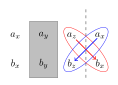
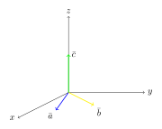

.. _s.vigrar:

Vigrar
======

Táknmál
-------
*Vigur* (e. vector) er stærðfræðilegt hugtak fyrir stærð sem hefur bæði stærð og stefnu.

Vigrar eru oftast táknaðir með striki eða ör fyrir ofan bókstafinn, :math:`\bar{a}` , :math:`\vec{a}` , en sumir setja strikið undir, :math:`\underline{a}` .
Í kennslubókum eru vigrar oft ekki yfirstrikaðir heldur aðeins feitletraðir, :math:`\boldsymbol{a}` .

Þeir eru jafnan teiknaðir sem örvar í hnitakerfi og lýst með hnitum (e. coordinates).
Hnit vigurs eru venjulegar tölur, líka kallaðar *skalarstærðir* (e. scalar), og lýsa staðsetningu endapunkts miðað við upphafspunkt.
Hvert hnit er tengt einum ás í hnitakerfinu, yfirleitt rétthyrnt, sem notað er og stærð hnitsins (tölunnar) lýsir lengd vigursins í þá átt. Hnitin geta bæði verið jákvæð og neikvæð (eða núll).

Vigrar geta bæði verið tvívíðir, í venjulegu :math:`xy`- hnitakerfi, eða þrívíðir, í :math:`xyz`- hnitakerfi. Vigrar eru yfirleitt ritaðir sem pör (eða þrennur) af hnitum sínum, lárétt eða lóðrétt.

.. figure:: ./myndir/vigrar/vigur2.svg
   :width: 60%
   :align: center

Ef vigurinn er tvívíður skrifum við:

.. math::

	\overline{a}= (a_x,a_y) = \begin{pmatrix} a_x \\ a_y \end{pmatrix}

Ef vigurinn er þrívíður þá skrifum við:

.. math::

		\overline{a}= (a_x,a_y,a_z) = \begin{pmatrix} a_x \\ a_y \\a_z \end{pmatrix}

þar sem :math:`a_x` er lengd vigursins :math:`\bar{a}` í stefnu :math:`x` - áss, :math:`a_y` er lengd vigursins :math:`\bar{a}` í stefnu :math:`y` - áss og :math:`a_z` er lengd vigursins :math:`\bar{a}` í stefnu :math:`z` - áss.

Lengd vigurs
~~~~~~~~~~~~

*Lengd* vigra er táknuð með lóðréttum strikum, algildismerkjum, :math:`|\bar{a}|`, eða einfaldlega bókstafnum án yfirstriksins, :math:`a`. Lengdina má reikna með jöfnu Pýþagórasar, ef vigur er tvívíður þá er heildarlengd vigurs:

.. math::

	|\bar{a}| = a = \sqrt{a_x^2 + a_y^2}

En ef hann er þrívíður þá er lengdin:

.. math::

	|\bar{a}| = a = \sqrt{a_x^2 + a_y^2+a_z^2}

.. figure:: ./myndir/vigrar/vigur.svg
   :width: 60%
   :align: center

Vigurinn á myndinni hér að ofan hefur lengd 4 eftir :math:`x`-ásnum og 3 eftir :math:`y`-ásnum, svo hnit hans eru :math:`a_x = 4` og :math:`a_y = 3`
og vigurinn :math:`\bar{a}` má þá rita:

.. math::
  \bar{a} = (a_x,a_y) = (4,3) = \begin{pmatrix} 4 \\ 3 \end{pmatrix}

Vigurinn á myndinni hér að ofan hefur því lengdina :math:`a = \sqrt{4^2 + 3^2} = 5` .

.. note::
  Stærð og stefna vigurs er óháð því hvar í hnitakerfinu hann er.

--------------------

.. eqt:: daemi-lengdvigurs

  **Æfingadæmi** Hver er lengd vigursins :math:`\vec{b}=\begin{pmatrix} 5 \\ -2 \end{pmatrix}` ?

  A) :eqt:`I` :math:`|\vec{b}| = 7`

  #) :eqt:`I` :math:`|\vec{b}| = \sqrt{21}`

  #) :eqt:`C` :math:`|\vec{b}| = \sqrt{29}`

  .. eqt-solution::
    Notum reglu Pýþagórasar:

		.. math::
			\begin{aligned}
				|\bar{b}| &= \sqrt{b_x^2 + b_y^2} \\
				&= \sqrt{(5)^2+(-2)^2}\\
				&=\sqrt{25+4}\\
				&= \sqrt{29}
			\end{aligned}

--------------------

Vigrar milli punkta
~~~~~~~~~~~~~~~~~~~

Algengt er að láta vigra liggja frá upphafspunkti hnitakerfisins (stöðu- eða staðarvigur) en það er hægt að reikna vigra á milli gefinna upphafs- og endapunkta.
Vigurinn frá punktinum :math:`A=(x_1,y_1)` til punktsins :math:`B=(x_2,y_2)` er:

.. math::
  \overline{AB} = (x_2-x_1,y_2-y_1) = \begin{pmatrix} x_2-x_1 \\ y_2-y_1 \end{pmatrix}

Ef við erum að skoða punkta í þrívíðu rúmi :math:`A=(x_1,y_1,z_1)` og :math:`B=(x_2,y_2,z_2)` þá er vigurinn á milli punktanna:

.. math::
  \overline{AB} = (x_2-x_1,y_2-y_1, z_2-z_1) = \begin{pmatrix} x_2-x_1 \\ y_2-y_1 \\z_2-z_1 \end{pmatrix}

.. tip::
  Reiknum vigurinn frá punktinum :math:`A=(-1,7)` til punktsins :math:`B=(5,2)` .

  **Lausn**

  .. math::
    \begin{aligned}
      \overline{AB} &= \begin{pmatrix} x_2-x_1 \\ y_2-y_1 \end{pmatrix}\\
      &= \begin{pmatrix} 5-(-1) \\ 2-7 \end{pmatrix} \\
      &= \begin{pmatrix} 6 \\ -5 \end{pmatrix}
    \end{aligned}

  .. figure:: ./myndir/vigrar/vigurtveirpkt.svg
    :align: center
    :width: 50%

  Vigurinn :math:`\begin{pmatrix} 6 \\ -5 \end{pmatrix}` er sá sami, hvort sem hann liggur á milli :math:`A` og :math:`B` eða frá upphafspunktinum til punktsins :math:`(6,-5)` .

Hallatala vigurs
~~~~~~~~~~~~~~~~

Stundum er talað um að tvívíður vigur hafi *hallatölu*  :math:`h=\frac{a_y}{a_x}` , ef :math:`a_x\neq 0` .
Tveir vigrar eru *samsíða* ef þeir hafa sömu hallatölu.

.. tip::
  Finnum vigur sem er samsíða :math:`\bar{a}=(-1,6)` og hefur lengdina 9.

  **Lausn**

  Hallatala :math:`\bar{a}` er :math:`h_{\bar{a}}=\frac{a_y}{a_x}=\frac{6}{-1}=-6` .
  Þá vitum við að vigurinn sem við leitum að, :math:`\bar{b}` , uppfyllir það sama:

  .. math::
    h_{\bar{b}}=\frac{b_y}{b_x}=-6

  sem er jafngilt því að :math:`b_y=-6b_x` .

  Skilyrðið að :math:`\bar{b}` þurfi að hafa lengdina 9 gefur að:

  .. math::
    |\bar{b}| = \sqrt{b_x^2+b_y^2} =9

  Setjum :math:`b_y=-6b_x` inn og fáum:

  .. math::
    \begin{aligned}
      9 &= \sqrt{b_x^2+b_y^2}\\
      &=\sqrt{b_x^2+(-6b_x)^2} \\
      &= \sqrt{b_x^2+36b_x^2} \\
      &=\sqrt{37b_x^2} \\
      &=b_x\sqrt{37} \\
      b_x&=\frac{9}{\sqrt{37}} \approx 1.480\\
      b_y&= -6b_x = \frac{-54}{\sqrt{37}} \approx -8.878
    \end{aligned}

  Vigur sem er samsíða :math:`\bar{a}=(-1,6)` og hefur lengdina 9 er því

  .. math::
    \bar{b}= \frac{1}{\sqrt{37}} \begin{pmatrix} 9 \\  -54 \end{pmatrix}

Að liða vigra
-------------

Vigra er annað hvort hægt að tákna með rétthyrndum hnitum, eins og við höfum gert hingað til, eða með pólhnitum, þá lýsum við vigri með lengd og stefnuhorni: :math:`\bar{a} = (a,\theta)` .
Hornið :math:`\theta` er skilgreint frá jákvæðum :math:`x`-ás og að vigrinum.
Með þessum upplýsingum er hægt að liða vigurinn eftir :math:`x`- og :math:`y`-ás með því að nota hornaföll.
`Hér <http://edbook.hi.is/undirbuningur_stae/Kafli07.html>`_ má finna efni um hornaföll.

Þættir vigursins eru föll af stefnuhorninu sem er yfirleitt merkt :math:`\theta` eða :math:`\phi` :

.. math::
  a_x = a\cos(\theta) \\
  a_y = a\sin(\theta)

þar sem :math:`a=|\bar{a}|` er lengd vigursins.

Myndrænt má ímynda sér að ljósi sé lýst á :math:`x`-ásinn með vasaljósi sem er hornrétt á ásinn.
:math:`x`-þáttur vigursins er þá eins og skuggi vigursins á :math:`x`-ásnum.
Þetta er líka kallað ofanvarp vigursins á :math:`x`-ásinn.

.. tip::
  Hér sjáum við aftur vigurinn frá því í upphafi kaflans:

  .. math::
    \bar{a}= (4,3) = \begin{pmatrix} 4 \\ 3 \end{pmatrix}

  en nú skulum við athuga hvernig við getum lýst honum með lengd og stefnuhorni.

  .. figure:: ./myndir/vigrar/mynd-vigur.svg
     :width: 60%
     :align: center

  Lengd vigursins er eins og áður 5, en stefnuhornið finnum við með því að skoða skammhliðarnar.

  .. math::
    \tan(\theta) = \frac{a_y}{a_x} = \frac{3}{4}\\
    \theta\approx 0.6435

  Vigurinn :math:`(4,3)` má því líka skrifa sem :math:`(a,\theta) = (5,0.6435)`

Öllum vigrum er hægt að lýsa með annað hvort lengdum í :math:`x`- og :math:`y`- stefnu eða með lengd og stefnuhorni.
Eins og við höfum séð er lítið mál að breyta á milli.

--------------------

.. eqt:: daemi-stefnuhorn

	**Æfingadæmi** Hvert er stefnuhorn vigursins :math:`\vec{b}=\begin{pmatrix} 5 \\ -2 \end{pmatrix}` ?

	A) :eqt:`I` :math:`21.8^{\circ}`

	#) :eqt:`C` :math:`-21.8^{\circ}`

	#) :eqt:`I` :math:`68.2^{\circ}`

	#) :eqt:`I` :math:`-68.2^{\circ}`

	 .. eqt-solution::
	   Við vitum að :math:`b_x=b\cos(\theta)` og :math:`b_y=b\sin(\theta)` og því fæst

			.. math::
				\begin{aligned}
					\frac{b_y}{b_x} &= \frac{b\cos(\theta)}{b\sin(\theta)} \\
					\frac{b_y}{b_x} &= \frac{\cos(\theta)}{\sin(\theta)} \\
					\frac{b_y}{b_x} &= \tan(\theta) \\
					\arctan\left(\frac{b_y}{b_x} \right) &= \theta\\
					\theta &= \arctan\left(\frac{-2}{5} \right) \\
					\theta &= -21.8^{\circ}
				\end{aligned}

			.. figure:: ./myndir/vigrar/mynd-vigur-daemi.svg
				:width: 60%
				:align: center

--------------------

Einingarvigrar
--------------
Einingarvigrar eru vigrar sem hafa lengdina 1, en þeir eru oft merktir með höttum (:math:`\hat{e}`) í staðinn fyrir yfirstrikum eða örvum.
Einingavigrarnir :math:`\hat{\imath}`, :math:`\hat{\jmath}` og :math:`\hat{k}` liggja samsíða :math:`x` - , :math:`y` - og  :math:`z` - ásunum í rétthyrndu hnitakerfi .

.. math::
  \begin{aligned}
  \hat{\imath} &= \begin{pmatrix} 1 \\0 \\0 \end{pmatrix} \\
  \hat{\jmath} &= \begin{pmatrix} 0 \\1 \\0 \end{pmatrix} \\
  \hat{k} &= \begin{pmatrix} 0 \\0 \\1 \end{pmatrix} \\
  \end{aligned}

Þeir eru líka stundum táknaðir með :math:`\hat{e}_x`, :math:`\hat{e}_y` og :math:`\hat{e}_z`

.. figure:: ./myndir/vigrar/einingarvigrar.svg
   :width: 50%
   :align: center

Einingarvigrarnir :math:`\hat{\imath}`, :math:`\hat{\jmath}` og :math:`\hat{k}` eru *línulega óháðir* (e. linearly independent), sem þýðir að engan þeirra er hægt að mynda úr hinum tveimur með samlagningu þeirra eða margföldun með tölu.
Hvernig sem þú teygir á og raðar saman :math:`\hat{\imath}` og :math:`\hat{\jmath}` færðu aldrei út :math:`\hat{k}` .
Þessi eiginleiki kemur til vegna þess að einingarvigrarnir eru allir *hornréttir* á hvorn annan.

Alla vigra má skrifa sem skalarstærðir margfaldaðar við einingarvigrana:

.. math::
  \bar{a} = (a_x, \; a_y, \; a_z ) = a_x \hat{\imath} + a_y \hat{\jmath} + a_z \hat{k}

Samlagning vigra
----------------
Þegar vigrar eru lagðir saman eru hnit eftir hverjum ás fyrir sig lögð saman.
Summa tveggja vigra :math:`\bar{a} = (a_x,a_y)` og :math:`\bar{b} = (b_x,b_y)` er:

.. math::
  \bar{c} = \bar{a} + \bar{b} = (a_x + b_x, a_y +b_y) = \begin{pmatrix} a_x+b_x \\ a_y+b_y \end{pmatrix}

Fyrir þrívíða vigra gildir sambærilegt, en summa tveggja vigra :math:`\bar{a} = (a_x,a_y,a_z)` og :math:`\bar{b} = (b_x,b_y,b_z)` er:

.. math::
  \bar{c} = \bar{a} + \bar{b} = (a_x + b_x, a_y +b_y, a_z+b_z) = \begin{pmatrix} a_x+b_x \\ a_y+b_y \\ a_z+b_z  \end{pmatrix}

.. tip::

  Leggjum saman vigrana :math:`\bar{a}=(4,3)` og :math:`\bar{b}=(1,3)` :

  .. math::
    \bar{a}+\bar{b}=(4,3) + (1,3) = (4+1, 3+3) = (5,6)

Myndrænt má ímynda sér að upphafspunktur seinni vigursins sé settur í endapunkt fyrri vigursins,
og summa þeirra er frá upphafspunkti fyrri vigursins til endapunkts þess seinni.

.. figure:: ./myndir/vigrar/vigrasamlagning.svg
   :width: 60%
   :align: center

.. note::
  Þegar vigrar eru lagðir saman þá leggjast lengdirnar yfirleitt **ekki** saman.
  Þó að :math:`\bar{c} = \bar{a} + \bar{b}` þýðir það **ekki** að :math:`c = a + b`.

  Í dæminu hér á undan er t.d.

  .. math::
    c = |\bar{c}| = \sqrt{5^2+6^2} \approx 7,8 \\
    a + b = \sqrt{4^2+3^2} + \sqrt{1^2+3^2} \approx 8,2

--------------------------------

Um samlagningu vigra gilda eftirfarandi reglur:

.. math::
  \begin{aligned}
    \bar{a} +\bar{b} &= \bar{b} + \bar{a} & \text{Víxlregla}\\
    (\bar{a}+\bar{b})+\bar{c} &= \bar{a} + (\bar{b}+\bar{c}) & \text{Tengiregla}
  \end{aligned}

--------------------------------

.. tip::
  Höfum þrjá punkta:

  .. math::
    \begin{aligned}
      A&=(x_1,y_1)=(1,2) \\
      B&=(x_2,y_2)=(4,5) \\
      C&=(x_3,y_3)=(3,-1) \\
    \end{aligned}

  Reiknum nú vigrana á milli punktanna: :math:`\overline{AB}, \overline{AC} \text{ og } \overline{BC}`

  .. math::
    \begin{aligned}
      \overline{AB} &= \begin{pmatrix} x_2-x_1 \\ y_2-y_1 \end{pmatrix}\\
      &=\begin{pmatrix} 4-1 \\ 5-2\end{pmatrix} =\begin{pmatrix} 3 \\3\end{pmatrix} \\
      &\\
      \overline{AC} &= \begin{pmatrix}x_3-x_1 \\ y_3-y_1 \end{pmatrix}\\
      &=\begin{pmatrix} 3 - 1 \\ (-1)-2 \end{pmatrix} =\begin{pmatrix} 2 \\ -3\end{pmatrix} \\
      &\\
      \overline{BC} &= \begin{pmatrix} x_3-x_2 \\ y_3-y_2 \end{pmatrix}\\
      &=\begin{pmatrix} 3 - 4 \\ (-1) -5 \end{pmatrix} = \begin{pmatrix} -1 \\ -6 \end{pmatrix} \\
    \end{aligned}

  .. figure:: ./myndir/vigrar/innskots.svg
    :align: center
    :width: 50%

  Hér eru punktarnir teiknaðir inn ásamt vigrunum :math:`\overline{AB}, \overline{AC} \text{ og } \overline{BC}` .

Af þessu dæmi má sjá *innskotsregluna* :

.. math::
  \overline{AC} = \overline{AB} + \overline{BC}

Innfeldi og krossfeldi
----------------------

Þegar vigur :math:`\bar{v}` er margfaldaður með tölu :math:`s` er hver þáttur vigursins margfaldaður með tölunni:

.. math::
    \begin{aligned}
        s \cdot \bar{v} &= s\cdot (v_x, v_y, v_z) \\
        &= (s \cdot v_x, s \cdot v_y, s \cdot v_z)
    \end{aligned}

Margfeldi vigra er tvenns konar, *innfeldi* (punktfeldi, e. dot product, scalar product) og *krossfeldi* (e. cross product, vector product).

Innfeldi
~~~~~~~~

**Innfeldi** tveggja vigra er táknað með punkti og útkoman er *tala*: :math:`c = \bar{a} \cdot \bar{b}` .
Ef þættir vigranna eru þekktir er innfeldið reiknað:

.. math::
  \boxed{
  \bar{a} \cdot \bar{b} = a_x b_x + a_y b_y
  }

eða, ef vigrarnir eru þrívíðir:

.. math::

	\bar{a} \cdot \bar{b} = a_x b_x + a_y b_y + a_z b_z

.. tip::
    Reiknum innfeldi vigranna :math:`\bar{a}=(7,8)` og :math:`\bar{b}=(-1,3)` :

    **Lausn**

    .. math::
      \bar{a} \cdot \bar{b} = a_x b_x + a_y b_y = 7\cdot (-1)+ 8\cdot 3 = -7+24 =17

Innfeldið má líka reikna með:

.. math::
  \bar{a} \cdot \bar{b} = a b \cos{\phi}

þar sem :math:`\phi` er hornið milli :math:`\bar{a}` og :math:`\bar{b}` þegar þeir hafa sama upphafspunkt.

.. note::
  **Tveir vigrar eru hornréttir ef innfeldi þeirra er núll.**

.. tip::
    Reiknum hornið á milli vigranna :math:`\bar{a}=(2,4)` og :math:`\bar{b}=(4,2)` :

    .. figure:: ./myndir/vigrar/innfeldi.svg
      :align: center
      :width: 60%

    **Lausn**

    Við vitum að :math:`\bar{a} \cdot \bar{b} = a b \cos{\phi}` , þar sem :math:`a` og :math:`b` eru lengdir vigranna.
    Lengdirnar eru:

    .. math::
      \begin{aligned}
        a = \sqrt{a_x^2 + a_y^2} = \sqrt{2^2 + 4^2} = \sqrt{20} \\
        b = \sqrt{b_x^2 + b_y^2} = \sqrt{4^2 + 2^2} = \sqrt{20}
      \end{aligned}

    Reiknum innfeldi vigranna:

    .. math::
      \bar{a} \cdot \bar{b} = a_x b_x + a_y b_y = 2\cdot 4+ 4\cdot 2 = 16

    Því er

    .. math::
      \begin{aligned}
        \bar{a} \cdot \bar{b} &= a b \cos{\phi} \\
        \cos{\phi} &= \frac{\bar{a} \cdot \bar{b}}{a b} = \frac{16}{\sqrt{20} \cdot \sqrt{20}} = \frac{16}{20}\\
        \phi &= 36.8 ° = 0.644 \text{Rad}
      \end{aligned}

Krossfeldi
~~~~~~~~~~

**Krossfeldi** (e. cross product) er táknað með krossi og útkoman er *vigur*: :math:`\bar{c} = \bar{a} \times \bar{b}` . Krossfeldi koma mikið fyrir í eðlisfræði, sérstaklega í tengslum við rafsegulkrafta.
Krossfeldi tveggja vigra :math:`\bar{a}=(a_x,a_y,a_z)` og :math:`\bar{b}=(b_x,b_y,b_z)` er:

.. math::
  \boxed{
    \bar{c}=\bar{a} \times \bar{b} =(a_y b_z - a_z b_y, \quad a_z b_x - a_x b_z, \quad a_x b_y - a_y b_x)
    }

Þetta er löng runa til að muna utan að, en hér eftir kemur aðferð til að reikna krossfeldi.

--------------

Skrifum vigrana upp í tvær línur:

.. math::
  \begin{aligned}
    \bar{a} \quad &\rightarrow \quad & a_x \quad a_y \quad a_z \\
    \bar{b} \quad &\rightarrow \quad & b_x \quad b_y \quad b_z
  \end{aligned}

Fyrsta stak krossfeldisins fæst með því að "fela" fyrsta dálkinn (:math:`a_x` og :math:`b_x`) og margfalda hin stökin í kross og finna mismun. Þetta skýrist best grafískt:

.. figure:: ./myndir/vigrar/kr-utskyring1.svg
  :width: 50%
  :align: center

Til að finna fyrsta stakið hunsum við fyrsta dálkinn, margföldum saman hornalínuna :math:`\searrow` og drögum síðan frá margfeldið af hornalínunni :math:`\swarrow`.
Fyrsta stak krossfeldisins er því

.. math::

  c_x=a_yb_z - a_zb_y

------------------

Til að finna annað stakið bætum við fyrsta dálkinum aftur við aftast, hunsum annan dálkinn, margföldum í kross yfir þriðja og fjórða dálkinn; fyrst :math:`\searrow` og  drögum síðan :math:`\swarrow` frá.
Annað stak krossfeldisins er því

.. math::

	c_y=a_zb_x - a_xb_z

-----------------

.. figure:: ./myndir/vigrar/kr-utskyring3.svg
  :width: 50%
  :align: center

Við finnum þriðja stak krossfeldisins með því að hunsa þriðja dálkinn og margfalda í kross yfir fyrsta og annan dálkinn. Fáum

.. math::

	c_z=a_xb_y-a_yb_x

----------------

Þannig sjáum við að krossfeldi vigranna :math:`\bar{a} = (a_x,a_y,a_z)` og :math:`\bar{b} = (b_x,b_y,b_z)` er:

.. math::
  \bar{c}=\bar{a} \times \bar{b} = (a_yb_z - a_zb_y,a_xb_z - a_zb_x,a_xb_y-a_yb_x)

----------------

Útkoma krossfeldisins er vigur sem er hornréttur á bæði :math:`\bar{a}` og :math:`\bar{b}`. Hér er :math:`\bar{c} =\bar{a} \times \bar{b}`. Stefna :math:`\bar{c}` ákvarðast af **hægri** handar reglunni:

.. figure:: ./myndir/vigrar/hhr.svg
    :width: 60%
    :align: center

Lengd krossfeldis :math:`\bar{a} \text{ og } \bar{b}` má reikna úr frá lengdum vigranna og horninu á milli þeirra.

.. math::
  |\bar{a} \times \bar{b}| = |\bar{a}| |\bar{b}| \sin(\phi)

.. note::
  Þegar krossfeldi er reiknað skiptir því máli hvor vigurinn er á undan.

  .. math::
    \bar{a} \times \bar{b} = - \bar{b} \times \bar{a}

.. tip::
    Reiknum krossfeldi vigranna :math:`\bar{a}=(1,2,3)` og :math:`\bar{b}=(4,5,6)`.

    **Lausn**

    .. math::
      \begin{aligned}
        \bar{a} \times \bar{b} &= (a_y b_z - a_z b_y)\hat{\imath} + (a_z b_x - a_x b_z)\hat{\jmath} + (a_x b_y - a_y b_x)\hat{k} \\
        &= (2\cdot 6-3\cdot 5)\hat{\imath} + (3\cdot 4 - 1 \cdot 6) \hat{\jmath} + ( 1\cdot 5 - 2\cdot 4) \hat{k}\\
        &= -3 \hat{\imath} +6 \hat{\jmath} - 3\hat{k}\\
        &= (-3,6,-3)
      \end{aligned}

-------------------

.. eqt:: daemi-krossfeldi

  **Æfingadæmi** Reiknið krossfeldi vigranna :math:`\overline{a}= (-1,3)` og :math:`\overline{b}=(3,1)`

  A) :eqt:`I` :math:`(0,0,6)`

  #) :eqt:`I` :math:`0`

  #) :eqt:`C` :math:`(0,0,-6)`

  #) :eqt:`I` :math:`6`

  .. eqt-solution::
    Þegar við reiknum krossfeldi vigra sem liggja í :math:`xy`-planinu, þá setjum við :math:`a_z=0` og :math:`b_z=0`.
    Við skulum nota formúluna sem var gefin hér að ofan

    .. math::

      \begin{aligned}
        \bar{a} \times \bar{b} &= (a_y b_z - a_z b_y)\hat{\imath} + (a_z b_x - a_x b_z)\hat{\jmath} + (a_x b_y - a_y b_x)\hat{k} \\
        &= (3\cdot 0- 0\cdot 1)\hat{\imath}  + (0\cdot 3- (-1)\cdot 0 )\hat{\jmath} + ((-1)\cdot 3 - 3\cdot 1)\hat{k}\\
        &= (0,0,-6)
      \end{aligned}

    Þar sem :math:`\overline{a}` og :math:`\overline{b}` voru báðir í :math:`xy`- planinu og krossfeldi þeirra þarf að vera hornrétt á þá báða þá erum við ekki hissa þó að niðurstaðan okkar sé að krossfeldið sé samsíða :math:`z`- ásnum.

------------------

.. tip::
	Reiknum hornið milli vigranna :math:`\bar{a}=(1,2,3)` og :math:`\bar{b}=(4,5,6)`.

	**Lausn**

	Þetta dæmi er bæði hægt að leysa með því að nota regluna um krossfeldi: :math:`|\bar{a} \times \bar{b}| = |\bar{a}| |\bar{b}| \sin(\phi)` eða regluna um innfeldi: :math:`\overline{a}\cdot \overline{b} = ab\cos(\phi)` og auðvitað er niðurstaðan sú sama sama hvor reglan er notuð.

	Notum nú regluna :math:`|\bar{a} \times \bar{b}| = |\bar{a}| |\bar{b}| \sin(\phi)` og byrjum á því að reikna lengd vigranna:

	.. math::
		\begin{aligned}
			|\bar{a}| &=\sqrt{1^2+2^2+3^2} = \sqrt{14} \\
			|\bar{b}| &=\sqrt{4^2+5^2+6^2} = \sqrt{77} \\
			|\bar{a} \times \bar{b}| &= \sqrt{(-3)^2+6^2+(-3)^2}=\sqrt{54}
		\end{aligned}

	Þá fáum við:

	.. math::
		\begin{aligned}
			\sin(\phi) &= \frac{|\bar{a} \times \bar{b}| }{|\bar{a}| |\bar{b}|} \\
			&=\frac{\sqrt{54}}{\sqrt{14}\sqrt{77}} \\
			&=\sqrt{\frac{54}{1078}}\\
			\phi&\approx0.226 \text{ Rad} \\
			\phi&\approx 13° \\
		\end{aligned}
