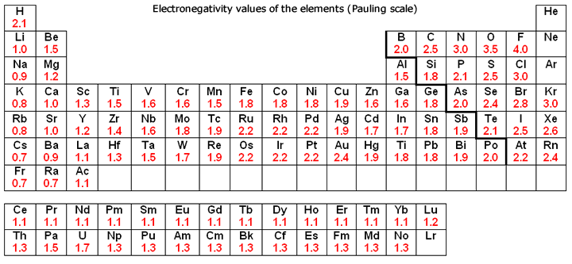

.. _s.Efnatengi:

Efnatengi
=========

Þegar atóm raða sér saman í sameindir geta þau haft á milli sín tvenns konar tengi, *jónatengi* (e. ionic bonding) eða *samgild tengi* (e. covalent bonding). :math:`\require{mhchem}`

Samgild tengi
-------------

Atóm hafa möguleika á að deila með sér rafeindum, þannig að rafeindirnar halda kjörnum atómanna saman. Þetta hjálpar atómunum að uppfylla átturegluna (Sjá 4. kafla), en þessar sameiginlegu rafeindir geta fyllt ysta hvolfið á báðum atómum.

Samgild tengi geta verið annaðhvort *skautuð* (e. polarized) eða *óskautuð* (e. non polar). Samgild tengi eru sögð skautuð þegar rafeindirnar í tenginu dreifast ójafnt milli atómanna og valda hleðslumun á kjörnunum. Rafeindirnar dreifast ójafnt vegna mismikillar *rafdrægni* frumefnanna. *Rafdrægni* er í rauninni mælikvarði á hversu fast atóm halda í rafeindir, ef mikill munur er á rafdrægni atóma sem tengd eru með samgildu tengi haldast rafeindirnar nær því atómi sem hefur meiri rafdrægni og hefur það atóm þá *neikvæða hluthleðslu* (e. partial negative charge) en það verður ekkert farið frekar í það í þessu námsefni. Ef mjög mikill munur er á rafdrægni frumefna er tengið á milli þeirra *jónatengi*, þ.e. þegar báðar rafeindirnar í tenginu koma frá sama atóminu, þ.e. því atómi sem er með meiri rafdrægni.
Sjá má *rafdrægni* (e. electronegativity) frumefnanna hér að neðan.

Eins og sést þá eykst rafdrægni **til hægri** og **upp** lotukerfið. Rafdrægni er einnig kallað *rafneikvæðni*.

Til að finna hvernig tengi er milli efna, er hægt að nota þessi gildi fyrir rafdrægni.

- Ef munurinn á gildunum er 0-0,4 er þetta óskautað samgilt tengi.
- Ef munurinn er 0,5-1,6 er tengið skautað samgilt.
- Ef munurinn er meiri en það, þ.e. 1,7-4,0 er það jónatengi.

.. tip::

 **Hvernig er tengin milli vetnis og súrefnis í vatni?**

 Vetni hefur rafdrægni 2,1 en súrefni 3,5. Þetta gefur rafdrægnimun upp á 1,4 og tengin flokkast því sem *skautuð samgild*.

 .. figure:: ./myndir/sameindir/rafeindathettleiki.png
   :align: center
   :width: 40%

 Hérna táknar rautt mikinn rafeindaþéttleika en blátt rafeindasnauð svæði. Súrefnið er rafneikvæðara og tekur því rafeindirnar til sín en eftir sitja vetnisatómin rafeindasnauð.

Lewis myndir
~~~~~~~~~~~~

*Lewis Myndir* eða *punktformúlur* er leið til að sýna samgild tengi og *stök rafeindapör* (e. lone pair) á sameindum. Gildisrafeindir eru táknaðar með punktum
sem dreifast um efnið á sem stöðugastan máta. Til að teikna Lewis mynd af sameind eru nokkur skref:

1. Ákveða heildarfjölda :ref:`gildisrafeinda <s.gildisrafeindir>` .

2. Setja minnst rafneikvæða atómið í miðjuna, raða hinum í kring og tengja sameindina með tveggja rafeinda tengi milli allra atómanna.

3. Nú skal reyna að dreifa eftirstandandi rafeindum sem stökum rafeindapörum svo að áttureglan sé uppfyllt á hverju atómi. Ef það er hægt þá má sleppa næsta skrefi.

4. Ef ekki eru nógu margar rafeindir í sameindinni til að uppfylla átturegluna með stökum rafeindapörum er hægt að búa til *tvítengi* milli atóma með því að
   bæta við 2 rafeindum í tengið. Ef það dugar ekki er hægt að bæta við tveimur enn og gera *þrítengi*.

5. Athuga *formlega hleðslu*. Þetta er gert með því að taka saman fjölda rafeidna í stökum rafeindapörum og helming rafeinda í tengjum, þ.e.a.s. rafeindir "þeirra megin" í tengjunum.
   Þessi fjöldi er svo borinn saman við gildisrafeindir og atóm er gefin jákvæð hleðsla ef þessar rafeindir eru færri, og öfugt.

6. Reyna að lágmarka formlegu hleðsluna, sem og láta hana passa fyrir rafdrægni frumefnanna. Þ.e. láta rafneikvæðari frumefnið hafa neikvæðari hleðslu. Passa þó að brjóta ekki átturegluna.

.. tip::

	**Hver er Lewis mynd** :math:`\ce{CO2}` ?

  1. Kolefni hefur 4 gildisrafeindir og súrefni 6. Höfum því 4+6+6=16 gildisrafeindir.
  2. Kolefni er minna rafneikvætt en súrefni og fer því í miðjuna. Þá fæst:

  .. figure:: ./myndir/sameindir/lewis1.svg
    :align: center
    :width: 20%

  3. Nú eru komnar 4 rafeindir af 16 á myndina. Ekki er hægt að uppfylla átturegluna umhverfis hvert atóm með því að raða eftirstandandi 12 rafeindum í pörum umhverfis atómin, heldur þyrfti 16 til þess.
  4. Það vantar því 4 upp á og bætum því 4 rafeindum við tengin. Þetta gefur annaðhvort tvö tvítengi eða stakt þrítengi. Setjum tvö tvítengi, því þá er áttureglan uppfyllt umhverfis hvert atóm, og setjum tvö rafeindapör á hvort súrefnisatómið.

    .. figure:: ./myndir/sameindir/lewis2.svg
      :align: center
      :width: 20%

    Áttureglan er nú uppfyllt umhverfis öll atómin.

  5. Nú skal athuga formlegu hleðsluna. Súrefnin hafa 4 stakar rafeindir og 4 rafeindir í tengjum, þar af 2 sínum megin, þ.e. 6 rafeindir í heildina. Súrefni hefur 6 gildisrafeindir og því er formlega hleðslan 0 umhverfis súrefnisatómin. Kolefni hefur 8 rafeindir í tengjum, þar af 4 sínum megin. Kolefni hefur 4 gildisrafeindir og formlega hleðslan er því 0 umhverfis kolefnisatómið. Formlega hleðslan er því 0 í allri sameindinni og það er ekki hægt að lágmarka hana með því að færa til rafeindir.

.. warning::

	Áttureglan gildir ekki fyrir allar sameindir og til eru þrjár undartekningar:

  Oddatala gildisrafeinda.
    Ekki er hægt að uppfylla átturegluna fyrir efni s.s. :math:`\ce{ClO}` en þar eru einungis :math:`6+7=13` gildisrafeindir. Klór mun því einungis hafa 7 rafeindir.

  Of fáar rafeindir.
    Fyrir efni sem innihalda bór og beryllíum, er hægt að mynda stöðugar sameindir án þess að uppfylla átturegluna, s.s. :math:`\ce{BeCl2}` og :math:`\ce{BF_3}`. Einnig mun vetni alltaf hafa að hámarki 2 rafeindir.

  Of margar rafeindir.
    Stærri frumefni, s.s. lota 3 eða neðar, geta víkkað út ysta rafeindahvelið með :math:`d`-svigrúmi. Þessi frumefni geta því haft fleiri en 8 rafeindir á ysta hveli og yfirskjóta átturegluna. Dæmi um þetta væri :math:`\ce{PF_5}` en þar hefur fosfór 10 rafeindir.

Vok myndir
~~~~~~~~~~

Þetta er ekki öll sagan, en fyrir sum efni eru fleiri en ein möguleg uppröðun. Þá þarf að lýsa Lewis-myndum með *vok myndum* (e. resonance), sem sést best með dæmi.

.. tip::

 **Hver er Lewis mynd fyrir nítrat jón,** :math:`\ce{NO_3^-}` ?

 1. Nitur hefur 5 gildisrafeindir og súrefni hefur 6, *en jónin hefur -1 hleðslu svo það bætist við ein auka rafeind*. Þá eru :math:`5+3\cdot6+1=24` gildisrafeindir.

 2. Nitrið fer í miðjuna og 6 rafeindir fara í samgild tengi til súrefnisatómanna. Þá fæst:

 .. figure:: ./myndir/sameindir/nitrid1.svg
   :align: center
   :width: 20%

 3. Núna eru 18 rafeindir eftir en það vantar 20 til að uppfylla átturegluna alls staðar, 6 á hvert súrefnisatóm og 2 á nituratómið.
 4. Það vantar því tvítengi einhvers staðar, en *hvar?*  Hvert og eitt N-O tengi er jafngildur kandídat. Hérna koma vokmyndir við sögu, en þá teiknum við upp *alla* möguleikana, og fáum þrjár mismunandi vok myndir.

   .. figure:: ./myndir/sameindir/nitrid2.svg
     :align: center
     :width: 60%

   Á öllum myndunum er áttureglan uppfyllt fyrir hvert atóm.

 5. Nitrið hefur 4 rafeindir kringum sig, en hafði 5 gildisrafeindir og fær því +1 hleðslu. Þau súrefnisatóm sem eru ekki tvítengd hafa 7 rafeindir kringum sig, og fá því -1 hleðslu. Þriðja súrefnisatómið hefur 6 kringum sig og því hleðslulaust.

   Heildarhleðslan er því +1-1-1=-1. Þetta stemmir við neikvæðu hleðslu nítratsins.

Hafa ber í huga að í náttúrunni finnast ekki sameindir sem líkjast stakri vokmynd, heldur samblöndu af öllum þremur.

Til er annar og algengari ritháttur fyrir samgild tengi, og það er að teikna strik í stað tveggja punkta.

Nafnakerfi fyrir sameindir
~~~~~~~~~~~~~~~~~~~~~~~~~~

Fyrir tvíatóma sameindir kemur fyrra frumefnið óbreytt en seinna frumefnið fær -íð (e. ide) endingu. Undantekningin á þessu eru eftirfarandi frumefni:

Kolefni
  Efni með kolefni (C) sem fyrra frumefni byrja á *kol-*

Brennisteinn
  Efni með brennistein (S) sem seinna frumefni fá endinguna -*súlfíð*

Súrefni
  Efni með súrefni (O) sem seinna frumefni fá endinguna -*oxíð*

Nitur
  Efni með nitur (N) sem seinna frumefni fá endinguna -*nítríð*

Vetni
  Efni með vetni (H) sem seinna frumefni fá endinguna -*hýdríð*

Sameindir geta þó haft mismunandi fjölda af hvoru atómi, en nituroxíð getur lýst :math:`NO`, :math:`NO_2`, :math:`N_2O` o.s.fr. Til aðgreiningar eru notuð eftirfarandi *forskeyti* til að lýsa fjölda atóma í sameind:

.. raw:: html

  

  <table style= "width:100%" class="colwidths-given docutils center" border="1">
  <colgroup>
  <col width="14%">
  <col width="19%">
  <col width="14%">
  <col width="19%">
  <col width="14%">
  <col width="19%">
  </colgroup>
  <tbody valign="top">
  <tr class="row-odd"><td>1</td>
    <td>mónó-</td>
    <td>5</td>
    <td>penta-</td>
    <td>9</td>
    <td>nóna-</td>
  </tr>
  <tr class="row-even"><td>2</td>
    <td>dí-</td>
    <td>6</td>
    <td>hexa-</td>
    <td>10</td>
    <td>deca-</td>
  </tr>
    <tr class="row-odd"><td>3</td>
      <td>trí-</td>
      <td>7</td>
      <td>hepta-</td>
      <td>11</td>
      <td>undeca-</td>
    </tr>
    <tr class="row-even"><td>4</td>
      <td>tetra-</td>
      <td>8</td>
      <td>octa-</td>
      <td>12</td>
      <td>dódeca-</td>
    </tr>
  </tbody>
  </table>

Eina breyting á þessu er ef seinna frumefnið byrjar á sérhljóð þá er sleppt -a eða -ó endingu í forskeyti. Einnig er ekki vaninn að byrja nafn á mónó-, þ.e. ekki þarf að tilgreina að það sé eitt atóm af fyrra frumefni.

.. tip::

 **Hvert er nafn** :math:`\ce{SF_6}` **og** :math:`\ce{OsO_4}`? **Hver er efnaformúla koltetraklóríðs?**

 - :math:`\ce{SF6}` er brennisteinshexaflúoríð
 - :math:`\ce{OsO4}` er osmíumtetroxíð. Hérna er sleppt -a í enda forskeytisins.
 - Koltetraklóríð er :math:`\ce{CCl4}`

Jónatengi
---------

Frumefni eltast við að uppfylla átturegluna, þ.e. þau vilja hafa átta gildisrafeindir. Frumefni í flokki alkalímálma hefur eina gildisrafeind, en frumefni í flokki halógena hefur sjö. Alkalímálmurinn vill losa sig við þessa einu rafeind til þess að fá stöðuga rafeindahýsingu eðalgastegundarinnar á undan.
Sambærilega vill halógen fá eina rafeind enn til að fá átta gildisrafeindir og þar með rafeinaskipun eðalgastegundarinnar í lotunni. Þannig eiga efni til að senda rafeindir sín á milli og *jónast*.

Dæmi um þetta væri t.d. *jónaefnið* borðsalt, :math:`NaCl` en þar hefur natríum gefið klóríð rafeind.
Natríum jónin verður við það plúshlaðin en klóríð jónin neikvætt hlaðin. Þetta er táknað sem :math:`\ce{Na+}` og :math:`\ce{Cl-}`.

Þessi mismunur í hleðslu veldur *rafkröftum* sem heldur jónunum saman. Jónaefnið sem heild er þá með hlutlausa hleðslu.

.. tip::

 **Hver er rafeindahýsing** :math:`\ce{Na+}` **og** :math:`\ce{Cl-}`?

 Berum saman rafeindahýsingu óhlöðnu atómanna og jónanna:

  .. math::
    \begin{array}{ c | c | c | c }
    \ce{Na} & \ce{Na+} &\ce{Cl} &\ce{Cl-}\\
      \hline
    [\ce{Ne}]3s^1 &[\ce{Ne}] & [\ce{Ne}]3s^2 3p^5 & [\ce{Ne}]3s^23p^6 \text{ eða } [\ce{Ar}] \\
    \end{array}

 Þá sést að rafeindahýsing jónanna er mun fýsilegri því atómin fá rafeindaskipan eðalgasanna neon og argon. Þess vegna eru alkalímálmar og halógenar mjög hvarfgjarnir og finnast sjaldan sem hreint frumefni.

Þetta eru þó ekki einu gerðirnar af jónum, en jarðalkalímálmar (t.d. kalsíum) hafa tvær gildisrafeindir. Til þess að uppfylla átturegluna getur það gefið tvær rafeindir og fengið hleðsluna 2+, þ.e :math:`\ce{Ca^{2+}}`.
Til þess að kalsíum myndi jónaefni þarf því aðra jón með hleðsluna 2-, eða tvær jónir með hleðslu 1-, sem gerist t.d. hjá :math:`\ce{CaCl2}`.

Hliðarmálmar get einnig jónast og tekið hleðslu á bilinu +1 til +4. Sum frumefni geta jafnvel myndað fleiri en eina gerð af jón, t.d. járn. Járn getur losað sig við 2 eða 3 rafeindir og því myndað bæði :math:`\ce{Fe^{2+}}` eða :math:`\ce{Fe^{3+}}`.

Jónir geta einnig verið flóknari en stök frumefni og myndað þá *fjölatóma jónir* (e. polyatomic ions) eða *sameindajónir*, s.s. súlfat, :math:`\ce{SO_4^{3-}}` eða ammóníum :math:`\ce{NH_4^+}`.

Jónir finnast sem vökvar og fast efni, en aldrei á gasfasa. Það er vegna þess að þau þurfa að mynda kristalgrind, þar sem jákvæðar jónir og neikvæðar eru á víxl. Þessa grind er ekki hægt að viðhalda sem gas. Vegna þessarar grindar eru jónaefni hörð og brothætt, á föstu formi.  Þau geta einnig verið uppleyst
í vökva og leitt rafmagn. Þess má geta að afjónað vatn, þ.e. vatn með engum jónum í, leiðir *ekki* rafmagn. Vatn og rafmagn hefur lengi verið talið hættuleg blanda, en það er í raun jónirnar í vatninu og rafmagn.

Nafnakerfi fyrir jónaefni
~~~~~~~~~~~~~~~~~~~~~~~~~

Jákvætt hlaðnar jónir eru kallaðar *katjónir* (e. cations), en neikvætt hlaðnar jónir *anjónir* (e. anions).

Fyrir einatóma jónir, er auðvelt af gefa jónunum nafn. Katjónir fá enga endingu, en anjónir fá -íð (e. ide) endingu. Dæmi um þetta væri t.d. að kalsíum jónir og klóríð jónir
mynda svo kalsíumklóríð. Þetta er eins og fyrir sameindir en munurinn er að ekki þarf að taka fram fjöldan af hvorri jón, heldur er hlutfallið gefið með hleðslunni. Til dæmis væri kalsíumklóríð :math:`\ce{CaCl_2}` þar sem kalsíum jónir hafa hleðsluna 2+ þarf tvær klóríð jónir svo að efnið verði hlutlaust.

Fyrir þá hliðarmálma sem geta tekið mismunandi hleðslu er síðan venjan að tilgreina hleðslu með rómverskum stöfum í sviga eftir katjóninni. Til dæmis væri jónin :math:`\ce{Fe^{2+}}` járn(II) og :math:`\ce{Pb^{4+}}` blý(IV).
Þetta er ekki gert fyrir þau frumefni sem jónast aðeins á einn hátt.

Nafnakerfið fyrir *oxóanjónir* (e. oxyanions) fylgir öðrum reglum, en það eru fjölatóma jónir þar sem frumefni binst við súrefni (oxast) og myndar jón. Frumefni getur oft bundist mismunandi fjölda af súrefni og tekur þá mismunandi endingar.

Hægt er að líta á jónina sem endar á *-at* (e.-ate) sem upphafspunkt og tökum sem dæmi klórat :math:`\ce{ClO_3^-}`. Ef það bætist við eitt súrefnisatóm, fær jónin forskeytið *per-* og kallast þá perklórat :math:`\ce{ClO_4^-}`. Ef jónin hinsvegar minnkar um eitt súrefnisatóm
fær jónin endinguna *-ít* (e. -ite) og verður klórít :math:`\ce{ClO2^-}`. Ef hún minnkar aftur um súrefnsatóm fær jónin forskeytið *hýpó-* (e.hypo) og verður þá hýpóklórít :math:`\ce{ClO^-}`. Fleiri dæmi má sjá í þessari töflu:

+-----------------------------------------+-----------------------------------+-------------------------------+---------------------------------------+
|hýpó-...-ít     (:math:`- 2\ce{O}`)      |    -ít (:math:`- \ce{O}`)         |           -at                 |per-...-at (:math:`+\ce{O}`)           |
+======================+==================+======================+============+======================+========+======================+================+
| :math:`\ce{ClO^-}`   | hýpóklórít       | :math:`\ce{ClO_2^-}` | klórít     | :math:`\ce{ClO_3^-}` | klórat | :math:`\ce{ClO_4^-}` | perklórat      |
+----------------------+------------------+----------------------+------------+----------------------+--------+----------------------+----------------+
| :math:`\ce{BrO^-}`   | hýpóbrómít       | :math:`\ce{BrO_2^-}` | brómít     | :math:`\ce{BrO_3^-}` | brómat | :math:`\ce{BrO_4^-}` | perbrómat      |
+----------------------+------------------+----------------------+------------+----------------------+--------+----------------------+----------------+
|:math:`\ce{PO_2^{3-}}`| hýpófosfít       |:math:`\ce{PO_3^{3-}}`| fosfít     |:math:`\ce{PO_4^{3-}}`| fosfat |                                       |
+----------------------+------------------+----------------------+------------+----------------------+--------+---------------------------------------+
|:math:`\ce{SO_2^{2-}}`| hýpósúlfít       |:math:`\ce{SO_3^{2-}}`| súlfít     |:math:`\ce{SO_4^{2-}}`| súlfat |                                       |
+----------------------+------------------+----------------------+------------+----------------------+--------+---------------------------------------+
|                                         |:math:`\ce{NO_2^{-}}` | nítrít     | :math:`\ce{NO_3^{-}}`| nítrat |                                       |
+-----------------------------------------+----------------------+------------+----------------------+--------+---------------------------------------+
|                                                                             |:math:`\ce{CO_3^{2-}}`|karbónat|                                       |
+-----------------------------------------------------------------------------+----------------------+--------+---------------------------------------+

Þessi listi er ekki tæmandi og athuga ber að ekki er til allar fjórar jónir fyrir öll efni. Þessi nafnagift er í grunninn byggð á
*oxunartölu* (e. oxidation state) frumefnisins sem stendur með súrefninu, en farið verður í þær í næsta kafla.

Eins og sést á töflunni helst fjöldi súrefnisatóma í jónunum ekki alveg í hendur við hvaða endingu og forskeyti jónirnar fá, t.d. hefur súlfat 4 súrefnisatóm en karbónat aðeins 3, ástæðan fyrir þessu er að þetta nafnakerfi var búið til af Antoine Lavoiser á 18. öld, áður en atómkenning Daltons kom fram.

Málmtengi
---------

Málmatóm tengjast hver öðrum með svokölluðum *málmtengjum* (e. metallic bonding). Þá gefa málmarnir frá sér rafeindir sem ferðast nánast frjálsar um og halda plúshlöðnu málmatómunum saman. Þetta myndar
því eins konar fylkingu af katjónum í sjó af rafeindum. Þó þessi lýsing sé ekki hárrétt þá dugar hún í bili. Þetta er ólíkt hinum efnatengjunum að því leyti að ekki þarf ákveðin hlutföll af efnum. Þessi tengi leiða af sér *fimm* einkennandi eiginleika.

Góð varmaleiðni
  Varmi er hreyfiorka atóma og hiti er þá hve hratt atómin hreyfast. Þegar atóm hitna þá hita þau atóm í kringum sig með árekstrum, en við árekstra dreifist varmaorkan. Í málmtengjum eru atómin þétt saman og frjálsari. Þar af leiðandi eru árekstrar örir og málmar hafa mikla varmaleiðni.

Góð rafleiðni
  Rafstraumur er flutningur rafeinda í efni en í málmtengjum geta rafeindirnar hreyfst nánast frjálsar. Því er góð rafleiðni í málmum.

Mótanleiki
  Þar sem að málmatóm mynda ekki hefðbundin efnatengi sín á milli í kristalbyggingunni, er hægt að móta málma án þess að þeir brotni. Losaralegu tenglsin milli katjónanna og rafeindar geta brotnað og endurnýjað sig auðveldlega annars staðar.

Gljái
  Hægt er að pússa upp málma svo að ysta lag "rafeindasjávarins" endurkasti ljósi. Málmar eru ógegnsæir þegar þeir ná ákveðnari lágmarksþykkt.

Hár eðlismassi, hátt bræðslumark og suðumark.
  Málmatómin liggja þétt saman sem veldur háum eðlismassa. Málmtengin eru einnig í heildina sterk og því þarf mikinn hita til að rjúfa þau. Þess vegna er bræðslumark og suðumark málma hátt. Undantekning á þessu er *kvikasilfur*, en það er eini málmurinn sem er fljótandi við stofuhita og svo má einni nefna *gallíum* sem bráðnar við 29,76°C.

Millisameindakraftar
--------------------

Auk innansameindakraftana, eru einnig millisameindakraftar sem halda sameindum saman og mynda þannig hlutina sem við þekkjum.
Helstu kraftarnir kallast  *Van der Waals* kraftar, þeir eru *tvípóls-tvípóls kraftar*, *London kraftar* og *vetnistengi*.

Þessir kraftar byggjast allir á rafeindamismun, sem heldur sameindunum saman eins og seglar. Orsök og styrkur þessara rafeindamismuns er þó mismunandi.

Fasar
~~~~~

Efni getur einna helst verið í þremur fösum (e. phase); *fast efni*, *vökvaformi* og á *gasformi.*

- Efni á föstu formi mynda skipulagða kristalbyggingu og hver sameind er haldin á sínum stað með millisameindakröftum.

- Efni á vökvaformi hafa rofið millisameindakrafa að einhverju leyti og sameindirnir eru því ekki lengur fastar á sínum stað í kristalbygginu. Eftirstandandi millisameindakraftar halda þó sameindunum saman sem heild.

- Efni á gasformi hefur algjörlega slitið alla millisameindakrafta og hver sameind heldur sína leið. Efni á gasfas getur því dreift sér og fyllt upp í það rými sem það er í.

Efni skipta um fasa við mismunandi hitastig. Hitastig efnis sem skilur að vökvaform og fast form er kallað *bræðslumark* (e. melting point) efnisins og hitastigið sem skilur að vökvaform og gasfasa kallast *suðumark* (e. boiling point) efnisins.
Við þessi hitastig byrjar efnið að nota viðbættan varma í að rjúfa hluta af millisameindakröftunum. Þessi hitastig stjórnast því af hversu öflugir millisameindakraftarnir eru, en *því öflugri millisameindakraftar, því hærra hitastig er bræðslu- og suðumark efnisins.*

Tvípóls-tvípóls kraftar
~~~~~~~~~~~~~~~~~~~~~~~

Þessir kraftar koma fyrir í skautuðum sameindum, sem hafa *jákvæðan* (rafeindasnauðan) pól, og *neikvæðan* (rafeindaríkan) pól. Sameindirnar raðast þá með jákvæðan pól við neikvæðan pól hjá næstu, og öfugt.

.. figure:: ./myndir/sameindir/dipole.png
  :align: center
  :width: 30%

London kraftur
~~~~~~~~~~~~~~

London kraftar eru til í öllum sameindum og eru þeir einu sem halda saman óskautuðum sameindum. Rafeindir eru á stöðugri hreyfingu og geta dreifst tímabundið ójafnt um kjarnann. Sameindin fær þá litla tímabundna skautun og þar með skautaða póla. Þessir skautuðu póla geta svo haft áhrif á nærliggjandi sameindir og myndað *hrifskautun* (e. induced polarization).

Þetta gerist t.d. þegar rafeindaríkur póll ýtir frá sér rafeindum nágrannans og þannig fær nærliggjandi hlið nágrannans rafeindasnauðan pól. Þetta eru ekki sterkir kraftar, en eru þó oft nægilegir til að halda óskautuðum sameindum saman. London kraftar eru einnig missterkir í sameindum og fer það eftir hversu auðveldlega þetta ferli gerist.
Það fer eftir *skautanleika* (e. polarizability) sameindarinnar. Því skautanlegri sem sameind er, því oftar fær hún tímabundna skautun og london krafturinn er sterkari.

Skautanleiki sameindar er einna helst háður *stærð* og *lögun* sameindarinnar. Því stærri sem sameind er, því fleiri rafeindir hefur hún og á stærra svæði. Þetta gerir auðveldara fyrir misdreifingu rafeinda og sameindin á því auðveldara með að skautast.

Ílangar sameindir eiga auðveldara með að skautast en þær sem eru þéttar og greinóttari. Það er vegna þess að rafeindirnar eiga auðveldara með að dreifast ójafnt í löngum sameindum.

Vetnistengi
~~~~~~~~~~~

Vetnistengi myndast þegar vetni (:math:`\ce{H}`) tengist við rafeinaneikvæðu atómin; súrefni (:math:`\ce{O}`), flúor (:math:`\ce{F}`) eða nitur (:math:`\ce{F}`). Þetta er stundum kallað :math:`\ce{OFN}` reglan.

Fyrir tengi milli þessara efna er mikill munur í rafeindaþéttleika, þ.e. vetnið er rafeindasnautt, meðan :math:`\ce{O}`, :math:`\ce{F}`, eða :math:`\ce{N}` eru rafeindarík. Þessi mikli rafeindamunur veldur sterku aðdráttarafli milli vetnis og :math:`\ce{O}`, :math:`\ce{F}` eða :math:`\ce{N}` atóma í öðrum sameindum.  Þetta aðdráttarafl kallast vetnistengi og heldur sameindunum saman með sterkari böndum en öðrum tvípóls-tvípóls kröftum.

.. figure:: ./myndir/sameindir/vetnistengi.svg
  :align: center
  :width: 40%

Vetnistengi koma helst við sögu í vatni og eru þar lífsnauðsynleg. Þessi óvenjuhái styrkur tengjanna eykur bræðslumark og suðumark vatns og ef þeirra nyti ekki við, væri ólíklegt að það myndi finnast fljótandi vatn á jörðinni!

Kristalbygging íss
++++++++++++++++++

Vatn er einkennandi þegar það frýs. Eflaust hafa margir lent í því að frysta vatnsflösku og tekið hana útbólgna út úr frystinum. Sumir hafa einnig spurt sig hvort það hafi verið pláss á hurðarflekanum hjá Rose í Titanic, en ættu í raun að spyrja sig af hverju ísjakinn flaut á annað borð.

Þetta gerist vegna þess að klaki er eðlisléttari en fljótandi vatn, þ.e kíló af vatni tekur minna pláss en kíló af klaka. Fyrir flestöll efni í heiminum er þetta öfugt, þar sem að efni raða sér skipulega saman á föstu formi og koma því fleiri sameindum á minna svæði. Klaki er eðlisléttari vegna þess að vetnistengin í vatnssameindum raða sér svo *opið*, sem leiðir til færri sameinda á hverju svæði:

.. figure:: ./myndir/sameindir/icehot1.png
  :align: center
  :width: 50%

Aðrir kraftar
~~~~~~~~~~~~~

Aðrir kraftar koma einnig við sögu á milli atóma:

Jóns-jóns kraftar
  Jónir hafa millisameindakraft líkan tvípóls-tvípóls krafti, en það er mun meiri munur á tveimur jónum, heldur en tvípólum. Krafturinn er því töluvert sterkari.

Jóns-tvípóls kraftar
  Hér er aðdráttakraftur milli jónar og skautaða pól annarar sameindar.

Jóns-hrifskaut kraftar.
  Hér hefur jón skautað nærliggjandi sameind, og aðdráttakraftur myndast milli þeirra.

Tvípóls-hrifskaut kraftar
  Hér hefur tvípóll skautað nærliggjandi sameind, og aðdráttakraftur myndast milli þeirra.

.. tip::

 **Þegar eftirfarandi efni eru borin saman, hvaða millisameindakraftar eru að verki og hvort hefur hærra suðumark?**

 .. figure:: ./myndir/sameindir/daemi1.svg
   :align: center
   :width: 50%

 C-H tengin eru með 0,4 í rafdrægnimismun (sjá töflu efst á síðu) og því óskautuð. Sameindin er einnig symmetrísk þannig að skautunin myndi jafnast út, ef einhver væri. Metan er því *óskautað* og hefur því einungis *london krafta.*

 Vatn er aftur á móti með einkennandi *vetnistengi*, sem og *London krafta*. Þetta eru sterkari millisameindakraftar en hjá metani og því má áætla að vatn hafi hærra suðumark. Það er hægt að staðfesta, þar sem metan er gas við stofuhita, en vatn vökvi.

 **Skoðum næst tvær sameindir sem báðar hafa sameindaformúluna** :math:`\ce{C6H14}`

 .. figure:: ./myndir/sameindir/daemi2.svg
   :align: center
   :width: 60%

 Hér eru einungis óskautuð C-H tengi, svo báðar sameindirnar eru óskautaðar. Þá hafa þær hvorar um sig einungis *London krafta* sem millisameindakrafta, svo suðumarkið ræðst af því hvort efnið er skautanlegra. Efnin hafa bæði sömu sameindaformúlu :math:`\ce{C6H14}` svo þau eru jafn stór. Eini munurinn er lögunin á þeim.
 Vinstra efnið er ílangt og því skautanlegra en greinótta og þéttara hægri efnið. Vinstri efnið er hefur því hærra suðumark. Ef báðum efnunum er flett upp kemur í ljós að efnið vinstra megin sýður við u.þ.b. 68°C en efnið hægra megin 58°C
