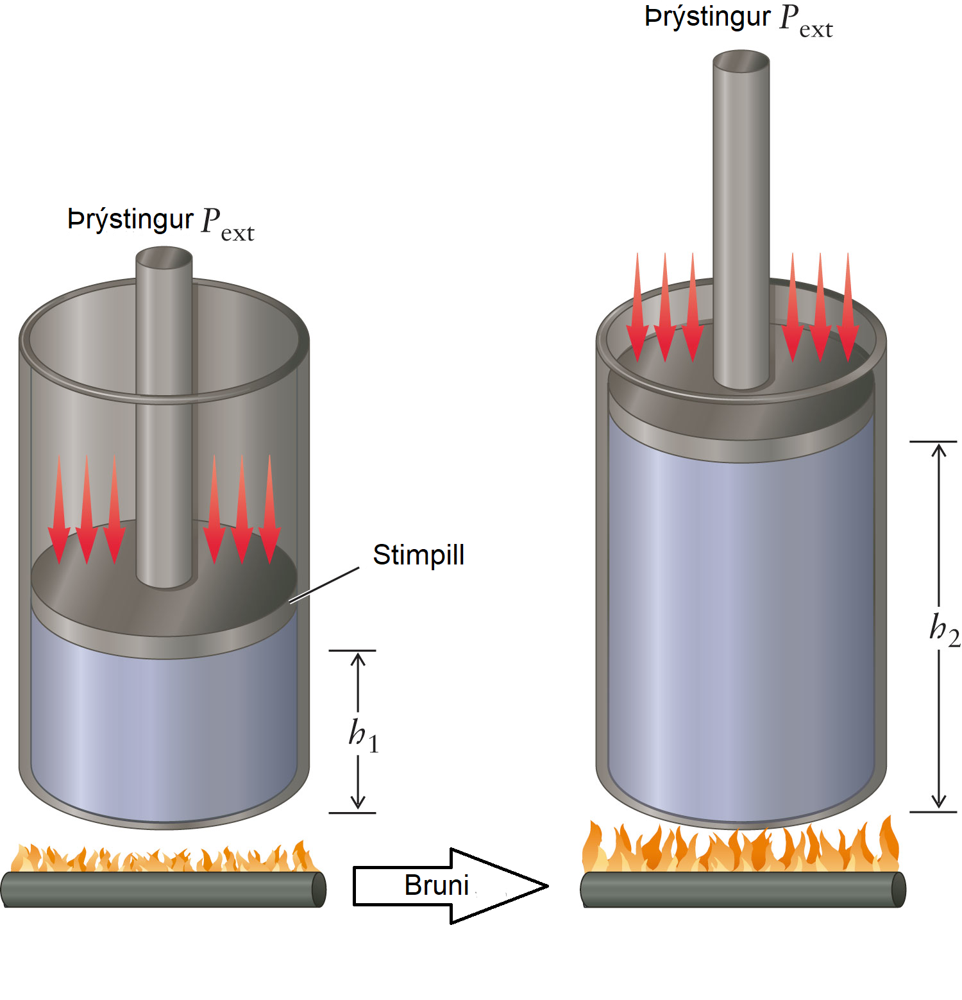
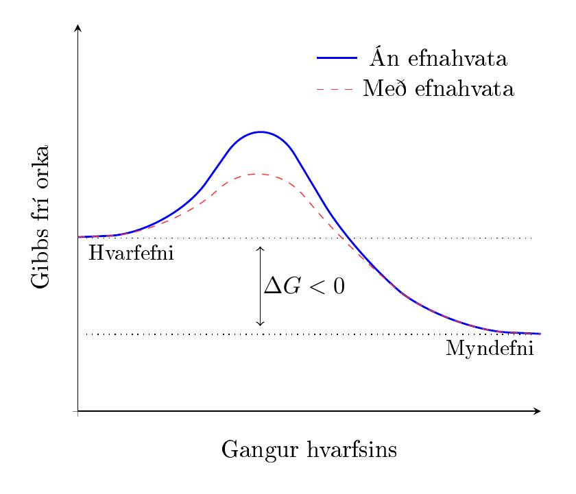

Varmaefnafræði
==============

Orka
----
*Orka* (e. energy) er almennt skilgreind sem geta til að framkvæma vinnu eða mynda *varma* (e. heat). :math:`\require{mhchem}` :math:`\require{cancel}`

Orka getur tekið á sig mörg form, s.s. *hreyfiorku* (e. kinetic energy), *varmaorku* (e. thermal energy), *stöðuorku* (e. potential energy) sem og *efnaorku* (e. chemical energy). Þessi form af orku tengjast með *fyrsta lögmáli varmafræðinnar* (e. First Law of Thermodynamics) sem segir til um að ekki sé hægt að búa
til, né eyða orku. Einungis er hægt að breyta um form á henni. SI-einingin fyrir orku er *Joule*, táknað :math:`\text{J}`. Fjallað er nánar um orku í `undirbúningsefninu í eðlisfræði <http://edbook.hi.is/undirbuningur_edl/Kafli07.html>`__.

Til þess að ræða eiginleika orku er gagnlegt að skilgreina *kerfi* (e. system) og *umhverfi* (e. surroundings)

Kerfi
  Kerfið er viðfangsefnið sem verið er að skoða. Þetta gæti t.d. verið kaffibolli ef verið væri að fylgjast með hitanum í honum.

Umhverfi
  Umhverfi umlykur kerfið. Tæknilega séð myndi það þýða allur alheimurinn að frádregnu kerfinu sem var skilgreint, en yfirleitt dugar að skoða næsta nágrenni.

Kerfi kallast *opið* þegar efni og orka get flætt á milli kerfis og umhverfis. Kerfi kallast *lokað* þegar einungis orka getur flætt á milli, en ekki efni.
Að lokum kallast kerfi *einangrað* ef hvorki efni né orka getur flætt til eða frá umhverfi.

Varmaorka
---------

Þegar hlutir eru sagðir hitna eru atóm og sameindir í hlutnum að hreyfast meira. Varmaorku hluta má því líta á sem hreyfiorku eindanna og hitastig efnis er mælikvarði á hve hratt eindir hreyfast.

Varmi er orka sem flyst til eða frá kerfi, en þessi flutningur er knúinn af *hitamismun*. Varmi flæðir *alltaf* frá heitari aðstæðum til þeirra kaldari.

Því meiri varmi sem berst í kerfi því meira hitnar það. Þetta gerist í ákveðnu hlutfalli en þetta hlutfall er kallað *varmarýmd* (e. heat capacity) og er breytilegt fyrir hvert og eitt kerfi.

Varmarýmd getur tekið mismunandi gildi og fer það eftir þáttum svo sem:

- Hvaða efni er í kerfinu
- Hve mikið af efni er í kerfinu

Til að samræma þessi gildi er skilgreindur *eðlisvarmi* (e. specific heat). Hann er skilgreindur fyrir hvert og eitt efni, í stað kerfis. Eðlisvarmi er þá orkan sem þarf til að hita eitt gramm af efni um eina gráðu celsius eða eitt kelvin.
Eðlisvarmi hefur því eininguna

.. math::

    \mathrm{J \left/ \middle( g\! \cdot \!K \right)}  \quad \text{eða} \quad \mathrm{J \left/ \middle( g  \! \cdot \!  \!°C \right)}

Þá er einnig einingin *kaloría* (e. calorie) notuð yfir eðlisvarma vatns, þ.e.

.. math::

  1 \, \mathrm{cal} = 4,186 \frac{ \mathrm{J}}{\text{g} \! \cdot \! \mathrm{K}}

Til að finna varmarýmd kerfis þarf að margfalda eðlisvarma kerfisins við massa efnis. Jafnan sem tengir varmaorku við hitastigsbreytingu er:

.. math::

  q= m\cdot c \cdot \Delta T

Hér táknar :math:`q` varmaorku, :math:`m` massa efnis, :math:`c` er eðlisvarmi og :math:`\Delta T` er hitastigsbreyting. Einnig er hægt að taka eðlisvarma og massann saman og nota varmarýmd, :math:`C`, í staðinn:

.. math::

  q = C \cdot \Delta T

.. note::

  :math:`\Delta` er gríski bókstafurinn "Delta" og hann er mikið notaður til að tákna *breytingu*. :math:`\Delta T` er því breyting á hitastigi og er reiknaður sem lokahitastig mínus upphafshitastig.

.. tip::

 **Hvað þarf mikla varmaorku til að hita 13,4 g af vatni frá 3,0 °C til 100 °C?**

 Hér þarf að nota jöfnuna að ofan og stinga inn gildunum. Eðlisvarmi vatns er fengin úr skilgreiningu
 á kalóríu hér að ofan. (Ef annað efni en vatn væri notað þyrfti að fletta gildum upp í töflu).

 .. math::

  \begin{aligned}
  q &= m\cdot c \cdot (T_f - T_i)\\
    &= 13,4 \text{g} \cdot 4,186  \, \frac{ \mathrm{J}}{\text{g} \! \cdot \! \mathrm{K}} \cdot (100°C - 3°C)\\
    &= 5400 \text{ J}\\
    &= 5,4 \text{ kJ}
  \end{aligned}

Efnaorka
--------

Efnaorka er orkan sem býr í efnatengjum sameindar en almenna reglan er:

- Orka losnar þegar efnatengi eru mynduð.
- Það kostar orku að rjúfa efnatengi.

Fasabreyting
~~~~~~~~~~~~

Efni getur gert meira en hitnað, en við ákveðin hitastig skipta þau um fasa. Þetta er vel þekkt úr daglegu lífi þar sem við hefðbundinn þrýsting við sjávarmál, þ.e. 1 atm, bráðnar klaki við 0 °C og vatn sýður við 100 °C.

Það sem gerist þegar klaki bráðnar er að varmi frá umhverfinu veldur aukinni hreyfingu vatnssameindanna þangað til þær geta ekki hreyft sig hraðar í kristalbyggingunni. Til þess að geta tekið við meiri varma, rjúfa sameindirnar kristaltengin sín á milli og mynda þá vökva. Þegar vatn sýður rjúfa sameindirnar alla millisameindakrafta og hver sameind fer sína leið.

Þetta kostar tiltölulega mikla orku að rjúfa öll þessi tengi en það kostar 334 J/g að bræða klaka en 2265 J/g að láta vatn gufa upp. Þessi gildi eru mun stærri en 4,2 J/g sem það kostar að hita vatn um eina gráðu.

Innri orka
----------

Innri orka kerfis er öll sú uppsafnaða orka sem býr í kerfinu s.s. varmaorka og efnaorka. Innri orkan er almennt táknuð með :math:`U` en ekki er hægt að mæla tölulegt *algildi*  (e. absolute value) fyrir innri orku. Hinsvegar er hægt að mæla breytingu í innri orku og því er oftar talað um :math:`\Delta U`.

Orka er skilgreind sem getan til að framkvæma vinnu eða mynda varma, svo því er hægt að setja upp jöfnu fyrir innri orku:

.. math::

  \Delta U = q + w

þar sem :math:`q` er varmi og :math:`w` er vinna. Orka kerfisins eykst ef :math:`\Delta U` er jákvætt en til þess að það gerist þarf varmi að berast í kerfi eða vinna að vera unnin á því.

.. figure:: ./myndir/varmi/orka.png
  :width: 80%
  :align: center

Innri orka er dæmi um *ástandsfall*, en varmi og vinna eru ekki ástandsföll.

Ástandsfall
~~~~~~~~~~~

Ástandsföll (e. state function) er þegar einungis lokaástand og upphafsástand skiptir máli.

Ef litið er á sunnudagsgöngu frá fjöru upp á tind Esjunnar, þá getur verið sniðugt að velja vel hvaða leið skal fara, hvort hún eigi að vera brött eða flöt, stutt eða löng. Ef það er þó verið að tala um hæð yfir sjávarmáli, þá skiptir leiðin aftur á móti engu máli. Sama hvað hlið fjallsins verður fyrir valinu, er heildarhækkunin 914 metrar. Hæð yfir sjávarmáli er einmitt ástandsfall.

Fyrir ástandsföll, líkt og innri orku er hægt að reikna breytinguna með jöfnunni:

.. math::

  \Delta U = U_f - U_i

Vinna
-----

Vinna getur verið ýmis konar (sjá nánar í `Undirbúning í eðlisfræði <http://edbook.hi.is/undirbuningur_edl/Kafli07.html#vinna>`__) en í efnafræði er einna helst talað um *þrýstings-rúmmáls vinnu* (e. pressure-volume work). Þetta er oft kallað P-V vinna, til styttingar.

Í daglegu lífi sést þessi vinna einna helst sem bruni eldsneytis í bílvélum. Þegar eldsneyti
brennur eykst þrýstingur. Fyrir hreyfanlegan stimpil (e. piston) þá eykur hann rúmmálið svo að þrýstingurinn
verður jafn þrýstingnum umhverfis stimplinum.

Jafnan fyrir P-V vinnu er þá:

.. math::

  w= -P\Delta V

Þar sem :math:`P` er ytri þrýstingur bullunar og :math:`\Delta V` er breyting á rúmmáli. Formerkin gæti ruglað marga, en jákvæð vinna þýðir að vinna er *unnin* á kerfinu. Þegar rúmmál eykst er kerfið að vinna vinnu á umhverfinu og vinnan því neikvæð. Til að vinna vinnu á kerfið, þarf að þjappa rúmmálinu saman.

Þetta er sambærilegt og fyrir `gorma <http://edbook.hi.is/undirbuningur_edl/Kafli05.html#gormkraftur>`__, þar sem þarf að beita afli til að þjappa honum saman. Með því er verið að beita vinnu á gorminn og auka innri orku hans. Þessi innri orka losnar svo út í umhverfið þegar gorminum er sleppt og hann nær upphaflegu stöðu.

Vermi
-----

Vermi (e. enthalpy) er ástandsfall sem er hvað mest notað í varmaefnafræði.

Ef litið er aftur á jöfnuna fyrir innri orku, en vinnan einskorðuð við P-V vinnu:

.. math::

  \begin{aligned}
    \Delta U&=q+w\\
    \Rightarrow \Delta U&=q-P\Delta V \\
    \Delta H := \Rightarrow \quad \, q&= \Delta U+P \Delta V\\
  \end{aligned}

Þessi varmi, :math:`q` er kallaður vermi, og táknaður með :math:`\Delta H` til aðgreiningar. Þetta er varminn sem losnar við efnahvarf. Vermi skiptist í tvennt:

:math:`\Delta H<0`
  Þegar vermisbreytingin er neikvæð gefur efnahvarfið frá sér orku og kallast *útvermið* (e. exothermic). Útvermin efnahvörf hita umhverfi sitt. Þess vegna halda margir að orkan sé að aukast,
  en umhverfið hitnar á *kostnað* kerfisins. Orka kerfisins er því að lækka og vermið er neikvætt.

:math:`\Delta H>0`
  Þegar vermisbreytingin er jákvæð, tekur efnahvarfið til sín orku og kallast *innvermið* (e. endothermic)

Sambærilegt og fyrir innri orku er ekki hægt að mæla algildi vermis, heldur er notað :math:`\Delta H`.
Hægt er að finna töflugildi fyrir efni, þar sem stöðugasta form efnisins er skilgreint sem núllpunktur.
Dæmi um það er t.d. :math:`\ce{H2}` og :math:`\ce{N2}`. Þessar töflur má finna í mörgum kennslubókum, sem og á netinu, t.d. `hér. <https://www.chem.wisc.edu/deptfiles/genchem/netorial/modules/thermodynamics/table.htm>`_

Í töflum er almennt tekið fram :math:`\Delta H_f°` en :math:`°` stendur fyrir staðalaðstæður, þ.e. 25°C og 1 atm þrýsting. :math:`_f` stendur fyrir *formation*, eða *myndun*. :math:`\Delta H_f°` er því kallað *staðalmyndunarvermi* (e. standard heat of formation)

Finna vermisbreytingu fyrir efnahvarf
~~~~~~~~~~~~~~~~~~~~~~~~~~~~~~~~~~~~~

Jafnan til að finna vermisbreytingu fyrir efnahvarf er:

.. math::

	\Delta H°=\sum n_p \Delta H_f°(\text{myndefni})-\sum n_r \Delta H_f°(\text{hvarfefni})

þar sem :math:`n_p` og :math:`n_r` er mólfjöldi mynd- og hvarfefnanna.
Þetta er ekki mjög ítarleg jafna en ef litið er á efnahvarfið:

.. math::

  \ce{aA + bB -> cC + dD}

þá er vermisbreytingin:

.. math::

 \Delta H°=\Big( \ce{c} \Delta H_f° ( \ce{C} ) + \ce{d} \Delta H_f°( \ce{D} )  \Big) - \Big( \ce{a} \Delta H_f°( \ce{A} ) + \ce{b} \Delta H_f°( \ce{B} ) \Big)

.. tip::

 **Með því að nota gögnin frá** `þessari <https://www.chem.wisc.edu/deptfiles/genchem/netorial/modules/thermodynamics/table.htm>`_ **síðu, finnið varmann sem myndast við bruna metans við 25°C:**

 .. math::

  \ce{CH4(g) + 2O2(g) -> CO2(g) + 2H2O(g)}

 Byrjum á að setja upp jöfnuna:

 .. math::

  \Delta H° = \Delta H_f° ( \ce{CO2(g)})  + 2 \Delta H_f°(\ce{H2O(g)}) - \Big( \Delta H_f° ( \ce{CH4(g)})   +2\Delta H_f° ( \ce{O2(g)}) \Big)

 Nú er hægt að fletta upp gildum fyrir þessar tölur, en eins og sjá má fæst :math:`\Delta H°(\ce{O2})=0` þar sem :math:`\ce{O2}` er stöðugasta form súrefnis. Þá fæst:

 .. math::

   \begin{aligned}
   \Delta H° &= -393.51 \text{ kJ/mól} -2 \cdot 241.82 \text{kJ/mól} - \Big(-74.81 \text{ kJ/mól} + 0 \text{ kJ/mól} \Big)\\
             &= -802,34 \text{ kJ/mól}
   \end{aligned}

 Fyrir hvert mól af metani sem er brennt, losnar því 802,34 kJ af varma út í umhverfið. Hafa ber þó í huga að þessar tölur eru einungis fyrir 25°C, en ólíklegt er að það hitastig
 haldi sér í bruna.

*Lögmál Hess* er undirstaða þessara reikninga.

Lögmál Hess
~~~~~~~~~~~

Lögmál Hess segir til um að ekki skipti máli fyrir vermisbreytingu, hvort að hvarfið er gert í mörgum skrefum eða ekki. Þetta er vegna þess að vermi er *ástandsfall*, þ.e. bara upphafs- og lokagildi skipta máli.

Þar sem ekki skiptir máli hvora leið er farið frá hvarfefnum til myndefna er hægt að setja fram jöfnuna:

.. math::

  \Delta H_1 + \Delta H_2 + \Delta H_3 + \dots = \Delta H

Auk lögmáls Hess er gagnlegt að hafa tvær reglur til viðbótar í huga:

Vermisbreyting er í línulegu sambandi við fjölda móla.
  Þetta þýðir að ef mólfjöldinn margfaldast þá margfaldast vermisbreytingin með sömu tölu.

  .. math::

    \begin{aligned}
    \ce{2N2 + O2 &-> 2N2O}   &    \Delta H°=66,36 \text{ kJ/mól}\\
    \ce{N2 + \frac12 O2 &-> N2O}   &    \Delta H°=33,18 \text{ kJ/mól}
    \end{aligned}

Vermisbreyting fær öfugt formerki ef hvarfið snýst við.
  .. math::

    \begin{aligned}
    \ce{2N2O &-> 2N2 + O2}   &    \Delta H°=-66,36 \text{ kJ/mól}\\
    \end{aligned}

.. tip::

 **Hvert er** :math:`\Delta H` **fyrir myndun metans úr kolmónoxíði?**

 .. math::

  \ce{CO(g) + 3H2(g) -> CH4(g) + H2O(g)}

 **Gefið er** :math:`\Delta H` **fyrir eftirfarandi hvörf:**

 .. math::

  	 \begin{aligned}
     \ce{2C(s,graphite) + O2(g) &-> 2CO(g)}  &  \Delta H_1&=-221,05 \text{ kJ/mól} \\
     \ce{C(s,graphite) + 2H2(g) &-> CH4(g)}  &  \Delta H_2&=-74.81 \text{ kJ/mól}\\
     \ce{2H2(g) + O2(g) &-> 2H2O(g)}  &  \Delta H_3&= -483,64\text{ kJ/mól}\\
      \end{aligned}

 Til þess að mynda efnahvarfið, þarf að raða upp þessum hvörfum svo þau myndi upphaflega hvarfið. Til þess að gera það þarf að margfalda og snúa við hvörfunum svo að kolmónoxíð, vatn og metan sé í réttum hlutföllum og réttum megin við örina:

 .. math::

   \begin{aligned}
   \ce{ CO(g) &->\bcancel{C(graphite)} + \bcancel{\frac 12 O2(g)} }  &  -\frac 12 &\Delta H_1 \\
   \ce{\bcancel{C(graphite)} + 2H2(g) &-> CH4(g)}  &  &\Delta H_2\\
   \ce{H2(g) + \bcancel{\frac 12 O2(g)} &-> H2O(g)}  &  \frac 12&\Delta H_3\\
   \hline
   \ce{CO(g) + 3H2(g) &-> CH4(g) + H2O(g)}& \mkern-36mu -\frac 12 \Delta H_1 + \Delta H_2 + \frac 12&\Delta H_3
   \end{aligned}

 Þá er vermisbreytining fyrir hvarfið:

 .. math::

  \begin{aligned}
  \Delta H &= -\frac 12 \Delta H_1 + \Delta H_2 + \frac 12\Delta H_3\\
           &= -\frac 12(-221,05 \text{ kJ/mól}) + (-74.81 \text{ kJ/mól}) + \frac 12(-483,64\text{ kJ/mól})\\
           &= -427,16 \text {kJ/mól}
  \end{aligned}

Óreiða
------

Óreiða (e. entropy) er mælikvarði á sjálfgengni. Sumir hlutir gerast aðeins í aðra áttina, líkt og þegar sullast úr mjólkufernu.
Þó beðið væri til eilífðarnóns, er stjarnfræðilega ólíklegt að mjólkin safnist aftur í fernuna að sjálfu sér. Heitur kaffibolli kólnar, en hitnar aldrei að sjálfu sér.
Þetta er afleiðing annars lögmál varmafræðinnar:

Annað lögmál varmafræðinnar
  Heildaróreiða alheimsins getur einungis aukist, en ekki minnkað.

Óreiða er skilgreind út frá fjölda míkróástanda (e. microstate). Ef opnað er fyrir súrefniskút, lekur súrefnið út, þangað til að þrýstingurinn er jafn í kútnum og í andrúmsloftinu.
Ef ein kúla á myndinni táknar eina sameind, má sjá að flest míkróástönd fæst þegar jafn margar sameindir eru utan og innan kútsins. Þess vegna leitast þrýstingur við að jafnast út.

.. figure:: ./myndir/varmi/astond2.png
  :width: 100%
  :align: center

Óreiða er táknuð með :math:`S` og míkróástönd með :math:`\Omega`. Þessi hugtök tengjast svo með jöfnunni:

.. math::
  S=k_B\text{ln}(\Omega)

Þar sem :math:`k_B` er Boltzmann fastinn, þ.e. :math:`k_B = 1,38\times 10^{-23} \text{ J/K}`.

Líkt og innri orka og vermi, er óreiða ástandsfall. Þá gildir:

.. math::

  \Delta S= S_f-S_i

Óreiða frumefna og efnasambanda stefnir á núll við alkul, en það er einmitt *þriðja lögmál varmafræðinnar*.

Óreiðan eykst með auknum hita, þrýstingi og rúmmáli, en einnig með fösum.

Óreiðubreyting efnahvarfa
~~~~~~~~~~~~~~~~~~~~~~~~~

Aukin óreiða er drifkafturinn sem efnahvarf þarfnast til að gerast að sjálfu sér. Til þess að efnahvarf sé sjálfgengt þarf óreiða alheimsins að aukast, þ.e.

.. math::

  \Delta S_{\text{alheimur}} =\Delta S_{\text{kerfi}} + \Delta S_{\text{umhverfi}} > 0

Hægt er að reikna óreiðubreytingu kerfisins við efnahvarf sambærilegt og fyrir vermi:

.. math::

  \Delta S°=\sum n_p S°(\text{myndefni})-\sum n_r S°(\text{hvarfefni})

Til að finna óreiðubreytinguna fyrir umhverfið, er ekki nóg að fletta upp í töflu, heldur þarf einnig hitastig umhverfisins.
Fyrir jafnan þrýsting er jafnan fyrir það:

.. math::

  \Delta S_{\text{umhverfi}} = \frac {\Delta H}T

.. tip::

 **Hver er óreiðubreyting við staðalaðstæður fyrir niðurbrot vetnisperoxíðs?**

 .. math::

    \ce{2H2O2(l) -> O2(g) + 2H2O(l)}

 Með því að nota sömu `síðu <https://www.chem.wisc.edu/deptfiles/genchem/netorial/modules/thermodynamics/table.htm>`_ og áður og fletta upp gildunum, fæst:

 .. math::

  \begin{aligned}
  \Delta S° &= S°(\ce{O2(g)})+ 2S°(\ce{H2O(l)})- 2S°(\ce{H2O2(l)})\\
            &= 205,138 \text{ J}/(\text{K}\!\cdot\! \text{mól})+ 2\cdot 69,91 \text{ J}/(\text{K}\!\cdot\! \text{mól}) -2\cdot 109,6 \text{ J}/(\text{K}\!\cdot\! \text{mól})\\
            &=125,8 \text{ J}/(\text{K}\!\cdot\! \text{mól})
  \end{aligned}

Gibbs frí orka
--------------

Í staðinn fyrir að reikna óreiðuna fyrir bæði kerfið og umhverfið, er það tekið saman í *Gibbs frí orku* (e. Gibbs free energy). Þetta er einnig ástandsfall og er táknað með :math:`G`, en jafnan fyrir gibbs frí orku er:

.. math::

    \Delta G = \Delta H-T\Delta S

Hérna er :math:`T` hitastigið í kelvin. Hagnaðurinn við að skilgreina þessa Gibbs fríu orku er að það er einfalt að áætla sjálfgengni:

.. math::

  \begin{array}{cc}
  \Delta G < 0  & \text{Sjálfgengt ferli}\\
  \Delta G = 0  & \text{Ferli er við jafnvægi}\\
  \Delta G > 0  & \text{Ósjálfgengt ferli}\\
  \end{array}

.. figure:: ./myndir/varmi/gibbs.png
  :width: 40%
  :align: center

Þessi jafna er háð hitastigi og hvarf getur verið sjálfgengt einungis fyrir nógu há hitastig. Þetta er hægt að flokka í eftirfarandi tilfelli:

.. math::

  \begin{array}{cc|l}
  \Delta H  & \Delta S & \text{Sjálfgengni}\\
  \hline
  +  &  - & \text{Nei}\\
  +  &  + & \text{Við hátt hitastig}\\
  -  &  - & \text{Ekki við hátt hitastig} \\
  -  &  + & \text{Já}
  \end{array}

Einnig er hægt að finna töflugildin fyrir :math:`\Delta G_f°` og reikna fyrir efnahvarf, samsvarandi og áður:

.. math::

  \Delta G°=\sum n_p G_f°(\text{myndefni})-\sum n_r G_f°(\text{hvarfefni})

Samsvarandi og fyrir vermi er :math:`\Delta G_f°=0` fyrir stöðugasta form efnisins.

.. tip::

 **Hvert er** :math:`\Delta G_f°` **fyrir bruna própansgas?**

 .. math::

  \ce{C3H8(g) + 5O2(g) -> 3CO2(g) + 4H2O(g)}

 Með því að nota enn á ný gögn `héðan <https://www.chem.wisc.edu/deptfiles/genchem/netorial/modules/thermodynamics/table.htm>`_, eru tvær aðferðir sem hægt er að nota. Byrjum á þeirri einfaldari.
 Það fæst með því að reikna með jöfnunni:

 .. math::

  \begin{aligned}
  \Delta G° &= \sum n_p G_f°(\text{myndefni})-\sum n_r G_f°(\text{hvarfefni})\\
            &= 3(\Delta G_f°(\ce{CO2}))+4\Delta G_f°(\ce{H2O}) - \Big(\Delta G_f°(\ce{C3H8}) + 5\cancelto{0}{\Delta G_f°(\ce{O2})} \Big)\\
            &= 3(-394,36 \text{ kJ/mól})+ 4(-228,57\text{ kJ/mól}) - (-23,49\text{ kJ/mól})\\
            &= -2074 \text{ kJ/mól}
  \end{aligned}

 Hin aðferðin hefði verið að reikna :math:`\Delta H_f°` og  :math:`\Delta S°` fyrst. Það hefði gefið

 .. math::

  \begin{aligned}
   \Delta H_f°&=-2044 \text{ kJ/mól}\\
   \Delta S°&=100,9 \text{ J}/(\text{K}\!\cdot \! \text{mól})
     \end{aligned}

 Hér þarf að passa að einingarnar eru ekki þær sömu (:math:`\text{kJ}` og :math:`\text{J}`). Fyrir staðalaðstæður, er þá hægt að reikna:

 .. math::

    \begin{aligned}
   \Delta G° &= -2044 \text{ kJ/mól} - 298,15 \text{ K}\cdot 100,9 \text{ J}/(\text{K}\!\cdot \! \text{mól})\cdot \frac{1 \text{ kJ}}{1000 \text{ J}}\\
             &=-2074 \text{ kJ/mól}
   \end{aligned}

 Eins og sjá má, þá er vermið mun áhrifameira við lág hitastig. Þetta hvarf er *sjálfgengt*.

Virkjunarorka
-------------

Bruni própansgas er sjálfgengur og hvarfið gengur hjálparlaust. Þrátt fyrir það er hægt að blanda própangasi við súrefni í herbergi án þess að kvikni í því.
Það er vegna þess að öll hvörf hafa *virkjunarorku* (e. activation energy). Efnin þurfa utanaðkomandi orku til að geta byrjað hvarfið. Þess vegna er ekki nóg að skrúfa frá gaskútnum á grillinu
heldur þarf einnig að kveikja í því. Eldurinn af eldspýtu er fullfær um að veita efninu þessa orku sem þarf. Eftir að kveikt er í gasinu brennur það svo sjálkrafa þangað til annað efnið klárast.

Þetta má sjá hér á grafi, þar sem virkjunarorkan er táknuð með :math:`E_A`:

.. figure:: ./myndir/varmi/virkjunarorka.png
  :width: 60%
  :align: center

Líkt og skíðamaður stefnir hvarfið niður brekkuna. Til þess að gera það verður það þó að klífa þennan hól, svo líkja mætti eldspýtunni við skíðalyftu til að koma skíðamanninum upp á toppinn.

Efnahvati
~~~~~~~~~

Virkjunarorka ræður miklu þegar kemur að hraða efnahvarfs. Fyrir efnaverksmiðju er hentugast að hvarf gerist sem hraðast.
Til þess er notaðUR *efnahvati* (e. catalyst). Efnahvati hraðar hvarfinu með því að lækka virkjunarorku sem þarf. Efnahvati *lækkar virkjunarhólinn* sem hvarfið þarf að komast yfir.

Efnahvatar breyta þannig virkjunarorku og hraða hvarfs, en breyta ekki :math:`\Delta H`, :math:`\Delta G` eða :math:`\Delta S`
