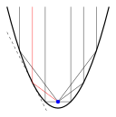

Rúmfræði
========

Hnitakerfi
-----------
Kartesíska :hover:`hnitakerfið, hnitakerfi` er búið til með því að leggja tvær :hover:`talnalínur, talnalína` í kross þannig að þær standi :hover:`hornréttar, hornréttur` hvor á aðra og skerist í núllpunktum sínum.
Lárétta talnalínan er oftast kölluð :math:`x`-ásinn og sú lóðrétta :math:`y`-ásinn.

Til að marka punkt :math:`(a,b)` inn á svona hnitakerfi þá teiknum við lóðrétta línu í gegnum punktinn :math:`a` á :math:`x`-ásnum og lárétta línu í gegnum punktinn :math:`b` á :math:`y`-ásnum.
Þar sem línurnar skerast mörkum við punktinn :math:`(a,b)`.

Á myndinni má sjá punktinn :math:`(4,2)` markaðan í hnitakerfi.


Fjarlægð milli punkta í kartesísku hnitakerfi
~~~~~~~~~~~~~~~~~~~~~~~~~~~~~~~~~~~~~~~~~~~~~
Látum :math:`P_1=(x_1,y_1)` og :math:`P_2=(x_2,y_2)` vera tvo punkta í hnitakerfinu. Til þess að finna fjarlægðina á milli þeirra skulum við nota reglu `Pýþagórasar <http://www.xn--st-2ia.is/fletta/setning_p%C3%BD%C3%BEag%C3%B3rasar>`_.

Við myndum rétthyrndan þríhyrning með því að bæta við punkti sem við skulum kalla :math:`P_3`. Þessi punktur hefur sama :math:`y`- :hover:`hnit` og punkturinn :math:`P_1`, og sama :math:`x`- :hover:`hnit` og punkturinn :math:`P_2`. Því er :math:`P_3=(x_2, y_1)`.


.. image:: ./myndir/rumfraedi/fjarl.svg
	:align: center
	:width: 70%

Fjarlægðin milli punktanna :math:`P_1` og :math:`P_3` er :math:`|x_2-x_1|`.

Fjarlægðin milli punktanna :math:`P_2` og :math:`P_3` er :math:`|y_2-y_1|`.

Við vitum því skammhliðarnar í þessum þríhyrningi og notum reglu Pýþagórasar til að finna :hover:`langhliðina, langhlið`. Munum að regla Pýþagórasar segir að fyrir rétthyrndan þríhyrning gildir

.. math::
	a^2+b^2=c^2

þar sem :math:`a, b` eru skammhliðarnar og :math:`c` er langhliðin. Því vitum við að lengd langhliðarinnar er :math:`c=\sqrt{a^2+b^2}`.

Með því að nota þessa reglu getum við því fundið fjarlægðina á milli :math:`P_1` og :math:`P_2`:

Regla
~~~~~
Fjarlægðin milli punktanna :math:`P_1=(x_1,y_1)` og :math:`P_2=(x_2,y_2)` í hnitakerfinu er

.. math::
	\sqrt{(x_2-x_1)^2+(y_2-y_1)^2}

.. note::
	Hér er :math:`a = |x_2-x_1|` og :math:`b = |y_2-y_1|` miðað við reglu Pýþagórasar.

.. tip::
	Finnum fjarlægðina milli punktanna :math:`(1,2)` og :math:`(5,7)` í hnitakerfinu.

	Hér er :math:`x_1=1`, :math:`x_2=5`, :math:`y_1=2` og :math:`y_2=7`. Setjum þetta inn í jöfnuna að ofan og fáum að fjarlægðin milli punktanna er

	.. math::
		\sqrt{(5-1)^2+(7-2)^2}=\sqrt{16+25}=\sqrt{41}

Jafna línu í hnitakerfinu
-------------------------
Til að tákna línur í hnitakerfinu er algengt að nota jöfnur.

Almennt form jöfnu línu er

.. math::
	ax+by+c=0

þar sem :math:`a,b` og :math:`c` eru rauntölur. Það er, fyrsta stigs jafna er jafna línu.

.. note::
	Oft er jafna línu rituð á eftirfarandi hátt:

	.. math::
		y=hx+s

	sjá nánar í kafla 3.3

	eða

	.. math::
		y - y_1 = h(x - x_1)

	þar sem :math:`(x_1,y_1)` er punktur á línunni og :math:`h` er hallatalan.

.. tip::
	Skoðum jöfnuna

	.. math::
		-\frac12 x +y +1=0

	Hér er :math:`a=-1/2`, :math:`b=1` og :math:`c=1` miðað við almennu framsetninguna.
	Finnum nú nokkur gildi á :math:`x` og :math:`y` sem uppfylla þessa jöfnu og mörkum samsvarandi punkta :math:`(x,y)` í hnitakerfið.

	Ef :math:`x=0` og :math:`y=-1` þá stenst jafnan. Það sést með prófun:

	.. math::
		-\frac{1}{2} (0) +(-1) +1= -1+1 = 0

	Við mörkum því punktinn :math:`(0,-1)` í hnitakerfið.

	Ef :math:`x=2` og :math:`y=0` þá stenst jafnan. Við mörkum því punktinn :math:`(2,0)` í hnitakerfið.
	Á sama hátt getum við markað punktana :math:`(-6,-4)`, :math:`(-4,-3)`, :math:`(-2,-2)`, :math:`(4,1)` og :math:`(6,2)` í hnitakerfið því að ef þessum hnitum er stungið inn í jöfnuna þá stenst hún.
	Það hefur verið gert á myndinni.

	.. image:: ./myndir/rumfraedi/lina.svg
		:width: 60%
		:align: center

	Við sjáum að allar lausnirnar lenda á sömu línunni í hnitakerfinu. Auk þess eru allir punktarnir á línunni (líka þeir sem ekki eru merktir) lausn á jöfnunni.

	Þess vegna segjum við að jafnan :math:`-\dfrac{1}{2}x+y+1=0` sé jafna línunnar sem fram kemur á myndinni. Jafnan hefur óendanlega margar lausnir og línan teygir sig óendanlega langt í báðar áttir.


Hallatala og skurðpunktur við ása
---------------------------------

Jafnan :math:`ax+by+c=0` kallast almenn jafna línu. Þó getur verið hentugra að koma henni yfir á annað form.

Við getum einangrað :math:`y` úr þessari jöfnu með reikniaðgerðum. Þá fæst jafna

.. math::
	y=hx+s

þar sem :math:`h = -\frac{a}{b}` og :math:`s = -\frac{c}{b}`.
Fastinn :math:`h` kallast :hover:`hallatala` línunnar og fastinn :math:`s` kallast :hover:`skurðpunktur` línunnar við :math:`y`-ás.

----------------------------------------------------------------------------------------

.. ggb:: zV4nkbE3
	:width: 700
	:height: 500
	:img: ./myndir/ggbjafnalinu.png

---------------------------------------------------------------------------------------

Hallatala línunnar, :math:`h`, táknar hversu mikið línan hallar. Ef við vitum einn punkt á línunni þá getum við fundið annan með því að færa okkur fyrst einn til hægri eða vinstri í hnitakerfinu og svo :math:`h` upp eða niður.

Skurðpunktur línu við :math:`y`-ásinn er tala :math:`s` sem segir okkur hvar línan sker :math:`y`-ásinn. Línan mun skera ásinn í punktinum :math:`(0,s)`.

Skurðpunktur línu við :math:`x`-ásinn er skylt hugtak, en sú tala segir okkur hvar línan sker :math:`x`-ásinn. Hann finnum við með því að setja :math:`y=0` inn í jöfnu línunnar og leysa fyrir :math:`x`.

.. note::
	:math:`x`-ásinn er línan þar sem :math:`y=0` og :math:`y`-ásinn er línan þar sem :math:`x=0`. Þess vegna getum við fundið skurðpunkt línu við :math:`x`-ás með því að setja :math:`y=0` inn í jöfnu línunnar, og sömuleiðis finnum við skurðpunkt við :math:`y`-ás með því að setja :math:`x=0` inn í jöfnu línunnar.

.. tip::
	Finnum hallatölu og skurðpunkta línunnar

	.. math::
		2x-y-3=0

	við :math:`x`-ás og :math:`y`-ás. Teiknum svo línuna inn í hnitakerfi.

	Byrjum á að koma línunni yfir á formið :math:`y=hx+s`. Einangrum :math:`y` og fáum

	.. math::
		y=2x-3

	Nú getum við fundið skurðpunkt við :math:`y`-ás út frá jöfnu línunnar. Hér er :math:`s=-3` svo skurðpunktur við :math:`y`-ás hefur hnit :math:`(0,-3)`.

	Við sjáum líka út frá jöfnu línunnar að :math:`h=2` svo hallatala línunnar er :math:`2`.

	Við finnum skurðpunkt línunnar við :math:`x`-ás með því að setja :math:`y=0` í jöfnu hennar og leysa fyrir :math:`x`. Fáum :math:`2x-3=0`, það er, :math:`x=\frac{3}{2}`. Skurðpunkturinn við :math:`x`-ás er því punkturinn :math:`(\frac{3}{2},0)`.

	Finnum tvo punkta á línunni í viðbót með því að nota hallatölu hennar. Hallatalan er :math:`2`.
	Færum okkur því einn til hægri og tvo upp frá skurðpunkti línunnar við :math:`y`-ás og fáum því að punkturinn :math:`(1,-1)` tilheyrir línunni.

	Færum okkur líka einn til hægri og tvo upp frá skurðpunkti línunnar við :math:`x`-ás og fáum að punkturinn :math:`(\frac{5}{2}, 2)` tilheyrir línunni.

	Nú höfum við fundið fjóra punkta línunnar. Merkjum þá inn á hnitakerfið og drögum beina línu í gegnum þá. Þá fæst graf línunnar.

	.. image:: ./myndir/rumfraedi/hallatala.svg
		:width: 75 %
		:align: center


.. note::
	Athugum að til að teikna línu er nóg að finna tvo punkta sem liggja á henni og finna beina línu í gegnum þá, en í dæminu hér að ofan fundum við fjóra.

.. tip::
	Finnum hallatölu og skurðpunkta línunnar

	.. math::
		3x + 2y -2 = 0

	við :math:`x`-ás og :math:`y`-ás.

	Komum jöfnunni yfir á formið :math:`y=hx+s`

	.. math::
		y = -\frac{3}{2} x + 1

	Þá fáum við skurðpunktinn við :math:`y`-ás :math:`s = 1` og hallatölu :math:`h= -\frac{3}{2}`.

	Skurðpunkturinn við :math:`x` -ás fæst með að setja :math:`y=0` í jöfnuna og leysa fyrir :math:`x` . Fáum :math:`3x + 2(0) -2 = 0` sem gefur okkur :math:`x = \frac{2}{3}`

	Þá eru skurðpunktarnir tveir :math:`(0, 1)` og :math:`(\frac{2}{3}, 0)`

	Þá fæst graf línunnar:

	.. image:: ./myndir/rumfraedi/neg-hallatala.svg
		:width: 75 %
		:align: center

Meira um jöfnu línu
-------------------

Stundum fáum við gefna tvo punkta :math:`(x_1,y_1)` og :math:`(x_2,y_2)` og þurfum að finna jöfnu línunnar sem gengur í gegnum þá. Til þess getum við notað eftirfarandi reglu:

Regla
~~~~~

Hallatala línunnar, :math:`h`, sem gengur í gegnum punkta :math:`(x_1,y_1)` og :math:`(x_2,y_2)` fæst með formúlunni

.. math::
	h=\frac{y_2-y_1}{x_2-x_1}

.. image:: ./myndir/rumfraedi/almenn-lina.svg
	:width: 50 %
	:align: center

Að finna jöfnu línu
~~~~~~~~~~~~~~~~~~~

Þegar við höfum fundið hallatölu línunnar þá þurfum við líka að reikna út fastann :math:`s`, skurðpunkt við :math:`y`-ás. Við vitum að línan gengur í gegnum punktana :math:`(x_1,y_1)` og :math:`(x_2,y_2)`. Því þarf jafnan :math:`y_1=hx_1+s` að ganga upp (sömuleiðis jafnan :math:`y_2=hx_2+s` en það er nóg að notast við aðra hvora af þessum jöfnum). Við einangrum þá :math:`s` út úr þessari jöfnu. Þá getum við ritað jöfnu línunnar

.. math::
	y=hx+s

þar sem við þekkjum fastana :math:`h` og :math:`s`.

.. tip::
	Finnum jöfnu línunnar sem gengur í gegnum punktana :math:`(1,2)` og :math:`(13,17)`.

	Byrjum á að finna hallatölu hennar. Samkvæmt reglu að ofan fæst

	.. math::
		h=\frac{17-2}{13-1}=\frac{15}{12}=\frac54

	Jafna línunnar er því af gerðinni

	.. math::
		y=\frac54 x +s

	Til að finna skurðpunkt við :math:`y`-ás athugum við að þar sem línan gengur í gegnum punktinn :math:`(1,2)` þá þarf jafnan að standast þegar þessum punkti er stungið inn í hana. Því fæst

	.. math::
		(2)=\frac54 \cdot (1) +s

	Einangrum nú :math:`s` og fáum :math:`s=\frac34`.

	Nú höfum við fundið :math:`h` og :math:`s` og jafna línunnar er því

	.. math::
		y=\frac54 x + \frac34


	.. image:: ./myndir/rumfraedi/mynd-linudaemi.svg
		:width: 70 %
		:align: center


Samsíða og þverstæðar línur
~~~~~~~~~~~~~~~~~~~~~~~~~~~

Samsíða línur
`````````````
.. _s.samsíða:

Ef línur :math:`m_1` og :math:`m_2` eru með hallatölu :math:`h_1` og :math:`h_2` þá gildir

.. math::
    m_1 \parallel m_2 \; \Longleftrightarrow \; h_1 = h_2

Það er, ef hallatalan er sú sama þá segjum við að línurnar séu :hover:`samsíða`.
Hér er dæmi um tvær samsíða línur með hallatöluna :math:`h_1=h_2=1`

.. image:: ./myndir/samsid.svg
    :align: center
    :width: 70%


Þverstæðar línur
````````````````
.. _s.þverstæð:

Ef línur :math:`m_1` og :math:`m_2` eru með hallatölu :math:`h_1` og :math:`h_2` og um þær gildir

.. math::
    m_1 \perp m_2 \; \Longleftrightarrow \; h_1 = -\frac{1}{h_2}

þá eru línurnar :hover:`þverstæðar, þverstæður` eða hornréttar.
Hér er dæmi um tvær hornréttar línur, með hallatölurnar :math:`h_1=3` og :math:`h_2=-\frac{1}{3}`

.. image:: ./myndir/prepd.svg
    :align: center
    :width: 70%


.. tip::
	Látum :math:`l` vera línuna sem gengur í gegnum punktana :math:`(-3,6)` og :math:`(1,-2)`.
	Finnum jöfnu línu sem gengur í gegnum punktinn :math:`(1,1)` og er :hover:`samsíða` línunni :math:`l`.

	Köllum línuna sem við erum að leita að :math:`m`. Það að línurnar :math:`l` og :math:`m` séu samsíða þýðir að þær hafa sömu hallatölu. Til að finna hallatölu línunnar :math:`m` nægir því að finna hallatölu línunnar :math:`l`.
	Hallatalan er:

	.. math::
		h=\dfrac{(-2)-6}{1-(-3)}=\dfrac{-8}{4}=-2

	Jafna línunnar :math:`m` er því af gerðinni

	.. math::
		y=-2x+s

	en við eigum eftir að finna :math:`s`.
	Gefið er að punkturinn :math:`(1,1)` er á línunni svo jafnan þarf að standast þegar :math:`(x,y)=(1,1)` er stungið inn í hana. Með öðrum orðum er

	.. math::
		1=-2\cdot 1+s \quad \rightarrow \quad s=1+2=3

	Jafna línunnar :math:`m` er því	:math:`y=-2x+3`.

	.. image:: ./myndir/rumfraedi/mynd-linudaemi2.svg
		:width: 40 %
		:align: center


Miðpunktsregla
~~~~~~~~~~~~~~
Reikna má miðpunkt striksins á milli :math:`A(x_1, y_1)` og :math:`B(x_2,y_2)` með:

.. math::
    M = \left( \frac{x_1+x_2}{2} , \frac{y_1+y_2}{2} \right)

.. image:: ./myndir/midpkt.svg
    :width: 50%
    :align: center


Keilusnið
---------
:hover:`Keilusnið, keilusnið` er regnhlífarhugtak yfir ákveðin söfn punkta.
Nafnið kemur frá því að :hover:`ferlarnir, ferill` (punktasöfnin) hafa sömu lögun og ef (óendanleg) tvöföld :hover:`keila` er skorin með (óendanlegu) blaði.

.. figure:: ./myndir/rumfraedi/keilusnið.svg
	:width: 70%
	:align: center

Á myndinni má sjá nokkrar tegundir keilusniða. Ferlarnir eru grænir á ljósbláu blaðinu.

* Mynd 1 er af :hover:`fleygboga, fleygbogi`, sem kemur fram þegar blaðið er samsíða brún keilanna.
* Mynd 2 er af :hover:`sporöskju, sporaskja`, sem kemur fram þegar blaðið hallar minna en brún keilanna.
* Á mynd 2 er líka :hover:`hringur`, sem kemur fram þegar blaðið er lárétt.
* Mynd 3 er af :hover:`breiðboga, breiðbogi`, sem kemur fram þegar blaðið hallar meira en brún keilanna.
* Línur eru líka keilusnið, en þær koma fram þegar blaðið leggst einmitt á brún keilanna.
* Stakur punktur kemur fram þegar blaðið leggst einmitt þar sem keilurnar mætast.

.. ggb:: us7azzac
	:width: 600
	:height: 400

Fleygbogar
~~~~~~~~~~
:hover:`Fleygbogi` hefur jöfnu á forminu :math:`y=ax^2+bx+c` (:ref:`annars stigs margliða <s.annarsstigs>`).


*Topppunktur* fleygboga er í punktinum:

.. math::
  T=\left(\frac{-b}{2a},\frac{4ac-b^2}{4a} \right)

Línan :math:`x=-\frac{b}{2a}` kallast :hover:`samhverfuás` fleygbogans.
Fleygboginn speglast um ásinn.

Fleygboginn sker :math:`y` -ás hnitakerfisins í punkti :math:`(0,c)` .

Fleygboginn sker :math:`x` -ás hnitakerfisins:

* Aldrei ef :math:`b^2-4ac<0` .
* Einu sinni í punkti :math:`(-b/2a, 0)` ef :math:`b^2-4ac=0` .
* Tvisvar í punktum :math:`x_0=\left(\frac{-b+\sqrt{b^2-4ac}}{2a},0 \right)` og :math:`x_1= \left(\frac{-b-\sqrt{b^2-4ac}}{2a},0 \right)` ef :math:`b^2-4ac>0` .

Fleygbogar hafa mismunandi lögun eftir formerkjum:

	* ef :math:`a>0` þá er fleygboginn :hover:`kúptur` :

	.. image:: ./myndir/rumfraedi/parabolapos.svg
		:width: 40%
		:align: center

	* ef :math:`a<0`  þá er fleygboginn :hover:`hvelfdur` :

	.. image:: ./myndir/rumfraedi/parabolaneg.svg
		:width: 40%
		:align: center

.. tip::
  Skoðum fleygbogann :math:`x^2-x-1=0` .
  Tökum fyrst eftir að fleygboginn er kúptur því :math:`a=1>0` .
  Reiknum topppunktinn:

  .. math::
    \begin{aligned}
      T&=\left(\frac{-b}{2a},\frac{4ac-b^2}{4a} \right) \\
      &= \left(\frac{-1}{2\cdot 1},\frac{4\cdot 1\cdot (-1)-(-1)^2}{4\cdot 1} \right) \\
      &= \left(\frac{1}{2},-\frac{5}{4} \right)
    \end{aligned}

  Samhverfuásinn liggur lóðrétt í gegnum topppunktinn.

  Reiknum næst skurðpunkta fleygbogans við :math:`x` -ás.
  Sjáum að :math:`b^2-4ac=(-1)^2-4\cdot1\cdot(-1) = 5 >0` og því eru skurðpunktarnir tveir:

  .. math::
		\begin{aligned}
		x_0 &= \frac{-b+ \sqrt{b^2-4ac}}{2a} \\
		&= \frac{-(-1)+ \sqrt{(-1)^2-4\cdot 1\cdot(-1)}}{2\cdot 1} \\
		&= \frac{1+\sqrt{5}}{2}\\
		\\
		x_1 &= \frac{-b- \sqrt{b^2-4ac}}{2a} \\
		&= \frac{-(-1)- \sqrt{(-1)^2-4\cdot 1\cdot(-1)}}{2\cdot 1} \\
		&= \frac{1-\sqrt{5}}{2} \\
    \end{aligned}

  .. figure:: ./myndir/rumfraedi/fleygb.svg
    :align: center
    :width: 60%

.. note::
  Til eru fleygbogar sem snúa á hlið.
  Þeir hafa formið :math:`ay^2+by+c=x` .

.. begin-toggle::
	:label: Tengsl við eðlisfræði

Ljósgeisli sem lendir á speglandi yfirborði speglast af yfirborðinu til baka með sama horni og hann lenti með.
Með öðrum orðum er *innfallshornið* jafnt *útfallshorninu*, :math:`\theta_1=\theta_2`.


Ljósgeislar sem lenda á innra yfirborð fleygboga speglast líka, en þar sem yfirborðið er sveigt speglast þeir ekki allir á sama hátt.
Það sem er merkilegast við fleygboga er að ljósið sem endurkastast fer allt einmitt í gegnum sama punkt! Sá punktur er kallaður :hover:`brennipunktur` .



.. figure:: ./myndir/rumfraedi/Satellite_dish.jpg
	:align: center
	:width: 50%

Þversnið þessa gervihnattardisks hefur lögun fleygboga.
Móttakarinn er settur á stöng svo hann liggi í brennipunkti fleygbogans og merki (t.d. útvarpsbylgjur) sem falla á yfirborð disksins endurkastast í móttakarann.
Merkið verður því skýrt og stöðugt.

.. end-toggle::

Sporöskjur
~~~~~~~~~~
:hover:`Sporöskjur, sporaskja` eru myndir sem lýsa má með jöfnu á forminu:

.. math::
  \frac{(x-x_0)^2}{a^2} + \frac{(y-y_0)^2}{b^2} =1

Miðja sporöskju er í punktinum :math:`(x_0, y_0)` .
Tölurnar :math:`a` og :math:`b` lýsa lengstu fjarlægð ferilsins frá miðju í :math:`x` - og :math:`y` -stefnu.

Sporöskjur hafa tvo :hover:`brennipunkta, brennipunktur`.

-----------------------

Ef :math:`a>b` þá er brennipunktarnir á :math:`x` -ás sporöskjunnar, í fjarlægð :math:`c=\sqrt{a^2-b^2}` frá miðju.

.. figure:: ./myndir/rumfraedi/sporaskja1.svg
	:align: center
	:width: 80%

-----------------------

Ef :math:`a<b` þá er brennipunktarnir á :math:`y` -ás sporöskjunnar, í fjarlægð :math:`c=\sqrt{b^2-a^2}` frá miðju.

.. figure:: ./myndir/rumfraedi/sporaskja2.svg
	:align: center
	:width: 70%

-----------------------

.. tip::
	**1.** Skoðum sporöskju með  :math:`a=3` og :math:`b=2`  og miðju í punktinum :math:`(2,2)` og finnum graf hennar.
	Þar sem :math:`a>b` þá eru brennipunktarnir hægra og vinsta megin við miðjuna, í fjarlægðinni :math:`c=\sqrt{a^2-b^2}=\sqrt{3^2-2^2}=\sqrt{5}` .

	Formúla sporöskjunnar er:

	.. math::
	   \frac{(x-2)^2}{(3)^2} + \frac{(y-2)^2}{(2)^2} =1

	Skoðum graf sporöskjunnar

	.. image:: ./myndir/rumfraedi/sporaskja3.svg
	 	:width: 70%
		:align: center

	**2.**  Skoðum graf sporöskju og finnum formúlu hennar.

	.. image:: ./myndir/rumfraedi/sporaskja4.svg
	 :width: 70%
	 :align: center

	Miðjan er í punktinum :math:`(\frac{3}{2},0)` .
	Lengsta fjarlægð ferilsins frá miðjunni í :math:`x` - stefnu er :math:`a=2` .
	Lengsta fjarlægð ferilsins frá miðjunni í :math:`y` - stefnu er :math:`b=3` .

	Þar sem :math:`b>a` eru brennipunktarnir ofan og neðan við miðjuna, í fjarlægðinni :math:`c=\sqrt{3^2-2^2}=\sqrt{5}` .

	Formúla sporöskjunnar er því:

	 .. math::
	   \frac{(x-\frac{3}{2})^2}{(2)^2} + \frac{(y)^2}{(2)^2} =1


.. begin-toggle::
	:label: Tengsl við eðlisfræði

Plánetur eru hnettir sem eru á fastri braut í kringum stjörnu (sól).
Brautir pláneta eru sporöskjur (sporbaugar) þar sem stjarnan er í öðrum brennipunkti.
Pláneturnar eru því ekki alltaf í fastri fjarlægð frá sólinni og fara hraðar ef þær eru nálægt henni.

.. figure:: ./myndir/rumfraedi/Kepler-second-law.gif
	:width: 50%
	:align: center

Þýski stærðfræðingurinn og stjörnufræðingurinn `Johannes Kepler <https://en.wikipedia.org/wiki/Johannes_Kepler>`_ fylgdist með hreyfingum hnattanna og setti þessa uppgötvun fram í því sem við köllum nú *fyrsta lögmál Keplers*, eitt af þremur um hreyfingu himinhnatta.

Brennipunktar sporaskja tengjast með þeim skemmtilega hætti að ljós sem kemur frá öðrum brennipunktinum og endurkastast af brún sporöskjunnar lendir alltaf í hinum brennipunktinum.

Auk þess er, fyrir sérhvern punkt á sporbaugnum, summa fjarlægðanna í hvorn brennipunktinn fasti.

.. figure:: ./myndir/rumfraedi/sporbaugurbrenni.svg
	:align: center
	:width: 50%

.. end-toggle::

Hringir
~~~~~~~
:hover:`Hringir, hringur` eru sértilvik af sporöskjum þegar :math:`a=b` , það er, brennipunktarnir lenda saman í miðjunni.
Algengur ritháttur fyrir jöfnu hrings er :math:`(x-x_0)^2+(y-y_0)^2=r^2` .
Þá er *miðja* hringsins í punktinum :math:`(x_0,y_0)` og allir punktarnir eru í fjarlægðinni :math:`r` frá miðjunni.
Hringur með miðju í :math:`(0,0)` og radíus :math:`r=1` kallast :hover:`einingarhringur` .

.. figure:: ./myndir/rumfraedi/hringur.svg
	:align: center
	:width: 50%

Breiðbogar
~~~~~~~~~~
:hover:`Breiðbogar, breiðbogi` eru myndir sem lýsa má með jöfnu á forminu

.. math::
  \frac{(x-x_0)^2}{a^2} - \frac{(y-y_0)^2}{b^2} =\pm 1

Ferillinn er tveir samhverfir bogar sem fara út í óendanleikann og fylgja að lokum aðfellunum :math:`y=\pm \frac{b}{a}(x-x_0)+y_0` .

.. ggb:: g6VxTqVt


Breiðbogar skera annað hvort :math:`x` eða :math:`y` -ásinn, eftir því hvort það er plús eða mínus 1 í lok jöfnunnar.

Aðfellurnar skerast í *miðjunni* :math:`(x_0,y_0)` og tölurnar :math:`a` og :math:`b` lýsa hallatölum þeirra.

Ef það er plús í lokin á jöfnunni lýsir :math:`a` skurðpunkti ferlanna við :math:`x` - ás en ef það er mínus lýsir :math:`b` skurðpunkti ferlanna við :math:`y` - ás.

.. begin-toggle::
	:label: Tengsl við eðlisfræði

Breiðbogar hafa ekki brennipunkt eins og fleygbogar og sporöskjur.
Þeir koma engu að síður fram í kringum okkur, t.d. í `sólarúrum <https://en.wikipedia.org/wiki/Hyperbola#Sundials>`_ .

.. end-toggle::


Flatarmyndir
------------
Flatarmál :hover:`rétthyrnings, rétthyrningur` er :math:`F=a\cdot b` og ummálið er :math:`U=2a+2b`, þar sem :math:`a, b` eru hliðarlengdirnar.

.. figure:: ./myndir/rumfraedi/fl_rett.svg
	:align: center
	:width: 40%

Flatarmál :hover:`samsíðungs, samsíðungur` er :math:`F=g\cdot h` þar sem :math:`g` stendur fyrir grunnlínu og :math:`h` fyrir hæð.


Flatarmál hrings er :math:`F=r^2\cdot\pi` og :hover:`ummálið, ummál` er :math:`U=2r\pi` þar sem :math:`r` er geislinn og :math:`\pi` fastinn :math:`3,14159...`, skilgreindur sem hlutfallið milli ummáls og þvermáls hrings.

.. figure:: ./myndir/rumfraedi/fl_hring.svg
	:align: center
	:width: 40%

Flatarmál sporöskju er :math:`F=a\cdot b\cdot\pi` þar sem :math:`a, b` eru lengstu fjarlægðir ferilsins frá miðju í x- og y-stefnu.


Flatarmál :hover:`þríhyrnings, þríhyrningur` er :math:`F=\frac{1}{2}g\cdot h` .

.. figure:: ./myndir/rumfraedi/fl_thri1.svg
	:align: center
	:width: 40%


-------------------------

Rúmmál :hover:`kúlu, hvel` er :math:`R=\frac{4}{3}\pi r^3` og yfirborðsflatarmál hennar er :math:`Y=4\pi r^2`.

.. figure:: ./myndir/rumfraedi/fl_kula.svg
	:align: center
	:width: 40%
