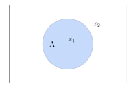
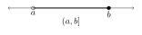

Mengi
=====
.. _s.Mengi:

.. panopto:: f624b32e-178d-41cc-8ccb-a559712471d7
    :width: 100%
    :height: 405

--------------------

Grunnhugtök
-----------

:hover:`Mengi, set` er safn aðgreindra hluta eða hugtaka sem saman mynda eina heild. Hlutirnir eða
hugtökin sem mynda mengið nefnast *stök* þess. Ef :math:`x` er :hover:`stak` í menginu :math:`A`, þá skrifum við
:math:`x \in A`. Ef :math:`x` er ekki stak í menginu :math:`A` þá skrifum við :math:`x \notin A`.

Hér dæmi um mengi :math:`A` þar sem :math:`x_1 \in A` en :math:`x_2 \notin A`.

Oft eru mengi sett fram sem upptalning á stökum. Til dæmis er

* :math:`\{1,2,3,\dots\}` mengi náttúrlegra talna,

* :math:`\{2,4,6,8,10\}` mengið sem samanstendur af fimm fyrstu jákvæðu sléttu tölunum og

* :math:`\{2,3,5,7,11\}` mengið sem samanstendur af fimm fyrstu frumtölunum.

:hover:`Tómamengið,  tómamengi` er mengi sem inniheldur ekkert stak. Það er táknað með :math:`\emptyset`.

Umfangsfrumsenda
~~~~~~~~~~~~~~~~
Tvö mengi :math:`A` og :math:`B` eru sögð vera jöfn,  ef þau innihalda sömu stök og við
skrifum þá :matH:`A=B`.

Hlutmengi
~~~~~~~~~
.. _s.hlutmengi:

Mengið :math:`B` er sagt vera :hover:`hlutmengi` í menginu :math:`A` ef sérhvert stak í :math:`B` er einnig stak í :math:`A`. Við skrifum þá :math:`B \subset A`.

.. image:: ./myndir/mengi/hlutmengi.svg
	:width: 60 %
	:align: center

Hér er dæmi um mengi :math:`A` sem inniheldur mengið :math:`B`, m.ö.o. :math:`B \subset A`

.. tip::
  Mengið :math:`B=\{ 2,4,6 \}` er hlutmengi í menginu :math:`A=\{1,2,3,4,5,6\}` því öll stökin í :math:`B` má líka finna í :math:`A` .

Yrðingar til að skilgreina mengi
--------------------------------

Stundum getur verið gagnlegt að skilgreina mengi með stökum sem öll hafa einhverja
ákveðna eiginleika. Við þurfum að geta táknað þetta mengi á einfaldan hátt en stundum eru
stökin óendanlega mörg og því ómögulegt að beinlínis telja þau upp eins og í dæmunum að
ofan.

:hover:`Yrðing, yrðing` er staðhæfing sem er annaðhvort sönn eða ósönn.
Oft skilgreinum við mengi með því að skrifa yrðingar um stök mengisins.
Við segjum að stak :math:`x` sé í menginu ef og aðeins ef allar yrðingarnar um það eru sannar.

Formlegri leið til að segja þetta er:

Skilgreining
~~~~~~~~~~~~

Hægt er að setja fram mengi með opinni yrðingu :math:`p(x)`, þannig að mengið samanstandi af öllum stökum  :math:`x` þannig að :math:`p(x)` sé sönn yrðing.

.. math::
	A = \{x \in C \ | \ p(x)\}

Sjáum að mengið :math:`A` er hlutmengi í :math:`C` .

Þetta verður best skýrt með dæmum.

.. tip::
 **1.** Látum :math:`A = \{x \text{ er frumtala }| x \text{ hefur } 3 \text{ í einingasætinu }\}`.

   Nú getum við sagt að t.d. :math:`3 \in A, 13 \in A, 103 \in A` þar sem allar þessar tölur eru frumtölur með :math:`3` í einingarsætinu.

   :math:`33` er ekki stak í :math:`A` (ritað :math:`33 \notin A)` því :math:`33` er ekki frumtala.

   :math:`51` er heldur ekki stak í :math:`A` því að hún hefur :math:`1` í einingasætinu en ekki :math:`3`.

 **2.** Látum :math:`C = \{x \text{ er heiltala }| x \text{ er slétt tala }, x \text{ er oddatala}\}`.

	 Hér er :math:`C = \emptyset` þar sem að engin tala getur verið bæði slétt tala og oddatala í einu.

Aðgerðir á mengjum
------------------

Ef :math:`A` og :math:`B` eru mengi þá táknum við mengi allra staka sem eru í :math:`A` eða í :math:`B` með
:math:`A\cup B`. Þetta mengi köllum við :hover:`sammengi` :math:`A` og :math:`B`.
Formlega skilgreiningin er:

.. math::
	A\cup B = \{x| x \in A \text{ eða } x \in B\}.

.. note::
    Í stærðfræðilegu samhengi hefur samtengingin „eða“ merkinguna „og/eða“.

Mengi allra staka sem eru bæði í :math:`A` og :math:`B` er táknað með :math:`A \cap B`. Þetta mengi er kallað
:hover:`sniðmengi` :math:`A` og :math:`B`.
Formlega skilgreiningin er:

.. math::
	A\cap B = \{x| x \in A \text{ og } x \in B\}.

.. warning::
  Við segjum að :math:`A` og :math:`B` séu :hover:`sundurlæg, sundurlægir tveir og tveir` ef sniðmengið er tómamengið, þ.e. ef mengin hafa ekkert sameiginlegt stak.

Mengi allra staka sem eru í :math:`A` en ekki í :math:`B` er kallað mismunur (eða :hover:`mengjamismunur, mengjamunur`) :math:`A` og
:math:`B`. Hann er táknaður með :math:`A\backslash B`.
Formlega skilgreiningin er:

.. math::
	A\backslash B = \{x| x \in A \text{ og }x \notin B\}.

.. image:: ./myndir/mengi/snidmengi.svg
	:width: 100 %
	:align: center

Hér er dæmi um tvö mengi :math:`A` og :math:`B` sem hafa sniðmengi, m.ö.o eru ekki :hover:`sundurlæg, sundurlægir tveir og tveir`. :math:`A \cap B` er merkt þar sem hringirnir skarast og :math:`A\backslash B` er merkt með þykkum ramma.

.. tip::
	Látum :math:`A=\{x\in\mathbb{N}|x\text{ er slétt tala}\},B=\{x\in\mathbb{N}|x\text{ er oddatala}\}` og :math:`C=\{2,3,5,6,8\}`

	Hér er :math:`A\cup B=\mathbb{N}` því að allar náttúrulegar tölur eru annað hvort sléttar tölur eða oddatölur.

	:math:`A\cap B=\emptyset` því að engin tala er bæði slétt tala og oddatala.

	:math:`A\setminus B=A` því að ekkert stak í :math:`A` er líka í :math:`B` og því er ekkert dregið frá.

	:math:`A\cap C=\{2,6,8\}`

	:math:`C\setminus B=\{2,6,8\}`

Faldmengi
~~~~~~~~~

:hover:`Faldmengi` eða margfeldismengi :math:`A\times B` tveggja mengja :math:`A` og :math:`B` er skilgreint sem mengi allra
para :math:`(a,b)` af stökum þ.a. :math:`a \in A` og :math:`b \in B`. Með yrðingum er þetta skrifað:

.. math::
	A\times B = \{(a,b)| a \in A \text{ og } b \in B\}.

.. tip::
	Látum :math:`A=\{2,3,6\}`

	:math:`\left(2,\dfrac{5}{4}\right)` er stak í :math:`\mathbb{N}\times\mathbb{Q}`. Það er  ritað :math:`\left(2,\dfrac{5}{4}\right)\in \mathbb{N}\times\mathbb{Q}`

	:math:`\left(2,\dfrac{5}{4}\right)` er líka stak í :math:`\mathbb{Q}\times\mathbb{Q}` því að :math:`2=\dfrac{2}{1}` er í báðum mengjunum :math:`\mathbb{N}` og :math:`\mathbb{Q}`

	:math:`\left(2,\dfrac{5}{4}\right)` er líka stak í menginu :math:`A\times\mathbb{Q}`

	:math:`\left(2,\dfrac{5}{4}\right)` er **ekki** stak í menginu :math:`\mathbb{N}\times\mathbb{N}` því :math:`\dfrac{5}{4}` er ekki í :math:`\mathbb{N}`

Fyllimengi
~~~~~~~~~~

Þegar verið er að fjalla um hlutmengi :math:`A` í ákveðnu mengi :math:`X`, þá er mengið :math:`X \backslash A` oft nefnt :hover:`fyllimengi` hlutmengisins :math:`A`, það er einnig táknað :math:`A^c`.
Í :math:`A^c` eru því öll stök sem eru í :math:`X` en ekki í :math:`A` .

.. image:: ./myndir/mengi/fyllimengi.svg
	:width: 45 %
	:align: center

Hér er bláa svæðið fyllimengi hlutmengisins  :math:`A`, :math:`A^c`.

Mengið X er kallað :hover:`almengi` og inniheldur alla hlutina sem verið er að vinna með. Oftast er ljóst af samhenginu hvað
þetta almengi er. Í dæminu að ofan sjáum við að :math:`X` er allt svæðið inní rétthyrningum.

Meira um aðgerðir á mengjum
---------------------------

Auðvelt er að sannfæra sig um eftirfarandi reiknireglur á mengjum:

.. math::
	\left(A\cup B\right)\cup C=A\cup\left(B\cup C\right)

.. math::
	\left(A\cap B\right)\cap C=A\cap\left(B\cap C\right)

Þessi regla segir að það skipti ekki máli í hvaða röð maður tekur sammengi og sniðmengi.
Því má skrifa :math:`A\cup B\cup C` eða :math:`A\cap B\cap C` og sleppa öllum svigum.

.. warning::

    Það þarf alls ekki að gilda að :math:`\left(A\cup B\right)\cap C=A\cup\left(B\cap C\right)`, til dæmis. Lesandi er hvattur til að ganga úr skugga um þetta sjálfur.

    Það skiptir höfuðmáli hvaða aðgerð er gerð fyrst þegar sam- og sniðmengjum er blandað saman. Að nota sviga er nauðsynlegt;  skrifa :math:`A\cup B\cap C` eða :math:`A\cap B\cup C` er merkingarlaust.

.. tip::
 Gefin eru mengin  :math:`A:= \{ 1,2,3,4,5 \}, B := \{ 2,4,6,8,10\}` og :math:`C := \{ 6,7,8,9,10\}`

 **1.** Finnið :math:`(A \cup B) \cap C`.

  Byrjum á að finna :math:`A \cup B`. Það er mengi allra staka sem eru stök í öðru hvoru mengjanna :math:`A` eða :math:`B`, það er, :math:`A \cup B = \{1,2,3,4,5,6,8,10 \}`.

  :math:`(A \cup B) \cap C` inniheldur síðan nákvæmlega þau stök sem eru bæði í :math:`A \cup B` og :math:`C`.

  :math:`(A \cup B) \cap C = \{6,8,10 \}`.

 **2.**  Finnið :math:`A \cup (B \cap C)`.

  Nú er :math:`B \cap C = \{6,8,10 \}` og þá er :math:`A \cup (B \cap C) = \{1,2,3,4,5,6,8,10 \}`.

  Tökum eftir að hér er dæmi þar sem að :math:`(A \cup B) \cap C \neq A \cup (B  \cap C)` gildir.

 **3.** Finnið :math:`(A \cap B) \cap C`.

  Nú er :math:`A \cap B = \{ 2,4 \}` svo :math:`(A \cap B) \cap C = \{2,4 \} \cap \{6,7,8,9,10 \} = \emptyset` því :math:`2` og :math:`4` eru ekki í :math:`C` .

---------------------------------------------------------------------------------------

Nú skulum við skilgreina sam- og sniðmengi fleiri en tveggja mengja.
Látum :math:`n \in \mathbb{N_+}` og :math:`A_1,A_2,\dots,A_n` vera mengi. Látum :math:`I = \{1, \dots, n \}`. Skilgreinum:

.. math::
	\begin{aligned}
	& \bigcup_{i=1}^n A_i=\{x|x\in A_i \text{ fyrir eitthvað } i = 1, \dots, n \}, \\
	\quad\\
	& \bigcap_{i=1}^n A_i=\{x|x\in A_i \text{ fyrir öll }  i = 1, \dots, n\}.
	\end{aligned}

Í raun er :math:`\bigcup_{i=1}^n A_i` bara önnur leið til að skrifa

.. math::
	A_1\cup A_2\cup A_3\cup...\cup A_n

og :math:`\bigcap_{i=1}^n A_i` er bara önnur leið til að skrifa

.. math::
	A_1\cap A_2\cap A_3\cap...\cap A_n

.. note::
  Hér nýtum við okkur reikniregluna að :math:`\left(A\cup B\right)\cup C=A\cup\left(B\cup C\right)`, og hliðstæðu hennar fyrir sniðmengi, aftur og aftur.

Inn á milli kemur fyrir að stærðfræðingur vilji taka sammengi óendanlegra margra mengja. Segjum að við höfum eitthvað safn af mengjum (eða mengi af mengjum) þannig að búið sé að merkja öll mengin með einhverjum :hover:`vísi, vísitala` úr einhverju :hover:`vísamengi` :math:`I`. Það er, öll mengin í safninu má tákna með :math:`A_i` með :math:`i\in I`, þar sem :math:`I \neq \emptyset`. Þá er sammengi allra þessara mengja táknað með :math:`\bigcup_{i\in I}A_i`.

Með yrðingum er þetta skilgreint:

.. math::
	\bigcup_{i\in I}A_i=\{x|x\in A_i \text{ fyrir eitthvað } i\in I \}

Eins eru sniðmengin skilgreind:

.. math::
	\bigcap_{i\in I}A_i=\{x|x\in A_i \text{ fyrir öll } i\in I \}

Tökum nokkur dæmi um þetta.

.. tip::
	**1.** Látum :math:`\mathbb{P}` tákna mengi allra frumtalna.

	 Fyrir sérhvert :math:`p\in\mathbb{P}` skulum við láta :math:`A_p` vera mengi allra náttúrulegra talna sem :math:`p` gengur upp í. Með yrðingum skrifum við:

	 .. math::
		A_p=\{n\in\mathbb{N}|p\text{ gengur upp í }n \}

	 Hér er vísismengið :math:`\mathbb{P}` og

	 .. math::
	 	\bigcup_{p\in\mathbb{P}}A_p=\mathbb{N}\setminus\{1\}

	 Það er af því að sérhver tala í :math:`\mathbb{N}` sem er stærri en :math:`1` er deilanleg með einhverri frumtölu, og því er til :math:`p` þannig að talan sé í :math:`A_p`.

	**2.** Fyrir sérhvert :math:`n\in \mathbb{Z}` skulum við láta :math:`B_n` vera mengi allra almennra brota sem hafa :math:`n` sem teljara þegar þau eru fullstytt. Með yrðingum skilgreinum við þetta mengi:

	 .. math::
	 	B_n=\{r\in\mathbb{Q}|\,\, \text{Ef }r=\dfrac{a}{b}\text{ og } \dfrac{a}{b}\text{ er fullstytt brot þá er }a=n \}

	 Hér er :math:`\mathbb{Z}` vísismengið og:

	 .. math::
	 	\bigcup_{n\in\mathbb{Z}}B_n=\mathbb{Q}

	 Af því að sérhvert almennt brot er í einhverju af mengjunum :math:`A_n`.

	**3.** Látum :math:`T` vera mengið sem hefur sem stök öll tré í heiminum. Ef :math:`t\in T` er eitthvað tré látum við mengið :math:`L_t` vera mengi allra laufblaða á trénu :math:`t`. Með yrðingum skrifum við:

	 .. math::
	 	L_t=\{l\text{ er laufblað}|\, l\text{ er á trénu }t \}

	 Hér er :math:`T` vísismengið og

	 .. math::
	 	\bigcup_{t\in T}L_t=\{l\text{ er laufblað}|\, l\text{ er á einhverju tréi } \}

Rauntalnabil
------------
Látum :math:`I` vera hlutmengi í :math:`\mathbb{R}`.
Við köllum hlutmengið :math:`I` :hover:`bil` ef engin göt eru í :math:`I` .
Með öðrum orðum, við segjum að mengið :math:`I` sé bil ef við getum táknað það á talnalínunni með breiðu línustriki með engum götum.
Á hvorn endapunkt striksins setjum við annað hvort fylltan hring eða tóman, eftir því hvort sá :hover:`endapunktur` sé með í bilinu eða ekki.
Ef punkturinn á að vera með setjum við fylltan hring, annars tóman.

Formlega skilgreiningin á bili er svohljóðandi:

Skilgreining
~~~~~~~~~~~~

Hlutmengi :math:`I` í :math:`\mathbb{R}` kallast :hover:`bil` ef fyrir sérhvert :math:`a,b\in I` og :math:`c\in\mathbb{R}` þ.a. :math:`a<c<b` þá gildir :math:`c\in I` .

Gerðir af bilum
~~~~~~~~~~~~~~~

Til að tákna bil í prenti þarf að nota tvær tölur, hornklofa og/eða sviga eftir aðstæðum og eina kommu. Hér verða nokkur bil útskýrð í töluðu máli:

Bilið :math:`[a,b]` er mengi allra rauntalna sem eru á milli :math:`a` og :math:`b`, meðtaldar eru tölurnar :math:`a` og :math:`b`.

Bilið :math:`(a,b)` er mengi allra rauntalna sem eru á milli :math:`a` og :math:`b` en hér eru :math:`a` og :math:`b` frátaldar.

Bilið :math:`(a,\infty)` er mengi allra rauntalna sem eru stærri en :math:`a` en hér er :math:`a` ekki tekið með.

Bilið :math:`[a,b)` er mengi allra rauntalna sem eru á milli :math:`a` og :math:`b` að stakinu :math:`a` meðtöldu en án staksins :math:`b`.

.. note::
	Hér eru notaðir svigar fyrir opin bil, en í sumum bókum er opið bil táknað með því að snúa hornklofunum öfugt.
	Því :math:`]a,b[` táknar það sama og :math:`(a,b)` .

Hér er tæmandi listi yfir allar gerðir af endanlegum bilum, skilgreindum með yrðingum:

Látum :math:`a` og :math:`b` vera rauntölur þannig að
:math:`a<b`. Skilgreinum

	1. :hover:`opið bil` :math:`(a,b)=\{x\in \mathbb{R}| a<x<b\}`

	2. :hover:`lokað bil` :math:`[a,b]=\{x\in \mathbb{R}| a\leq x\leq b\}`

	3. :hover:`hálfopið bil` :math:`[a,b)=\{x\in \mathbb{R}| a\leq x<b\}`

	4. :hover:`hálfopið bil` :math:`(a,b]=\{x\in \mathbb{R}| a< x\leq b\}`

.. image:: ./myndir/mengi/endanlegbil.svg
	:width: 60%
	:align: center

---------------------

Óendanlegu bilin eru þau sem halda áfram óendanlega langt í aðra hvora eða báðar áttir.
Látum :math:`a` vera rauntölu. Skilgreinum

	5. *opið óendanlegt bil* :math:`(a,\infty)=\{x\in \mathbb{R}| a<x\}`

	6. *opið óendanlegt bil* :math:`(-\infty, a)=\{x\in \mathbb{R}; x<a\}`

	7. *lokað óendanlegt bil* :math:`[a,\infty)=\{x\in \mathbb{R}; a\leq x\}`

	8. *lokað óendanlegt bil* :math:`(-\infty, a]=\{x\in \mathbb{R}; x\leq a\}`

	9. *öll rauntalnalínan* :math:`(-\infty, \infty)= \mathbb{R}`.

.. image:: ./myndir/mengi/oendanlegbil.svg
	:width: 60%
	:align: center
