.. _c.inngangur:

Inngangur
=========

Tölfræði sem fræðigrein snýst um að vinna upplýsingar út frá tölulegum
mælingum. Gróflega skiptist tölfræðin í tvo anga: að lýsa sem best þeim
gögnum sem fyrirliggjandi eru og að draga ályktanir um almenna hópa eða
þýði út frá mælingum á úrtaki. Í flestum tilfellum er unnið með mikið
magn mælinga og því fer almenn tölfræði- og gagnavinnsla að mestu fram
með aðstoð tölva. Sérhæfð tölfræðiforrit komu snemma fram á sjónarsviðið
og eftir því sem að möguleikar þeirra, sem og reiknigeta tölva, jukust,
varð beiting tölfræði víðfeðmari. Mikill fjöldi forrita eru sérsniðin
fyrir tölfræði, bæði fyrir almenna og sértæka tölfræðiúrvinnslu. Þar ber
helst að nefna R, S-Plus, SAS, STATA og SPSS sem öll hafa náð töluverðri
útbreiðslu innan vissra geira. Einnig eru töflureiknar (t.d. Excel)
mikið notaðir við tölfræðiúrvinnslu, en hafa skal þó í huga að
töflureiknar eru almennt ekki ekki hannaðir sem tölfræðihugbúnaður. Mörg
þessara forrita hafa það sammerkt að notkun þeirra er háð leyfi og
notkun þeirra fyrir utan háskólaumhverfið takmörkuð sökum leyfisgjalda.

Nú í seinni tíð hefur aukist áhersla á þróun opins tölfræðihugbúnaðar,
þ.e. hugbúnaðar sem byggist á forritunarkóða er opinber og aðgengilegur
fyrir alla. Slíkur hugbúnaður er yfirleitt ókeypis og mjög
sveigjanlegur. Eitt vinsælasta tölfræðiforritið í dag, R, er gott dæmi
um þessa þróun. R sem hugbúnaður á rætur að rekja aftur til
tilraunaverkefnis tveggja prófessora í tölfræði rétt fyrir aldamót.
Prófessoranir tveir, Ross Ihaka og Robert Gentleman við háskólann í
Auckland Nýja Sjálandi, þróuðu hugbúnaðinn fyrst til kennslu. Síðar vatt
þróunin uppá sig, ekki síst vegna þess að hún var opin og í mikilli
samvinnu við notendur. Í dag er R bæði forritunarmál og -umhverfi fyrir
alla almenna tölfræði- og gagnavinnslu. Stór þáttur í vinsældum R umfram
önnur tölfræðiforrit er sveigjanleiki og fjöldi viðbóta, svonefndra
pakka, sem bæta og auka möguleika forritsins. R hefur því orðið á
seinustu árum eitt helsta verkfæri tölfræðinga og nú orðið eru flestar
tölfræðiaðferðir fyrst forritaðar fyrir R, áður en önnur forrit taka þau
upp.

Fyrir þá sem hafa bakgrunn í forritun, þá tölum við oft jöfnum höndum um
*forritið* R (forritið sem framkvæmir tölfræðiúrvinnsluna) og
*forritunarmálið* R (skipanirnar sem að við gefum forritinu).
Tölfræðiforritið R útfærir forritunarmál sem er sérsniðið fyrir tölfræði
og gagnavinnslu. Ein af sérstöðum R sem forritunarmáls er að í því má
finna sérsniðnar gagnategundir sem tengdar eru tölfræði. Þar má nefna
flokkabreytur, talnabreytur og gagnatöflur, sambærilegar við töflur í
gagnagrunni. Einnig er mikil áhersla lögð á myndræna framsetningu.

R er til fyrir helstu stýrikerfi, þ.e. Windows, MacOsX og Linux. Hráasta
viðmót R er skipanalína, en fjöldinn allur af hjálparforritum hafa verið
þróuð til þess að styðja við notkun á R með einum eða öðrum hætti. Slík
forrit kallast *notendaviðmót* og má þar einna helst nefna RStudio, sem
hefur síðastliðin ár orðið eitt vinsælasta viðmótið fyrir R. RStudio
hefur, auk mikils stuðnings við R og R-skipanaskrár, innbyggð tól fyrir
sjálfvirka skýrslugerð, skjalastjórnun og gagnvirka greiningu með R.

Um þessa bók
------------

Um þessa bók
~~~~~~~~~~~~

Þessi bók er skrifuð með það í huga að vera uppflettirit fyrir notendur
sem eru að stíga sín fyrstu skref með R. Henni er því ekki ætlað að vera
kennslubók í tölfræði. Gert er ráð fyrir að notandinn hafi annað hvort
einhvern grunn í tölfræði eða geti aflað hans úr öðrum bókum.

Bókin ýtir notandanum af stað í R með því að kynna til sögunnar helstu
grunnatriði og vísa svo veginn að frekara ýtarefni. Bókinni er skipt í
þematengda kafla þar sem í hverjum kafla er inngangur um efnið og því
næst eru tilteknar aðferðir kynntar með dæmum um notkun. Undir lok
kaflanna eru, eftir atvikum, undirkaflar með frekari útvíkkunum. Þeir
kaflar eru stjörnumerktir og er lesandanum óhætt að geyma þá kafla til
síðari tíma án þess að það komi að sök við frekari lestur bókarinnar.

Í hvert sinn sem að ný aðferð (við munum ýmist nota orðin aðferð, fall
eða skipun um R-skipanir) er kynnt til sögunnar verður yfirlit um helstu
eiginleika hennar lýst með gulum kassa:

aðferð()
^^^^^^^^

.. attention::

    **Inntak:** Með hverju á að mata aðferðina
    
    **Úttak:** Hvað býr aðferðin til
    
    **Helstu stillingar:** Hvað má fínstilla (ef við á)

--------------

Að því loknu taka við dæmi um beitingu aðferðarinnar í hvítum kössum:

::

   aðferð sem hægt er að keyra í R

Allar skipanirnar byggja á aðgengilegum gögnum svo lesandinn getur hermt
þær eftir á eigin tölvu til að dýpka skilninginn.

Við gerum ráð fyrir að notandinn hafi bæði forritin R og RStudio
uppsett. Hægt er að nálgast R af slóðinni http://cran.hafro.is og
RStudio af http://www.rstudio.com/ide/. Einnig má benda á að til eru
fjölmörg kennslumyndbönd um notkun R en þau má finna á
http://kennslubanki.hi.is

Hvernig virkar R?
-----------------

Fyrir þá sem ekki eru vanir því að forrita getur R virst framandi við
fyrstu sýn. Þá getur verið gott að hugsa um R sem tóman verkfærakassa
sem við munum síðar fylla af alls konar *hlutum*. Þessir hlutir geta
verið af ýmsu tagi, allt frá gögnum til grafa, greininga og aðferða, svo
dæmi séu nefnd.

Í hvert sinn sem við komum að nýju verkefni er kassinn tómur. Síðan
hefst *vinnulotan* okkar, þar sem við notum *skipanir* til að búa til
nýja *hluti* í kassanum okkar. Í hvert sinn sem við framkvæmum skipun í
R höfum við val um tvennt:

-  Að skipunin spýti hlutnum sem við bjuggum til á skjáinn okkar og eyði
   honum svo jafnóðum (hendi honum úr kassanum um leið).

-  Að skipunin *visti* hlutinn þannig að við getum nálgast hann aftur og
   unnið frekar með hann (geymi hann í kassanum).

Í hluta :numref:`%s <s.adferdir>` förum við nánar í það hvernig skipanir virka.

R getur ekki vistað hluti nema þeir hafi eitthvað nafn. Það þýðir að
allt í kassanum verður að hafa eitthvað heiti og gildir það jafnt um
gögn sem aðferðir eða greiningar. Þegar við gefum hlut eitthvað heiti
notum við ritháttinn:

.. math:: \texttt{nafn <- skipun}

þar sem í stað ``nafn`` kemur nafnið sem við viljum gefa hlutnum og í
stað ``skipun`` kemur sú skipun sem býr til hlutinn. Táknin þar á milli
eru "minna en merkið" og bandstrik. Skipunin getur samanstaðið af
mörgum orðum svigum og alls kyns táknum. Ef við hins vegar skrifum bara
skipunina, án þess að vista hana undir nafni, prentar R út það sem
skipunin gerir á skjáinn, án þess að vista nokkuð.

Tveir ólíkir hlutir geta ekki haft sama nafnið. Ef við búum til hlut sem
hefur sama nafn og hlutur sem við höfðum áður búið til þá hverfur gamli
hluturinn og sá nýji kemur í hans stað. Í R er heldur enginn *undo*
takki, þ.e.a.s. ekki er hægt að afturkalla skipanir með neinum hætti.
Það þýðir að ef við höfum breytt einhverjum hlut er engin leið að
afturkalla þá breytingu nema með því að búa hlutinn aftur til. Það er þó
ekkert til að óttast svo framanlega sem við vöndum vinnulagið okkar í R.
Það er umfjöllunarefni næsta hluta.

.. _s.vinnulag.i.r:

Vinnulag í R/RStudio
--------------------

Vinnulag í R/RStudio
~~~~~~~~~~~~~~~~~~~~

Í R er lítið um músasmelli heldur byggist úrvinnslan á því að gefa
forritinu tilteknar skipanir sem það vinnur síðan úr. Það er hvort
tveggja í senn, einn af stærstu kostum R en jafnframt sá eiginleiki sem
fælir marga frá forritinu í upphafi.

Stærsti kosturinn við að gefa skipanir er sá að við getum skrásett
nákvæmlega allar aðgerðir okkar og því getum við ekki einungis
nákvæmlega endurtekið alla úrvinnslu heldur gert það með lítilli
fyrirhöfn. Því margborgar sig að venja sig á skilvirkt vinnulag frá
fyrsta degi þegar unnið er í R. Helsti gallinn við að gefa skipanir er
sá að nöfnin á skipununum standa ekki á skjánum fyrir framan okkur
heldur þurfum við að muna þær eða kunna að leita að þeim, en við munum
koma að þessu síðar.

Afar mikilvægt atriði í góðu vinnulagi í R er að útbúa sérstaka möppu á
tölvunni fyrir sérhvert verkefni, þar sem skipanaskrár, gagnasöfn og
annað sem kemur að vinnslu í R eru geymd. Þessa mappa er kölluð
*vinnumappa*.

Windows notendur þurfa að passa sig að nota ekki íslenska stafi né bil í
heitinu á möppunni né geyma möppuna í möppum sem inniheldur íslenska
stafi eða bil. Það er því ekki hægt að geyma möppuna í:

``C\:kalli\My Documents\tolfraedi\Rverkefni``

þar sem það er bil í ``My documents``. Makka og Linux notendur þurfa
ekki að hafa áhyggjur af þessu.

Til að vinna í R opnum við forritið RStudio. Rstudio keyrir R fyrir
okkur og við þurfum að gæta þess að vera búin að hlaða R niður en við
opnum R ekki sérstaklega.

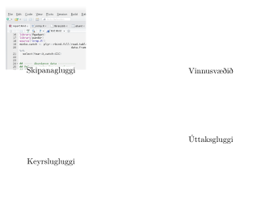

Í RStudio er viðmótinu skipt upp í fjóra glugga, eins og sjá má á
myndinni hér fyrir ofan. Neðri vinstri glugginn er *keyrsluglugginn*,
þar höfum við samskipti við R með því að slá inn skipanir. Þetta er
staðurinn þar sem við *búum til hluti* og þar sem R sýnir okkur útkomur
skipana þegar við biðjum um þær. Hér búum við til allt í
verkfærakassanum okkar.

Efri vinstri glugginn er *skipanaglugginn*. Þar geymum við allar þær
skipanir sem við mötum inn í keyrslugluggann. Í þessum glugga er ekkert
framkvæmt, heldur skrifum við niður *uppskriftir* af hlutunum sem við
búum til. Byrjendum finnst oft gott að prófa sig fyrst áfram í
keyrsluglugganum og færa svo þær skipanir "sem virkuðu" yfir í
skipanagluggann. Þegar meiri færni er náð verður betra að vinna alfarið
í skipanaglugganum og hlaða síðan skipununum inn í keyrslugluggann þegar
við viljum sjá útkomur þeirra.

Skipanirnar sem við geymum í skipanaglugganum vistum við í sérstaka
skrá, sem við köllum *skipanaskrá*. Skipanaskrá er alltaf lesin frá
efstu línu og niður svo við þurfum að gæta þess að skrá þær skipanir sem
við viljum framkvæma í réttri röð. Það að breyta hlut neðarlega í
skipanaskrá hefur engin áhrif á þann hlut ofar í skránni. Á meðan við
skráum alla þá úrvinnslu sem við viljum framkvæma í skipanaskránni
þurfum við ekki að hafa nokkrar áhyggjur af því þó við framkvæmum mistök
og eyðum út eða eyðileggjum hluti sem við vorum búin að búa til. Við
lagfærum bara þá línu þar sem mistökin voru og keyrum allar skipanirnar
aftur, frá efstu línu og niðurúr. Yfirleitt tekur það einungis
örskotsstund.

Auðvelt er að senda línur úr skipanaskránni okkar í keyrslugluggann. Við
staðsetjum bendilinn í þeirri línu sem við viljum flytja, höldum svo
niðri :kbd:`⌘` + :kbd:`⏎` á MacOs en :kbd:`Ctrl` + :kbd:`⏎` á Windows/linux.
Þá afritast viðkomandi lína yfir í keyrslugluggann og skipunin er framkvæmd.
Einnig er hægt að keyra alla skipanaskrána með því að smella á "source"
hnappinn efst í hægra horninu á skipanaglugganum.

Þið vitið eflaust að mismunandi tegundir af skrám hafa mismunandi
endingar. Þannig er algengt að Word skrár hafi endinguna .docx og að
Excel skrár hafi endinguna .xlsx. Skipanaskrár unnar í R hafa endinguna
.R.

Í efri hægri glugganum eru tveir flipar. Í öðrum flipanum sjáum við
*vinnusvæðið* okkar. Það eru allir þeir hluti sem búnir hafa verið til í
vinnulotunni, hvort sem það eru gögn sem hafa verið lesið inn eða
tölfræðilíkön sem hafa verið vistuð. Þetta er með öðrum orðum allt það
sem við erum búin að búa til í verkfærakassanum okkar. Í hinum glugganum
má sjá skipanasöguna okkar, þ.e. lista yfir þær skipanir sem keyrðar
hafa verið í vinnulotunni.

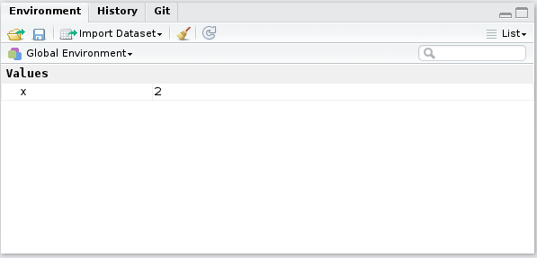

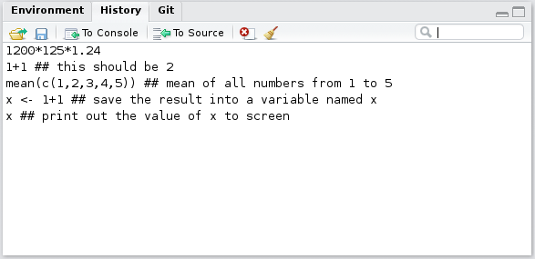

Í neðri glugganum hægra meginn eru fimm flipar. Þar sjáum við myndir sem
teiknaðar eru í R og hjálpina sem hægt er að kalla á fyrir R-skipanir.
Hægt er að leita í hjálpinni með því að slá inn leitarorð í
leitargluggann í horninu hægra meginn, en nánar verður fjallað um
hjálpina í R síðar í kaflanum.

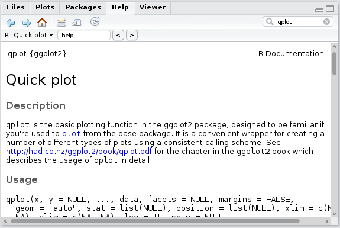

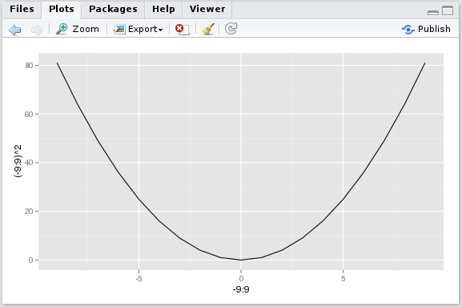

Það fyrsta sem við gerum þegar við opnum RStudio er að staðsetja okkur í
réttri möppu, þ.e.a.s. vinnumöppunni okkar. Við staðsetjum okkur í
réttri möppu með því að velja ``Session``\ :math:`\rightarrow`
``Set Working Directory`` :math:`\rightarrow` ``Choose Directory`` og
velja þar möppuna. Rstudio sýnir okkur þá innhald möppunnar í
úttaksglugganum undir ``Files``.

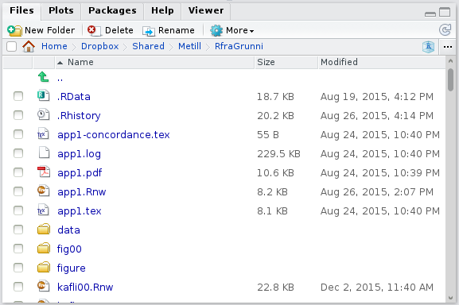

Þegar RStudio er ræst í fyrsta skipti þarf að opna sérstaklega
skipanaglugga með því að fara í ``File``\ :math:`\rightarrow`
``New Document``\ :math:`\rightarrow` ``R script``. Þá birtist
skipanagluggi á skjánum. Viljum við koma aftur að skipanaskrá sem
viðhöfum áður unnið með förum við í ``Open`` í stað ``New Document``.

Verkefnautanumhald í Rstudio
^^^^^^^^^^^^^^^^^^^^^^^^^^^^

Þegar unnið er að fleiri en tveim úrvinnslum í einu og/eða við viljum
koma að sömu úrvinnslu síðar meir getur Rstudio auðveldað okkur lífið
enn frekar með því að skilgreina *verkefni*. Verkefni eru sérstakar
skrár með endingunni ".Rproj". Þær halda utan um vinnumöppu notandans,
tryggja að ný (og hrein) vinnulota er ræst (þ.a. niðurstöður annarra
reikninga trufli ekki þá sem notandinn vill vinna með) og opnar þær
skrár sem notandinn var að vinna með seinast. Hægt er að hafa sértækar
stillingar fyrir sérhvert verkefni sem og að hafa mörg verkefni opin í
einu, eitt í hverjum glugga. Nýtt verkefni er stofnað með því að velja
``File``\ :math:`\rightarrow`\ ``New project`` og svo í framhaldinu
velja viðeigandi hluti í valglugga sem þá birtist:

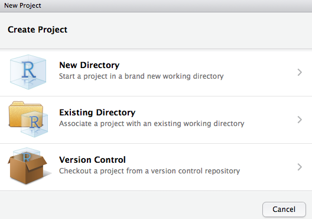

Hér hefur notandinn möguleika á því að tengja verkefni við þrjár gerðir
af vinnumöppum: A) nýja vinnumöppu, B) tengja við vinnumöppu sem er til
og geymir gagnasett, og C) vinnumöppur sem tengjast
skjalastjórnunarkerfunum git og svn. Sé ný vinnumappa valin þá fær
notandinn val um skilgreina verkefnið betur svo að Rstudio geti sett
verkefnið rétt upp:

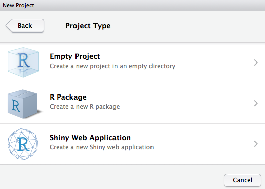

Lesendur þessarar bókar munu að öllum líkindum velja fyrst um sinn *tómt
verkefni* (e. empty project). Hinir tveir valmöguleikarnir bjóða upp á
stillingar fyrir pakkasmíði og gagnvirkt vefviðmót fyrir R-forrit. Sé
tómt verkefni valið er notandinn beðinn um að finna stað fyrir
verkefnið.

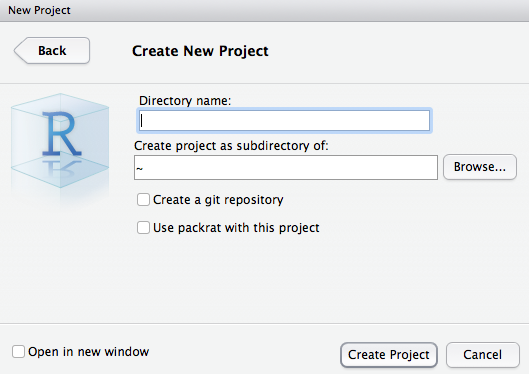

Rstudio býr þá til nýtt verkefni á þeim stað. Þá verður til skrá með
endinguna ``.Rproj``, sé smellt á hana opnast R, með vinnumöppuna sem
við tilgreindum í vinnulotunni og opnar þær skipanaskrár sem síðast voru
opnar þegar við unnum í verkefninu.

Slökkt á Rstudio
^^^^^^^^^^^^^^^^

Þegar slökkt er á Rstudio er notandinn spurður um óvistaðar skrár:

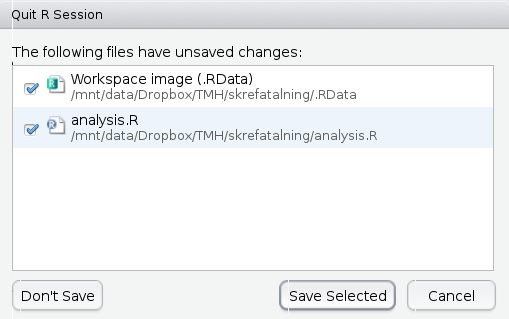

Hér hefur notandinn ekki vistað skránna "analysis.R", sem líkast til er
æskilegt að gera. Hin skráin "Workspace image (.RData)" geymir þá hluti
sem eru til í vinnulotunni hjá notandanum. Mörgum þykir þægilegt að
geyma vinnusvæðið milli vinnulota, sérstaklega ef þungir útreikningar
liggja að baki þeirra. Hafa skal þó í huga að hlutir úr geymdu
vinnusvæði geta truflað úrvinnslu og því er æskilegt að geyma ekki
vinnusvæðið milli vinnulota. Einnig er það ekki æskilegt vegna
*rekjanleika*, betra er að allir hlutir séu skilgreindar í skipanaskrá
sem er svo keyrð þegar þarf.

.. _s.adferdir:

Aðferðir/skipanir/föll
----------------------

Aðferðir/skipanir/föll
~~~~~~~~~~~~~~~~~~~~~~

help()
^^^^^^

.. attention::

    **Inntak:** Nafn á falli
    
    **Úttak:** Kallar fram hjálparsíðuna fyrir fallið
    
    **Helstu stillingar:** package, help\ :math:`\_`\ type

--------------

R hefur, eins og áður sagði, fjölda innbyggðra falla sem auðvelda
notandanum að vinna með gögn auk þess sem auðvelt er fyrir notandann að
smíða sín eigin föll. Til þess að fá yfirsýn yfir þessi innbyggðu föll
hefur R innbyggða *hjálp* sem gefur okkur nánari upplýsingar um þá
skipun/aðferð/fall sem við viljum fræðast meira um. Þannig gefur
skipunin

::

   help(read.table)

okkur nánari upplýsingar um skipunina ``read.table()``. Nánari
upplýsingar birtast þá í nýjum glugga á skjánum. Látið útlit
hjálparinnar ekki fæla ykkur frá. Það er vissulega hrátt og gæti virst
óskiljanlegt í fyrstu en læri maður að líta á úttakið réttum augum má
finna þar miklar upplýsingar á fljótlegan hátt. Hjálpin í R fylgir
eftirfarandi sniðmáti:

-  Efst, undir ``Description:``, kemur stutt lýsing á skipuninni.

-  Þar á eftir kemur ``Usage:`` en þar sjást allar þær stillingar sem
   hægt er að gefa skipuninni. Yfirleitt eru flestar stillingarnar
   *sjálfgefnar* sem þýðir að ef við tilgreinum ekkert eru stillingarnar
   sjálfkrafa stilltar á algengustu gildin. Viljum við breyta einhverjum
   af stillingunum, þá tilgreinum við eingöngu þær stillingar sem við
   viljum breyta og hvaða gildi við viljum að séu á þeim stillingum.

-  Næst er komið að ``Arguments:``. Þar eru allar mögulegar stillingar
   sýndar, hvaða gildi er hægt að gefa þeim og hvaða áhrif það hefur.

-  ``Details:`` gefur ítarlega lýsingu á þeirri "vinnu" sem skipunin
   framkvæmir.

-  ``Value:`` útskýrir hvers lags útkoma kemur út úr skipuninni.

-  Undir ``Note:`` má finna ýmsar gagnlegar ábendingar.

-  Í ``References:`` eru heimildir sem aðferðin byggir á.

-  Oft reynast góðir molar í ``See Also:``. Þar eru oft dæmi um aðrar
   skyldar aðferðir sem gætu reynst gagnlegar sem og heimasíður og
   fleira sem gæti komið að góðum notum.

-  Að lokum má sjá dæmi um beitingu aðferðinnar í ``Examples:``. Verið
   óspör að prófa þau dæmi til að kynnast aðferðinni betur.

Stundum eru fleiri kaflar í hjálpinni en þetta eru þeir mikilvægustu.

help.search()
^^^^^^^^^^^^^

.. attention::

    **Inntak:** Efnisatriði innan gæsalappa
    
    **Úttak:** Leitar að efni í texta hjálparsíða R falla
    
    **Helstu stillingar:** package, fields

--------------

Ef við þekkjum ekki nafnið á fallinu má leita eftir efnisatriði:

::

   help.search("efnisatridi")

Þá er þó aðeins leitað í þeim *pökkum* sem hefur verið hlaðin niður á
tölvuna sem unnið er á. Við förum nánar í pakka í hluta :numref:`%s <s.pakkar>`.
Það sama gildir um föllin ``help()`` og ``help.search()``. Ef við viljum
leita að skipunum sem gætu mögulega leynst í pökkum sem við höfum ekki
hlaðið niður má nota skipunina ``RSiteSearch()``.

RSiteSearch()
^^^^^^^^^^^^^

.. attention::

    **Inntak:** Efnisatriði innan gæsalappa
    
    **Úttak:** Leitar að föllum á heimasíðu R
    
    **Helstu stillingar:** restrict, sortby

--------------

Til að leita á heimasíðu R eftir efnisatriði má nota

::

   RSiteSearch("efnisatridi")

sem gefur notandanum lista yfir pakka og föll sem til eru á heimasíðu R
í nýjum vafraglugga.

apropos()
^^^^^^^^^

.. attention::

    **Inntak:** Textabrot innan gæsalappa
    
    **Úttak:** Listi að föllum sem innihalda textabrotið
    
    **Helstu stillingar:**

--------------

Ef allt annað bregst, en við munum part úr nafni fallsins, en þó ekki
alveg allt, þá getum við notað fallið ``apropos``. Það skilar lista af
nöfnum falla sem hafa ákveðinn ``strenghluta``, þ.e. nafnið á fallinu
inniheldur þann textabút.

::

   apropos('spss') ## skilar villu ef foreign pakkinn
   ## er ekki virkur i minni
   library(foreign) ## pakki sem inniheldur read.spss fallid
   apropos('spss')

Athugið að ``apropos`` skilar aðeins nöfnum falla sem eru í minni.

args()
^^^^^^

.. attention::

    **Inntak:** Nafn á falli
    
    **Úttak:** Inntak fallsins

--------------

Vilji notandinn aðeins skoða hver inntökin í fallið eru er hægt að nota
fallið ``args``:

::

   args(mean)
   ## function (x, ...)
   ## NULL

R sem vasareiknir
-----------------

Í R má framkvæma allar þær aðgerðir sem finna má á venjulegum
vasareiknum. Þannig leggur skipunin

::

   3+5
   ## [1] 8

einfaldlega saman tölurnar 3 og 5. Á sama hátt og við erum vön notum við
mínus (-), margföldun (*) og deilingu (:math:`\backslash`).

Aðferðin \*\* hefur tölur í veldi. Skipunin

::

   2**4
   ## [1] 16

reiknar því stærðina :math:`2^4`.

Aðferðin ``sqrt()`` tekur rótina af tölunum sem við mötum hana með

::

   sqrt(9)
   ## [1] 3

skilar sem dæmi rótinni af 9.

R beitir réttri röð reikniaðgerða. Það er að segja, það byrjar á því að
hefja í veldi eða taka rætur, því næst margfaldar það eða deilir og að
lokum leggur það saman eða dregur frá. Gefum við því skipunina

::

   3+5*4**2
   ## [1] 83

byrjar það á því að reikna :math:`4^2` (16) síðan margfaldar það þá
stærð með 5 (80) og leggur á endanum þrjá við (83).

Við notum sviga á sama hátt í R og hefðbundnum vasareiknum. Ef við notum
sviga þá byrjar R á því að reikna stæðuna sem stendur innan svigans eins
og við viljum. Gætið ykkar samt á því að R skilur ekki skipunina:

::

   3(6-8/2)
   ## Error in eval(expr, envir, enclos): attempt to apply non-function

Ef við viljum margfalda töluna 3 við innihald svigans þá verðum við að
muna eftir að setja margföldunarmerkið (*) á milli, þ.e. skrifa:

::

   3*(6-8/2)
   ## [1] 6

Þessi skipun reiknar stærðina
:math:`3 \cdot (6 - 8/2) = 3 \cdot (6-4) = 3\cdot 2` og gefur því
útkomuna 6.

Skipunin ``exp()`` hefur e í það veldi sem hún er mötuð með. Viljum við
hefja :math:`e` í veldið 3, þ.e.a.s. reikna :math:`e^3` gefum við
skipunina:

::

   exp(3)
   ## [1] 20.08554

Skipunin ``log()`` tekur logarithma af því sem við mötum hana með. Gætið
ykkar þó að sjálfgefna stillingin í R reiknar náttúrulega logarithmann
(með grunntöluna :math:`e`). Ef við viljum logarithma með grunntöluna 10
notum við stillinguna ``base=10``. Þá myndum við gefa skipunina

::

   log(33, base=10)
   ## [1] 1.518514

til að reikna log(33) svo dæmi sé nefnt.

Viljum við geyma niðurstöður reikninga, eða aðgerða almennt, má alltaf
vista niðurstöðurnar sem ``hlut``:

::

   a <- 1 + 1
   a
   ## [1] 2
   b <- a + 1
   b
   ## [1] 3

.. _s.pakkar:

R-pakkar
--------

R-pakkar
~~~~~~~~

install.packages()
^^^^^^^^^^^^^^^^^^

.. attention::

    **Inntak:** Nafn á pakka innan gæsalappa
    
    **Úttak:** Pakki, og aðrir pakkar honum tengdur, er settur upp
    
    **Helstu stillingar:** repos

--------------

``R pakki`` er samansafn af aðferðum, oft sérsniðnar fyrir ákveðna gerð
af tölfræðiúrvinnslu. Til eru ótalmargir pakkar fyrir nánast hvaða
tölfræðiaðferð sem er og þykir nú regla fremur en undantekning að
glænýjar tölfræðiaðferðir séu kynntar til leiks fyrir tölfræðiheiminum
sem nýr R pakki. Þegar R er hlaðið niður í fyrsta skipti kemur það með
fjöldanum öllum af svokölluðum grunnpökkum en þurfum við pakka sem ekki
tilheyra þessum grunnpökkum þurfum við að hlaða þeim niður á tölvuna
okkar með aðferðinni ``install.packages()``. Það þarf aðeins að gera
einu sinni á hverri tölvu. Viljum við t.d ná í ``ggplot2`` pakkann gerum
við það með skipuninni:

::

   install.packages("ggplot2")

Ef við viljum svo vinna með aðferðirnar í tilteknum pakka þurfum við að
láta R vita af því. Það þarf að gera í hvert sinn sem ný vinnulota hefst
í R. Við gerum aðferðirnar úr pakkanum aðgengilegar með skipuninni:

::

   library(ggplot2)

Við getum hugsað það sem svo að með skipuninni ``library()`` stingum við
pakka í samband við verkfærakassann okkar til að hafa aðgang að þeim
skipunum sem þar er að finna.

R á íslensku
------------

Íslenskir stafir eru oft til vandræða þegar skjöl eru opnuð í annarri
gerð af stýrikerfi en þau voru búin til. Niðurstaðan verður þá í þessa
átt

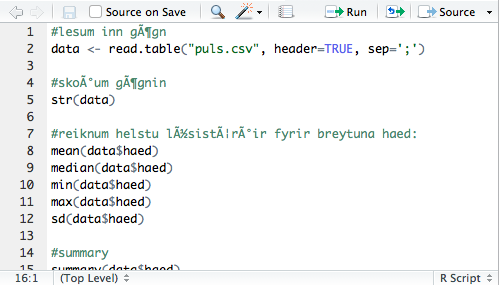

Ástæða þess er sú að stýrikerfi hafa enn ekki innleitt sameiginlegan
staðal til að tákna stafi - og þessir staðlar eru ekki eingöngu ólíkir
frá stýrikerfi til stýrikerfis, heldur einnig á milli tungumála- og
heimshluta hjá sama stýrikerfi. Á íslenskum tölvum er algengast að
``latin-1`` staðallinn notaður á Windows tölvum á meðan nýrri ``UTF-8``
staðall er notaður á MacOSX/Linux tölvum.

Þegar skjöl birtast á þennan hátt er mikilvægt að **vista ekki skjalið**
heldur fara beint í ``File``\ :math:`\rightarrow`
``Reopen with Encoding...`` og velja þá

-  ``ISO-8859-1`` ef unnið er í MacOsX tölvu en skjalið var búið til í
   Windows tölvu.

-  ``UTF-8`` ef unnið er í Windows tölvu en skjalið var búið til í
   MacOsX tölvu.

ef þið hyggist vinna áfram með skjalið borgar sig svo að fara í
``File``\ :math:`\rightarrow` ``Save with Encoding...`` og velja þar
þann staðal sem tölvan ykkar notar.

Einnig lenda MacOsX notendur stundum í því að íslenskir stafir birtast
rétt í .R skrám en rangt á gröfum. Það er hægt að laga með því að gefa
skipunina

::

   system("defaults write org.R-project.R force.LANG en_US.UTF-8")

og endurræsa svo Rstudio. Þá ættu íslensku stafirnir að birtast rétt.
Þessa skipun þarf bara að gefa einu sinni á hverri tölvu, þ.e.a.s. ekki
í hvert sinn sem R er ræst.

Gögn
----

Í þessari bók munum við aðallega notast við eitt gagnasafn en það má
finna í skránni ``pulsAll.csv`` sem hlaða má niður hér:

http://edbook.hi.is/gogn/pulsAll.csv.

Skráin inniheldur eftirfarandi breytur:

+-------------+-----------------------------------------------+
| Breyta      | Útskýring/gildi                               |
+=============+===============================================+
| namskeid    | LAN203, STAE209                               |
+-------------+-----------------------------------------------+
| kronukast   | thorskur, landvaettir                         |
+-------------+-----------------------------------------------+
| haed        | hæð í sentimetrum                             |
+-------------+-----------------------------------------------+
| thyngd      | þyngd í kílógrömmum                           |
+-------------+-----------------------------------------------+
| aldur       | aldur í árum                                  |
+-------------+-----------------------------------------------+
| kyn         | 1 = kona, 2 = karl                            |
+-------------+-----------------------------------------------+
| reykir      | ja, nei                                       |
+-------------+-----------------------------------------------+
| drekkur     | ja, nei                                       |
+-------------+-----------------------------------------------+
| likamsraekt | líkamsrækt í klst/viku                        |
+-------------+-----------------------------------------------+
| fyrriPuls   | fyrri púlsmæling slög/mín                     |
+-------------+-----------------------------------------------+
| seinniPuls  | seinni púlsmæling slög/mín                    |
+-------------+-----------------------------------------------+
| inngrip     | hljop, sat_kyrr                               |
+-------------+-----------------------------------------------+
| dagsetning  | hvaða dag tilraunin fór fram dagur.manudur.ar |
+-------------+-----------------------------------------------+

Þessum gögnum var safnað saman í tveimur námskeiðum við Háskóla Íslands
á árunum 2013 - 2015. Nemendur voru beðnir um að skrá niður ýmsar
bakgrunnsupplýsingar (hæð, aldur, kyn, ...) og mæla svo púlsinn sinn.
Því næst voru nemendurnir beðnir um að kasta krónu og þeir sem fengu upp
þorsk voru beðnir um að hlaupa um stofuna í tvær mínútur en hinir beðnir
um að sitja í sætunum sínum á meðan. Að þessu loknu mældu nemendur
púlsinn sinn á ný.

Vistið skrána í vinnumöppunni á vélinni ykkar en forðist að opna hana í
töflureikni, sér í lagi Excel, undarlegustu hlutir geta gerst! Ef þið
viljið skoða skrána opnið hana frekar í ritl, t.d. Notepad eða TextEdit.

Við munum nota þessi sömu gögn í umfjöllun okkar um ályktunartölfræði.
Við munum þá gera ráð fyrir að einstaklingarnir í gagnaskránni séu
slembiúrtak úr stóru þýði nemenda og því getum við notað gögnin til að
draga hinar ýmsu ályktanir um þýði nemenda.

Leiksvæði fyrir R kóða
----------------------

Hér fyrir neðan er hægt að skrifa R kóða og keyra hann. Notið þetta svæði til að prófa ykkur áfram með skipanir kaflans. Athugið að við höfum þegar sett inn skipun til að lesa inn ``puls`` gögnin sem eru notuð gegnum alla bókina.

.. datacamp::
    :lang: r

    # Gogn sott og sett i breytuna puls.
    puls <- read.table ("https://edbook.hi.is/gogn/pulsAll.csv", header=TRUE, sep=";")

    # Setjid ykkar eigin koda her fyrir nedan:
    # Sem daemi, skipunin head(puls) skilar fyrstu nokkrar radirnar i gognunum
    # asamt dalkarheitum.
    head(puls)