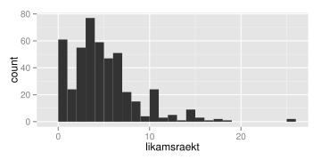
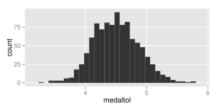

.. _c.alyktunartolfraedi:

Ályktunartölfræði
=================

Góð leið til að átta sig á líkindadreifingum gagna er með hermunum. Í
þessum kafla munum við annars vegar fjalla um hvernig velja má
*slembiúrtök* í R og hins vegar fjalla um *endurvalsaðferðir*.
Endurvalsaðferðir eru geysilega öflugar aðferðir sem nota má til að
reikna öryggisbil og framkvæma tilgátupróf fyrir nánast hvaða lýsistærð
sem er og byggja margar gerðir af útreiknuðum öryggisbilum í R á slíkum
aðferðum. Í kafla :numref:`%s <s.slembiurtak>` lýsum við hvernig nota má
skipunina ``sample()`` til að velja slembiúrtök. Í kafla
:numref:`%s <s.urtaksdreifing>` kynnumst við skipuninni ``replicate()`` og sýnum
með henni fram á virkni höfuðsetningar tölfræðinnar. Að því loknu notum
við sömu skipun til að reikna öryggisbil í kafla :numref:`%s <s.oryggisbil>`.

.. _s.slembiurtak:

Slembiúrtök valin
-----------------

Slembiúrtök valin
~~~~~~~~~~~~~~~~~

sample()
^^^^^^^^

.. attention::

    **Inntak:** nafn á vigri og stærð úrtaks
    
    **Úttak:** úrtak
    
    **Helstu stillingar:** replace, prob

--------------

R býr yfir skemmtilegri skipun sem við getum bæði notað til að velja
úrtak úr endanlegu þýði en einnig til að líkja eftir slembnu fyrirbæri
sem er mælt aftur og aftur. Það er skipunin ``sample()``. Skipunin er
mötuð með tvennu, annars vegar vigri sem inniheldur þýðið okkar (allar
mögulegar útkomur) sem við viljum velja úr og hins vegar heildarfjölda
þeirra mælinga sem við viljum safna (stærð úrtaksins). Gætið þess að
gefa fyrst útkomumengið og svo fjölda mælinga. Í hjálpinni sjáum við
líka að ``sample()`` hefur tvo stillingamöguleika, ``replace`` og
``prob``. Sjálfgefnu stillingarnar eru ``replace=FALSE`` og
``prob=NULL``.

Við munum ekki nota stillingarmöguleikann ``prob`` mikið en hann segir
til um líkurnar á því að hvert og eitt gildi í vigrinum sé valið.
Sjálfgefna stillingin er að allar útkomurnar séu jafnlíklegar sem er
yfirleitt það sem við viljum.

Stillingarmöguleikann ``replace`` munum við hins vegar nota. Sjálfgefna
stillingin (``replace=FALSE``) gefur til kynna að valið sé án skila eins
og það er kallað. Það þýðir að um leið og ein útkoma hefur verið valin
þá getur hún ekki verið valin aftur. Þessa stillingu myndum við t.d.
nota ef við vildum velja ákveðinn fjölda viðfangsefna úr endanlegu þýði.
Látum til gamans útkomumengið okkar vera jólasveinana 13. Við búum til
vigurinn ``jolasveinar`` sem inniheldur heiti allra jólasveinanna með
skipuninni:

::

   jolasveinar <- c("Stekkjastaur", "Giljagaur", "Stufur", "Thvorusleikir",
   "Pottaskefill", "Askasleikir", "Hurdaskellir", "Skyrgamur", "Bjugnakraekir",
   "Gluggagaegir", "Gattathefur", "Ketkrokur", "Kertasnikir")

Takið eftir því hvernig við setjum gæsalappir utanum nafnið á hverjum
einasta jólasveini. Þær mega ekki gleymast því þá gefur R villu.
Skipunin

::

   sample(jolasveinar,4)
   ## [1] "Stufur"       "Hurdaskellir" "Stekkjastaur" "Gattathefur"

velur fjögur ólík gildi úr vigrinum ``jolasveinar`` af handahófi,
þ.e.a.s. velur fjóra ólíka jólasveina af handahófi. Skipunin

::

   sample(jolasveinar,14)
   ## Error in sample.int(length(x), size, replace, prob): cannot take a
   ## sample larger than the population when ’replace = FALSE’

gefur hins vegar villu, því jólasveinarnir eru bara 13 og því enginn
möguleiki að velja 14 ólíka jólasveina. Ef við notum stillinguna
``replace=TRUE`` og gefum skipunina

::

   sample(jolasveinar,14, replace=TRUE)
   ##  [1] "Giljagaur"     "Thvorusleikir" "Pottaskefill"  "Stekkjastaur"
   ##  [5] "Stufur"        "Thvorusleikir" "Stekkjastaur"  "Stufur"
   ##  [9] "Bjugnakraekir" "Stufur"        "Gluggagaegir"  "Giljagaur"
   ## [13] "Stekkjastaur"  "Gattathefur"

lendum við hins vegar í engum vandræðum, því þá megum við velja sama
jólasveininn aftur og aftur. Þessa stillingu er kjörið að nota þegar við
viljum líkja eftir slembnu fyrirbæri sem er mælt aftur og aftur. Til
dæmis má gefa skipanirnar

::

   krona <- c("thorskur","landvaettir")
   sample(krona,4, replace=TRUE)
   ## [1] "landvaettir" "landvaettir" "thorskur"    "thorskur"

til að líkja eftir krónukasti sem er framkvæmt fjórum sinnum.

Við getum að sjálfsögðu matað sample með nafni á breytu sem tilheyrir
gagnafölu. Viljum við t.d. velja handahófskennt 10 hæðarmælingar úr puls
gögnunum okkar gerum við það með

::

   sample(puls$haed,10)
   ##  [1] 160 188 180 160 162 164 174 170 180 165

.. _s.urtaksdreifing:

Endurvalsaðferð til að meta úrtaksdreifingu lýsistærðar
-------------------------------------------------------

Endurvalsaðferð til að meta úrtaksdreifingu lýsistærðar
~~~~~~~~~~~~~~~~~~~~~~~~~~~~~~~~~~~~~~~~~~~~~~~~~~~~~~~

replicate()
^^^^^^^^^^^

.. attention::

    **Inntak:** fjöldi hermana, fall sem skal beita í hverri hermun
    
    **Úttak:** fylki með einn dálk fyrir útkomu hverrar hermunar
    
    **Helstu stillingar:**

--------------

Aðferðin ``replicate()`` endurtekur það fall sem við mötum hana með eins
oft og við biðjum hana um.

*Höfuðsetning tölfræðinnar* (e. the central limit theorem) segir að sé
úrtaksdreifing meðaltals slembistærðar fylgi normaldreifingu ef
meðaltalið byggir á nægjanlega mörgum mælingum, óháð því hver upphaflega
dreifing slembistærðarinnar var. Gott dæmi um hana má sjá með því að
skoða breytuna ``likamsraekt`` sem lýsir hversu marga klukkutíma í viku
nemendur stunda líkamsrækt. Byrjum á því að skoða stuðlarit af
breytunni.

::

   ggplot(data = puls, aes(likamsraekt)) + geom_histogram(binwidth=1)

Á stuðlaritinu sést að líkindadreifing breytunnar ``likamsraekt`` er
langt frá því að vera normaldreifð, þar sem hún er mjög hægri skekkt með
útlaga til hægri að auki. Hins vegar er *meðaltal* líkamsræktar
normaldreift, sé tekið meðaltal af nægjanlega mörgum mælingum. Með
skipuninni ``replicate()`` getum við framkvæmt 1000 "gervitilraunir"
þar sem við veljum slembiúrtak af stærð 100 úr þýði upprunalegu
mælinganna okkar:

::

   endurvalsurtak <- replicate(1000, sample(puls$likamsraekt, 100,replace=T))

Útkoman er fylki með 1000 dálka, einn fyrir hverja gervitilraun og 100
línur, eina fyrir hverja útkomu í hverri gervitilraun.

::

   dim(endurvalsurtak)
   ## [1]  100 1000

Með skipuninni ``apply()`` getum við svo reiknað meðaltal líkamsræktar
fyrir hverja og eina gervitilraun

::

   medaltol <- apply(endurvalsurtak,2,mean, na.rm=T)

og eins og sjá má á stuðlariti meðaltalanna, eru þau ansi nálægt því að
vera normaldreifð:

::

   ggplot(data = data.frame(medaltol), aes(medaltol)) + geom_histogram()

Athugið að hér er lykilatriði að nægjanlega mörg viðfangsefni séu valin
í hverju og einu gerviúrtaki. Sé eingöngu valið gerviúrtak af stærð 3 í
hvert skipti er útkoman langt frá því að vera normaldreifð, eins og sjá
má hér fyrir neðan. Þar er stuðlaritið hægri skekkt.

::

   litid.endurvalsurtak <-
   replicate(1000, sample(puls$likamsraekt, 3,replace=T))

   ny.medaltol <-
   apply(litid.endurvalsurtak,2,mean, na.rm=T)

   ggplot(data = data.frame(ny.medaltol), aes(ny.medaltol)) +
   geom_histogram()

.. figure:: myndir/unnamed-chunk-176-1.svg

.. _s.oryggisbil:

Öryggisbil reiknað með endurvalsaðferð
--------------------------------------

Gerviúrtökin sem fengust með skipuninni ``replicate()`` má einnig nota
til að reikna öryggisbil fyrir meðaltal líkamsræktar. 95% öryggisbil er
smíðað þannig að það innihaldi sanna gildið á stikanum í 95% tilvika ef
tilraunin er endurtekin nægjanlega oft. Við getum notað metnu meðaltölin
úr gervitilraununum 1000 til að áætla hvaða útkomur væru mögulegar ef að
tilraunin væri endurtekin. 95% öryggisbil fæst þá með því að einfaldlega
reikna 2.5% og 97.5% prósentumörk þessara 1000 meðaltala.

::

   quantile(medaltol, c(0.025, 0.975))
   ##     2.5%    97.5%
   ## 3.825000 5.255003

95% öryggisbilið er því :math:`[3.825, 5.2550026 ]`.

Leiksvæði fyrir R kóða
----------------------

Hér fyrir neðan er hægt að skrifa R kóða og keyra hann. Notið þetta svæði til að prófa ykkur áfram með skipanir kaflans. Athugið að við höfum þegar sett inn skipun til að lesa inn ``puls`` gögnin sem eru notuð gegnum alla bókina.

.. datacamp::
    :lang: r

    # Gogn sott og sett i breytuna puls.
    puls <- read.table ("https://edbook.hi.is/gogn/pulsAll.csv", header=TRUE, sep=";")

    # Setjid ykkar eigin koda her fyrir nedan:
    # Sem daemi, skipunin head(puls) skilar fyrstu nokkrar radirnar i gognunum
    # asamt dalkarheitum.
    head(puls)