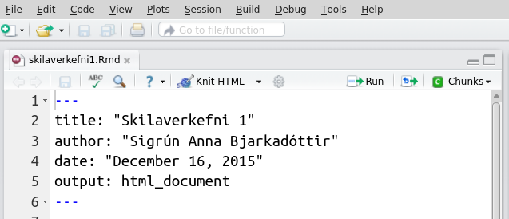

.. _c.knitr:

Knitr
=====

Í kafla :numref:`%s <c.inngangur>` er fjallað um hvernig við getum framkvæmt
tölfræðiúrvinnslu með því að skrifa skipanir í skipanaskrá (.R). Ef við
þurfum að skrifa skýrslu, grein eða annað þar sem úrvinnslunni og
niðurstöðum hennar er lýst þyrftum við að færa niðurstöðuna inn í það
umhverfi sem við kjósum að nota til að skrifa skýrsluna (Word,
LibreOffice, LaTeX, ...). Í því felst að afrita (e. copy) niðurstöður frá R
og líma (e. paste) þær svo inn í viðkomandi ritvinnsluforrit. Ýmislegt
getur farið úrskeiðis í því ferli.

Pakkinn ``knitr`` gerir okkur kleift að prjóna saman texta, fagrar
jöfnur og R-kóða í eitt og sama skjalið. Helsti kosturinn er að
greiningin sem við erum að framkvæma fléttast inn í textann og óþarfi er
að klippa og líma úttök, myndir og töflur úr R inn í annað
ritvinnsluforrit. Annar stór kostur er að greiningin uppfærist
sjálfkrafa þó svo að gögnin sem notast er við breytist, ekki þarf að
endurgera töflur og myndir og líma þær á ný inn í skýrsluna.

Áður en pakkinn er notaður þarf að hlaða honum niður með
``install.packages()`` eins og aðra pakka. Hér verður stiklað á stóru um
notkun pakkans en lesa má meira um pakkann hér:

http://yihui.name/knitr/.

Ef þið lendið í vandræðum með að sækja pakkann er sennilegt að þið séuð
ekki með nýjustu útgáfuna af R og eða RStudio, þá þurfið þið að uppfæra
útgáfurnar ykkar.

Eins og kom fram hér að ofan er greiningin og skýrslan unnin í einu og
sama skjalinu þegar unnið er með ``knitr``. Það fer eftir því hvaða tæki
og tól við viljum nota við umbrot á textanum og hvaða snið (format) við
kjósum á skýrslunni okkar (``.pdf``, ``.docx`` eða ``.html``) af hvaða
gerð skjalið sem við vinnum í verður (``.Rmd`` eða ``.Rnw``). Vinnulagið
er svipað en í öllum tilvikum mun skjalið okkar samanstanda af haus
(e. preamble), texta, R-klumpum (e. R-chunks) og mögulega jöfnum skrifaðar í
LaTeX. R-kóði sem við viljum að sé keyrður þarf að vera í R-klumpum í
skjalinu okkar, annars er litið á hann sem venjulegan texta. Þó er
einnig er hægt að kalla á R-úttök í textann en hvernig að þessu er
staðið fer eftir hvaða snið er valið.

Umbrot á texta
--------------

Áður en vinnslan hefst er nauðsynlegt að ákveða hvaða tól eigi að nota
við umbrot á texta og á hvaða sniði skýrslan á að vera. LaTeX notendur
geta á auðveldan hátt prjónað saman LaTeX kóða og R-kóða en það er ekki
nauðsynlegt að tileinka sér LaTeX til að nota ``knitr``. Annar möguleiki
er til staðar en það er að nota ívafsmálið (e. markup language) Markdown en
það er mjög einfalt í notkun.

Markdown (``.html`` eða ``.docx``)
~~~~~~~~~~~~~~~~~~~~~~~~~~~~~~~~~~

Til að búa til nýja R-Markdown skrá í RStudio veljið ``File``,
``New File`` og ``R Markdown``. Þar eruð þið beðin um að velja á hvaða
sniði skýrslan á að vera. Ef ``Word`` er valið þarf Word að vera uppsett
á vélinni. Ef ``PDF`` er valið þarf TeX að vera uppsett á vélinni.
Ávallt er hægt að velja ``HTML``. Til verður ``.Rmd``- skrá. Skráin sem
opnast inniheldur sýnishorn af nokkrum skipunum sem þið getið eytt. Þið
skuluð þó halda í hausinn, þar sem þið setjið inn nafnið ykkar og titil
á skýrsluna. Gætið þess að breyta ekki hausnum of mikið eftirá, það gæti
valdið villum sem orsaka það að skjalið keyrist ekki.



Þegar ``.Rmd`` skrá er opnuð í RStudio birtist ``Knit HTML`` eða
``Knit Word`` takki (í efri vinstra glugganum) eftir því hvaða snið var
valið. Þegar ýtt er á takkann keyrast allar R-skipanir sem eru innan í
R-klumpum nema annað sé sérstaklega tekið fram (sjá hér að neðan). Til
verður ``.html`` eða ``.docx`` skjal sem ber sama heiti og ``.Rmd``
skráin ykkar. Nýju skrána má finna í sömu möppu og ``.Rmd`` skrána
ykkar. Þið verðið að vista (e. save) ``.Rmd`` skrána ykkar áður en þið ýtið
á ``Knit HTML`` takkann. Ef eitthvað er ekki eins og það á að vera
birtast rauð villuskilaboð í keyrslugluggann og ekki verður til
``.html``/``.doc`` - skjal. Skoðið villuskilaboðin, lagið villuna og
ýtið svo aftur á ``Knit`` takkann.

Eins og fram kom hér að ofan skrifum við R-kóða í klumpa. Við byrjum
R-klump á `````{r}`` svo skrifum við R-skipun/skipanir og til að loka
klumpnum notum við ```````. Línurnar tvær má fá á auðveldan hátt með að
velja ``Chunks`` og ``Insert chunks`` eða halda niðri ``Ctrl, Alt`` og
``I``. Hér er dæmigerður R-klumpur í ``.Rmd`` skrá:

::

   ```{r}
   puls<-read.table("pulsAll.csv",sep=";",header=T)
   ```

Þær R-skipanir sem eru í klumpum keyrast þegar ýtt er á ``Knit`` takkann
nema annað sé tekið fram (sjá hér að neðan). Sé skipun ekki hluti af
R-klump er litið á hana sem venjulegan texta. Úttök þeirra skipana sem
eru í klumpunum birtast svo í skýrslunni (svo sem töflur og myndir).
Hlutir sem er smíðaðir í klumpum verða ekki til í vinnusvæðinu okkar en
til að búa þá til þar þurfum við að keyra þær skipanir á sama hátt og
áður (með að halda niðri :kbd:`⌘` + :kbd:`⏎` á MacOs en :kbd:`Ctrl` + :kbd:`⏎` á Windows/linux). Einnig er hægt að
keyra allar R-skipanirnar í einu með að velja ``Chunks`` og ``Run All``.

Það er líka hægt að að láta R reikna fyrir okkur og birta svarið inn í
texta. Viljum við t.d. tilgreina gildið á meðalhæð einstaklinganna í
``puls`` gagnasafninu getum við skrifað eftirfarandi í ``.Rmd`` skrána
okkar:

::

   Meðalhæð einstaklinganna er `r mean(puls$haed)`

og útkoma ``mean(puls$haed)`` mun birtast í ``.html`` skjalinu.

Það er fyrir utan efni þessarar bókar að fjalla í smáatriðum um
ívafsmálið Markdown. Aðeins verður fjallað um það helsta hér en við
hvetjum ykkur til að skoða efni sem finna má á netinu.

Fyrstu línurnar í ``.Rmd`` skjali geta verið eftirfarandi:

::

   ---
   title: "Skilaverkefni"
   author: "Sigrún Anna Bjarkadóttir - sigrunannabjarka@hi.is"
   output: html_document
   ---

Þið ráðið hvort þið hafið dagsetninguna líka inni.

Við notum myllumerki (#) til að tákna fyrirsagnir. Letrið minnkar með
fleiri myllumerkjum:

::

   # Þetta verður mjög stór fyrirsögn
   ## Þessi fyrirsögn verður minni
   ### Þessi fyrirsögn verður enn minni

Auðvelt er að skáletra og feitletra orð:

::

   *Þetta verður skáletrað* og **þetta verður feitletrað** en þessi
   texti verður hvorki skáletraður né feitletraður.

Viljum við útbúa lista gerum við það svona:

::

   Trallalallalaaa

   - það þarf að passa að það sé
   - auð lína fyrir ofan og neðan...

   Dúddiraríreiii.

LaTeX (``.pdf``)\ :math:`^\ast`
~~~~~~~~~~~~~~~~~~~~~~~~~~~~~~~

Það er fyrir utan efni þessara bókar að kenna á LaTeX en finna má
ógrynni af efni um LaTeX á netinu. Í þessum undirkafla er því gert ráð
fyrir LaTeX kunnáttu.

Áður en ``knitr`` kom á markaðinn mátti nota ``Sweave`` til að tvinna
saman LaTeX og R-kóða. Það má vera að áður en R-LaTeX skrá er keyrð í
fyrsta skipti þurfi að breyta stillingu í RStudio. Það er gert með að
velja ``Tools``, ``Global Options`` og í vinstri stikunni velja
``Sweave`` svo ``Weave Rnw files using`` og velja ``knitr`` - þetta þarf
aðeins að gera einu sinni.

Til að búa til nýja R-LaTeX skrá í RStudio veljið ``File``, ``New File``
og ``R Sweave``. Þá verður til ``.Rnw`` skrá. Í henni má finna lítinn
haus (e. preamble) og enda (e. postamble). Hægt er að vinna með þennan haus
eða líma þann haus sem þið eruð vön að nota inn í skjalið. Þið getið svo
notað þær LaTeX skipanir sem þið eruð vön að nota en bætið svo við
R-klumpum með greiningunni ykkar. R-klumparnir eru ekki á sama formi og
þegar Markdown er notað.

Við byrjum R-klump á ``<<>>=`` svo skrifum við R-skipun/skipanir og til
að loka klumpnum skrifum við ``@``. Línurnar tvær má fá á auðveldan hátt
með að velja ``Chunks`` og ``Insert chunks`` eða halda niðri
``Ctrl, Alt`` og ``I``. Hér er dæmigerður R-klumpur í ``.Rnw`` skrá:

``<<>>=``

::

   puls<-read.table("pulsAll.csv",sep=";",header=T)

``@``

Líkt og þegar unnið er í Markdown er hægt að láta R reikna fyrir okkur
og birta svarið inn í texta. Viljum við t.d. tilgreina gildið á meðalhæð
einstaklinganna í ``puls`` gagnasafninu getum við skrifað eftirfarandi í
``.Rnw`` skrána okkar:

Meðalhæð einstaklinganna er \\Sexpr{mean(puls$haed)}

og útkoma ``mean(puls$haed)`` mun birtast í ``.pdf`` skjalinu.

Jöfnur
------

Eins og fram kom hér að ofan er LaTeX kunnátta ekki nauðsynleg þegar
unnið er með ``knitr`` pakkann en einn af styrkleikum LaTeX er hversu
auðvelt er að skrifa stærðfræðitákn og hversu fögur útkoman verður. Þó
ekki sé unnið með LaTeX snið er hægt að tvinna LaTeX jöfnur inn í Markup
textann. Við sýnum aðeins eitt lítið dæmi hér fyrir neðan en hvetjum þá
sem ekki hafa notað LaTeX kynna sér málið frekar.

Hægt er að nota stærðfræðitákn inni í textanum og skrifa jöfnur/stæður
sem standa einar og sér:

::

   Viljum við nota stærðfræðitákn inni í texta notum við eitt
   dollaramerki: Meðaltal úrtaks táknum við með gríska bókstafnum $\mu$.
   Viljum við láta jöfnur/stæður standa einar í línu notum við tvö
   dollaramerki:

   $$

   \bar{x} = \frac{\sum_{i=1}^{n}x_i}{n}.

   $$

Textinn hér að ofan birtist svona:

Viljum við nota stærðfræðitákn inni í texta notum við eitt dollaramerki:
Meðaltal úrtaks táknum við með gríska bókstafnum :math:`\mu`. Viljum við
láta jöfnur/stæður standa einar og sér notum við tvö dollaramerki:

.. math:: \bar{x} = \frac{\sum_{i=1}^{n}x_i}{n}.

Ef unnið er í Markdown og villa leynist í LaTeX kóðanum birtist kassi
sem inniheldur LaTeX kóðann í ``.html`` skjalinu, ekki jafnan sjálf. Þá
þurfið þið að laga villuna og ýta svo aftur á ``Knit`` takkann.

Klumpastillingar
----------------

Á milli R-klumpa getið þið skrifað texta sem lýsir greiningunni sem þið
eruð að framkvæma. Sjálfgefnu stillingar R-klumpa eru:

-  skipanir sem í þeim eru birtast í ``.html`` skjalinu í gráum kassa

-  skipanir sem í þeim eru keyrast

-  úttakið sem skipanirnar skila birtist í ``.html`` skjalinu. Þetta
   getur verið útkoma, mynd og fleira.

Klumpana má mata með ýmsum stillingum og má sjá nokkrar þeirra hér að
neðan:

+-----------------------+-----------------------+-----------------------------------------------------------+
| Heiti stillingar      | Mögulegar stillingar  | Virkni                                                    |
+=======================+=======================+===========================================================+
| eval                  | T eða F               | | Ef T þá keyrist kóðinn (sjálfgefið)                     |
|                       |                       | | Ef F þá keyrist kóðinn ekki                             |
+-----------------------+-----------------------+-----------------------------------------------------------+
| echo                  | T eða F               | | Ef T þá birtist kóðinn í .html skalinu (sjálfgefið)     |
|                       |                       | | Ef F þá birtist kóðinn ekki                             |
+-----------------------+-----------------------+-----------------------------------------------------------+
| results               | "markup", "hide" ...  | | Ef "markup" (sjálfgefið) þá birtist það                 |
|                       |                       | |  sem aðferðin skilar í .html skalinu                    |
|                       |                       | | Ef "hide" er kóðinn keyrður en úttakið birtist ekki     |
+-----------------------+-----------------------+-----------------------------------------------------------+
| fig.width             | tala                  | | Breidd myndar í tommum                                  |
+-----------------------+-----------------------+-----------------------------------------------------------+
| fig.height            | tala                  | | Hæð myndar í tommum                                     |
+-----------------------+-----------------------+-----------------------------------------------------------+

Lista yfir allar stillingar má finna hér:

http://yihui.name/knitr/options/.

Viljum við t.d. lesa inn pakka með ``library()`` aðferðinni en viljum
ekki að kóðinn birtist í ``.html`` skjalinu okkar notum við:

::

   ```{r, echo = F}
   library(ggplot2)
   ```

Þá keyrist ``library(ggplot2)`` en skipunin birtist ekki í ``.html``
skjalinu. Munið að ef þið ætlið að nota aðferðir í pakka sem ekki er
hluti af grunnpökkum R (t.d. ``ggplot2`` pakkinn) þurfið þið að nota
``library()`` aðferðina til að sækja pakkann.

Viljum við teikna stöplarit, stjórna stærðinni á myndinni en láta aðeins
myndina birtast i ``.html`` skjalinu, ekki R-kóðann, gerum við það með:

::

   ```{r, echo=F, fig.width=5, fig.height=3}
   ggplot(puls, aes(x=namskeid)) + geom_bar() + xlab("Námskeið") +
   ylab("Fjöldi")
   ```


Leiksvæði fyrir R kóða
----------------------

Hér fyrir neðan er hægt að skrifa R kóða og keyra hann. Notið þetta svæði til að prófa ykkur áfram með skipanir kaflans. Athugið að við höfum þegar sett inn skipun til að lesa inn ``puls`` gögnin sem eru notuð gegnum alla bókina.

.. datacamp::
    :lang: r

    # Gogn sott og sett i breytuna puls.
    puls <- read.table ("https://edbook.hi.is/gogn/pulsAll.csv", header=TRUE, sep=";")

    # Setjid ykkar eigin koda her fyrir nedan:
    # Sem daemi, skipunin head(puls) skilar fyrstu nokkrar radirnar i gognunum
    # asamt dalkarheitum.
    head(puls)