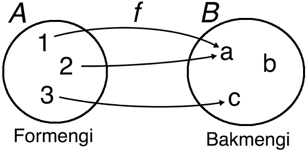

.. include:: rst-include

Uppflettitöflur
===============

Viðskiptavinaskrá á pappír
~~~~~~~~~~~~~~~~~~~~~~~~~~
Hugsum okkur að við ætlum að skrifa forrit til að skrá skuldir, innheimta þær og
gera upp. Kúnni mætir á svæðið til að kaupa vöru eða borga skuldir og við
flettum honum upp, staðfestum að um réttan mann sé að ræða, og breytum
skuldastöðunni eins og við á. Ef við værum að gera þetta upp á gamla mátann þá
myndum við væntanlega byggja á nöfnum og hafa töflu í stafrófsröð á pappír sem
við flettum upp í, að skuld og eftir atvikum kennitölu, heimilsfangi, netfangi
o.s.frv. Við gætum lent í vandræðum með alnafna, og annar vandi er sá að þegar
nýir kúnnar bætast við þarf einhvernveginn að smeygja þeim inn á milli hinna
eða setja þá aftast. Svo væri hægt að nota spjaldskrá.

.. figure:: myndir/spjaldskra.jpg
   :align: center
   :figwidth: 9cm

   Spjaldskrá

.. _ígildi-spjaldskrár:
   
Ígildi spjaldskrár í tölvu
~~~~~~~~~~~~~~~~~~~~~~~~~~
Ef viðskiptavinaskráin væri forrituð í tölvu yrði væntanlega byggt á kennitölum
í staða nafna. Þá er ekkert vesen með alnafna, flókin stafsetning nafna skapar
engan vanda, og við fáum tékk á því að um réttan mann sé að ræða með því að
spyrja um nafn og bera saman við það sem er skráð í tölvuna.

Það væri hægt að útfæra slíkt forrit með nokkrum listum, lista með kennitölum,
lista með nöfnum og lista með skuldum, sem svo væri leitað í. Það mundi svara til þess
að við hefðum nokkrar skrár á pappír, eina með kennitölunum (í handahófsröð) og hinar
með nöfnunum, skuldunum o.s.frv. í sömu röð og kennitölurnar, t.d. einhvernvegin svona:

.. code:: text

   Kennitölulisti     Nafnalisti          Skuldalisti
   1. 090990-0909     1. Karl Karlsson    1. 3500 kr.
   2. 040302-0100     2. Eva Evudóttir    2. 4600 kr.
   3. 101010-1010     3. Ari Arason       3. 1600 kr.
   ...

Ef kúnnahópurinn er stór mundi slíkt forrit verða hægvirkt og betra væri að hafa
ígildi spjaldskrárinnar. Og það er einmitt hægt í Python og reyndar flestum
nútímaforritunarmálum. Gagnatagið heitir **uppflettitafla** og með því að nota
það er fljótlegt að fletta upp á einstaklingum (t.d. kennitölum), bæta við
nýjum, og henda út. Hér er skematísk mynd af því hvernig þetta gæti litið út:

.. math::
   &\fbox{170858-4259} \longrightarrow \fbox{Karl Karlsson}\;\;& \fbox{3500 kr.}\\
   &\fbox{040302-0100} \longrightarrow \fbox{Eva Evudóttir}    & \fbox{4600 kr.}\\
   &\fbox{101010-1010} \longrightarrow \fbox{Ari Arason}       & \fbox{3400 kr.}

.. admonition:: Æfing: Uppfletting í listum
   :class: aefing

   Skrifið Python forrit sem býr til listana þrjá sem sýndir eru hér á undan með
   þremur kennitölum, nöfnum og skuldum hvers; kallið þá ``K``, ``N`` og ``S``.
   Skrifið svo fall :code:`fletta(kt, K, N, S)` sem hefur kennitölu til að
   fletta upp og listana þrjá sem stika. Fallið á að skrifa út nafn og skuld
   þess sem flett er upp, eða "finnst ekki" ef hann finnst ekki. Notið virkjann
   ``in`` og fallið ``index``, sbr. kafla :numref:`öll-söfn` og :numref:`allar-runur`
   (sjá líka æfinguna um rómverska riddarann þar). Ath. að það á ekki að nota
   Python dict við lausnina, slíkt forrit er á dagskrá í kafla 7.7)
              
Varpanir í stærðfræði
~~~~~~~~~~~~~~~~~~~~~
Stærðfræðileg vörpun (*map*, *mapping*) er í raun samheiti við fall
(*function*), en stundum er gerður einhver tæknilegur merkingarmunur.
Stærðfræðileg föll varpa sérhverju staki í formengi sínu í tiltekið stak í
bakmengi, og ritað er :math:`f(1) = a` (lesið "f af einum sama sem a") til að
sýna að :math:`f` varpi :math:`1` í :math:`a` (sbr. eftirfarandi mynd).

.. _stae-vorpun:

   Stærðfræðileg vörpun

Orðanotkun
~~~~~~~~~~
Uppflettitöflur eru nefndar ýmsum nöfnum í tölvunarfræði og forritunarmálum. Á
`Wikipediu <https://en.wikipedia.org/wiki/Associative_array>`_, í ýmsum
tölvunarfræðibókum, og í forritunarmálinu Awk (sem var fyrsta málið með
innbyggðar uppflettitöflur) er notað **associative array**, C++ og Java nota
**map**, og Python og ýmis fleiri mál nota **dictionary**. Hér notum við orðið
**uppflettitafla** á íslensku, en stundum er talað um **vörpun** (sem er bein
þýðing á *map*). Tölvunarfræðilegar uppflettitöflur uppfylla skilgreiningu á
stærðfræðilegri vörpun en orðanotkun er aðeins önnur: stökin í formenginu eru
venjulega kölluð **lyklar** (*keys*) og stökin í bakmenginu **gildi**
(*values*). Uppflettitafla samanstendur af pörum af lykli og tilsvarandi gildi,
(k,g), stundum táknað k :math:`\to` g. Lyklamengið er endanlegt.

Aðgerðir og útfærsla
~~~~~~~~~~~~~~~~~~~~
Flestar eða allar útfærslur á uppflettitöflum bjóða upp á eftirfarandi aðgerðir:

1. Pari með lykli og gildi bætt við töfluna
2. Gildi gefins lykils breytt
3. Gildi gefins lykils skilað
4. Pari gefins lykils eytt úr töflunni
5. Kannað hvort gefinn lykill sé í töflunni
6. Farið í gegn öll pör töflunnar með lykkju
  
Við útfærsluna er lögð áhersla á að þessar aðgerðir séu hraðvirkar, oftast með
því að nota gagnagrind (*data structure*) sem heitir **hakkatafla** (`hash table
<https://en.wikipedia.org/wiki/Hash_table>`_), en stundum eru líka notuð
**tvíundatré** (`binary trees <https://en.wikipedia.org/wiki/Binary_tree>`_). Um
þessar gagnagrindur má lesa meira á Wikipediu með því að smella á tenglana að
framan, auk þess sem kafli B4 í `Think Python <https://greenteapress.com/wp/think-python-2e/>`_ bókinni útskýrir hakkatöflur.

.. admonition:: Æfing: Hakkatöflur og úrlausn árekstra
   :class: aefing

   Skoðið myndirnar í Wikipedíugreininni um hakkatöflur. Hugsum okkur nú að við
   bætum við Jóni Jónssyni með símanúmer 888-6666 og hann hafi hakkagildið 153.
   Skoðið hvað gerist í öllum þremur tilvikunum ("separate chaining", "separate
   chaining with head records" og "linear probing"). Sýnið gjarnan hvernig
   myndirnar breytast [ath. að þetta er svolítið erfið æfing].
   

Uppflettitöflur í Python
~~~~~~~~~~~~~~~~~~~~~~~~
Eins og fyrr segir eru uppflettitöflur kallaðar *dictionaries* í Python og um
þær er fjallað í 11. kafla í *Think Python* bókinni. Þær eru útfærðar með
hakkatöflum og eru bæði hraðvirkar og þægilegar í notkun; það þarf ekki að nota
import heldur eru þær innbyggðar í málið sjálft. Lyklar uppflettitöflu mega vera hvaða
óbreytanlegu tagi sem er, m.a. heiltölur, kommutölur, strengir og samstæður
(tuples). Breytanleg tög, t.d. listar, mengi og aðrar uppflettitöflur duga hins
vegar ekki. Til að búa til uppflettitöflu má nota ritháttinn:

    :code:`d = {1:'a', 2:'a', 3:'c'}`

sem mundi búa til töfluna sem sýnd er á mynd :numref:`%s<stae-vorpun>`.

Það er líka hægt að búa til uppflettitöflu með því að byrja með tómu
uppflettitöfluna og bæta svo smám saman við pörum:

.. code:: text
   
   d = {}
   d[1] = 'a'
   d[2] = 'a'
   d[3] = 'b'
        
Frá og með Python útg. 3.7 gildir að lyklar uppflettitöflu eru í sömu röð og þeir voru settir inn í hana, þannig að for k in d: print(k) mundi prenta út 1, 2 og 3 í þeirri röð. Takið eftir að ``{}`` býr til tóma uppflettitöflu en ekki tómt mengi, eins og líka hefði verið hægt að ákveða. Líklega fannst Guido van Rossum að uppflettitöflur væru mikilvægari hluti af Python-málinu en mengi.

.. admonition:: Æfing: Uppfletting á formúlu
   :class: aefing

   Búið til uppflettitöflu fyrir fallið :math:`x^2 - 2x` og formengið :math:`\{0,
   1, 2, 3, 4, 5\}`. Hvert er bakmengið?

Helstu Python-aðgerðir fyrir uppflettitöflur
~~~~~~~~~~~~~~~~~~~~~~~~~~~~~~~~~~~~~~~~~~~~

.. csv-table:: 
   :widths: auto
   :delim: ;

   ``d = {k1:v1,k2:v2,...}``;býr til uppflettitöflu ``d`` með ``k1⟶v1``, ``k2⟶v2``,...
   ``d = dict((k1,v1),...)``; býr líka til töflu með pörum  ``k1⟶v1``, ``k2⟶v2``,...
   ``d = {}``;		býr til tóma uppflettitöflu
   ``d = dict()``;	býr líka til tóma uppflettitöflu
   ``d[k] = v``;	``k⟶v`` bætt við ``d``, ef ``k`` er ekki lykill, annars er gildi ``k`` breytt
   ``v = d[k]``;	nær í gildi lykilsins ``k``
   ``v = d.get(k,sg)``;	skilar ``d[k]`` ef ``k`` er lykill í ``d``, annars sjálfgefna gildinu ``sg``
   ``del d[k]``;         eyðir lykli ``k`` úr töflunni ``d``
   ``n = len(d)``;	 skilar fjölda para í ``d``
   ``ik = d.keys()``;	 skilar ítrara með öllum lyklum ``d``
   ``iv = d.values()``;	 skilar ítrara með öllum gildum ``d``
   ``ipör = d.items()``; skilar ítrara með öllum pörum ``(k,v)`` í ``d``
   ``d1.update(d2)``;    bætir öllum pörum ``k⟶v`` í ``d2`` við ``d1``
   ``d.update([(k1,v1),...])``;bætir öllum pörum í listanum ``[(k1,v1),...]`` við ``d``
   ``if k in d:...``;	athugar hvort ``k`` sé lykill í ``d``
   ``for k in d:...``;	lykkjar með ``k`` yfir alla lykla ``d``

Athugið að nota má næstefstu aðgerðina ásamt zip til að búa til uppflettitöflu úr tveimur listum, eins og sýnt er í seinna sýnidæminu í kafla :numref:`uppflettitafla lesin úr skrá`.

.. admonition:: Æfing: Uppfletting í uppflettitöflu
   :class: aefing

   Endurtakið æfinguna í kafla :numref:`ígildi-spjaldskrár` en notið
   uppflettitöflu(r) í stað lista. Það eru tveir möguleikar:
   
   1. Að nota tvær uppflettitöflur: kennitala :math:`\to` nafn og kennitala :math:`\to` skuld
   2. Að nota eina töflu: kennitala :math:`\to` (nafn, skuld)
      
   [seinni möguleikinn gefur par með nafni og skuld þegar kennitölu er flett
   upp]. Það á að búa til töflurnar eða töfluna og skrifa svo fall
   ``fletta(kt,...)`` sem flettir upp á kennitölu og skrifar út nafn og skuld.
   Byrjið á að teikna töflurnar, og forritið gjarna báða möguleikana
   
.. admonition:: Sýnidæmi: Fylkjaskammstöfun
   :class: synidaemi

   Hér er uppflettitafla til að að fletta upp á bandarískum fylkjum eftir
   skammstöfun þeirra.

   .. _fylki-USA:

   .. figure:: myndir/uppflettitafla.jpg
      :align: center
      :figwidth: 7cm

      Uppflettitafla

   Þessa töflu mætti búa til í Python með: 

   .. code:: Python
             
      T = {"ca": "California",
           "ok": "Oklahoma",
           "nj": "New Jersey",
           "tx": "Texas"}

   Hér er forritsbútur sem í framhaldi les skammstafanir og skrifar út fylkjanöfn
   þar til slegið er inn ``x``. Ef óþekkt skammstöfun er slegin inn koma skilaboð um það.

   .. code:: Python
    
      while True:      
          skst = input("Sláðu inn skammstöfun (x til að hætta)")
          if skst == "x": break
          if not skst in T:
              print("Óþekkt fylki")
          else:
              print(T[skst])
      print("Kællfyrir")

   og hér er forrit sem prentar töflu yfir skammstafanir og fylki:

   .. code:: Python

      print("skst  Fylki")
      print("––––––––––––––––––")
      for (skst, fylki) in T.items():
          print(skst, fylki)

   Takið eftir að fallið ``items`` virkar líkt og ``enumerate``-fallið sem talað
   var um í grein :numref:`bua-til-sofn`.

Yfirgrip fyrir uppflettitöflur
~~~~~~~~~~~~~~~~~~~~~~~~~~~~~~
Í kafla :numref:`yfirgrip (*comprehension*)` var útskýrt hvernig búa má til lista útfrá einhverri runu með svonefndu yfirgripi (*comprehension*), t.d. má búa til lista af kvaðratrótum talnanna 1 til 10 með:

    ``k = [math.sqrt(x) for x in range(1,11)]``.

Það er líka hægt að búa til uppflettitöflum með svipuðum hætti. Almennt má búa til uppflettitöflu með:

    ``U = {segð1:segð2 for breyta in runa}``

og eftirfarandi dæmi býr til töflu sem varpar tölu á bilinu 1–10 í kvaðratrót sína:

    ``rætur = {x: math.sqrt(x) for x in range(1,11)}``.
