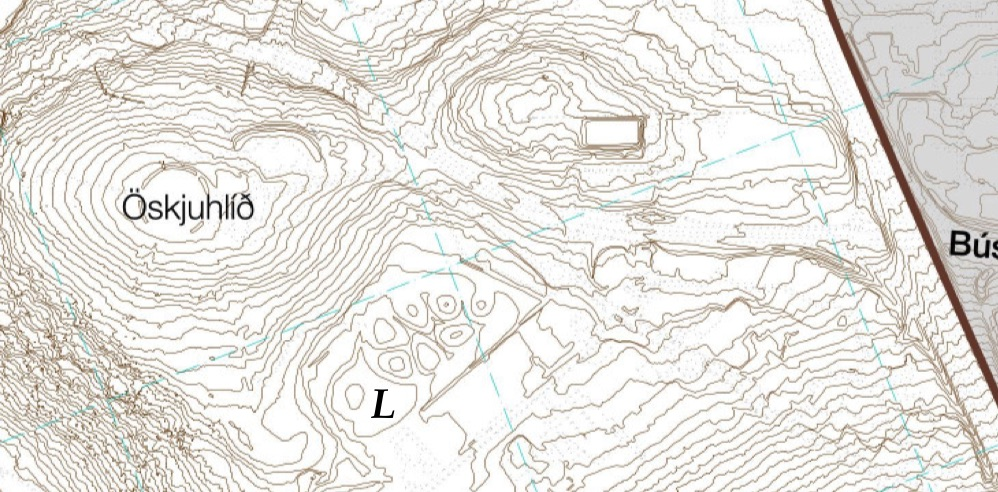
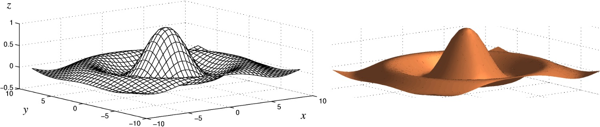
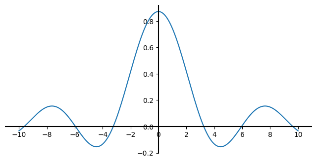
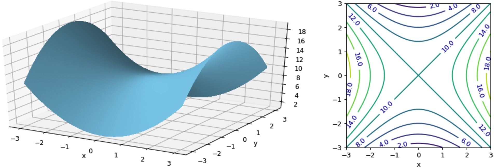
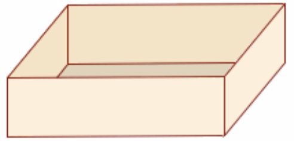

.. include:: rst-include
             
.. rubric:: :math:`\qquad\qquad` VALIN EFNI Í STÆRÐFRÆÐI OG REIKNIFRÆÐI |br| |br|

Í þessum fyrirlestrarnótum eru tekin fyrir nokkur valin efni sem kennd eru í
námskeiðinu *Stærðfræði og reiknifræði* við HÍ. Námsefnið er í smávegis þróun,
en til að byrja með a.m.k. verður fjallað um þrjú aðskilin stærðfræðileg efni:

  Föll af mörgum breytistærðum |br|    
  Línulega algebru |br|
  Tölulega greiningu

Það verður ekki kafað mjög djúpt í þessi efni, enda er námsefnið ætlað til
kennslu á nokkrum vikum (u.þ.b. fimm) en í HÍ eru heil námskeið helguð hverju
framantalinna þriggja efna (Stærðfræðigreining 2 fjallar um föll af mörgum
breytistærðum).

Samhliða svolítið stærðfræðilegri umfjöllun um námsefnið verða kynntar aðferðir
til að fást við verkefni úr því með Python. Um notkun Python er annars fjallað í
sérstakri rafbók, `Fyrirlestrarnótur um Python <https://cs.hi.is/python>`_.
             
Föll af mörgum breytistærðum
============================
Byrjað verður á umfjöllun um föll af tveimur breytistærðum, og tekin dæmi um
hvernig hægt er að snúa jöfnum til að skrifa stærð eða breytu sem er fólgin í
jöfnu sem fall af hinum stærðunum (breytunum). Næst verða sýndar aðferðir til að
skoða útlit tvívíðra falla án sérstakrar tilvísunar í Python en í
:ref:`Viðauka A <vidauki-A>` er síðan farið
nánar í hvernig hægt er að teikna slíkar myndir með Python. Þá eru hlutafleiður
og stiglar á dagskrá, og fjallað er um aðferðir til að finna útgildi falla, bæði
stærðfræðilega og með Python. Loks er talað stuttlega um föll af fleiri en
tveimur breytistærðum.

Meðal hugtaka sem ekki er fjallað um hér en eru á dagskrá í náskeiðinu
Stærðfræðigreining 2 eru ferlar, pólhnit, skorðuð útgildi og
Lagrange-margfaldarar, margföld heildi og vigursvið.

Einvíð og tvívíð föll
---------------------
Gert er ráð fyrir að lesendur þekki vel til falla sem varpa tölu í aðra tölu.
Slík föll eru oft kölluð einvíð föll. Ritað er :math:`f:\Bbb{R} \to \Bbb{R}`
til að sýna að :math:`f` sé fall sem varpi rauntölu í rauntölu og gildi fallsins
í tiltekinni rauntölu :math:`x` (sem sé talan sem :math:`x` varpast í) er táknað
með :math:`f(x)`. Oft er líka talað um fallið :math:`f(x)`, eða t.d. fallið :math:`x^2
+ 1` þar sem fallið er gefið með formúlunni :math:`f(x) = x^2 + 1`. 

Meðal algengra hugtaka sem tengjast einvíðum föllum og margir læra um eru:

- gröf falla
- formengi og varpmengi (*domain* og *range*)
- algeng föll: margliður, ræð föll, vísisföll, lograr, hornaföll
- samskeytt (eða samsett) og andhverf föll (*composite* og *inverse*)
- samfelld föll (*continuous*)
- diffrun og afleiður (*differentiation*, *derivatives*)
- heildun (*integration*)

Það gæti verið gagnlegt fyrir lesanda að rifja þessi hugtök upp, t.d. í rafrænu kennslubókunum *Undirbúingur í stærðfræði* og *Stærðfræðigreining I* á `edbook.hi.is <https://edbook.hi.is>`_.

Það eru ýmsir möguleikar á að útvíkka einvíð föll, hægt væri að skoða föll sem
varpa tölu í aðrar tvær tölur (það gefur ferla) eða þá föll sem varpa tveim
tölum í aðrar tvær (vigursvið), en hér byrjum við á föllum sem varpa tveimur
tölum í eina aðra.

.. admonition:: Skilgreining: Tvívítt fall
   :class: regla

   Látum :math:`A \subseteq \Bbb{R}^2`. Fall sem úthlutar sérhverju pari
   :math:`(x,y) \in A` tiltekinni tölu :math:`z \in \Bbb{R}` nefnist **tvívítt
   fall** (*bivariate function*) eða fall af tveimur breytistærðum. Ritað er
   :math:`f:A \to \Bbb{R}` og :math:`z = f(x,y)`. Mengið :math:`A` nefnist
   **formengi** fallsins og mengi allra mögulegra :math:`z`-gilda nefnist
   **varpmengi** þess.

.. admonition:: Athugasemd: Orðanotkun
   :class: athugid

   Varpmengi er stundum nefnt *myndmengi*. Á ensku er það kallað *image* og
   formengi nefnist *domain*

.. figure:: myndir/tvívítt-fall.jpg
   :figwidth: 12cm
   :align: center

   Tvívítt fall. :math:`A` er formengi fallsins.
   
Algengt er að hugsa um :math:`\Bbb{R}^2` sem tvívíða hnitakerfið eða planið og
þá er :math:`f` fall sem úthlutar punkti í planinu tiltekinni tölu. En þetta er
alls ekki nauðsynlegt. Tölurnar :math:`x` og :math:`y` geta vel verið bara
einhverjar tölur sem ekki tákna hnit á neinum punkti sbr. liði 1–3 í sýnidæminu
hér á eftir.

Oft táknar :math:`f(x,y)` einhverja formúlu sem inniheldur :math:`x` og
:math:`y`, t.d. :math:`x + 3y` en það er samt ekki nausðsynlegt, sbr. lið 4 í
sýnidæminu. Svo er að sjálfsögðu hægt að nota aðra bókstafi en :math:`x`,
:math:`y`, :math:`z` og :math:`f` eins og í liðum 3 og 4 í sýnidæminu. Einnig er
mögulegt að nota breytur með vísa, t.d. :math:`y = f(x_1, x_2)` eða (sbr.
Python) :math:`y = f(x_0, x_1)`
         
Dæmi um tvívíð föll
-------------------
.. admonition:: Sýnidæmi: Tvívíð föll
   :class: synidaemi

   1. Látum :math:`x` og :math:`y` vera tvær tölur og :math:`f(x,y)` tákna summu
      þeirra.
   2. Látum :math:`A = \{(x,y) \in \Bbb{R}^2 | y \neq 0\}` og :math:`g(x,y) =
      x/y`.

      .. figure:: myndir/þríhyrningur.jpg
         :align: right
         :figwidth: 5cm

   3. Flatarmál þríhyrnings með grunnlínu :math:`g` og hæð :math:`h` er gefið með
      fallinu

      .. math::  F(g,h) = \frac{gh}{2}

   4. Meðalhiti :math:`h` á einhverjum stað á jörðunni með hnattstöðu (lengd og
      breidd) :math:`l` og :math:`b` er fall, :math:`h = H(l,b)`. :math:`H` er
      dæmi um fall sem ekki er hægt að lýsa með einfaldri formúlu (:numref:`mynd
      %s<jarðarhiti>` sýnir litamynd af :math:`H`).

   Í þarnæstu æfingu verða formengi og varpmengi þessara falla á dagskrá.

Sérhver tvístæð talnaaðgerð, eins samlagningin og deilingin í a- og lið 2
sýnidæmisins, svarar til tvívíðs falls (frádráttur, margföldun, veldi,
afgangur).

.. admonition:: Æfing: Þrihyrningar og keilur
   :class: aefing

      .. figure:: myndir/keila.jpg
         :align: right
         :figwidth: 5cm      

   1. Teiknið (einhvern) þríhyrning með grunnlínu 3 og hæð 2. Reiknið svo
      flatarmál hans með fallinu :math:`F`      
   2. Ákvarðið :math:`g` þannig að :math:`F(g,2) = 18`.
   3. Rúmmál keilu er einn þriðji af flatarmáli grunnflatar sinnum hæð hennar.
      Flatarmál hrings með radíus :math:`r` er :math:`r^2\pi`. Lýsið rúmmáli
      keilu með tvíðvíðu falli af hæð hennar :math:`h`, og radíus grunnflatar,
      :math:`r`.
   4. Reiknið rúmmál keilu með radíus grunnflatar 8 cm og hæð 18 cm.

.. admonition:: Æfing: Formengi
   :class: aefing

   Ákvarðið stærsta mögulega (eða viðeigandi) formengi og tilsvarandi varpmengi
   fallanna :math:`f`, :math:`g`, :math:`F` og :math:`H` í sýnidæminu hér á
   undan. Ath. að varpmengi :math:`H` verður aðeins lýst með orðum, en hin ætti
   að vera hægt að tilgreina með stærðfræðirithætti.

.. admonition:: Athugasemd: 
   :class: athugid   

   Í svörunum má nota :math:`\Bbb{R}^+` til að tákna jákvæðu rauntölurnar (án
   núlls), :math:`A \times B` til að tákna faldmengið :math:`\{(a,b) \mid a \in
   A, b \in B\}`, :math:`(a,b]` eða :math:`]a,b]` fyrir hálfopna bilið
   :math:`\{x \mid a < x \leq b\}` (og tilsvarandi fyrir önnur bil) og loks
   :math:`A-B` fyrir mengjamismuninn, stök :math:`A` sem eru ekki í :math:`B`.
           
.. admonition:: Æfing: Fallbyssa
   :class: aefing

   Ef miðunarhorn fallbyssu (frá láréttu) er :math:`\theta`, upphafshraði kúlunnar er
   :math:`s` og horft er framhjá loftmótstöðu, þá er lárétt vegalengd sem kúlan fer

   .. figure:: myndir/fallbyssa.jpg
      :align: right
      :figwidth: 9cm
   
   .. math:: d = \dfrac{\normalsize{s^2}}{\normalsize{g}} \sin 2\theta
         
   þar sem :math:`g` er þyngdarhröðunin, látum til einföldunar :math:`g = 10
   \text{ m/s}^2`. Skrifið

   1. :math:`d` sem fall af :math:`s` og :math:`\theta`
   2. :math:`s` sem fall af :math:`d` og :math:`\theta`
   3. :math:`\theta` sem fall af :math:`d` og :math:`s`
   4. Ákvarðið miðunarhornið í gráðum ef :math:`s` = 150 m/s og d = 2000 m
      
Myndir af tvívíðum föllum
-------------------------

Á sama hátt og ferillinn :math:`\{(x,y) | y = f(x)\}` er kallað graf einvíða
fallsins :math:`f`, þá skilgreinum við **graf** tvívíðs falls :math:`f` sem flötinn,
eða yfirborðið :math:`\{(x,y,z) | z = f(x,y)\}`.

Til skoða gröf (útlit) tvívíðra falla eru ýmsar aðferðir. Ein algeng er að búa
til hæðarlínumynd (*contour plot*) eins og hér er sýnt:

.. figure:: myndir/hæðarlínur.jpg
   :align: center
   :name: þrjúhágildimynd
   :figwidth: 11cm

   Hæðarlínumynd með þremur hágildum

Hæðarlínur eru líka notaðar á landakortum og sýna hvar maður getur gengið í
landslagi án þess að fara upp eða niður brekku, sem sé í sömu hæð yfir
sjávarmáli. Þannig mynda þær t.d. lokaða ferla í kring um fjallstinda og lautir
eða lægðir. Í gröfum tvíðvíðra falla er talað um hágildi (*maxima*) og lággildi
(*minima*) eða hágildis- og lággildispunkta. Á myndinni að ofan sjást þrjú hágildi en
ekkert lággildi.

Hér er landakort með hæðarlínum af Öskjuhlíð. Þeir sem eru kunnugir staðháttum
sjá Veðurstofuhæðina og vatnstankinn, hólana í duftkirkjugarðinum og
hljóðmanirnar við Bústaðaveg og Kringlumýrarbraut. Takið líka eftir að þar sem
það eru engir litir og engar merkingar á hæðarlínunum þarf að þekkja vel til
staðhátta til að vita að það er lægð (með tjörn) en ekki hæð þar sem merkt er
með *L*.
 

   Hæðarlínukort af vef Reykjavíkurborgar
              
Á Wikipediu má skoða `landakort með merktum hæðarlínum
<https://en.wikipedia.org/wiki/Contour_line#/media/File:Cntr-map-1.jpg>`_ og
við munum síðar í námskeiðinu búa til ýmsar slíkar myndir með Python og Matplotlib.

Það er líka hægt að gera margskonar öðruvísi myndir af gröfum tvívíðra falla.
Hér er t.d. *litakóðuð mynd* (eða *hæðarsvæðamynd*), sem sýnir meðalhitafallið
:math:`H` úr síðusta grein:

.. figure:: myndir/jarðarhiti.jpg
   :align: center
   :figwidth: 14cm
   :name: jarðarhiti

   Meðalhiti ársins

og hér eru *netmynd* (*mesh plot*) og upplýst þrívíð mynd af tvívíða fallinu

.. math::

   f(x,y) = \frac{1 + 4\sin r}{1 + 4r} \text{ þar sem } r = \sqrt{x^2 + y^2}:

   Tvær myndir af tvívíðu falli

Enn ein leið er svo að skoða þversnið af tvívíðu falli, en þá er önnur breytan fest í einhverju gildi og eingöngu skoðað hvernig fallið er háð hinni breytunni. Lítum t.d. á fallið :math:`f(x,y)` hér á undan og festum :math:`y=1`. Þversniðsfallið verður þá:

.. math::
   g(x) = f(x,1) = \frac{1 + 4\sin \sqrt{x^2 + 1}}{1 + 4\sqrt{x^2 + 1}}

og graf þess lítur svona út:

   Þversnið fallsins á :numref:`hattmynd` þegar :math:`y=1`

Svo mætti teikna svona myndir fyrir fleiri gildi á :math:`y` til að átta sig á hvernig tvívíða fallið lítur út.

.. admonition:: Python: Teikning tvívíðra falla
   :class: python

   Matplotlib hefur ýmsar skipanir til að teikna tvíðvíð föll: ``contour``
   teiknar hæðarlínumyndir, ``contourf`` teiknar *hæðarsvæðamynd* (litakóðaða
   mynd) og ``plot_surface`` má nota til að teikna bæði netmynd og upplýsta
   þrívíða mynd. Auk þessara þriggja má nefna ``plot_wireframe``,
   ``plot_trisurf`` og ``quiver``. Hér er dæmi um notkun ``contour`` til að
   teikna hæðarlínur fallsins

   .. math:: f(x,y) = \dfrac{3}{1+(x-2)^2+(y-3)^2} - \dfrac{4}{1 + x^2 + y^2}
             
   .. figure:: myndir/contour-dæmi.jpg
      :align: right
      :figwidth: 8cm
      :name: contour-dæmi

   .. code:: python

      def f(x,y):
        f1 = 3/(1+(x-2)**2+4*(y-3)**2)
        f2 = 4/(1+x**2+y**2)
        return f1 - f2

      x = np.linspace(-2,4)
      y = np.linspace(-1,4)
      (X,Y) = np.meshgrid(x,y)
      Z = f(X,Y)
      plt.set_cmap('rainbow')
      plt.contour(X, Y, Z, linewidths=3)
      plt.colorbar()
      plt.grid('True')

   Notkun ``contour`` og annarra skipana til að teikna tvívíð föll er nánar lýst
   í :ref:`Viðauka A <vidauki-A>`.

Diffrun tvívíðra falla
----------------------
Hægt er að útvíkka einvíða diffrun yfir í tvíða með ýmsu móti. Við byrjum
á að skilgreina diffrun sem fæst með því að halda annarri breytu tvívíðs falls
fastri og skoða það sem einvítt fall af hinni breytunni.

.. admonition:: Skilgreining: Hlutafleiða
   :class: regla

   Ef :math:`f(x,y)` er fall af :math:`x` og :math:`y` þá skilgreinum við
   **hlutafleiðu** (*partial derivative*) :math:`f` með tilliti til (m.t.t.) :math:`x` í
   punktinum :math:`(a,b)` sem markgildið (*limit*)

   .. math::
      f_x(a,b)=\lim_{h\to 0}\frac{f(a+h,b)-f(a,b)}{h}

   og hlutafleiðu :math:`f` m.t.t. :math:`y` í :math:`(a,b)` sem 

   .. math::
      f_y(a,b)=\lim_{k\to 0}\frac{f(a,b+k)-f(a,b)}{k}

   (ef þessi markgildi eru til).

Skilgreiningin þýðir að hlutafleiða m.t.t. annarrar breytunnar er eins og venjuleg
afleiða (*derivative*) af þverskurðarfallinu (*cross section function*) sem fæst
með því að halda hinni breytunni fastri: Ef :math:`g(x) = f(x,b)` þá gildir

.. math::
   f_x(a,b) = g'(b)

.. admonition:: Skilgreining: Diffranleiki
   :class: regla

   Ef markgildin sem skilgreina hlutafleiðurnar eru bæði til er sagt að
   :math:`f` sé **diffranlegt** (*differentiable*) í :math:`(a,b)`, en annars er það
   **ódiffranlegt** þar.
   
Hlutafleiðurnar tvær af :math:`f` skilgreina tvö ný föll, :math:`f_x\colon A
\to \Bbb{R}` og :math:`f_y\colon A \to \Bbb{R}`. Gera
þarf greinarmun á því að reikna hlutafleiðu :math:`f`, sem felur í sér að finna
formúlur þessara falla fyrir almenn :math:`x` og :math:`y`, og að reikna
hlutafleiðu í tilteknum punkti, en þá er svarið tiltekin tala eða gildi.

Hlutafleiður koma víða við sögu í stærðfræði og stærðfræðilegum greinum. Í
fyrsta lagi má nota þær í stærðfræðigreiningu til að finna lággildi og hágildi,
normalvigra (sem eru hornréttir á yfirborð), snertiplön og Taylor-nálganir, og
svo eru þær grunnurinn í svonefndum hlutafleiðujöfnum, sem eru mikið notaðar í
til að smíða stærðfræðileg líkön t.d. í eðlisfræði, verkfræði, jarðeðlisfræði og
hagfræði.
           
.. admonition:: Sýnidæmi: Reikningur hlutafleiða
   :class: synidaemi
                
   Látum :math:`f(x,y) = x^2y + 2y`. Þá er

   .. math:: f_x(x,y) = 2xy + 0 = 2xy

   (þar sem :math:`y` er fasti virkar þetta eins og við séum að diffra t.d.
   :math:`x^2\cdot 3 + 2\cdot 3`). Á sama hátt er

   .. math:: f_y(x,y) = x^2 + 2.

   Hlutafleiðan af :math:`f` m.t.t. :math:`x` í punktinum :math:`(3,5)` fæst svo
   með því að stinga inn: :math:`f_x(3,5) = 2\cdot 3\cdot 5 = 30`.

.. admonition:: Athugasemd: Einvíðar diffrunarreglur
   :class: athugid
   
   .. math::
      \begin{align}
      & D (af(x)) = af'(x) \\
      & D x^n = nx^{n-1} \\
      & D \sqrt{x} = \frac{1}{2\sqrt{x}} \\
      & D \sin x = \cos x\textrm{ og } D \cos x = -\!\sin x \\
      & D \ln x = \frac{1}{x} \\
      & D e^x = e^x \textrm{ (ath. }e^x\textrm{ er stundum táknað }\exp(x)\textrm{)} \\
      & D a^x = a^x \ln a \\
      & D f(g(x)) = f'(g(x))g'(x) \\
      & D (uv) = u'v + uv' \textrm{ þ.e. } D(f(x)g(x)) = f'(x)g(x) + f(x)g'(x) \\
      & D \frac{u}{v} = \frac{u'v - uv'}{v^2}
      \end{align}

.. admonition:: Æfing: Hlutafleiður þriggja falla
   :class: aefing

   1. Reiknið bæði :math:`f_x` og :math:`f_y` ef :math:`f(x,y) = x^2 + y`.
   2. Diffrið fallið :math:`x \sin(y)` bæði með tilliti til :math:`x` og :math:`y`.
   3. Lát :math:`f(x,y) = (1-x)^2 + (y-x^2)^2`. Ákvarðið fallið :math:`f_x(x,y)` og
      gildið :math:`f_y(1,2)`.

Aðrir rithættir fyrir hlutafleiðu
---------------------------------
Stundum viljum við diffra fall sem ekki hefur verið gefið nafn, í raun að diffra
formúlu. Ef diffra skal formúlu m.t.t. :math:`x` má setja :math:`D_x` framan við
hana, t.d.

.. math::
   D_x (x^2(y-1)^2 + x) = 2x(y-1)^2 + 1

Ef það er gert má setja lóðrétt strik með lágvísi aftan við til að sýna
að reikna eigi hlutafleiðuna í tilteknum punkti:

.. math::
   D_x (x^2y^2 + x)\big|_{x=1,y=2} = 2xy^2 + 1\big|_{x=1,y=2}
   = 2\cdot 1 \cdot 2^2 + 1 = 9.

Annar algengur ritháttur er að nota "rúnnað d" (stundum borið fram *del*), t.d.

.. math::
   \frac{\partial}{\partial x}(x^2y^2 + x) \text{ eða}
   \frac{\partial (x^2y^2 + x)}{\partial x}    

Slíkan rithátt má auðvitað líka nota þótt fallið hafi fengið nafn. Þannig er
:math:`D_y f(x,y) = f_y(x,y)`. Ef ritað hefur verið :math:`z = \text{formúla}`,
t.d. :math:`z = xy` þá er oft litið svo á, þegar tekin er hlutafleiða, að
:math:`z` sé jafngild formúlunni, sem sé:

.. math::
   \frac{\partial z}{\partial x} = \frac{\partial (xy)}{\partial x} = y    

.. admonition:: Æfing: Nokkrar hlutafleiður
   :class: aefing

   Finnið eftirfarandi hlutafleiður:
   
   .. math::
      \begin{align}
      &\textrm{1. } D_x \sin(xy) \\
      &\textrm{2. } D_y \sqrt{x + 2y} \\
      &\textrm{3. } \frac{\partial \ln(ax)}{\partial x} \\
      &\textrm{4. } \frac{\partial z}{\partial x} \textrm{ ef }z = \ln(x^2y^2) \\      
      &\textrm{5. } \frac{\partial f(1,2)}{\partial y} \textrm{ ef }f(a,y) = \ln(ay) \\
      &\textrm{6. } D_x \sqrt{xy\vphantom{b}} \big |_{x=2,y=2} \\
      &\textrm{7. } D_x \exp(ax^2 + bx + 3. \\
      \end{align}
   
.. Æfing
.. hint::
   Látum :math:`d` vera drægni fallbyssu eins og í æfingunni aftast í grein
   :numref:`dæmi um tvívíð föll`,

         :math:`d = \dfrac{\normalsize{v^2}}{\normalsize{g}} \sin 2\theta`

   þar sem :math:`v` er skothraðinn, :math:`\theta` er horn miðað við láréttan
   flöt og :math:`g` er þyngdarhröðunin (við notum :math:`g = 10 \text{m/s}^2`).

   1. Ákvarðið
      :math:`\dfrac{\partial\normalsize{d}}{\partial\normalsize{v}\vphantom{\theta}}`
      og :math:`\dfrac{\partial\normalsize{d}}{\partial\normalsize{\theta}}`

   2. Fyrir gefinn hraða :math:`v` verður drægnin að einvíðu falli, :math:`d =
      f(\theta)`, og hlutafleiðan m.t.t. :math:`\theta` verður jöfn venjulegu
      afleiðunni :math:`f'(\theta)`. Þá má finna hámarksdrægni fallbyssunnar með
      því að leysa :math:`f'(\theta) = 0`. Finnið :math:`d_\text{max}` ef
      :math:`v = 150 \text{ m/s}`.

Stigull
-------

Lát :math:`f` vera tvívítt fall, diffranlegt í punkti :math:`(a,b)`, og látum
:math:`v` vera vigur sem stefnir í þá átt sem :math:`f` vex hraðast. Venjuleg
afleiða af einvíðu falli í punkti :math:`a` er hallatala (*slope*) snertils
(*tangent*) í punktinum, og á sama hátt mælir **stigull** (*gradient*) tvívíðs falls
í :math:`(a,b)` hallatölu snertils í :math:`(a,b)`. En stigullinn er hinsvegar
vigur en ekki tala eins og afleiða einvíða fallsins.

.. admonition:: Skilgreining: Stigull
   :class: regla

   **Stigull** falls :math:`f` í punkti :math:`(a,b)` er vigur sem stefnir í þá
   átt sem fallið vex hraðast, og lengd hans er jöfn hallatölu snertils við graf
   fallsins sem stefnir í sömu átt.

Stigullinn mælir sem sé hve bratt graf fallsins er og átt mesta bratta. Hægt er
að skoða þverskurðarfall eftir línu sem liggur í bröttustu stefnuna og lengd
stigulsins verður afleiða þess falls. Ef fallið hefur engan halla er stigullinn
núll.

Hér er mynd sem varpar ljósi á hugtakið stigul, og í `Wikipediugreininni um stigla <https://en.wikipedia.org/wiki/Gradient>`_ má skoða fleiri myndir.

     .. figure:: myndir/stigull.jpg
        :align: center
        :figwidth: 15cm

        Gráa yfirborðið er graf fallsins :math:`f` og ljósbláa örin er í
        :math:`(x,y)`-planinu og sýnir stigul :math:`f` í punktinum
        :math:`(a,b)`. Dökkblái snertillinn liggur upp bröttustu brekkuna. 
        Stigullinn er í ofanvarpi þessa snertils á :math:`(x,y)`-planið og 
        lengd hans er halli fallsins í þá átt.

.. rubric:: Ritháttur og orðanotkun

Stigullinn af :math:`f` er oftast táknaður með :math:`\nabla f` en stundum með
:math:`f'`, og stigull í :math:`(x,y)` er þá

.. math:: \nabla f(x,y)\,\,\text{ eða }\,\, f'(x,y)

Stigullinn er dæmi um svonefnt **vigursvið** (*vector field*), en það er fall
:math:`\Bbb R^2 \to \Bbb R^2` sem sendir sem sé punkta í planinu yfir í vigra.
Venjuleg tvívíð föll eru líka stundum kölluð **skalarsvið** (*scalar field*), en
skalar er annað orð yfir tölu. Þetta orðfæri er einkum notað í eðlisfræði, en
líka í stærðfræðigreiningu sem er einmitt oft beitt í eðlisfræði. Stundum er
líka talað um vigurgilt fall á :math:`\Bbb R^2` (*vector-valued function on*
:math:`\Bbb R^2`)

.. rubric:: Tvívíð keðjuregla og tengsl stiguls og hlutafleiða

Einvíða keðjureglan segir að afleiða :math:`f(g(x))` sé :math:`f'(g(x))g'(x)`
(sjá athugasemd aftarlega í kafla :numref:`diffrun tvívíðra falla`). Þessi
regla er sönnuð í stærðfræðigreiningu, sjá t.d. `hér
<https://openstax.org/books/calculus-volume-1/pages/3-6-the-chain-rule>`_. Á
Khan Academy eru `frekari útskýringar
<https://www.khanacademy.org/math/differential-calculus/dc-chain/dc-chain-rule/a/chain-rule-review?modal=1>`_
og þar er líka `fín umfjöllun
<https://www.khanacademy.org/math/multivariable-calculus/multivariable-derivatives/differentiating-vector-valued-functions/a/multivariable-chain-rule-simple-version>`_
um tvívíðu keðjuregluna, þar með talið sönnun á henni.

.. admonition:: Regla: Tvívíð keðjuregla
   :class: regla

     .. math::
        D_t f(x(t),y(t)) = f_x(x(t),y(t))x'(t) + f_y(x(t),y(t))y'(t)

Stigull er síðan nátengdur hlutafleiðum eins og þessi regla segir: 

.. admonition:: Regla: Stigull er vigur af hlutafleiðum
   :class: regla

   
   Stigull diffranlegs falls :math:`f` í :math:`(a,b)` er vigurinn með
   hlutafleiðum :math:`f`, þ.e.a.s.

   .. math:: \nabla f(a,b) = \begin{pmatrix}f_x(a,b) \\ f_y(a,b)\end{pmatrix}

Við bregðum svo út af vananum, að sleppa flestum sönnunum, og sönnum þessa reglu. Með sönnuninni fylgir líka skýringarmynd.

.. admonition:: Sönnun reglu
   :class: regla

   Látum :math:`p = (a,b)` og :math:`u` vera almennan vigur útfrá :math:`p` með
   lengd 1. Svo skoðum við þverskurð af fallinu í stefnu :math:`u`. Látum
   :math:`g` vera fallið í þeim þverskurði, sem sé :math:`g(t) = f(p+tu)`.
   Hallatala snertils í þessa stefnu er g'(0) og með því að nota tvívíðu
   keðjuregluna fæst:

   .. math::
      g'(t) &= D_t f(p + tu)\\
      &= D_t f(a + u_1 t, b + u_2 t) \\
      &= f_x(p + tu) u_1 + f_y(p + tu) u_2\\
      g'(0) &= (f_x(p), f_y(p)) \cdot u \\
      &= h \cdot u

   þar sem :math:`h = (f_x(p), f_y(p))` og :math:`h \cdot u` táknar innfeldi
   :math:`h` og :math:`u` (sbr. kafla `10.3
   <https://cs.hi.is/python/kafli10/#utreikningur-me-vigrum>`_ í
   *Fyrirlestrarnótum um Python*.

   .. figure:: myndir/sönnun-stigulsetningar.png
      :align: center
      :figwidth: 17cm

   Næst er notuð regla um innfeldi sem margir kannast við, nefnilega að innfeldi
   tveggja vigra fáist með því að margfalda saman lengdir þeirra og kósínus af
   horninu milli þeirra. Reglan verður sönnuð í kaflanum um línulega algebru, en
   hún segir sem sé:

   .. math::
      x\cdot y = |x| \cdot |y| \cos \theta

   Þetta gefur okkur að snertilhallinn er :math:`g'(0)` = :math:`|h|\cdot
   |u|\cos \theta` = :math:`|h|\cdot 1\cdot \cos\theta` = :math:`|h|\cos
   \theta` þar sem :math:`\theta` er hornið á milli :math:`h` og :math:`u`.
   Þessi halli verður stærstur þegar :math:`\theta` = 0 (því þá er kósínusinn
   1, en annars er hann minni), það er að segja þegar :math:`u` stefnir í sömu
   átt og :math:`h`. En sú mesta bratta stefna er einmitt stefna stigulsins,
   og svo gildir auk þess að stigullinn hefur lengd sem er þessi mesti bratti,
   og niðurstaðan er að stigullinn hlýtur að vera jafn :math:`h`, eins og
   sanna átti.

.. rubric:: Stigull og hæðarlínur   

Eins og útskýrt var að framan er stigull vigur sem stefnir upp bröttustu
brekkuna, og hann er því lengri sem brattinn er meiri. Ein afleiðing þessa er
að stigullinn verður hornréttur á hæðarlínur fallsins.
   
.. admonition:: Sýnidæmi: Stigull fundinn
   :class: synidaemi

   Finnum stigul fallsins

   .. math:: f(x,y) = x^2 + xy + y^2 - 3x

   fyrst í almennum punkti :math:`(x,y)` og síðan í punktinum :math:`(2,1)`. Hlutafleiður
   :math:`f` eru :math:`f_x = 2x+y-3` og :math:`f_y = x + 2y` og almenni
   stigullinn er því
   
   .. math::
      \nabla f(x,y) = \begin{pmatrix}2x + y - 3\\ x + 2y\end{pmatrix}

   Ef við látum :math:`x=2` og :math:`y=1` fæst:

   .. math::
      \nabla f(2,1) = \begin{pmatrix}2\cdot 2 + 1 - 3\\2 + 2\cdot 1\end{pmatrix}
      = \begin{pmatrix}2\\4\end{pmatrix}

.. admonition:: Python: Örvarit 
   :class: python

   .. figure:: myndir/örvamælir.jpg
      :align: right
      :figwidth: 3.5cm

      Örvamælir (*quiver*)
   
   Matplotlib fallið ``quiver`` má nota til að teikna *örvarit*: örvar í
   rétthyrndu neti sem sýna vigursvið. Örvarnar hafa rétta stefnu, en lengdir
   þeirra eru skalaðar sjálfkrafa, þó þannig að hlutfallslegar lengdir haldi
   sér. Þetta fall má nota til að teikna stigla falls, eins og sýnt er með
   :ref:`dæmi <teikning-stigla>` í Viðauka A.

Stefnuafleiða
-------------
Snertilhallinn sem kom við sögu í sönnuninni hér á undan hefur nafn, og er kallaður *stefnuafleiða*. Hana má skilgreina þótt :math:`u` hafi ekki lengd 1, nefnilega:

.. admonition:: Skilgreining: Stefnuafleiða
   :class: regla

   **Stefnuafleiða** diffranlegs falls :math:`f` í stefnu vigurs :math:`u` í punkti
   :math:`p` er hallatalan sem fæst ef farið er frá :math:`p` úteftir :math:`u`,
   nánar tiltiltekið afleiða fallsins :math:`g(t) = f(p + tu)` í 0.

Og ef :math:`u` hefur lengd 1 þá er stefnuafleiðan hallatala snertils við graf fallsins í :math:`p` sem stefnir í sömu átt og :math:`u`. Bláa línan :math:`T` á eftirfarandi mynd sýnir umræddan snertil.

   .. figure:: myndir/stefnuafleiða.png
      :align: center
      :figwidth: 9cm

Stefnuafleiðan er táknuð með :math:`f'(p; u)`. Svo er líka hægt að skilgreina stefnuafleiðuna með formúlu, sem minnir á formúluna sem venjuleg afleiða er skilgreind með:

.. math::
   f'(p; u) = \lim_{h \to 0} \frac{f(p + hu) - f(p)}{h}

Næsta setning gefur okkur aðferð til að reikna stefnuafleiðu og sönnun hennar er í raun þegar komin, sem hluti af sönnuninni hér á undan (í grein :numref:`stigull`). Hún er nefnilega innfeldi stigulsins í :math:`p` og stefnuvigursins :math:`u`:

.. admonition:: Regla: Tengsl stefnuafleiðu við stigul
   :class: regla

   :math:`f'(p;u) = \nabla f(p) \cdot u`

Stefnuafleiðan er sem sé innfeldi Ein afleiðing af þessari setningu er að hlutafleiður :math:`f` eru stefnuafleiður í stefnu einingavigranna, :math:`(1,0)` og :math:`(0,1)`, en um einingavigra verður fjallað nánar í kaflanum um línulega algebru.

.. admonition:: Sýnidæmi: Stefnuafleiða falls
   :class: synidaemi
   
   Finnum stefnuafleiðu fallsins

   .. math:: f(x,y) = x^2 + xy + y^2 - 3x

   út eftir :math:`u = (1, 3)` í punktinum :math:`(2,1)`. Skv. síðasta sýnidæmi
   er :math:`\nabla f(2,1) = (2,4)` og stefnuafleiðan er þessvegna

   .. math::
      (2,4) \cdot (1,3) = 2\cdot 1 + 4\cdot 3 = 2 + 12 = 14      
   
Útgildi tvívíðra falla
----------------------

.. rubric:: Hágildi og lággildi

Tvívítt fall :math:`f\colon A\to \Bbb R` er sagt hafa **víðvært hágildi** (*global
maximum*) í punkti :math:`p = (x_0, y_0)` ef gildi fallsins þar er stærra en eða
jafnt og gildi þess í öllum öðrum punktum formengisins :math:`A`, og á sama hátt
hefur :math:`f` **víðvært lággildi** (*minimum*) í :math:`p` ef gildið þar er minna
en eða jafnt og gildið allsstaðar annarsstaðar. Ef til er grennd um :math:`p`
þannig að :math:`f(p) \geq f(x,y)` fyrir alla punkta :math:`(x,y)` í grenndinni
þá er hágildið **staðbundið** (*local*). Staðbundið lággildi er skilgreint á
samsvarandi hátt. Ef gildi falls er hvergi (í :math:`A` eða grenndinni) jafn
hátt (lágt) og í :math:`p` er hágildið (lággildið) kallað **strangt** (*strict*).
Samheiti yfir há- og lágildi er **útgildi** (*extremum*).

Við höfum þegar séð ýmsar hæðarlínumyndir með há- og lággildum, t.d. í myndum 
:numref:`%s<þrjúhágildimynd>`, :numref:`%s<ellipsumynd>` og :numref:`%s<rosenmynd>`.

Ákvörðun útgilda falla hefur margskonar hagnýtingu, og sérstök undirgrein
hagnýtrar stærðfræði, töluleg bestunarfræði (*numerical optimization*), fjallar
um aðferðir til þess að finna þau. Stundum snýst verkefnið um að hámarka hagnað
eða lágmarka kostnað, en stundum er markmiðið að finna stika líkans sem nálga
gögn vel.

.. rubric:: Útgildi fundin með því að leysa jöfnur

Á sama hátt og útgildi einvíðra falla einkennast af því að afleiðan þar er núll,
þá einkennast útgildi tvívíðra falla af því að stigullinn þar er núll. Lausnir
jöfnunnar

.. math:: \nabla f(x,y) = (0,0)

gefa þá útgildin en auk þess söðulpunkta (*saddle points*) sem sum föll hafa.
Það eru punktar þar sem stigullinn er núll, og þannig að til er leið frá þeim
með vaxandi :math:`f`-gildum og önnur með minnkandi :math:`f`-gildum. Dæmi er
fallið :math:`f(x,y) = 10 + x^2 - y^2` sem sýnt er á eftirfarandi mynd:

   Fall með söðulpunkti

Þar sem báðar hliðar í jöfnunni að ofan eru vigur felur lausn hennar í sér að
leysa saman tvær jöfnur í tveimur óþekktum (:math:`x` og :math:`y`):

.. math::
   
   f_x(x,y) &= 0 \\
   f_y(x,y) &= 0

Stundum er hægt að leysa þessar jöfnur með algebru/stærðfræðigreiningu, en oftar
en ekki þarf að beita tölulegum aðferðum. Eftir að lausnirnar eru fundnar
þarf svo að flokka þær í hágildi, lággildi og söðulpunkta.

.. admonition:: Sýnidæmi: Útgildispunktar
   :class: synidaemi

   Ákvörðum útgildispunkta fallsins

   .. math:: f(x,y) = x^2 + xy + y^2 - 3x

   Stigullinn er :math:`\nabla f = (2x + y - 3, x + 2y)` svo við þurfum að leysa jöfnurnar:

   .. math:: 2x + y = 3\\ x + 2y = 0

   Smá útreikningar gefa nú :math:`x = 2` og :math:`y = -1`. En er þetta
   lággildi, hágildi eða söðulpunktur? Svarið er lággildi, og það er m.a. hægt
   að sjá útfrá því að þetta er eina lausnin, og að fallið vex upp úr
   öllu valdi ef x og y eru látin stefna á óendanlegt.

   .. figure:: myndir/synidaemi.jpg
      :align: center
      :figwidth: 11cm

      Graf fallsins f og lággildispunkturinn p
              
.. admonition:: Æfing: Loklaus kassi
   :class: aefing

   Smíða skal loklausan kassa sem tekur 500 :math:`\text{cm}^3` (sem sé hálfan
   lítra) úr blikkplötum þannig að sem minnst blikk sé notað. Ákvarðið hæð hans,
   lengd og breidd með eftirfarandi aðferð: Kallið lengdina :math:`x` og
   breiddina :math:`y`. Þá verður hæðin :math:`h = 500/(xy)`. Látið nú
   :math:`f(x,y)` = flatarmál blikksins sem þarf, finnið formúlu fyrir :math:`f`
   og lágmarkið með því að leysa jöfnurnar sem fást þegar hlutafleiður
   :math:`f` eru settar núll.

   
.. attention::
   `Fyrirlestrarnótur í Stærðfræðigreiningu 2 <https://edbook.hi.is/stae205g>`_
   eru með ýmislegt efni og myndir sem gæti gagnast við að skilja tvívíð föll,
   hlutafleiður og stigla betur

.. admonition:: Sýnidæmi: Jafna bestu línu
   :class: synidaemi

   .. figure:: ../python/myndir/hæð-trjáa-eftir-aldri.jpg
      :figwidth: 7cm
      :align: right
           
   Aðferð minnstu kvaðrata (*linear least squares method*) til að finna jöfnu
   bestu línu snýst um að lágmarka kvaðratsummu fjarlægða milli línunnar og
   gefins punktasafns. Ef punktarnir eru :math:`(x_1,y_1),\ldots,(x_n,y_n)` og
   jafna línunnar er:

   .. math:: y = ax + b

   og þá er þessi kvaðratsumma gefin með tvívíða fallinu:

   .. math::
      S(a,b) = \sum_{i=1}^{n}(ax_i + b - y_i)^2      

   (sjá á `wikipedíu
   <https://en.wikipedia.org/wiki/Linear_least_squares#Example>`_). Því minni sem
   þessi summa er, því betur fylgir línan punktasafninu. Jöfnu bestu línu má þannig
   ákvarða með því að reikna stigla fallsins :math:`S` og leysa jöfnurnar sem fást
   með því að setja þá jafna núll. Þetta gefur:

   .. math::

      \nabla S = \begin{pmatrix}
      \sum_{i=1}^{n}2(ax_i + b - y_i)x_i \\
      \sum_{i=1}^{n}2(ax_i + b - y_i) \\
      \end{pmatrix}
      = 0

   Þetta eru tvær jöfnur í óþekktu stærðunum :math:`a` og :math:`b` og það eru
   einmitt þær sem eru leystar í NumPy fallinu ``polyfit`` í `kafla 13.6
   <https://cs.hi.is/python/kafli13/?highlight=polyfit#gervigogn>`_ í
   Fyrirlestrarnótum um Python.

Margvíð föll
------------

.. rubric:: Skilgreining og dæmi

Rifjum upp að tvívítt fall er fall :math:`f\colon A \to \Bbb{R}` þar sem :math:`A \subseteq \mathbb{R}^2`. Á sama hátt er :math:`n`-vítt fall fall:

.. math::
   f\colon A \to \Bbb{R}\textrm{ þar sem }A \subseteq \mathbb{R}^n

Við getum tekið dæmi um hitastigfallið H á mynd :numref:`%s<jarðarhiti>`. Það væri hægt að hugsa sér fall til að tákna meðalhita ekki bara við yfirborð, heldur líka ofar, t.d. í 10 m hæð (eða 1 km). Almennt mætti skilgreina þrívítt fall:

.. math::
   H(l,b,h) =\textrm{ meðalhiti á stað með lengd }l\textrm{, breidd }h\textrm{ í hæð }h

(þó það væri líklega ansi erfitt að ákvarða gildi :math:`H` allsstaðar). Við gætum líka hugsað okkur að ákvarða jöfnu bestu parabólu með því að lágmarka fallið

.. math::
   
   S(a,b,c) = \sum_{i=1}^{50}(ax_i^2 + bx_i + c - y_i)^2

(þá er gildir :math:`S\colon \mathbb{R}^3 \to \mathbb{R}`). Það er mun erfiðara að búa til myndir af margvíðum föllum en tvívíðum. Helsta aðferðin er að sýna nokkur þverskurðarföll: Við gætum t.d. sýnt sérstaka mynd af meðalhitanum við yfirborð, í 100 m hæð, 200 m hæð o.s.frv. Veðurfræðingar skoða stundum veðurkort í jafnþrýstiflötum, t.d. 500 millibara fletinum.

.. rubric:: Viðfang skrifað sem vigur

Stakið :math:`x` í formenginu sem margvítt fall varpar úr er vigur með :math:`n` stökum:

.. math::
   x = (x_1, x_2,\ldots, x_n)

og ef þetta stak varpast t.d. í 5 má rita viðföng þess annaðhvort sem margar tölur (stökin í vigrinum) eða einn vigur, sem sé

.. math::
   &f(x_1, x_2,\ldots, x_n) = 5\\
   \textrm{eða: }&f(x) = 5

Á eftirfarandi mynd væri :math:`X \subseteq \mathbb{R}^n`, :math:`Y = \mathbb{R}` og :math:`f(x) = 5`.

.. figure:: myndir/fall.png
   :align: center
   :figwidth: 6cm

Þegar unnið er samhliða með stærðfræði og Python getur líka verið þægilegt að byrja að telja í 0. Svona vigur-ritháttur fyrir viðfangið er því algengari sem :math:`n` er stærra. Ef :math:`n` er 2 eða 3 er oft ritað :math:`f(x,y)` eða :math:`f(x,y,z)` en fyrir math:`n \geq 4` er algengast að nota :math:`f(x)` og láta :math:`x` vera vigur, og það er reyndar oft gert líka fyrir :math:`n=2\textrm{ eða }3`. Reyndar höfum við nú þegar nýtt okkur þennan möguleika, í sönnuninni í kafla :numref:`stigull` þar sem við skrifuðum :math:`p` í stað :math:`(a,b)`.

.. rubric:: Margvíðir stiglar

Stigull af :math:`n`-víðu falli er :math:`n`-vigur:

.. math::
.. math::
   f'(x) = \nabla f(x) =
   \begin{pmatrix}
   \dfrac{\partial f(x)}{\partial x_1}\\
   \vdots\\
   \dfrac{\partial f(x)}{\partial x_n}
   \end{pmatrix}

Eins og fyrir tvívíð föll segir stigullinn okkur í hvaða átt fallið vex hraðast. Við getum hugsað okkur fugl á flugi sem er kalt, hann gæti e.t.v. haft vit á að fljúga í stefnu stiguls þrívíða fallsins :math:`H` sem talað var um í greinininn hér á undan. Margvíðir stiglar verða aftur á dagskrá þegar fjallað verður um Taylor-nálgun í kaflanum um línulega algebru.

[Efni í vinnslu]
