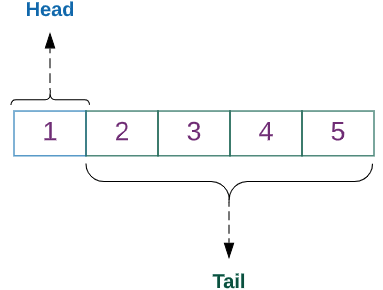

.. include:: rst-include

.. role:: matlab(code)
   :language: matlab
   :class: highlight

.. _c.inngangur:

Forritun í Python
=================

Inngangur: Um Python
--------------------

.. _inngangur:

Einfalt og auðlært mál
~~~~~~~~~~~~~~~~~~~~~~

Python er forritunarmál sem kom fram árið 1991 og hefur náð mikilli útbreiðslu. Það var hollenski tölvufræðingurinn Guido van Rossum sem bjó Python til og spilaði stórt hlutverk í þróun þess, en margir fleiri hafa lagt hönd á plóg. Málið heitir eftir grínistahópnum *Monty Python* (sem aftur dregur nafn af kyrkislöngum, *pythons*). 

   Monty Python grínistarnir

Vinsælasta útgáfan af Python nefnist formlega CPython og er opin og ókeypis. Hana er að finna á `python.org <http://python.org>`_ og þar má líka lesa um *Python Software Foundation* sem hefur síðan 2001 séð um þróun málsins, leyfi, dreifingu, Python-ráðstefnur o.s.frv.

Frá upphafi var markmiðið að búa til einfalt og auðlært forritunarmál, sem væri þannig að oftast væri bara ein augljós og einföld leið til að útfæra tiltekna aðgerð eða reikninga. Forrit áttu að samanstanda af enskum orðum að mestu leyti en ekki samansuðu tákna eins og algengt er t.d. í Perl-forritum, sem minna á blótsyrði í Andrés-blaði.

   Perl-forrit og Andrés Önd
.. _pakkar:

Fallasafn og pakkar
~~~~~~~~~~~~~~~~~~~
Með Python fylgir viðamikið fallasafn (*standard library*) og auk þess eru til ótal viðbætur sem kallast **pakkar** (*packages*) og eru ekki hluti af hinu eiginlega forritunarmáli. Opinber `pakkavefur <https://pypi.org>`_ fyrir Python hefur 322.000 pakka í ágúst 2021, og hann fer ört vaxandi (voru 164.000 í janúar 2019). Fallasafnið samanstendur af mörgum **einingum** (*modules*), og það sama gildir um flesta pakka. Það er sama hvort ætlunin sé að tengjast Oracle gagnagrunni, búa til vefsíðu, skrifa tölvuleik eða leysa stærðfræðileg verkefni: maður getur alltaf fundið vandaðan og almennan Python-pakka í verkið. Síðar í þessum nótum verður fjallað um nokkra slíka m.a. NumPy (fyrir vigur- (*vector-*) og fylkjareikninga), SciPy (fyrir reiknifræði), Pandas (fyrir gagnavinnslu) og Matplotlib (til að teikna).

Útbreiðsla
~~~~~~~~~~
Ýmsir vefir mæla vöxt og vinsældir forritunarmála og mælist Python í efstu sætunum á þeim flestum, ásamt Javascript, Java, C, C# og C++. Á einum þeirra má t.d. finna eftirfarandi mynd:

.. figure:: myndir/python-vöxtur.png
   :align: center

   Vöxtur í vinsældum Python

Framkvæmd forrita
~~~~~~~~~~~~~~~~~
Python er túlkað forritunarmál sem þýðir að forrit eru ekki þýdd fyrirfram á vélamál, heldur eru skipanir þess lesnar af Python túlkinum hver á fætur annarri og framkvæmdar jafnóðum. Hægt er að hugsa sér að túlkurinn hermi eftir ímynduðum gjörva sem hefur Python sem móðurmál. Þetta er reyndar nokkur einföldun, því Python er venjulega þýtt yfir á millimál sem er fljótlegra að túlka. Túlkuð forrit keyra hægar en þýdd, en á móti kemur að ekki þarf að bíða eftir þýðingu, og auk þess fylgja ýmsir kostir fyrir villuleit og þróun forrita skref fyrir skref.

Gildi eru töguð en breytur ekki
~~~~~~~~~~~~~~~~~~~~~~~~~~~~~~~
Eitt sem skilur Python frá ýmsum öðrum forritunarmálum, t.d. Java og C, er að það er engin þörf á að skilgreina breytur fyrirfram og segja Python-kerfinu af hvaða tagi (*type*) þær séu. Vissulega hefur Python allskyns tög (*types*), heiltölur, kommutölur, strengi, vigra, mengi o.s.frv., en það eru gildin sem breyturnar fá sem hafa tög, en ekki breyturnar sjálfar. Forrit getur haft skipun :code:`x = 3.5`, og þá verður x kommutala, og neðar getur svo staðið :code:`x = {2, 5, 8}` og eftir það er x mengi.

.. _python-leiðbein-á-netinu:
     
Python-leiðbeiningar á netinu
~~~~~~~~~~~~~~~~~~~~~~~~~~~~~
Fjölmargar leiðbeiningar um Python má finna á netinu, stuttar og langar, ókeypis og til sölu. Hér eru nokkrar gjaldfrjálsar:

- `Think Python <https://greenteapress.com/wp/think-python-2e/>`_ (ókeypis byrjendakennslubók sem hefur verið kennd í Tölvunarfræði 1a)
- `Google's Python Class <https://developers.google.com/edu/python/>`_ (líka fyrir byrjendur)
- `Learn Python <https://www.learnpython.org/>`_ (með reitum til að keyra forrit og skoða úttak)
- `The Python Tutorial <https://docs.python.org/3/tutorial/index.html>`_ (opinberar Python leiðbeiningar á python.org, fyrir svolítið lengra komna)

.. _kafli1_1:

Dæmi um Python forrit
---------------------
Tafla yfir veldi
~~~~~~~~~~~~~~~~
Eitt af því sem tölvur eru góðar í er að framkvæma sömu hlutina aftur og aftur. Ein einfaldasta leiðin til að endurtaka skipanir í Python er að nota *for*-skipun. Hér er dæmi um Python-forrit sem reiknar og skrifar út önnur og þriðju veldi talnanna 1 til 5:

.. code-block:: python
   :caption: Veldatafla
   :name: veldatafla

   print(" k  k²   k³")
   print("–––––––––––")
   for k in range(1,6):
      print(f"{k:2} {k**2:3} {k**3:4}")

Þetta forrit kynnir fleira til sögunnar, t.d. svonefnda f-strengi til að stjórna sniði þess sem er prentað og virkjann :code:`**` sem gefur veldi.

.. Æfing
.. hint::
   Ýmsar vefsíður bjóða upp á keyrslu Python forrita, t.d. `ideone.com
   <http://ideone.com/l/python-3>`_ og `online-python.com
   <http://online-python.com/online_python_compiler>`_
   Afritið (eða sláið inn) forritið Veldatafla inn í aðra hvora af þessum síðum
   og keyrið það. Prófið að breyta forritinu (finnið t.d. fleiri veldi).

Collatz-runur
~~~~~~~~~~~~~
Collatz-runur eru reiknaðar þannig að byrjað er með einhverja tölu :math:`n_0`
og svo er næsta tala reiknuð aftur og aftur skv. 

.. math::
   n_{k+1} = \begin{cases}
      \displaystyle\frac{n_k}{2} \text{ ef $n_k$ er slétt tala}\\
      3n_k+1 \text{ ef $n_k$ er oddatala}
      \end{cases}

Ef nýja talan :math:`n_{k+1} = 1` þá er hætt.

Ef við byrjum t.d. með :math:`n_0=5` þá fæst runan 5, 16, 8, 4, 2, 1. Runurnar heita eftir þýska stærðfræðingnum Lothar Collatz (1910–1990) sem setti fram þá tilgátu árið 1937 að það sé sama hvaða :math:`n_0` er byrjað með, runan muni alltaf að lokum lenda í 1 og hætta. Enn hefur engum tekist að sanna tilgátuna, og reyndar virðast jafnvel færustu stærðfræðingar ekki hafa hugmynd um hvernig ætti að byrja.

Forrit fyrir Collatz-runur
~~~~~~~~~~~~~~~~~~~~~~~~~~

Eftirfarandi Python forrit finnur og prentar út Collatz-runur sem byrja á 2, 3,..., 7:

.. code-block:: python
   :caption: Collatz
   :name: Collatz

   # COLLATZ ÆFING
   def næsta(x):
       '''skilar næstu tölu á eftir x í Collatz-runu'''
       if x % 2 == 0:
           f = x//2
       else:
           f = 3*x + 1
       return f

   def collatz_runa(n):
       '''finnur og skrifar út Collatz-runu sem byrjar á n'''
       print('runa: ', end='')
       while n > 1:
           print(n, end=', ')
           n = næsta(n)
       print(n)

   # Forrit sem prentar út Collatz-runur sem byrja á 2, 3,...,7:
   print('Nokkrar Collatz-runur')
   for n0 in range(2,8):
       collatz_runa(n0)

.. _icollatz:
   
Python atriði sem koma fyrir í forritinu Collatz
~~~~~~~~~~~~~~~~~~~~~~~~~~~~~~~~~~~~~~~~~~~~~~~~
- Ný föll má skilgreina með því að byrja á **def** og nöfn þeirra mega hafa
  íslenska stafi (og líka gríska). Á eftir *def*-línunni er hefð fyrir að setja
  *skjölunarstreng* innan þrefaldra gæsalapa. Nánar tiltekið er ritað:

    .. code:: python3

       def nafn(stiki1, stiki2... ):
          '''útskýring-á-hvað-fallið-gerir'''
          skilgreining-falls

- **Ef**-setning hefur ekki sviga utan um skilyrðið, öfugt við mörg forritunarmál (t.d. C og Java). Sniðið er svona:

    .. code:: python3

        if skilyrði:
            skipanir
        elif skilyrði:
            skipanir
        else:
            skipanir

  Það má líka sleppa eða hafa fleiri **elif** kafla og/eða sleppa **else** kafla. 

- **While**-lykkjur hafa snið

    .. code:: python3

       while skilyrði:
           skipanir

- **For**-lykkjur hafa snið

    .. code:: python3
       
       for k in range(b,e):
           skipanir

    k tekur þá gildi b, b+1,..., e–1. :code:`range(e)` jafngildir
    :code:`range(0,e)`, og svo má taka stærri skref: :code:`range(b,e,d)` hleypur
    í gegn um k = b, b + d, b + 2d,... og hættir ef k ≥ e.
           
- **Athugasemdir** (*comments*) byrja á #

- Virkinn `%` gefur **afgang** úr deilingu (*mod*)

- // gefur **heiltöludeilingu** (og ef útkoman er brot er hún lækkuð niður í átt að 0)

- Eins og í flestum forritunarmálum er "=" **gildisgjöf** (*assignment*) og "=="
  samanburður

- Föll sem **skila gildi** enda oftast á :code:`return gildi`

- **Inndráttur** er notaður til að sýna hvar blokkir enda (þ.e.a.s. blokkir sem *def*, *if*, *else*, *while* o.fl. skilgreina). Skipanir sem byrja slíkar blokkir enda alltaf á tvípunkti (þ.e.a.s. :)

- **Strengi** má búa til með því að setja einfaldar gæsalappir utan um þá, en líka má
  nota tvöfaldar, t.d. :code:`"strengur"`.

- Til að **kalla á fall** er notað :code:`nafn(viðföng)` (t.d. *næsta*, *collatz_runa* og innbyggða fallið
  *print*)

- Fallið **print** fer sjálfkrafa í næstu línu eftir prentun, nema ef viðbótin
  *end=...* er með.

Umhverfi fyrir Python: Jupyterbækur
-----------------------------------
Árið 2014 var byrjað á verkefni sem nefnist `Jupyter <http://jupyter.org>`_ (sbr. `Wikipediu <https://en.wikipedia.org/wiki/Project_Jupyter>`_) sem snýst um að búa til umhverfi þar sem blanda má saman lýsingu verkefna, stærðfræðiformúlum, forritum, og úttaki forrita í sama skjali eða vinnubók. Upphaflega var hægt að nota eitt af þremur forritunarmálum, Julia, Python og R, og af þeim er nafnið dregið, en síðan hafa bæst við fleiri mál. Hægt er að nota Jupyter vinnubækur á eigin tölvu, t.d. með því að setja upp hugbúnað sem nefnist *JupyterLab*, en það er líka hægt að búa þær til í vafra í kerfinu *Google Colaboratory* (oft stytt í Colab) sem keyrir `í skýinu <http://colab.research.google.com>`_. Þessar fyrirlestrarnótur miðast við að Jupyter-vinnubækur séu notaðar.

.. _colab:

Notkun Google Colab
~~~~~~~~~~~~~~~~~~~
Google Colabatory er þjónusta hjá Google til að búa til og vinna með Jupyter
vinnubækur. Vinnubækurnar eru geymdar á Google Drive svæði notanda, og forritin
í þeim eru keyrð á sérstakri gervitölvu (*virtual machine*) sem Google leggur
til. Skrár sem sem forritin þurfa eða búa til eru geymdar á tímabundnu disksvæði
á þesari gervitölvu. Python-þýðandinn er nýlegur (nánar
tiltekið útgáfa 3.7.11 í ágúst 2021), helstu pakkar eru þegar uppsettir (m.a. þeir
sem nefndir eru í kafla :numref:`pakkar`), og auðvelt er að bæta við pökkum
eftir þörf.

Til að byrja á vinnubók á Colab þarf fyrst að stofna reikning hjá Google. Síðan má heimsækja `colab.research.google.com <http://colab.research.google.com>`_ og velja *File–New notebook*. Í reitinn sem birtist má slá inn Python-forrit, og svo má keyra forritið með því að smella á þríhyrningstáknið á vinstri brún reitsins eða með því að slá á ctrl/enter. Hægt er að bæta við textareitum og forritsreitum, vista vinnubókina, prenta hana o.s.frv. og eru helstu slíkar skipanir sýndar hér að neðan í kafla :numref:`jupyter-skipanir`.

.. attention:: Ef þið viljið ekki nota reikning hjá Google getið þið í staðinn sett upp Anaconda á eigin tölvu og notað JupyterLab, eins og lýst er að neðan í kafla :numref:`anaconda-uppsetning`.
               
.. Æfing
.. hint::
   
   a) Farið inn á Google Colab, afritið forritið :numref:`Collatz` (þ.e. Collatz)
      inn í keyrslureitinn og prófið að keyra hann.

   b) Bætið við textareit ofan við keyrslureitinn (ef smellt er á **+ Text** kemur
      textareitur fyrir neðan, sem hægt er að færa upp með því að smella á
      **uppörina** efst til hægri (**↑**). Setjið titil og smá skýringartexta inn í
      reitinn með því slá inn:

      .. code-block:: text

          # Forrit sem reiknar Collatz-runur
      
          $n_{k+1} = 3n_k + 1$ ef $n$ er oddatala 
          $n_{k+1} = \dfrac{n_k}{2}$ ef $n$ er slétt tala
      
          Ef nýja talan $n_{k+1} = 1$ þá er hætt að reikna.
          ***

   c) Búið til nýjan forritsreit neðst (með **+ Code**) og setjið þar eftirfarandi
      skipanir:

      .. code:: python3

         n0 = int(input("Sláið inn tölu til að byrja Collatz runu"))
         collatz_runa(n0)

      Keyrið reitinn og sláið inn 27 (sem gefur langa röð) og aðrar tölur ef vill.

   d) Búið til PDF-skjal úr vinnubókinni með því að velja **File**–*Print* og
      síðan *PDF–Save as PDF* eða *Microsoft Print to PDF* eða *PDF–Open in
      Preview* (eftir vafra/tölvu). Takið eftir að lárétta línan sem fæst með
      :code:`***` hjálpar til við að aðskilja textareitinn og forritsreitinn.
      
.. figure:: myndir/colab.jpg
   :align: center

   Google Colab viðmótið.

   Hér hefur verið smellt á hnappinn í græna hringnum til að fá efnisyfirlit.
   Aðrir hnappar sem nefndir eru í æfingunni að framan eru sýndir með rauðum hring.

.. _anaconda-uppsetning:
   
Uppsetning á Anaconda og JupyterLab
~~~~~~~~~~~~~~~~~~~~~~~~~~~~~~~~~~~
Athugið að þessum kafla má sleppa ef Google Colab er notað.

**Anaconda.** Auðveldasta leiðin til að setja upp bæði Python og Jupyter á eigin tölvu er að setja upp hugbúnaðarpakka sem nefnist Anaconda (sem er stærsta kyrkislanga í heimi, sbr. að Python er líka svoleiðis slanga). Með Anaconda fylgir nýlegur Python túlkur, Jupyter, meira en 1000 vinsælir Python-pakkar og ýmislegt fleira. Til að setja það upp þarf að heimsækja `anaconda.com <https://anaconda.com/>`_, velja *Products–Individual Edition*, hlaða niður 64 bita *Graphical Installer* fyrir ykkar stýrikerfi og fylgja leiðbeiningum.

   Græn anaconda slanga
       
**Keyrsla JupyterLab.** Eftir uppsetningu Anaconda má smella á
"Anaconda-Navigator" appið og velja þar *JupyterLab*. Þá opnast JupyterLab í
glugga í aðalvafra tölvunnar. Heimamappa er sjálfgefin í fyrsta sinn, en næst
opnast JupyterLab á sama stað og síðast var hætt. JupyterLab-glugginn lítur
svona út:

   JupyterLab-glugginn

Hér hefur verið byrjað í möppunni :code:`dropbox/strei` undir heimamöppu. Þarna eru tvær undirmöppur og fjórar skrár: tvær vinnubækur eða Jupyter-bækur (auðkenndar með .ipynb, en Jupyter hét áður IPython), eitt Python-forrit (auðkennt með .py) og ein pdf-skrá. Til að búa til nýja vinnubók er smellt á efri *Python 3*-hnappinn, og þá opnast bókin í nýjum flipa í vafranum. Hún heitir sjálfkrafa *Untitled2* en með því að hægri-smella á nafnið (eða smella á *File*) og velja *Rename notebook* má skíra hana einhverju skynsemlegra nafni. Eldri bók er opnuð með því að smella á hana í skráalistanum vinstra megin.

Jupyter vinnubækur
~~~~~~~~~~~~~~~~~~
Eins og fram kom í æfingunni í kafla :numref:`colab` innihalda vinnubækur **reiti** (*cells*) af tvennu tagi, **forritsreiti** (*code*), og **textareiti** (*markdown*). Í þeim fyrrnefndu eru Python-forrit eða forritsbútar, en í hinum eru fyrirsagnir og skýringartextar sniðnir með umbrotsmálinu (*markup language*) *Markdown*. Í textareitina er líka hægt að setja stærðfræðiformúlur sniðnar með formúlumálinu *LaTeX* og jafnvel myndir ef vill. Forritsbútana er hægt að keyra og fer úttak keyrslu inn í bókina, neðst í viðkomandi forritsreit. Segðin sem er neðst í hverjum reit skrifast sjálfkrafa út, en nota þarf print-fallið til að skrifa út niðurstöður framar í reitnum.

Það er sæmilega auðvelt að læra á notkun hvort sem er Colab eða JupyterLab með því að prófa sig áfram, en líka getur verið gagnlegt að skoða leiðbeiningar á netinu, sbr grein :numref:`jupyter-leiðbein-á-netinu`. Mikilvægustu skipanir beggja labbanna fylgja svo hér í næsta kafla.

.. _jupyter-skipanir:

Jupyter skipanir
~~~~~~~~~~~~~~~~

.. list-table:: Skráaskipanir
   :widths: auto
   :name: jupyterskráaskipanir
   :header-rows: 1

   * - Aðgerð
     - Colab skipun
     - JupyterLab skipun
       
   * - Skipta um nafn á vinnubók
     - Smella á nafnið efst t.v. 
     - ▸ Hægri-smella á nafnið efst t.v. og velja *Rename-Notebook* |br|
       ▸ File→Rename-Notebook

   * - Ná í eintak á eigin tölvu
     - File→Download
     - (þarf ekki)
       
   * - Vista undir nýju nafni
     - File→Save-a-copy-in-Drive og endurnefna afritið
     - File→Save-Notebook-As

   * - Vista
     - ▸ File→Save |br|
       ▸ ctrl/s (⌘s á Mac)
     - ▸ File→Save-Notebeook |br|
       ▸ ctrl/s (⌘s á Mac) |br|
       ▸ smellt á diskling

   * - Vista sem PDF
     - File→Print→Save-as-PDF
     - File→Export notebook as→HTML, opna HTML-skjal og velja File→Print þar.  

.. list-table:: Keyrsluskipanir
   :widths: auto
   :name: jupyterkeyrsluskipanir            
   :header-rows: 1

   * - Aðgerð
     - Colab skipun
     - JupyterLab skipun
       
   * - Keyra forritsreit
     - ▸ ctrl/enter |br|
       ▸ smella á "play"
     - ▸ ctrl/enter |br|
       ▸ smella á "play"

   * - Stoppa keyrslu
     - ▸ ctrl/m i |br|
       ▸ smella á "stop" |br|
       ▸ Runtime→Interrupt-execution
     - ▸ esc i i |br|
       ▸ smella á "stop" |br|
       ▸ Kernel→Interrupt-kernel

   * - Núllstilla Python
     - ▸ ctrl/m . |br|
       ▸ Runtime→Restart-runtime
     - ▸ esc 0 0 |br|
       ▸ Kernel→Restart-kernel

.. list-table:: Reitaskipanir
   :widths: auto
   :name: jupyterreitaskipanir            
   :header-rows: 1

   * - Aðgerð
     - Colab skipun
     - JupyterLab skipun
       
   * - Setja inn forritsreit
       neðan við virkan reit
     - ▸ smella á **+ Code** |br|
       ▸ esc b
     - ▸ smella á **+** |br|
       ▸ esc b

   * - Setja inn textareit neðan við virkan reit
     - ▸ smella á **+ Text** |br|
       ▸ esc b ctrl/m m
     - ▸ smella á **+** og svo Code → Markdown |br|
       ▸ esc b esc m

   * - Færa reit
     - smella á upp-ör/niur-ör efst t.h.
     - beita "Drag-and-drop" á reit

   * - Kljúfa reit
     - ctrl/m – |br|
     - ▸ ctrl/shift/– |br|
       ▸ Edit→Split-cell

   * - Sameina reiti
     - mála reiti → hægri smella → Merge-selected-cells
     - mála reiti → Edit → Merge-Selected-Cells

   * - Eyða reit
     - ▸ ctrl/m d |br|
       ▸ hægri-smella → Delete cell 
     - ▸ esc d d |br|
       ▸ hægri-smella → Delete cells

   * - Sýna textareit sem *markdown* (til að breyta)
     - ▸ tvísmella á reit |br|
       ▸ velja reit og slá á Enter
     - ▸ tvísmella á reit |br|
       ▸ velja reit og slá á Enter

   * - Sníða textareit
     - Velja einhvern annan reit
     - ▸ ctrl/enter |br|
       ▸ smella á "play"

   * - Afturkalla ("undo") reitaskipun
     - ▸ Edit→Undo ... |br|
       ▸ ctrl/m z
     - ▸ Edit→Undo-Cell-Operation |br|
       ▸ esc z

   * - Endurtaka ("redo") reitaskipun
     - Edit→Redo ...
     - Edit→Redo-Cell-Operation

.. list-table:: Ritilskipanir
   :widths: auto
   :name: jupyterritilskipanir
   :header-rows: 1

   * - Aðgerð
     - Colab/JupyterLab skipun
       
   * - Færa bendil
     - ▸ örvar |br|
       ▸ Home, End (Fn/←, Fn/→ á Mac) |br|
       ▸ PgUp, PgDn (Fn/↑, Fn/↓)
   * - Eyða
     - Backspace, Del (Fn/Bcksp)
   * - Velja, klippa, afrita, líma
     - ▸ mála með mús |br|
       ▸ shift/örvar |br|
       ▸ ctrl/xcv (⌘/xcv á Mac)     - 
   * - Velja allt í reit
     - ctrl/a (⌘/a)
   * - Flytja til hægri, vinstri (indent, unindent)
     - tab, shift/tab
   * - Afturkalla ("undo")
     - ctrl/z (⌘/z)
   * - Endurtaka ("redo")
     - ctrl/shift/z (⌘/shift/z)
       
Vistun vinnubóka á PDF-sniði
~~~~~~~~~~~~~~~~~~~~~~~~~~~~
**Colab.** Veljið *File → Print*, eða sláið á ctrl/p eða ⌘/p (Mac), og svo
*Destination → Save-as-PDF* (*PDF → Save-as-PDF* á Mac). Þá birtist gluggi þar
sem velja má möppu og nafn fyrir PDF-skjalið.

.. danger::
   Í Safari virðist stundum þurfa að velja *File → Print* í vafranum en ekki í
   Colab-flipanum, en í Chrome virðist ekki skipta máli hvoru megin *File → Print*
   er valið.

**JupyterLab.** Í JupyterLab er lús þannig að með *File → Print* vistast stærðfræðiformúlur ekki rétt. Það þarf að fara krókaleið og velja fyrst *File → Export notebook as → HTML* og svo þarf að opna HTML-skjalið sem verður til og vista það í PDF með *File → Print*.
PDF.

Markdown og Latex
~~~~~~~~~~~~~~~~~

Finna má ýmsar leiðbeiningar um *Markdown*-málið á netinu, sbr. grein :numref:`jupyter-leiðbein-á-netinu`). Þar er
útskýrt hvernig búa má til fyrirsagnir (með #, ##, ###), skáletra og feitletra
(með \*texti\* og \*\*texti\*\*), búa til lista, setja inn myndir (þær er hægt
að líma inn eða draga inn með músinni), setja láréttar línur og ýmislegt fleira.

Texti sem er inndreginn um a.m.k. fjögur bil birtist óbreyttur með jafnbilaletri (*monospaced font*).

.. sidebar:: Dæmi um töflu
   
   .. figure:: myndir/töfludæmi.png
      :align: center
      :width: 5cm

Til að búa til töflu má nota lóðrétt strik til að afmarka dálka og : til að tilgreina
vinstri/hægri jöfnun eða miðjun. Hér er einfalt dæmi:

.. code-block:: text
          
   nr |nafn    |aldur
   ---|:------:|----:
   1  |Ari     | 9
   2  |Bryndís | 11
   ...
   105|Örn     |8
   
Stærðfræðiformúlur eru með LaTeX-sniði og settar inn með $ *formúla* $ eða

   | \$\$
   | *formúla*
   | \$\$

LaTeX getur búið til gríska stafi og allskyns stærðfræðitákn, það setur
sjálfkrafa skáletur á breytur og hæfileg bil á milli einstakra hluta í formúlum.
`Wikibókin um LaTeX-stærðfræði
<https://en.wikibooks.org/wiki/LaTeX/Mathematics>`_ er sæmilega ítarleg, og svo
má finna fjölmarga styttri hjálpartexta, t.d. `þennan
<https://davidhamann.de/2017/06/12/latex-cheat-sheet>`_ eftir David Chapman.
Fallegasti stærðfræðitextinn fæst með því að setja dollaramerki utan um alla
stærðfræði, hvort sem það eru flóknar formúlur eða bara ":math:`x=3`" og
":math:`a` og :math:`b` eru vigrar" (sem sé :code:`$x=3$` og :code:`$a$ og $b$
eru vigrar`) en ekki "x=3" og "a og b eru vigrar".

.. _jupyter-leiðbein-á-netinu:

Jupyter-leiðbeiningar á netinu
~~~~~~~~~~~~~~~~~~~~~~~~~~~~~~

Hægt er að finna ýmsar vefsíður með leiðbeiningum um Google Colab og JupyterLab, t.d.:

    - `Google Colab yfirlit <https://colab.research.google.com/notebooks/basic_features_overview.ipynb>`_
    - `Markdown fyrir Colab <https://colab.research.google.com/notebooks/markdown_guide.ipynb>`_
    - `Nokkuð ítarlegar Colab leiðbeiningar hjá Tutorialspoint <https://www.tutorialspoint.com/google_colab/google_colab_quick_guide.htm>`_
    - `Stuttar JupiterLab leiðbeiningar <http://www.rpgroup.caltech.edu/ncbs_pboc/code/t0b_jupyter_notebooks.html>`_
    - `Working efficiently with JupyterLab Notebooks <https://florianwilhelm.info/2018/11/working_efficiently_with_jupyter_lab>`_

(fyrstu tvær eru frá Google sjálfum).
      
.. _jupyter-æfing:
      
.. Æfing
.. hint::
   
   Vinnubókin `kynning.ipynb
   <https://colab.research.google.com/drive/1H-x6BX7OhkTRVj3YHH5_2mSOtJEnA9l8?usp=sharing>`_
   byrjar á tveimur æfingum í notkun Google Colab. Ef smellt er á hana opnast
   hún hjá Google Drive og hægt er að velja *Copy-to-Drive* (eða *File→Download*
   til að nota JupyterLab). Þá lendir skráin sjálfkrafa í möppu sem heitir
   *Colab Notebooks* og þar er hægt að breyta henni og vista breytingar.
   Náið í þessa skrá og leysið tvær fyrstu æfingarnar, A og B.

.. _grunn-python:
   
Grunnatriði Python
------------------

Breytur og tög
~~~~~~~~~~~~~~
**Breyta** (*variable*) er nafn á minnishólfi í tölvu, þar sem geyma má **gildi** (*value*). Gildin geta svo verið af ýmsu tagi, eða haft ýmis **tög** (*types*), og eins og fyrr segir eru þessi tög tengd gildunum en ekki breytunum sjálfum. Fyrir utan gildi sem geymd eru í breytum er líka talað um gildi sem útkomu úr **útreikningi** (*computation*) eða **segð** (*expression*), t.d. hefur segðin :math:`2 + 2` gildið :math:`4`. Ósamsett gildi, t.d. 2, heitir **fasti** (*constant*).

Grunntögin í Python og dæmi um fasta af hverju tagi eru:

    - *kommutala (float)* t.d. :code:`2.0`, :code:`-543.62`, :code:`16e-22`
    - *heiltala (int)*	 t.d. :code:`2`, :code:`123456789012345678901234567890`,
      :code:`round(1e100)`; engin takmörk á stærð
    - *strengur (str)*	 t.d. :code:`'abc'`, :code:`"strengur með bili"`;
      nota má hvort sem maður vill :code:`"` eða :code:`'`
    - *rökgildi (bool)* , :code:`True` og :code:`False`
    - *"EkkertTag" (NoneType)*, :code:`None` sérstakt tag sem fæst m.a. úr
      föllum sem engu skila.

Önnur algengustu innbyggð tög eru (sjá kafla :numref:`söfn`) eru:

    - *Listar (list)*
    - *Samantektir (tuple)*
    - *Mengi (set)*
    - *Ítrarar (iterator)*
    - *Uppflettitöflur (dictionary)*
      
Loks gildir sú regla að nafn breytu skal vera runa af bókstöfum, tölustöfum, og _, hún má ekki byrja á tölu og hún má ekki vera lykilorð í málinu eins og "for" eða "return". Í sumum forritunarmálum verða bókstafirnir að vera enskir, en sú takmörkun á ekki við um Python, Dæmi um lögleg breytunöfn eru: x_1, hæð, ∆.

Í nútímaforritum er algengt að nota fremur löng og lýsandi breytunöfn, t.d. :code:`radíus_hrings`. Sú regla er oft brotin í inngangsnámskeiðum í forritun, því þar þvælast löng nöfn frekar fyrir en að hjálpa til, og dæmigert væri að nota :code:`r` fyrir geisla hrings.

Aðgerðir og virkjar
~~~~~~~~~~~~~~~~~~~
Í stærðfræði er það að ákvarða útkomu segðar oft kallað **aðgerð** (*operation*). Grunnbyggingareiningar segða eru oftast **einstæðar** (*unary*) eða **tvístæðar** (*binary*) aðgerðir. Einstæð aðgerð er ýmist af taginu :math:`\circ x` eða :math:`f(x)` þar sem :math:`\circ` er einstæður **virki** (*operator*), :math:`f` er **fall** (*function*) og :math:`x` er gildi. Tvístæð aðgerð er oft af taginu :math:`x \circ y` þar sem :math:`x` og :math:`y` eru gildi og :math:`\circ` er tvístæður virki. Gildin sem virkjar verka á eru stundum kallaðir **þolendur** (*operands*). Hér eru nokkur dæmi:

    .. math::
       \begin{align}
       \textrm{einstæðar aðgerðir }&
       \begin{cases}
       \texttt{not p}\\
       \texttt{–segð}\\
       \texttt{fall(13)}
       \end{cases}\\
       \textrm{tvístæð aðgerð: }&\text{a + 2}
       \end{align}

Virkjar í Python eru flestir eins og algengast er í forritunarmálum, sér í lagi gildir það um venjulegu reikningsaðgerðirnar fjórar og **samanburðarvirkja** (*relational operators*) til að bera saman stærð. Forritunarmál skiptast svo í þrennt varðandi `veldisvirkja <https://en.wikipedia.org/wiki/Exponentiation#In_programming_languages>`_, sum nota :code:`**`, sum nota ``^`` og sum hafa engan sérstakan virkja fyrir veldishafningu (t.d. C, C++ og Java). Python fellur í fyrsta flokkinn.

Útkoma úr **deilingu heiltalna** er annað vandamál sem forritunarmál leysa með mismunandi hætti: sum skila kommutölu og sum skera aukastafi af og skila heiltölu. Í Python er málið leyst með því að hafa tvo virkja, :code:`/` skilar kommutölu, en :code:`//` lækkar útkomu í átt að núlli og skilar heiltölu. Virkjar til að finna `afgang <https://en.wikipedia.org/wiki/Modulo_operation#In_programming_languages>`_ úr heiltöludeilingu eru nokkuð misjafnir milli forritunarmála, en virkinn sem Python notar, :code:`%`, er algengastur.

Loks notar Python ensk orð, *and*, *or* og *not*, fyrir **rökvirkja** (*logical operators*), eins og boðað var í innganginum að framan, en ekki virkjana ``&&``, ``||`` og ``!`` sem mörg forritunarmál hafa.

**Yfirlit.** Hér er yfirlit yfir helstu virkja fyrir grunntögin í Python:

.. code:: python

   + – * /          # eins og í flestum öðrum forritunarmálum
   %                # x % y er afgangur úr deilingunni x//y (7%4 gefur 3)
   **               # veldi (x**y táknar x í veldinu y)
   //               # heiltöludeiling (aukastafir skornir af; 7//4 gefur 1)
   < > <= >= == !=  # samanburðarvirkar, eins og í Java eða C
   and or not       # rökvirkjar
   << >> & ~ ^      # bitavirkjar, eins og í C, ~ er fyllitala og ^ er xor
   str + str        # samskeyting strengja ("ab" + "12" gefur "ab12")
   str*n            # fjölföldun strengs ("ab"*3 er "ababab")
   (...)            # svigar stýra röð útreiknings

**Útkoma úr blönduðum útreikningi.** Grunnreglan um útkomu úr aðgerð með tveimur tölum er að ef önnur eða báðar eru kommutala þá er niðurstaðan kommutala, en ef báðar eru heiltölur kemur út heiltala. Aðalundantekningin er deiling, en deiling tveggja heiltalna með /-virkja gefur kommutölu.

Bent skal á að hér eru orðin heiltala og kommutala notuð í tölvufræðilegri merkingu, sem sé að viðkomandi gildi séu af heiltölu- eða kommutölutagi. Tölvur greina nefnilega á milli heiltölnnar 2 og kommutölunnar 2.0, þær eru af mismunandi tagi og geymdar með mismunandi bitarunum í minni tölvunnar.

**Forgangsröð aðgerða.** Eftirfarandi tafla sýnir röð sem aðgerðir eru framkvæmdar í ef svigar segja ekki til um aðra röð:

.. code:: python

   **             # frá hægri til vinstri, 4**3**2 = 4**(3**2) = 262144
   *, /, // og %  # frá vinstri til hægri; x/y*z jafngildir (x/y)*z
   + og –         # frá v til h; a - b*c + d jafngildir (a - (b*c)) + d
   samanburður    # frá v til h; x < y < z jafngildir x < y og y < z
   not            # ath. að not x < y jafngildir not (x < y)
   and           
   or

.. _gildisgjöf:
   
Gildisgjöf
~~~~~~~~~~
Í stærðfræði er **gildisgjöf** (*assignment*) stundum táknuð með virkjanum :math:`:=` (t.d. :math:`x := 1`), og í reikniritum er stundum notuð ör (:math:`x \gets 1`), og þá er einfalt jafnaðarmerki notað til að segja að tvær stærðir séu jafnar eða kanna hvort þær séu jafnar: ":math:`x = 1`" þýðir að breytan :math:`x` (sem þegar hefur verið skilgreind) hafi gildið 1, og "ef :math:`x = 1`, þá..." spyr hvort :math:`x` sé 1. Í forritunarmálum er hinsvegar orðið mjög algengt að nota einfalt jafnaðarmerki fyrir gildisgjöf og tvö í röð fyrir samanburðarvirkjann `==` og Python er engin undantekning frá þeirri venju.

Gildisgjöf í Python er tvennskonar, hægt er að gefa breytu gildi og svo er líka hægt að uppfæra gildið sem breyta geymir, sem sé:

   .. code:: python

      breyta = segð   # t.d. a = x + 3
      breyta += segð  # leggur segð við breytu, t.d. er a += 3 jafngilt a = a + 3
      breyta -= segð  # dregur frá; líka má *=, /= o.s.frv.

Það eru síðan nokkrir fleiri möguleikar sem verða útskýrðir betur í næstu köflum: Viðtakandi gildisins má vera stak í lista (t.d. :code:`L[i]`) eða eiginleiki í hlut (:code:`punktur.x`). Svo er líka hægt að gefa mörgum breytum gildi samtímis með því að skrifa:

   .. code:: python

      breyta, breyta... = runa    # lengd runu þarf að vera jafn fjölda breyta
      (breyta, breyta...) = runa  # annar möguleiki
      (x,y) = (y,x)               # þessi skipun skiptir á gildum x og y
      
.. _útprentun:      
      
Útprentun og innlestur
~~~~~~~~~~~~~~~~~~~~~~
Aðalaðferðin til að prenta út gildi í Python er að nota :code:`print`-fallið en í Jupyter-vinnubókum er líka hægt að nota fallið :code:`display`, sem gefur stundum öðruvísi úttak, t.d. ef prentaðir eru strengir eða nöfn taga og falla (sjá næstu æfingu). Sumir pakkar sem þið gætuð átt eftir að kynnast, t.d. pandas og statmodels, skila stundum HTML-sniðnum töflum, og til að birta þær þarf að nota :code:`display`.

    - :code:`print(segð,segð...)`: Prentar segðirnar með bilum á milli
    - :code:`print(..., sep=",")`: Prentar með kommum á milli
    - :code:`print(..., end=" ")`: Endar með bili í stað nýrrar línu |br|
      Sjá mörg dæmi um print að framan og í sýnidæminu í grein :numref:`stýriskipanir`.
    - :code:`s = input('texti')`: Prentar textann og bíður eftir að notandi
      slái inn streng og <Enter>; innslegið gildi → s.

Næsta grein (:numref:`fstrengir`) útskýrir svo hvernig **sníða** (*formatera*) má útprentuð gildi með svonefndum f-strengjum.

    .. Æfing
    .. hint::
       
       a. Input-fallið skilar streng s, sem hægt er að breyta í tölu með
          :code:`t = float(s)` eða :code:`k = int(x)`. Afritið eftirfarandi
          skipanir yfir í Colab. Notið tækifærið og prófið Colab-skipanirnar
          til að velja allt í reit og flytja það til vinstri (shift/tab,
          *unindent*), sbr. :numref:`jupyterritilskipanir`. Keyrið, sláið inn
          tölu, og prófið líka að slá inn eitthvað annað en tölu.
      
          .. code:: python3

             s = input('Sláðu inn tölu: ')
             t = float(s)
             print(t)

       b. Afritið eftirfarandi forritsbút yfir í Colab. Keyrið, og prófið svo
          að nota :code:`end=";"` og :code:`sep=","` og prófið líka að breyta
          print í display.

          .. code:: python3

             x = 2
             s = "AB"
             print(x, s)
             print(x*2, s*2)

.. _fstrengir:

F-strengir
~~~~~~~~~~

F-strengir (*f-strings*) eru ætlaðir til útprentunar, og með þeim má tvinna
saman strengi (textabúta), breytur og gildi (segðir). Breytur og gildi eru sett
innan slaufusviga og þeim getur líka fylgt snið á eftir tvípunkti, sem sé:

    .. code:: python3

       f'texti {segð} texti {segð:snið} texti {segð:snið} ...'

Hér getur hver segð (*expression*) verið breyta eða útreiknuð stærð, og snið (sem
má sem sé sleppa) gefur oftast heildarfjölda stafa og/eða fjölda aukastafa.
Hér er tafla yfir nokkur möguleg snið:

.. list-table:: Nokkur möguleg snið í f-strengjum
   :widths: auto
   :name: fstrengjasnið
       
   * - :code:`{heiltala}` |br|
       :code:`{strengur}` |br|
       :code:`{kommutala}`
     - Heiltala og strengur skrifast óbreytt og kommutala með jafnmörgum
       aukastöfum og þarf til að sýna nákvæmt gildi hennar.

   * - :code:`{heiltala:n}` |br|
       :code:`{strengur:n}`
     - Skrifað í n stafa breitt svið, tölur hægri-jafnaðar og strengir
       vinstri-jafnaðir

   * - :code:`{heiltala:<n}`
     - Vinstri-jafna heiltölu í n stafa svið

   * - :code:`{strengur:>n}`
     - Hægri-jafna streng í n stafa svið

   * - :code:`{heiltala:^n}` |br|
       :code:`{strengur:^n}`
     - Skrifa miðjað í n stafa svið

   * - :code:`{kommutala:n}`
     - Skrifa kommutölu með n "marktækum stöfum" (*significant digits*)

   * - :code:`{kommutala:.mf}`
     - Skrifa kommutölu með m stöfum fyrir aftan kommu

   * - :code:`{kommutala:n.mf}`
     - Skrifa kommutölu með m stöfum fyrir aftan kommu í n stafa breitt
       svið

Tilgangurinn með að gefa heildarfjölda stafa (breidd sviðs) getur t.d. verið að
láta dálka í töflu standast á: forritið í sýnidæminu í grein :numref:`stýriskipanir`
notar f-strengi til að sníða (*"formatera"*) litla töflu. Hér eru þrjú dæmi í
viðbót:

    .. code:: python3

       f'hæð = {h}, breidd = {x*y}'
       f"A = {A:.3f}, B = {B:.2f}"
       f'Halló {nafn} og vertu velkomin(n)'

þar sem gert er ráð fyrir að h, x og y séu heiltölubreytur, A og B séu
kommutölubreytur og nafn sé strengjabreyta.
       
.. danger::
   F-strengir eru nýleg viðbót við Python, þeir komu í Python 3.6 í desember
   2016. Í eldri Python-útgáfum er hægt að nota %-virkja. Forritið í sýnidæminu
   í grein :numref:`stýriskipanir` gæti t.d. haft: |br|
   |sp3| |sp3| :code:`print('%d   %.4f   %2d' % (x, math.sqrt(x), x**2))` |br|
   í öftustu línunni.
   
Föll notanda (ný föll)
~~~~~~~~~~~~~~~~~~~~~~

**Skilgreining falls**

    .. code:: python3

       def fall(stiki, stiki...):
           '''skjölunarstrengur'''
           skipanir
           return g
           
       # Skjölunarstrengurinn er valkvæður en góð regla að hafa hann með
       # Ef fallið skilar mörgum gildum endar það á: return (g1,g2...)
       # Ef það skilar engu er return-skipun sleppt
           
**Kallað á fall**

    :code:`g = fall(viðfang, viðfang...)` |br|
    Má líka nota í segð: :code:`h = 2*fall(viðföng) + 1` |br|
    Ef fallið skilar engu: :code:`fall(viðföng)` |br|
    Ef fallið skilar mörgum gildum: :code:`(g1,g2...) = fall(viðföng)` |br|
    Líka má sleppa svigunum: :code:`g1,g2... = fall(viðföng)` |br|

**Viðföng og stikar.**

    Breyturnar innan sviga á eftir fallsnafninu þar sem það er skilgreint kallast **stikar** (*parameters*), en þegar kallað er á fallið þá heita gildin sem sett eru í sviga á eftir fallsnafninu **viðföng** (*arguments*). Þau þurfa ekki að vera breytur en mega vera hvaða segðir sem er. **Viðfang** er sem sé gildi sem sent er inn í fall, en **stiki** er breyta í skilgreiningu fallsins sem tekur við gildinu.

.. _mikilvægustu-innbyggð:

Mikilvægustu innbyggð föll
~~~~~~~~~~~~~~~~~~~~~~~~~~

**Almenn föll**

    .. table::
        :widths: auto
        :name: tab:almenn-föll

        +-----+------------------------------------------+
        |abs  |tölugildi, abs(-3) → 3                    |
        +-----+------------------------------------------+
        |max  |hámark: max(1,2) → 2                      |
        +-----+------------------------------------------+
        |min  |lágmark: min(1,2) → 1                     |
        +-----+------------------------------------------+
        |int  |kommutala → heiltala, strengur → heiltala |
        +-----+------------------------------------------+
        |float|heiltala → kommutala, strengur → kommutala|
        +-----+------------------------------------------+
        |range|sjá grein :numref:`icollatz`              |
        +-----+------------------------------------------+
        |len  |lengd strengs                             |
        +-----+------------------------------------------+
        |type |tag breytu                                |
        +-----+------------------------------------------+

    .. Æfing
    .. hint::
       a) Opnið Jupyter-bók og prófið öll þessi föll. Látið t.d. x = –3,
          y = 2.7, s = \"abc\" og finnið \|x\|, max(x,y), min(x,y), float(x),
          int(y), range(4), len(s) og type(s).
          
       b) Skoðið muninn á því sem :code:`print(type(s))` og :code:`display(type(s)` birta.

**Helstu stærðfræðiföll og fastar**

    :code:`sin, cos, tan, asin, acos, atan, atan2`: Hornaföll í radíönum |br| 
    :code:`exp, log, log2, log10, sqrt`: Vísisfall, lograr og kvaðratrót |br|
    :code:`pi, e, inf, nan`: (stærðfræði)fastar |br|
    :code:`radians, degrees`: breytt úr gráðum í radíana og öfugt |br| 
    Ef nota á sin, cos og pi (til dæmis) má rita fremst: |br|
    |sp3| :code:`from math import sin, cos, pi`, eða: |br|
    |sp3| :code:`import math` og svo :code:`math.sin`, :code:`math.cos`... |br|
    Sjá nánar í `Python hjálpinni
    <https://docs.python.org/3/library/math.html>`_, |sp2| og greinar
    :numref:`stýriskipanir` og :numref:`polhnit`.

    .. Æfing
    .. hint::
              
       .. figure:: myndir/gormakerfi.png
                   :align: center
                   :figwidth: 10cm

       **Sveiflutími gorms**: Á myndinni er gormakerfi: Hlutur með massa
       :math:`m` hvílir á fleti án núningsmótstöðu og er festur við veggina með
       gormum með stífnifasta :math:`k_1` og :math:`k_2`. Eiginsveiflutími
       kerfisins verður

       .. math::
          T = 2\pi\sqrt{\frac{m}{k_1+k_2}}

       a) Skrifið fall :code:`sveifla(m,k1,k2)` sem reiknar sveiflutímann.

       b) Skrifið forrit prófar fallið með m = 2, k1 = 3 og k2 = 4, og skrifar
          út sveiflutímann á sniðinu `T = x.xxx` (með f-streng).

Fallbreytur
~~~~~~~~~~~
Breytur geta tekið gildi sem eru föll: :code:`def fall: ...` og neðar: :code:`x = fall` eins og eftirfarandi dæmi sýnir.

   .. Sýnidæmi
   .. important::

      .. 

   .. code:: python3

      def gera_tvisvar(f):
          '''framkvæmir f tvisvar'''
          f()
          f()

      def bulla():
          '''skrifar "bull"'''
          print("bull")

      b = bulla         # b er fallbreyta
      gera_tvisvar(b)   # prentar bull tvisvar

.. _stýriskipanir:
      
Stýriskipanir
~~~~~~~~~~~~~

- :code:`if-elif-else`: sjá grein :numref:`icollatz`
- :code:`while`: sjá grein :numref:`icollatz`
- :code:`for-in`: sjá grein :numref:`icollatz`
- :code:`continue`: fara í næstu umferð lykkju (for- eða while-)
- :code:`break`: brjótast út úr lykkju

.. Sýnidæmi
.. important::

   **Rætur og veldi.** Eftirfarandi forrit reiknar kvaðratrætur og önnur veldi
   talnanna 2, 3, 4 og 5. Það sýnir notkun á nokkrum atriðum sem fjallað hefur
   verið um hér á undan.

   .. code-block:: python

       import math
       print('x     √x     x²')
       print('―――――――――――――――')
       for x in range(2,6):
           print(f'{x}   {math.sqrt(x):.4f}   {x**2:2}')

   Fallið prentar út eftirfarandi töflu

   .. code-block:: text

       x     √x     x²
       ―――――――――――――――
       2   1.4142    4
       3   1.7321    9
       4   2.0000   16
       5   2.2361   25

.. Æfing
.. hint ::

    Sláið forritið í sýnidæminu hér á undan inn í vinnubók (eða
    afritið það). Prófið svo að breyta forritinu með því að:

      a) Sleppa 2, í range kallinu
      b) Nota :code:`for x in range(0,8,2)`
      c) Láta n = 3 (á undan for-lykkjunni) og breyta .4f í .{n}f

    (Ath. að nota má V, |sp| ^2 og - í stað *unicode* táknanna √, |sp| ² og
    ― ef maður vill)       

Skilyrt gildi
~~~~~~~~~~~~~
Skipunin:

  .. code:: python3

     x = segð1 if skilyrði else segð2          

jafngildir:

  .. code:: python3

     if skilyrði:
        x = segð1
     else
        x = segð2

Þetta jafngildir skipuninni ``x = skilyrði ? segð1 : segð2`` í Java eða C.
Til dæmis mætti reikna tölugildi með ``a = -x if x < 0 else x``.
      
.. Æfing
.. hint::

   Í vinnubókinni :ref:`kynning.ipynb<jupyter-æfing>` sem náð var í í Æfingu
   aftan við kafla :numref:`jupyter-leiðbein-á-netinu` er hægt að prófa mörg af
   þeim Python-atriðum sem lýst hefur verið í þessum kafla og æfa sig í þeim.
   Opnið þessa bók í Colab og fylgið leiðbeiningum í henni.

.. _söfn:
   
Söfn (*containers*): Eitt nafn en mörg gildi
--------------------------------------------
Fyrir utan grunngagnatögin sem fjallað hefur verið um að framan er Python með ýmis innbyggð tög fyrir söfn, en breytur af slíku tagi geta geymt mörg stök eða gildi. Reyndar hefur þegar verið talað svolítið um eitt slíkt tag, nefnilega strengi sem geta geymt marga stafi. Mörg safntögin í Python teljast **runur** (*sequences*), nánar tiltekið eru það **strengir**, **listar** (*lists*), **samstæður** (*tuples*) og **ítrarar** (*iterators*; t.d. útkoma úr range), en önnur teljast ekki runur, m.a. **mengi** (*sets*) og **uppflettitöflur** (*dictionaries*). Eftirfarandi tafla sýnir hvernig hægt er að safna tölunum 1, 2, 3 og 4 í lista, samstæðu, ítrara og mengi:

   .. list-table::
      :widths: auto
         
      * - listi
        - :code:`L = [1, 2, 3, 4]`

      * - samstæða
        - :code:`S = (1, 2, 3, 4)`

      * - ítrari
        - :code:`Í = range(1,5)`

      * - mengi
        - :code:`M = {1, 2, 3, 4}`

Það sem er sameiginlegt öllum runum er að hægt er að vísa í tiltekin stök eða gildi í rununni með hornklofum: ef R er runa og k er heiltala þá er :code:`R[k]` stakið í sæti k í rununni, og fremsta stakið telst vera númer 0. Fyrir runur og mengi er hægt er að nota :code:`if g in R:...` til að kanna hvort gildi g sé í R, :code:`for g in R` til að láta g hlaupa í gegn um öll stökin í R, og svo má telja stökin með :code:`len(R)`. Ennfremur er hægt að nota samskeytingar- og fjölföldunarvirkjana (``+`` og ``*``) á allar runur. Öll þessi atriði verða útlistuð nánar að neðan.

.. _strengir:

Strengir
~~~~~~~~
Strengjatagið heitir :code:`str` og í strengjum má geyma runur af hvaða *Unicode* stöfum sem vera skal (Unicode er alþjóðlegur staðall til að skrá í tölvu bókstafi allra heimsins tungumála auk fjölmargra annarra rittákna: tölur, greinarmerki, stærðfræðitákn, broskallar, o.s.frv.). Strengir eru búnir til með því að setja texta innan einfaldra eða tvöfaldra gæsalappa:

    :code:`s1 = "Ísland"`, :code:`s2 = 'Ísland'`, :code:`s3 =` :math:`\textrm{"}\mathrm{\beta\in A \cap B}\textrm{"}`

Ef s er strengur þá er hægt að ná í einstaka stafi með :code:`s[i]` þar sem i er númer sætis (fremst er sæti 0), og svo er hægt að ná í **hlutstrengi** (*slices*) með :code:`s[i:j]` (stök i,...,j-1), :code:`s[:j]` (frá byrjun til ``j-1``) og :code:`s[i:]` (frá ``i`` og út í enda). Ef i er mínustala er talið aftanfrá. Ef s er :code:`"abcdef"` og gefin er skipun :code:`print(a[0], a[1:3], a[-3:-1], a[-1]` þá prentast út:

   :code:`a bc de f`

Í grein :numref:`gildisgjöf` var sýnt hvernig hægt er að skeyta saman og fjölfalda strengi, og ýmsar strengjaaðgerðir eru sýndar í kynningarvinnubókinni í æfingunni aftan við kafla :numref:`jupyter-leiðbein-á-netinu`. 

    .. table:: Nokkrar strengjaaðgerðir
        :widths: 1 2
        :name: tab:strengjaaðgerðir
                 
        +--------------+-----------------------------------+
        |s = s1 + s2   |samskeyting strengja               |
        +--------------+-----------------------------------+
        |s = s1*3      |sama og s1 + s1 + s1               |
        +--------------+-----------------------------------+
        |s[3]          |stafur í sæti 3                    |
        +--------------+-----------------------------------+
        |s[2:5]        |hlutstrengur í sætum 2,3,4         |
        +--------------+-----------------------------------+
        |s.lower()     |breyta í lágstafi                  |
        +--------------+-----------------------------------+
        |s.upper()     |breyta í hástafi                   |
        +--------------+-----------------------------------+
        |s.capitalize()|breyta fremsta staf í hástaf       |
        +--------------+-----------------------------------+
        |s.find(s1)    |staðsetning s1 í s, -1 ef ekkert s1|
        +--------------+-----------------------------------+
        |len(s)        |lengd strengsins                   |
        +--------------+-----------------------------------+
        |c in s        |er stafurinn c í strengnum s?      |
        +--------------+-----------------------------------+

.. _listar:

Listar
~~~~~~
**Listi** (`list <https://en.wikipedia.org/wiki/List_(abstract_data_type)>`_) er grunnhugtak í tölvufræði. Listi geymir endanlegan fjölda staka í röð og hvert stak getur komið fyrir oftar en einu sinni. Python hefur safntag *list* sem útfærir lista. Það eru engin takmörk á því hvernig stök má geyma, þau mega sjálf vera söfn og þurfa ekki öll að vera af sama tagi. **Tómur listi** fæst með :code:`L = []` og almennan lista má búa til með því að skrifa:

    :code:`L = [gildi, gildi...]`

**Aðgerðir fyrir tölvufræðilega lista** eru m.a. að ná í fremsta stakið (**haus**, *head*), að ná í öll hin stökin (**hali**, *tail*) að bæta staki framan á eða aftan á lista, og að ná í stak í tilteknu sæti. Python listar bjóða upp á þessar aðgerðir og ýmsar fleiri (sjá æfinguna aftast í þessari grein).

   Haus og hali
          
**Vísað í stök.** Eins og fyrr segir má vísa í einstök stök í lista með :code:`L[i]` þar sem i er heiltala með númeri staks, og **hlutlistar** (*slices*) fást eins og fyrir strengi, sbr. eftirfarandi dæmi:

   .. code:: python3

      L = [2, 'abc', 4.33, [1,2]]  
      print(L[1], L[2], L[-1])
      print(L[1:3])
      print(L[2:])

      # Forritið að ofan prentar út:
      abc 4.33 [1, 2]
      ['abc', 4.33]
      [4.33, [1, 2]]

**Samskeyting og margföldun.** Aðgerðunum + og * sem við höfum séð að duga til að skeyta saman og fjölfalda strengi má líka beita á lista. Þannig gefur :code:`[2,3,5] + [7,11]` listann :code:`[2,3,5,7,11]` og :code:`[2,3,5]*2` er :code:`[2,3,5,2,3,5]`.
 
**Gildisgjöf gefur tilvísun.** Ef lista er gefið gildi með venjulegri gildisgjöf :code:`M = L` þá verður ekki til nýr listi heldur bara ný **tilvísun** (*reference*) eða nýtt nafn á listann :code:`L`. Til að afrita listann mætti rita :code:`N = L.copy()`. Skoðum þetta:

   .. code:: python3

      L = [2, 3, 5, 7, 9]
      M = L
      N = L.copy()
      L[4] = 11
      print(M)   # prentar [2, 3, 5, 7, 11]
      print(N)   # prentar [2, 3, 5, 7, 9]

**Bætt við lista.** Í dæminu hér á undan sést hvernig hægt er að breyta einu staki í lista, en sú aðferð dugar ekki til að lengja listann: :code:`L[5] = 13` mundi gefa villu. Til að bæta 13 aftan á listann mætti nota aðra hvora af eftirfarandi skipunum

   .. code:: python3

      L.append(13)
      L = L + [13]

**Aðferðir.** Köllin á :code:`copy` og :code:`append` eru óvenjuleg. Fall sem kallað er á svona, með :code:`breyta.fall(...)`, er kallað **aðferð** (*method*), en aðferðir eru eitt af grundvallarhugtökum í hlutbundinni forritun (*object oriented programming*). Breytan á undan punktinum er þá kölluð **hlutur** (*object*), og aðferðin virkar sem sé á hann. Fallið :code:`find` í töflunni yfir strengjaðgerðir hér framar er annað dæmi um aðferð.

**Fleiri listaföll.** Til eru fjölmörg fleiri föll fyrir lista til viðbótar við :code:`copy` og :code:`append`. Mörg þessara falla duga líka á önnur safntög, sér í lagi samstæður og mengi, og í þessum fyrirlestrarnótum hafa listar yfir mikilvægustu safnaföll verið settir á einn stað, í kafla :numref:`helstu-aðgerðir`. Þar á meðal eru ýmis fleiri dæmi um hlutbundnar aðferðir.

.. Æfing
.. hint::
   a) Skrifið föll :code:`haus(L)` og :code:`hali(L)` sem skila haus og hala
      lista L. Prófið.

   b) Þegar kallað er á fall með lista sem viðfang þá fær fallið tilvísun í
      listann. Það þýðir að fallið getur breytt listanum sem það hefur sem
      stika og við það breytist tilsvarandi viðfang þar sem kallið er.
      Flettið upp á *insert*-fallinu í grein :numref:`bara-listar` og notið
      það til að búa til fall :code:`setjafremst(L,g)` sem bætir g við sem
      nýjum haus fremst í listann. Ath. að fallið á ekki að hafa neina return
      skipun. Prófið.

   c) Búið til fall :code:`oddalisti(n)` sem skilar lista með n fyrstu
      oddatölunum. Byrjið með tóman lista, :code:`[]`, og notið svo for-lykkju
      sem hleypur í gegn um tölurnar :math:`1, 2,\ldots, 2n-1` og bætir hverri
      þeirra aftan á listann. Prófið.

Samstæður
~~~~~~~~~
Annað safntag í Python sem líka útfærir tölvunarfræðilega lista er **samstæða** (*tuple*). Enska orðið *tuple* er fengið að láni úr stærðfræði, en stærðfræðilegt `tuple <https://en.wikipedia.org/wiki/Tuple>`_ (þýtt í `stærðfræðiorðasafninu <http://stæ.is/os>`_ með n-und) er skilgreint sem "endanleg röðuð runa af stökum", venjulega táknuð með því að telja stökin upp innan sviga t.d. :math:`(2, 3, 4)`. N-undir eiga margt skylt með punktum í plani eða rúmi, enda rithátturinn sá sami. Hér er hugtakið þýtt með samstæða, en undirrituðum finnst n-und stirt og hálfljótt. Svigarithátturinn er einmitt notaður til að búa til samstæður í Python:

    :code:`S = (gildi, gildi...)`.

Reyndar má sleppa svigunum: :code:`S = gildi, gildi...` er jafngilt. Til að búa til **tóma samstæðu** má rita ``S = ()`` og til að búa til **samstæðu með einu staki** þarf að enda á kommu, t.d. ``S = (4,)``. Samstæða tveggja staka nefnist **par** eða **tvennd** (*pair*, *couple*), og þriggja staka samstæða er **þrennd** (*triple*).

Hornklofa má áfram nota til að vísa í einstök stök og hlutsamstæður: :code:`print(S[0])` prentar fyrsta gildið í :code:`S` og :code:`print(S[0:2])` prentar fyrstu tvö. Einn helsti munurinn á listum og samstæðum er sá að það er ekki hægt að breyta stökum gildum í samstæðum, stækka þær eða minnka eftir að þær hafa verið búnar til:

   .. code:: python
      
      L = [1,2,3]  # þriggja staka listi
      L[1] = 4     # þetta má
      S = (1,2,3)  # þrennd
      S[1] = 4     # þetta gefur villu

Sagt er að samstæður séu **óbreytanlegar** (*immutable*) en listar séu **breytanlegir** (*mutable*). Stundum er gott að geta treyst því að einstök gildi breytist ekki, og auk þess notar Python málið samstæður í ýmsum skipunum, t.d. þegar kallað er á föll sem skila fleiru en einu gildi, sbr. grein :numref:`polhnit`, og til að búa til föll með breytilegum stikafjölda (sjá xxxxx). Eitt í viðbót sem er frábrugðið: Hægt er að búa til mengi af samstæðum, og þær geta verið lyklar í uppflettitöflum, en hvorugt má með listum.

Flest föllin sem talin eru upp í kafla :numref:`helstu-aðgerðir` duga á samstæður, nema föllin í grein :numref:`bara-listar`. Eins og fyrr segir má líka nota samskeytingarvirkjana + og * á þær.

Mengi
~~~~~
Stærðfræðihugtakið **mengi** (`set <https://en.wikipedia.org/wiki/Set_(mathematics)>`_) er skilgreint sem "safn ólíkra staka" og endanleg mengi má tákna með því að telja stökin upp innan slaufusviga: :math:`\{2, 3, 4\}`. Mengi eru óröðuð og þótt stök séu talin tvisvar breytir það ekki menginu. Þannig gildir:

.. math::
   \{4, 3, 2\} = \{2, 3, 4\} = \{2, 3, 3, 4\}

Mengi í Python eru táknuð með sama hætti:

   .. code:: python3
      
      M = {gildi, gildi, ...}

Tómamengið er búið til með :code:`tómt = set()` (rithátturinn ``{}`` er frátekinn til að búa til tóma uppflettitöflu). Mengi eru óbreytileg eins og samstæður þannig að eftir að þau hafa verið búin til er ekki hægt að breyta þeim. Það er heldur ekki hægt að vísa í stök með hornklofum, en hinsvegar eru til Python-virkjar fyrir helstu mengjaaðgerðir, eins og sýnt er í töflunni hér að neðan, og auk þess er hægt að nota föllin í töflunum í greinum :numref:`öll-söfn` og :numref:`söfn-af-tölum`.

Af því mengin eru ekki röðuð er alls ekki tryggt print skipun prenti þau í röð. Ef við viljum prenta mengi í röð er hægt að breyta þeim í raðaðan lista með fallinu ``sorted`` og prenta hann svo, sem sé ``print(sorted(M))``.

**Mengjavirkjar**

.. list-table::
   :widths: auto
   :align: center
   :name: tab:mengjavirkjar

   * - **Python-virki**
     - **stærðfræði-virki**
     - **aðgerð**

   * - :code:`in`
     - :math:`\in`
     - er stak í

   * - :code:`not in`
     - :math:`\notin`
     - er ekki stak í

   * - :code:`<=`
     - :math:`\subseteq`
     - er hlutmengi í

   * - :code:`&`
     - :math:`\cap`
     - sniðmengi

   * - :code:`|`
     - :math:`\cup`
     - sammengi

   * - :code:`–` 
     - :math:`-\textrm{ eða }\smallsetminus`
     - mengjamismunur

   * - :code:`^`
     - :math:`\Delta`
     - samhverfur mismunur

   Mengjamismunurinn *A* – *B*
       

   Samhverfi mismunurinn *A* ∆ *B*

.. Æfing
.. hint::

     a) Búið til mengi S með sléttum tölum 2–20 og M3 með tölunum 3, 6,..., 18
        og M5 með 5, 10, 15, 20 (með því að nota :code:`set(range(...))`).
        Prentið svo M6 = S :math:`\cap` M3 (margfeldi af 6 sem eru < 20).

     b) Látið U vera mengi talnanna 2–20 og finnið P = mengi prímtalna < 20 sem
        (U – (S :math`\cup` M3 :math`\cup` M5)) | {2,3,5}

     c) Ef E er mengi nemenda í Ensku og S er mengi nemenda í Sögu þá er E
        :math:`\cap` S mengi þeirra sem eru í báðum fögum, E :math:`\cup` S er
        mengi þeirra sem eru í einhverju fagi og E :math:`\Delta` S eru þeir sem
        eru í nákvæmlega einu fagi. Látið :code:`E = {"Ari", "Ása", "Fía", "Jói"}`,
        :code:`S = {"Fía", "Jói", "Nói"}` og ákvarðið samsettu mengin þrjú með
        Python-mengjaaðgerðum. Teiknið gjarna mynd á blað.
        
.. _ítrarar:

Ítrarar
~~~~~~~

Áður hefur verið fjallað stuttlega um fallið **range** sem einkum er notað í :code:`for-lykkjum` í greinum :numref:`icollatz` og :numref:`stýriskipanir`. Fallið skilar hlut af samnefndu tagi og það sparar minnispláss miðað við að nota lista, því aðeins byrjunargildið, lokagildið og skrefið eru geymd. Hér eru nokkur dæmi:

   .. code:: python

      for i in range(100): ...  # þ.e. fyrir i = 0,1,2...99
      r = range(2,8)            # r geymir bara 2, 8 og skrefið 1
      r1 = range(2,11,3)        # r1 geymir 2, 11 og skrefið 3
      for i in r1: ...          # fyrir i = 2, 5, 8
      L = list(range(1000))     # gefur L = [0,1,...,999]
      L1 = list(r1)             # gefur L1 = [2, 5, 8]

Gildið sem range-fallið skilar er af taginu **ítrari** (*iterator*). Annað þægilegt fall sem skilar ítrara er fallið **enumerate**. Það skilar ítrara sem rennir sér í gegn um pör (teljari, gildi), eins og eftirfarandi dæmi sýnir:

   .. code:: python

      for (i,s) in enumerate(x):
          print(i,s)

Þessi forritsbútur er jafngildur og:
  
   .. code:: python
      
      for i in range(len(x)):
          s = x[i]
          print(i,s)

Og hér er byrjað að telja í 1:
  
   .. code:: python

      for p in enumerate(x,1):
          print(p)

sem jafngildir:
  
   .. code:: python

      for i in range(len(x)):
          p = (i+1, x[i])
          print(p)

**zip** er annað fall sem smíðar pör; það tekur inn tvo jafnlanga lista og
parar þá saman: :code:`zip([0,1,2], [5,6,7])` skilar pörunum :code:`(0,5)`,
:code:`(1,6)` og :code:`(2,7)`.

.. Æfing
.. hint::
   a) Fallið :code:`sys.getsizeof(x)` skilar fjölda bæta sem breytan :code:`x` tekur í
      minni. Finnið út hve mikið minni :code:`range(1000)` og
      :code:`list(range(1000))` taka (byrjið með :code:`import sys`).
            
   b) Smíðið pörin (0,2), (1,4), (2,6), (3,8), (4,10) með *enumerate* og prentið
      út (til dæmis dugar :code:`E = enumerate(...)` og :code:`print(list(E))`).
      
   c) Smíðið sömu pör með *zip*.

.. _helstu-aðgerðir:         
         
Helstu aðgerðir fyrir söfn
--------------------------
Til viðbótar eftirfarandi töflum eru töflurnar yfir strengjaaðgerðir og mengjavirkja hér á undan (:numref:`tab:strengjaaðgerðir` og :numref:`tab:mengjavirkjar`), og líka samskeytingar- og fjölföldunarvirkjarnir 

Föll til að búa til söfn eða breyta tegund safns
~~~~~~~~~~~~~~~~~~~~~~~~~~~~~~~~~~~~~~~~~~~~~~~~

   .. csv-table::
      :widths: auto
      :delim: ;

      ``T = tuple(S)``        ; breytir safni S í samstæðu
      ``M = set(S)``          ; breytir safni S í mengi
      ``L = list(S)``         ; breytir safni S í lista
      ``LS = sorted(R)``      ; býr til lista með safninu S röðuðu í vaxandi röð
      ``L = s.split()``       ; býr til lista með "orðum" strengsins s" (aðskilin með bilum)
      ``L = split(s,sep=":")``; býr til lista með hlutstrengjum s, milli tvípunkta
      ``R = range(n)``        ; býr til range-ítrara 0, 1, …, n – 1
      ``R = range(b,e)``      ; býr til range-ítrara b, b + 1, …, e – 1
      ``E = enumerate(r)``    ; býr til enumerate-ítrara, (0, r[0]), (1, r[1]), …
      ``z = zip(R,r)``        ; býr til zip-ítrara (R[0], r[0]), (R[1], r[1]), …

   .. Æfing
   .. hint::

      a) Búið til lista af tölum sem er ekki í röð og inniheldur einhver endurtekin
         stök. Búið til úr honum samstæðu, mengi og raðaðan lista.
      b) Breytið strengnum "abc" í lista með skipuninni :code:`L = list("abc")`.
      c) Notið split til að skipta :code:`"Afi minn og amma mín"` í stök orð.
      d) Búið til enumerate-ítrara E úr L. Prentið bæði E og list(E).
      e) Búið til zip-ítrara Z úr L og listanum ["Ari", "Bjarni", "Ceres"].
         Prentið Z og list(Z).

.. _öll-söfn:

Aðgerðir sem duga á öll söfn
~~~~~~~~~~~~~~~~~~~~~~~~~~~~

   .. csv-table::
      :widths: auto

      ``S == S1``      , er safnið S eins og safnið S1?
      ``S is S1``      , er S sama safn og S1?
      ``S != S1``      , er S :math:`\neq` S1?
      ``s in S``       , er stakið s í S?
      ``s not in S``   , er s ekki í S?
      ``len(S)``       , fjöldi staka í S
      ``S1 = S.copy()``, býr til afrit af S og setur í S1      

   .. Æfing
   .. hint::

      Búið til lista L = [2, 3, 5, 7], afritið hann í L1 og L2 með venjulegri
      gildisgjöf (L1 = L) og með copy (L2 = L.copy). Prófið svo að bera
      listana saman bæði með "==" og með "is".
         
.. _söfn-af-tölum:   
   
Föll sem duga á söfn af tölum eða rökgildum
~~~~~~~~~~~~~~~~~~~~~~~~~~~~~~~~~~~~~~~~~~~       
   .. csv-table::
      :widths: auto

      ``min(S)``, minnsta stakið í S
      ``max(S)``, stærsta stakið í S
      ``sum(S)``, summa stakanna í S
      ``any(S)``, er eitthvert stak í S satt eða :math:`\neq 0`?  
      ``all(S)``, eru öll stök í S sönn eða :math:`\neq 0`?
      
Aðgerðir sem duga á allar runur
~~~~~~~~~~~~~~~~~~~~~~~~~~~~~~~
       
   .. csv-table:: 
      :widths: auto
      :delim: ;

      ``R1 + R2``;     R1 og R2 er skeytt saman, [1, 2] + [3, 4] → [1, 2, 3, 4]
      ``R*n``;         runan R endurtekin n sinnum, [1,2]*2 → [1, 2, 1, 2]
      ``R.count(s)`` ; hve oft kemur s fyrir í R
      ``R.index(s)`` ; númer fyrstu staðsetningar s í R, villa ef ekkert finnst

   .. Æfing
   .. hint::

      a) Skrifið fall :code:`meðx(M,x)` þar M er listi af mengjum, :code:`M =
         [M[0], M[1],...]`, og x er eitthvað gildi. Fallið á að skila lista af
         rökgildum, r, þannig að r[i] sé satt ef x :math:`{}\in{}` M[i], annars
         ósatt. Prófið með :code:`M = [{0,1,2}, {1,2,3}, {2,3,4}]` og
         :code:`x=3` sem ætti að skila :code:`[False, True, True]`.

      b) Prófið föllin any og all á niðurstöðu prófunarinnar í a-lið.

      c) Búið til talnalista og talnamengi að eigin vali og prófið föllin min,
         max og sum.

      d) Búið til samstæðuna (1, 2, 3, 1, 2, 3) bæði með samskeytingu og
         fjölföldun (``+`` og ``*``)

      e) Hvað eru mörg r í "Rómverskur riddari réðst inn í Rómarborg, rændi þar
         og ruplaði radísum og rófum" (notið lower og count). Í hvaða sæti er æ-ið?

      f) Ef s kemur alls ekki fyrir í R þá skilar index villu. Ef hætta er á að það
         gerist þarf að verja sig með því að byrja á að spyrja ``if s in R:...``.
         Framkallið þessi villuskilaboð og búið í framhaldi til fall sem finnur
         staðsetninguna, en skilar -1 í staðinn fyrir að gefa villu þegar s finnst
         ekki. Prófið.

.. _bara-listar:      
      
Föll sem duga bara á lista
~~~~~~~~~~~~~~~~~~~~~~~~~~
   .. csv-table::
      :widths: auto
      :delim: ;

      ``L.append(s)``   ;bætir staki s aftan á lista L
      ``L.extend(L1)``  ;bætir lista  aftan á lista L
      ``L.sort()``      ;raðar L
      ``s = L.pop()``   ;tekur aftasta stakið úr L og setur í s
      ``s = L.pop(i)``  ;tekur i-ta stakið úr L og setur í s
      ``L.remove(g)``   ;fjarlægir fyrsta stakið sem hefur gildið g úr L
      ``L.insert(i,s)`` ;stingur staki s inn í L á stað i

   .. Sýnidæmi
   .. important::

      ..

   .. code:: python3
      
      L = list()
      M = [7,8]
      L.append(1)
      L.append(2)    # Nú er L = [1,2]
      L.extend(M)    # jafngilt og L = L + M
      L.remove(2)    # Nú er L = [1,2,8]

   .. Æfing
   .. hint::
      Sláið inn skipanirnar í sýnidæminu og prófið í framhaldi föllin
      ``pop``, ``remove`` og ``insert``.
      
For-lykkjur og söfn
~~~~~~~~~~~~~~~~~~~

Það er ekki bara "range" sem hægt er að nota með for, heldur má rita

    :code:`for i in S`

þar sem S má vera af hvaða runutagi sem er og líka mengi eða uppflettitafla,
t.d. mætti lykkja yfir tölur sem eru ekki með jöfnu millibili með:

    :code:`for p in [2,3,5,7,11,13]: print('{p} er prímtala)`

og til að gera eitthvað við öll stök í mengi M mætti skrifa:

    :code:`for s in M: ...`

.. Æfing
.. hint::

   Látið :code:`L = ["Ari", "Ása", "Fía", "Jói", "Nói"]` (nemendurnir í mengjaæfingunni).

   a) Notið for-lykkju sem byrjar ``for x in M:`` til að prenta nöfn nemendanna,
      eitt á hverja línu.

   b) Notið nú for-lykkju sem byrjar á ``for (i,x) in enumerate(M):`` til að prenta
      nöfnin í töflu með númeri hvers nemanda fremst (byrjið sem sé á ``1. Ari``).
          
Yfirgrip (*comprehension*)
~~~~~~~~~~~~~~~~~~~~~~~~~~
- Við höfum séð hvernig hægt að gefa listum gildi með því að telja upp stökin í
  þeim innan hornklofa, með því að byrja með tóman lista og bæta smám saman
  við hann, og með því breyta samstæðu eða "range" í lista með ``list``-fallinu.

- Einn möguleiki enn er að nota svokallað "comprehension" sem mætti
  þýða sem *yfirgrip*.

- Hér eru dæmi:

   .. code:: python

      L1 = [k**2 for k in range(6)]    # L1 verður [0, 1, 4, 9, 16, 25]
      L2 = [L1[j] for j in (1,3,5)]    # L2 verður [1, 9, 25] 
      L3 = [k for k in L1 if k > 5]    # L3 verður [9, 16, 25]
      x = [(i,i) for i in range(1,4)]  # x = [(1,1), (2,2), (3,3)]
      a = [1.4, 999, 2.5, 4.0, 999]    # 999 táknar að gildi vanti 
      b = [x for x in a if x < 999]    # b = [1.4, 2.5, 4.0]

- Það eru sem sé tveir möguleikar:

   .. code:: python

      1) L = [segð for breyta in runa]
      2) L = [segð for breyta in runa if skilyrði] 

- Yfirgrip gefur oft mun styttri kóða en jafngild for-lykkja. Hér er
  dæmi jafngilt skilgreiningu á L3 í dæminu að ofan:

    .. code:: python
       
       L3 = list()
       for k in L1:
           if k > 5: L3.append(k)
           
.. Æfing
.. hint::
   a) Notið yfirgrip til að búa til lista með veldum af 2 frá 1 til 10, ``[2,4,8,..., 1024]``
      
   b) Látið ``x = [3,4,0,2,0,8,5]`` og notið yfirgrip til að búa til y með
      jákvæðum stökum x

.. _adal-ein:

Meira um skilgreiningu falla
----------------------------
Við höfum séð að hægt er að kalla á print-fallið með einum eða fleiri viðföngum, og svo er líka hægt að bæta við viðföngunum :code:`end=xxx` og :code:`sep=xxx`. Slík nefnd viðföng eru kölluð **lykilorðsviðföng** (*keyword argument*). Við eigum eftir að sjá mörg fleiri dæmi um svona sveiganleika í köllum á föll, þegar við kynnumst fleiri innbyggðum pökkum, t.d. Matplotlib. Hér verður litið á nokkrar leiðir til að skilgreina og kalla á föll, en umfjöllun um alla möguleikana væri of viðamikil til að hafa hér, til þess verður að vísa á opinberu `Python-leiðbeiningarnar
<https://docs.python.org/3/tutorial/controlflow.html#more-on-defining-functions>`_.

Valkvæðir stikar
~~~~~~~~~~~~~~~~
Stiki er skilgreindur sem **valkvæður** (*optional*) með því að gefa honum **sjálfgefið** (*default*) gildi í def-skipun. Valkvæðu stikarnir verða að koma á eftir hinum í stikalistanum. Hér er dæmi um fall sem reiknar n-tu rót, með kvaðratrót sjálfgefna:

.. code:: python
          
   import math
   def rót(x, n=2):
       """skilar n-tu rót (kvaðratrót er sjálfgefin)"""
       return x**(1/n)

   a = rót(16)    # kvaðratrót
   b = rót(16,2)  # líka kvaðratrót
   c = rót(16,4)  # fjórða rót
   print(f"√16 = {a} = {b}, ⁴√16 = {c}")  # Prentar út: √16 = 4.0 = 4.0, ⁴√16 = 2.0

.. Æfing
.. hint::
   Skrifið fall :code:`logb(x,b)` sem reiknar logra (lógaritma) með grunntölu
   :math:`b` með formúlunni :math:`\log{}_b(x) = \ln x /\ln b`. Ath. að í Python fæst
   náttúrulegur logri, :math:`\ln x`, með ``math.log(x)``. Prófið ``logb(8,2)``
   sem ætti að gefa 3.0. Gerið svo ``b`` valkvæðan með sjálfgefið gildi 2 og
   prófið ``logb(8)`` og ``logb(100,10)`` (ætti að gefa 3.0 og 2.0)

Lykilorðsviðföng
~~~~~~~~~~~~~~~~
Þegar kallað er á fall er hægt að tilgreina viðföngin með nöfnum tilsvarandi stika svo:

   :code:`x = fall(stiki1 = viðfang1, stiki2 = viðfang2,...)`

Ef þetta er gert má hafa viðföngin í hvaða röð sem verkast vill. Það er líka hægt nefna bara hluta viðfanganna , en þau sem ekki eru nefnd verða þá að koma fremst og þau eru pöruð í réttri röð við fremstu stikana. Hér er dæmi sem sýnir svona köll:

.. code:: python
          
   def fall(x, y, z):
      print(f"x={x} y={y} z={z}")

   fall(1, 2, 3)        # prentar x=1 y=2 z=3
   fall(z=6, y=5, x=4)  # prentar x=4 y=5 z=6
   fall(7, z=9, y=8)    # prentar x=7 y=8 z=9

Það er líka hægt að blanda saman valkvæðum stikum og lykilorðsviðföngum eins og hér er sýnt:

.. code:: python
          
   def fall(x, y=10, z=20):
      print(f"x={x} y={y} z={z}")

   fall(1, 2)      # prentar x=1 y=2 z=20
   fall(z=6, x=4)  # prentar x=4 y=10 z=6
   fall(z=9, y=8)  # gefur villu, það má ekki sleppa x

Byrjað er á að para viðföng sem ekki eru nefnd (þ.e. ekki hafa ``stiki=`` framan við sig) saman við tilsvarandi stika í röð, þvínæst eru nefnd viðföng pöruð við sína stika, og loks fá stikar sem enn eru óparaðir sjálfgefin gildi. Ef einhverjir stikar standa útaf kemur villa.

Föll með breytilegan stikafjölda
~~~~~~~~~~~~~~~~~~~~~~~~~~~~~~~~
Hægt er að skrifa fall sem tekur ótiltekinn stikafjölda (líkt og innbyggða fallið *print*) með því að nota def-skipun:

    :code:`def fall(*x):`

Þegar kallað er á slíkt fall, fær stikinn ``x`` gildi sem er samstæða með öllum viðföngunum sem gefin eru. Ef t.d. kallað er ``fall(1,2,3)`` þá verður ``x = (1,2,3)``. Í þessu samhengi er virkinn ``*`` kallaður **söfnunarvirki** (*gather-operator*) því hann safnar öllum viðföngunum í eina breytu.  
   
.. Sýnidæmi
.. important::
   Hér er fall sem margfaldar saman öll viðföng sín. Ef ekkert viðfang er gefið
   skilar það margfeldinu 1, eins og `hefðbundið
   <https://en.wikipedia.org/wiki/Empty_product>`_ er í stærðfræði.

   .. code:: python

      def margfeldi(*x):
          '''margfeldi(x1,x2...) skilar x1*x2*...'''
          p = 1
          for s in x:
              p *= s
          return p

   Nú mundi kallið :code:`margfeldi(2,3,4)` skila 24.

Ef fall með söfnunarstika hefur jafnframt aðra stika verður að gefa þeim gildi, annaðhvort sjálfgefin eða með lykilorðsviðföngum. Næsta æfing sýnir hvernig þetta getur gagnast.

.. Æfing
.. hint::
   Skrifið |sp| fall með haus ``def concat(*x, sep=" "):`` sem tekur við einum eða
   fleiri strengjum og skeytir þeim saman með bilum á milli, t.d. með kallinu
   ``concat("aa", "bb")`` sem mundi skila **\"aa bb\"**. Einnig er hægt að kalla á
   það með ``concat("aa", "bb", sep=",")`` og þá setur það kommur á milli í
   staðin fyrir bil. Notið þetta fall til að skeyta saman strengjunum **\"kaffi\"**,
   **\"mjólk\"** og **\"sykur\"** í strenginn :code:`"kaffi, mjólk, sykur"``.
      
Föll með margar útkomur
~~~~~~~~~~~~~~~~~~~~~~~
Til að láta fall skila mörgum útkomum er return-skipun  einfaldlega látin skila samstæðu með útkomunum, t.d. :code:`return (a,b,c)`, og svo er kallað á fallið með :code:`(a,b,c) = f(...)` eða án sviga, með :code:`a,b,c = f(...)`.

.. Sýnidæmi
.. important::
   Hér er fall sem skilar minnstu og stærstu tölu í lista sem það fær sem viðfang.

   .. code:: python

      def minmax(L):
          m = min(L)
          M = max(L)
          return (m,M)

   Ef kallað er :code:`x,y = minmax([2,5,8])` skilar það x=2 og y=8.
   
Í kafla :numref:`polhnit` hér rétt á eftir eru tvö dæmi í viðbót um föll sem skila tveimur útkomum.

Aðalforrit og einingar
----------------------

Skrá með aðalforriti
~~~~~~~~~~~~~~~~~~~~

Hugtakið **aðalforrit** (*main program*) er notað um sjálfstætt Pythonforrit (sem
er ekki hluti af Jupíter-bók). Dæmigert innihald skrár með slíku forriti er eins
og hér er sýnt:

.. _forritssnið:

.. figure:: myndir/forritssnið.png
   :align: center
   :figwidth: 14cm

   Algengt snið skrár með aðalforriti í Python

Það er reyndar engin skylda að kaflarnir komi í þessari röð heldur má blanda
saman skipunum úr öllum fjórum köflunum að vild, en með þeirri skorðu að það
verður að vera búið að skilgreina hluti áður en þeir eru notaðir. Þannig verður
að flytja inn einingu áður en vísað er í hana, föll þarf að skilgreina fyrir
notkun þeirra o.s.frv. Skráin sem sýnd er á :numref:`forritssnið` væri skírð
nafni með endingu :code:`.py`, til dæmis :code:`forrit.py`.

.. attention::
   Bæði í Colab og JupyterLab er ekki höfð sérstök forritsskrá. Í staðinn
   er forritið og undanfarandi skilgreiningar geymt í reitum í vinnubók.

.. attention::
   **Víðværu breyturnar** (*global variables*) eru þekktar inni í öllum föllum sem
   koma á eftir þeim, en breytur sem fyrst eru skilgreindar inni í skilgreiningu
   falls eru **staðværar** (*local*), og aðeins þekktar í viðkomandi falli.

.. _polhnit:

Einingar skrifaðar af notanda
~~~~~~~~~~~~~~~~~~~~~~~~~~~~~
Að framan hefur verið fjallað um einingar (*modules*) og pakka (*packages*) sem
ýmist fylgja með Python eða aðrir hafa skrifað, en notandi getur líka búið til
sínar eigin einingar. Slík eining er sett í sér skrá, :code:`eining.py` sem
hefur sama snið og skráin á :numref:`forritssnið` nema hvað aðalforritið vantar.
Einfaldast er að hafa eininguna í sömu möppu og aðalforritið (hún getur líka
verið annarsstaðar eins og rætt verður síðar).

Til að nota fall :code:`f` sem skilgreint er í einingunni þarf aðalforritið að
hafa skipun :code:`import eining` fremst, og kalla síðan á fallið með
:code:`eining.f(...)`. Það er líka hægt að rita :code:`from eining import f` og
þá er hægt að kalla á fallið beint án þess að setja :code:`eining.` á undan, sem
sé með :code:`f(...)`.

.. attention:: Öfugt við aðalforrit sem hægt er að geyma í reitum í Python-bók þá
   þarf að geyma **einingar** í sérstakri .py-forritsskrá svo hægt sé að vísa í
   þær með :code:`import`

Hér á eftir er æfing sem sýnir þetta í praxís, með því að búa til einingu
með tveimur föllum sem breyta milli pólhnita (`polar coordinates <https://en.wikipedia.org/wiki/Polar_coordinate_system>`_) og rétthyrndra hnita, sem m.a. notar fallið `atan2 <https://en.wikipedia.org/wiki/Atan2>`_.

.. Æfing
.. hint::
   **Eining polhnit.** Búið til nýja textaskrá með því að velja *File–New–Text
   file*. Endurnefnið skrána **polhnit.py** (með *File–Rename*). Afritið svo
   innihald eftirfarandi reits yfir í skrána og vistið. Þið getið líka gert
   þetta með einhverjum ritli að eigin vali. Gætið þess að enda síðustu línuna
   með Enter.

   .. code:: python

      # Breytt milli pólhnita og rétthyrndra hnita
      from math import sin, cos, sqrt, atan2

      def pol2rec(r,theta):
          '''skilar rétthyrndum hnitum (x,y) fyrir pólhnitin (r,theta); r í radíönum'''
          x = r*sin(theta)
          y = r*cos(theta)
          return (x,y)

      def rec2pol(x,y):
          '''skilar pólhnitum (r,theta) fyrir rétthyrndu hnitin (x,y); r í radíönum'''
          r = sqrt(x**2 + y**2)
          theta = atan2(y,x)
          return (r,theta)   

   .. figure:: myndir/polhnit.png
      :align: center
      :figwidth: 9cm

   Afritið nú eftirfarandi forrit sem *importerar* og prófar eininguna
   **polhnit** inn í Colab. Keyrið það og staðfestið að allt vinni rétt
   (ef þið fáið villu má prófa *Kernel–Restart kernel*).
         
   .. code:: python

      # Forrit sem prófar eininguna polhnit
      # -----------------------------------
      from math import pi, degrees
      import polhnit as p

      (x,y) = p.pol2rec(1, pi/6)
      print(f'xy-hnit: ({x:.4f}, {y:.4f})')

      (r,theta) = p.rec2pol(1,1)
      g = degrees(theta)
      print(f'Pólhnit: ({r:.4f}, {g:.2f}°)')

      # Ætti að skrifa út:
      #   xy-hnit: (0.5, 0.866)
      #   Pólhnit: (1.4142, 45.00°)
   
Tækifærið hefur (aftur) verið notað til að kynna/skerpa á nokkrum Python atriðum: 

- Hér er dæmi um hvernig :code:`from eining import...` notast. Takið eftir hvernig
  við sleppum við að setja :code:`math.` framan við :code:`cos`, :code:`pi` o.s.frv.

- Föll geta skilað fleiri en einu gildi

- Hægt er að skammstafa nöfn eininga í :code:`import`-skipun. Hér er polhnit
  skammstafað með p. Það er t.d. alsiða að skammstafa *numpy* með np og
  *matplotlib* með mpl.

..
    .. attention::
       "attention" Athugið (gulbrún)

    .. tip::
       "tip" Ábending (græn)

    .. note:: 
       "Note" Python (blá)

    .. warning::
       "Warning" Aðvörun (gulbrún)

    .. hint::
       "Hint" Æfing (græn, notað í Strei)
         
    .. danger::
       "danger" Aðvörun (rauð, notað í Strei)

    .. important::
       "important" Sýnidæmi (endurforrituð gul, í Strei)

    Ónotaðar:
       
    .. caution::
       "caution" Aðgát (gulbrún)

    .. error::
       "error" Villa, (rauð)

