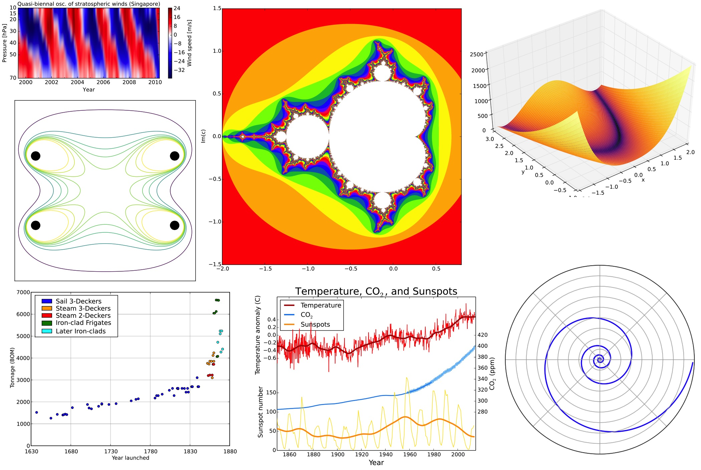

.. include:: rst-include

=============================
 NumPy, Pandas og Matplotlib
=============================

Í þessum kafla er fyrst gefið yfirlit yfir helstu svið **reiknifræði** þ.m.t. **gagnavísinda** og þá Pythonpakka sem smíðaðir hafa verið til að fást víð þau. Síðan er fjallað um grunnpakkann **NumPy** sem allir hinir byggja á, **Pandas** fyrir almenna gagnameðhöndlun og loks er talað dálítið um tölvuteikningu með pakkanum **Matplotlib**. Um aðra pakka er fjallað samhliða seinni köflum um línulega algebru, föll af mörgum breytistærðum, og reiknifræði, og þar verður líka talað meira um þessa þrjá pakka.

Inngangur
---------
Hvað er reiknifræði
~~~~~~~~~~~~~~~~~~~
**Reiknifræði** er orð sem búið var til upp úr 1970, með merkingu "beiting stærðfræði, tölvunarfræði og tölfræði til að leysa vísindaleg verkefni með tölvu" um það bil. Þegar orðið var búið til var hugtakaflóran ekki alveg jafnmargbrotin og nú, og reiknfræði var í grófum dráttum talin ná yfir aðgerðagreiningu (*operations research*), tölulega greiningu (*numerical analysis*), tölfræði (*statistics*) og tölvunarfræði (*computer science*). Fljótlega fengu samt síðasttöldu fræðin sjálfstæðan tilverurétt. Nefna má að Háskóli Íslands hefur boðið upp á kjörsviðið Stærðfræði–reiknifræði síðan 1972 (og í byrjun var tölvunarfræði innan þess) og svo Tölvunarfræði–reiknifræði síðan um aldamót. Við Raunvísindastofnun Háskólans var starfrækt "Reiknifræðistofa" frá 1972. Hún er enn til en kallast "Reiknifræðideild" síðan 2008, og undir hana heyrir m.a. tölfræði.

Í dag hefur fræðasviðum sem tengjast hagnýtingu á stærðfræði fjölgað mjög, þau skarast á ótal vegu, og sum eru kölluð þverfagleg. Hér verður gerð tilraun til að telja upp helstu fræðasvið reiknifræði og tilheyrandi undirsvið, með þeim fyrirvara að margir myndu flokka öðruvísi. Listinn takmarkast við svið sem snúast um að leysa verkefni í raunvísindum og verkfræði með tölvum. Þannig er t.d. fræðilegri tölvunarfræði sleppt (og reyndar mörgum öðrum undirsviðum hennar), og sömuleiðis fræðilegri tölfræði. Ekki er reynt að skilgreina sviðin nema lítillega, heldur verða áhugasamir að leita á netinu, t.d. í Wikipedíu.

Það er ekki auðvelt að finna eitt orð í ensku sem er jafn vítt og reiknifræðihugtakið eins og það er notað hér. Það sem kemst kannski næst því er *computational science*, en það orð er samt oftar notað í þrengri merkingu, einkum yfir fræðigreinarnar sem taldar eru upp sem "grunngreinar reiknifræði" í listanum.

**Grunngreinar reiknifræði**

  - **Töluleg greining** (*numerical analysis*, *computational science* stundum
    notað sem samheiti)
  - **Töluleg línuleg algebra** (*numerical linear algebra*), ein undirgreina
    tölulegrar greiningar
  - **Aðgerðagreining** (*operations research*), ýmsir mundu samt ekki telja hana
    til reiknifræði
  - **Töluleg bestun** (*numerical optimization*), undirgrein tölulegrar greiningar og
    aðgerðagreiningar, oft er líka talað um *bestunarfræði* (sem fjallar einnig um
    fræðilega bestun)
  - **Stærðfræðileg líkansmíð** (*mathematical modelling*), þverfaglegt svið milli flestra
    fræðasviðanna í þessum lista auk annarra, t.d. verkfræði, eðlisfræði og efnafræði
    
**Gagnavísindi** (*data science*), stundum flokkað sem undirgrein tölvunarfræði

  - **Vélanám** (*machine learning*), stundum talið það sama og reiknigreind
    (*computational intelligence*),
  - **Gagnanám** (*data mining*), e.t.v. stundum talið undirgrein vélanáms. Ath. að hér
    er "nám" þýðing á "mining" en ekki "learning". Kannski mætti tala um gagnagrennslan?
  - **Stórgögn** (*big data*), eða *gagnagnótt*, líka mætti tala um
    *stórgagnagreiningu* (*big data analytics*)
  - **Djúpnám** (*deep learning*), undir þetta falla djúp tauganet, sem eru
    grundvöllur í ýmissi nýjustu framþróun, t.d. í myndgreiningu (lesa handskrift,
    þekkja andlit), talgreiningu (skilja talað mál) og vélrænni þýðingu (*google
    translate*)

**Tölvunarfræði** (*computer science*)

  - **Gagnagrindur og reiknirit** (*data structures and algorithms*), hér teljast m.a.
    ýmis leitar-, röðunar- og netafræðireiknirit
  - **Gervigreind** (*artificial intelligence*), tengist náið ýmsum undirsviðum gagnavísinda
  - **Ofurtölvuvinnsla** (*high performance computing (HPC)*, *parallel computing*)

**Tölfræði** (*statistics*)

  - **Hagnýtt tölfræði** (*applied statistics*)
  - **Reiknifræðileg tölfræði** (*computational statistics*)
  - **Bayesísk tölfræði** (*Bayesian statistics*)

Tengt fræðasviðsheiti sem oft er notað er "hagnýtt stærðfræði" (*applied mathematics*). Það er samt þrengra að því leyti að það einskorðast gjarna við undirsvið í stærðfræði, og víðara að því leyti að oft eru talin með ýmis fræðileg undirsvið sem ekki nýtast beint til lausnar verkefna með tölvum.

Python-pakkar fyrir vísindalega reikninga
~~~~~~~~~~~~~~~~~~~~~~~~~~~~~~~~~~~~~~~~~
Aðalreiknifræðipakkarnir í Python eru **NumPy** fyrir vigur- og fylkjareikninga og **SciPy** fyrir önnur svið reiknifræði, þ.á.m. tölulega greiningu, tölulega línulega algebru (*scipy.linalg*) og tölulega bestun (*scipy.optimize*). Meðal verkefna sem leysa má með SciPy eru brúun (*interpolation*), töluleg heildun, töluleg lausn diffurjafna, útreikningur sérhæfðra falla (*special functions*), og merkjavinnsla (*signal processing*).

Fyrir gagnavísindi má nefna  **Pandas** sem er mikið notaður pakki fyrir almenna gagnavinnslu, **sklearn** (= *Scikit-learn*) fyrir reiknigreind og gagnanám, og loks pakkana **TensorFlow** og **PyTorch** fyrir vélanám þ.á.m. djúpnám. Fyrir klassísk tölvunarfræðileg reiknirit er ekki til einn samstæður pakki, en hægt er að finna sjálfstæða pakka fyrir mörg þeirra. Fyrir ofurtölvuvinnslu er til pakki **MPI**, en auk þess má nefna að bæði NumPy og SciPy nota OpenMP sjálfkrafa. Föll fyrir alla algengustu tölfræðireikninga eru í **scipy.stat**, og jafnframt er stundum nóg að nota **Pandas**, en fyrir flóknari tölfræðireikninga og líkansmíð er pakkinn **statsmodels**. Margir af þessum pökkum eru hver öðrum háðir. Þannig nota flestir ef ekki allir pakkarnir vigra og fylki sem eru útfærð í NumPy.

Teiknipakkanum **Matplotlib** er ekki hægt að sleppa í þessari upptalningu. Með honum er hægt að teikna gröf falla, súlurit, *scatter*-myndir, hæðarlínumyndir, þrívíðar *mesh*-myndir og upplýstar myndir af (margvíðum) föllum, o.s.frv. Að lokum má nefna **SymPy** pakkann fyrir *symbólska* reikninga, t.d. einföldun á stærðfræðiformúlum og sjálfvirka diffrun.

Vigrar og fylki í stærðfræði
~~~~~~~~~~~~~~~~~~~~~~~~~~~~
Nákvæmar skilgreingar á stærðfræðilegum vigrum og fylkjum og skyldum hugtökum eru í byrjun :numref:`línuleg-algebra`. kafla sem er um (svolítið fræðilega) línulega algebru. Hér látum við duga styttri útgáfur sem nægja fyrir NumPy umfjöllunina í kafla :numref:`fylkjareikn`.

**Vigur** (*vector*) er runa af endanlega mörgum tölum sem gefið er nafn og notuð sem ein heild. Einstakar tölur nefnast **stök** (*elements*), þau eru oftast tölusett 1,2,3... en stundum 0,1,2..., og i-ta stak vigurs :math:`a` er táknað :math:`a_i`. Vigur með tölunum 1,2 og 4 má rita :math:`(1,2,4)`.

**Fylki** (*matrix*) er tafla með tölum sem gefið er nafn og notuð sem heild. Tölur í fylki heita líka stök. Stakið í línu :math:`i` og dálki :math:`j` í fylki :math:`A` er táknað :math:`a_{ij}`. Í stærðfræðilegri umfjöllun er oftast byrjað að telja í 1 svo stakið efst til vinstri er :math:`a_{11}`, en þegar verið er reikna í tölvum er oft byrjað að telja í 0. Fylki með :math:`m` línum og :math:`n` dálkum er kallað :math:`m` sinnum :math:`n` fylki, táknað :math:`m \times n`. Hér er dæmi um :math:`2 \times 3` fylki:

.. math::
   A = \begin{pmatrix}1 & 2 & 3\\6 & 7 & 8\end{pmatrix}

.. _um-orðið-fylki:

Um orðið Fylki
~~~~~~~~~~~~~~

Skv. `Tölvuorðasafninu <http://tos.sky.is>`_ hefur orðið fylki tvær merkingar á
íslensku:

(1) [einkum í stærðfræði] *rétthyrnd tafla af tölum (eða öðrum gildum)* = e.
    *matrix*.

(2) [einkum í tölvufræði] *samsteypa (aggregate) hluta af sama tagi þar sem
    hægt er að vísa í einstök stök með vísi eða vísum (index, indices)* = e.
    *array*.

Í seinni merkingunni er fylki notað sem samheiti yfir vigra, tvívíð fylki, og
margvíð fylki (þar sem vísarnir eru 3 eða fleiri). Stundum er talað um vigra sem
einvíð fylki.

.. danger::
   Þar sem NumPy er beggja megin veggjar, í stærðfræði og í tölvufræði, verður
   orðið fylki notað í báðum merkingunum hér – lesandi þarf stundum af
   ráða af samhenginu við hvað er átt.

.. _fylkjareikn:

NumPy pakkinn
-------------

Með NumPy er hægt að vinna með vigra og fylki. Öfugt við lista hafa öll stökin sama gagnatag, kommutölur eða heiltölur. Þetta gefur mun hraðvirkari vinnslu þegar unnið er með mörg stök. Flestar listaaðgerðir má nota á NumPy fylki og auk þess bætast við ýmsar reikniaðgerðir línulegrar algebru. Næsta grein gefur stutta kynningu á möguleikunum, en nánari útskýringar eru svo í greinunum sem fylgja á eftir.

.. _numpykynning:

Kynning á NumPy
~~~~~~~~~~~~~~~

.. attention::
   Efni þessarar greinar er tekið beint úr Jupyter-vinnubókinni
   :h:`<a href="numpykynning.ipynb" download="numpykynning.ipynb"><b>numpykynning.ipynb</b></a>`

**Listum breytt í fylki með np.array, útprentun fylkja og eiginleika þeirra:**

   .. code:: python

      # R1
      import numpy as np  # Forrit sem notar numpy skammstafar það np skv. hefð
      v = np.array([0., 2.])
      A = np.array([[2., 3., 4.], [4., 5., 6.]])
      print('v =', v)
      print('A ='); print(A)
      print(f'ndim={A.ndim}, shape={A.shape})

   .. attention::
      Því miður henta f-strengir ekki vel til að prenta út fylki, t.d. er
      ekki hægt að tilgreina fjölda aukastafa: ``print(f'A = {A:.3f}')``
      gefur villu.
      
   .. Æfing
   .. hint::
      Opnið vinnubókina :h:`<a href="numpykynning.ipynb" download="numpykynning.ipynb"><b>numpykynning.ipynb</b></a>` og breytið/bætið við reit R1.

      1. Prófið ``print('A =', A)`` og líka ``print(f'A =\n{A}')``
      2. Prentið líka út ``A.size`` og ``A.dtype``
      3. Búið til vigur ``x = [3,4,5]`` og prentið hann út bæði með print og
         með display. Skoðið x.dtype.
      4. Endurtakið lið 3 með ``x = [3.,4,5]`` (niðurstaðan skýrist af því að
         öll stök NumPy vigurs eru alltaf með sama gagnatag).

**Föll til að búa til fylki:**

   .. code:: python
      
      # R2
      Z = np.zeros((2,2))   # Hefð að nota stóra stafi fyrir fylki
      E = np.ones((2,2))
      F = np.full((3,5), 3.14159)
      I = np.eye(2)
      z = np.zeros(3)       # og litla stafi fyrir vigra
      e = np.ones(4)       
      k = np.arange(1,11)
      h = np.linspace(0,3,7)
      print(Z); print(E); print(F); print(I)
      print(f'z = {z}, e = {e}'); 
      print(f'k = {k}, dtype={k.dtype}')
      print(f'h = {h}, dtype={h.dtype}')

   .. Æfing
   .. hint::
      Farið í reit R2 í bókinni.
      
      1. Stikinn í zeros verður að vera par: Prófið að kalla á ``np.zeros(2,2)``
      2. Búið til :math:`2 \times 3` núllfylki og :math:`3 \times 3` fylki með 7.5 í öllum sætum.
      3. Notið ``np.linspace`` til að búa til vigurinn :math:`(1, 1.5, 2, 2.5,\ldots, 8)`

**Hægt er að stilla fjölda aukastafa o.fl. í útskrift:**

   .. code:: python

         # R3
         np.set_printoptions(precision=3, floatmode='fixed', suppress=True)
         A = np.full((3,5), 3.14159)
         print('A = '); print(A)

         # Stillt aftur á sjálfgefna útskrift:
         # np.set_printoptions(precision=8, floatmode='unique',
         #                     suppress=False)

   .. Æfing
   .. hint::
      Keyrið reit R3 og svo reit R2 aftur

**Slembifylki:**

   .. code:: python

      # R4  Slembifylki
      import numpy.random as npr
      for i in range(4):
          A = npr.random((2,2))  # tekur inn par, gefur 2 x 2 slembifylki
          print(A)

   .. Æfing
   .. hint::
      Keyrið reit R4 aftur og aftur

**Fylkja og vigurreikningar:**

    .. code:: python

       # R5  
       A = np.array([[2., 3.], [4., 5.]])
       x = np.array([1, 2, 3], dtype=float)
       y = np.array([1.0, 1.0, 2.0])
       z = x + y       # tilsvarandi stök lögð saman
       B = A*A         # -- og margfölduð
       S = np.sqrt(A)  # tekur kvaðratrót af hverju staki
       E = np.exp(A)   # og exp (líka til np.sin, np.log o.s.frv.)
       print(z); print(B)
       print(S); print(E)

    .. Æfing
    .. hint::
       Prófið fleiri aðgerðir (mínus, deilingu, margföldun fylkis og tölu)       

Leiðbeiningar um NumPy á netinu
~~~~~~~~~~~~~~~~~~~~~~~~~~~~~~~

Eins búast má við er hægt að finna allskyns hjálp um NumPy á netinu t.d. `NumPy Basics Cheat Sheet
<https://s3.amazonaws.com/assets.datacamp.com/blog_assets/NumPy_Python_Cheat_Sheet.pdf>`_.
Einnig má finna nýlega bók sem fjallar um NumPy, Matplotlib og
Pandas, sem er að ýmsu leyti ágæt,
`Python Data Science Handbook <https://jakevdp.github.io/PythonDataScienceHandbook/>`__.

Hvernig má búa til NumPy fylki og vísa stök þeirra?
~~~~~~~~~~~~~~~~~~~~~~~~~~~~~~~~~~~~~~~~~~~~~~~~~~~
Í kynningunni að framan sáum við að einvíð fylki (vigra) má búa til með fallinu ``np.array``, sem breytir Python-runu af tölum (oftast lista, en það má líka vera samstæða eða ítrari) í breytu af taginu :code:`np.ndarray` (*n-dimensional array*), sem er grunntagið í NumPy. Oftast er tagið óformlega kallað *NumPy-array* og á íslensku *NumPy-fylki*. Hlutur af taginu :code:`np.ndarray` getur verið einvítt, tvívítt eða margvítt fylki en í þessum fyrirlestrarnótum höldum við okkur til einföldunar að mestu við einvíð og tvívíð fylki.

Til að búa til tvívítt fylki er kallað á ``np.array`` með viðfang sem er runa af runumum (oftast listi af listum) sem allar þurfa að vera jafnlangar, og tilgreina línur fylkisins (sbr. kynninguna), t.d.:

   :code:`A = np.array([[1,2,3], [5,7,9]])`

sem gefur fylkið :math:`A = \begin{pmatrix}1 & 2 & 3\\5 & 7 & 9\end{pmatrix}`.

Í kynningunni voru líka sýnd ýmis föll til að búa til sérstök fylki, núllfylki, einingafylki (sjá grein :numref:`einingafylki`), fylki með öllum stökum eins og vigra með hlaupandi stökum.

Ef ``x`` er einvítt NumPy fylki (vigur) þá er vísað í einstök stök hans eins og í stök í Python lista, sem sé með ``x[i]`` t.d. ``x[0], x[1]``, og talningin byrjar í 0. Til að vísa í stak í línu ``i`` og dálki ``j`` í NumPy fylki ``A`` notast ``A[i,j]``. Sjá nánar í grein :numref:`hlutvigrar`.

Eiginleikar vigra og fylkja
~~~~~~~~~~~~~~~~~~~~~~~~~~~

Sérhver hlutur af taginu *np.ndarray* hefur margvíslega *eiginleika*
(*attributes*). Ef ``x`` er *np.ndarray* þá fæst eiginleiki ``e`` með ``x.e``.
Helstu eiginleikarnir eru:

   **ndim:** Fjöldi vídda: 1 fyrir vigra og 2 fyrir fylki.

   **shape:** samstæða (*tuple*, stak, par, þrennd) með *ndim* stökum, fjöldi staka í vigri,
   fjöldi lína og dálka í fylki: Fylki með 3 línum og 2 dálkum hefur *shape* =
   (3,2).

   **size:** Heildarfjöldi staka í vigrinum/fylkinu, margfeldi stakanna í shape

   **dtype:** Tag staka í vigrinum eða fylkinu. Er venjulega *float64* eða
   *int64* en getur líka verið t.d. int32, bool, object o.fl. Venjulegasta
   tagið er float64 og slík stök eru að flestu leyti eins og kommutölur af
   venjulega float-taginu í Python.

   **itemsize:** Fjöldi bæta í hverju staki í fylkinu, 8 fyrir float64 og int64.

   **data:** Bendill á minnisblokk þar sem sjálf stök fylkisins eru
   geymd, einkum nytsamlegt þegar Python er tvinnað við C.

(Sjá fyrsta sýnidæmið í grein :numref:`numpykynning`)

Föll og aðferðir í NumPy
~~~~~~~~~~~~~~~~~~~~~~~~

Hugtakið *aðferð* (*method*) var útskýrt stuttlega í 1. kafla (:numref:`listar`). Til að rifja það upp, þá er *aðferð* hugtak í hlutbundinni forritun (*object oriented programming*), í raun ein tegund af falli (*function*) sem kallað er á með

   ``x.aðferð(stikar)``

þar sem x er hlutur (*object*). Í NumPy er x oftast af taginu ``ndarray``, og aðferðin getur bæði notað ``x`` og breytt því. Það þarf sem sé ekki að nefna `np` þegar NumPy-aðferðir eru notaðar, en það þarf hinsvegar þegar notuð eru önnur NumPy föll:

   ``np.fall(stikar)``.

Ef ``x`` er einn af stikunum getur fallið líka bæði notað og breytt ``x``.

Oft er til bæði NumPy fall og aðferð með sama nafni fyrir sömu aðgerð (sjá t.d. næstu grein), í mótsögn við markmiðið sem nefnt var í innganginum (grein :numref:`inngangur`), að í Python sé helst aðeins ein leið til að útfæra tiltekna aðgerð. Skýringin er a.m.k. stundum söguleg, því NumPy varð til sem sambræðingur tveggja eldri kerfa, Numeric og Numarray,

.. _inn-og-út:

Innlestur og útskrift
~~~~~~~~~~~~~~~~~~~~~

Hægt er að lesa fylki úr textaskrá með fallinu :code:`loadtxt`. Það er bara hægt að lesa tölur og skráin verður að hafa jafnmargar tölur á hverri línu. Fyrir utan textaskrár sem geymdar eru í núverandi möppu getur ``loadtxt`` lesið skrár sem eru á netinu. Hér eru nokkur dæmi sem skýra notkunina::

   skrá = 'datafile.txt'                #
   A = np.loadtxt(skrá)                 # les alla skrána inn í eitt fylki A
   x,y,z = np.loadtxt(skrá)             # les þriggja línu skrá inn í þrjá vigra
   x,y,z = np.loadtxt(skrá).T           # les þriggja dálka skrá inn í þrjá vigra
   A = np.loadtxt(skrá, skiprows=1)     # sleppir fyrstu línunni
   A = np.loadtxt(skrá, usecols=(0,1))  # les bara fyrstu tvo dálkana
   A = np.loadtxt(skrá, delimiter=',')  # les csv-skrá
   url = 'http://cs.hi.is/strei/a.txt'  #
   A = np.loadtxt(url)                  # les skrá af netinu

Virkinn `.T` í fjórðu línu í dæminu nefnist bylting, og er útskýrður í grein :numref:`bylting_python`.

Til að skrifa fylki í skrá má nota ``savetxt`` fallið:
   
   ``np.savetxt('skrá.txt', x, fmt='«snið»')`` (t.d. með f.«snið» = ``%5.2f``)

Fleiri föll
~~~~~~~~~~~

**Minnsta og stærsta stak og staðsetning þeirra:**

   - ``np.min(x), np.max(x), np.argmin(x), np.argmax(x)``
   - (eða ``x.min(), x.max(), x.argmin(), x.argmax()``)

   (:code:`min`, :code:`max`, ... í seinni línunni eru **aðferðir**)

**Meðaltal, staðalfrávik og miðtala:**

   - ``np.mean(x), np.std(x), np.median(x)``
   - (eða ``x.mean(), x.std()``, en engin ``x.median()`` aðferð er til)

Reyndar eru tvær aðferðir til að reikna staðalfrávik :math:`n` talna, í annarri er deilt með :math:`n-1` áður en tekin er kvaðratrót, en í hinni er deilt með :math:`n`. Mörg forritunarmál deila með :math:`n-1` m.a. Matlab, Excel og R, en NumPy deilir með :math:`n`. Á `Wikipediu <https://en.wikipedia.org/wiki/Standard_deviation#Corrected_sample_standard_deviation>`_ heitir gildið sem NumPy reiknar :math:`s_N` en hitt heitir :math:`s`. Til að fá :math:`s` með NumPy má nota :code:`np.std(x, ddof=1)`.

Föllin fyrir lista og samstæður sem talin voru í grein :numref:`öll-söfn` er öll hægt að nota líka fyrir NumPy fylki, en það gildir ekki um allar aðferðirnar, t.d. ekki ``count``, ``index``, ``extend`` og ``pop``.

.. _bylting_python:

Bylting og afpökkun
~~~~~~~~~~~~~~~~~~~

Í kafla :numref:`bylting` er fjallað um byltingu fylkja í línulegri algebru, sem fæst með því að skipta á línum og dálkum. Stærðfræðilegi rithátturinn fyrir byltingu fylkis :math:`A` er :math:`A^T`, lesið "A bylt". Í NumPy má rita ``A.T`` til að bylta fylki ``A``, til dæmis:

.. code:: python

   import numpy as np
   A = np.array([
       [3,2,1],
       [0,1,0], 
       [2,2,2]])
   B = A.T
   print(B)

   # Skrifar:
   [[3 0 2]
    [2 1 2]
    [1 0 2]]

Í ýmsu samhengi virkar fylki eins og samstæða af línum sínum, bæði þegar því er gefið gildi (eins og við höfum séð) en líka þegar það er notað til að gefa gildi. Ef A er 3 x 3 fylki má þannig skrifa

   ``(u,v,w) = A``

til að setja línur ``A`` inn í ``u``, ``v`` og ``w``. Það má líka sleppa svigunum: ``u,v,w = A``. Hér virkar ``A`` eins og þrennd af línum sínum, og þegar þrennd er gefið gildi með ``A`` fer hver lína inn í sitt stak – eftir ``par = (3,4); (u,v) = par`` verður ``u=3`` og ``v=4``. Þetta er kallað `afpökkun` (*unpacking*).

Þar með er komin skýring á því hvernig við gátum lesið línur eða dálka skrár inn í vigra
í grein :numref:`inn-og-út`.

Rökvísun
~~~~~~~~

Hægt er að velja stök úr NumPy vigri með því að vísa með rökvigri (*logical
vector*), sbr. eftirfarandi dæmi, þar sem við höfum úthlutað árunum 2015–2018
prímtölum. Á ensku er talað um *logical indexing*.

.. code:: python3

   ár = np.arange(2015,2019)
   p = np.array([2,3,5,7])
   I = [False, True, True, False]
   J = ár < 2017
   print(p[I])
   print(p[ár < 2017])
   print(J, ár[J], p[J])

   #skrifar:
   [3 5]
   [2 3]
   [ True  True False False] [2015 2016] [2 3]

.. _innfeldi-python:
    
Innfeldi
~~~~~~~~

Í kafla :numref:`innfeldi` er viguraðgerðin *innfeldi* skilgreind, en innfeldi
tveggja vigra er tala sem fæst með því að margfalda saman tilsvarandi stök og
leggja útkomurnar saman. Innfeldi vigra :math:`x` og :math:`y` er táknað með
:math:`x\cdot y`.  Ef t.d.

.. math::
   x = \begin{pmatrix}1\\2\\3\end{pmatrix} \text{ og } 
   y = \begin{pmatrix}4\\5\\6\end{pmatrix}

þá er innfeldið :math:`x\cdot y = 1\cdot 4 + 2\cdot 5 + 3\cdot 6 =
4 + 10 + 18 = 32`. Í NumPy eru þrjár leiðir til að reikna innfeldi vigra ``x``
og ``y``:

   - með ``np.dot(x,y)`` (sem sé með NumPy *fallinu* ``np.dot``)
   - með ``x.dot(y)`` (sem sé með *array*-*aðferðinni* ``dot``)
   - með ``x @ y`` (sem sé með *virkjanum* ``@``)

(á ensku eru fall, aðferð og virki kölluð *function*, *method* og
*operator*). Þessar leiðir eru allar jafngildar.

.. _hlutvigrar:

Hlutvigrar og -fylki, línur og dálkar
~~~~~~~~~~~~~~~~~~~~~~~~~~~~~~~~~~~~~

Hægt er að ná í eða vísa í hlutvigur á sama hátt og náð er í hlutlista með því að nota
`:` í vísum. Einnig er hægt að ná í / vísa í hlutfylki eða heilar línur eða
dálka í fylkjum. Hér er dæmi:

.. code:: python

   x = np.array([2,3,5,7,11])
   a = x[1:4]   # a = [3,5,7]
   b = x[:2]    # b = [2,3]
   c = x[3:]    # c = [7,11]
   A = np.array([
       [3,2,1],
       [0,1,0], 
       [2,2,2]])
   a00 = A[0,0]   # a00 = 3
   u = A[:,0]     # u = [3,0,2]
   v = A[-1,:]    # v = [2,2,2]; -1 vísar í neðstu línu
   B = A[0:2,1:3] # B = [[2,1], [1,0]]
   B = A[:2,1:]   # sama B og í línunni á undan

Pandas fyrir gagnavinnslu
-------------------------   
Pandas er pakki fyrir gagnameðhöndlun og gagnagreiningu í Python. Með Pandas er auðvelt að lesa stórar gagnaskrár, bæði textaskrár og töflureikniskrár (t.d. úr Excel eða Google sheets) og flokka gögnin á ýmsa vegu, velja hlutgögn (línur eða dálka), gera ýmsa útreikninga, og skrifa niðurstöðuna, annaðhvort í venjulegt úttak (í JupyterLab/á skjá) eða í nýja skrá. Það er líka hægt að búa til NumPy-fylki úr Pandas-töflum og nota Matplotlib til að birta niðurstöður grafískt. Dæmigerðar Pandas-aðgerðir eru oft framkvæmdar í töflureikni, en það hefur ýmsa kosti að gera þær í forriti, t.d. ef maður vill framkvæma samsskonar reikninga aftur og til þess er Pandas pakkinn tilvalinn.

Á netinu má finna `10 mín. leiðbeiningar <https://pandas.pydata.org/pandas-docs/stable/user_guide/10min.html>`_, `svindlblað <https://assets.datacamp.com/blog_assets/PandasPythonForDataScience.pdf>`_ og annað `slíkt <https://pandas.pydata.org/Pandas_Cheat_Sheet.pdf>`_.

.. _pandas-gögn:

Pandas gögn
~~~~~~~~~~~
Pandas-pakkinn er skv. hefð fluttur inn með

    :code:`import pandas as pd`

Aðalgagnatögin í Pandas eru pd.Series sem er einvíð runa gagna, og pd.DataFrame sem er tvívíð tafla. Tvennt greinir Pandas frá NumPy: Í fyrsta lagi hafa stökin í rununum og línur og dálkar taflanna auðkenni eða nöfn, og í öðru lagi geta dálkar taflanna verið af mismunandi tagi, einn dálkur gæti t.d. geymt strengi, annar heiltölur og sá þriðji kommutölur.

.. Sýnidæmi
.. important::   

   Á vef hagstofunnar er hægt að hlaða niður allskonar talnaefni, m.a. kosningaúrslitum.
   :h:`<a href="https://cs.hi.is/strei/kosningar.xlsx"
   download="kosningar.xlsx"><b>cs.hi.is/strei/kosningar.xlsx</b></a>`
   er að finna úrslit alþingiskosninga 2017. Skráin hefur þrjá dálka: **flokkur**,
   **atkvæði** og **þingsæti**. Þið eruð hvött til að smella á þessa skrá og skoða hana
   í Excel. Hér er svo forritsbútur sem les skrána, og birtir hana, reiknar
   heildarfjölda atkvæða, bætir við dálki með hlutfalli atkvæðanna sem hver
   listi fékk, og birtir loks þessa auknu töflu::
 
     import pandas as pd
     kosn = pd.read_excel("http://cs.hi.is/strei/kosningar.xlsx")
     display(kosn)
     n = sum(kosn["Atkvæði"])
     kosn["Hlutf"] = kosn["Atkvæði"]/n
     display(kosn)

   Hér fylgir byrjunin á töflunni sem birtist:

   .. figure:: myndir/atkvæði1.png
      :align: center
      :figwidth: 9cm

.. Æfing
.. hint::

   Afritið Sýnidæmið yfir í JupyterLab og keyrið það. Prófið að nota print í
   stað display. Bætið svo við samtals-línu með:

       :code:`kosn.loc["Samtals"] = kosn.sum()` |br|
       :code:`kosn.loc["Samtals", "Listi"] = ""`

   (seinni línan er tilkomin vegna þess að það á ekki að leggja saman listana).
   Bætið líka við dálki "Atkv-sætis" með atkvæði á bak við hvert þingsæti með
   því að deila í atkvæðin með þingsætunum. Loks er hægt að birta hlutfallið
   sem prósentu og aftasta dálkinn án aukastafa með því að prenta:

       :code:`kosn.style.format({"Hlutf": "{:.1%}", "Atkv-sætis": "{:.0f}"})`

   (í innri slaufusvigunum eru snið líkt og í f-strengjum).

Í sýnidæminu og æfingunni sést að sjálfgefin auðkenni línanna eru einfaldlega tölurnar 0–10, en dálkarnir fá nöfn úr hauslínu Excel-skrárinnar. Við sjáum líka að vísað er í dálk töflu eins og í stak runu, með vísi sem er nafn dálksins, en með því að nota `.loc` er í staðinn vísað í línu, og þá er líka hægt að vísa í einstakt stak eins og í NumPy fylki. Tökum líka eftir að reikniaðgerð (hér deiling) verkar á öll stök dálks í einu, eins og í NumPy.

Helstu Pandas-skipanir
~~~~~~~~~~~~~~~~~~~~~~

.. csv-table::
   :widths: auto
   :delim: ;

   ``df=pd.read_excel(excelskrá)``  ;Lesa fremsta vinnublað (*sheet*) inn í df
   ``df=pd.read_excel(excelskrá,s)``;Lesa vinnublað s inn í df (s má vera nafn eða nr.)
   ``df.to_excel(ecelskrá)``        ;Skrifa í Excelskrá
   ``df["nfn"]``                    ;Vísað í dálk nfn
   ``df.loc[2:4]``                  ;Vísað í línur 2 til (og með) 4
   ``df[df["A"] > 0]``              ;Velja línur þar sem dálkur ``A`` er jákvæður
   ``df["nýrdálkur"] = df["A"]*2``  ;Bætt við nýjum dálki sem er tvöfaldur dálkur ``A``
   ``display(df)``                  ;Skrifa töflu á skjá, með HTML-sniði
   ``display(df.style.format(fmt))``;Skrifa HTML-töflu með sniði ``fmt`` sem getur t.d. verið ``"{:.2%}"`` eða ``{"A": "{:.2f}"}`` (til að sníða bara dálk ``A``)
   ``df = pd.read_csv(skrá)``       ;Lesa töflu ``df`` úr skrá með kommum milli dálka, efsta lína fyrirsögn með dálkanöfnum
   ``df=pd.read_csv(skrá,`` |br| |sp3| ``names=["d1","d2"...])``;Lesa kommuaðskilda skrá (þmt 1. línu), dálkanöfn úr ``names``
   ``df=pd.read_csv(skrá,`` |br| |sp3| ``delim_whitespace=True)``;Lesa skrá með bilum á milli dálka
   ``df.sort_values(by="dálkur")``  ;Raða töflu eftir gildunum í *dálki*
   ``df.sort_values(by="dálkur",`` |br| |sp3| ``ascending=False)``;Raða töflu í minnkandi röð
   ``df.describe()``                ;skilar töflu yfir meðaltöl, staðalfrávik o.fl.
   ``df=pd.read_excel(…,dtype=str)``;Lesa alla dálka sem strengi
   ``df.loc[3,"nfn"]``              ;Vísað í tiltekinn reit
   ``L = list(df["nfn"])``          ;Dálki "nfn" breytt í venjulegan Python lista
   ``A = np.array(df.loc[`` |br| |sp3| ``3:6, "A":"C"]``;Hluttöflu breytt í NumPy fylki

[Framhald í vinnslu]

Teikning með Matplotlib
-----------------------

Inngangur
~~~~~~~~~

Matplotlib er teiknipakki fyrir Python sem er byggður á tölvugrafík í
Matlab-kerfinu. Með Matplot er hægt að teikna (eða birta, sýna) myndir
(*images*), hæðarlínur (*countours*), *skatterplott*, línurit og gröf (*line
plots*) og þrívíðar *upplýstar* myndir. Pakkinn er þannig að framendinn
(*frontend*) eða skilgreining teikningarinnar er aðskilinn frá bakendanum
(*backend*) sem birtir hana. Þannig er hægt að skrifa forrit sem býr til
teikningu, og svo er hægt að sýna teikninguna inni í Jupyter-bók, sem sjálfstæðan
glugga á skjá, á vef, í pdf-skjali, í Latex-skjali, á prentara o.s.frv. án þess
að breyta teikniforritinu sjálfu. Auk þess er hægt að fá alls kyns viðbætur við
Matlplotlib, t.d. fyrir kortagerð, þrívíða teikningu, og samskipti við Excel,
svo fáeinar séu nefndar. Eftirfarandi mynd sýnir dæmi um myndir teiknaðar
með Matplotlib.

   Matplotlib myndir

.. attention::
   Hér verður talað um teikniskipanir þegar strangt tiltekið ætti kannski frekar
   að tala um teikniföll: scatter-fallið, plot-fallið o.s.frv. Einn kostur við
   að segja frekar *skipun* er að það veldur síður ruglingi þegar verið er að
   teikna föll.

.. _einfaldar-myndir:
   
Einfaldar myndir
~~~~~~~~~~~~~~~~

**Undirbúningur teikningar**

   Venjulegasta notkun Matplotlib er að nota undirpakkann *pyplot* og í
   Matplotlib notendahandbókinni er mælt með að flytja hann inn sem *plt*, svo
   það er fyrir vikið alsiða. Teiknaðar myndir birtast sjálfkrafa inni í
   bókinni, neðan við forritsreitinn. Hér er kafli sem hægt er að setja fremst í
   vinnubók sem teiknar, þar sem bætt hefur verið við skipunum sem láta rúðunet
   teiknast undir öðrum teiknuðum hlutum, breyta sjálfgefinni stærð myndar, og
   laga galla á *savefig*.

   .. code:: python

      # Frumstilling teikningar
      import matplotlib.pyplot as plt
      plt.rc('axes', axisbelow=True)
      plt.rc('figure', figsize=(8,4)) # (6,4) er sjálfgefið
      plt.rc('savefig',bbox='tight')  # laga galla á savefig
   
**Skatter-plott og línurit**

   Hér er forrit sem teiknar punktana :math:`(x,y)` þar sem :math:`y = \sqrt
   x` fyrir :math:`x = 0, 1, 2, 3, 4, 5` og tengir þá með beinum línustrikum.
   Skipunin ``plt.figure`` býr til nýja mynd og tilgreinir breidd hennar og
   hæð, scatter-skipunin teiknar punktana sjálfa með flatarmál u.þ.b. 40
   ferpunkta (punktur ≈ 1/3 mm) og plot-skipunin teiknar strikin á
   milli þeirra. Að lokum teiknar grid rúðunet.
   
      .. code:: python

         x = np.linspace(0,5,6)
         y = np.sqrt(x)
         plt.figure(figsize=(7,3))
         plt.scatter(x,y,50)
         plt.plot(x,y)
         plt.grid()

   .. figure:: myndir/matplotlib-kynning.png
      :align: center
      :figwidth: 11cm

   .. attention::
      Stærð myndarinnar er gefin í tommum og (6,4) er sjálfgefið. Myndin er sköluð
      niður í ca. 2/3 þegar hún birtist á venjulegum fartölvuskjá, en er (a.m.k.
      nokkurnvegin) ósköluð ef bókin er prentuð sem pdf.
      
**Súlurit**

   Hér er búið til súlurit (*histogram*) af normaldreifðum slembigögnum. Stikinn
   ``bins`` gefur fjölda súlna og ``range`` gefur svæðið á x-ás sem súluritið nær yfir.

   .. code:: python

         import matplotlib.pyplot as plt
         import numpy.random as npr
         x = npr.normal(size = 500)
         plt.hist(x, bins=12, range=(-3,3))
         plt.xlabel('x')
         plt.ylabel('fjöldi gilda á hverju bili (af 500)');

   .. figure:: myndir/sulurit.png
      :align: center
      :figwidth: 11cm

   .. attention::
      Ýmsar teikniskipanir skila upplýsingum sem skrifast í vinnubókina
      en eru oftast óþarfar. Semíkomman aftast í ``plt.ylabel`` er til að losna
      við þessa útskrift.

   Skipunin ``hist`` reiknar sjálf hæð hverrar súlu en það er líka hægt að láta
   hæð súlnanna koma úr lista eða vigri með því að nota skipunina ``bar``. Um það
   er sýnt dæmi í næsta kafla.

.. _pandas-og-teikningar:
                    
Pandas og teikningar
~~~~~~~~~~~~~~~~~~~~
Matplotlib teikniskipanir geta notað dálka í Pandas-töflum sem viðföng. Til dæmis, ef ``xy.xlsx`` hefði tvo dálka, "x" og "y", þá mætti teikna línurit af þeim með skipununum::

    df = pd.readexcel("xy.xlsx")
    plt.plot(df["x"], df["y"])

Í eftirfarandi dæmi eru Pandas-dálkar notaðir sem viðföng í skipanirnar :code:`bar` og :code:`xticks`.
   
.. Sýnidæmi
.. important::   

   Hér er dæmi sem teiknar súlurit af kosningaúrslitunum 2017 sem voru
   á dagskrá í sýnidæmi í grein :numref:`pandas-gögn`:

   .. code:: python

      plt.figure(dpi=150)
      kosn = pd.read_excel("http://cs.hi.is/strei/kosningar.xlsx")
      x = range(len(kosn))
      plt.bar(x, kosn["Atkvæði"], color="tomato")
      plt.xticks(x, kosn["Listi"], rotation="vertical");
      plt.ylabel('Atkvæði')
      plt.title('Úrslit alþingiskosninga 2017');

   Hér er verður x listinn [0,1,2...9] (það voru 10 framboðslistar). Hér er
   `listi <https://en.wikipedia.org/wiki/Web_colors#Extended_colors>`_ yfir liti.
   Forritið teiknar svo þessa mynd:

   .. figure:: myndir/kosningar1.png
      :align: center
      :figwidth: 11cm

Töflur yfir Matplotlib-skipanir
~~~~~~~~~~~~~~~~~~~~~~~~~~~~~~~

Hér er fyrst listi yfir nokkrar aðal teikniskipanirnar ásamt tilvísunum í
kaflana þar sem um þær er fjallað.

.. list-table:: Helstu teikniskipanir
   :widths: auto

   * - ``figure``
     - Býr til mynd (grein :numref:`einfaldar-myndir`)
   * - ``scatter``
     - Teiknar punkta í tilgreindum x- og y-hnitum (greinar :numref:`einfaldar-myndir`
       og :numref:`teikning-punktasafns`)
   * - ``plot``
     - Teiknar línustrik sem tengja saman punkta (greinar :numref:`einfaldar-myndir` og
       :numref:`þrjú-dæmi`)
   * - ``hist``
     - Teiknar súlurit yfir tíðni – hæð súlna fæst með talningu (greinar
       :numref:`einfaldar-myndir` og :numref:`þrjú-dæmi`
   * - ``bar``
     - Teiknar súlurit með gefinni súluhæð (grein :numref:`pandas-og-teikningar`)
   * - ``legend``
     - Bætir skýringum á línum/skatter-punktum við teikningu (grein :numref:`þrjú-dæmi`)
   * - ``savefig``
     - Vistar teikningu í png-skrá (``savefig("skrá.png")``)
   * - ``text``
     - Skrifar texta inn á mynd (sjá næstu töflu)
   * - ``show``
     - Birtir mynd (þarf ekki í Jupyter)

.. csv-table:: Texti settur inn á mynd
   :widths: auto
   :delim: ;

    ``text(x,y,"texti")``     ; skrifar texta aftan við punkt (x,y)
    ``text(..., fontsize=n)`` ; – með n punkta letri
    ``text(...,va="bottom")`` ; – ofan við punkt (*vertical alignment*)
    ``text(...,ha="left")``   ; – aftan við punkt (*horizontal algn*)
    ``text(...,ha="center")`` ; – með punkt í miðjum texta
           
Teikniskipanirnar bjóða svo upp á fjölda stýristika (*control parameters*) til að
stjórna lit teikninga, breidd súlna, leturstærð, merkingum ása o.s.frv. Auk
stýristikanna eru svo notaðar ýmsar hjálpar- eða stýriskipanir til breyta mörkum
ása, bæta við skýringartextum, rúðuneti o.fl. Næstu töflur gefar yfirlit
yfir helstu stýristika og stýriskipanir.

.. list-table:: Helstu stikar í **plot**, **hist** og **bar**
   :widths: 3 8
   :name: plothiststýring    

   * - ``color``
     - Litur línurits (grafs) eða súlurits. Má skammstafa r, g, b, y, w, k (black),
       c (cyan), m (magenta) eða nota streng með `litanafni
       <https://en.wikipedia.org/wiki/Web_colors#Extended_colors>`_

   * - ``alpha``
     - gagnsæi, 0 alveg gagnsætt, 1 alveg ógagnsætt (sjálfgefið)

   * - ``linewidth`` eða ``lw``
     - Breidd línu í línuriti eða súluramma í súluriti. Eining punktar (~1/3 mm),
       sjálfgefið lw=1.5.

   * - ``linestyle`` eða ``ls``
     - Línutegund, getur t.d. verið ``''`` (engin lína) ``':'``
       (punktalína), ``'-'`` (heil lína, sjálfgefið) 

   * - ``marker``
     - Merki fyrir punkta í plot. Algengur marker er ``'o'`` (en líka má nota ``'.'
       '+' 'x'`` og fleiri); plot-skipun með ``marker = 'o', ls=''`` gefur svipaða
       niðurstöðu og ``scatter`` með sjálfgefnum stikum.

   * - ``markersize`` eða ``ms``
     - Stærð *markers* í ``plot``, sjálfgefið 6 punktar (~2 mm)

   * - ``edgecolor`` eða ``ec``
     - Litur á rönd súlna eða merkja. Ein tegund súlurita notar ``color='w', ec='k'``.

   * - ``label``
     - gefur súlutegund eða línuriti *skýringu*, notað með ``legend``-skipun,
       sjá töfluna að neðan (:numref:`plothjálparskip`)
       

   * - ``bins``
     - fjöldi súlna, sjá dæmið að ofan

   * - ``range``
     - ytri mörk súlurits, sjá dæmið að ofan (gott að velja bins í samræmi við range).

   * - ``rwidth``
     - "relative width" (sjálfgefið 1.0)

.. list-table:: Helstu stikar í **scatter**
   :widths: 1 4
   :name: scatterstýring

   * - ``marker``
     - Merki fyrir punkta, sjá *marker* í töflunni að ofan.

   * - ``s``
     - stærð punkta, flatarmál í *ferpunktum* (punktur ≈ 1/3 mm). Má vera vigur og þá
       fær hver punktur sína stærð.

   * - ``color``
     - litur (allir punktar í sama lit), sjá *color* í töflunni að ofan

   * - ``c``
     - vigur af litum (hver punktur í sínum lit). Má vera vigur af tölum og þá
       litast punktarnir með litaskala (*color map*).

   * - ``alpha``
     - gagnsæi, sjá töfluna að ofan

   * - ``edgecolor``
     - litur á rönd punkta

.. Attention::
     
   Sjálfgefin punktastærð er 36 = 6^2, sem gefur sömu stærð og ``o``-merki í
   plot-skipun með *markersize* 6 (sem er sjálfgefna stærðin í plot). Ath. að það
   er ekki stutt að skrifa :code:`size` í stað :code:`s`

   Þessar fyrirlestrarnótur skauta (ennþá) framhjá umfjöllun um **litaskala**, og
   við látum duga að vísa í 4. kaflann í `Python Data Science Handbook
   <https://jakevdp.github.io/PythonDataScienceHandbook>`_.
       
.. list-table:: Helstu hjálparskipanir fyrir teikningar
   :widths: 1 3
   :name: plothjálparskip

   * - ``plt.xlim(min,max)``
     - stillir neðri og efri mörk x-áss

   * - ``plt.ylim(min,max)``
     - Stillir neðri og efri mörk y-áss

   * - ``plt.title(strengur)``
     - setur fyrirsögn á teikningu

   * - ``plt.xlabel(strengur)``
     - setur textaskýringu við x-ás

   * - ``plt.ylabel(strengur)``
     - setur textaskýringu við y-ás

   * - ``plt.xticks(listi)``
     - setur merkingar á tilgreindar staðsetningar á x-ás (``listi`` gæti t.d. verið
       ``range(0,6)`` eða ``np.linspace(0,5,11)``)

   * - ``plt.yticks(listi)``
     - setur merkingar á tilgreindar staðsetningar á y-ás

   * - ``plt.tickparams(length=l,``
       ``width=w, direction="in")``
     - stillir strikin við ásamerkingarnar (l og w mælt í punktum (1/3 mm);
       í stað ``"in"`` má nota ``"out"``)

   * - ``plt.grid()``
     - teiknar rúðunet (nota má ``grid(axis='y')`` fyrir bara láréttar línur)

   * - ``plt.box(False)``
     - fjarlægir ramma utanum teikningu

   * - ``plt.axvline(x)``
     - bætir við lóðréttri línu (sjálfgefið er x = 0)

   * - ``plt.axhline(y)``
     - bætir við láréttri línu (sjálfgefið er y = 0)

   * - ``plt.legend()``
     - bætir við kassa með skýringum á línuritum/súlum sem búnar voru til með ``label``.

       
Loks er hér `hlekkur <https://matplotlib.org/api/pyplot_summary.html>`_  á yfirlit yfir allar Matplotlib-skipanir.

.. _þrjú-dæmi:

Þrjú dæmi um teikningar
~~~~~~~~~~~~~~~~~~~~~~~
Til frekari glöggvunar eru hér þrjú viðbótardæmi.

**Dæmi um plot:**

   .. code:: python

      x = np.arange(5)
      y = np.sqrt(x)
      plt.figure(figsize=(4, 1.8), dpi=90) # dpi=72 sjálfgefið
      plt.plot(x, y, lw=3, ls=':', c='r', marker='o', ms=8)
      plt.xlabel('x')
      plt.ylabel('y = √x')

   .. figure:: myndir/rauttgraf.png
      :align: center
      :figwidth: 7cm

**Dæmi um legend:**

   .. code:: python
      
      t = np.linspace(0, 2*np.pi, 30)
      s = np.sin(t)
      y = npr.random(30)
      plt.figure(figsize=(5,2))
      plt.plot(t,s,label='sin(x)')
      plt.plot(t,y,label='slembitölur')
      plt.grid()
      plt.legend();

   .. figure:: myndir/legend-daemi.png
      :align: center
      :figwidth: 9cm

**Dæmi um hist**

   .. code:: python
      
      x = npr.normal(size = 500)
      plt.figure(figsize = (6,3))
      plt.hist(x, bins=12, range=(-3,3), rwidth=0.8, color='c', ec='k');
      plt.xlabel('x-gildi');
      plt.ylabel('fjöldi');
      plt.grid(axis='y')      

   .. figure:: myndir/sulur2.png
      :align: center
      :figwidth: 11cm

.. _groffalla:                 
                 
Teikning af gröfum falla
~~~~~~~~~~~~~~~~~~~~~~~~

Við byrjum þennan kafla á æfingu, sem snýst bæði um efni undanfarandi kafla og
þessa. Lesendur eru hvattir til að spreyta sig á henni áður en þeir lesa áfram
því hér á eftir koma svör við ýmsum atriðum í henni.

.. Æfing
.. hint::
   Opnið vinnubókina :h:`<a href="fallateikning.ipynb"
   download="fallateikning.ipynb"><b>Fallateikning</b></a>` í JupyterLab og fylgið
   leiðbeiningum í henni. 

Til að teikna graf er byrjað á að núllstilla með því að keyra:

.. code:: python

   import numpy as np
   import numpy.random as npr
   import matplotlib.pyplot as plt
   plt.rc('axes', axisbelow=True)
   np.set_printoptions(precision=2, floatmode='fixed', suppress=True)

1. **Einfalt graf.** Með því að nota linspace með hæfilegu skrefi má nálga graf falls með
   bútum af línustrikum. Við getum t.d. teiknað graf sínus-fallsins á
   bilinu :math:`[0, 4\pi]` með:

   .. code:: python

       pi = np.pi
       t = np.linspace(0, 4*pi)
       plt.plot(t, np.sin(t));

   Úttak:       
      .. figure:: myndir/output_3_0.png
         :align: center
         :figwidth: 9cm

2. **Fínna graf.** Hér er hægt að bæta ýmislegt. Afritum forritsbútinn úr lið 1
   og bætum við:

      -  teygjum á grafinu (breikkum myndina) með skipuninni
         ``plt.figure(figsize=(12,4))`` (á undan plot).

      -  Ef grannt er skoðað sjást línustrikin. Mýkra graf fæst t.d. með
         ``linspace(0, 4*pi, 200)``

      -  Svo má bæta við rúðuneti með ``plt.grid``

      -  Það er hægt að teikna x- og y-ása með ``plt.axhline`` og
         ``plt.axvline``. Notið með stika ``c='k'`` til að fá svarta ása.

      -  Við getum látið x-ásinn ná t.d. frá -0.2 til :math:`4\pi` með
         ``plt.xlim([-0.2, 4*pi])``.

      -  Það má fjarlægja rammann með ``plt.box(False)``

      -  Síðasta tötsið fæst með ``plt.tick_params(length=0)``

   Lausn (sjá úttak í svari við lið 3):
      .. code:: python
         
         t = np.linspace(0, 4*pi, 200)
         plt.figure(figsize=(15,4))
         plt.grid()
         plt.axvline(c='k')
         plt.axhline(c='k')
         plt.box(False)
         plt.plot(t, np.sin(t))
         plt.xlim([-0.2, 4*pi])
         plt.tick_params(length=0);
   
3. **Kósínus bætt við.** Teiknum í framhaldi :math:`y = \cos x` inn á sömu mynd.

   Lausn:
      .. code:: python

         plt.plot(t, np.cos(t))

   Úttak (úr 2 og 3):
      .. figure:: myndir/output_6_0.png
         :align: center
         :figwidth: 16cm
   
4. **Graf vísisfallsins exp(x).** Teiknum nú nýja mynd með :math:`y = e^x` á
   bilinu :math:`[-5, 2]`.

   Lausn:
      .. code:: python
         
         t = np.linspace(-5,2, 200)
         plt.figure(figsize=(9,6)); plt.grid()
         plt.axvline(c='k'); plt.axhline(c='k')
         plt.box(False)
         plt.plot(t, np.exp(t));
         plt.xlim([-5, 2])
         plt.tick_params(length=0)
         
   Úttak:
      .. figure:: myndir/output_7_0.png
         :align: center
         :figwidth: 12cm

.. _teikning-punktasafns:
                    
Teikning punktasafns og jafna bestu línu
~~~~~~~~~~~~~~~~~~~~~~~~~~~~~~~~~~~~~~~~

Æfingarnar sem hér fylgja eru líka í vinnubókinni :h:`<a
href="fallateikning.ipynb"
download="fallateikning.ipynb"><b>Fallateikning</b></a>`, sbr. innganginn í
grein :numref:`groffalla`. Mælt er með að spreyta sig á æfingunum þar. Ef
eftirfarandi forritsbútar eru afritaðir héðan inn í JupyterLab þarf að keyra fyrst
núllstillingarkaflann sem er eftst í grein :numref:`groffalla`.

1. **Slembigögn:** Í eftirfarandi reit (#PLÖNTUR) eru búin til slembigögn (sem gætu t.d.
   sýnt hæð 50 trjáa :math:`y` sem fall af aldri þeirra, :math:`x`). Hér
   fylgir :math:`y` líkaninu:

   .. math::
         y = 1.5 x + 0.3 + \varepsilon         

   þar sem :math:`x` er normaldreifð skekkja með meðaltal 0 og
   staðalfrávik 0.7. Bætið við útprentun x og y aftast í reitinn og
   keyrið hann.

   .. code:: python

             #PLÖNTUR
             n = 50
             x = 1 + 5*npr.random(n)     # Jafnt dreifð gögn á bilinu [1,6]
             e = 0.7*npr.normal(size=n)  # Normaldreifðar skekkjur með staðalfrávik 0.7
             y = 1.5*x + 0.3 + e

   Lausn:
      .. code:: python
         
             print(x,y)

   Úttak:
      .. code:: none

         [5.74 2.00 5.68 3.61 3.54 2.66 4.74 1.47 2.39 1.87 4.51 2.01 2.31 3.03
         1.75 1.68 2.35 5.71 1.01 4.30 4.96 4.79 5.30 5.81 3.75 3.30 5.31 3.99
         1.33 3.44 2.67 1.04 5.22 2.91 1.59 2.39 1.85 3.30 2.17 4.25 1.32 1.06
         2.15 4.31 4.90 1.57 2.75 1.52 1.36 3.04] [8.21 3.22 8.91 6.15 4.88 4.48 6.57 2.03 3.42 3.53 6.81 2.43 3.12 4.40
         2.55 4.20 3.40 8.71 2.87 5.96 8.27 8.67 7.64 8.78 5.71 5.31 8.56 7.12
         2.29 4.83 3.44 2.00 8.81 5.33 3.49 2.52 3.23 6.17 3.27 6.02 1.44 1.50
         3.91 6.36 7.63 1.35 4.40 3.59 3.32 5.63]

2. **Vigrar hlið við hlið:** Í úttakinu að ofan 
   parast samstæð gildi ekki. Ein leið til að bæta úr því er að búa til
   fylki með tvo dálka, ``x`` og ``y``. Það má gera með virkjanum
   ``np.c\_[⋅,⋅]`` (c fyrir *column*):

   .. code:: python

       xy = np.c_[x,y]

   (það er líka til np.r\_ virki, og ágæt útskýring er í þessu `Quora
   svari <https://www.quora.com/Can-anybody-elaborate-the-use-of-c_-in-numpy>`__

   Lausn:
      .. code:: python

         xy = np.c_[x,y]
         print(xy[0:10,:]) # Prentum bara efstu 10 gildin

   Úttak:
      .. code:: none

         [[5.74 8.21]
          [2.00 3.22]
          [5.68 8.91]
          [3.61 6.15]
          [3.54 4.88]
          [2.66 4.48]
          [4.74 6.57]
          [1.47 2.03]
          [2.39 3.42]
          [1.87 3.53]]

3. **Skatter:** En ekkert kemur samt í staðinn fyrir góða mynd:

   .. code:: python

      u = npr.random(50)
      v = npr.random(50)
      plt.scatter(u, v, color='g');

   .. figure:: myndir/output_13_0.png
      :align: center
      :figwidth: 10cm

   Teiknum nú slembigögnin úr reitnum #PLÖNTUR með scatter.

      -  Litir geta verið r, g, b, y, w, k (black), c (cyan), m (magenta) eða
         `nafn <https://en.wikipedia.org/wiki/Web_colors#Extended_colors>`__
      -  Bætið við rúðuneti með ``plt.grid()``
      -  Hægt er að merkja x-ás með ``plt.xlabel``, t.d.
         ``plt.xlabel('Aldur (ár)')`` og sömuleiðis y-ás

   Lausn:
      .. code:: python

         plt.scatter(x,y,color='tomato');
         plt.grid(); 
         plt.xlabel('Aldur (ár)');
         plt.ylabel('Hæð (m)');

   Úttak:
      .. figure:: myndir/output_15_0.png
         :align: center
         :figwidth: 10cm

4. **Jafna bestu línu:** Við viljum finna "jöfnu bestu línu", sem sé beina línu
   sem lýsir gagnasafninu vel. Ef jafna línunnar er :math:`y = l(x) = ax + b` þá
   viljum við velja :math:`a` og :math:`b` þannig að summan af (lóðréttum)
   fjarlægðum punktanna frá línunni í öðru veldi verði sem minnst. Með öðrum
   orðum viljum við lágmarka fallið:

   .. math::
      S(a,b) = \sum_{i=1}^{50}(ax_i + b - y_i)^2      

   Skoðum `þennan kafla
   <https://en.wikipedia.org/wiki/Linear_least_squares#Example>`__ í
   Wikipediu-greininni um línuleg minnstu kvaðröt (*Linear least squares*) til að
   glöggva okkur á þessu. Við getum beðið með að skoða stærðfræðina sem nota má til
   að finna :math:`a` og :math:`b` því það er til NumPy fall sem gerir
   það fyrir okkur:

      ``(a,b) = np.polyfit(x,y,1)``
       
   Síðasti stikinn (sem er 1 hér) er stigið á margliðunni sem við ákvörðum,
   en bein lína er 1. stigs margliða.

   Byrjun á lausn:
      .. code:: python

         (a,b) = np.polyfit(x,y,1)
         print(f'Línan er y = {a:.2f}x + {b:.2f}')

   Úttak:
      .. code:: python
         
         Línan er y = 1.49x + 0.37

   Næsta skref er að teikna beinu línuna inn á grafið í lið 3. Það getum
   við gert með því að finna endapunkta hennar:

   .. math::
      (X_0, Y_0) = (1, l(1)) = (1, 1a + b) \text{ og }\\
      (X_1, Y_1) = (6, l(6)) = (6, 6a + b)

   Það er auðvelt í Python, því ``*`` og ``+`` verka stakvís á vigra: Látum ``X
   = np.array([1,6])`` og ``Y = a*X + b``
      
   Framhald á lausn:
      .. code:: python
         
         X = np.array([1,6])
         Y = a*X + b
         print(f'X={X}, Y={Y}')
   Úttak:
      .. code:: python

         X=[1 6], Y=[1.86 9.32]

   Að lokum er teiknað strik frá :math:`(X_0, Y_0)` til :math:`(X_1,
   Y_1)` áður en lausnin á 3. lið er keyrð aftur:
         
   Lokin á lausninni:
      .. code:: python

         plt.plot(X,Y,linewidth=2.5)
        
         # Og svo úr lausn á 3. lið:
         plt.scatter(x,y,color='tomato');
         plt.grid()
         plt.xlabel('Aldur (ár)');
         plt.ylabel('Hæð (m)')

   Úttak:
      .. figure:: myndir/output_19_1.png
         :align: center
         :figwidth: 10cm

..
   .. note::
      Úr kafla :numref:`matplotlib` eru tímadæmi 3.5.3 og skiladæmi 3.2, 3.3 og
      4.2(1, 3)
      
