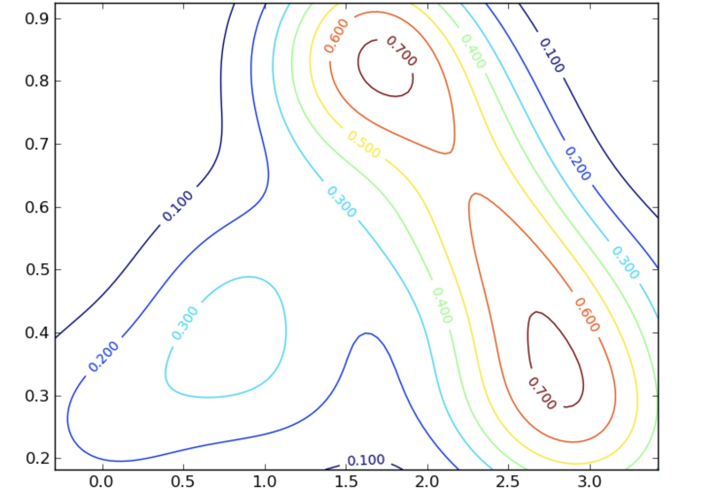
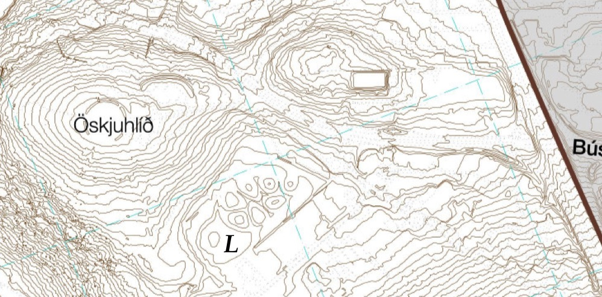
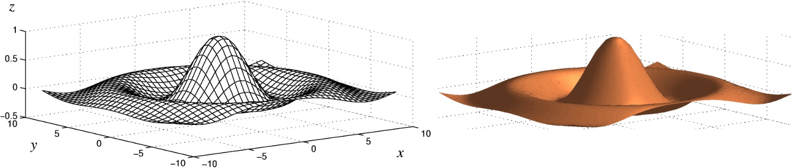
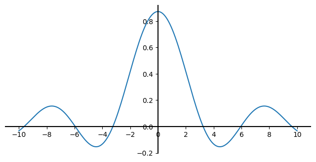
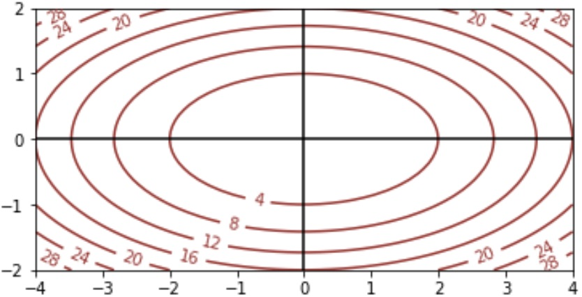
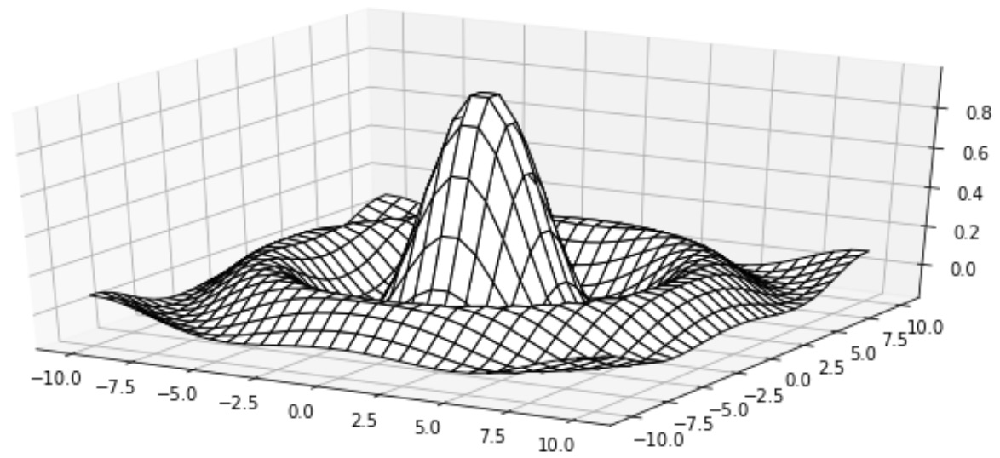
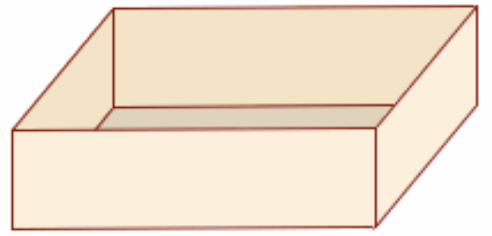
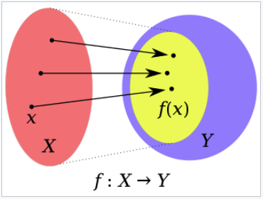

.. include:: rst-include

==============================
 Föll af mörgum breytistærðum
==============================

Inngangur
---------

Í þessum kafla vendum við okkar kvæði í kross, og fjöllum um stærðfræðileg hugtök og verkefni. Python verður samt ekki alveg skilið eftir útundan, heldur verða samhliða kynntar aðferðir til að fást við verkefni með Python.

Byrjað verður á umfjöllun um föll af tveimur breytistærðum, og tekin dæmi um hvernig hægt er að snúa jöfnum til að skrifa stærð (breytu) sem er fólgin í jöfnu sem fall af hinum stærðunum (breytunum). Næst eru sýndar aðferðir til að skoða útlit tvívíðra falla án sérstakrar tilvísunar í Python en :numref:`teikning-tvividra-falla` er síðan útskýrt hvernig hægt er að teikna myndir með Python. Þá eru hlutafleiður og stiglar á dagskrá, og fjallað er um aðferðir til að finna útgildi falla, bæði stærðfræðilega og með Python.

.. _tvívíð-föll:

Föll af tveimur breytistærðum eða tvívíð föll
---------------------------------------------

.. _hlutafl-skil:

Stærðfræðileg skilgreining
~~~~~~~~~~~~~~~~~~~~~~~~~~

Við höldum áfram að blanda svolítið saman stærðfræði og Python. Hér er sem 
sé stærðfræðikafli. Í dæmi 4 í kafla :numref:`teikning-punktasafns`
var skilgreint fall sem hægt var að lágmarka til að finna jöfnu bestu línu:

   .. math::
      S(a,b) = \sum_{i=1}^{50}(ax_i + b - y_i)^2      

(líka var vísað í `grein <https://en.wikipedia.org/wiki/Linear_least_squares#Example>`_ í Wikipediu). Þetta er dæmi um fall af tveimur breytistærðum, :math:`a` og :math:`b`. Fyrir gefin gildi á þeim skilar fallið summunni af lóðréttum fjarlægðum frá punktunum :math:`(x_i, y_i)` að línunni :math:`y = ax + b`. Því minni sem þessi summa er, því betur fylgir línan punktasafninu. Í fyrrnefndu dæmi 4 var síðan útskýrt hvernig hægt er að ákvarða bestu línu með fallinu :code:`polyfit` í Python. Síðar í þessum kafla munum við sjá hvernig hægt er að nota stigla og stærðfræði til þess að finna bestu línu.
      
En snúum okkur þá að stærðfræðilegri skilgreiningu á tvívíðu falli. Látum
:math:`A \subseteq \mathbb{R}^2` og :math:`f` vera fall sem sendir stökin í
:math:`A` yfir í rauntölurnar,

.. math::
   f\colon A \to \Bbb{R}.

Ef :math:`(x,y) \in A` varpast í :math:`z` þá ritum við:

.. math::
   z = f(x,y).

Oft táknar :math:`f(x,y)` einhverja formúlu sem inniheldur :math:`x` og
:math:`y`, t.d. :math:`x + 3y`. :math:`A` nefnist *formengi* fallsins :math:`f`
og :math:`f` sjálft er *fall af tveimur breytistærðum*, eða *tvívítt fall*
(*function of two variables, two-dimensional function*). Ef samband :math:`x`,
:math:`y` og :math:`z` er svona má rita fallið hvort sem er:

.. math::
      z = x + 3y\,\, \text{ eða }\,\,
      f(x,y) = x + 3y
      

Það er að sjálfsögðu hægt að nota aðra bókstafi en :math:`x`, :math:`y`,
:math:`z` og :math:`f`, t.d. þegar fallið lýsir einhverju raunverulegu sambandi
eins og flatarmáli þríhyrnings,

.. math::
   F(g,h) = \frac{gh}{2},

eða meðalhita :math:`H` á einhverjum stað á jörðunni með hnattstöðu (lengd og
breidd) :math:`l` og :math:`b`, :math:`H = h(l,b)`. :math:`H` er líka dæmi um
fall sem ekki er hægt að lýsa með einfaldri formúlu. Svo má nota breytur með
vísa, t.d. :math:`y = f(x_1, x_2)` eða (sbr. Python) :math:`y = f(x_0, x_1)`.
Athugið líka að stundum er hafður sérstakur bókstafur fyrir fallið (eins og
:math:`f`, :math:`F`, :math:`H` í dæmunum) en stundum er bara talað um formúluna
sem fall, t.d. gætum við sagt "fallið :math:`\,\sin(xy)`".

.. Æfing
.. hint::
   a) Teiknið (einhvern) þríhyrning með grunnlínu 3 og hæð 2. Reiknið svo
      flatarmál hans með fallinu :math:`F`
   b) Hvaða formengi mætti (eða ætti að) hafa fyrir föllin :math:`F` og :math:`H` í dæmunum?
   c) Ákvarðið :math:`g` þannig að :math:`F(g,2) = 18`.
   d) Rúmmál keilu er einn þriðji af flatarmáli grunnflatar sinnum hæð hennar.
      Flatarmál hrings með radíus :math:`r` er :math:`r^2\pi`. Lýsið rúmmáli
      keilu með tvíðvíðu falli af hæð hennar :math:`h`, og radíus grunnflatar,
      :math:`r`.
   e) Reiknið rúmmál keilu með radíus grunnflatar 2 cm og hæð 4 cm.

.. Æfing
.. hint::
   Ef miðunarhorn fallbyssu (frá láréttu) er :math:`\theta`, upphafshraði kúlunnar er
   :math:`v` og horft er framhjá loftmótstöðu, þá er lárétt vegalengd sem kúlan fer
   
         :math:`d = \frac{\normalsize{v^2}}{\normalsize{g}} \sin 2\theta`

   þar sem :math:`g` er þyngdarhröðunin, látum til einföldunar :math:`g = 10
   \text{ m/s}^2`. Skrifið

   a) :math:`d` sem fall af :math:`v` og :math:`\theta`
   b) :math:`v` sem fall af :math:`d` og :math:`\theta`
   c) :math:`\theta` sem fall af :math:`d` og :math:`v`

.. _gröf-tvív:
      
Gröf og myndir af tvívíðum föllum
~~~~~~~~~~~~~~~~~~~~~~~~~~~~~~~~~

Á sama hátt og ferillinn :math:`\{(x,y) | y = f(x)\}` er kallað graf einvíða
fallsins :math:`f`, þá skilgreinum við **graf** tvívíðs falls :math:`f` sem flötinn,
eða yfirborðið :math:`\{(x,y,z) | z = f(x,y)\}`.

Til skoða gröf (útlit) tvívíðra falla eru ýmsar aðferðir. Ein algeng er að búa
til hæðarlínumynd (*contour plot*) eins og hér er sýnd:

   Hæðarlínumynd með þremur hágildum

Hæðarlínur eru líka notaðar á landakortum og sýna hvar maður getur gengið í
landslagi án þess að fara upp eða niður brekku, sem sé í sömu hæð yfir
sjávarmáli. Þannig mynda þær t.d. lokaða ferla í kring um fjallstinda og lautir
eða lægðir. Í gröfum tvíðvíðra falla er talað um hágildi (*maxima*) og lággildi
(*minima*) eða hágildis- og lággildispunkta. Á myndinni að ofan sjást þrjú hágildi en
ekkert lággildi.

Hér er landakort með hæðarlínum af Öskjuhlíð. Þeir sem eru kunnugir staðháttum
sjá Veðurstofuhæðina og vatnstankinn, hólana í duftkirkjugarðinum og
hljóðmanirnar við Bústaðaveg og Kringlumýrarbraut. Takið líka eftir að þar sem
það eru engir litir og engar merkingar á hæðarlínunum þarf að þekkja vel til
staðhátta til að vita að það er lægð (með tjörn) en ekki hæð þar sem merkt er
með *L*.
 

   Hæðarlínukort af vef Reykjavíkurborgar
              
Á Wikipediu má skoða `landakort með merktum hæðarlínum
<https://en.wikipedia.org/wiki/Contour_line#/media/File:Cntr-map-1.jpg>`_ og
við munum síðar í námskeiðinu búa til ýmsar slíkar myndir með Python og Matplotlib.

Það er líka hægt að gera margskonar öðruvísi myndir af gröfum tvívíðra falla.
Hér er t.d. *litakóðuð mynd* (eða *hæðarsvæðamynd*), sem sýnir meðalhitafallið
:math:`H` úr síðusta grein:

.. figure:: myndir/jarðarhiti.jpg
   :align: center
   :figwidth: 14cm
   :name: jarðarhiti

   Meðalhiti ársins

og hér eru *netmynd* (*mesh plot*) og upplýst þrívíð mynd af tvívíða fallinu

.. math::

   f(x,y) = \frac{1 + 4\sin r}{1 + 4r} \text{ þar sem } r = \sqrt{x^2 + y^2}:

   Tvær myndir af tvívíðu falli

Enn ein leið er svo að skoða þversnið af tvívíðu falli, en þá er önnur breytan fest í einhverju gildi og eingöngu skoðað hvernig fallið er háð hinni breytunni. Lítum t.d. á fallið :math:`f(x,y)` hér á undan og festum :math:`y=1`. Þversniðsfallið verður þá:

.. math::
   g(x) = f(x,1) = \frac{1 + 4\sin \sqrt{x^2 + 1}}{1 + 4\sqrt{x^2 + 1}}

og graf þess lítur svona út:

   Þversnið fallsins á :numref:`hattmynd` þegar :math:`y=1`

Svo mætti teikna svona myndir fyrir fleiri gildi á :math:`y` til að átta sig á hvernig tvívíða fallið lítur út.

.. _teikning-tvividra-falla:

Teikning tvívíðra falla með Python
----------------------------------

Matplotlib hefur ýmsar skipanir til að teikna tvíðvíð föll: ``contour`` teiknar hæðarlínumyndir, ``contourf`` teiknar *hæðarsvæðamynd* (litakóðaða mynd) og ``plot_surface`` má nota til að teikna bæði netmynd og upplýsta þrívíða mynd. Auk þessara þriggja má nefna ``plot_wireframe``, ``plot_trisurf`` og ``quiver`` en við bíðum með að fjalla um þau.

.. _hæðarlínur:

Hæðarlínur með skipuninni *contour*
~~~~~~~~~~~~~~~~~~~~~~~~~~~~~~~~~~~

**plt.contour(x, y, z)**

    Teiknar hæðarlínur fyrir yfirborð sem lýsir tvívíðu falli :math:`f` þar sem

    .. math::
          
       z_{ji} = f(x_i, y_j), i = 0,1,2..., j = 0,1,2...

    Hér eru ``x`` og ``y`` vigrar með gildum sem spanna svæðið sem
    teikningin nær yfir (t.d. úr ``np.linspace``) og ``z`` er fylki með gildum
    :math:`f` á svæðinu. Hér hefur stærðfræðilegur ritháttur verið notaður fyrir
    fylkið og vigrana. Til að gefa z gildi í Python mætti nota:

    .. code:: python

       (nx,ny) = (len(x), len(y))
       z = np.zeros((ny,nx))
       for j in range(ny):
          for i in range(nx):
             z[j,i] = f(x[i], y[j])

    Ástæða þess að vísað er í :math:`z_{ji}` en ekki :math:`z_{ij}` er sú að
    hefðin býður að vísa í dálka fylkis (sem ganga frá vinstri til hægri) á
    eftir línum þess (:math:`z_{ji}` er í :math:`j`-tu línu og :math:`i`-ta
    dálki), en í tvívíðu hnitakerfi kemur :math:`x`-hnit (líka frá vinstri til
    hægri) á undan :math:`y`-hniti.

    Í staðinn fyrir ``for``-lykkjur má líka nota *comprehension*. 

    .. code:: python

             z = [[f(xi,yj) for xi in x] for yj in y]

    Þetta er bæði einfaldari kóði, og auk þess sleppur maður við að nota þessa
    svolítið ruglingslegu röð: :code:`j,i`.
              
**plt.contour(x, y, z, stiki=gildi,...)**

    Teiknar hæðarlínur og setur ýmsa stillingarstika. Helstu stikar eru:

    - ``levels`` tala með fjölda hæðarlína sem teiknaðar eru, eða vigur
      með gildum fallsins sem hæðarlínurnar eru teiknaðar fyrir.
    - ``colors`` litir hæðarlínanna (vigur, t.d. ['r', 'g', 'b'] til
      að lita línurnar rauða, græna, bláa, rauða, græna, bláa,...) eða litur. 
    - ``linewidths`` línubreiddir eða línubreidd

**c = plt.contour(...)** |br|
**plt.clabel(c, fmt="%.0f")**

    Merkir hverja hæðarlínu með gildi fallsins á henni. Líka má merkja t.d.
    aðeins neðstu 5 línurnar með ``plt.clabel(c, c.levels[:5])``

.. _hæðarlínuteiknidæmi:
    
Dæmi um hæðarlínuteikningu
~~~~~~~~~~~~~~~~~~~~~~~~~~
    
Eftirfarandi forrit teiknar hæðarlínur fallsins :math:`f(x,y) = x^2 + 4y^2` á
rétthyrningnum :math:`[-3,3] \times [-2,2]`. Takið eftir hvernig snið merkinga í
``clabel`` er stillt með ``fmt``-stika og einnig skrefin á merkingum y-áss með
``plt.yticks``.

    .. code-block:: python
       :caption: Hæðarlínur
       :name: hæðarlínuforrit

       def f(x,y): return x**2 + 4*y**2

       plt.figure(figsize=(6,3))
       x = np.linspace(-4,4,100)
       y = np.linspace(-2,2,50)
       z = np.array([[f(xi,yj) for xi in x] for yj in y])
       c = plt.contour(x, y, z, 8, colors = 'brown')
       plt.clabel(c, fmt="%.0f");
       plt.yticks(np.arange(-2, 3))
       plt.axhline(c='k')
       plt.axvline(c='k');

   Kvaðratískt fall með lággildi í (0,0)
       
Hæðarsvæði með skipuninni *contourf*
~~~~~~~~~~~~~~~~~~~~~~~~~~~~~~~~~~~~

**plt.contourf(x, y, z, stiki=gildi...)**

    Teiknar tvívítt fall með því að lita svæði eftir gildi þess. Svæði sem eru á
    milli tveggja samliggjandi hæðarlína sem ``plt.contour`` mundi teikna litast
    með sama lit og ``contour`` mundi lita neðri línuna með. Stikarnir ``x, y,
    z`` eru eins og lýst er fyrir ``contour``, og stillingarstikarnir ``levels``
    og ``colors`` sömuleiðis. Hinsvegar er enginn ``linewidths`` stiki og ekki
    hægt að nota ``clabel``. Til að fá bæði lituð svæði og teiknaðar línur á
    milli þeirra má kalla fyrst á ``contourf`` og svo ``contour`` með
    sömu stika.

    Þessi mynd fæst með ``contourf`` í forriti sem er svipað og
    :numref:`hæðarlínuforrit`:

    .. figure:: myndir/litaellipsur.png
       :align: center
       :figwidth: 11cm

       Hæðarsvæðamynd
                  
    Hægt er að fá myndir þar sem litirnir breytast samfellt (ekki ósvipað og í
    heimskortinu hér að framan) með því nota hátt gildi á ``levels`` stika, t.d.
    á bilinu 100–200.

.. _plot_surface:
    
Netmyndir með *plot_surface*
~~~~~~~~~~~~~~~~~~~~~~~~~~~~

Til að teikna netmyndir þarf smá undirbúning: Í fyrsta lagi þarf að flytja inn
klasann (*class*) Axes3D í einingunni ``mpl_toolkits.mplot3d`` með skipuninni:

    ``from mpl_toolkits.mplot3d import Axes3D``,

í öðru lagi þarf að búa til fylki ``X`` og ``Y`` sem spanna teiknisvæðið
með skipuninni

    ``(X,Y) = np.meshgrid(x,y)``
    
þar sem ``x`` og ``y`` eru vigrar eins og í grein :numref:`hæðarlínur` og í þriðja
lagi þarf að smíða sérstaklega þrívítt hnitakerfi (ása; *axes*) til að teikna í,
með skipuninni:

    ``ax = plt.subplot(projection = '3d')``

Teikniskipunin ``plot_surface`` sem teiknar sjálfa netmyndina er svo aðferð (*method*) í ásunum ``ax`` þannig að það er kallað á hana með ``ax.plot_surface``. Þetta er sýnt er í eftirfarandi dæmi, sem teiknar fallið sem gefið er aftast í grein :numref:`gröf-tvív`. Takið eftir að eins og þegar einvíð föll voru teiknuð þarf að nota np-útgáfur af innbyggðu föllunum, sem sé `np.sqrt` en ekki `math.sqrt`, til að fallsgildi allra staka í vigrum reiknist í einu lagi.

    .. code-block:: python
       :caption: Netmynd
       :name: netmyndaforrit
              
       def f(x,y):
           r = np.sqrt(x**2 + y**2)
           return (1 + 4*np.sin(r))/(1 + 4*r)

       x = y = np.linspace(-10,10,30)
       Z = np.array([[f(xi,yj) for xi in x] for yj in y])
       (X,Y) = np.meshgrid(x, y)
       plt.figure(figsize=(12,5))
       ax = plt.subplot(projection='3d')
       ax.plot_surface(X, Y, Z, edgecolor='k', shade=False, color='w');

   Matplotlib netmynd
              
.. attention::
   Tæknilega eru ásarnir ``ax`` hlutur (*object*) af klasatagi (*class type*)
   ``Axes3DSubplot``, eða með öðrum orðum eintak af taginu ``Axes3DSubplot``,
   sem er klasi sem erfist frá klasanum ``Axes3D`` sem aftur erfist frá
   ``Axes``. Þegar klasi er fluttur inn eru skipanir í honum framkvæmdar og því
   getur innflutningur á klösum haft ýmsar hliðarverkanir. Að flytja inn klasann
   ``Axes3d`` hefur þá hliðarverkun að plt.subplot ræður við að smíða þrívíða
   ása.

Upplýstar myndir með *plot_surface*
~~~~~~~~~~~~~~~~~~~~~~~~~~~~~~~~~~~

Skipunin sem notuð er til að teikna netmyndir, ``plot_surface`` nýtist líka til
að teikna upplýstar myndir. Eftirfarandi mynd fæst með forriti sem er eins og
:numref:`netmyndaforrit` fyrir utan að aftasti stikinn sem linspace fær er
100 og síðustu línunni er skipt út með:

    ``ax.plot_surface(X,Y,Z,color='wheat',rcount=100,ccount=100,antialiased=False)``

.. figure:: myndir/lýstur-hattur.jpg
   :align: center
   :figwidth: 13cm

   Upplýst hattfall
              
.. _hlutafleiður:
   
Hlutafleiður
------------

.. _skilgreining-hlutafleidu:

Skilgreining hlutafleiðu
~~~~~~~~~~~~~~~~~~~~~~~~

Ef :math:`f(x,y)` er fall af :math:`x` og :math:`y` þá skilgreinum við
hlutafleiðu (*partial derivative*) :math:`f` með tilliti til (m.t.t.) :math:`x` í
punktinum :math:`(a,b)` sem markgildið (*limit*)

.. math::
   f_x(a,b)=\lim_{h\to 0}\frac{f(a+h,b)-f(a,b)}{h}

og hlutafleiðu :math:`f` m.t.t. :math:`y` í :math:`(a,b)` sem 

.. math::
   f_y(a,b)=\lim_{k\to 0}\frac{f(a,b+k)-f(a,b)}{k}

(ef þessi markgildi eru til). Þetta þýðir að hlutafleiða m.t.t. annarrar
breytunnar er eins og venjuleg afleiða (*derivative*) af þverskurðarfallinu
(*cross section function*) sem fæst með því að halda hinni breytunni fastri: Ef
:math:`g(x) = f(x,b)` þá gildir

.. math::
   f_x(a,b) = g'(b)

Ef markgildin sem skilgreina hlutafleiðurnar eru bæði til er sagt að :math:`f`
sé diffranlegt (*differentiable*) í :math:`(a,b)`, en annars er það ódiffranlegt
þar.
   
Hlutafleiðurnar tvær af :math:`f` skilgreina tvö ný föll, :math:`f_x\colon A
\to \Bbb{R}` og :math:`f_y\colon A \to \Bbb{R}`. Gera
þarf greinarmun á því að reikna hlutafleiðu :math:`f`, sem felur í sér að finna
formúlur þessara falla fyrir almenn :math:`x` og :math:`y`, og að reikna
hlutafleiðu í tilteknum punkti, en þá er svarið tiltekin tala eða gildi.

Hlutafleiður koma víða við sögu í stærðfræði og stærðfræðilegum greinum. Í
fyrsta lagi má nota þær í stærðfræðigreiningu til að finna lággildi og hágildi,
normalvigra (sem eru hornréttir á yfirborð), snertiplön og Taylor-nálganir, og
svo eru þær grunnurinn í svonefndum hlutafleiðujöfnum, sem eru mikið notaðar í
til að smíða stærðfræðileg líkön t.d. í eðlisfræði, verkfræði, jarðeðlisfræði og
hagfræði.

.. Sýnidæmi
.. important::
                
   Látum :math:`f(x,y) = x^2y + 2y`. Þá er

   .. math:: f_x(x,y) = 2xy + 0 = 2xy

   (þar sem :math:`y` er fasti virkar þetta eins og við séum að diffra t.d.
   :math:`x^2\cdot 3 + 2\cdot 3`). Á sama hátt er

   .. math:: f_y(x,y) = x^2 + 2.

   Hlutafleiðan af :math:`f` m.t.t. :math:`x` í punktinum :math:`(3,5)` fæst svo
   með því að stinga inn: :math:`f_x(3,5) = 2\cdot 3\cdot 5 = 30`.

.. attention::
   Rifjum upp helstu reglur um venjulega afleiðu ($a$ í reglunum er fasti):
   
   .. math::
      \begin{align}
      & D (af(x)) = af'(x) \\
      & D x^n = nx^{n-1} \\
      & D \sqrt{x} = \frac{1}{2\sqrt{x}} \\
      & D \sin x = \cos x\textrm{ og } D \cos x = -\!\sin x \\
      & D \ln x = \frac{1}{x} \\
      & D e^x = e^x \textrm{ (ath. }e^x\textrm{ er stundum táknað }\exp(x)\textrm{)} \\
      & D a^x = a^x \ln a \\
      & D f(g(x)) = f'(g(x))g'(x) \\
      & D (uv) = u'v + uv' \textrm{ þ.e. } D(f(x)g(x)) = f'(x)g(x) + f(x)g'(x) \\
      & D \frac{u}{v} = \frac{u'v - uv'}{v^2}
      \end{align}

.. Æfing
.. hint::
   a. Reiknið bæði :math:`f_x` og :math:`f_y` ef :math:`f(x,y) = x^2 + y`.
   b. Diffrið fallið :math:`x \sin(y)` bæði með tilliti til :math:`x` og :math:`y`.
   c. Lát :math:`f(x,y) = (1-x)^2 + (y-x^2)^2`. Ákvarðið fallið :math:`f_x(x,y)` og
      gildið :math:`f_y(1,2)`.

Aðrir rithættir fyrir hlutafleiðu
~~~~~~~~~~~~~~~~~~~~~~~~~~~~~~~~~

Stundum viljum við diffra fall sem ekki hefur verið gefið nafn, í raun að diffra
formúlu. Ef diffra skal formúlu m.t.t. :math:`x` má setja :math:`D_x` framan við
hana, t.d.

.. math::
   D_x (x^2(y-1)^2 + x) = 2x(y-1)^2 + 1

Ef það er gert má setja lóðrétt strik með lágvísi aftan við til að sýna
að reikna eigi hlutafleiðuna í tilteknum punkti:

.. math::
   D_x (x^2y^2 + x)\big|_{x=1,y=2} = 2xy^2 + 1\big|_{x=1,y=2}
   = 2\cdot 1 \cdot 2^2 + 1 = 9.

Annar algengur ritháttur er að nota "rúnnað d" (stundum borið fram *del*), t.d.

.. math::
   \frac{\partial}{\partial x}(x^2y^2 + x) \text{ eða}
   \frac{\partial (x^2y^2 + x)}{\partial x}    

Slíkan rithátt má auðvitað líka nota þótt fallið hafi fengið nafn. Þannig er
:math:`D_y f(x,y) = f_y(x,y)`. Ef ritað hefur verið :math:`z = \text{formúla}`,
t.d. :math:`z = xy` þá er oft litið svo á, þegar tekin er hlutafleiða, að
:math:`z` sé jafngild formúlunni, t.d.:

.. math::
   \frac{\partial z}{\partial x} = \frac{\partial (xy)}{\partial x} = y    

.. Æfing
.. hint::   
   Finnið eftirfarandi hlutafleiður:
   
   .. math::
      \begin{align}
      &\textrm{1. } D_x \sin(xy) \\
      &\textrm{2. } D_y \sqrt{x + 2y} \\
      &\textrm{3. } \frac{\partial \ln(ax)}{\partial x} \\
      &\textrm{4. } \frac{\partial z}{\partial x} \textrm{ ef }z = \ln(x^2y^2) \\      
      &\textrm{5. } \frac{\partial f(1,2)}{\partial y} \textrm{ ef }f(a,y) = \ln(ay) \\
      &\textrm{6. } D_x \sqrt{xy\vphantom{b}} \big |_{x=2,y=2} \\
      &\textrm{7. } D_x \exp(ax^2 + bx + c) \\
      \end{align}
   
.. Æfing
.. hint::
   Látum :math:`d` vera drægni fallbyssu eins og í æfingunni aftast í grein
   :numref:`hlutafl-skil`,

         :math:`d = \frac{\normalsize{v^2}}{\normalsize{g}} \sin 2\theta`

   þar sem :math:`v` er skothraðinn, :math:`\theta` er horn miðað við láréttan
   flöt og :math:`g` er þyngdarhröðunin (við notum :math:`g = 10 \text{m/s}^2`).
   
   a. Ákvarðið
      :math:`\dfrac{\partial\normalsize{d}}{\partial\normalsize{v}\vphantom{\theta}}`
      og :math:`\dfrac{\partial\normalsize{d}}{\partial\normalsize{\theta}}`

   b. Fyrir gefinn hraða :math:`v` verður drægnin að einvíðu falli, :math:`d =
      f(\theta)`, og hlutafleiðan m.t.t. :math:`\theta` verður jöfn venjulegu
      afleiðunni :math:`f'(\theta)`. Þá má finna hámarksdrægni fallbyssunnar með
      því að leysa :math:`f'(\theta) = 0`. Finnið :math:`d_\text{max}` ef
      :math:`v = 200 \text{ m/s}`.

Stigull
-------

Lát :math:`f` vera tvívítt fall, diffranlegt í punkti :math:`(a,b)`, og látum
:math:`v` vera vigur sem stefnir í þá átt sem :math:`f` vex hraðast. Venjuleg
afleiða af einvíðu falli í punkti :math:`a` er hallatala (*slope*) snertils
(*tangent*) í punktinum, og á sama hátt mælir **stigull** (*gradient*) tvívíðs falls
í :math:`(a,b)` hallatölu snertils í :math:`(a,b)`. En stigullinn er hinsvegar
vigur en ekki tala eins og afleiða einvíða fallsins.

     **SKILGREINING.** |sp| Stigull falls :math:`f` í punkti :math:`(a,b)` er
     vigur sem stefnir í þá átt sem fallið vex hraðast, og lengd hans er jöfn
     hallatölu snertils við graf fallsins sem stefnir í sömu átt.

Stigullinn mælir sem sé hve bratt graf fallsins er og átt mesta bratta. Hægt er
að skoða þverskurðarfall eftir línu sem liggur í bröttustu stefnuna og lengd
stigulsins verður afleiða þess falls. Ef fallið hefur engan halla er stigullinn
núll.

Hér er mynd sem varpar ljósi á hugtakið stigul, og í `Wikipediugreininni um stigla <https://en.wikipedia.org/wiki/Gradient>`_ má skoða fleiri myndir.

     .. figure:: myndir/stigull.jpg
        :align: center
        :width: 15cm

        Gráa yfirborðið er graf fallsins :math:`f` og ljósbláa örin er í
        :math:`(x,y)`-planinu og sýnir stigul :math:`f` í punktinum
        :math:`(a,b)`. Blái snertillinn liggur upp bröttustu brekkuna, og lengd
        stigulsins er halli fallsins í þá átt.

Ritháttur og orðanotkun
~~~~~~~~~~~~~~~~~~~~~~~

Stigullinn af :math:`f` er oftast táknaður með :math:`\nabla f` en stundum með
:math:`f'`, og stigull í :math:`(x,y)` er þá :math:`\nabla f(x,y)` eða
:math:`f'(x,y)`. Stigullinn er dæmi um svonefnt **vigursvið** (*vector field*), en
það er fall :math:`\Bbb R^2 \to \Bbb R^2` sem sendir sem sé punkta í
planinu yfir í vigra. Venjuleg tvívíð föll eru líka stundum kölluð **skalarsvið**
(*scalar field*), en skalar er annað orð yfir tölu. Þetta orðfæri er einkum
notað í eðlisfræði, en líka í stærðfræðigreiningu sem er einmitt oft beitt í
eðlisfræði. Stundum er líka talað um vigurgilt fall á :math:`\Bbb R^2`
(*vector-valued function on* :math:`\Bbb R^2`)

.. _stigull:

Tvívíð keðjuregla og tengsl stiguls og hlutafleiða
~~~~~~~~~~~~~~~~~~~~~~~~~~~~~~~~~~~~~~~~~~~~~~~~~~
Einvíða keðjureglan segir að afleiða :math:`f(g(x))` sé :math:`f'(g(x))g'(x)` (sjá lista aftast í grein :numref:`skilgreining-hlutafleidu`). Þessi regla er sönnuð í stærðfræðigreiningu, sjá t.d. `hér <https://openstax.org/books/calculus-volume-1/pages/3-6-the-chain-rule>`_. Á Khan Academy eru `frekari útskýringar <https://www.khanacademy.org/math/differential-calculus/dc-chain/dc-chain-rule/a/chain-rule-review?modal=1>`_ og þar er líka `fín umfjöllun <https://www.khanacademy.org/math/multivariable-calculus/multivariable-derivatives/differentiating-vector-valued-functions/a/multivariable-chain-rule-simple-version>`_ um tvívíðu keðjuregluna, þar með talið sönnun á henni. 

     **SETNING (tvívíð keðjuregla).**

     .. math::
        D_t f(x(t),y(t)) = f_x(x(t),y(t))x'(t) + f_y(x(t),y(t))y'(t)

Stigull er síðan nátengdur hlutafleiðum eins og þessi setning segir: 

     **SETNING.** |sp| Stigull diffranlegs falls :math:`f` í :math:`(a,b)` er vigurinn með
     hlutafleiðum :math:`f`, þ.e.a.s.

     .. math:: \nabla f(a,b) = \begin{pmatrix}f_x(a,b) \\ f_y(a,b)\end{pmatrix}

Við bregðum svo út af vananum, að sleppa flestum sönnunum, og sönnum þessa reglu. Með sönnuninni fylgir líka skýringarmynd.

     **SÖNNUN SETNINGAR**. Látum :math:`p = (a,b)` og :math:`u` vera almennan vigur útfrá
     :math:`p` með lengd 1. Svo skoðum við þverskurð af fallinu í stefnu
     :math:`u`. Látum :math:`g` vera fallið í þeim þverskurði, sem sé
     :math:`g(t) = f(p+tu)`. Hallatala snertils í þessa stefnu er g'(0) og með
     því að nota tvívíðu keðjuregluna fæst:

     .. math::
        g'(t) &= D_t f(p + tu)\\
        &= D_t f(a + u_1 t, b + u_2 t) \\
        &= f_x(p + tu) u_1 + f_y(p + tu) u_2\\
        g'(0) &= (f_x(p), f_y(p)) \cdot u \\
        &= h \cdot u

     þar sem :math:`h = (f_x(p), f_y(p))` og :math:`h \cdot u` táknar innfeldi
     :math:`h` og :math:`u` (sbr. kafla :numref:`innfeldi-python`).

     .. figure:: myndir/sönnun-stigulsetningar.png
        :align: center
        :width: 17cm

     Næst er notuð regla um innfeldi sem margir kannast við, nefnilega að
     innfeldi tveggja vigra fáist með því að margfalda saman lengdir þeirra og
     kósínus af horninu milli þeirra. Reglan verður sönnuð í æfingu í kafla
     :numref:`horn-milli-vigra` en hún segir sem sé:

     .. math::
        x\cdot y = |x| \cdot |y| \cos \theta

     Þetta gefur okkur að snertilhallinn er :math:`g'(0)` = :math:`|h|\cdot
     |u|\cos \theta` = :math:`|h|\cdot 1\cdot \cos\theta` = :math:`|h|\cos
     \theta` þar sem :math:`\theta` er hornið á milli :math:`h` og :math:`u`.
     Þessi halli verður stærstur þegar :math:`\theta` = 0 (því þá er kósínusinn
     1, en annars er hann minni), það er að segja þegar :math:`u` stefnir í sömu
     átt og :math:`h`. En sú mesta bratta stefna er einmitt stefna stigulsins,
     og svo gildir auk þess að stigullinn hefur lengd sem er þessi mesti bratti,
     og niðurstaðan er að stigullinn hlýtur að vera jafn :math:`h`, eins og
     sanna átti.

.. Sýnidæmi
.. important::
   Finnum stigul fallsins

   .. math:: f(x,y) = x^2 + xy + y^2 - 3x

   fyrst í almennum punkti :math:`(x,y)` og síðan í punktinum :math:`(2,1)`. Hlutafleiður
   :math:`f` eru :math:`f_x = 2x+y-3` og :math:`f_y = x + 2y` og almenni
   stigullinn er því
   
   .. math::
      \nabla f(x,y) = \begin{pmatrix}2x + y - 3\\ x + 2y\end{pmatrix}

   Ef við látum :math:`x=2` og :math:`y=1` fæst:

   .. math::
      \nabla f(2,1) = \begin{pmatrix}2\cdot 2 + 1 - 3\\2 + 2\cdot 1\end{pmatrix}
      = \begin{pmatrix}2\\4\end{pmatrix}
     
Stefnuafleiða
~~~~~~~~~~~~~
Snertilhallinn sem kom við sögu í sönnuninni hér á undan hefur nafn, og er kallaður *stefnuafleiða*. Hana má skilgreina þótt :math:`u` hafi ekki lengd 1, nefnilega:

     **SKILGREINING.** |sp| Stefnuafleiða diffranlegs falls :math:`f` í stefnu
     vigurs :math:`u` í punkti :math:`p` er hallatalan sem fæst ef farið er frá
     :math:`p` úteftir :math:`u`, nánar tiltiltekið afleiða fallsins 
     :math:`g(t) = f(p + tu)` í 0.

Og ef :math:`u` hefur lengd 1 þá er stefnuafleiðan hallatala snertils við graf fallsins í :math:`p` sem stefnir í sömu átt og :math:`u`. Bláa línan :math:`T` á eftirfarandi mynd sýnir umræddan snertil.

   .. figure:: myndir/stefnuafleiða.png
      :align: center
      :width: 9cm

Stefnuafleiðan er táknuð með :math:`f'(p; u)`. Svo er líka hægt að skilgreina stefnuafleiðuna með formúlu, sem minnir á formúluna sem venjuleg afleiða er skilgreind með:

.. math::
   f'(p; u) = \lim_{h \to 0} \frac{f(p + hu) - f(p)}{h}

Næsta setning gefur okkur aðferð til að reikna stefnuafleiðu og sönnun hennar er í raun þegar komin, sem hluti af sönnuninni hér á undan (í grein :numref:`stigull`). Hún er nefnilega innfeldi stigulsins í :math:`p` og stefnuvigursins :math:`u`:
   
     **SETNING (tengsl stefnuafleiðu við stigul).** |sp| :math:`f'(p;u) = \nabla f(p) \cdot u`

Stefnuafleiðan er sem sé innfeldi Ein afleiðing af þessari setningu er að hlutafleiður :math:`f` eru stefnuafleiður í stefnu einingavigranna, :math:`(1,0)` og :math:`(0,1)`, en um einingavigra verður fjallað nánar í kaflanum um línulega algebru.

.. Sýnidæmi
.. important::
   Finnum stefnuafleiðu fallsins

   .. math:: f(x,y) = x^2 + xy + y^2 - 3x

   út eftir :math:`u = (1, 3)` í punktinum :math:`(2,1)`. Skv. síðasta sýnidæmi
   er :math:`\nabla f(2,1) = (2,4)` og stefnuafleiðan er þessvegna

   .. math::
      (2,4) \cdot (1,3) = 2\cdot 1 + 4\cdot 3 = 2 + 12 = 14      
   
.. sidebar:: Örvamælir (*quiver*)
   
   .. figure:: myndir/örvamælir.jpg
      :align: center
      :width: 5cm
              
Teikning stigla í Python
~~~~~~~~~~~~~~~~~~~~~~~~

Eins og útskýrt var að framan er stigull vigur sem stefnir upp bröttustu
brekkuna, og hann er því lengri sem brattinn er meiri. Ein afleiðing þessa er
að stigullinn verður hornréttur á hæðarlínur fallsins.

Matplotlib fallið ``quiver`` má nota til að teikna *örvarit*: örvar í rétthyrndu
neti sem sýna vigursvið. Örvarnar hafa rétta stefnu, en lengdir þeirra eru
skalaðar sjálfkrafa, þó þannig að hlutfallslegar lengdir haldi sér. Hér fylgir
dæmi um teikningu af hæðarlínum og stigli fallsins

.. math:: f(x,y) = x^2 + 4y^2
          
sem teiknað var í grein :numref:`hæðarlínuteiknidæmi`. Eins og fyrr þarf
svolítinn undirbúning.

   *Quiver*-plott af stigli
           
.. sidebar:: Skýringar
             
   - ``fx`` og ``fy`` reikna hlutafleiður ``f`` og þar með stigulinn
     (quiver-skipunin vill fá x- og y-hnit vigranna sem á að teikna aðskilin
     í u og v)
   - ``X3`` og ``Y3`` eru með þriðja hvert stak úr ``X`` og ``Y``
     (til að teikna ekki of margar örvar)
   - Eins og í forritinu í grein :numref:`plot_surface` þarf breytu með
     hnitakerfinu, ``ax``, og hér er náð í hana með ``plt.gca()`` (*get current
     axes*)
   - Með ``ax.set`` er hægt að stilla marga hluti í einu.
   - Nauðsynlegt er að setja ``aspect='equal'`` til að til að stefnur örvanna
     verði réttar. Hér fæst fyrir vikið stigull sem er hornréttur á
     hæðarlínurnar, eins og vera ber.

.. code-block:: python3
   :caption: Stiglar
   :name: stiglaforrit
     
   def f(x,y):
       return x**2 + 4*y**2

   def fx(x,y):
       return 2*x

   def fy(x,y):
       return 8*y

   X = np.linspace(-4,4,50)
   Y = np.linspace(-2,2,25)
   X3 = X[::3]
   Y3 = Y[::3]
   
   z = np.array([[f(x,y) for x in X]
                         for y in Y])
   u = np.array([[fx(x,y) for x in X3]
                          for y in Y3])
   v = np.array([[fy(x,y) for x in X3]
                          for y in Y3])
                          
   c = plt.contour(X, Y, z, 12)
   
   ax = plt.gca()
   ax.set(aspect = 'equal',
          yticks = np.arange(-2,3,1))

   plt.clabel(c, fmt="%.0f");
   plt.quiver(X3, Y3, u, v);

.. attention:: Til að skoða lista yfir alla eiginleika (*properties*) sem hægt
   er að stilla með ``ax.set`` má gefa skipunina ``plt.getp(ax)``
           
.. Æfing
.. hint::
   1. Reiknið (á blaði) stigul falls Rosenbrocks

      .. math:: f(x_0, x_1) = (1 - x_0)^2 + 100(x_1 - x_0^2)^2

   2. Reiknið í framhaldi :math:`\nabla f(-1,1)`, :math:`\nabla f(0,1)` og
      :math:`\nabla f(1,1)`. Athugið hvort niðurstöðurnar rími
      við eftirfarandi hæðarlínumynd af fallinu, t.d. með því að
      rissa upp á blaðið stiglana þrjá og hæðarlínur í grennd við þá (styttið
      þá samt svo þeir komist fyrir á blaðinu..

   Fall Rosenbrocks

Útgildi tvívíðra falla
----------------------

Hágildi og lággildi
~~~~~~~~~~~~~~~~~~~

Tvívítt fall :math:`f\colon A\to \Bbb R` er sagt hafa **víðvært hágildi** (*global
maximum*) í punkti :math:`p = (x_0, y_0)` ef gildi fallsins þar er stærra en eða
jafnt og gildi þess í öllum öðrum punktum formengisins :math:`A`, og á sama hátt
hefur :math:`f` **víðvært lággildi** (*minimum*) í :math:`p` ef gildið þar er minna
en eða jafnt og gildið allsstaðar annarsstaðar. Ef til er grennd um :math:`p`
þannig að :math:`f(p) \geq f(x,y)` fyrir alla punkta :math:`(x,y)` í grenndinni
þá er hágildið **staðbundið** (*local*). Staðbundið lággildi er skilgreint á
samsvarandi hátt. Ef gildi falls er hvergi (í :math:`A` eða grenndinni) jafn
hátt (lágt) og í :math:`p` er hágildið (lággildið) kallað **strangt** (*strict*).
Samheiti yfir há- og lágildi er **útgildi** (*extremum*).

Við höfum þegar séð ýmsar hæðarlínumyndir með há- og lággildum, t.d. í myndum 
:numref:`%s<þrjúhágildimynd>`, :numref:`%s<ellipsumynd>` og :numref:`%s<rosenmynd>`.

Ákvörðun útgilda falla hefur margskonar hagnýtingu, og sérstök undirgrein
hagnýtrar stærðfræði, töluleg bestunarfræði (*numerical optimization*), fjallar
um aðferðir til þess að finna þau. Stundum snýst verkefnið um að hámarka hagnað
eða lágmarka kostnað, en stundum er markmiðið að finna stika líkans sem nálga
gögn vel.

Útgildi fundin með því að leysa jöfnur
~~~~~~~~~~~~~~~~~~~~~~~~~~~~~~~~~~~~~~

Á sama hátt og útgildi einvíðra falla einkennast af því að afleiðan þar er núll,
þá einkennast útgildi tvívíðra falla af því að stigullinn þar er núll. Lausnir
jöfnunnar

.. math:: \nabla f(x,y) = (0,0)

gefa þá útgildin en auk þess söðulpunkta (*saddle points*) sem sum föll hafa.
Það eru punktar þar sem stigullinn er núll, og þannig að til er leið frá þeim
með vaxandi :math:`f`-gildum og önnur með minnkandi :math:`f`-gildum. Dæmi er
fallið :math:`f(x,y) = 10 + x^2 - y^2` sem sýnt er á eftirfarandi mynd:

.. figure:: myndir/söðulpunktur.jpg
   :align: center
   :name: söðulpunktur
   :figwidth: 100%

   Fall með söðulpunkti

Þar sem báðar hliðar í jöfnunni að ofan eru vigur felur lausn hennar í sér að
leysa saman tvær jöfnur í tveimur óþekktum (:math:`x` og :math:`y`):

.. math::
   
   f_x(x,y) &= 0 \\
   f_y(x,y) &= 0

Stundum er hægt að leysa þessar jöfnur með algebru/stærðfræðigreiningu, en oftar
en ekki þarf að beita tölulegum aðferðum. Eftir að lausnirnar eru fundnar
þarf svo að flokka þær í hágildi, lággildi og söðulpunkta.

.. Sýnidæmi
.. important::
   Ákvörðum útgildispunkta fallsins

   .. math:: f(x,y) = x^2 + xy + y^2 - 3x

   Stigullinn er :math:`\nabla f = (2x + y - 3, x + 2y)` svo við þurfum að leysa jöfnurnar:

   .. math:: 2x + y = 3\\ x + 2y = 0

   Smá útreikningar gefa nú :math:`x = 2` og :math:`y = -1`. En er þetta
   lággildi, hágildi eða söðulpunktur? Svarið er lággildi, og það er m.a. hægt
   að sjá útfrá því að þetta er eina lausnin, og að fallið vex upp úr
   öllu valdi ef x og y eru látin stefna á óendanlegt.

   .. figure:: myndir/synidaemi.jpg
      :align: center
      :width: 11cm

      Graf fallsins f og lággildispunkturinn p
              
.. Æfing 
.. hint::   
   Smíða skal loklausan kassa sem tekur 500 :math:`\text{cm}^3` (sem sé hálfan
   lítra) úr blikkplötum þannig að sem minnst blikk sé notað. Ákvarðið hæð hans,
   lengd og breidd með eftirfarandi aðferð: Kallið lengdina :math:`x` og
   breiddina :math:`y`. Þá verður hæðin :math:`h = 500/(xy)`. Látið nú
   :math:`f(x,y)` = flatarmál blikksins sem þarf, finnið formúlu fyrir :math:`f`
   og lágmarkið með því að leysa jöfnurnar sem fást þegar hlutafleiður
   :math:`f` eru settar núll.

   
.. attention::
   `Fyrirlestrarnótur í Stærðfræðigreiningu 2 <https://edbook.hi.is/stae205g>`_
   eru með ýmislegt efni og myndir sem gæti gagnast við að skilja tvívíð föll,
   hlutafleiður og stigla betur

Margvíð föll
------------

Skilgreining og dæmi
~~~~~~~~~~~~~~~~~~~~

Rifjum upp að tvívítt fall er fall :math:`f\colon A \to \Bbb{R}` þar sem :math:`A \subseteq \mathbb{R}^2`. Á sama hátt er :math:`n`-vítt fall fall:

.. math::
   f\colon A \to \Bbb{R}\textrm{ þar sem }A \subseteq \mathbb{R}^n

Við getum tekið dæmi um hitastigfallið H á mynd :numref:`%s<jarðarhiti>`. Það væri hægt að hugsa sér fall til að tákna meðalhita ekki bara við yfirborð, heldur líka ofar, t.d. í 10 m hæð (eða 1 km). Almennt mætti skilgreina þrívítt fall:

.. math::
   H(l,b,h) =\textrm{ meðalhiti á stað með lengd }l\textrm{, breidd }h\textrm{ í hæð }h

(þó það væri líklega ansi erfitt að ákvarða gildi :math:`H` allsstaðar). Við gætum líka hugsað okkur að ákvarða jöfnu bestu parabólu með því að lágmarka fallið

.. math::
   
   S(a,b,c) = \sum_{i=1}^{50}(ax_i^2 + bx_i + c - y_i)^2

(þá er gildir :math:`S\colon \mathbb{R}^3 \to \mathbb{R}`). Það er mun erfiðara að búa til myndir af margvíðum föllum en tvívíðum. Helsta aðferðin er að sýna nokkur þverskurðarföll: Við gætum t.d. sýnt sérstaka mynd af meðalhitanum við yfirborð, í 100 m hæð, 200 m hæð o.s.frv. Veðurfræðingar skoða stundum veðurkort í jafnþrýstiflötum, t.d. 500 millibara fletinum.

Viðfang skrifað sem vigur
~~~~~~~~~~~~~~~~~~~~~~~~~
Stakið :math:`x` í formenginu sem margvítt fall varpar úr er vigur með :math:`n` stökum:

.. math::
   x = (x_1, x_2,\ldots, x_n)

og ef þetta stak varpast t.d. í 5 má rita viðföng þess annaðhvort sem margar tölur (stökin í vigrinum) eða einn vigur, sem sé

.. math::
   &f(x_1, x_2,\ldots, x_n) = 5\\
   \textrm{eða: }&f(x) = 5

Á eftirfarandi mynd væri :math:`X \subseteq \mathbb{R}^n`, :math:`Y = \mathbb{R}` og :math:`f(x) = 5`.

Þegar unnið er samhliða með stærðfræði og Python getur líka verið þægilegt að byrja að telja í 0. Svona vigur-ritháttur fyrir viðfangið er því algengari sem :math:`n` er stærra. Ef :math:`n` er 2 eða 3 er oft ritað :math:`f(x,y)` eða :math:`f(x,y,z)` en fyrir math:`n \geq 4` er algengast að nota :math:`f(x)` og láta :math:`x` vera vigur, og það er reyndar oft gert líka fyrir :math:`n=2\textrm{ eða }3`. Reyndar höfum við nú þegar nýtt okkur þennan möguleika, í sönnuninni í kafla :numref:`stigull` þar sem við skrifuðum :math:`p` í stað :math:`(a,b)`.

.. _margvidir-stiglar:

Margvíðir stiglar
~~~~~~~~~~~~~~~~~

Stigull af :math:`n`-víðu falli er :math:`n`-vigur:

.. math::
.. math::
   f'(x) = \nabla f(x) =
   \begin{pmatrix}
   \dfrac{\partial f(x)}{\partial x_1}\\
   \vdots\\
   \dfrac{\partial f(x)}{\partial x_n}
   \end{pmatrix}

Eins og fyrir tvívíð föll segir stigullinn okkur í hvaða átt fallið vex hraðast. Við getum hugsað okkur fugl á flugi sem er kalt, hann gæti e.t.v. haft vit á að fljúga í stefnu stiguls þrívíða fallsins :math:`H` sem talað var um í greinininn hér á undan. Margvíðir stiglar verða aftur á dagskrá í kafla :numref:`taylor-nálgun`.

[Efni í vinnslu]

   

