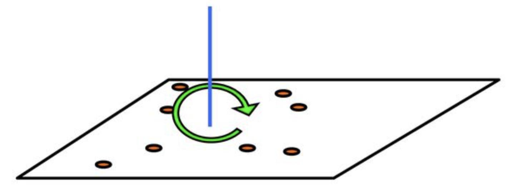
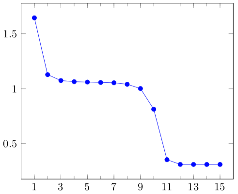

Flokkun vigra
-------------
Í þessari grein verður fjallað um aðferðir til að **flokka** (*cluster*,
*partition*) vigra í **hópa** (*groups*) þannig að vigrarnir í hverjum hóp séu
líkir hver öðrum, en vigrar í mismunandi hópum séu ekki eins líkir. Verkefni af
þessu tagi er nefnt *clustering* á ensku. Sér í lagi verður farið í hið
velþekkta **k-means** reiknirit (oftast er bara talað um *k-means* og ekki reynt
að þýða). Stundum er talað um að flokka *mælingar* (*observations*), *punkta*,
*einstaklinga* eða *hluti*, og þegar búið er að flokka má tala um *meðlimi* í
hópum. Orðið **einkenni** (*feature*) er oft notað um einstök stök í vigrunum
sem eru flokkaðir.

Dæmi um flokkun tvívíðra vigra
~~~~~~~~~~~~~~~~~~~~~~~~~~~~~~

Á eftirfarandi mynd er dæmi um flokkun tvívíðra vigra, sem sé punkta í planinu.

.. figure:: myndir/flokkunardæmi300.png
   :figwidth: 12cm
   :align: center
   :name: flokkun300

   Skipting 300 punkta í þrjá hópa

Einn vandi við slíka flokkun er að ákvarða hópafjöldann, sem hefðbundið er að
nefna :math:`k`. Það sem er óvenjulegt við dæmið á myndinni er að vídd punktanna
er :math:`n = 2` og því er auðvelt að teikna punktasafnið. Í þessu dæmi er líka
auðvelt að sjá af myndinni að :math:`k = 3` er góð tala, en þetta er ekki svona
auðvelt fyrir hærri víddir og jafnvel heldur ekki fyrir önnur tvívíð dæmi.

Dæmi um hagnýtingu flokkunar
~~~~~~~~~~~~~~~~~~~~~~~~~~~~

**Flokkun texta eftir umfjöllunarefni.** Hér er nærtækt að taka dæmið um
Wikipedia-greinarnar sem voru á dagskrá í Skilaverkefni 7, þar sem unnið var með
tíðni 1000 orða í 300 Wikipedia-greinum sem fjölluðu um fimm mismunandi
efnisflokka, Pokemon, veðurfræði, listir, stofnanir Sameinuðu þjóðanna, og
rafmagnsverkfræði. Góður flokkari ætti að geta fundið (endurskapað) flokkunina,
a.m.k. komist nálægt henni útfrá orðtíðnigögnunum einum saman, sérstaklega ef
við festum :math:`k = 5`.

**Flokkun sjúklinga.** Ef :math:`x_i` er vigur af einkennum sjúklings númer :math:`i`
(t.d. aldur, kyn, BMI, og sjúkdómseinkenni af ýmsu tagi) þá gætti verið gagnlegt
að flokka sjúklingana í hópa með svipuð einkenni.

**Flokkun viðskiptavina.** Gerum ráð fyrir að :math:`j`-ta stak :math:`x_i` sé
magn af vöru :math:`j` sem kúnni númer :math:`i` keypti á tilteknu tímabili. Þá
mætti flokka kúnnana í :math:`k` hópa og svo mætti beina sömu auglýsingum til
þeirra sem eru í sama hóp, eða t.d. auglýsingum um það sem aðrir í hópnum hafa
keypt en þeir ekki.

Auðvelt er að búa til allskonar dæmi af sama tagi: Skipting nemenda í flokka
eftir einkunnum og námsbraut (þá mætti t.d. búa til verkefnahópa með einum úr
hverjum flokki til að fá fjölbreytni í hópana), flokkun svæða eftir veðurfari,
flokkun fyrirtækja eftir ýmsum eiginleikum, o.s.frv.

Í sumum tilvikum er ekkert unnið frekar með flokkana, heldur er tilgangur
flokkunarinnar einfaldlega sá að átta sig betur á gagnasafni.

Ritháttur fyrir flokkun
~~~~~~~~~~~~~~~~~~~~~~~

Við látum :math:`N` tákna fjölda punkta eða :math:`n`-vigra sem á að skipta í
:math:`k` hópa og látum svo :math:`G_j` vera mengi með númerum þeirra punkta
sem eru i :math:`j`-ta hópnum. Tökum sem dæmi að 7 punktum sé skipt í 3
hópa, með :math:`x_1`, :math:`x_3` og :math:`x_5` í fyrsta hópnum,
:math:`x_2` og :math:`x_4` í hópi 2 og :math:`x_6` og :math:`x_7` í þeim
þriðja. Þá verður:

.. math::
   G_1 = \{1, 3, 5\},\quad G_2 = \{2, 4\}\quad\text{og}\quad G_3 = \{6, 7\}

Við skilgreinum líka vigur :math:`c` með :math:`c_i = {}` númer hópsins sem
:math:`x_i` lendir í. Fyrir dæmið okkar verður

.. math::
   c = (1, 2, 1, 2, 1, 3, 3)

Vigurinn :math:`c` svarar til Python-breytunnar :code:`code` í grein :numref:`kmeans`.

.. _miðpunktar-hópa:

Miðpunktar hópa
~~~~~~~~~~~~~~~

**Miðpunktur** (*centroid*) fyrir hóp er punktur sem líkist punktunum í hópnum,
en hann þarf samt ekki að vera sjálfur í hópnum. Í k-means reikniritinu sem við
lýsum nákvæmlega hér að neðan er miðpunktur hóps reiknaður sem meðaltal af öllum
punktum í hópnum. Ef :math:`G_1,\ldots,G_k` er flokkun :math:`x_1,\ldots,x_N` og stærð
:math:`j`-ta hópsins er :math:`p_j` þá má reikna miðpunkta hópanna með:

.. math::
   &\textit{Reikna-miðpunkta:}\\[3pt]
   &\textbf{Fyrir } j = 1,\ldots,k: \\
   &\qquad m_j := \frac{1}{p_j} \sum_{i \in G_j}{} x_i

Í tvívíðu og þrívíðu rúmi þá er miðpunktur reiknaður með þessum hætti sá sami
og eðlisfræðileg þungamiðja punktasafnsins. Ef þungir hlutir væru festir á létt
(tvívítt) spjald, á staði sem svara til punktasafns, þá mundi spjaldið
ballansera á þungamiðjunni. Athugið að fyrir þrívíða punkta t.d. er hægt að láta
:math:`\overline x`, :math:`\overline y` og :math:`\overline z` vera meðaltöl
:math:`x`-, :math:`y`- og :math:`z`-hnita punktanna og þá verður
:math:`(\overline x, \overline y, \overline z)` miðpunkturinn.

   Þungamiðja spjalds með punktmössum

.. admonition:: Sýnidæmi: Miðpunktur punktasafns
   :class: synidaemi

   Miðpunktur eða meðaltal :math:`\{(1,3,4), (2,6,8), (3,6,9)\}` er
   :math:`\frac{1}{3}(1 + 2 + 3, 3 + 6 + 6, 4 + 8 + 9)` =
   :math:`\frac{1}{3}(6,15,21)` = :math:`(2,5,7)`.

.. admonition:: Æfing: Punktar í planinu og miðpunktur þeirra
   :class: aefing

   Finnið miðpunkt fyrir punktana :math:`(1,1), (1,2), (2,4)` og :math:`(4,5)`.
   Merkið punktana og meðaltalið inn í hnitakerfi.

.. _besta-hópaskipting:
   
Besta hópaskipting
~~~~~~~~~~~~~~~~~~

Fyrir :math:`N` punkta, :math:`x_1, \ldots, x_N` og :math:`k` gefna
miðpunkta, :math:`m_1, \ldots, m_k` er hægt að reikna svokallaða bestu
hópaskiptingu með eftirfarandi reikniriti:

.. math::
   \DeclareMathOperator*{\argmin}{argmin}
   &\textit{Besta-skipting:}\\[3pt]
   &G_h := \varnothing\;\; (h = 1,\ldots, k) \\
   &\textbf{Fyrir } i = 1,\ldots,N: \\
   &\qquad h := \argmin_{1 \leq j\leq k} \|x_i - m_j\| \\
   &\qquad G_h := G_h \cup \{i\}

Með öðrum orðum finnum við fyrir hvern punkt þann miðpunkt sem er næstur og
setjum svo punktinn í tilsvarandi hóp. Stundum eru miðpunktarnir kallaðir
*fulltrúar* og þá má segja að hver einstaklingur lendi í hópi þess fulltrúa
sem er líkastur honum. Þetta minnir á kosningapróf sem ýmsir vefmiðlar bjóða í
aðdraganda kosninga, þar sem hægt er að finna út hvaða flokk maður ætti að kjósa
með því bera svör manns saman við svör frambjóðenda við sömu spurningum.

.. admonition:: Æfing: Besta hópaskipting með blaði og blýanti
   :class: aefing

   Merkið 10 punkta af handahófi á blað ásamt 3 miðpunktum og búið til bestu
   hópaskiptingu.

.. _kmeans:

k-means reikniritið
~~~~~~~~~~~~~~~~~~~

Eftir undirbúning í síðustu tveimur greinum er framsetning *k-means*
reikniritsins afar einföld. Það felst einfaldlega í að reikna aftur og aftur
bestu skiptingu fyrir gefna miðpunkta, og endurreikna miðpunktana fyrir
skiptinguna sem kom út. Hér er þetta aðeins formlegra:

.. math::
   &\textit{k-means:}\\[3pt]
   &\text{Veljum einhverja miðpunkta }m_1, \ldots, m_k \\
   &\textbf{Lykkja}\text{ þar til samleitni náð:} \\
   &\qquad \text{Ákvörðum skiptingu með reikniriti }\textit{Besta-skipting}\\
   &\qquad \text{Ákvörðum nýja miðpunkta með reikniriti }\textit{Reikna-miðpunkta}
   
Það eru ýmsar aðferðir til að velja upphafsgildi miðpunktanna í fyrsta skrefinu.
Ein einföld leið er að velja þá af handahófi úr punktasafninu, og önnur er sú að
skipta safninu af handahófi í :math:`k` hópa og velja upphafsgildi :math:`m_j`
sem meðaltal :math:`j`-ta hóps. Samkvæmt `Wikipedíugreininni um k-means
<https://en.wikipedia.org/wiki/K-means_clustering>`_ þá er aðferð kennd
við Bradley og Fayyad betri og sömuleiðis aðferð nefnd *k-means++*.

Markmiðið með reikniritinu er að reyna að finna skiptingu sem lágmarkar markfallið:

.. math::
   d = \sum_{j=1}^k \sum_{i \in G_j} \|x_i - m_j\|^2

Hægt er að sýna fram á að markfallið minnkar eða stendur í stað í hverju skrefi,
og þar sem það er takmarkað að neðan (verður aldrei minna en 0) og það eru bara
endanlega margar flokkanir til þá kemur að því að við tökum skref sem breytir
markfallinu ekki. Oftast er ítrekuninni samt hætt fyrr, þegar markfallið
breytist um minna en einhver fyrirfram ákveðinn þröskuldur. Þetta gefur
nokkurskonar staðbundið lággildi, og stundum er reikniritið framkvæmt nokkrum
sinnum með mismunandi byrjunarval á miðpunktunum, og svo valin sú skipting sem
endar í besta gildi á markfallinu.

.. admonition:: Python: 
   :class: python
   
   Í Scipy er pakki sem heitir `scipy.cluster.vq
   <https://docs.scipy.org/doc/scipy/reference/cluster.vq.html>`_ sem geymir
   föll til að flokka vigra. Aðalfallið heitir :code:`kmeans` en auk þess eru
   hjálparföll, sér í lagi :code:`vq` og :code:`whiten`. Scipy skjölunin kallar
   vigrana sem flokkaðir eru *observations* (a.m.k. stundum) og stökin í þeim
   *features*. Vörpun frá miðpunktum yfir í hópa er kölluð *code book* sem þýðir
   upphaflega *dulmálslykill*. Hún er útfærð með fylki þar sem röð nr. :math:`i` er
   miðpunktur fyrir hóp nr. :math:`i`. Orðið *code* er svo notað um *hópnúmer*.
   Markfallið er kallað *distortion*. Eins og sést hér á eftir skilar fallið
   `kmeans` bara miðpunktum fyrir flokkunargögn og svo þarf að kalla á `vq` til
   að finna hópnúmer hvers og eins. Hér er dæmigerð notkun þessara falla:

   .. code:: python3
      
      from scipy.cluster.vq import kmeans, vq
      X = ...                  # búa til gögn / lesa úr skrá
      k = 5                    # Fjöldi hópa
      (cb, d) = kmeans(X,5)    # Skilar cb = codebook (5 línu fylki með miðpunktum)
                               # og d = lokagildi markfalls
      (code, dvec) = vq(X, cb) # code[i] = hópnúmer vigurs í i-tu línu X,
                               # dvec[i] = fjarlægð hans frá sínum miðpunkti

.. admonition:: Athugasemd: Um skömmtun
   :class: athugid

   `Vq` stendur fyrir *vector quantization*, en bein þýðing væri
   *vigurskömmtun*. Skömmtun (*quantization*) er hugtak í eðlisfræði sem snýst
   t.d. um að orka rafeindar í vetnisatómi getur bara tekið tiltekin strjál
   (*discrete*) gildi. Sama hugtak er svo notað í tölvunarfræði, t.d. þegar við
   fækkum litum í litmynd úr milljónum í 256 eða 16, eða þegar við látum
   þungamiðju eða miðpunkt hóps koma í stað hópsins alls.

.. admonition:: Sýnidæmi: Hópaskipting með forriti
   :class: synidaemi
   
   Hér er forrit sem býr til 30 slembipunkta í planinu og skiptir þeim svo í 3
   hópa, og prentar út og teiknar niðurstöðuna. Miðpunktar eru teiknaðir með
   stjörnum.

   .. code:: python3
             
      # UNDIRBÚNINGUR
      import numpy as np, numpy.random as npr, matplotlib.pyplot as plt
      from scipy.cluster.vq import kmeans, vq
      np.set_printoptions(precision=3, floatmode='fixed', suppress=True)
      npr.seed(23)
      X = npr.rand(30,2)

      # FLOKKUN
      (cb,d) = kmeans(X, 3)
      (code,dvec) = vq(X, cb)

      # ÚTPRENTUN OG TEIKNING
      print('codebook =\n', cb)
      print(f'markfall = {d:.3f}')
      print(f'flokkun = {code}')
      (x,y) = X.T
      (mx,my) = cb.T  # miðpunktar
      plt.scatter(x, y, s=60, c=code);
      plt.scatter(mx, my, s=600, c=[0,1,2], marker='*');

   Úttak:

   .. code:: python3
      
      codebook =
       [[0.461 0.866]
       [0.224 0.291]
       [0.815 0.409]]
      markfall = 0.198
      flokkun = [0 2 0 1 2 0 2 0 2 1 2 1 2 1 2 2 1 1 2 1 0 2 1 1 0 2 0 1 0 1]

   .. figure:: myndir/kmeansdæmi.png
      :figwidth: 9cm
      :align: center

.. admonition:: Python: 
   :class: python

   Til að fá góða liti á hópa sem teiknaðir eru með *scatter* er upplagt að nota
   fallið ``qcmap`` úr :ref:`kafla A4 <litaskalar>` í Viðauka A.

.. admonition:: Æfing: Litun með ``qcmap``
   :class: aefing

.. Æfing
.. hint::
   1. Afritið forritið í sýnidæminu og prófið að keyra það með 5, 10 og 20
      hópum með sjálfgefnu litunum.
   2. Breytið nú forritinu þannig að ``qcmap`` sé notað til að velja liti og berið
      saman við fyrri niðurstöðu.

Dæmi um nokkrar k-means-ítrekanir
~~~~~~~~~~~~~~~~~~~~~~~~~~~~~~~~~

Til glöggvunar fylgja hér nokkrar myndir af niðurstöðum reikniritanna
*Besta-skipting* (t.v. í hverri mynd; sjá grein :numref:`besta-hópaskipting`) og
*Reikna-miðpunkta* (t.h. í hverri mynd; sjá grein :numref:`miðpunktar-hópa`) þegar
k-means reikniritinu er beitt á dæmið sem sýnt er á :numref:`flokkun300`.
Miðpunktar eru sýndir með ferningum

.. figure:: myndir/ítrekun1.png
   :figwidth: 13cm
   :align: center

   Dæmi um k-means, ítrekun 1

.. figure:: myndir/ítrekun2.png
   :figwidth: 13cm
   :align: center

   Dæmi um k-means, ítrekun 2

.. figure:: myndir/ítrekun10.png
   :figwidth: 13cm
   :align: center

   Dæmi um k-means, ítrekun 10

.. figure:: myndir/eftir-ítrekun-15.png
   :figwidth: 6cm
   :align: center

   Dæmi um k-means, eftir 15 ítrekanir

Lokamyndin er sú sama og er í byrjun kaflans (:numref:`flokkun300`). Hér er mynd sem sýnir hvernig markfallið (á :math:`y`-ás) þróast með númeri
ítrekunar (á :math:`x`-ás).

   Markfall í k-means sem fall af númeri ítrekunar

Forvinnsla vigra með :code:`whiten`
~~~~~~~~~~~~~~~~~~~~~~~~~~~~~~~~~~~

Ef stökin í vigrunum sem á að flokka hafa mjög mismunandi stærðargráðu getur
borgað sig að skala þau. Tökum sem dæmi að við ætlum að flokka menn eftir hæð og
þyngd, og hæðin sé í metrum en þyngdin í kílóum. Ef ekkert er gert mundu hæðirnar
hafa lítil sem engin áhrif á röðun í hópa. Hér væri hægt að staðla hæð og þyngd
með því að deila með staðalfrávikum hvors um sig áður en flokkað er. 

.. note::

   Eitt af því sem vq-pakkinn býður upp á er fallið :code:`whiten` sem staðlar
   hvert einkenni (hnit) með því að deila með staðalfráviki þess, svo
   öll einkennin hafi staðalfrávik 1. Þannig mætti byrja forritsbútinn í síðustu
   grein á:

   .. code:: python3
             
      from scipy.cluster.vq import kmeans, vq, whiten
      X = ...                  # búa til gögn / lesa úr skrá
      X = whiten(X)            # staðla gögn
      ...

.. attention::   
   Annar vinsæll Python-pakki sem m.a. getur flokkað er *Scikit-learn* (fluttur
   inn með :code:`import sklearn.cluster` o.fl.). Þar er m.a. að finna mjög
   vinsælan flokkara sem heitir *DBSCAN*. Hér er áhgugaverð `vefsíða með
   flokkunarmyndum
   <https://scikit-learn.org/stable/auto_examples/cluster/plot_cluster_comparison.html>`_
   sem búnar eru til með ýmsum flokkurum úr Scikit-learn.
