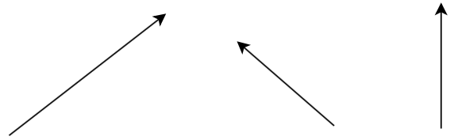
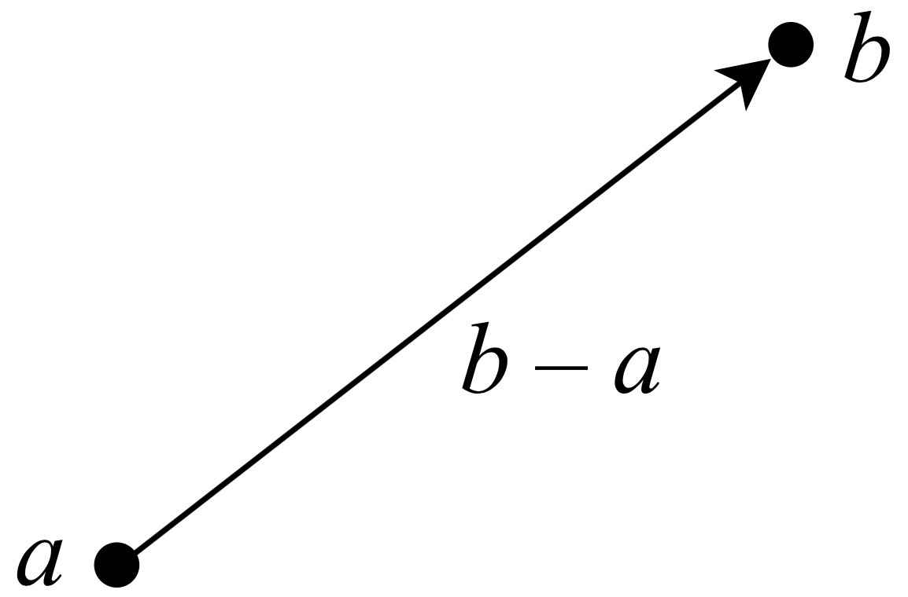
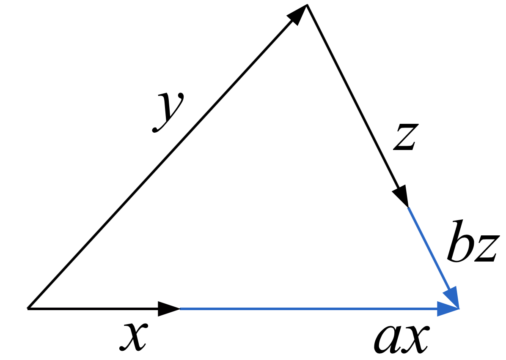

.. include:: rst-include

.. _línuleg-algebra:             
             
=================
 Línuleg algebra
=================

Línuleg algebra er undirgrein stærðfræði sem fjallar um vigra og fylki, vigurrúm,
línulegar jöfnur og jöfnuhneppi, t.d. :math:`5x + 3y = 13, x - y = 1`, og línuleg
föll (eða línulegar varpanir), t.d. :math:`f(x,y) = 2x + 3y`.
Meðal fleiri grunnhugtaka línulegrar algebru sem hér verða kynnt eru línulega
háð og óháð mengi vigra, grunnar, norm, horn milli vigra, auk þess sem fjallað verður um
ýmsa hagnýtingu línulegrar algebru. Oft tengist þessi hagnýting því að
vigrar og fylki eru notuð til að vinna með eða tákna gögn (*data*) af ýmsu tagi.

Í nýlegri kennslubók um línulega algebru er fjallað um fjölbreytt
notkunarsvið, svo sem leikjafræði, skógrækt, tölvugrafík, sneiðmyndatöku,
dulmálsfræði, erfðafræði, stofnstærðarspár, líkön af heyrn, netleit og andlitskennsl.

Þessi kafli byrjar á að rifja upp efni sem fjallað var um með `töflufyrirlestri
<http://cs.hi.is/strei/linalg-1.pdf>`_ (sjá líka *Námsefni--Töflumyndir* í Canvas),
með stærðfræðilegri skilgreiningu á vigrum og fylkjum ásamt helstu aðgerðum sem
beita má á þessa hluti.

.. _vigrar-og-fylki:

Vigrar og fylki
---------------

.. _skilgreining_vigurs:

Skilgreining vigurs
~~~~~~~~~~~~~~~~~~~

**Vigur** (*vector*) er runa af endanlega mörgum tölum sem notuð er sem ein heild
og oft gefið nafn sem er lítill bókstafur (t.d. :math:`a`, :math:`b`...). Vigur
með tölunum 1, 2 og 4 er ritaður:

.. math::
   (1,2,4)\,\text{ eða }\,[1,2,4]\,\text{ eða }\,\begin{pmatrix}1\\2\\4\end{pmatrix}.

Fjöldi talna í vigri er kölluð **vídd** (*dimension*, eða *size*) vigursins og
tölurnar í honum eru kallaðar **stök** hans (*elements*) eða **hnit**
(*coordinates*). Stakið í :math:`i`-ta sæti í vigri :math:`a` er táknað
:math:`a_i`. Vigur með :math:`n` stök er oft kallaður :math:`n`-vigur, og
mengi allra :math:`n`-vigra er táknað :math:`\Bbb{R}^n`. Ef :math:`a \in
\Bbb{R}^n` gildir sem sé

.. math::
   a = (a_1, a_2, \ldots, a_n)

.. attention:: Þegar hugtakið **vídd** er notað um tölvufræðilegt fylki (*array*),
   eins og rætt var í grein :numref:`um-orðið-fylki` merkir það fjölda vísa
   (*indices*) sem notaðir eru til að vísa í einstök stök (vigrar eru þannig
   einvíð fylki), en þegar hugtakið er notað um vigur (hvort sem er í tölvufræði
   eða stærðfræði) merkir það fjölda staka í honum. Í tölvufræði er reyndar
   algengt að nota **lengd** (*length*) um fjölda staka í lista eða vigri, en af
   því að það er líka notað um rúmfræðilega lengd vigurs höldum við okkur við
   orðið vídd.
   
.. note::
   Í NumPy er fyrsta stak vigurs númerað 0, þannig að um vigur a með n
   stök gildir |br| |sp| ``a = np.array([a[0], a[1], ..., a[n-1]])``
   
Í fyrrnefndum `töflufyrirlestri <http://cs.hi.is/strei/linalg-1.pdf>`_ má finna
nokkur dæmi um notkun vigra, meðal annars til að tákna ýmis gögn.

Skilgreining fylkis
~~~~~~~~~~~~~~~~~~~

**Fylki** (*matrix*) er tafla með tölum sem notuð er sem ein heild og oft
gefið nafn sem er stór bókstafur (t.d. :math:`A`, :math:`B`...). Taflan er
ýmist sett innan sviga eða hornklofa:

.. math::
   A = \begin{pmatrix}1 & 2 & 3\\6 & 7 & 8\end{pmatrix} =
   \begin{bmatrix}1 & 2 & 3\\6 & 7 & 8\end{bmatrix}\qquad
   B = \begin{pmatrix}5 & -1 \\ -1 & 6\end{pmatrix}
   
Fylki hafa tiltekinn fjölda af **línum** (eða **röðum**) og (**dálkum**) (*rows* og
*columns*) og fylki með :math:`m` línum og :math:`n` dálkum er sagt hafa **stærð**
(*size*) :math:`m \times n`: Fylkið :math:`A` að ofan er :math:`2 \times 3`
fylki (lesið 2 sinnum 3 fylki, eða á ensku *2 by 3* matrix). Fylki
með jafnmargar línur og dálka (t.d. fylkið :math:`B`) er kallað **ferningsfylki**.

Einstakar tölur í fylki eru kölluð **stök** og staðsetning þeirra er **sæti**
(*position*), þannig að talan 8 í fylkinu :math:`A` er sögð vera í sæti
:math:`(2,3)` (línan kemur á undan dálkinum). Stak í línu :math:`i` og dálki
:math:`j` í fylki :math:`A` er táknað :math:`a_{ij}`; fyrir :math:`A`-ið að ofan
gildir :math:`a_{23} = 8`.

.. note::
   Um fylki í NumPy var fjallað í grein :numref:`fylkjareikn`. Þar var
   meðal annars útskýrt hvernig hægt er að búa til fylki og ná í einstök stök.
   Fylkið A að ofan væri búið til með :code:`A = np.array([[1,2,3],[6,7,8]])` og
   stakið :math:`a_{23}` fengist með :code:`A[1,2]` (munum að Python byrjar
   tölusetningu í 0).

.. Sýnidæmi
.. important::
      (1) Birgðastöðu af vörum mætti tákna með fylki, t.d. gætum við látið
          :math:`b_{ij}` tákna birgðir af vöru :math:`i` á degi :math:`j`; þá væri
          :math:`B` birgðafylki.
         
      (2) Blóðþrýsting :math:`n` einstaklinga mætti tákna með :math:`n \times 2`
          fylki :math:`P`, þar sem fyrri dálkurinn gefur slagþrýsting
          (*systolic*) og sá seinni aðfallsþrýsing (*diastolic*).

.. Æfing
.. hint::
   Blóðþrýstingur þriggja einstaklinga mældist 120/80, 140/90 og 105/65.
   
   a. Hvert er blóðþrýstingsfylkið :math:`P`?
      
   b. Hver er stærð þess?
      
   c. Hvað er :math:`p_{22}`?
      
   d. Í hvaða sæti er 80?

Einfaldar vigur- og fylkjaaðgerðir
~~~~~~~~~~~~~~~~~~~~~~~~~~~~~~~~~~

Vigra er hægt að leggja saman og draga hvern frá öðrum og einnig má margfalda
vigur með tölu. Þetta er gert með því að beita tilsvarandi aðgerðum á einstök
stök. Ef :math:`x` og :math:`y` eru vigrar og :math:`c` er tala þá gildir:

.. math::
   u &= x + y\text{ er vigur með }u_i = x_i + y_i\\
   v &= x - y\text{ er vigur með }v_i = x_i - y_i\\
   w &= cx\text{ er vigur með }w_i = cx_i\text{ í }i\text{-ta sæti}

Á sama hátt má leggja saman og draga frá fylki og margfalda þau með tölu: Ef
:math:`A` og :math:`B` eru fylki og :math:`c` er tala þá gildir:

.. math::
   U &= A + B\text{ er fylki með }u_{ij} = a_{ij} + b_{ij}\\
   V &= A - B\text{ er fylki með }v_{ij} = a_{ij} - b_{ij}\\
   W &= cA\text{ er fylki með }w_{ij} = ca_{ij}

Þetta er nánar útskýrt í fyrrnefndum `töflufyrirlestri
<http://cs.hi.is/strei/linalg-1.pdf>`_ þar sem líka eru gefin þrjú dæmi um
samlagningu vigra, sér í lagi vigra sem tákna færslur í rúmi.

.. _vigur-og-fylkjaaðgerðir:

Reglur um vigur- og fylkjaaðgerðir
~~~~~~~~~~~~~~~~~~~~~~~~~~~~~~~~~~

Um samlagningu og frádrátt vigra og fylkja gilda víxlregla og tengiregla
einnig gildir dreifiregla um margföldun með tölu. Ef 
:math:`x`, :math:`y` og :math:`z` eru vigrar, :math:`A`, :math:`B` og :math:`C`
eru fylki og :math:`\alpha` er tala þá gildir:

.. math::
   x + y &= y + x\\
   A + B &= B + A\\
   \alpha(x + y) &= \alpha x + \alpha y\\
   \alpha(A + B) &= \alpha A + \alpha B\\
   x + (y + z) &= (x + y) + z\\
   A + (B + C) &= (A + B) + C\\

og í stað :math:`+` má setja :math:`-` í dreifireglunum:

.. math::
   \alpha(x - y) &= \alpha x - \alpha y\\
   \alpha(A - B) &= \alpha A - \alpha B\\

.. _innfeldi:

Innfeldi
~~~~~~~~

**Innfeldi** eða **skalarmargfeldi** (*inner product*, *dot product*)
tveggja :math:`n`-vigra :math:`x` og :math:`y` er skilgreint sem

.. math::
   x \cdot y = x_1 y_1 + \ldots + x_n y_n = \sum_{i=1}^n x_i y_i

Ef :math:`x = (3,2)` og :math:`y = (4,5)` fæst sem sé :math:`x \cdot y = 3 \cdot
4 + 2 \cdot 5 = 22`.

    **REGLA.** |sp| Ef :math:`x` og :math:`y` eru rúmvigrar þá gildir:

    .. math::
       &x \cdot y = 0 \text{ þá og því aðeins að } x \text{ sé hornréttur á } y\\
       &x \cdot y > 0 \text{ þá og því aðeins að hornið á milli } x \text{ og } y
       \text{ sé hvasst }

                    
   Innfeldi vigra og horn milli þeirra
      
.. Sýnidæmi
.. important::
   (1) Lát

       .. math::
          v_i &= \text{vægi námskeiðs } i = \frac{\text{ECTS-einingar
          námskeiðs } i}{\text{heildareiningar}} \\
          e_i &= \text{einkunn í námskeiði } i
          
       Þá er vegin meðaleinkunn allra námskeiða gefin með innfeldinu :math:`v
       \cdot e`
       
   (2) Lát
       
       .. math::          
          s_i &= \text{söluverð á einingu af vöru } i\\ 
          m_i &= \text{selt magn af vöru } i

       Þá er heildarsöluverð gefið með innfeldinu :math:`s \cdot m`

.. Æfing
.. hint::
   Einkunnir Jóns haustið 2019 voru sem hér segir

   .. list-table::
      :widths: auto
         
      * - Námskeið
        - Ein.
        - Einkunn          
                   
      * - Hagnýt stærðfræðigreining
        - 8
        - 6.5

      * - Tölvunarfræði 1
        - 6
        - 9.0

      * - Stærðfræðimynstur
        - 8
        - 7.0

      * - Vefforritun
        - 8
        - 8.0

   a. Ákvarðið vægisvigur :math:`v` og einkunnarvigur :math:`e`
   b. Notið innfeldi til að finna meðaleinkunn Jóns
          
Um innfeldi gilda víxlregla, tengiregla fyrir margfeldi með tölu og dreifiregla:

.. math::
   x\cdot y &= y\cdot x \\
   a(x\cdot y) &= ax\cdot y \\
   x\cdot(y \pm z) &= x\cdot y \pm x\cdot z

hér eru :math:`x`, :math:`y` og :math:`z` vigrar og :math:`a` er tala.

.. note::
   
   Um reikning innfeldis með NumPy var talað í grein :numref:`innfeldi-python`,
   og útskýrt að það er hægt að reikna með virkjanum :code:`@`, fallinu :code:`np.dot` eða
   aðferðinni :code:`dot`.
       
.. _bylting:

Hornalína fylkis og bylting
~~~~~~~~~~~~~~~~~~~~~~~~~~~

**Hornalína** (*diagonal*) fylkis liggur frá horninu efst t.v. og niður á ská til
hægri. Þannig inniheldur hornalína fylkisins

.. math::
   \begin{pmatrix}1 & 2 & 3\\4 & 5 & 6\\7 & 8 & 9\end{pmatrix}

stökin 1, 5 og 9. Svokölluð **bylting** (*transpose*) fylkis fæst með því að spegla
því um hornalínuna (þá speglast :math:`a_{ij}` í :math:`a_{ji}`, línur speglast
í dálka og öfugt). Bylting fylkis :math:`A` er táknuð með :math:`A^\text{T}`, lesið "A
bylt":

.. math::
   \begin{pmatrix}1 & 2 \\ 3 & 4\end{pmatrix}^\text{T} = \begin{pmatrix}1 & 3 \\ 2 & 4\end{pmatrix}

.. note::
   Í NumPy fæst hornalína fylkis A með :code:`np.diag(A)` og bylta fylkið með :code:`A.T`.

Sérstök fylki
~~~~~~~~~~~~~

Ýmsis fylki með stök sem uppfylla sérstök skilyrði hafa fengið sérstök nöfn. 

   - **Hornalínufylki** (*diagonal matrix*) hefur öll stök utan hornalínunnar núll.
   - **Efra þríhyrningsfylki** (*upper triangular matrix*) hefur öll stök neðan hornalínu núll.
   - **Neðra þríhyrningsfylki** (*lower triangular matrix*) hefur öll stök ofan hornalínu núll.
   - **Núllfylki** (*zero matrix*) hefur öll stök núll.
   - **Samhverft fylki** (*symmetric matrix*) er fylki :math:`A` með :math:`a_{ij} = a_{ji}` fyrir öll :math:`i` og :math:`j`, með öðrum orðum er :math:`A = A^\text{T}`.

.. math::
   \begin{gathered}
   \begin{pmatrix}\text{x} & & \\ & \text{x} & \\ & & \text{x} \end{pmatrix} \qquad
   \begin{pmatrix}
   \text{x} & \text{x} & \text {x} \\
            & \text{x} & \text {x} \\
            &          & \text {x}
   \end{pmatrix} \qquad
   \begin{pmatrix}
   \text {x} & & \\
   \text {x} & \text {x} & \\
   \text{x} & \text {x} & \text {x}
   \end{pmatrix} \\[0.1cm]
   \text{Hornalínufylki, efra og neðra þríhyrningsfylki (núllin eru sýnd með eyðum)} \\[0.5cm]
   \begin{pmatrix} 0 & 0 & 0 \\ 0 & 0 & 0 \\ 0 & 0 & 0 \end{pmatrix} \qquad
   \begin{pmatrix} 1 & 5 & 10 \\ 5 & 2 & 7 \\ 10 & 7 & 3
   \end{pmatrix} \\[0.1cm]
   \text{Núllfylki og samhverft fylki}
   \end{gathered}
   
.. _fylki-sinnum-vigur:

Margföldun fylkis og vigurs
~~~~~~~~~~~~~~~~~~~~~~~~~~~

Ef :math:`A` er :math:`m \times n` fylki og :math:`x` er :math:`n`-vigur
þá er margfeldi :math:`A` og :math:`x`, táknað :math:`Ax` eða :math:`A \cdot
x`, :math:`m`-vigur með :math:`i`-ta stak jafnt og innfeldi :math:`i`-tu línu
:math:`A` og :math:`x`. Nánar tiltekið gildir að

.. math::
   \text{ef}\;y = Ax\;\text{þá er}\;y_i = \sum_{j=1}^n a_{ij}x_j\;\:(i=1,...,m)

.. Sýnidæmi
.. important::
   Margfeldi fylkisins :math:`\,A = \begin{pmatrix}1 & 2 & 3\\4 & 5 &
   6\end{pmatrix}\,` og vigursins :math:`\,x = (3, 1, -2)\,` er

   .. math::
      Ax = \begin{pmatrix}
      1\cdot 3 + 2\cdot 1 - 3\cdot 2\\
      4\cdot 3 + 5\cdot 1 - 6\cdot 2\end{pmatrix} =
      \begin{pmatrix}
      3 + 2 - 6\\
      12 + 5 - 12
      \end{pmatrix} =
      \begin{pmatrix}
      -1\\
      5
      \end{pmatrix}

.. attention:: Stundum er gerður greinarmunur á dálkvigri (*column vector*) og
   línuvigri (*row vector*), t.d. :math:`\begin{pmatrix}1\\2\end{pmatrix}` og
   :math:`(1, 2)`. Þegar :math:`x` og :math:`y` eru báðir dálkvigrar þá er
   innfeldið :math:`x \cdot y` stundum táknað með :math:`x^\text{T}y`. Þá er
   nefnilega :math:`x^\text{T}` línuvigur og ef við lítum á hann sem :math:`1 \times n`
   fylki þá er margfeldi þess og vigursins :math:`y` einmitt jafnt og innfeldið
   :math:`x\cdot y`.

Um margfeldi fylkja og vigra gilda dreifireglurnar

.. math::
   &A(x + y) = Ax + Ay\;\:\text{og}\\
   &(A + B)x = Ax + Bx

þar sem :math:`A` og :math:`B` eru fylki og :math:`x` og :math:`y` vigrar. Hér má setja :math:`-` í stað :math:`+`.

.. note::
   Ef A er NumPy fylki og x er NumPy vigur þá fæst b = margfeldi A og x með :code:`b
   = A @ x`.  

.. Æfing
.. hint::
   Gefnir eru vigrarnir :math:`a = (2, 0, 3)`, :math:`b = (1, -1, 2)` og :math:`c
   = (1, 2, 3)` og fylkin

   .. math::
      A = \begin{pmatrix}1 & 2\\3 & 3\\1 & 4\end{pmatrix}\;\text{og}\;
      B = \begin{pmatrix}2 & 3 & 0\\1 & 2 & 3\end{pmatrix}

   Reiknið: |br| 
   a) :math:`a + b + c =` |br| 
   b) :math:`3a - 2b =` |br| 
   c) :math:`a\cdot b =` |br| 
   d) :math:`Bc =` |br| 
   e) :math:`A^\text{T}a =` |br| 
   f) :math:`2A + B^\text{T}`

(þessi æfing var reiknuð í fyrirlestri 29. janúar 2020 og lausn á henni
má finna `hér <http://cs.hi.is/strei/æfing-vigrar-lausn.pdf>`_

.. _línuleg-föll-og-innfeldi:

Línuleg föll og innfeldi
------------------------

Í síðasta kafla var talað um tvívíð föll, sem eru föll frá planinu
:math:`\Bbb{R}^2` yfir í rauntölurnar :math:`\Bbb{R}`. Margvíð föll eru svo föll
frá :math:`n`-víðu rúmi :math:`\Bbb{R}^n` yfir í rauntölurnar :math:`\Bbb{R}`.
Varpmengið getur líka verið margvítt rúm. Ef það er :math:`m`-vítt getum við
ritað

.. math:: f:\Bbb{R}^n \to \Bbb{R}^m.

Þegar varpmengið er margvítt er oft
talað um :math:`f` sem vörpun – hugtökin fall og vörpun (*function* og
*map*) eru í raun samheiti, en það er algengt er að nota orðið **fall** þegar
varpmengið er :math:`\Bbb{R}` en **vörpun** ef það er :math:`\Bbb{R}^m`.

Síðar í kaflanum verður fjallað um hugtakið **línuleg vörpun** (*linear map*) sem
er ákveðin tegund af vörpun sem varðveitir samlagningu og margföldun með tölu,
og við munum komast að því að slíkar varpanir eru nátengdar fylkjum og margföldun með þeim.

Til að einfalda málið einskorðum við okkur til að byrja með við línuleg föll,
sem varpa vigrum í tölur. Þessari skorðu verður svo aflétt í grein
:numref:`línulegar-varpanir`.

.. _skilgreining-línulegs-falls:

Skilgreining á línulegu falli
~~~~~~~~~~~~~~~~~~~~~~~~~~~~~

   **SKILGREINING.** |sp| Fall :math:`f: \Bbb{R}^n \to \Bbb{R}` nefnist
   **línulegt** ef það uppfyllir:

   .. math::
      &f(x + y) = f(x) + f(y)\;\;\text{fyrir öll}\;x,y \in \Bbb{R}^n\;\;\text{og}\\
      &f(ax) = af(x)\;\;\text{fyrir öll}\;a \in \Bbb{R}\;\text{og}\; x\in\Bbb{R}^n
   
Það skiptir sem sé ekki máli hvort við leggjum saman vigra áður en við beitum
fallinu, eða hvort við leggjum saman útkomurnar úr fallinu, og sama á við um
margföldun með tölu.

.. Sýnidæmi
.. important::
   Fallið :math:`f:\Bbb{R}^2 \to \Bbb{R}` sem skilgreint er með :math:`f(x) =
   x_1 + 2x_2` er línulegt. Þetta má sjá með eftirfarandi útreikningum:

      Lát :math:`x` og :math:`y` vera tvívíða vigra og :math:`z = x + y`. Þá
      fæst
      
      .. math::
         &f(x + y) = f(z) = z_1 + 2z_2 = (x_1 + y_1) + 2(x_2 + y_2)\;\text{og}\\
         &f(x) + f(y) = x_1 + 2x_2 + y_1 + 2y_2 = x_1 + y_1 + 2(x_2 + y_2)

      svo fyrra skilyrði skilgreiningarinnar er uppfyllt. Ennfremur fæst með
      :math:`u = ax`:

      .. math::
         f(ax) = f(u) = u_1 + 2u_2 = ax_1 + 2ax_2 = a(x_1 + 2x_2) = af(x)

      svo seinna skilyrðið er líka uppfyllt.

   Fallið :math:`f:\Bbb{R}^2 \to \Bbb{R}` sem sendir :math:`x` í :math:`x\cdot
   x` (innifeldi :math:`x` með sjálfu sér) er hinsvegar ekki línulegt. Við
   sjáum til dæmis að ef :math:`x = (1,0)` þá er :math:`f(2x) = (2,0) \cdot
   (2,0) = 4` en :math:`2f(x) = 2\cdot (1,0)\cdot(1,0) = 2` svo seinna
   skilyrðið er ekki uppfyllt.

.. Æfing
.. hint::
   Hver eftirfarandi falla eru línuleg? Rökstyðjið svörin stuttlega ef þið
   getið.

   a) :math:`f(x) = \text{fyrsta stak } x`
   b) :math:`f(x) = \text{meðaltal staka }x`
   c) :math:`f(x) = \text{stærsta stak }x`
   d) :math:`f(x) = \text{summa staka }x`
   e) :math:`f(x) = x_2 - x_1`
   f) :math:`f(x) = 0` fyrir öll :math:`x`
   g) :math:`f(x) = 1` fyrir öll :math:`x`

   *Dæmi um stuttan rökstuðning:* |br|
   a. **Línulegt**, því að :math:`f(x+y)` =
   fyrsta stak :math:`(x + y)` =
   :math:`x_1 + y_1` =
   :math:`f(x) + f(y)`, og
   :math:`f(ax)` =
   fyrsta stak :math:`ax` =
   :math:`ax_1 = af(x)`

.. _reglur-um-línuleg-föll:
   
Reglur um línuleg föll
~~~~~~~~~~~~~~~~~~~~~~

Um línuleg föll gilda ýmsar reglur, sem við látum duga að setja fram, en
sönnum ekki.

   **REGLA.** |sp| Ef :math:`f` er línulegt, :math:`a_1, a_2, \ldots, a_k` eru
   tölur og :math:`x_1, x_2, \ldots, x_k` eru vigrar, þá gildir:

   .. math::
      f(a_1 x_1 + \ldots + a_k x_k) = a_1f(x_1) + \ldots + a_kf(x_k)

Skilyrðin í skilgreiningunni á línulegu falli, þar sem lagðir voru saman
tveir vigrar, má sem sé útvíka í summu af fleiri vigrum, og sömuleiðis er
hægt að sameina skilyrðin tvö í eitt skilyrði þar sem bæði er lagt saman og
margfaldað með tölu.

   **REGLA.** |sp| Ef :math:`c` er gefinn :math:`n`-vigur og :math:`f` er fall sem
   skilgreint er með :math:`f(x) = c\cdot x` þá er :math:`f` línulegt fall.

   **REGLA.** |sp| Ef :math:`f` er línulegt fall, :math:`f:\Bbb{R}^n \to \Bbb{R}`
   þá er til :math:`n`-vigur :math:`c` þannig að :math:`f(x) = c\cdot x` fyrir
   öll :math:`x`. Þetta er kallað **innfeldisframsetning** fallsins :math:`f`.

Innfeldi við fastan vigur gefur sem sé línulegt fall, og öll línuleg
föll eru af þessu tagi.

.. Sýnidæmi
.. important::
   Línulega fallið í dæminu aftast í grein :numref:`skilgreining-línulegs-falls`,
   :math:`f(x) = x_1 + 2x_2`, hefur innfeldisframsetningu :math:`f(x) = (1,2) \cdot x`.

.. Æfing
.. hint::
   Hver er innfeldisframsetning fallsins :math:`f(x) = 3x_3 - 2x_2 - x_1`?
         
.. Sýnidæmi
.. important::
   **Sig brúar.** Mörg föll sem koma við sögu í raunvísindum og verkfræði má
   nálga með línulegum föllum. Hér skoðum við eitt slíkt dæmi. Á
   brú verka kraftar :math:`w_1, w_2` og :math:`w_3` (þyngdir bíla í tonnum) á þremur
   gefnum stöðum. Þeir valda því að brúinn sígur um :math:`s` millimetra í
   miðjunni. Samband :math:`s` og :math:`w` er gefið með línulegu falli:

   .. math::
      s = c_1 w_1 + c_2 w_2 + c_3 w_3

   Með aðferðum burðarþolsfræði er hægt að ákvarða stuðlana :math:`c_i` útfrá
   nákvæmum upplýsingum um hönnun brúarinnar, en það er líka hægt
   að setja bíl af gefinni þyngd á staðina þrjá og mæla :math:`s`
   fyrir hvern stað og ákvarða þannig :math:`c_i`.

   Brú sígur þegar bílar keyra yfir hana

.. Æfing
.. hint::
   a) Tveggja tonna bíll á stöðunum þremur sem merktir eru með :math:`w_1`,
      :math:`w_2` og :math:`w_3` á myndinni að ofan veldur sigi sem er 0.24 mm,
      0.31 mm og 0.26 mm. Ákvarðið stuðana :math:`c_i, i=1,2,3`
   b) Nú eru þrír bílar settir á staðina, 1.5 tonn, 0.8 tonn og 1.2
      tonn. Hve mikið sígur brúin í miðjunni?

.. _taylor-nálgun:      

Taylor-nálgun
-------------

Stigull af margvíðu falli
~~~~~~~~~~~~~~~~~~~~~~~~~

Rifjum upp úr grein :numref:`margvidir-stiglar` að stigull af :math:`n`-víðu falli :math:`f` er skilgreindur með:

.. math::
   \nabla f(x) =
   \begin{pmatrix}
   \dfrac{\partial f(x)}{\partial x_1}\\
   \vdots\\
   \dfrac{\partial f(x)}{\partial x_n}
   \end{pmatrix}

Hér táknar :math:`\dfrac{\partial f(x)}{\partial x_i}` hlutafleiðuna af :math:`f`
með tilliti til :math:`x_i` (:math:`i`-ta staks :math:`x`). Stundum er
hlutafleiða :math:`f` í :math:`x` m.t.t. :math:`x_i` táknuð með :math:`f_i(x)`.
Ef :math:`x` vigur settur saman úr talnabreytum t.d. :math:`x = (u, v, w)` eru
hlutafleiðurnar líka stundum ritaðar með því að láta breytu vera lágvísi, t.d.
:math:`f_u`, í stað :math:`\dfrac{\partial f}{\partial u}`. Enn einn
rithátturinn fyrir afleiðu :math:`f` m.t.t. :math:`x` er :math:`D_x f(x,...)`.

.. Sýnidæmi
.. important::
   Lát

   .. math::
      f(x,y,z) = xy^3 + (2x^2 - z)^2

   Þá er

   .. math::
      \nabla f(x,y,z) =
      \begin{pmatrix}
      y^3 + 2(2x^2 - z) 4x\\
      3xy^2 + 0\\
      0 + 2(2x^2 - z)(-1)
      \end{pmatrix} = 
      \begin{pmatrix}
      y^3 + 8x(2x^2 - z)\\
      3xy^2\\
      -4x^2 + 2z
      \end{pmatrix}

.. Æfing
.. hint::
   a) Finnið :math:`f'(x)`, :math:`g'(x)` og :math:`h'(x)` ef:

      .. math::
         f(x) &= 2x^3 + 5 \\
         g(x) &= 2ax^3 + b \\
         h(x) &= \frac{(2x-1)^3}{3}

   b) Lát
      
      .. math::
         f(x,y,z) = xyz + x^2y^2 - (z-x)^2
         
      Ákvarðið :math:`\nabla f(x,y,z)`
      
   c) Lát :math:`f(x) = \dfrac{\sin x_1}{x_2}`. Ákvarðið :math:`\nabla f(x)`
      
   d) Finnið :math:`D_z \dfrac{\exp(xyz)}{xyz}` (munið að :math:`D\dfrac{u}{v} =
      \dfrac{u'v-v'u}{v^2}`)

.. _taylor:
      
Setning Taylors í einni og fleiri víddum
~~~~~~~~~~~~~~~~~~~~~~~~~~~~~~~~~~~~~~~~

Ef :math:`f` er eitthvert gefið fall þá er ein leið til að nálga það með
línulegu falli sú að nota setningu Taylors. Einvíðu útgáfuna af
henni þekkja margir nemendur, en fyrir nálgun með beinni línu hljóðar hún svona:

Ef :math:`a` er gefin tala og :math:`f` er diffranlegt fall þá gildir fyrir
:math:`x` nálægt :math:`a` að

.. math::
   f(x) \approx f(a) + f'(a)(x-a) \;\;\; \text{(einvíð Taylor-setning)}

Ef :math:`f` er margvítt fall, :math:`f: \Bbb{R}^n \to \Bbb{R}`, og :math:`x` er
vigur nálægt vigrinum :math:`a` þá má líka nálga :math:`f(x)` línulega, en nú
kemur stigull í stað afleiðu, og innfeldi í stað margföldunar:

.. math::
   f(x) \approx f(a) + \nabla f(a) \cdot (x-a) \;\;\; \text{(margvíð Taylor-setning)}

Fallið :math:`\hat{f}(x) = f(a) + \nabla f(a) \cdot (x-a)` er nefnt
**Taylor-nálgun** við :math:`f` í :math:`a`.

   Einvítt fall og línuleg Taylor-nálgun þess í :math:`a`

Athugið að þegar :math:`f` er einvítt
fall þá er Taylor-nálgunin jafna beinnar línu sem snertir ferilinn sem táknar
graf fallsins í :math:`(a,f(a))` (sbr. :numref:`taylor-lína`), og að
þegar :math:`f` er tvívítt þá er hún jafna plans sem snertir yfirborðið sem
táknar graf fallsins í :math:`(a,f(a))` (:numref:`snertiplan`).

   Flötur (graf tvíðvíðs falls) og snertiplan við hann.

.. Sýnidæmi
.. important::

   Látum :math:`f(x) = x_1 + \exp(x_2 - x_1)` og skoðum línulega Taylor-nálgun
   þess í :math:`a = (1,2)`. Við fáum:

   .. math::
      f(a) = a_1 + \exp(a_2 - a_1) = 1 + \exp(1) = 3.718

   ef reiknað er með þremur aukastöfum. Diffrun gefur svo:

   .. math::
      \nabla f(x)
      &=
      \begin{pmatrix}
      1 - \exp(x_2 - x_1)\\
      \exp(x_2 - x_1)
      \end{pmatrix} \\
      &= (1 - \exp(1), \exp(1)) \\
      &= (-1.718, 2,718)

   Ef þetta er sett inn í margvíðu Taylor-setninguna fæst:

   .. math::
      \hat{f}(x) &= f(a) + \nabla f(a) \cdot (x - a) \\
      \hat{f}(a) &= 3.718 + (-1.718, 2.718) \cdot (x_1 - 1, x_2 - 2) \\
                 &= 3.718 - 1.718(x_1 - 1) + 2.718(x_2 - 2) \\
                 &= -1.718x_1 + 2.718x_2
                 
   Eftirfarandi tafla sýnir :math:`f(x)` og :math:`\hat{f}(x)` fyrir nokkur
   gildi á :math:`x` í grennd við :math:`a`
      
        .. list-table::
           :header-rows: 1
           :widths: auto

           * - :math:`x`
             - :math:`f(x)`
             - :math:`\hat{f}(x)`

           * - :math:`(1,2)`
             - 3.7183
             - 3.7183

           * - :math:`(0.96, 1.98)`
             - 3.7332
             - 3.7326

           * - :math:`(0.85, 2.05)`
             - 4.17
             - 4.11

           * - :math:`(1.25, 1.41)`
             - 4.44
             - 4.40

   Við sjáum að nálgunin er bara ágæt.

.. Æfing
.. hint::
   a. Ákvarðið :math:`\hat{f}(x)`, línulega Taylor-nálgun fallsins :math:`f(x) = 2\ln(x)+1`,
      í punktinum :math:`a=1`. Gerið töflu yfir :math:`f(x)` og
      :math:`\hat{f}(x)` fyrir :math:`x = 1, 1.1` og :math:`1.2`

   b. Finnið línulega Taylor-nálgun við tvívíða fallið
      :math:`f(x) = x_1^2 + x_1 x_2 + x_2^2` í punktinum :math:`a = (1,2)`. Ákvarðið gildi
      :math:`f(x)` og nálgunarinnar í punktinum :math:`x = (1.1, 2.1)`.

   c. Finnið Taylor-nálgun við þrívíða fallið :math:`f(x,y,z) = xyz + x`
      í punktinum :math:`(1,1,0)` [þetta er æfing í því tilviki að viðfang þrívíðs falls
      sé ritað sem vigur :math:`(x,y,z)`].

Norm, fjarlægðir og horn
------------------------

Í þessum kafla verður fjallað um norm, sem er mælikvarði á 
stærð vigurs, og skyld hugtök, fjarlægðir og horn milli vigra.

Skilgreining norms
~~~~~~~~~~~~~~~~~~

Eins og áður hefur verið bent á er hægt að túlka tvívíða og þrívíða vigra sem
færslu í plani eða rúmi, eða ör sem hefur stefnu og lengd.

   Tvívíðir vigrar sýndir sem örvar (eða færslur)

Það liggur beint við að leggja mælikvarða á stærð slíkra vigra með því að mæla
lengd þeirra í rúminu. Þessa lengd má líka reikna með Pýþagórasarreglu útfrá
hnitum vigranna og þá fæst:

.. math::
   \text{Lengd } x = \sqrt{x_1^2 + x_2^2}

Fyrir vigra í þrívíðu rúmi er hægt að beita Pýþagórasarreglu tvisvar til
að reikna lengdina og fá:

.. math::
   \text{Lengd } x = \sqrt{x_1^2 + x_2^2 + x_3^2}

Nú liggur beint við hvernig hægt er að útvíkka þessar formúlur fyrir almenna
:math:`n`-víða vigra. Hugtakið sem fæst er nefnt **Evklíðskt norm** (*Euclidean
norm*) eða 2-norm, og táknað með :math:`\|x\|`, eða stundum :math:`\|x\|_2` til
að aðgreina það frá öðrum aðferðum til að skilgreina norm sem verða reyndar ekki
á dagskrá hér:

    **SKILGREINING** Evklíðskt **norm** af :math:`n`-vigri :math:`x` er

    .. math::
       \|x\| = \sqrt{x_1^2 + \ldots + x_n^2}

Normið er kennt við gríska stærðfræðingnn Evklíð sem skrifaði mikil verk og
sannaði margar setningar um rúmfræði.

.. note:: Í NumPy má reikna norm vigurs :code:`x` með fallinu :code:`norm`
   í pakkanum :code:`numpy.linalg`, sem sé t.d. :code:`import numpy.linalg as
   la` og svo :code:`la.norm(x)`.

.. attention:: Í `Stærfræðiorðasafninu <http://stæ.is/os>`_ er *norm* þýtt með
   *staðall* eða *lengd*, en í þessum fyrirlestrarnótum er aðeins slakað
   á hreintungustefnunni.

.. Æfing
.. hint::
   a. Reiknið :math:`\|(3, 4)\|`      
   b. Reiknið :math:`\|(2, -4, -5, 6)\|`
   c. Sýnið að fyrir öll horn :math:`\theta` gildir að :math:`\|(\sin \theta,
      \cos\theta)\| = 1`

Reglur um norm
~~~~~~~~~~~~~~

Hægt er að leiða út fjölmargar reglur um norm, en hér verða örfáar látnar
duga. Í eftirfarandi reglum eru :math:`x` og :math:`y` einhverjir
:math:`n`-vigrar og :math:`\alpha` einhver rauntala:

.. math::
   &\|\alpha x\| = |\alpha|\cdot \|x\| \\
   &\|x + y\| \leq \|x\| + \|y\| \text{ (þríhyrningsójafnan)} \\ 
   &\|x\| \geq 0 \\
   &\|x\| = 0 \text{ þ.þ.a.a } x = 0

(þ.þ.a.a. er skammstöfun á "þá og því aðeins að").

.. Æfing
.. hint::
   a. Sannið fyrstu regluna.
   b. Sannið þríhyrningsójöfnuna fyrir tvívíða vigra með því að teikna
      viðeigandi þríhyrning, og notfæra ykkur að stysta leið
      milli tveggja punkta er bein lína.

Fjarlægðir
~~~~~~~~~~

Ef :math:`a` og :math:`b` eru tveir punktar í plani eða þrívíðu rúmi þá er vigur
frá :math:`a` til :math:`b` gefinn með :math:`b - a`:

og þessvegna er fjarlægðin milli :math:`a` og :math:`b` gefin með
:math:`\|b-a\|`, eða :math:`\|a-b\|` sem er jafngilt. Því liggur beint við
að skilgreina fjarlægð milli almennra vigra á sama hátt.

    **SKILGREINING.** |sp| Ef :math:`a` og :math:`b` eru :math:`n`-vigrar þá er
    **fjarlægðin** milli :math:`a` og :math:`b` gefin með:

    .. math:: \|a-b\|

Ekki er erfitt að sjá að ef lítill munur er á tilsvarandi stökum tveggja vigra
þá verður fjarlægðin á milli þeirra lítil tala.

.. Sýnidæmi
.. important::
   Fjarlægðin á milli vigranna :math:`x = (2,3,5,5)` og :math:`y = (1,1,1,-5)` er  

   .. math::
      \|x-y\| &= \|(1,2,4,10)\| \\
      &= \sqrt{1^2 + 2^2 + 4^2 + 10^2}
      &= \sqrt{121}
      &= 11

Fjarlægðir milli vigra koma við sögu í ýmsum verkefnum í reiknifræði, og ýmsum
reikniritum, t.d. hinu velþekkta *k-means* reikniriti sem fjallað verður um
síðar í þessum fyrirlestrarnótum, og sömuleiðis í verkefnum í máltækni t.d. í
samanburði tveggja texta, eins og sýnt verður í næstu grein.

.. _orðtíðni:

Orðtíðni og fjarlægð milli vigra
~~~~~~~~~~~~~~~~~~~~~~~~~~~~~~~~

Orðtíðnivigur fyrir skjal (eða vefsíðu) er gerður þannig að hvert orð
í skjalinu er fært yfir á staðalsnið (t.d. nefnifall eintölu fyrir
nafnorð), orðunum er raðað í stafrófsröð, og svo er talið hve oft hvert
orð kemur fyrir. Oft er algengum orðum (t.d. og, er, á, í) sleppt og líka
sjaldgæfum. Tökum sem dæmi vísupartinn:

    Ástin er eins og sinueldur. |br|
    Ástin er segulstál. |br|
    Af litlum neista verður oft mikið bál. |br|
    Ástin er eins og hvítigaldur, |br|
    gagntekur líkama’ og sál.

Orðtíðnirit fyrir hana gæti verið:

   .. list-table::
      :widths: auto
      :name: orðtíðnitafla
         
      * - ást
        - 3
        - 0.30
                   
      * - bál
        - 1
        - 0.10

      * - eins
        - 2
        - 0.20

      * - líkami
        - 1
        - 0.10

      * - lítill
        - 1
        - 0.10

      * - mikið
        - 1
        - 0.10

      * - neisti
        - 1
        - 0.10

og miðdálkurinn gefur orðtíðnivigur. Ef bera á saman tvö eða fleiri skjöl er
búinn til sameiginlegur orðalisti fyrir þau öll áður en orðin eru talin, og ef
skjölin eru mislöng þá er sennilega betra að reikna orðtíðnina hlutfallslega,
eins og í aftasta dálkinum í töflunni að ofan. Tvö skjöl sem fjalla um sama eða
svipuð efni eru líklegri til að hafa stutt á milli orðtíðnivigra sinna heldur en
skjöl um ólík efni.

.. Sýnidæmi
.. important::
   Búnir voru til orðtíðnivigrar fyrir þrjár greinar á Wikipediu, um
   Óskarsverðlaunin, Golden-globe-verðlaunin, og ofurskálina, og fjarlægðirnar
   á milli þeirra reiknaðar. Niðurstaðan var:

   .. list-table::
      :widths: auto
         
      * - 
        - Óskarsverðlaun
        - Golden-globe
        - Ofurskál
                   
      * - Óskarsverðlaun
        - 0
        - 0.11
        - 0.17
                   
      * - Golden-globe
        - 0.11
        - 0
        - 0.18

      * - Ofurskál
        - 0.17
        - 0.18
        - 0

   Hér sést að fjarlægðin milli greinanna um verðlaunin er minni en fjarlægðin frá
   þeim yfir í ofurskálargreinina.

.. _horn-milli-vigra:   
   
Horn milli vigra
~~~~~~~~~~~~~~~~

Í tvívíðu og þrívíðu rúmi er hægt að reikna horn milli tveggja vigra
rúmfræðilega útfrá innfeldi og normum vigranna. Formúlan sem
hægt er að sanna fyrir :math:`n = 2` og :math:`n = 3`, er sú sem gefin er
í eftirfarandi skilgreininingu, sem útvíkkar sem sé hugtakið horn þegar
:math:`n > 3`:

    **SKILGREINING.** |sp| Ef :math:`x` og :math:`y` eru :math:`n`-vigrar þá er
    **hornið** milli þeirra gefið með

    .. math::
       \theta = \arccos \frac{x \cdot y}{\|x\|\, \|y\|}

Í framhaldi af þessari skilgreiningu liggur sú næsta beint við (sbr. líka grein
:numref:`innfeldi`):

    **SKILGREINING.** |sp| Vigrarnir :math:`x` og :math:`y` eru sagðir
    **hornréttir** (*perpendicular*) hvor á annan, ritað :math:`x \perp y`, ef
    hornið á milli þeirra er 90°, þ.e.a.s. ef :math:`x \cdot y` = 0.

**Horn og líkindi með vigrum**. Í staðinn fyrir að mæla fjarlægð milli
orðtíðnivigra er hægt að nota hornið á milli þeirra til að meta líkindi með
tveimur skjölum eða vefsíðum.

.. Sýnidæmi
.. important::
   Í eftirfarandi töflu hafa hornin milli
   orðtíðnivigra Wikipedíuskjalanna sem voru rædd í grein :numref:`orðtíðni` verið
   reiknuð.

   .. list-table::
      :widths: auto
         
      * - 
        - Óskarsverðlaun
        - Golden-globe
        - Ofurskál
                   
      * - Óskarsverðlaun
        - –
        - 59°
        - 87°
                   
      * - Golden-globe
        - 59°
        - –
        - 86°

      * - Ofurskál
        - 87°
        - 86°
        - –

   Við sjáum að eins og í grein :numref:`orðtíðni` eru verðlaunagreinarnar mun nær
   hvor annarri en ofurskálargreininni samkvæmt hornmælikvarðanum. Öfugt við
   fjarlægðarkvarðann þá er óþarfi að reikna hlutfallslega orðtíðni því sömu horn
   fást með því að nota orðtíðnina beint (t.d. miðdálkinn í (fyrri) töflunni
   í grein :numref:`orðtíðni`).

.. Æfing
.. hint::
   a. Reiknið hornið á milli vigranna :math:`(4,3)` og :math:`(1,0)`.
   
   b. Notið regluna um kósínus af mismun,

      .. math::
         \cos(a - b) = \cos a\cos b + \sin a \sin b

      til að sýna að skilgreiningin á horni milli :math:`x` og :math:`y` að framan
      gefur rúmfræðilega hornið þegar vigrarnir eru tvívíðir.

          **Leiðbeining:** *Hornið á milli vigranna er mismunur stefnuhorna
          þeirra. Í pólhnitum verða hnit* :math:`x` *og* :math:`y`:

          .. math::
             x_1 &= r\cos a \qquad y_1 &= R \cos b\\
             x_2 &= r \sin a \qquad y_2 &= R \sin b

          *þar sem* :math:`r = \|x\|`, :math:`R = \|y\|`, :math:`a = {}`
          *stefnuhorn* :math:`x` *og* :math:`b = {}` *stefnuhorn* :math:`y`.

Tölfræðileg föll af vigrum
--------------------------
   
Meðaltal, dreifni og staðalfrávik
~~~~~~~~~~~~~~~~~~~~~~~~~~~~~~~~~

Meðaltal (*mean* eða *average*), dreifni (*variance*) og staðalfrávik (*standard deviation*). eru hugtök í tölfræði sem eru samt nátengd vigrum og línulegri algebru.

    **SKILGREINING.** |sp| **Meðaltal** :math:`n`-vigurs :math:`x` er gefið með
    
    .. math::
       \newcommand{\Var}{\operatorname{Var}}\newcommand{\std}{\operatorname{std}}
       \overline{x} = \frac{1}{n}\sum_{i=1}^n x_i

    **SKILGREINING.** |sp| **Dreifni** :math:`n`-vigurs :math:`x` er gefin með
    
    .. math::
       \Var{x} = \frac{1}{n}\sum_{i=1}^n (x_i - \overline{x})^2

    **SKILGREINING.** |sp| **Staðaðfrávik** :math:`n`-vigurs :math:`x` er gefið með
    
    .. math::
       \std{x} = \sqrt{\Var{x}} = \sqrt{\frac{1}{n}\sum_{i=1}^n (x_i -
       \overline{x})^2}

Dreifni og staðalfrávik eru mælikvarði á það hve langt frá meðaltalinu einstök
stök vigursins eru að jafnaði. Í staðinn fyrir að leggja saman önnur veldi af
fráviki frá meðaltali væri mögulegt að leggja í saðinn saman tölugildi
frávikanna, :math:`\frac{1}{n}\sum_{i=1}^n |x_i - \overline{x}|`, en ýmsar
ástæður, bæði tölfræðilegar og reiknitæknilegar, mæla gegn því.

.. attention::
   Í tölfræði er algengt að skilgreina dreifni gagnasafns með formúlu þar sem
   deilt er með :math:`n-1` en ekki :math:`n`:

   .. math::
      \textrm{Dreifni gagnasafns} = \frac{1}{n-1}\sum_{i=1}^n (x_i - \overline{x})^2

   (og tilsvarandi fyrir staðalfrávik). Þá verður dreifnin óbjöguð (*unbiased*) eins
   og það er kallað. Í línulegri algebru er (líklega) algengara að deila með :math:`n`.

**Reglur um staðalfrávik.** Ef :math:`x` er :math:`n`-vigur og :math:`a` er rauntala þá gilda eftirfarandi
reglur um staðalfrávik:

.. math::
   &{\bf 1.}\;\,\text{Ef } y_i = x_i + a \text{ fyrir öll } i \text{ þá er } \std(y) =
   \std(x)\\
   &{\bf 2.}\;\std(ax) = |a|\std(x)

Það breytir sem sagt ekki staðalfráviki að leggja fasta við öll stök
vigurs, og ef vigur er margfaldaður með tölu, þá margfaldast staðalfrávikið með
tölugildinu af tölunni.

.. note::
   Með NumPy má reikna meðaltal, dreifni og staðalfrávik :code:`x` með
   :code:`np.mean(x)`, :code:`np.var(x)` og :code:`np.std(x)`, eða með
   :code:`x.mean()`, :code:`x.var()` og :code:`x.std()`.

Stöðlun
~~~~~~~

Stundum hentar að staðla (*standardize*) gögn, en þá er meðaltal þeirra dregið
frá og deilt með staðalfrávikinu, og þannig fæst útgáfa af gögnunum sem hefur
meðaltal 0 og staðalfrávik 1. Stöðluð útgáfa vigurs :math:`x` er stundum gefið
nafnið :math:`z` og/eða kölluð **z-stig** (*z-score*), sérstaklega ef :math:`x` er
vigur af normaldreifðum gögnum.

    **SKILGREINING.** |sp| **Stöðlun** (*standardization*) vigurs :math:`x` hefur
    :math:`i`-ta stak

   .. math::
      z_i = \frac{x_i - \overline{x}}{\std(x)}

Hægt er að hugsa sér að :math:`z_i` mæli hve mörgum staðalfrávikum fyrir ofan
eða neðan meðaltalið :math:`x_i` er. Skylt þessu er þegar búnir eru til
mælikvarðar með meðaltal og staðalfrávik sem eru rúnnaðar tölur, t.d.
greindarvísitala sem skv. skilgreiningu hefur meðaltal 100 og staðalfrávik 15.
         
.. Æfing
.. hint::
   a. Ákvarðið meðaltal, dreifni og staðalfrávik vigursins
      :math:`x = (0, 2, 3, 4, 6)`

   b. Ákvarðið í framhaldi staðlaða útgáfu af :math:`x`
   
   c. Notið a-lið og reglur um staðalfrávik til að reikna staðalfrávik vigranna
      :math:`y = (2,4,5,6,8)` og :math:`z = -3x`

Fylgni
~~~~~~

Fylgnistuðull eða fylgni (*correlation (coefficient)*) er líka tölfræðilegt
hugtak tengt línulegri algebru og vigrum. Reyndar eru til nokkrar leiðir til að
reikna fylgni, en sú langalgengasta er að nota fylgnistuðul Pearsons og það er
gert hér. Um hann má lesa nánar t.d. á
`Wikipedíu <https://en.wikipedia.org/wiki/Pearson_correlation_coefficient//>`_.
Fylgni mælir samband tveggja vigra, hann er á bilinu :math:`[-1,1]` og hann er
:math:`-1` eða :math:`1` ef skatterplot af vigrunum liggur á beinni línu, og
:math:`0` ef jafna bestu línu fyrir slíkt plot er lárétt.

    **SKILGREINING.** |sp| **Fylgnistuðull** tveggja :math:`n`-vigra :math:`x` og
    :math:`y` er gefinn með:

    .. math:: r_{xy} = \frac{\sum_{i=1}^n (x_i - \overline{x})(y_i -
       \overline{y})}{\std(x) \std(y)}

.. note::
   Til að reikna fylgni í Python má nota tölfræðipakkann í Scipy, t.d.:

   .. code:: python
      
      import scipy.stats as st
      x = np.array([1, 2, 3])
      y = np.array([2, 3, 4])
      r,p = st.pearsonr(x,y)

   Hér skilar :code:`r` fylgnistuðlinum, og :code:`p` marktæknistigi hans eða
   :math:`p`-gildi, sem í grófum dráttum eru líkurnar á að fá fylgni sem er
   :math:`r` eða meiri að tölugildi fyrir tilviljun, ef vigrarnir tveir væru
   slembivigrar úr óháðum normaldreifingum.

.. hint::
   Eftirfarandi forritsbútur skilgreinir fall til að búa til tvo vigra sem hafa fylgni
   u.þ.b. r. Afritið forritsbútinn yfir í Júpíter og keyrið hann.

   .. code:: python
      
      import numpy as np, matplotlib.pyplot as plt, numpy.random as rnd
      np.set_printoptions(precision=2, floatmode='fixed', suppress=True)

      def tvinormal(r,n):
          """skilar tveimur n-vigrum með meðaltal 0, dreifni 1, 
             og fylgni r (um það bil)"""
          mu = np.array([0,0])
          Sig = np.array([[1,r],[r,1]])
          (x,y) = rnd.multivariate_normal(mu,Sig,n).T
          return x,y

   a. Bætið við skipunum sem búa til tvo tíu staka vigra með fylgni u.þ.b. 0.9
      og reikna og prenta út raunverulega fylgni þeirra. Prentið líka út vigrana
      hlið við hlið (notið :code:`np._c[]` sbr. grein
      :numref:`teikning-punktasafns`). Keyrið nokkrum sinnum. Prófið líka
      100-staka vigra. Takið eftir að ef :code:`x[i]` er stórt þá er
      :code:`y[i]` oftast stórt líka og öfugt.

   b. Búið líka til reit til að búa til 500-staka vigra með fylgni u.þ.b. 0.9 og
      teiknið þá með :code:`plt.scatter` (sbr. grein :numref:`einfaldar-myndir` og
      töflu :numref:`scatterstýring`; hæfilegt er að nota punktastærð 3).
      Endurtakið fyrir nokkur mismunandi gildi á r (t.d. -0.99, 0, 0.4, 0.99).

Grunnar og línulega háðir og óháðir vigrar
------------------------------------------

.. _línulega-háðir:

Línulega háðir vigrar
~~~~~~~~~~~~~~~~~~~~~

    **SKILGREINING.** |sp| Ef :math:`x_1`,..., :math:`x_k` eru vigrar og
    :math:`c_1`,..., :math:`c_k` eru tölur þá er vigurinn
          
    .. math::
       y = c_1 x_1 + \ldots + c_k x_k
       
    kallaður **línuleg samantekt** (*linear combination*) af vigrunum
    :math:`x_1`,..., :math:`x_k`

Mengi allra línulegra samantekta af vigrum :math:`x_1`,..., :math:`x_k`
er sagt vera **spannað** (*spanned*) af vigrunum.

.. Sýnidæmi
.. important::
   Ef :math:`u = (1,1,0)` og :math:`v = (0,0,1)` þá er :math:`y = 3u + 2v`
   línuleg samantekt af :math:`u` og :math:`v`. Mengið sem :math:`u` og
   :math:`v` spanna er lóðrétta planið í gegn um línuna :math:`y = x`.
   Þetta mengi má rita:

   .. math::
      \{w \in \Bbb{R}^3 |\; w = au + bv \text{ fyrir einhver } a,b \in \Bbb{R}\}

   Hér er mynd sem sýnir þessa vigra og tilheyrandi spannplan:

   .. figure:: myndir/plotspan.png
      :width: 11cm
      :align: center

Skilgreinum nú línulega háða (*linearly dependent*) vigra.
              
   **SKILGREINING.** |sp| Vigrar :math:`x_1`,..., :math:`x_k` eru sagðir **línulega
   háðir** ef hægt er að rita einhvern þeirra sem línulega samantekt af hinum,
   þ.e.a.s. ef fyrir eitthvert :math:`j` eru til tölur :math:`c_i` þannig að:

   .. math::
      x_j = \sum_{i=1\\i \neq j}^k c_i x_i

Rauðu vigrarnir þrír á myndinni í sýnidæminu hér á undan eru sem sé línulega
háðir, því :math:`3u + 2v` er línuleg samantekt af :math:`u` og :math:`v`. Það
er ekki mjög erfitt að sjá að þrír vigrar í þrívíðu rúmi sem allir liggja í sama
plani hljóta að vera línulega háðir. Um tvo samsíða vigra (sem liggja þar með á
sömu línu), hvort sem er í tvívíðu eða þrívíðu rúmi, gildir að þeir eru línulega
háðir.

Ef :math:`A` er mengi af vigrum er talað um að það sé línulega háð ef vigrarnir
í því eru línulega háðir. Stundum er skilyrðið í skilgreiningunni orðað
öðruvísi, sbr. eftirfarandi setningu.

    **SETNING.** |sp| :math:`x_1`,..., :math:`x_k` eru línulega háðir þ.þ.a.a. til
    séu tölur :math:`c_1,\ldots, c_k` sem eru ekki allar :math:`0` þannig að
    :math:`c_1 x_1 + \ldots + c_k x_k = 0`

Vigrar eru sem sé línulega háðir þ.þ.a.a. til sé línuleg samantekt af þeim sem
er núllvigurinn, með samantektarstuðlum sem eru ekki allir 0.

Eitt í viðbót sem rétt er að benda á: Ef :math:`A = \{x_1, \ldots, x_k\}` er
mengi af línulega háðum vigrum og :math:`y \notin A` þá er :math:`A \cup
\{y\}` líka línulega háð. Skv. síðustu setningu höfum við :math:`c_1 x_1 +
\ldots + c_k x_k = 0` og við summuna má svo bæta :math:`0y`, og hún er ennþá
jöfn :math:`0`.

.. _línulega-óháðir:

Línulega óháðir vigrar
~~~~~~~~~~~~~~~~~~~~~~     

   **SKILGREINING.** |sp| Vigrar :math:`x_1`,..., :math:`x_k` eru sagðir **línulega
   óháðir** (*lindearly independent*) ef þeir eru ekki línulega háðir.

Skv. setningunni að framan gildir sem sé að ef eina leiðin til að búa til
línulega samantekt af vigrum sem er núll er sú að velja alla samantektarstuðlana
sama sem núll þá eru vigrarnir línulega óháðir, en annars ekki.
Þetta gefur okkur aðferð til að sanna að mengi vigra sé línulega óháð:
Við byrjum á að rita:

    .. math::
       c_1 x_1 + \ldots + c_k x_k = 0

og sýnum að það leiði til :math:`c_1 = c_2 = \ldots = c_k = 0`

.. Sýnidæmi
.. important::
   Sýnum að :math:`u=(1,2,3)`, :math:`v=(1,0,3)` og :math:`w=(0,1,1)` séu
   línulega óháðir. Gerum ráð fyrir að :math:`c_1u + c_2v + c_3w = 0` sem sé

   .. math::
      c_1\begin{pmatrix}1\\2\\3\end{pmatrix} + 
      c_2\begin{pmatrix}1\\0\\3\end{pmatrix} + 
      c_3\begin{pmatrix}0\\1\\1\end{pmatrix} =
      \begin{pmatrix}0\\0\\0\end{pmatrix}

   Þetta gefur

   .. math::
      &(1)\quad c_1 + c_2 = 0,\\
      &(2)\quad 2c_1 + c_3 = 0 \text{ og}\\
      &(3)\quad 3c_1 + 3c_2 + c_3 = 0.

   Af :math:`(3) - 3\cdot(1)` fæst :math:`c_3=0`, svo :math:`(2)` gefur
   :math:`c_1=0` sem með :math:`(1)` gefur að lokum :math:`c_2=0`. Þetta sýnir
   að :math:`u`, :math:`v` og :math:`w` eru línulega óháðir.

Tveir vigrar eru sagðir samsíða ef annar er margfeldi af hinum, og eins og að
framan segir er par af ekki-núll vigrum línulega háð ef þeir eru samsíða, en
annars er parið línulega óháð (þetta er bein afleiðing af skilgreiningu á
línulega háðum vigrum).

.. Æfing
.. hint::
   a. Skrifið vigurinn :math:`(8,3)` sem línulega samantekt af :math:`(4,1)` og
      :math:`(0,1)`.
   b. Eru eftirfarandi pör vigra línulega óháð?
      
      .. math::
         &(1,2,3) \text{ og } (2,4,6) \\
         &(0,2,1) \text{ og } (1,4,2) \\
         &(0,-1,0) \text{ og } (0,4,0) \\
         &(1,2,3) \text{ og } (2,3,4) \\
         &(1,1,1) \text{ og } (7,7,7)

Hér er að lokum setning sem segir að ekki sé hægt að skrifa gefinn vigur sem
línulega samantekt óháðra vigra á fleiri en einn veg. Við breytum aðeins
útaf venjunni, að sleppa sönnunum, og látum sönnun á þessari fylgja.

    **SETNING.** |sp| Ef :math:`x_1`,..., :math:`x_k` eru línulega óháðir og
    
    .. math::
       y &= c_1 x_1 + \ldots + c_k x_k \\
         &= d_1 x_1 + \ldots + d_k x_k \\

    þá er :math:`c_i = d_i` fyrir öll :math:`i`.

    **SÖNNUN.** |sp| Gerum ráð fyrir að :math:`y = c_1 x_1 + \ldots + c_k x_k = d_1
    x_1 + \ldots + d_k x_k`. Það má færa alla :math:`d`-liðina fram fyrir seinna
    jafnaðarmerkið og það gefur :math:`c_1 x_1 - d_1 x_1 + \ldots + c_k x_k - d_k
    x_k = 0` þ.e.a.s. :math:`(c_1 - d_1) x_1 + \ldots + (c_k - d_k) x_k = 0`. Þar sem
    :math:`x_i`-in eru línulega óháð þýðir þetta að allir samantektarstuðlarnir
    hljóta að vera 0, sem sé :math:`c_1 - d_1 = c_2 - d_2 = \ldots = c_k - d_k =
    0` sem gefur :math:`c_i = d_i` fyrir öll :math:`i`.

Grunnar
~~~~~~~

Grunnur (*basis*, fleirtala *bases*) er grunnhugtak í línulegri algebru.

    **SKILGREINING.** |sp| **Grunnur** í :math:`n`-víðu rúmi er mengi af :math:`n`
    vigrum í rúminu, :math:`\{a_1, \ldots, a_n\}`, sem er línulega óháð.

Rúmið í skilgreiningunni getur verið :math:`\Bbb{R}^n` en það getur líka verið
svokallað hlutrúm, t.d. bein lína í gegn um :math:`(0,0)` í :math:`\Bbb{R}^2`
(sem er einvítt hlutrúm, :math:`n=1`) eða plan í gegn um :math:`(0,0,0)` í
:math:`\Bbb{R}^3`, eins og t.d. planið á myndinni í grein
:numref:`línulega-háðir` (tvívítt hlutrúm, :math:`n=2`).

Áður en við útskýrum mikilvægi hugtaksins grunnur setjum við fram
setningu um hámarksstærð línulega óháðra mengja, nefnilega:

    **SETNING.** |sp| Ef :math:`a_1, a_2, \ldots, a_k` eru línulega óháðir vigrar
    :math:`n`-víðu rúmi þá er :math:`k \leq n`.

Línulega óháð mengi :math:`n`-vigra hefur sem sé í mesta lagi :math:`n` stök.
Setningin er bein afleiðing af velþekktri setningu í línulegri algebru sem
nefnist *mynd- og núllvíddarsetningin* (*rank-nullity theorem*), en það er líka
hægt að sanna hana beint með þrepun á :math:`n`, sem samt verður ekki gert hér.

Setningin segir til dæmis að þrír vigrar í plani hljóti að vera línulega háðir,
og sömuleiðis fjórir vigrar þrívíðu rúmi. Eftirfarandi mynd sýnir þrjá vigra í
:math:`\Bbb{R}^2`, :math:`x`, :math:`y` og :math:`z`, engir tveir samsíða.

      
Á myndinni sést hvernig hægt er að skrifa einn þeirra (nefnilega :math:`y`) sem línulega samantekt af
hinum tveimur, svo vigrarnir þrír eru línulega háðir. Byrjað er á að teikna
:math:`x` og :math:`z` út frá endunum á :math:`y` og svo eru þeir framlengdir
þar til þeir skerast. Það gildir greinilega að :math:`ax = y + bz` svo :math:`y
= ax - bz`. Ef einhverjir tveir vigranna væru samsíða þá væru þeir, og þar með
allir þrír, línulega háðir.

Snúum okkur á aftur að grunnum, og einni aðalsetningunni um þá, sem segir að
hægt sé að skrifa hvern vektor á einkvæman hátt sem línulega
samantekt af grunnvigrum. Sönnunin er auðveld og við látum hana fylgja.

    **SETNING.** |sp| Sérhvern vigur :math:`b` í :math:`n`-víðu rúmi má rita sem
    línulega samantekt af grunni :math:`a_1, \ldots, a_n` fyrir rúmið á
    nákvæmlega einn veg.

    **SÖNNUN.** |sp| Skv. síðustu setningu er mengið :math:`\{a_1, \ldots, a_n, b\}`
    línulega háð svo til eru tölur :math:`c_i` og :math:`c` sem eru ekki allar
    núll, þannig að

    .. math::               
       c_1 a_1 + \ldots + c_n a_n + c b = 0

    :math:`c` getur ekki verið :math:`0` því þá væru einhver af :math:`c_i`-unum
    ekki 0 og með því væri komin línuleg samantekt af :math:`a_i`-unum sem er 0
    með samantektarstuðlum sem eru ekki allir 0, í mótsögn við að :math:`a_i`-in
    séu grunnur. Því má deila í gegn um jöfnuna með :math:`c` og það gefur:
    
    .. math::
       b = -\frac{c_1}{c}a_1 - \ldots - \frac{c_n}{c}a_n

    sem er línulega samantektin sem átti að búa til. Skv. setningunni aftast í
    grein :numref:`línulega-óháðir` eru engar fleiri leiðir til að rita
    þessa samantekt.

Þegar vigur :math:`b` er skrifaður sem línuleg samantekt af grunnvigrum,

.. math::
   b = c_1 a_1 + \ldots + c_n a_n

er talað um **liðun** :math:`b` eða að :math:`b` hafi verið **liðaður**
með grunnvigrunum.

.. Sýnidæmi
.. important::
   :math:`G = \{(1,1), (1,0)\}` er línulega óháð og þar með grunnur fyrir
   :math:`\Bbb{R}^2` því að ef

   .. math::
      c_1 \begin{pmatrix} 1\\1 \end{pmatrix} +
      c_2 \begin{pmatrix} 1\\0 \end{pmatrix} = 
      \begin{pmatrix} 0\\0 \end{pmatrix}

   þá er :math:`c_1 + c_2 = 0` og :math:`c_1 = 0` sem gefur :math:`c_1 = c_2 = 0`.
   Liðum nú tvo vigra með :math:`G` og notum smávegis mismunandi rithátt:

   a) :math:`\begin{pmatrix} 3\\2 \end{pmatrix} =
      c_1\begin{pmatrix} 1\\1 \end{pmatrix} +
      c_2\begin{pmatrix} 1\\0 \end{pmatrix}`
      gefur :math:`3 = c_1 + c_2` og :math:`2 = c_1`, þ.e.a.s. :math:`c_1 = 2` og
      :math:`c_2 = 1`.

   b) :math:`(-3,5) = \alpha(1,1) + \beta(1,0)` gefur :math:`\alpha = 5` og
      :math:`\beta = -8`, sem sé :math:`(-3,5) = 5(1,1) - 8(1,0)`.

.. Æfing
.. hint::
   a. Liðið :math:`(5,4)` með grunnvigrunum :math:`(1,2)` og :math:`(2,1)`.
   b. Mynda vigrarnir :math:`(1,0,0)`, :math:`(0,1,0)` og
      :math:`(1,1,0)` grunn fyrir :math:`\Bbb{R}^3`? Rökstyðjið svarið.
   c. Hvað með :math:`(1,1,0)` og :math:`(1,2,0)`?
   d. En :math:`(1,0,0)`, :math:`(1,1,0)` og :math:`(1,1,1)`?

Venjulegir einingavigrar og grunnar þeirra
~~~~~~~~~~~~~~~~~~~~~~~~~~~~~~~~~~~~~~~~~~

Vigur með lengdina 1 er kallaður **einingavigur** (*unit vector*). Í planinu
:math:`\Bbb{R}^2` eru vigrarnir :math:`(1,0)` og :math:`(0,1)`, sem stefna út
eftir :math:`x`-ás og :math:`y`-ás kallaðir **venjulegu einingavigrarnir**
(*standard unit vectors*) eða bara einingavigrarnir ef ekki er hætta á
misskilningi. Algengt er að tákna þessa vigra með :math:`e_1` og :math:`e_2` og
það verður gert hér (sjá :numref:`ein-vigrar` hér rétt fyrir neðan). Eftirfarandi skilgreining
útvíkkar þetta svo yfir í :math:`n`-vítt rúm.

    **SKILGREINING.** |sp| Vigur í :math:`\Bbb{R}^n` með :math:`i`-ta stak jafnt
    og :math:`1` og öll hin stökin :math:`0` er kallaður **(venjulegur)
    einingavigur** og táknaður :math:`e_i`.

    **DÆMI.** |sp| Einingavigrarnir í :math:`\Bbb{R}^3` eru :math:`e_1 =
    (1,0,0)`, :math:`e_2 = (0,1,0)` og :math:`e_3 = (0,0,1)`.

Í :math:`\Bbb{R}^n` eru :math:`n` einingavigrar og það er ekki erfittð sanna
að þeir mynda grunn, :math:`G = \{e_1, \ldots, e_n\}` sem er kallaður **venjulegi
einingagrunnurinn** eða bara **einingagrunnurinn**. Það er sérstaklega auðvelt að
liða vigur með einingagrunnvigrunum. Ef :math:`x = (x_1, x_2, \ldots, x_n) \in
\Bbb{R}^n` þá gildir nefnilega:

.. math::
   x &= \begin{pmatrix} x_1 \\ x_2 \\ \vdots \\ x_n \end{pmatrix} =
        x_1 \begin{pmatrix} 1 \\ 0 \\ \vdots \\ 0 \end{pmatrix} +
        x_2 \begin{pmatrix} 0 \\ 1 \\ 0 \\ \vdots \\ 0 \end{pmatrix} +
        \ldots +
        x_n \begin{pmatrix} 0 \\ \vdots \\ 0 \\ 1 \end{pmatrix} \\
     &= x_1 e_1 + x_2 e_2 + \ldots + x_n e_n

                    
   Venjulegu einingavigrarnir í :math:`\Bbb{R}^2` og liðun :math:`u = (2,3)` með þeim

.. Æfing
.. hint::
   a. Hver er venjulegi einingagrunnurinn fyrir :math:`\Bbb{R}^4`?
   b. Liðið :math:`(3,5,-1,2)` með honum.

Þverstaðlaðir grunnar
~~~~~~~~~~~~~~~~~~~~~

Ef allir vigrar grunns eru hornréttir hver á annan er grunnurinn kallaður
**hornréttur** (*orthogonal*). Venjulegi einingagrunnurinn er hornréttur, og auk
þess eru allir vigrar hans með einingalengd því augljóslega gildir
:math:`\|e_i\| = 1` fyrir öll :math:`i`. Fleiri grunnar hafa þann eiginleika að
vera hornréttir og með vigra af einingalengd.

    **SKILGREINING.** |sp| Grunnur :math:`\{a_1, \ldots, a_n \}` sem uppfyllir
    :math:`a_i \perp a_j` fyrir öll :math:`i \neq j` og :math:`\|a_i\| = 1`
    fyrir öll :math:`i` er kallaður **þverstaðlaður** (*orthonormal*) (stundum
    er notað orðið **einingaréttur**).

.. figure:: myndir/ein.réttir-vigrar.png
   :width: 10cm
   :name: ein.réttir-vigrar
   :align: center

   Þverstaðlaður grunnur fyrir :math:`\Bbb{R}^2` og vigur sem hægt er
   að liða með honum. 
                    
Almennt er ekki auðvelt að finna liðun vigurs með tilteknum grunni, en í
síðustu grein sáum við að fyrir venjulega einingagrunninn er það
fyrirhafnarlaust. Með þverstöðluðum grunnum er það líka fremur einfalt
eins og eftirfarandi regla sýnir:

    **REGLA.** |sp| Ef :math:`\{a_1, \ldots, a_n\}` er
    þverstaðlaður grunnur og :math:`u` er :math:`n`-vigur þá gildir

    .. math::
       u = (a_1 \cdot u)a_1 + \ldots + (a_n \cdot u)a_n

Það er sem sé hægt að liða :math:`u` með grunnvigrunum :math:`a_1, \ldots, a_n` með
liðunarstuðlum sem gefnir eru með innfeldi þeirra og :math:`u`.

.. Sýnidæmi
.. important::
   Liðum vigurinn :math:`u = (2,3)` á :numref:`ein.réttir-vigrar` með
   :math:`a_1 = (\frac{\sqrt{3}}{2}, \frac{1}{2})` og
   :math:`a_2 = (-\frac{1}{2}, \frac{\sqrt{3}}{2})`.
   Við reiknum

   .. math::
      c_1 &= a_1 \cdot u = \frac{\sqrt{3}}{2} \cdot 2 + \frac{1}{2} \cdot 3 =
      \sqrt{3} + \frac{3}{2} \approx 3.232 \\
      c_2 &= a_2 \cdot u = -\frac{1}{2}\cdot 2 + \frac{\sqrt{3}}{2} \cdot 3
      = -1 + \frac{3}{2}\sqrt{3} \approx 1.598

   og þá gildir sem sé :math:`u = c_1 a_1 + c_2 a_2 \approx 3.232 a_1 + 1.598 a_2`

.. Æfing
.. hint::
   a. Sýnið að vigrarnir :math:`a_1` og :math:`a_2` á
      :numref:`ein.réttir-vigrar` séu þverstaðlaður grunnur. Það þarf að sanna
      þrennt: (i) Að þeir séu grunnur, (ii) að þeir hafi einingalengd, og (iii)
      að þeir séu innbyrðis hornréttir.
   b. Sýnið að vigrarnir :math:`a_1 = (0.6, 0.8, 0)`, :math:`a_2 = (-0.8, 0.6,
      0)` og :math:`a_3 = (0, 0, 1)` gefi þverstaðlaðan grunn fyrir
      :math:`\Bbb{R}^3`.
   c. Liðið vigurinn :math:`(1,2,3)` með vigrunum í b-lið.

Reglan hér á undan gildir líka um þverstaðlaða vigra sem ekki spanna allt rúmið
í örlítið breyttri mynd.

    **REGLA.** |sp| Ef :math:`a_1, \ldots, a_k` eru þverstaðlaðir
    :math:`n`-vigrar með :math:`k < n` og :math:`u` er gefinn :math:`n`-vigur
    þá er hægt að skrifa :math:`u` sem línulega samantekt af :math:`a_1,\ldots,
    a_k` þ.þ.a.a.

    .. math::
       (*)\qquad\qquad u = (a_1 \cdot u)a_1 + \ldots + (a_k \cdot u)a_k
       \qquad\qquad{ }

Þessi regla gefur okkur sem sé aðferð til að kanna hvort tiltekinn vigur sé í
rúminu sem gefnir þverstaðlaðir vigrar spanna. Við tökum eftir að *þá*-hluti
setningarinnar er augljós, sem sé að ef :math:`(*)` gildir þá sé :math:`u`
línuleg samantekt af :math:`a_i`-unum, en hin áttin (*því-aðeins*\ -parturinn)
mundi þurfa smá sönnun.

.. Sýnidæmi
.. important::
   Vigrarnir :math:`a = (0.48, 0.64, 0.60)` og :math:`b = (0.8, -0.6, 0)` eru
   þverstaðlaðir (*Æfing: Sýnið það*) og skilgreina plan í :math:`\Bbb{R}^3`:

   .. math::
      P = \{x = s a + t b \, \| \, s,t \in \Bbb{R} \}

   a. Könnum hvort punkturinn :math:`A = (4, 2, 3)` sé í planinu með síðustu
      reglu. Við reiknum :math:`c_1 = A\cdot a = 4\cdot 0.48 + 2\cdot 0.64 + 3
      \cdot 0.6 = 5` og :math:`c_2 = A\cdot b = 4\cdot 0.8 - 2\cdot 0.6 = 2` og í
      framhaldi :math:`5a + 2b = (2.4, 3.2, 3) + (1.6, -1.2, 0) = (4, 2, 3)`.
      Þar sem útkoman er :math:`A` er niðurstaðan sú að :math:`A` er í planinu.
   b. Könnum með sama hætti punktinn :math:`B = (6, 3, 2)`. Við reiknum
      :math:`c_1 = 6`, :math:`c_2 = 3` og :math:`6a + 3b = (5.28, 2.04, 3.6)`.
      Útkoman er ekki :math:`B` svo :math:`B` er ekki í planinu.

Þverstaðlaðir grunnar eru náskyldir svonefndum hornréttum fylkjum og QR-þáttun,
sem vonandi kemst á dagskrá síðar í þessum fyrirlestranótum. Slík þáttun nýtist
í fjölbreyttum verkefnum í reiknifræði, t.d. lausn línulegra jöfnuhneppa
(*solution of linear equations*), minnstu kvaðrata verkefnum (*ordinary least
squares problems*), eigingildisverkefnum (*eigenvalue problems*), kvaðratískri
bestun (*quadratic programming*), en lausn slíkra reiknifræðilegu verkefna
nýtist aftur í fjölbreyttum verkefnum í gagnavísindum, verkfræði og
raunvísindum.

Lausn jöfnuhneppa
-----------------

.. _fylkjaframsetning:

Fylkjaframsetning línulegra jöfnuhneppa
~~~~~~~~~~~~~~~~~~~~~~~~~~~~~~~~~~~~~~~

Ein mikilvæg hagnýting fylkja er að leysa saman margar jöfnur í mörgum línulegum
jöfnum. Ef jöfnurnar eru jafn margar og óþekktu stærðirnar er yfirleitt til
nákæmlega ein lausn. 

.. Sýnidæmi
.. important::
   Leysum jöfnurnar:

   .. math::
      2 x_1 + 3 x_2 &= 8 \\
      5 x_1 - 2 x_2 &= 1

   Við margföldum fyrri jöfnuna með :math:`2` og þá seinni með :math:`3` og leggjum
   saman (til að losna við :math:`x_2`) og fáum :math:`19x_1 = 19` svo
   :math:`x_1=1`. Seinni jafnan gefur svo :math:`2x_2 = 5x_1 - 1 = 4` svo
   :math:`x_2=2`.

Jöfnurnar í þessu sýnidæmi má líka rita með fylki og vigrum:

.. math::
   A x = b

þar sem :math:`A = \begin{pmatrix}2 & 3\\5 & -2\end{pmatrix}` og :math:`b =
\begin{pmatrix}8\\1\end{pmatrix}`, sbr. grein :numref:`fylki-sinnum-vigur`.

.. Æfing
.. hint::
   Gefnar eru jöfnurnar
   
   .. math::
      x + 2y &= z + t + 8 \\
      z – x &= 3 \\
      x + y + z + t &= 12 \\
      y + 3 &= 2x

   Ákvarðið tilsvarandi fylki :math:`A` og vigur :math:`b` þannig að þessar
   jöfnur svari til :math:`Av = b` þar sem :math:`v = (x, y, z, t)`

.. note::
   Fylkjaframsetning á jöfnuhneppi einfaldar kannski ekki mikið lausn með blaði
   og blýanti, en með NumPy verður lausnin beint af augum:

   .. code:: python

      import numpy as np, numpy.linalg as la
      A = np.array([[2, 3], [5, -2]])
      b = np.array([8, 1])
      x = la.solve(A, b)
      print(x)
      #--- prentar [1., 2.]

Það sem NumPy gerir bak við tjöldin er að umrita jöfnurnar með svipuðum hætti og
gert var í sýnidæminu hér á undan og einangra þannig óþekktu stærðirnar hverja á
fætur annari og ákvarða gildi þeirra.

.. Æfing
.. hint::
   Sigga hefur ákveðið að borða bara skyr, rúgbrauð og kæfu, en þessar
   fæðutegundir innihalda næringarefni í 100 g sem hér segir:

         .. list-table::
            :widths: auto
         
            * -
              - **Skyr**  
              - **Rúgbrauð**
              - **Kæfa**         

            * - Kolvetni
              - 3.7
              - 36
              - 2.4

            * - Prótein
              - 11
              - 8.6
              - 12.8

            * - Fita
              - 0.2
              - 6.7
              - 29.3

   Notið NumPy til að ákvarða hvað hún á að borða mikið af hverju á dag ef hún
   vill fá 100 g af kolvetnum, 150 g af próteini og 150 g af fitu úr matnum?

.. danger::
   Sigga ætti að borða eitthvað grænmeti líka.

Almennt :math:`n \times n` jöfnuhneppi má rita

.. math::
   &a_{11} x_1 + a_{12} x_2 + \ldots + a_{1n} x_n =\; &b_1 \\
   &\vdots                                            &\vdots \\
   &a_{n1} x_1 + a_{n2} x_2 + \ldots + a_{nn} x_n =\; &b_n

eða á fylkjaformi:

.. math::
   \begin{pmatrix}
   a_{11} & a_{12} & \cdots & a_{1n} \\
   \vdots &        &        & \vdots \\
   a_{n1} & a_{n2} & \cdots & a_{nn}
   \end{pmatrix}
   \begin{pmatrix} x_1 \\ \vdots \\ x_n \end{pmatrix} = 
   \begin{pmatrix} b_1 \\ \vdots \\ b_n \end{pmatrix}

Línulegar samantektir, jöfnuhneppi og tilvist lausna
~~~~~~~~~~~~~~~~~~~~~~~~~~~~~~~~~~~~~~~~~~~~~~~~~~~~
Smá umhugsun leiðir í ljós að margföldun fylkis og vigurs jafngildir því að taka
línulega samantekt af dálkum fylkisins með samantektarstuðlum sem eru
stök vigursins. Hér er talnadæmi, en reglan gildir greinilega almennt:

.. math::
   \begin{pmatrix}
   2 & 3 & 4 \\
   1 & 0 & 2
   \end{pmatrix}
   \begin{pmatrix} 5 \\ 6 \\ 7 \end{pmatrix} &=
   5 \begin{pmatrix} 2 \\ 1 \end{pmatrix} + 
   6 \begin{pmatrix} 3 \\ 0 \end{pmatrix} +
   7 \begin{pmatrix} 4 \\ 2 \end{pmatrix}\\
   &=
   \begin{pmatrix} 10 \\ 5 \end{pmatrix} +
   \begin{pmatrix} 18 \\ 0 \end{pmatrix} +
   \begin{pmatrix} 28 \\ 14 \end{pmatrix} =
   \begin{pmatrix} 56 \\ 19 \end{pmatrix}

Af þessu leiðir er það að leysa jöfnuhneppið :math:`Ax = b` jafngildir því að
finna stuðla þar sem :math:`b` er skrifað sem línuleg samantekt af dálkum
:math:`A`. Við höfum séð að þetta er hægt á nákvæmlega einn veg ef dálkar
fylkisins eru línulega óháðir og mynda grunn fyrir :math:`\Bbb{R}^n`. Ef
dálkarnir eru línulega háðir þá er oftast engin lausn, en ef hún er til þá eru
til óendanlega margar lausnir.

    **SETNING.** |SP| :math:`n \times n` jöfnuhneppi :math:`Ax = b` hefur
    nákvæmlega eina lausn þ.þ.a.a. dálkar fylkisins séu grunnur fyrir
    :math:`\Bbb{R}^n`.
   
Skoðum dæmi, nefnilega lausn á jöfnuhneppinu

.. math::
   x + 2y &= 3 \\
   2y + z &= 2 \\
   x - z &= 0

Hér er auðvelt að sjá, með því að draga jöfnu 2 frá jöfnu 1, að :math:`x - z =
1`, en hó, síðasta jafnan segir að :math:`x - z = 0` svo eitthvað verður erfitt
að leysa þetta hneppi, augljóst er að það hefur enga lausn. Fylki
jöfnuhneppisins er

.. math::
   \begin{pmatrix}
   1 & 2 & 0 \\
   0 & 2 & 1 \\
   1 & 0 & -1
   \end{pmatrix}

og fyrsti dálkurinn er hálfur miðdálkurinn mínus sá aftasti, :math:`(1, 0, 1)` =
:math:`\frac{1}{2}(2, 2, 0) - (0, 1, -1)`, svo dálkarnir eru línulega háðir. Ef
við breytum síðustu jöfnunni í :math:`x - z = 1` þá er fylkið óbreytt og nú
bregður svo við að það er til lausn, nefnilega :math:`x = 1, y = 1, z = 0`. En
það eru til fleiri lausnir, t.d. :math:`x = 2, y = \frac{1}{2}, z = 1` og :math:`x
= 3, y = 0, z = 2`, og samkvæmt setningunni að framan eru þær óendanlega margar.

Ferningsfylki með línulega háða dálka er kallað **sérstætt** (*singular*) en ef
dálkarnir eru línulega óháðir er fylkið kallað **andhverfanlegt** (*non-singular*).

.. Æfing
.. hint::
   a. Leysið jöfnuhneppið

      .. math::
         &x  + y\;+  &z\;&= 6 \\
         2&x + y  + 2&z\;&= 10 \\
         3&x + y\;+  &z\;&= 8

      með því að byrja á að draga fyrstu jöfnuna tvöfalda frá annarri jöfnunni og
      þrefalda frá þeirri þriðju.

   b. Sýnið að vigrarnir :math:`(1, 2, 3)`, :math:`(1, 1, 1)` og :math:`(3, 4, 5)`
      séu línulega háðir (með því að skrifa einn þeirra sem línulega
      samantekt af hinum tveimur).

Línulega háðir vigrar og Python
~~~~~~~~~~~~~~~~~~~~~~~~~~~~~~~

Þó að jöfnuhneppi hafi enga stærðfræðilega lausn getur það gerst að NumPy finni
lausn sem er með mjög stórum tölum, en stundum gefur það villumeldingu og segir
:code:`LinAlgError: Singular matrix`.

.. Æfing
.. hint::

   Prófið að nota NumPy til að leysa jöfnuhneppi :math:`Ax =
   \begin{pmatrix}1\\1\end{pmatrix}` með
   :math:`A = \begin{pmatrix}1&2\\5&10\end{pmatrix}` annarsvegar og
   :math:`A = \begin{pmatrix}1&2\\2&4\end{pmatrix}` hinsvegar.

Þegar NumPy þykist geta leyst jöfnu sem hefur enga lausn er það vegna tölulegrar
ónákvæmni í reikningum: NumPy reiknar ekki með óendanlega mörgum aukastöfum.

.. note::
   Til að sjá hvort fylki sé tölulega sérstætt er hægt að nota fallið
   :code:`la.matrix_rank`, en það skilar **myndvídd** (*rank*) fylkisins, sem er
   vídd rúmsins sem dálkar þess spanna, að teknu tilliti til tölulegrar óvissu.
   Ef dálkar :math:`n`-dálka fylkis eru u.þ.b. línulega háðir skilar
   :code:`matrix_rank` tölu sem er minni en :math:`n`.

.. Æfing
.. hint::
   Reiknið myndvídd fylkisins :math:`\begin{pmatrix}1&2\\5&10\end{pmatrix}` með
   NumPy. Prófið líka að reikna myndvíddina ef stakinu :code:`5` er breytt í
   :code:`5 + 1e-15`, :code:`5 + 1e-14` og :code:`5 + 1e-13`.
         
Fylkjaalgebra
-------------

Við höfum þegar séð ýmsar aðgerðir og reglur tengdar vigrum og fylkjum sem minna
á sambærilegar aðgerðir og reglur fyrir tölur: samlagningu vigra, innfeldi,
margföldun fylkis og vigurs, víxlreglur, tengireglur og dreifireglur. Umfjöllun
um aðgerðir og reglur af þessu tagi tilheyrir undirgrein stærðfræði sem kölluð
er algebra. Stundum koma við sögu hugtök eins og samlagningarandhverfa
(*additive inverse*), margföldunarandhverfa (*multiplicative inverse*), núllstak
(*null element*) og einingarstak (*identity element*). Hér verður alls ekki
reynt að skrifa nákvæma stærðfræðilega umfjöllun um fylkjaalgebru, en smávegis
skoðun á henni getur hjálpað til við að skilja fylki betur.

.. _margföldun-fylkja:

Margföldun fylkja
~~~~~~~~~~~~~~~~~

    **SKILGREINING.** |sp| **Margfeldi** :math:`m \times p` fylkis :math:`A` og
    :math:`p \times n` fylkis :math:`B` er :math:`m \times n` fylkið
    :math:`C = AB` sem hefur :math:`(i,j)`-stak

    .. math::
       c_{ij} = \sum_{k=1}^p a_{ik} b_{kj}

.. Sýnidæmi
.. important::
   Reiknum margfeldi tveggja :math:`2 \times 2` fylkja :math:`A` og :math:`B`: 

   .. math::
      \begin{pmatrix}1 & 2 \\ 3 & 4 \end{pmatrix}
      \begin{pmatrix}5 & 6 \\ 0 & -2 \end{pmatrix}

   og fáum :math:`c_{11} = 1 \cdot 5 + 2 \cdot 0 = 5`, :math:`c_{12} = 1 \cdot 6
   - 2 \cdot 2 = 2`, :math:`c_{21} = 3 \cdot 5 + 4 \cdot 0 = 15` og
   :math:`c_{22} = 3 \cdot 6 - 4 \cdot 2 = 10`, sem sé

   .. math::
      C = \begin{pmatrix}5 & 2 \\ 15 & 10 \end{pmatrix}

Skoðun á skilgreiningunni að framan sýnir að :math:`j`-ti dálkur :math:`C` fæst
með því að margfalda saman :math:`A` og :math:`j`-ta dálk :math:`B`, og
það er líka hægt að segja að :math:`c_{ij}` sé innfeldi af :math:`i`-tu línu
:math:`A` og :math:`j`-ta dálki :math:`B`.

.. Sýnidæmi
.. important::
   (framhald af síðasta sýnidæmi) Margföldun A og fyrri dálks B gefur

   .. math::
      \begin{pmatrix} 1 & 2 \\ 3 & 4 \end{pmatrix}
      \begin{pmatrix} 5\\0 \end{pmatrix} = \begin{pmatrix} 5\\15 \end{pmatrix}

   og innfeldi neðri línu :math:`A` og seinni dálks :math:`B` er

   .. math::
      \begin{pmatrix} 3, 4 \end{pmatrix} \cdot 
      \begin{pmatrix} 6, -2 \end{pmatrix} = 10
      
**Veldi** af ferningsfylkjum eru skilgreind með endurtekinni margföldun: :math:`A^2`
er :math:`A \cdot A = AA`, :math:`A^3 = AAA` o.s.frv. Í kafla
:numref:`vegir-í-netum` verður sýnd skemmtileg hagnýting á fylkjaveldum.

.. note::    
   Í NumPy má margfalda saman fylki með virkjanum :code:`@` og fallið
   :code:`la.matrix_power` má nota til að hefja fylki í veldi, t.d.

   .. code:: python3

      import numpy as np
      A = np.array([[1,2],[3,4]])
      B = np.array([[5,6],[0,-2]])
      C = A @ B
      D = la.matrix_power(A,2)
      print(C); print(D)
      # ---prentar [[ 5  2]  
      #             [15 10]]
      #            [[ 7 10]
      #             [15 22]]

.. _einingafylki:         

Núllfylki og einingafylki
~~~~~~~~~~~~~~~~~~~~~~~~~
      
**Núllfylki** (*zero matrix*) hefur öll stök = 0 og **einingafylki** (*identity matrix*) hefur hornalínustökin = 1 og öll önnur stök = 0. Einingafylki er oftast táknað með :math:`I` og stærð þess ræðst yfirleitt af samhenginu. Núllfylki eru stundum táknuð með :math:`0` eða :math:`O` (núll eða bókstafurinn O), og stærðin ræðst líka af samhenginu.

   **DÆMI.** |sp| Hér eru :math:`2 \times 2` og :math:`3 \times
   3` einingafylki og :math:`2 \times 3` núllfylki:

.. math::
   \begin{pmatrix}1 & 0 \\ 0 & 1 \end{pmatrix} \quad
   \begin{pmatrix}1 & 0 & 0 \\ 0 & 1 & 0 \\ 0 & 0 & 1 \end{pmatrix} \quad
   \begin{pmatrix}0 & 0 & 0 \\ 0 & 0 & 0 \end{pmatrix}

.. note::
   
   Í NumPy má búa til :math:`m \times n` núllfylki með :code:`np.zeros((m,n))`
   og :math:`n \times n` einingafylki með :code:`np.identity(n)` eða
   :code:`np.eye(n)` (*eye* er borið fram eins og *I* ).

.. _reglur-um-fylkjamargföldun:
         
Reglur um fylkjamargföldun
~~~~~~~~~~~~~~~~~~~~~~~~~~

Í grein :numref:`vigur-og-fylkjaaðgerðir` voru víxl- og tengiregla fyrir
fylkjasamlagningu gefnar. Ef :math:`A`, :math:`B` og :math:`C` eru :math:`n
\times n` fylki þá gilda líka eftirfarandi reglur:

.. math::
   &A(BC) = (AB)C            &\text{(tengiregla margföldunar)} \\
   &A(B + C) = AB + AC \quad &\text{(dreifiregla)} \\
   &A + O = O + A = A \quad  &\text{(regla um samlagningarhlutleysu)} \\
   &OA = AO = O              &\text{(regla um margföldun með núllfylki)} \\
   &IA = AI = A              &\text{(regla um margföldunarhlutleysu)}

Síðustu tvær reglurnar gilda líka um vigra: :math:`Ox = 0`
(núllvigurinn) og :math:`Ix = x` fyrir alla :math:`n`-vigra :math:`x`.   

Allar reglurnar gilda líka um tölur, með margföldunarhlutleysu 1 og
samlagningarhlutleysu 0. Eina venjulega talnareglan sem ekki gildir um
fylkjamargföldun er víxlreglan: Almennt er :math:`AB \neq BA`. Prófum til dæmis
að margfalda saman fylkin í sýnidæminu í grein :numref:`margföldun-fylkja` í
öfugri röð miðað við þar:

.. math::
   \begin{pmatrix}5 & 6 \\ 0 & -2 \end{pmatrix}
   \begin{pmatrix}1 & 2 \\ 3 & 4 \end{pmatrix} =
   \begin{pmatrix}23 & 34 \\ -6 & -8 \end{pmatrix},

sem sé allt annað fylki en :math:`C`-ið sem þar fékkst.

.. Æfing
.. hint::
   Búið til þrjú :math:`2 \times 2` handahófsfylki í NumPy
   með eftirfarandi skipunum:

   .. code:: python3

      import numpy as np, numpy.random as npr
      A = npr.rand(2,2)
      B = npr.rand(2,2)
      C = npr.rand(2,2)

   Bætið svo við skipunum til að búa til núll- og einingafylki, og
   sannreynið allar reglurnar fimm hér að ofan.

Andhverf fylki
~~~~~~~~~~~~~~

Ef fylki :math:`A` er andhverfanlegt (sem sé ekki sérstætt) þá er eins og
ráða má af orðinu hægt að reikna **andhverfu** (*inverse*) þess, nánar tiltekið
margföldunarandhverfu, en það er annað fylki :math:`B` sem uppfyllir

.. math::
   AB = BA = I

Andhverft fylki :math:`A` er táknað :math:`A^{-1}`. Ef andhverfa fylkis
:math:`A` er þekkt, þá er hægt að leysa jöfnuhneppi

.. math::
   Ax = b

með því að margfalda í gegn með :math:`A^{-1}`:

.. math::
   A^{-1}Ax &= A^{-1}b\\
   Ix       &= A^{-1}b\\
   x        &= A^{-1}b

.. note::
   Það er fremur flókið að reikna :math:`A^{-1}` með blaði og blýanti, en talsvert
   einfaldara með NumPy:

   .. code:: python3

      import numpy as np, numpy.linalg as la, numpy.random as npr
      A = npr.rand(3,3)
      B = la.inv(A)

.. Æfing
.. hint::
   Leysið jöfnuhneppið í grein :numref:`fylkjaframsetning`,

   .. math::
      \begin{pmatrix}2 & 3 \\ 5 & -2 \end{pmatrix} x =
      \begin{pmatrix}8\\1\end{pmatrix}
   
   bæði með :code:`la.solve` og :code:`la.inv`.
   
.. danger::
   
   Það er bæði nákvæmara og hraðvirkara að leysa jöfnuhneppi með
   :code:`np.solve` heldur en með því að reikna andhverfu. Í útreikningum
   fyrir raunveruleg verkefni ætti alltaf að reyna að umrita reiknirit
   með fylkjaandhverfum yfir í reiknirit sem leysa jöfnuhneppi.

Reglur um byltingu og andhverfu
~~~~~~~~~~~~~~~~~~~~~~~~~~~~~~~

Þrjár gagnlegar og skemmtilegar reglur gilda um byltingu og andhverfu margfeldis
tveggja fylkja, nefnilega:

.. math::
   (AB)^\text{T} &= B^\text{T}A^\text{T}\\
   (AB)^{-1}     &= B^{-1}A^{-1}

Ef svigarnir eru teknir burtu víxlast röð :math:`A` og :math:`B`, og þetta
gildir bæði um byltingu og andhverfu.

Svo er regla um andhverfu af byltu fylki, hún er jöfn byltri andhverfu, og fyrir
vikið er niðurstaðan stundum táknuð :math:`A^{-\text{T}}`:

.. math::
   (A^\text{T})^{-1} = (A^{-1})^\text{T}

Hér verða ekki gefin mörg dæmi um notkun þessara reglna, en þeir sem lesa meira
um línulega algebru og tengd fræði munu rekast á notkun þeirra aftur og aftur.

.. Æfing
.. hint::
   Sannreynið þessar reglur með NumPy (búið til fylkin eins og í æfingunni í
   grein :numref:`reglur-um-fylkjamargföldun` og rifjum upp að bylt fylki :code:`A` fæst
   með :code:`A.T`).

.. _línulegar-varpanir:
   
Línulegar varpanir og fylkjamargföldun
--------------------------------------

.. _skilgreining-á-línulegri-vörpun:

Skilgreining á línulegri vörpun
~~~~~~~~~~~~~~~~~~~~~~~~~~~~~~~

Rifjum upp úr grein :numref:`skilgreining-línulegs-falls` að línulegt fall er
fall frá :math:`\Bbb{R}^n \to \Bbb{R}` sem varðveitir samlagningu og margföldun
með tölu. Hér skoðum við hinsvegar varpanir sem senda vigra yfir í aðra vigra,
en eins og sagt var í fremst í kafla :numref:`línuleg-föll-og-innfeldi` þá er
oft talað um vörpun (*map*) frekar en fall (*function*) þegar varpmengið er
:math:`\Bbb{R}^m` en ekki :math:`\Bbb{R}`.

   **SKILGREINING.** |sp| Vörpun :math:`f: \Bbb{R}^n \to \Bbb{R}^m` kallast
   **línuleg** ef

   .. math::
      &f(x + y) = f(x) + f(y)\;\;\text{fyrir öll}\;x,y \in \Bbb{R}^n\;\;\text{og}\\
      &f(ax) = af(x)\;\;\text{fyrir öll}\;a \in \Bbb{R}\;\text{og}\; x\in\Bbb{R}^n
   
Við sjáum að skilgreiningin er samhljóða skilgreiningu á línulegu falli. Hægt er
að líta á línulega vörpun sem safn af :math:`m` línulegum föllum. Næsta sýnidæmi
sýnir þetta vel. Í seinna sýnidæminu í grein :numref:`reglur-um-línuleg-föll`
var búið til fall fyrir sig brúar í miðjunni. Ef sigið er skoðað í mörgum
punktum verður fallið að vörpun.

.. Sýnidæmi
.. important::
   **Vörpun fyrir sig brúar.** Á brú verkar kraftar :math:`w_1, w_2` og
   :math:`w_3` (þyngdir bíla í tonnum) á þremur gefnum stöðum. Þeir valda því að
   brúinn sígur um :math:`s_1, s_2, s_3` og :math:`s_4` millimetra á öðrum
   fjórum gefnum stöðum.

   .. figure:: myndir/bru3.png
      :width: 12cm
      :align: center

   Samband :math:`s` og :math:`w` er gefið með línulegri vörpun
   :math:`s = \operatorname{sig}(w)` sem rita mætti:

   .. math::
      s_1 &= c_{11} w_1 + c_{12} w_2 + c_{13} w_3\\
      s_2 &= c_{21} w_1 + c_{22} w_2 + c_{23} w_3\\
      s_3 &= c_{31} w_1 + c_{32} w_2 + c_{33} w_3\\
      s_4 &= c_{41} w_1 + c_{42} w_2 + c_{43} w_3
      
   Sambandið má líka setja fram með fylkjamargföldun:

   .. math::
      s = Cw
      
   Eins og í sýnidæminu í grein :numref:`reglur-um-línuleg-föll` mætti ákvarða
   stuðlana :math:`c_{ij}` annaðhvort með burðarþolsfræðireikningum eða með
   mælingum.

.. _línulegar-varpanir-og-fxv:
   
Línulegar varpanir og margföldun fylkja og vigra
~~~~~~~~~~~~~~~~~~~~~~~~~~~~~~~~~~~~~~~~~~~~~~~~
   
Í sýnidæminu hér á undan var hægt að rita línulegu vörpunina sem margföldun með
fylki og það gildir raunar um allar línulegar varpanir. Sömuleiðis gildir að
margföldun fylkis og vigurs gefur alltaf línulega vörpun:

   **SETNING.** |sp| Ef :math:`C` er :math:`m \times n` fylki og :math:`f` er vörpun sem
   skilgreind er með :math:`f(x) = Cx` þá er :math:`f` línuleg.

   **SETNING.** |sp| Ef :math:`f` er línuleg vörpun, :math:`f:\Bbb{R}^n \to \Bbb{R}^m`
   þá er til :math:`m \times n` fylki :math:`C` þannig að :math:`f(x) = Cx` fyrir
   öll :math:`x`. :math:`C` er kallað *fylki vörpunarinnar* :math:`f`.

.. Æfing
.. hint::
   a. Hvert er fylki vörpunarinnar :math:`f(x) = (3x_1 - 2x_2, x_1 - x_2)`?
   b. Línuleg vörpun hefur fylki

      .. math::
         \begin{pmatrix}2 & 3\\ 1 & 1\end{pmatrix}

      Reiknið :math:`f([2,4])`.
   c. Lýsið mælingum sem mætti gera til að ákvarða fylkið :math:`C` í
      sýnidæminu um brúna.

.. _línulegar-varpanir-og-fxf:
      
Samsettar línulegar varpanir og margföldun fylkja
~~~~~~~~~~~~~~~~~~~~~~~~~~~~~~~~~~~~~~~~~~~~~~~~~

Hægt er að setja saman línulegar varpanir á sama hátt og önnur föll. Ef
:math:`g` er línuleg vörpun frá :math:`\Bbb{R}^n` yfir í :math:`\Bbb{R}^p` og
:math:`f` er línuleg vörpun frá :math:`\Bbb{R}^p` yfir í :math:`\Bbb{R}^m`:

.. math::
   \Bbb{R}^n \underset{\large{g}} \longrightarrow \Bbb{R}^p
   \underset{\large{f}} \longrightarrow \Bbb{R}^m,

þá er samsetta vörpunin :math:`f \circ g` skilgreind með:

.. math::
   h(x) = (f \circ g)(x) = f(g(x)) \quad \text{fyrir öll }x \in \Bbb{R}^n

Auðvelt er að sjá að :math:`h` er línuleg vörpun frá :math:`\Bbb{R}^n` til
:math:`\Bbb{R}^m`. Ekki er heldur mjög erfitt að sýna að eftirfarandi gildir:

   **SETNING.** |sp| Ef :math:`f` er vörpun með fylki :math:`A` og :math:`g` er
   vörpun með fylki :math:`B` þá er fylki :math:`f \circ g` gefið með :math:`C =
   AB`.

.. Sýnidæmi
.. important::   
   Lítum aftur á myndina í sýnidæminu í grein
   :numref:`skilgreining-á-línulegri-vörpun`. Togið í vírunum fjórum sem halda
   henni uppi er mjög líklega línulega háð sigi brúarinnar á stöðunum sem merktir
   eru :math:`s_1, s_2, s_3` og :math:`s_4`, :math:`t = \operatorname{tog}(s)`, t.d. með
   fylki :math:`T`:

   .. math::
      t = \operatorname{tog}(s) = Ts

   Svo væri hægt að reikna togið beint út frá þyngdum bílanna, :math:`w`, með
   samsettu vörpuninni :math:`\operatorname{tog} \circ \operatorname{sig}`, með fylki
   :math:`S = TC`:

   .. math::
      t = \begin{pmatrix} t_1 \\ t_2 \\ t_3 \\ t_4 \end{pmatrix} =
      Sw = TCw = TC \begin{pmatrix} w_1 \\ w_2 \\ w_3 \end{pmatrix}

.. Æfing
.. hint::
   Hve stór eru fylkin :math:`C`, :math:`T` og :math:`S` í sýnidæminu hér á
   undan?
