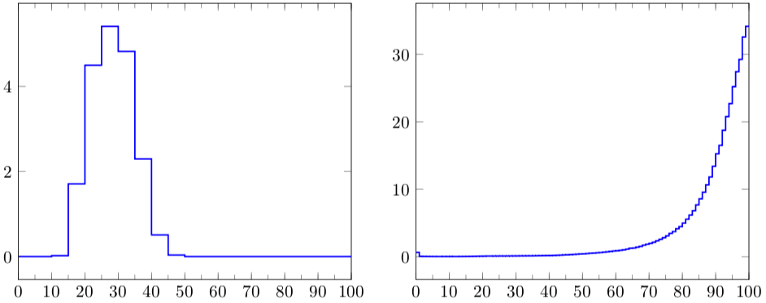
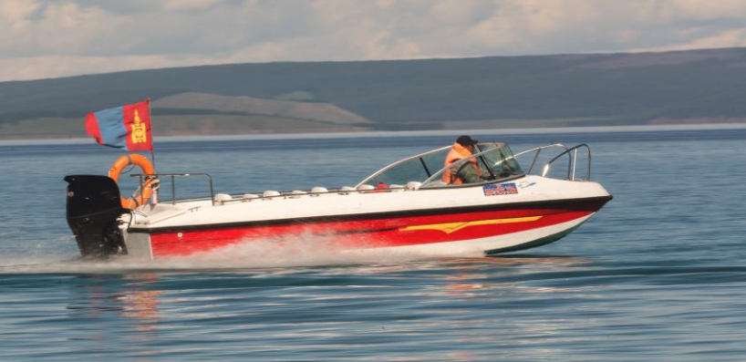

.. include:: rst-include

=====================================
Dæmi um hagnýtingu línulegrar algebru
=====================================

Skipting í hópa eða flokkun
---------------------------

Í þessari grein verður fjallað um aðferðir til að **flokka** (*cluster*,
*partition*) vigra í **hópa** (*groups*) þannig að vigrarnir í hverjum hóp séu
líkir hver öðrum, en vigrar í mismunandi hópum séu ekki eins líkir. Verkefni af
þessu tagi er nefnt *clustering* á ensku. Sér í lagi verður farið í hið
velþekkta **k-means** reiknirit (oftast er bara talað um *k-means* og ekki reynt
að þýða). Stundum er talað um að flokka *mælingar* (*observations*), *punkta*,
*einstaklinga* eða *hluti*, og þegar búið er að flokka má tala um *meðlimi* í
hópum. Orðið **einkenni** (*feature*) er oft notað um einstök stök í vigrunum
sem eru flokkaðir.

Dæmi um flokkun tvívíðra vigra
~~~~~~~~~~~~~~~~~~~~~~~~~~~~~~

Á eftirfarandi mynd er dæmi um flokkun tvívíðra vigra, sem sé punkta í planinu.

.. figure:: myndir/flokkunardæmi300.png
   :width: 12cm
   :align: center
   :name: flokkun300

   Skipting 300 punkta í þrjá hópa

Einn vandi við slíka flokkun er að ákvarða hópafjöldann, sem hefðbundið er að
nefna :math:`k`. Það sem er óvenjulegt við dæmið á myndinni er að vídd punktanna
er :math:`n = 2` og því er auðvelt að teikna punktasafnið. Í þessu dæmi er líka
auðvelt að sjá af myndinni að :math:`k = 3` er góð tala, en þetta er ekki svona
auðvelt fyrir hærri víddir og jafnvel heldur ekki fyrir önnur tvívíð dæmi.

Dæmi um hagnýtingu flokkunar
~~~~~~~~~~~~~~~~~~~~~~~~~~~~

**Flokkun texta eftir umfjöllunarefni.** Hér er nærtækt að taka dæmið um
Wikipedia-greinarnar sem voru á dagskrá í Skilaverkefni 7, þar sem unnið var með
tíðni 1000 orða í 300 Wikipedia-greinum sem fjölluðu um fimm mismunandi
efnisflokka, Pokemon, veðurfræði, listir, stofnanir Sameinuðu þjóðanna, og
rafmagnsverkfræði. Góður flokkari ætti að geta fundið (endurskapað) flokkunina,
a.m.k. komist nálægt henni útfrá orðtíðnigögnunum einum saman, sérstaklega ef
við festum :math:`k = 5`.

**Flokkun sjúklinga.** Ef :math:`x_i` er vigur af einkennum sjúklings númer :math:`i`
(t.d. aldur, kyn, BMI, og sjúkdómseinkenni af ýmsu tagi) þá gætti verið gagnlegt
að flokka sjúklingana í hópa með svipuð einkenni.

**Flokkun viðskiptavina.** Gerum ráð fyrir að :math:`j`-ta stak :math:`x_i` sé
magn af vöru :math:`j` sem kúnni númer :math:`i` keypti á tilteknu tímabili. Þá
mætti flokka kúnnana í :math:`k` hópa og svo mætti beina sömu auglýsingum til
þeirra sem eru í sama hóp, eða t.d. auglýsingum um það sem aðrir í hópnum hafa
keypt en þeir ekki.

Auðvelt er að búa til allskonar dæmi af sama tagi: Skipting nemenda í flokka
eftir einkunnum og námsbraut (þá mætti t.d. búa til verkefnahópa með einum úr
hverjum flokki til að fá fjölbreytni í hópana), flokkun svæða eftir veðurfari,
flokkun fyrirtækja eftir ýmsum eiginleikum, o.s.frv.

Í sumum tilvikum er ekkert unnið frekar með flokkana, heldur er tilgangur
flokkunarinnar einfaldlega sá að átta sig betur á gagnasafni.

Ritháttur fyrir flokkun
~~~~~~~~~~~~~~~~~~~~~~~

Við látum :math:`N` tákna fjölda punkta eða :math:`n`-vigra sem á að skipta í
:math:`k` hópa og látum svo :math:`G_j` vera mengi með númerum þeirra punkta
sem eru i :math:`j`-ta hópnum. Tökum sem dæmi að 7 punktum sé skipt í 3
hópa, með :math:`x_1`, :math:`x_3` og :math:`x_5` í fyrsta hópnum,
:math:`x_2` og :math:`x_4` í hópi 2 og :math:`x_6` og :math:`x_7` í þeim
þriðja. Þá verður:

.. math::
   G_1 = \{1, 3, 5\},\quad G_2 = \{2, 4\}\quad\text{og}\quad G_3 = \{6, 7\}

Við skilgreinum líka vigur :math:`c` með :math:`c_i = {}` númer hópsins sem
:math:`x_i` lendir í. Fyrir dæmið okkar verður

.. math::
   c = (1, 2, 1, 2, 1, 3, 3)

Vigurinn :math:`c` svarar til Python-breytunnar :code:`code` í grein :numref:`kmeans`.

.. _miðpunktar-hópa:

Miðpunktar hópa
~~~~~~~~~~~~~~~

**Miðpunktur** (*centroid*) fyrir hóp er punktur sem líkist punktunum í hópnum,
en hann þarf samt ekki að vera sjálfur í hópnum. Í k-means reikniritinu sem við
lýsum nákvæmlega hér að neðan er miðpunktur hóps reiknaður sem meðaltal af öllum
punktum í hópnum. Ef :math:`G_1,\ldots,G_k` er flokkun :math:`x_1,\ldots,x_N` og stærð
:math:`j`-ta hópsins er :math:`p_j` þá má reikna miðpunkta hópanna með:

.. math::
   &\textit{Reikna-miðpunkta:}\\[3pt]
   &\textbf{Fyrir } j = 1,\ldots,k: \\
   &\qquad m_j := \frac{1}{p_j} \sum_{i \in G_j}{} x_i

Í tvívíðu og þrívíðu rúmi þá er miðpunktur reiknaður með þessum hætti sá sami
og eðlisfræðileg þungamiðja punktasafnsins. Ef þungir hlutir væru festir á létt
(tvívítt) spjald, á staði sem svara til punktasafns, þá mundi spjaldið
ballansera á þungamiðjunni. Athugið að fyrir þrívíða punkta t.d. er hægt að láta
:math:`\overline x`, :math:`\overline y` og :math:`\overline z` vera meðaltöl
:math:`x`-, :math:`y`- og :math:`z`-hnita punktanna og þá verður
:math:`(\overline x, \overline y, \overline z)` miðpunkturinn.

.. figure:: myndir/þungamiðja.png
   :width: 7cm
   :align: center

.. Sýnidæmi
.. important::
   Miðpunktur eða meðaltal :math:`\{(1,3,4), (2,6,8), (3,6,9)\}` er
   :math:`\frac{1}{3}(1 + 2 + 3, 3 + 6 + 6, 4 + 8 + 9)` =
   :math:`\frac{1}{3}(6,15,21)` = :math:`(2,5,7)`.

.. Æfing
.. hint::
   Finnið miðpunkt fyrir punktana :math:`(1,1), (1,2), (2,4)` og :math:`(4,5)`.
   Merkið punktana og meðaltalið inn í hnitakerfi.

.. _besta-hópaskipting:
   
Besta hópaskipting
~~~~~~~~~~~~~~~~~~

Fyrir :math:`N` punkta, :math:`x_1, \ldots, x_N` og :math:`k` gefna
miðpunkta, :math:`m_1, \ldots, m_k` er hægt að reikna svokallaða bestu
hópaskiptingu með eftirfarandi reikniriti:

.. math::
   \DeclareMathOperator*{\argmin}{argmin}
   &\textit{Besta-skipting:}\\[3pt]
   &G_h := \varnothing\;\; (h = 1,\ldots, k) \\
   &\textbf{Fyrir } i = 1,\ldots,N: \\
   &\qquad h := \argmin_{1 \leq j\leq k} \|x_i - m_j\| \\
   &\qquad G_h := G_h \cup \{i\}

Með öðrum orðum finnum við fyrir hvern punkt þann miðpunkt sem er næstur og
setjum svo punktinn í tilsvarandi hóp. Stundum eru miðpunktarnir kallaðir
*fulltrúar* og þá má segja að hver einstaklingur lendi í hópi þess fulltrúa
sem er líkastur honum. Þetta minnir á kosningapróf sem ýmsir vefmiðlar bjóða í
aðdraganda kosninga, þar sem hægt er að finna út hvaða flokk maður ætti að kjósa
með því bera svör manns saman við svör frambjóðenda við sömu spurningum.

.. Æfing
.. hint::
   Merkið 10 punkta af handahófi á blað ásamt 3 miðpunktum og búið til bestu
   hópaskiptingu.

.. _kmeans:

*k-means* reikniritið
~~~~~~~~~~~~~~~~~~~~~

Eftir undirbúning í síðustu tveimur greinum er framsetning *k-means*
reikniritsins afar einföld. Það felst einfaldlega í að reikna aftur og aftur
bestu skiptingu fyrir gefna miðpunkta, og endurreikna miðpunktana fyrir
skiptinguna sem kom út. Hér er þetta aðeins formlegra:

.. math::
   &\textit{k-means:}\\[3pt]
   &\text{Veljum einhverja miðpunkta }m_1, \ldots, m_k \\
   &\textbf{Lykkja}\text{ þar til samleitni náð:} \\
   &\qquad \text{Ákvörðum skiptingu með reikniriti }\textit{Besta-skipting}\\
   &\qquad \text{Ákvörðum nýja miðpunkta með reikniriti }\textit{Reikna-miðpunkta}
   
Það eru ýmsar aðferðir til að velja upphafsgildi miðpunktanna í fyrsta skrefinu.
Ein einföld leið er að velja þá af handahófi úr punktasafninu, og önnur er sú að
skipta safninu af handahófi í :math:`k` hópa og velja upphafsgildi :math:`m_j`
sem meðaltal :math:`j`-ta hóps. Samkvæmt `Wikipedíugreininni um k-means
<https://en.wikipedia.org/wiki/K-means_clustering>`_ þá er aðferð kennd
við Bradley og Fayyad betri og sömuleiðis aðferð nefnd *k-means++*.

Markmiðið með reikniritinu er að reyna að finna skiptingu sem lágmarkar markfallið:

.. math::
   d = \sum_{j=1}^k \sum_{i \in G_j} \|x_i - m_j\|^2

Hægt er að sýna fram á að markfallið minnkar eða stendur í stað í hverju skrefi,
og þar sem það er takmarkað að neðan (verður aldrei minna en 0) og það eru bara
endanlega margar flokkanir til þá kemur að því að við tökum skref sem breytir
markfallinu ekki. Oftast er ítrekuninni samt hætt fyrr, þegar markfallið
breytist um minna en einhver fyrirfram ákveðinn þröskuldur. Þetta gefur
nokkurskonar staðbundið lággildi, og stundum er reikniritið framkvæmt nokkrum
sinnum með mismunandi byrjunarval á miðpunktunum, og svo valin sú skipting sem
endar í besta gildi á markfallinu.

.. note::
   
   Í Scipy er pakki sem heitir `scipy.cluster.vq
   <https://docs.scipy.org/doc/scipy/reference/cluster.vq.html>`_ sem geymir
   föll til að flokka vigra. Aðalfallið heitir :code:`kmeans` en auk þess eru
   hjálparföll, sér í lagi :code:`vq` og :code:`whiten`. Scipy skjölunin kallar
   vigrana sem flokkaðir eru *observations* (a.m.k. stundum) og stökin í þeim
   *features*. Vörpun frá miðpunktum yfir í hópa er kölluð *code book* sem þýðir
   upphaflega *dulmálslykill*. Hún er útfærð með fylki þar sem röð nr. :math:`i` er
   miðpunktur fyrir hóp nr. :math:`i`. Orðið *code* er svo notað um *hópnúmer*.
   Markfallið er kallað *distortion*. Eins og sést hér á eftir skilar fallið
   `kmeans` bara miðpunktum fyrir flokkunargögn og svo þarf að kalla á `vq` til
   að finna hópnúmer hvers og eins. Hér er dæmigerð notkun þessara falla:

   .. code:: python3
      
      from scipy.cluster.vq import kmeans, vq
      X = ...                  # búa til gögn / lesa úr skrá
      k = 5                    # Fjöldi hópa
      (cb, d) = kmeans(X,5)    # Skilar cb = codebook (5 línu fylki með miðpunktum)
                               # og d = lokagildi markfalls
      (code, dvec) = vq(X, cb) # code[i] = hópnúmer vigurs í i-tu línu X,
                               # dvec[i] = fjarlægð hans frá sínum miðpunkti

.. attention::
   `Vq` stendur fyrir *vector quantization*, en bein þýðing væri
   *vigurskömmtun*. Skömmtun (*quantization*) er hugtak í eðlisfræði sem snýst
   t.d. um að orka rafeindar í vetnisatómi getur bara tekið tiltekin strjál
   (*discrete*) gildi. Sama hugtak er svo notað í tölvunarfræði, t.d. þegar við
   fækkum litum í litmynd úr milljónum í 256 eða 16, eða þegar við látum
   þungamiðju eða miðpunkt hóps koma í stað hópsins alls.

.. Sýnidæmi
.. important::
   Hér er forrit sem býr til 30 slembipunkta í planinu og skiptir þeim svo í
   3 hópa, og prentar út og teiknar niðurstöðuna. Miðpunktar eru teiknaðir með stjörnum.

   .. code:: python3
             
      # UNDIRBÚNINGUR
      import numpy as np, numpy.random as npr, matplotlib.pyplot as plt
      from scipy.cluster.vq import kmeans, vq
      np.set_printoptions(precision=3, floatmode='fixed', suppress=True)
      npr.seed(23)
      X = npr.rand(30,2)

      # FLOKKUN
      (cb,d) = kmeans(X, 3)
      (code,dvec) = vq(X, cb)

      # ÚTPRENTUN OG TEIKNING
      print('codebook =\n', cb)
      print(f'markfall = {d:.3f}')
      print(f'flokkun = {code}')
      (x,y) = X.T
      (mx,my) = cb.T  # miðpunktar
      plt.scatter(x, y, s=60, c=code);
      plt.scatter(mx, my, s=600, c=[0,1,2], marker='*');

   Úttak:

   .. code:: python3
      
      codebook =
       [[0.461 0.866]
       [0.224 0.291]
       [0.815 0.409]]
      markfall = 0.198
      flokkun = [0 2 0 1 2 0 2 0 2 1 2 1 2 1 2 2 1 1 2 1 0 2 1 1 0 2 0 1 0 1]

   .. figure:: myndir/kmeansdæmi.png
      :width: 9cm
      :align: center

.. note::
   Ef reynt er að flokka með :math:`k > 3` og teikna með :code:`scatter` eins og
   í sýnidæminu verða litir hópanna ekki sérstaklega vel aðgreinanlegir.
   Hér er undirbúingsforrit sem keyra má til að fá betra litaval. Það dugar upp
   í :math:`k = 9`.

   .. code:: python3
             
      import matplotlib.colors as clrs
      def qcmap(k):
          cmap = plt.get_cmap('Set1')(range(k))
          if k > 5, cmap[5] = [0.95, 0.75, 0, 1]  # dekkja gula litinn
          return clrs.LinearSegmentedColormap.from_list("",cmap,n)

   Til að teikna er svo notað:

   .. code:: python3
             
      plt.scatter(x, y, s=60, c=code, cmap=qcmap(k))

.. Æfing
.. hint::
   a. Afritið forritið í sýnidæminu og prófið að keyra það með 5 og 10 hópum.
      Skoðið úttakið.
   b. Keyrið nú reitinn að ofan sem skilgreinir :code:`qcmap` og leysið a-lið
      aftur með því að hafa :code:`cmap=` með í scatter-skipuninni.

Dæmi um nokkrar k-means-ítrekanir
~~~~~~~~~~~~~~~~~~~~~~~~~~~~~~~~~

Til glöggvunar fylgja hér nokkrar myndir af niðurstöðum reikniritanna
*Besta-skipting* (t.v. í hverri mynd; sjá grein :numref:`besta-hópaskipting`) og
*Reikna-miðpunkta* (t.h. í hverri mynd; sjá grein :numref:`miðpunktar-hópa`) þegar
k-means reikniritinu er beitt á dæmið sem sýnt er á :numref:`flokkun300`.
Miðpunktar eru sýndir með ferningum

.. figure:: myndir/ítrekun1.png
   :width: 13cm
   :align: center

   Dæmi um k-means, ítrekun 1

.. figure:: myndir/ítrekun2.png
   :width: 13cm
   :align: center

   Dæmi um k-means, ítrekun 2

.. figure:: myndir/ítrekun10.png
   :width: 13cm
   :align: center

   Dæmi um k-means, ítrekun 10

.. figure:: myndir/eftir-ítrekun-15.png
   :width: 6cm
   :align: center

   Dæmi um k-means, eftir 15 ítrekanir

Lokamyndin er sú sama og er í byrjun kaflans (:numref:`flokkun300`). Hér er mynd sem sýnir hvernig markfallið (á :math:`y`-ás) þróast með númeri
ítrekunar (á :math:`x`-ás).

.. figure:: myndir/kmeansmarkfall.png
   :width: 7cm
   :align: center

Forvinnsla vigra með :code:`whiten`
~~~~~~~~~~~~~~~~~~~~~~~~~~~~~~~~~~~

Ef stökin í vigrunum sem á að flokka hafa mjög mismunandi stærðargráðu getur
borgað sig að skala þau. Tökum sem dæmi að við ætlum að flokka menn eftir hæð og
þyngd, og hæðin sé í metrum en þyngdin í kílóum. Ef ekkert er gert mundu hæðirnar
hafa lítil sem engin áhrif á röðun í hópa. Hér væri hægt að staðla hæð og þyngd
með því að deila með staðalfrávikum hvors um sig áður en flokkað er. 

.. note::

   Eitt af því sem vq-pakkinn býður upp á er fallið :code:`whiten` sem staðlar
   hvert einkenni (hnit) með því að deila með staðalfráviki þess, svo
   öll einkennin hafi staðalfrávik 1. Þannig mætti byrja forritsbútinn í síðustu
   grein á:

   .. code:: python3
             
      from scipy.cluster.vq import kmeans, vq, whiten
      X = ...                  # búa til gögn / lesa úr skrá
      X = whiten(X)            # staðla gögn
      ...

.. attention::   
   Annar vinsæll Python-pakki sem m.a. getur flokkað er *Scikit-learn* (fluttur
   inn með :code:`import sklearn.cluster` o.fl.). Þar er m.a. að finna mjög
   vinsælan flokkara sem heitir *DBSCAN*. Hér er áhgugaverð `vefsíða með
   flokkunarmyndum
   <https://scikit-learn.org/stable/auto_examples/cluster/plot_cluster_comparison.html>`_
   sem búnar eru til með ýmsum flokkurum úr Scikit-learn.
                               
      

Fylkjamargföldun og tölvugrafík
-------------------------------

Hægt er að líta á flatarmyndir, t.d. hringi, þríhyrninga, eða myndir af húsum
sem mengi af punktum, og síðan er hægt að skoða hvað línulegar varpanir
á :math:`\Bbb{R}^2` (þ.e. frá :math:`\Bbb{R}^2` til :math:`\Bbb{R}^2` gera við
myndirnar, sem sé með því að skoða myndmengið sem kemur út þegar öllum punktum
flatarmyndarinnar er varpað. Það eru fjórar grunngerðir af tvívíðum línulegum
vörpunum: **snúningur** (*rotation*), **skölun** (*scaling*), **skekking** (*shear
deformation*) og **speglun** (*reflection*). Myndin hér að neðan sýnir dæmi um
allar þessar gerðir af vörpunum.

Eins og við sáum í greinum :numref:`línulegar-varpanir-og-fxv` og
:numref:`línulegar-varpanir-og-fxf` er svo hægt að setja allar
þessar varpanir fram með fylkjum og margföldun með þeim.
           
**Snúningsfylki** sem snýr mynd rangsælis um hornið :math:`\theta` með snúningspunkt
:math:`(0,0)` er gefið með

.. math::
   R_{\theta} = \begin{pmatrix}
   \cos \theta & -\sin \theta \\
   \sin \theta & \cos \theta
   \end{pmatrix}

**Skölunarfylki** sem skalar um :math:`a` í :math:`x`-stefnu og :math:`b` í
:math:`y`-stefnu er

.. math::
   S_{a,b} = \begin{pmatrix}a & 0 \\ 0 & b \end{pmatrix}

**Skekkingarfylki** eru

.. math::
   K_{x,\theta} = \begin{pmatrix} 1 & \sin \theta \\ 0 & 1 \end{pmatrix}
   \;\text{ og }\;
   K_{y,\theta} = \begin{pmatrix} 1 & 0 \\ \sin \theta & 1 \end{pmatrix}

Það fyrra hallar lóðréttum línum um horn :math:`\theta` til hægri en varðveitir
láréttar línur, og það síðara hallar láréttum línum upp en varðveitir þær
lóðréttu.

   
**Speglunarfylki** sem spegla um :math:`x`-ás og :math:`y`-ás eru

.. math::
   M_x = \begin{pmatrix} 1 & 0 \\ 0 & -1 \end{pmatrix} \;\text{ og }\;
   M_y = \begin{pmatrix} -1 & 0 \\ 0 & 1 \end{pmatrix}

Hægt er að sýna fram á að sérhverja tvívíða línulega vörpun er hægt að rita sem
samsetningu af vörpunum af þessum fjórum gerðum, til dæmis væri hægt að stækka
fyrst, snúa svo og spegla í lokin, eða spegla um skálínu með því að snúa, spegla
og snúa til baka.

Allar þessar aðgerðir eru grunnaðgerðir í tölvugrafík. Þeim til viðbótar þarf í
tölvugrafík að vinna með hliðranir eða færslur (*displacements*), sem er líka
hægt að útfæra með fylkjamargföldun. Þá er bætt við gervihniti og unnið með
svonefnd *jafnþætt* eða *hómógen* hnit (*homogeneous*), þrívíða vigra og :math:`3
\times 3` fylki.

Nútíma tölvugrafík er svo auðvitað oftast þrívíð og þar þarf að takast á við
þrívíða snúninga, speglanir og skalanir, og auk þess bæði hliðranir og 
fjarvídd (*perspective*). Allt þetta er hægt að útfæra með fjórvíðum
vigrum og :math:`4 \times 4` fylkjum, þar sem eitt hnitið er gervihnit.

Fylki og net
------------

Net, hnútar og leggir
~~~~~~~~~~~~~~~~~~~~~

**Net** (*graph* eða *network*) er safn af **hnútum** (eða *punktum*) (*vertices*, nodes*) og **leggjum** (*edges*) milli hnútanna. Net eru meðal annars umfjöllunarefni í Stærðfræðimynstrum. Þau geta verið **stefnd** (*directed*) eða **óstefnd**, og þegar þau eru stefnd eru leggirnir stundum kallaðir örvar. Net geta líka haft leggi sem tengja punkta við sjálfa sig, kallaðir **snörur** (*loops*). :numref:`dæmi-um-net` sýnir dæmi um net. Netið í miðjunni er það sama og netið til hægri.

.. figure:: myndir/dæmi-um-net.png
   :width: 13cm
   :name: dæmi-um-net
   :align: center

   Óstefnt net (t.v.) og stefnt net (í miðju og t.h.)

Grannafylki
~~~~~~~~~~~

**Grannafylki** (*adjacency matrix*) stefnds nets er fylki :math:`A` með

.. math::
   a_{ij} = \left\{\begin{array}{ll}
   1 &\text{ef það er ör frá hnút } i \text{ yfir í hnút } j \\
   0 &\text{annars}
   \end{array}
   \right.
   
**Grannafylki** óstefnds nets er samhverft fylki :math:`A` með

.. math::
   a_{ij} = a_{ji} = \left\{\begin{array}{ll}
   1 &\text{ef leggur tengir hnút } i \text{ og hnút } j \\
   0 &\text{annars}
   \end{array}
   \right.

.. Sýnidæmi
.. important::
   Grannafylki netanna á :numref:`dæmi-um-net` eru

   .. math::
      \begin{pmatrix}
      0 & 1 & 1 \\
      1 & 0 & 1 \\
      1 & 1 & 0
      \end{pmatrix}
      \;\text{ (netið t.v.) og }\;
      \begin{pmatrix}
      0 & 1 & 1 \\
      0 & 0 & 1 \\
      0 & 1 & 0
      \end{pmatrix}
      \;\text{ (hin tvö)}\;

.. _vegir-í-netum:
      
Vegir í netum
~~~~~~~~~~~~~

**Vegur** (*path*) með lengd :math:`L` í neti er runa af :math:`L + 1` hnút þannig
að leggur tengi hnút 1 við hnút 2, hnút 2 við hnút 3, o.s.frv. Sagt er að
vegurinn tengi fyrsta hnútinn við þann síðasta. Veg með lengd 3 frá :math:`v_1`
til :math:`v_4` má rita

.. math::
   v_1 \to v_2 \to v_3 \to v_4 \;\text{ eða }\; (v_1, v_2, v_3, v_4).

Skemmtileg regla tengir fjölda vega milli hnúta og veldi grannafylka:

    **REGLA.** |sp| Grannafylki nets sé :math:`A`. Þá er :math:`(i,j)`-stak
    :math:`A^n` jafnt og fjöldi mismunandi vega með lengd :math:`{} = n` frá
    hnút :math:`i` til hnúts :math:`j` og :math:`(i,j)`-stak :math:`A + A^2 +
    \ldots + A^n` gefur fjölda mismunandi vega með lengd :math:`{} \leq n` (hér
    er :math:`A^n` fylkjaveldi, sbr. grein :numref:`margföldun-fylkja`).

Þessi skilgreining og reglan sömuleiðis eiga bæði við um stefnd og óstefnd net.

.. Sýnidæmi
.. important::
   Skoðum stefnda netið á eftirfarandi mynd:

   .. figure:: myndir/stefnt-net.png
      :width: 6cm
      :align: center

   Grannafylkið og annað veldi þess eru gefin með

   .. math::
      A =
      \begin{pmatrix}0&1&0&1&0\\1&0&0&0&0\\0&1&1&0&0\\0&0&1&0&1\\1&0&1&0&0\end{pmatrix}
      \;\text{ og }\; A^2 = B =
      \begin{pmatrix}1&0&1&0&1\\0&1&0&1&0\\1&1&1&0&0\\1&1&2&0&0\\0&2&1&1&0\end{pmatrix}

   Við sjáum að :math:`b_{11} = 1` og að það er nákvæmlega einn vegur sem tengir
   hnút 1 við sjálfan sig, nefnilega vegurinn :math:`1 \to 2 \to 1`.  Til að
   taka annað dæmi þá eru tveir vegir frá hnút 4 til hnúts 3, nefnilega
   :math:`4 \to 5 \to 3` og :math:`4 \to 3 \to 3`, enda er :math:`(4,3)`-stak
   :math:`A^2` :math:`{}= b_{43} = 2`.

.. Æfing
.. hint::
   Stefnt net hefur leggi:
   
   .. math::
      \begin{array}{ll}
      1 \to 2 &\qquad 2 \to 3 \\
      1 \to 3 &\qquad 2 \to 4 \\
      1 \to 4 &\qquad 3 \to 4
      \end{array}

   a) Teiknið netið
   b) Finnið grannafylkið :math:`A`
   c) Reiknið :math:`A^2` og :math:`A^3`
   d) Reiknið :math:`B = A + A^2 + A^3`. Þið ættuð að fá út að :math:`b_{14} = 4`.
      Finnið vegina fjóra frá hnút 1 til hnúts 4.

Legufylki
~~~~~~~~~

Ef bæði hnútar og leggir nets eru tölusettir þá er hægt að skilgreina
**legufylki** (*incidence matrix*) þess. Fyrir óstefnt net með :math:`n` hnútum og
:math:`m` leggum er það :math:`n \times m` fylki :math:`A` með

.. math::
   a_{ij} = \left\{\begin{array}{ll}
   1 &\text{ef hnútur } i \text{ er endi á legg } j \\
   0 &\text{annars}
   \end{array}
   \right.

Það eru sem sé tveir ásar (stak sem er :math:`= 1`) í dálki hvers leggs, nema hann sé snara, þá er bara
einn ás. Ef netið er stefnt þá er sett formerki á stök legufylkisins til að sýna
stefnu örvanna, oftast mínus í línu hnútsins þar sem örin byrjar:

.. math::
   a_{ij} = \left\{\begin{array}{ll}
   -1 &\text{ef ör } j \text{ byrjar í hnút } i \\
   1  &\text{ef ör } j \text{ endar í hnút } i \\
   0  &\text{annars}
   \end{array}
   \right.

Stundum er þetta samt haft öfugt. Fyrir snörur látum við formerkið vera :math:`{}+{}`.

.. Sýnidæmi
.. important::

   .. figure:: myndir/legufylki.png
      :width: 6cm
      :align: center

   Netið á myndinni hefur legufylki:

   .. math::
      \begin{pmatrix}-1&-1&0&1&0\\1&0&-1&0&0\\0&0&1&-1&-1\\0&1&0&0&1\end{pmatrix}

.. Æfing
.. hint::
   Óstefnt net hefur leggi :math:`e_1: v_1`---:math:`v_2`, :math:`e_2:
   v_2`---:math:`v_2` og :math:`e_3: v_2`---:math:`v_3`.
   
   a. Teiknið netið.

   b. Ákvarðið grannafylki þess.
      
   c. Ákvarðið legufylki þess.
      
   d. Ákvarðið legufylkið fyrir tilsvarandi stefnt net með örvar :math:`v_1 \to
      v_2`, :math:`v_2 \to v_2` og :math:`v_2 \to v_3`

Flæðinet
~~~~~~~~

Net sem lýsir kerfi þar sem eitthvað flæðir eftir hverjum legg, rafmagn, vatn,
umferð, vörur o.s.frv. er kallað **flæðinet** (*network*). Hnútpunktarnir eru þá
t.d. tengibox/tengivirki, tengipunktar, gatnamót eða dreifistöðvar. Í
slíkum netum eru tölur tengdar hverjum legg, stundum fleiri en ein. Fyrir legg
:math:`e_j` gæti t.d. gilt:

.. math::
   &\text{flæði } = x_j \\
   &\text{hámarksflæði eða burðargeta } = b_j \\
   &\text{kostnaður á flutta einingu } = c_j

Aðrir möguleikar á upplýsingum um leggi gætu t.d. verið lengdir þeirra eða
viðnám í þeim. Þessar upplýsingar mætti setja fram með fylki sem hefur ekki-núll
í sömu sætum og í grannafylki netsins (því þar er jú ás í sæti
:math:`(i,j)` ef leggur tengir hnúta :math:`i` og :math:`j`). Flæðinet
eru oft stefnd, en þá táknar stefna örvanna/leggjanna ekki stefnu
flæðisins, heldur einungis í hvaða stefnu flæðið telst jákvætt. Ef flæði er á
móti ör verður :math:`x_j < 0`.

Lindir og ósar
~~~~~~~~~~~~~~

Legufylki eru oft gagnleg fyrir verkefni sem tengjast flæðinetum. Það
er ekki erfitt að sjá að ef :math:`x` er flæðivigur með :math:`x_j` =
flæði eftir ör :math:`j` í stefndu neti með legufylki :math:`A` og :math:`y =
Ax` þá gefur :math:`y_i` nettóflæði inn í hnút :math:`i` fyrir öll :math:`i`. 
Ef :math:`y_i` > 0 þá er yfirflæði í hnútnum sem við hugsum okkur að renni út
úr netinu, og slíkur hnútur er kallaður **ós** (*sink*). Ef hinsvegar :math:`y_i <
0` þá þarf að bæta í flæðið í hnút :math:`i` til að flæðið í netinu sé
allsstaðar varðveitt; slíkur hnútur kallast **lind** (*source*). Ef
:math:`s` er vigur með

.. math::
   &s_i = \text{ nettóflæði inn í hnút } i \text{, og þar með:} \\
   &s_i \left\{\begin{array}{l}
   {} < 0 \text{ fyrir ósa}\\
   {} > 0 \text{ fyrir lindir}\\
   {} = 0 \text{ fyrir aðra hnúta}
   \end{array}\right.

þá þýðir varðveisla flæðis að:

.. math::
   Ax + s = 0.

Ef netið er tré (hringalaust) þá má leysa þessa jöfnu til að finna flæði í öllum
leggjum, en annars þarf meiri upplýsingar t.d. um þrýsing/spennu.
   
Eftirfarandi mynd sýnir flæðinet. Myndin segir ekkert um formerki flæðigilda svo
það er ekki hægt að sjá hvaða hnútpunktar eru lindir og hverjir eru ósar. Öll
:math:`s_i`-in eru látin stefna inn í netið. Þar sem :math:`s_i` er jákvætt
passar sú stefna, þar eru lindir sem skila flæði inn í netið, en þar sem
:math:`s_i` er neikvætt er raunverulega að flæða út úr netinu.

.. Æfing
.. hint::

   Gerið ráð fyrir að flæðivigur á myndinni hér á undan sé :math:`x = (1, 3, 2, 4, -1)`.
   Ákvarðið legufylkið :math:`A` og í framhaldi nettóinnflæðið :math:`s`.
   Flokkið svo hnútana í lindir, ósa og aðra hnúta.

Línuleg hreyfikerfi
-------------------

Í þessari grein kynnumst við notkun fylkjamargföldunar til að lýsa
kerfum sem breytast með tíma. Tekin verða dæmi um stofnstærð/mannfjölda
þar sem svonefnd Leslie fylki koma við sögu, og um hreyfingu massa
sem kraftar verka á.

Skilgreining línulegra hreyfikerfa
~~~~~~~~~~~~~~~~~~~~~~~~~~~~~~~~~~

Lát :math:`x_t` vera :math:`n`-vigur sem lýsir einhverju **ástandi** (*state*)
kerfis á tíma :math:`t`, :math:`t = 0, 1, 2, \ldots` (stundum er *state* líka
þýtt með **staða**). Við skoðum sem sé kerfið á gefnum tímapunktum: tíminn líður
í strjálum (*discrete*) skrefum sem gætu verið sekúndur eða ár. **Línulegt
hreyfikerfi** (*linear dynamical system*) er líkan af kerfinu þar sem
:math:`x_{t+1}` er línulegt fall af :math:`x_t`:

.. math::
   x_{t+1} = A_t x_t\quad (t = 0, 1, 2, \ldots)

Fylkin :math:`A_t` (sem eru :math:`n \times n`) eru kölluð **hreyfifylki**
(*dynamics matrices*). Ef þessi fylki og :math:`x_0` eru þekkt þá er hægt
að nota líkanið til að reikna öll framtíðargildi ástandsvigursins :math:`x_t`.
Hér er fylkinu leyft að vera háð :math:`t` en oft er :math:`A`-fylkið fast og
óháð :math:`t`.

**Hliðrað línulegt hreyfikerfi** (*non-homogeneous...*) er útvíkkun
hugtaksins þar sem ytri aðstæður hafa áhrif á þróun kerfisins. Því er lýst með
líkani:

.. math::
   x_{t+1} = A_t x_t + B_t u_t \quad (t = 0, 1, 2, \ldots)

:math:`B_t` er **inntaksfylki** (*input matrix*) og :math:`u_t` eru **ytri**
(*exogenous*) breytur (":math:`B` tekur ytri breyturnar **inn** í kerfið").

Þróun mannfjölda eða stofnstærðar
~~~~~~~~~~~~~~~~~~~~~~~~~~~~~~~~~

Við byrjum á að tala um mannfjölda, en augljóslega má nota sömu stærðfræði til
að lýsa stofnstærð dýrategunda. Gerum ráð fyrir að :math:`x_t` sé
:math:`n`-vigur með :math:`i`-ta stak jafnt og fjöldi fólks í tilteknu landi sem
eru á :math:`i`-ta aldursári (sem sé :math:`i-1` ára gamlir), :math:`t` árum
eftir tiltekinn byrjunartíma. Við gætum látið :math:`n = 120`. Oft er svona
vigur kallaður *aldursdreifing* í landinu og hér er mynd sem sýnir
aldursdreifingu fólks yngra en 100 ára í Bandaríkjunum árið 2010.

   Aldursdreifing Bandaríkjamanna árið 2010. |br|
   Milljónir á :math:`y`-ás og aldur á :math:`x`-ás.
      
Látum fæðingartíðni og dánartíðni vera gefna með vigrum :math:`b` og :math:`d`: :math:`b_i` = árlegur meðalfjöldi lifandi fæddra barna foreldra sem eru að meðaltali á :math:`i`-ta aldursári og :math:`d_i` = hlutfall fólks á :math:`i`-ta aldursári sem deyr. Til að vera nákvæmur mætti síðan skoða karla og konur aðskilið. Hér er mynd af :math:`b` og :math:`d` fyrir Bandaríkin í kring um árið 2010. Á þessum myndum er aftur miðað við fólk yngra en 100 ára.

   Fæðingartíðni (t.v.) og dánartíðni (t.h.) í prósentum eftir aldri í
   Bandaríkjunum í lok árs 2010. 

Smá skoðun leiðir nú í ljós að ef horft er framhjá aðfluttum og
brottfluttum má lýsa þróun mannfjöldans með línulega hreyfikerfinu:

.. math::
   x_{t+1} = A x_t =
   \begin{pmatrix}
   b_1 & b_2 & b_3 & \cdots & b_{119} & b_{120} \\
   1-d_1 & 0 & 0   & \cdots & 0 & 0 \\
   0 & 1-d_2 & 0   & \cdots & 0 & 0 \\
   \vdots & \vdots & \vdots && \vdots & \vdots \\
   0 & 0 & 0       & \cdots & 1-d_{119} & 0
   \end{pmatrix}
   x_t

Svona mannfjöldafylki (eða stofnstærðar-) er kallað **Leslie-fylki**. Það er sett
saman úr þremur þáttum:

1. Fæðingartíðni eftir ári í efstu línu
2. Dánartíðni eftir ári á skálínu neðan hornalínu
3. Ásar á sömu skálínu sem færa :math:`i` ára á ári :math:`t` í :math:`i+1`
   ára árið :math:`t+1`.

Ef taka skal tillit til aðfluttra og brottfluttra má nota hliðrað hreyfikerfi:

.. math::
   x_{t+1} = A x_t + B u_t

þar sem :math:`B` er einingafylkið og :math:`(i+1)`-ta stak :math:`u_t` er fjöldi
:math:`i` ára gamalla aðfluttra umfram brottflutta á ári :math:`t`.
   
.. Æfing
.. hint::
   Tegund lifir í hámark 3 ár. Hver 0 ára gefur 0.2 núll-ára afkvæmi árið eftir,
   hver 1 árs 0.6 afkvæmi ári síðar og hver 2 ára 0.8. 20% núll-ára eru dauð ári
   seinna, og dánartíðni eins-árs er 50%.

   Í upphafi er stofnstærðin 3000 einstaklingar, 1200 núll-ára, 1000 eins árs og 800 tveggja ára. 

   a) Ákvarðið Leslie-fylkið
   b) Ákvarðið stofnstærð eftir 1 ár
   c) Ákvarðið stofnstærð eftir 2 ár

Diffurjafna fyrir hreyfingu hlutar
~~~~~~~~~~~~~~~~~~~~~~~~~~~~~~~~~~

Línuleg hreyfikerfi má nota til að líkja eftir hreyfingu margvíslegra
aflfræðilegra kerfa, t.d. flugféla, skipa, bíla eða bygginga í jarðskjálfta. Hér
lýsum við mjög einföldu kerfi, massa sem færist í beina línu fyrir áhrif
drifkrafts og verður jafnframt fyrir núningsmótstöðu. Við getum hugsað okkur
að um sé að ræða bát með utanborðsmótor.

   Hraðbátur á Khövsgöl vatni í Mongólíu

Um slíka hreyfingu gildir 2. lögmál Newtons:

.. math::
   \text{kraftur} = \text{massi} \cdot \text{hröðun}

Auk þess gildir að núningsmótstaðan verkar eins og kraftur sem er í
réttu hlutfalli við hraðann, sem sé

.. math::
   \text{núningskraftur} = n \cdot \text{hraði}

þar sem :math:`n` er núningsstuðull. Ef:

.. math::
   &m = \text{massi} \\
   &t = \text{tími} \\
   &f(t) = \text{drifkraftur á tíma } t\\
   &v(t) = \text{hraði á tíma } t \text{ og} \\
   &a(t) = \text{hröðun á tíma } t

og hugað er að formerkjum liða þá fæst:

.. math::
   (*)\qquad\qquad m a(t) = -n v(t) + f(t) \qquad\qquad\quad{}
   
Ef við látum líka :math:`p(t)` vera staðsetningu á tíma :math:`t` þá segir
eðlisfræðin okkur að :math:`v(t) = p'(t)` og :math:`a(t) = p''(t)` og þar með
verður :math:`(*)` að diffurjöfnunni:

.. math::
   m p''(t) = -n p'(t) + f(t)
   
Þessa annarsstigs diffurjöfnu er einfalt að umrita sem fyrsta stigs
diffurjöfnukerfi í tvívíða fallinu :math:`(p(t), v(t))`:

.. math::
   \begin{pmatrix}p'(t)\\mv'(t)\end{pmatrix} =
   \begin{pmatrix}v(t)\\-nv(t) + f(t)\end{pmatrix}

Diffurjöfnu breytt í línulegt hreyfikerfi
~~~~~~~~~~~~~~~~~~~~~~~~~~~~~~~~~~~~~~~~~
   
Nálgun við diffurjöfnukerfið að framan fæst með því að umrita staðsetningu og
hraða á tíma :math:`t^+ = t+1` útfrá sömu stærðum á tíma :math:`t` með fyrsta stigs 
Taylor-nálgun, sbr. grein :numref:`taylor`. Við beitum
einvíðu Taylor-setningunni annarsvegar á :math:`p` og hinsvegar á :math:`v` og það gefur:

.. math::      
   p(t^+) &\approx p(t)+p'(t)(t^+-t) \text{ þ.e. }p'(t) \approx p(t^+)-p(t)\\
   v(t^+) &\approx v(t)+v'(t)(t^+-t) \text{ þ.e. }v'(t) \approx v(t^+)-v(t)

Þessi nálgun verður góð ef við veljum tímaeininguna nógu litla (t.d. 1 sekúndu).
Ef þessari nálgun er stungið inn í diffurjöfnukerfið og við notum ritháttinn
:math:`p_t, v_t` og :math:`f_t` í stað :math:`p(t), v(t)` og :math:`f(t)` fæst:

.. math::
   \begin{pmatrix}p_{t+1}-p_t \\ m(v_{t+1} - v_t)\end{pmatrix} =
   \begin{pmatrix}v_t\\-nv_t + f_t\end{pmatrix}

það er að segja:

.. math::
   \begin{pmatrix}p_{t+1} \\ v_{t+1}\end{pmatrix} &=
   \begin{pmatrix}p_t + v_t\\ (1 - n/m) v_t + (1/m)f_t\end{pmatrix}\\ &=
   \begin{pmatrix}1 & 1\\ 0 & 1-n/m\end{pmatrix}
   \begin{pmatrix}p_t\\ v_t\end{pmatrix} +
   \begin{pmatrix}0\\ 1/m\end{pmatrix} f_t

Þetta kerfi er greinilega hliðrað línulegt hreyfikerfi:

.. math::
   (**)\qquad\qquad x_{t+1} = Ax_t + Bf_t\qquad\qquad\;\;{}
   
með ástandsvigri :math:`x_t = (p_t, v_t)`, ytri breytum
:math:`f_t`, og hreyfifylki og inntaksfylki:

.. math::
   A = \begin{pmatrix}1 & 1\\ 0 & 1-n/m\end{pmatrix}\;\text{ og }\;
   B = \begin{pmatrix}0\\1/m\end{pmatrix}

.. Sýnidæmi
.. important::
   
   Látum hreyfikerfið líkja eftir ferð 500 kg báts með utanborðsmótor í 50
   sekúndur. Mótorinn er settur í gang eftir 5 sekúndur með 3000 newtona krafti
   áfram, 10 sekúndum seinna er skipt í bakkgír, með 2500 newtona krafti í 15
   sekúndur og svo er drepið á mótornum. Núningsstuðull er :math:`n = 100`.

   Byrjað er með :math:`x_0 = (0,0)` og svo er :math:`x_{t+1}` reiknað 50 sinnum
   með :math:`(**)`. Hér eru myndir með niðurstöðum reikninganna (kN eru kílónewton):

   .. figure:: myndir/krafturhraði.png
      :width: 100%
      :align: center

.. Æfing
.. hint::
   a) Notið tölurnar sem gefnar eru í sýnidæminu hér á undan og ákvarðið
      hreyfifylkið :math:`A` og inntaksfylkið :math:`B`.
      
   b) Báturinn er kyrr í 5 sekúndur en þá fer hann af stað.
      Reiknið staðsetningu og hraða hans eftir 6 og 7 sekúndur með blaði og
      blýanti.

   c) Notið nú Python til að líkja eftir hreyfingu bátsins í 50
      sekúndur og endurskapa þannig línuritin í sýnidæminu.

   d) Notið Python til að finna hámarkshraða bátsins.
