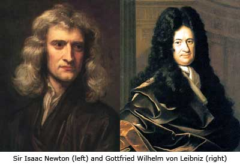
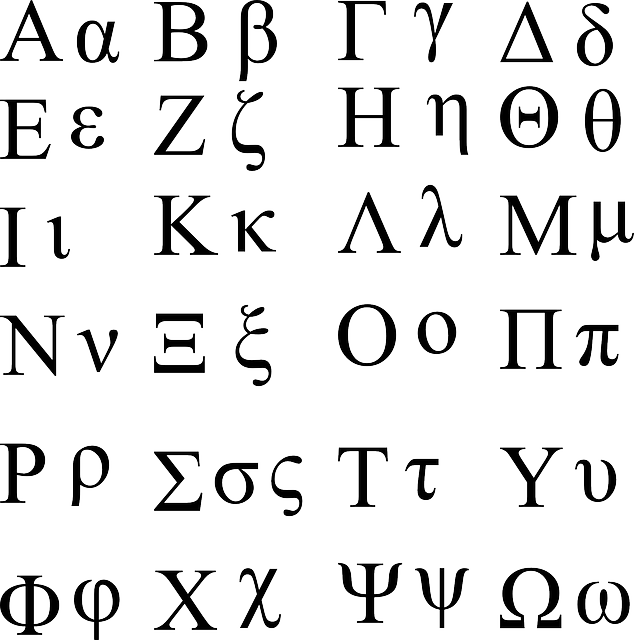
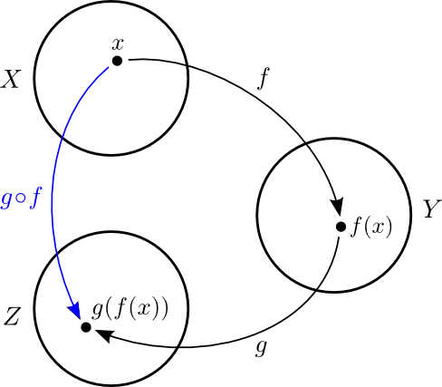
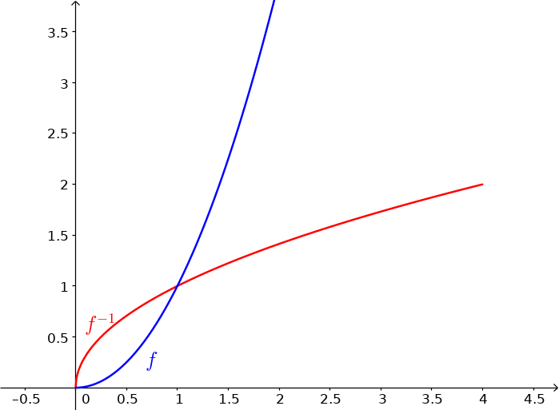
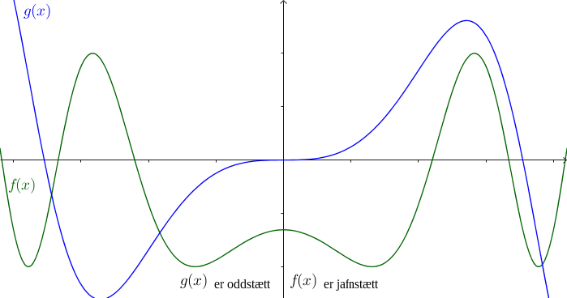

Tölur og föll
=============

.. admonition:: Athugasemd
    :class: athugasemd

    **Nauðsynleg undirstaða**

    -  `Undirstöðuatriði tölur og talnakerfi <https://edbook.hi.is/undirbuningur_stae/kafli01/index.html#talnakerfi>`_.
    -  `Forgangsröðun aðgerða <https://edbook.hi.is/undirbuningur_stae/kafli01/index.html#forgangsroun-agera>`_.
    -  `Reiknireglur <https://notendur.hi.is/undirbuningur_stae/kafli01/index.html#reiknireglur>`_.
    -  `Brotareikningur <https://edbook.hi.is/undirbuningur_stae/kafli01/index.html#brotareikningur>`_.
    -  `Veldi og rætur <https://edbook.hi.is/undirbuningur_stae/kafli01/index.html#veldi-og-raetur>`_.
    -  `Sjá undirstöðuatriði um föll <https://edbook.hi.is/undirbuningur_stae/kafli05/index.html>`_.

Inngangur
---------
*There is a theory which states that if ever anyone discovers exactly what the Universe is for and why it is here, it will instantly disappear and be replaced by something even more bizarre and inexplicable.
There is another theory which states that this has already happened.*

\- Douglas Adams, The Restaurant at the End of the Universe

Grunnhugmyndin
~~~~~~~~~~~~~~

Stærðfræðigreining grundvallast á því að mæla breytingu (oft með tilliti
til tíma)

-  Eðlisfræði: hraði, hröðun, massi, orka, vinna, afl, þrýstingur

-  Rúmfræði: flatarmál, rúmmál, lengd, massamiðja

-  Hagnýtingar: hagfræði, stofnstærðir, hámörkun/lágmörkun, hreyfikerfi, hitaflæði

-  Stærðfræði: markgildi, hermun, jafnvægisástand

Sett fram samtímis, en óháð, af
`Isaac Newton <http://www.visindavefur.is/svar.php?id=1635>`__ og
`Gottfried Leibniz <http://www.visindavefur.is/svar.php?id=59920>`__ í lok 17. aldar.

Ítarefni
~~~~~~~~

Fyrir nánari útlistun á hugtökunum sem við fjöllum um þá er hægt að skoða,
auk kennslubókarinnar,

-  http://edbook.hi.is/undirbuningur_stae

-  http://stae.is/hugtakasafn

-  http://stae.is/os, íslensk-ensk og ensk-íslensk orðaskrá

-  http://planetmath.org

-  http://mathworld.wolfram.com

-  http://en.wikipedia.org (ath. enska útgáfan)

Einnig getur verið gagnlegt að kannast við grísku bókstafina:

Forrit
~~~~~~

-  GeoGebra http://www.geogebra.org

-  WolframAlpha http://www.wolframalpha.com

-  Matlab http://www.mathworks.com
   (sjá https://notendur.hi.is/~jonasson/matlab/)

-  Octave http://www.gnu.org/software/octave/ (opið og ókeypis, svipað og Matlab)

-  Sage http://www.sagemath.org/  (opið og ókeypis, byggt á Python)

-  Mathematica http://www.wolfram.com/mathematica/

---------

Tölur
-----

.. index::
    seealso: rauntölur; tölur
    rauntölur
    tölur; náttúrlegar tölur
    tölur; heiltölur
    tölur; ræðar tölur
    tölur; rauntölur
    tölur; tvinntölur

Skilgreining: Tölur
~~~~~~~~~~~~~~~~~~~

.. admonition:: Skilgreining
    :class: skilgreining

    (i)   :hover:`Náttúrlegu tölurnar,náttúruleg tala` eru tölurnar :math:`1, 2, 3, 4, \ldots` og
          mengi þeirra er táknað með :math:`\mathbb{N}`.
    (ii)  Mengi :hover:`heiltalna,heiltala,1` er táknað með :math:`\mathbb{Z}`.
          :math:`\mathbb{Z}= \ldots,-2,-1,0,1,2,3,\ldots`
    (iii) Mengi :hover:`ræðra talna,ræð tala` er táknað með :math:`\mathbb{Q}`.
          :math:`\mathbb{Q}= \{ \frac pq ; p,q \in \mathbb{Z}, q\neq 0\}`.
    (iv)  Mengi :hover:`rauntalna,rauntala` er táknað með :math:`\mathbb{R}`.
    (v)   Mengi :hover:`tvinntalna,tvinntala` er táknað með :math:`\mathbb{C}`.

.. admonition:: Athugasemd
    :class: athugasemd

    Margir vilja telja :math:`0` með sem náttúrlega tölu. Það
    er eðlilegt ef maður lítur á náttúrlegu tölurnar þannig að þær tákni
    fjölda. Ef maður lítur hins vegar þannig á að þær séu notaðar til að
    númera hluti þá er 0 ekki með.

Sjá einnig http://edbook.hi.is/undirbuningur_stae/kafli01/index.html#talnakerfi.

Smíði rauntalna
~~~~~~~~~~~~~~~

Rauntölur eru smíðaðar úr ræðu tölunum með því að
fylla upp í götin.

T.d. eru

.. math::

   \begin{aligned}
   \pi &= 3,1415926\ldots, \qquad \text{og}\\
   \sqrt 2 -4  &= -2,58578\ldots\end{aligned}

ekki ræðar tölur (það er ekki hægt að skrifa þær sem brot
:math:`\frac ab`, þar sem :math:`a` og :math:`b` eru heilar tölur), en
þær eru rauntölur. Slíkar tölur kallast :hover:`óræðar,óræð tala`.

Sjá einnig `Óræðar tölur | stæ.is <http://www.xn--st-2ia.is/fletta/%C3%B3r%C3%A6%C3%B0ar_t%C3%B6lur>`__.

.. index::
    rauntölur; frumsendan um efra mark

.. _`FrumsendanUmEfraMark`:

Frumsendan um efra mark
~~~~~~~~~~~~~~~~~~~~~~~

Látum :math:`A` vera mengi af rauntölum sem
er þannig að til er tala :math:`x`, þannig að fyrir allar tölur
:math:`a \in A` þá er

.. math:: a\leq x.

Þá er til rauntala :math:`x_0` sem kallast :hover:`efra mark` fyrir
:math:`A`, sem er þannig að :math:`a\leq x_0` fyrir allar tölur
:math:`a\in
A` og ef :math:`x<x_0` þá er til tala :math:`a\in A` þannig að
:math:`a>x`.

Sjá einnig `Least-upper-bound property <https://en.wikipedia.org/wiki/Least-upper-bound_property>`__.

Bil
---

.. _`Skilgreining 1.3.1`:

.. index:: bil

Skilgreining: Bil
~~~~~~~~~~~~~~~~~

.. admonition:: Skilgreining
    :class: skilgreining

    Látum :math:`a` og :math:`b` vera rauntölur þannig að
    :math:`a<b`. Skilgreinum

    1. *opið bil* :math:`(a,b)=\{x\in \mathbb{R}; a<x<b\}`
    2. *lokað bil* :math:`[a,b]=\{x\in \mathbb{R}; a\leq x\leq b\}`
    3. *hálfopið bil* :math:`[a,b)=\{x\in \mathbb{R}; a\leq x<b\}`
    4. *hálfopið bil* :math:`(a,b]=\{x\in \mathbb{R}; a< x\leq b\}`

    Þessi bil sem er skilgreind hér fyrir ofan eru kölluð endanleg. Til eru
    fleiri gerðir af bilum:

    5. *opið óendanlegt bil* :math:`(a,\infty)=\{x\in \mathbb{R}; a<x\}`
    6. *opið óendanlegt bil* :math:`(-\infty, a)=\{x\in \mathbb{R}; x<a\}`
    7. *lokað óendanlegt bil* :math:`[a,\infty)=\{x\in \mathbb{R}; a\leq x\}`
    8. *lokað óendanlegt bil* :math:`(-\infty, a]=\{x\in \mathbb{R}; x\leq a\}`
    9. *allur rauntalnaásinn* :math:`(-\infty, \infty)= \mathbb{R}`.

Skilgreining: Bil
~~~~~~~~~~~~~~~~~

.. admonition:: Skilgreining
    :class: skilgreining

    Mengi :math:`A` af rauntölum kallast :hover:`bil` ef um allar
    tölur :math:`a<b` sem eru í menginu :math:`A` gildir að ef :math:`a<x<b`
    þá er :math:`x` líka í menginu :math:`A`. Þ.e. bil innihalda engin göt.

.. admonition:: Athugasemd
    :class: athugasemd

    Sérhvert bil á rauntalnaásnum er af einni þeirra gerða sem talin er
    upp í `Skilgreining 1.3.1`_. Þessi staðhæfing er jafngild frumsendunni um
    efra mark.

.. admonition:: Athugasemd
    :class: athugasemd

    Það er jafngilt að segja

    .. math:: x \in (a-\eta,a+\eta)

    og

    .. math:: |x-a| < \eta.

Æfingadæmi
~~~~~~~~~~

.. eqt:: daemi-tolur

  **Æfingadæmi**
	Hakið við réttan kross.

  A) :eqt:`I` Talan 2,4 er náttúruleg tala.

  #) :eqt:`I` Til eru tölur sem eru bæði í senn ræðar og óræðar.

  #) :eqt:`C` Allar ræðar tölur eru rauntölur en ekki eru allar rauntölur ræðar.

  #) :eqt:`I` Kvaðratrætur náttúrulegra talna eru allar óræðar.

  .. eqt-solution::

		A) Talan 2,4 er ekki náttúruleg tala því hún er ekki heil tala.

		#) Tölur geta ekki bæði verið ræðar og óræðar af því þetta eru andstæð hugtök, http://edbook.hi.is/undirbuningur_stae/kafli01/index.html#rauntolurnar-mathbb-r.

		#) Ræðu tölurnar eiginlegt hlutmengi í rauntölunum og því eru allar ræðar tölur rauntölur en til eru rauntölur, t.d. :math:`\pi` sem ekki eru ræðar.

		#) Kvaðratrót náttúrulegra talna geta verið ræðar, t.d. :math:`\sqrt{9}=3`.

------

Föll
----

.. index::
    vörpun
    fall
    see: vörpun; fall

Skilgreining: Vörpun
~~~~~~~~~~~~~~~~~~~~

.. admonition:: Skilgreining
    :class: skilgreining

    :hover:`Vörpun` frá mengi :math:`X` yfir í mengi :math:`Y` er
    regla sem úthlutar sérhverju staki :math:`x` í :math:`X` nákvæmlega einu
    staki :math:`f(x)` í :math:`Y`. Táknum þetta með :math:`f:X \to Y`.

    Stakið :math:`f(x)` kallast :hover:`gildi` vörpunarinnar (í punktinum
    :math:`x`).

.. index::
    fall; skilgreiningarmengi
    fall; bakmengi
    fall; myndmengi

Skilgreining
~~~~~~~~~~~~

.. admonition:: Skilgreining
    :class: skilgreining

    Mengið :math:`X` kallast :hover:`skilgreiningarmengi`
    :math:`f`, mengið :math:`Y` kallast :hover:`bakmengi`
    :math:`f` og mengið
    :math:`f(X) = \{ f(x); x \in X \}` kallast :hover:`myndmengi` :math:`f`.

.. image:: ./myndir/kafli01/02_Mynd_vorpunar.png
    :align: center
    :width: 75%

.. admonition:: Aðvörun
    :class: advorun

    Það er ekki víst að öll gildin í :math:`Y` séu tekin
    (það er :math:`f(X)` getur verið minna en :math:`Y`). Eins þá er mögulegt
    að :math:`f` taki sama gildið oftar en einu sinni.

.. index::
    fall; samskeyting

.. _samskeyting:

Skilgreining: Samskeyting
~~~~~~~~~~~~~~~~~~~~~~~~~

.. admonition:: Skilgreining
    :class: skilgreining

    Látum :math:`f:X \to Y` og :math:`g:Y \to Z` vera
    varpanir. Vörpunin :math:`g\circ f:X \to Z` sem skilgreind er með
    :math:`(g\circ f)(x)=g(f(x))` kallast :hover:`samskeyting` :math:`f` og
    :math:`g`. Stakið :math:`g(f(x)) \in Z` fæst með því að beita fyrst
    vörpuninni :math:`f` á stakið :math:`x` og síðan vörpuninni :math:`g` á
    stakið :math:`f(x)`.

Dæmi
~~~~

.. admonition:: Dæmi
    :class: daemi

    Skoðum föllin :math:`f:\mathbb R \to \mathbb R, f(x) = 2x-1`
    og :math:`g:\mathbb R \to \mathbb R, g(x) = x^2`.
    Þá er samskeytingin :math:`g\circ f`

    .. math::
        g(f(x)) = g(2x -1) = (2x-1)^2 = 4x^2-4x+1

    Athugið að samskeytingin :math:`f \circ g` er ekki sama fallið

    .. math::
        f(g(x)) = f(x^2) = 2x^2-1

.. index::
    fall; átækt
    fall; eintækt

Skilgreining: Átækni og eintækni
~~~~~~~~~~~~~~~~~~~~~~~~~~~~~~~~

.. admonition:: Skilgreining
    :class: skilgreining

    Við segjum að vörpunin :math:`f` sé :hover:`átæk,átækur` ef
    :math:`f(X)=Y`, það þýðir að fyrir sérhvert stak :math:`y` í :math:`Y`
    þá er til (amk. eitt) stak :math:`x` í :math:`X` þannig að
    :math:`f(x)=y`.

    Segjum að vörpunin :math:`f` sé :hover:`eintæk` ef :math:`f(x_1) = f(x_2)`
    hefur í för með sér að :math:`x_1=x_2`, það er sérhvert gildi sem vörpunin
    tekur er bara tekið einu sinni.

.. index::
    fall; gagntækt

Skilgreining: Gagntækni
~~~~~~~~~~~~~~~~~~~~~~~

.. admonition:: Skilgreining
    :class: skilgreining

    Vörpun sem er bæði eintæk og átæk kallast :hover:`gagntæk`.

.. index::
    fall; andhverfa

.. _andhverfa:

Myndband: Varpanir, eintækni og átækni
~~~~~~~~~~~~~~~~~~~~~~~~~~~~~~~~~~~~~~

.. youtube:: j6axhu7Hxag

Skilgreining: Andhverfa
~~~~~~~~~~~~~~~~~~~~~~~

.. admonition:: Skilgreining
    :class: skilgreining

    Látum :math:`f:X \to Y` vera vörpun. Sagt er að :math:`f`
    sé :hover:`andhverfanleg,andhverfanlegur` ef til er vörpun :math:`f^{-1}:Y \to X` þannig að
    samskeyting varpananna :math:`f` og :math:`f^{-1}` annars vegar og
    :math:`f^{-1}` og :math:`f` hins vegar sé viðeigandi :hover:`samsemdarvörpun`,
    þ.e. :math:`f^{-1}\circ f=id_X` og :math:`f\circ f^{-1} = id_Y`.

.. image:: ./myndir/kafli01/02_Andhverfa.png
    :align: center
    :width: 75%

.. admonition:: Athugasemd
    :class: athugasemd

    Venjulega hjá okkur þá eru mengin :math:`X` og :math:`Y`
    mengi af rauntölum. Þegar :math:`Y` er mengi af tölum þá er notast við
    orðið :hover:`fall` í stað orðsins *vörpun*.

.. index::
    fall; graf

Dæmi
~~~~

.. admonition:: Dæmi
    :class: daemi

    Látum :math:`X=[0,2]`, :math:`Y=[0,4]` og :math:`f:X \to Y, f(x) = x^2`.
    Þá er :math:`f` gagntæk vörpun og andhverfan er gefin með
    :math:`f^{-1}(x) = \sqrt x`.

.. admonition:: Athugasemd
    :class: athugasemd

    Hér má velja :math:`X` sem önnur mengi en :math:`[0,2]` svo lengi sem
    :math:`X` inniheldur ekki bæði :math:`a` og :math:`-a`, :math:`a\neq 0`,
    því þá er :math:`f` ekki lengur eintæk.

    Mengið :math:`Y` er svo valið sem myndmengið :math:`f(X)`.

Skilgreining: Graf
~~~~~~~~~~~~~~~~~~

.. admonition:: Skilgreining
    :class: skilgreining

    Látum :math:`f:X \to Y` vera fall þannig að :math:`X`
    og :math:`Y` eru mengi af rauntölum. Graf (e. graph) fallsins :math:`f` er þá
    mengi allra punkta í planinu :math:`\mathbb{R}^2` af gerðinni
    :math:`(x,f(x))` þar sem :math:`x\in X`. Hér notum við oft :math:`y` í stað
    :math:`f(x)`.

.. ggb:: 1468111
    :width: 700
    :height: 400
    :img: 04_Graf_falls.png
    :imgwidth: 12cm
    :zoom_drag: false

.. index::
	fall; jafnstætt
	fall; oddstætt

Myndband: Föll og gröf
~~~~~~~~~~~~~~~~~~~~~~

.. youtube:: U3Q4u1gLGWk

Skilgreining: Jafnstætt og oddstætt
~~~~~~~~~~~~~~~~~~~~~~~~~~~~~~~~~~~

.. admonition:: Skilgreining
    :class: skilgreining

    Við segjum að fall :math:`f` sé :hover:`jafnstætt,jafnstæður` ef

    .. math:: f(x) = f(-x)

    fyrir öll :math:`x` í skilgreiningarmengi :math:`f`.
    Við segjum að fall :math:`f` sé :hover:`oddstætt, oddstæður` ef

    .. math:: f(x) = -f(-x)

    fyrir öll :math:`x` í skilgreiningarmengi :math:`f`.

Æfingadæmi
~~~~~~~~~~

.. eqt:: daemi-andhverfa

  **Æfingadæmi**
	Hakið við rétta fullyrðingu.

  A) :eqt:`C` Öll gagntæk föll eiga sér andhverfu.

  #) :eqt:`I` Öll átækt föll eiga sér andhverfu.

  #) :eqt:`I` Fallið :math:`f: \mathbb{R} \mapsto \mathbb{R_+}`, :math:`f(x)=\sqrt{x}` er andhverfa falls :math:`f: \mathbb{R} \mapsto \mathbb{R_+}`, :math:`g(x)=x^2`.

  #) :eqt:`I` Til þess að fallið :math:`f(x)` geti verið andhverfa fallsins :math:`g(x)` verða föllin að hafa sama skilgreiningarmengi.

  .. eqt-solution::

		A) Öll gagntæk föll eru andhverfanleg.

		#) Ef fallið er ekki eintækt, þ.e. ef til eru punktar :math:`x_1\neq x_2` þannig að :math:`f(x_1)=y=f(x_2)` þá getum við sagt hvort andhverfan á að taka gildið :math:`x_1` eða :math:`x_2` í punktinum :math:`y`.

		#) Ef þetta Kvaðratrótin skilar aldrei neikvæðri tölu og því er myndmengi hennar ekki allt :math:`\mathbb R` sem er skilgreiningarmengi :math:`g`. 

		#) asfd
