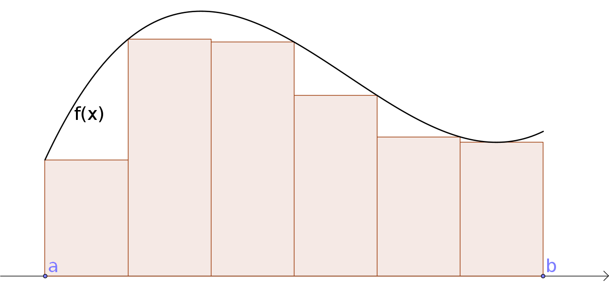

Heildun
=======

.. admonition:: Athugasemd
    :class: athugasemd

	**Nauðsynleg undirstaða**

	- :ref:`Markgildi`. Sjá einnig `undirstöðuatriði um markgildi <https://edbook.hi.is/undirbuningur_stae/kafli10/index.html>`_.

	- :ref:`Afleiður <afleidur>`.  Sjá einnig `undirstöðuatriði um afleiður <https://edbook.hi.is/undirbuningur_stae/kafli11/index.html>`_.

	- :ref:`Reiknireglur fyrir afleiður <reiknireglura>`, sér í lagi :ref:`keðjureglan <kedjuregla>`.

*It can be very dangerous to see things from somebody else's point of view without the proper training.*

\- Douglas Adams, The Ultimate Hitchhiker's Guide : Five Complete Novels and One Story

.. index::
    heildi; jákvæðs falls
    heildi
    heildismörk
    fall; heildanlegt
    flatarmál

.. _heildun:

-----

Heildun
-------

Óformleg skilgreining á heildi jákvæðs falls
~~~~~~~~~~~~~~~~~~~~~~~~~~~~~~~~~~~~~~~~~~~~

Látum :math:`f:[a,b]\rightarrow {{\mathbb  R}}` vera fall þannig að
:math:`f(x)\geq 0` fyrir öll :math:`x\in[a,b]`.

Þegar :hover:`heildið,heildi` :math:`\int_a^b f(x)\,dx` er skilgreint er útkoman úr því
flatarmál svæðisins sem liggur á milli :math:`x`-ás og grafs fallsins
(og afmarkast til vinstri af línunni :math:`x=a` og til hægri af línunni
:math:`x=b`).

Ef heildið :math:`\int_a^b f(x)\,dx` er skilgreint þá segjum við að
fallið :math:`f` sé :hover:`heildanlegt,heildanlegur` yfir bilið :math:`[a,b]`.

Tölurnar :math:`a` og :math:`b` kallast :hover:`heildismörk,heildismark` heildisins.

Skilgreining
~~~~~~~~~~~~

.. admonition:: Skilgreining
    :class: skilgreining

    Látum :math:`f` vera fall. Skilgreinum föllin :math:`f_+` og
    :math:`f_-`, sem bæði hafa sama skilgreiningarsvæði og :math:`f`, með

    .. math::

       f_+(x)=\left\{\begin{array}{ll} f(x) & \text{ef }f(x)\geq 0,\\
         0 & \text{ef }f(x)<0, \end{array} \right. \qquad
         f_-(x)=\left\{\begin{array}{ll} 0 & \text{ef }f(x)\geq 0,\\
         -f(x) & \text{ef }f(x)<0. \end{array}\right.

Athugið að :math:`f(x)=f_+(x)-f_-(x)`.

.. image:: ./myndir/kafli06/01_fplusminus.png
	:align: center
	:width: 75%

Óformleg skilgreining á heildi falls
~~~~~~~~~~~~~~~~~~~~~~~~~~~~~~~~~~~~

Takmarkað fall :math:`f` er *heildanlegt* yfir bilið :math:`[a, b]` ef
bæði föllin :math:`f_+` og :math:`f_-` eru heildanleg yfir bilið
:math:`[a,
b]`. Ef fallið :math:`f` er heildanlegt þá skilgreinum við heildi þess
með formúlunni

.. math:: \int_a^b f(x)\,dx=\int_a^b f_+(x)\,dx-\int_a^b f_-(x)\,dx.

.. admonition:: Athugasemd
    :class: athugasemd

    Flatarmálið sem er undir :math:`x`-ás reiknast neikvætt.

Undir- og yfirsummur
--------------------

Að finna heildi
~~~~~~~~~~~~~~~~~~~~~

Hvernig getum við fundið flatarmálið :math:`\int_a^b f(x)\, dx`?

**Svar:** Við þurfum að nálga flatarmálið með formum sem hafa þekkt
flatarmál, til dæmis rétthyrningum.

.. index::
    undirsumma
    heildun; undirsumma

Skilgreining: Undirsumma
~~~~~~~~~~~~~~~~~~~~~~~~

.. admonition:: Skilgreining
    :class: skilgreining

    Skiptum bilinu :math:`[a,b]` í :math:`n` hlutbil. Á hverju hlutbili komum
    við fyrir rétthyrningi sem liggur undir grafi fallsins, þ.e. hæðin á
    honum er lággildi fallsins á þessum tiltekna hlutbili.

Látum :math:`u_k` vera flatarmál rétthyrninganna, þar sem
:math:`k=1,\ldots,n`.

Við köllum flatarmál allra rétthyrninganna :hover:`undirsummu,undirsumma` fyrir heildið og
táknum hana með :math:`U(n)`, það er :math:`U(n) = \sum_{k=1}^n u_k`.

Þá er augljóslega :math:`U(n) \leq \int_a^b f(x)\, dx`.

Þegar :math:`n` stækkar þá fáum við betri og betri nálgun á heildinu.

.. index::
    yfirsumma
    heildun; yfirsumma

Skilgreining: Yfirsumma
~~~~~~~~~~~~~~~~~~~~~~~

.. admonition:: Skilgreining
    :class: skilgreining

    Skiptum bilinu :math:`[a,b]` í :math:`n` hlutbil. Á hverju hlutbili komum
    við fyrir rétthyrning sem er þannig að hæðin á honum er hágildi fallsins
    á þessum tiltekna hlutbili.

.. image:: ./myndir/kafli06/03_yfirsumma.png
	:align: center
	:width: 75%

Táknum flatarmál hans með :math:`y_k`, þar sem :math:`k=1,\ldots,n`. Við
köllum summu flatarmáls allra rétthyrninganna :hover:`yfirsummu,yfirsumma` fyrir heildið
og táknum hana með :math:`Y(n)`, það er :math:`Y(n) = \sum_{k=1}^n y_k`.

Þá fæst að :math:`\int_a^b f(x)\, dx \leq Y(n)`.

Þegar :math:`n` stækkar þá fáum við betri og betri nálgun á heildinu.

Skilgreining: Heildi
~~~~~~~~~~~~~~~~~~~~

.. admonition:: Skilgreining
    :class: skilgreining

    Ef til er **nákvæmlega ein** tala :math:`I` þannig að

    .. math:: U(n) \leq I \leq Y(n),

    fyrir allar undirsummur :math:`U(n)` og yfirsummur :math:`Y(n)` þá er
    fallið :math:`f` heildanlegt á :math:`[a,b]` og

    .. math:: I = \int_a^b f(x)\, dx.

.. ggb:: pCuJwqEE
    :width: 700
    :height: 400
    :img: ./03_undirogyfirsumma.png
    :imgwidth: 12cm

.. admonition:: Athugasemd
    :class: athugasemd

    Við sögðum ekkert um það hvernig við skiptum bilinu :math:`[a,b]` í
    :math:`n` hlutbil. Það má gera hvernig sem er, það er ekki nauðsynlegt að
    þau séu öll jafn stór. Eina krafan er að stærð allra hlutbila stefni á
    0 þegar :math:`n\to \infty`.

.. admonition:: Athugasemd
    :class: athugasemd

    Við erum ekki bundin af því að skoða rétthyrninga sem með hæð sem er
    há/lággildi fallsins á hverju hlutbili, t.d. má taka miðgildið á hveru
    hlutbili, gildið í hægri endapunkti þess eða gildið í vinstri endapunkti þess.

    Niðurstaðan þegar :math:`n\to \infty` verður hins vegar alltaf sú sama,
    þ.e. við nálgumst heildið.

.. admonition:: Athugasemd
    :class: athugasemd

    Einnig er mögulegt að nálga heildið með öðrum formum en rétthyrningum,
    t.d.trapisum, og hentar það hugsanlega betur í
    tölulegum útreikningum.

Eiginleikar heildisins
----------------------

Setning
~~~~~~~

.. admonition:: Setning
    :class: setning

    (i)  Ef fallið :math:`f` er samfellt á bilinu :math:`[a, b]` þá er
         :math:`f` heildanlegt yfir bilið :math:`[a, b]`.

    (ii) Einhalla fall skilgreint á bili :math:`[a,b]` er heildanlegt.

Setning
~~~~~~~

.. admonition:: Setning
    :class: setning

    Látum :math:`f` vera fall sem er heildanlegt yfir bilið :math:`[a, b]`.
    Þá er

    .. math:: \Big|\int_a^b f(x)\,dx\Big|\leq \int_a^b |f(x)|\,dx.

Skilgreining: Heildismörkunum snúið við
~~~~~~~~~~~~~~~~~~~~~~~~~~~~~~~~~~~~~~~

.. admonition:: Skilgreining
    :class: skilgreining

    Ef fallið :math:`f` er heildanlegt yfir bilið :math:`[a,b]` (hér er
    :math:`a<b`) þá skilgreinum við

    .. math:: \int_b^a f(x)\,dx=-\int_a^b f(x)\,dx.

Setning
~~~~~~~

.. admonition:: Setning
    :class: setning

    Látum :math:`f` vera fall sem er heildanlegt yfir bilin :math:`[a, b]`, :math:`[a, c]` og :math:`[c, b]`. Þá er

    (i)  :math:`\int_a^a f(x)\,dx=0`.
    (ii) :math:`\int_a^b f(x)\,dx=\int_a^c f(x)\,dx+\int_c^b f(x)\,dx`

Setning
~~~~~~~

.. admonition:: Setning
    :class: setning

    Látum :math:`f` og :math:`g` vera föll sem eru heildanleg yfir bilið
    :math:`[a,b]` og látum :math:`A` og :math:`B` vera fasta. Þá er

    .. math:: \int_a^b Af(x)+Bg(x)\,dx=A\int_a^b f(x)\,dx+B\int_a^b g(x)\,dx.

Með öðrum orðum, heildun er línuleg aðgerð.

Setning
~~~~~~~

.. admonition:: Setning
    :class: setning

    Látum :math:`f` vera fall sem er heildanlegt yfir bilið :math:`[a, b]`.
    Gerum ráð fyrir að um öll :math:`x\in [a, b]` gildi að
    :math:`f(x)\geq 0`. Þá er

    .. math:: \int_a^b f(x)\,dx\geq 0.

Fylgisetning
~~~~~~~~~~~~

.. admonition:: Setning
    :class: setning

    (i)  Látum :math:`f` og :math:`g` vera föll sem eru heildanleg yfir
         bilið :math:`[a, b]`. Gerum ráð fyrir að um öll :math:`x\in [a, b]`
         gildi að :math:`f(x)\leq g(x)`. Þá er

         .. math:: \int_a^b f(x)\,dx\leq \int_a^b g(x)\,dx.

    (ii) Látum :math:`f` vera fall sem er heildanlegt yfir bilið
         :math:`[a, b]`. Ef :math:`m` og :math:`M` eru fastar þannig að um
         öll :math:`x\in [a, b]` gildir að :math:`m\leq f(x)\leq M` þá er

         .. math:: m(b-a)= \int_a^b m\,dx \leq  \int_a^b f(x)\,dx \leq \int_a^b M\,dx =M(b-a).

Setning
~~~~~~~

.. admonition:: Setning
    :class: setning

    Látum :math:`f` vera fall sem er heildanlegt yfir bil :math:`[-a, a]`.

    (i)  Ef fallið :math:`f` er oddstætt þá er

         .. math:: \int_{-a}^a f(x)\,dx=0.

    (ii) Ef fallið :math:`f` er jafnstætt þá er

         .. math:: \int_{-a}^a f(x)\,dx=2\int_0^a f(x)\,dx.

.. index::
        fall; meðalgildi

Skilgreining
~~~~~~~~~~~~

.. admonition:: Skilgreining
    :class: skilgreining

    Látum :math:`f` vera fall sem er heildanlegt yfir bilið :math:`[a, b]`.
    :hover:`Meðalgildi,meðalgildi` fallsins :math:`f` á bilinu :math:`[a, b]` er skilgreint
    sem

    .. math:: \bar{f}=\frac{1}{b-a}\int_{a}^b f(x)\,dx.

.. index::
    milligildissetning; fyrir heildi

Setning: Meðalgildissetning fyrir heildi
~~~~~~~~~~~~~~~~~~~~~~~~~~~~~~~~~~~~~~~~

.. admonition:: Setning
    :class: setning

    Gerum ráð fyrir að fallið :math:`f` sé **samfellt** á bilinu
    :math:`[a, b]`. Þá er til punktur :math:`c` í bilinu :math:`[a, b]`
    þannig að

    .. math:: \int_a^b f(x)\,dx=(b-a)f(c).

    Það er að segja, til er punktur :math:`c` í bilinu :math:`[a, b]` þannig
    að :math:`f(c)=\bar{f}`.

Undirstöðusetning stærðfræðigreiningarinnar
-------------------------------------------

.. index::
    fall; skilgreint með heildi

Skilgreining og setning: Fall skilgreint með heildi
~~~~~~~~~~~~~~~~~~~~~~~~~~~~~~~~~~~~~~~~~~~~~~~~~~~

.. admonition:: Skilgreining
    :class: skilgreining

    Látum :math:`f` vera fall sem er heildanlegt yfir bil :math:`[a, b]`.
    Fyrir :math:`x\in[a, b]` skilgreinum við :math:`F(x)=\int_a^x f(t)\,dt`.

.. admonition:: Setning
    :class: setning

    Fallið :math:`F` er samfellt á :math:`[a, b]`.

.. admonition:: Aðvörun
    :class: advorun

    Athugið að :math:`t` er breytan sem er heildað með tilliti til, en
    :math:`x` er haldið föstu á meðan. :math:`t` hverfur svo þegar búið er
    að reikna heildið.

.. index::
    undirstöðusetning stærðfræðigreiningar, fyrri hluti

.. _undirstodusetning-fyrri:

Setning: Undirstöðusetning stærðfræðigreiningar, fyrri hluti
~~~~~~~~~~~~~~~~~~~~~~~~~~~~~~~~~~~~~~~~~~~~~~~~~~~~~~~~~~~~

.. admonition:: Setning
    :class: setning

    Gerum ráð fyrir að fallið :math:`f` sé samfellt á bili :math:`I` og
    :math:`a` sé punktur í :math:`I`. Fyrir :math:`x` í :math:`I`
    skilgreinum við :math:`F(x)=\int_a^x f(t)\,dt`. Þá er fallið :math:`F`
    diffranlegt og

    .. math:: F'(x)=f(x)

    fyrir öll :math:`x\in I`.

.. index::
    stofnfall

Æfingadæmi
~~~~~~~~~~

.. eqt:: daemi-heildun

  **Æfingadæmi**
	Gefið er óeignilega heildið :math:`\int \frac{x+1}{x^2+2x+2} dx`. Hvaða innsetning væri heppileg til að leysa þetta heildi? Hakið við réttan kross.

  A) :eqt:`C` :math:`u=x^2 + 2x + 2` og :math:`du = 2(x+1) dx`.

  #) :eqt:`I` :math:`u=x^2+2x` og :math:`du = 2(x+1) dx`.

  #) :eqt:`I` :math:`u=x^2` og :math:`du = 2x dx`.

  #) :eqt:`I` Ekkert af ofantöldu.

  .. eqt-solution::

		Ef við setjum :math:`u=x^2+2x+2` þá er :math:`du=2(x+1)`. Þetta er heppilegt því nú getum séð að :math:`\tfrac{1}{2} du = (x+1)dx`
		og skrifað heildið sem

		.. math:: \frac{1}{2} \int \frac{1}{u} du

		sem er mun auðveldara að leysa.

Stofnföll
---------

Skilgreining: Stofnfall
~~~~~~~~~~~~~~~~~~~~~~~

.. admonition:: Skilgreining
    :class: skilgreining

    Látum :math:`f` vera fall sem er skilgreint á bili :math:`I`. Fall
    :math:`G` kallast :hover:`stofnfall` fyrir :math:`f` á
    bilinu :math:`I` ef :math:`G'(x)=f(x)` fyrir öll :math:`x` í :math:`I`.

Fylgisetning
~~~~~~~~~~~~

.. admonition:: Setning
    :class: setning

    Látum :math:`f` vera samfellt fall skilgreint á bili :math:`I`. Þá er
    til stofnfall fyrir :math:`f`
    samkvæmt :ref:`fyrri hluta undirstöðustöðusetningarinnar <undirstodusetning-fyrri>`.

Hjálparsetning
~~~~~~~~~~~~~~

.. admonition:: Setning
    :class: setning

    Ef :math:`F` og :math:`G` eru hvor tveggja stofnföll fyrir :math:`f` á
    bilinu :math:`I`, þá er til fasti :math:`C` þannig að
    :math:`F(x)=G(x)+C` fyrir öll :math:`x` í :math:`I`.

.. admonition:: Sönnun
    :class: setning, dropdown

    Þar sem

    .. math:: \frac{d}{dx}(G(x) - F(x)) = G'(x) - F'(x) = f(x) - f(x) = 0

    fyrir öll :math:`x\in I` þá er :math:`G(x)-F(x) = C` fasti.

.. index::
    undirstöðusetning stærðfræðigreiningar, seinni hluti

Setning: Undirstöðusetning stærðfræðigreiningar, seinni hluti
~~~~~~~~~~~~~~~~~~~~~~~~~~~~~~~~~~~~~~~~~~~~~~~~~~~~~~~~~~~~~

.. admonition:: Setning
    :class: setning

    Ef :math:`f` er samfellt fall á bilinu :math:`I` og :math:`G` er
    eitthvert stofnfall fyrir :math:`f` þá er

    .. math:: \int_a^b f(t)\,dt=G(b)-G(a).

.. admonition:: Athugasemd
    :class: athugasemd

    Það skiptir ekki máli hvaða stofnfall er valið í setningunni að ofan,
    heildið er alltaf það sama.

Ritháttur
~~~~~~~~~

Þegar :math:`F` er stofnfall fyrir :math:`f` þá ritum við

.. math:: \int_a^b f(x)\,dx=F(x)\,\bigg|_a^b= F(b)-F(a),

eða

.. math:: \int_a^b f(x)\,dx=\left[F(x)\right]_a^b= F(b)-F(a).

-------

Aðferðir við að reikna stofnföll
--------------------------------

Skilgreiningin á heildi með undir- og yfirsummum er gagnleg til að útskýra
og sanna eiginleika heilda en hún er ekki mjög góð til þess að reikna
heildi. Því er nauðsynlegt að koma sér upp tólum sem henta betur til þess.
Ef þau duga ekki þá þurfum við að grípa til tölulegra reikninga.

Verkfærin
~~~~~~~~~

Helstu tæknilegu aðferðirnar við að finna stofnföll eru:

(i)   :hover:`Innsetning` / breytuskipti.

(ii)  :hover:`Hlutheildun`.

(iii) :hover:`Stofnbrotaliðun`.

Athugasemd
~~~~~~~~~~

.. admonition:: Athugasemd
    :class: athugasemd

    Gerum ráð fyrir að :math:`F` sé stofnfall :math:`f`, þ.e.

    .. math:: F(x)=\int f(t)\,dt.

    Svo að

    .. math:: F'(x)=f(x).

    Látum nú :math:`g` vera fall og skoðum fallið :math:`F\circ g`. Þá fæst
    samkvæmt :ref:`keðjureglunni <kedjuregla>` að

    .. math:: \frac{d}{dx}F(g(x))=F'(g(x))g'(x) = f(g(x))g'(x),

    eða, með því að heilda beggja vegna jafnaðarmerkisins,

    .. math:: F(g(x))+C = \int f(g(x))g'(x)\,dx.

.. index::
    heildun; innsetning

Innsetning
~~~~~~~~~~

Ef við viljum reikna :math:`\int f(g(x))g'(x)\, dx` þá dugar okkur að
geta fundið :math:`\int f(x)\, dx`.

Notkun á innsetningu
~~~~~~~~~~~~~~~~~~~~

Setjum :math:`u=g(x)`. Þá er

.. math:: \frac{du}{dx}=g'(x)\qquad \text{eða} \qquad du=g'(x)\,dx.

Svo

.. math::

   \underbrace{\int f(g(x))g'(x)\,dx}_{\text{Viljum finna}}  =
   \int f(u)\,du
   =
   \underbrace{F(u)+C}_{\text{Getum reiknað}}  =
   \underbrace{F(g(x))+C}_{\text{Svarið}}.

.. admonition:: Aðvörun
    :class: advorun

    Ef við breytum heildi með tilliti til :math:`x` í heildi með tilliti til
    annarar breytistærðar :math:`u` þá verða **öll** :math:`x` að hverfa úr
    heildinu við breytinguna.

Notkun á innsetningu með mörkum
~~~~~~~~~~~~~~~~~~~~~~~~~~~~~~~

Með mörkum þá verður innsetningin svona

.. math::

   \begin{aligned}
     \int_a^b f(g(x))g'(x)\, dx  &=&
     \int_{x=a}^{x=b} f(u)\, du  =
     [F(u)]_{x=a}^{x=b}    \\ &=&
     [F(g(x))]_{x=a}^{x=b}     =
     F(g(b)) - F(g(a)).\end{aligned}

Ef :math:`A=g(a)` og :math:`B=g(b)` þá getum við eins skrifað þetta
svona

.. math::

   \begin{aligned}
   \int_a^b f(g(x))g'(x)\, dx  &=&
   \int_{x=a}^{x=b} f(u)\, du  =
   \int_{A}^{B} f(u)\, du    \\ &=&
   [F(u)]_A^B      =
   F(B) - F(A).\end{aligned}

.. index::
    heildun; öfug innsetning

Öfug innsetning
~~~~~~~~~~~~~~~

Reiknum :math:`\int f(x)\, dx`, með því að finna hugsanlega flóknara
heildi sem við getum reiknað

.. math::
    \int f(g(u))g'(u)\, du.

.. admonition:: Aðvörun
    :class: advorun

    Athugið að hér þurfum við að finna heppilegt :math:`g`. Það
    er ekki alltaf augljóst hvaða :math:`g` er hægt að nota.

Notkun á öfugri innsetningu
~~~~~~~~~~~~~~~~~~~~~~~~~~~

Setjum :math:`x=g(u)`. Þá er

.. math:: \frac{dx}{du}=g'(u)\qquad\quad dx=g'(u)\,du.

Sem gefur að

.. math::

   \underbrace{\int f(x)\,dx}_{\text{Viljum finna}}  =
   \int f(g(u))g'(u)\,du
   =
   \underbrace{F(u) + C}_{\text{Getum reiknað}}
   = \underbrace{F(g^{-1}(x)) + C}_{\text{Svarið}}.

Öfug innsetning með mörkum
~~~~~~~~~~~~~~~~~~~~~~~~~~

Við öfuga innsetningu þarf að passa að breyta mörkunum. Það er

.. math::

   \begin{aligned}
   \int_a^b f(x)\,dx    &= \int_{x=a}^{x=b} f(g(u))g'(u)\,du  \\
   &= [F(u)]_{x=a}^{x=b} = [F(g^{-1}(x))]_a^b = F(g^{-1}(b)) - F(g^{-1}(a)).\end{aligned}

Eða ef :math:`a=g(A)` og :math:`b=g(B)` (það er :math:`g^{-1}(a) = A` og
:math:`g^{-1}(b) = B`),

.. math:: \int_a^b f(x)\,dx  = \int_A^B f(g(u))g'(u)\,du= [F(u)]_A^B = F(B) - F(A).

.. index::
    heildun; hlutheildun

Hlutheildun
~~~~~~~~~~~

Munum að ef :math:`u` og :math:`v` eru föll þá er
:math:`(u\cdot v)' = u'\cdot v + u \cdot v'`.

Notum Undirstöðusetningu stærðfræðigreiningarinnar og heildum beggja
vegna jafnaðarmerkisins, þá fæst

.. math:: u(x)v(x) = \int (u(x)v(x))'\, dx = \int u'(x)v(x)\, dx + \int u(x)v'(x)\, dx.

Það er

.. math:: \int u'(x)v(x)\, dx = u(x)v(x) -  \int u(x)v'(x)\, dx.

Hlutheildun með mörkum
~~~~~~~~~~~~~~~~~~~~~~

Eða með mörkum

.. math:: \int_a^b u'(x)v(x)\, dx = [u(x)v(x)]_a^b -  \int_a^b u(x)v'(x)\, dx.

(Athugið að þá verða engin :math:`x` í svarinu.)

.. index::
    heildun; stofnbrotaliðun
    stofnbrotaliðun

Stofnbrotaliðun
~~~~~~~~~~~~~~~

Ef við viljum heilda rætt fall :math:`\frac{P(x)}{Q(x)}` þar sem :math:`P(x)`
og :math:`Q(x)` eru margliður, getur það reynst þrautinni þyngra, séu margliðurnar
nægilega flóknar. Stofnbrotaliðun gengur út á það að skrifa ræða fallið
:math:`\frac{P(x)}{Q(x)}` sem línulega samantekt liða á forminu

.. math:: \frac{1}{ax+b}, \quad \frac{x}{x^2+bx+c} \quad\text{ og }\quad \frac{1}{x^2+bx+c},

(það er við liðum fallið í stofnbrot sín) því svona liði getum við heildað hvern fyrir sig.

Erfitt er að setja aðferðina **stofnbrotaliðun** fram með einföldum hætti
og er það líkast til best gert með dæmum. Lítum á  nokkrar mismunandi útfærslur
af því hvernig hægt er að liða rætt fall í stofnbrot.

Athugum að margliða :math:`p(x)` er sögð af stigi :math:`n \in \mathbb{N}` ef hana má rita á forminu

.. math:: a_n x^n + a_{n-1} x^{n-1}+ \dots + a_1 x + a_0.

Ef hana má þátta í

.. math:: p(x) = (x-a_1)(x-a_2) \cdot \dots \cdot (x-a_q)

er hún sögð hafa einfaldar núllstöðvar ef um sérhverja núllstöð hennar :math:`a_i` og :math:`a_j` gildir
að :math:`a_i \neq a_j` fyrir öll :math:`i \neq j`. Ef, á hinn bóginn, til eru tvær eða fleiri núllstöðvar sem uppfylla að
:math:`a_i = a_j` þar sem :math:`i \neq j` þá eru þær kallaðar margfaldar núllstöðvar.

Sem dæmi má taka að margliðuna :math:`p(x)=x^2-2x+1` má þátta með samokareglunni í :math:`p(x)=(x-1)(x-1)`
og hefur hún því eina, tvöfalda núllstöð í :math:`x=1`. Hins vegar má þátta margliðuna :math:`q(x)=x^2+5x+6`
í :math:`q(x)=(x+2)(x+3)` og hefur hún því tvær einfaldar núllstöðvar, :math:`x=-2` og :math:`x=-3`.

Dæmi 1 um stofnbrotaliðun
~~~~~~~~~~~~~~~~~~~~~~~~~

Í þessu dæmi er teljarinn er af stigi :math:`m` og nefnarinn af stigi :math:`n>m` með :math:`n` einfaldar núllstöðvar.

.. admonition:: Dæmi
    :class: daemi

    Liðið :math:`\frac{x+4}{x^2-5x+6}` í stofnbrot.

.. admonition:: Lausn
    :class: daemi, dropdown

    Sjá má að teljarinn er margliða af fyrsta stigi
    en nefnarinn margliða af öðru stigi. Jafnframt má þátta nefnarann í :math:`(x-2)(x-3)`
    sem segir okkur að nefnarinn hefur tvær einfaldar núllstöðvar í :math:`x=2` og :math:`x=3`.
    Þá gildir að

    .. math:: \frac{x+4}{x^2-5x+6} = \frac{x+4}{(x-2)(x-3)} = \frac{A}{x-2}+\frac{B}{x-3},

    þar sem sem :math:`A` og :math:`B` eru einhverjar rauntölur. Tökum sérstaklega eftir því
    að fjöldi liða í stofnbrotaliðuninni er jafn stigi nefnarans. Ef :math:`P(x)` er margliða
    af stigi :math:`m` og :math:`Q(x)` er margliða af stigi stigi :math:`n>m` sem hefur
    :math:`n` mismunandi (raungildar) núllstöðvar, sem og að stuðullinn fyrir framan
    :math:`x^n` er :math:`1`, þá gildir almennt fyrir ræða fallið :math:`\frac{P(x)}{Q(x)}` að
    stofnbrotaliðun þess verður

    .. math:: \frac{P(x)}{Q(x)} = \frac{A_1}{x-a_1}+\frac{A_2}{x-a_2}+\dots +\frac{A_n}{x-a_n}.

    Ákvörðum nú gildi fastanna :math:`A` og :math:`B`. Samnefnum brotin í hægri
    hlið jöfnunnar

    .. math:: \frac{x+4}{x^2-5x+6} = \frac{A}{x-2}+\frac{B}{x-3} = \frac{Ax-3A+Bx-2B}{(x-2)(x-3)}.

    Með því að bera saman teljara brotanna, sem staðsett eru sitt hvoru megin jafnaðarmerkisins,
    sjáum við að

    .. math:: x+4 = Ax-3A+Bx-2B.

    Athugum að til þess að þetta sé jafngilt verður að gilda að :math:`Ax+Bx = x` og :math:`-3A-2B=4`.
    Með því að deila í gegnum fyrri jöfnuna með :math:`x` fæst jöfnuhneppið

    .. math::
    	\begin{align*}
    		A+B&=1\\
    		-3A-2B&=4\\
    	\end{align*}

    sem hefur lausnina :math:`A=-6` og :math:`B=7`. Af þessu sést að

    .. math::  \frac{x+4}{x^2-5x+6} = -\frac{6}{x-2}+\frac{7}{x-3}.

Dæmi 2 um stofnbrotaliðun
~~~~~~~~~~~~~~~~~~~~~~~~~

Í þessu dæmi eru teljarinn og nefnarinn af stigi :math:`n` og nefnarinn með :math:`n` einfaldar núllstöðvar.

.. admonition:: Dæmi
    :class: daemi

    Liðið :math:`\frac{x^3+2}{x^3-x}` í stofnbrot.

.. admonition:: Lausn
    :class: daemi, dropdown

    Sjá má að bæði teljari og nefnari eru margliður
    af þriðja stigi. Athugum að með því að bæta núlllið á forminu :math:`+x-x` við teljarann fæst

    .. math:: \frac{x^3-x+x+2}{x^3-x} = \frac{x^3-x}{x^3-x} + \frac{x+2}{x^3-x} = 1 + \frac{x+2}{x^3-x}.

    Fastann 1 þarf ekki að liða frekar. Þar sem að brotið :math:`\frac{x+2}{x^3-x}` hefur teljara af
    lægra stigi en nefnarinn (tveimur lægra nánar til tekið) sem og að nefnarinn hefur þrjár, einfaldar núllstöðvar,
    getum við stofbrotaliðað það með eftirfarandi hætti.

    .. math:: \frac{x+2}{x^3-x} = \frac{x+2}{x(x-1)(x+1)} = \frac{A}{x}+\frac{B}{x-1}+\frac{C}{x-1} = \frac{A(x^2-1)+B(x^2+x)+X(x^2-x)}{x(x-1)(x+1)}

    þar sem síðasti liður jöfnunnar fæst með því að samnefna brot þess næstseinasta.
    Með því að bera saman teljara fyrsta og síðasta liðs jöfnunnar sést að

    .. math:: x+2 = A(x^2-1) + B(x^2+x)+C(x^2-x).

    Ef við margföldum upp úr svigum og drögum saman líka liði fæst að

    .. math:: x+2 = (A+B+C)x^2 +(B-C)x - A.

    Þetta gefur okkurjöfnuhneppið

    .. math::
    	\begin{align*}
    		A+B+C &= 0\\
    		B-C &=1\\
    		-A &= 2\\
    	\end{align*}

    sem hefur lausnina :math:`A=-2`, :math:`B=\frac{3}{2}` og :math:`C=\frac{1}{2}`.
    Af þessu sést að

    .. math:: \frac{x^3+2}{x^3-x} = 1 - \frac{2}{x}+\frac{3}{2(x-1)}+\frac{1}{2(x-1)}.

Dæmi 3 um stofnbrotaliðun
~~~~~~~~~~~~~~~~~~~~~~~~~

Í þessu dæmi er teljarinn af stigi :math:`m` og nefnarinn af stigi :math:`n>m` stigi með :math:`r<n` einfaldar núllstöðvar.

.. admonition:: Dæmi
    :class: daemi

    Liðið :math:`\frac{x^2+3x+2}{x(x^2+1)}` í stofnbrot.

.. admonition:: Lausn
    :class: daemi, dropdown

    Athugum að teljarinn er
    annars stigs margliða en nefnarinn margliða af þriðja stigi. Hér þarf að gæta
    sérstaklega að því að nefnarinn hefur þó einungis eina, einfalda núllstöð
    í :math:`x=0` þar sem að þátturinn :math:`x^2+1` hefur engar (raungildar)
    núllstöðvar. Af þessu leiðir að :math:`\frac{x^2+3x+2}{x(x^2+1)}` má liða í
    stofnbrot á eftirfarandi vegu.

    .. math:: \frac{x^2+3x+2}{x(x^2+1)} = \frac{A}{x}+\frac{Bx+C}{x^2+1} = \frac{A(x^2+1)+Bx^2+Cx}{x(x^2+1)}

    Með svipuðum hætti og áður berum við saman teljara fyrsta brots og síðasta
    brots jöfnunnar. Sjáum að

    .. math:: x^2+3x+2 = A(x^2+1)+Bx^2+Cx.

    Með því að leysa upp úr svigum og draga saman líka liði fæst að

    .. math:: x^2+3x+2 = (A+B)x^2+Cx+A.

    Þetta gefur okkur jöfnuhneppið

    .. math::
    	\begin{align*}
    		A+B &= 1\\
    		C &=3\\
    		A &= 2\\
    	\end{align*}

    sem hefur lausnina :math:`A=2`, :math:`B=-1` og :math:`C=3`. Af þessu sést að

    .. math:: \frac{x^2+3x+2}{x(x^2+1)} = \frac{2}{x} + \frac{-x+3}{x^2+1}.

Dæmi 4 um stofnbrotaliðun
~~~~~~~~~~~~~~~~~~~~~~~~~

Í þessu dæmi er teljarinn af stigi :math:`m` og nefnari af stigi :math:`n>m` stigi með :math:`n` núllstöðvar, þar af einhverjar fjölfaldar.

.. admonition:: Dæmi
    :class: daemi

    Liðið :math:`\frac{1}{x(x-1)^2}` í stofnbrot.

.. admonition:: Lausn
    :class: daemi, dropdown

    Ljóst er að teljari er af hærra stigi
    en nefnarinn og nefnarinn hefur einfalda núllstöð í :math:`x=0` og tvöfalda
    núllstöð í :math:`x=1`. Þá má liða fallið í stofnbrot með eftirfarandi hætti.

    .. math:: \frac{1}{x(x-1)^2} = \frac{A}{x} + \frac{B}{x-1} + \frac{B}{(x-1)^2}.

    Tökum sérstaklega eftir því að núllstöðin :math:`x=1` er tvöföld og því inniheldur
    stofnbrotaliðunin tvo liði með þáttinn :math:`(x-1)` í nefnara,
    annars vegar í fyrsta veldi og hins vegar í öðru veldi. Almennt gildir, fyrir
    sérhverja :math:`r`-falda núllstöð :math:`a` nefnara ræða fallsins
    :math:`\frac{P(x)}{Q(x)}`, að stofnbrotaliðun fallsins mun innihalda

    .. math:: \frac{A_1}{x-a}+\frac{A_2}{(x-a)^2}+\dots + \frac{A_r}{(x-a)^r}

    Með því að samnefna fáum við að

    .. math:: \frac{A}{x} + \frac{B}{x-1} + \frac{B}{(x-1)^2} = \frac{A(x^2-2x+1)+B(x^2-x)+Cx}{x(x-1)^2}.

    Með sambærilegum hætti og áður fæst að

    .. math:: 1 = A(x^2-2x+1)+B(x^2-x)+Cx

    og með því að leysa upp úr svigum og draga saman líka liði fæst

    .. math:: 1 = (A+B) x^2 + (-2A-B+C)x + A.

    Því fæst loks jöfnuhneppið

    .. math::
    	\begin{align*}
    		A+B &= 0\\
    		-2A-B+C &=0\\
    		A &= 1\\
    	\end{align*}

    sem hefur lausnina :math:`A=1`, :math:`B=-1` og :math:`C=1`. Af þessu sést að

    .. math:: \frac{1}{x(x-1)^2} = \frac{1}{x}-\frac{1}{x-1} + \frac{1}{(x-1)^2}

Dæmi 5 um stofnbrotaliðun
~~~~~~~~~~~~~~~~~~~~~~~~~

Í þessu dæmi er teljarinn af stigi :math:`m` og nefnarinn af stigi :math:`n>m` stigi með :math:`r<n` núllstöðvar og núllstöðvalausan þátt í veldinu :math:`q>1`.

.. admonition:: Dæmi
    :class: daemi

    Liðið í :math:`\frac{x^2+2}{4x^5+4x^3+x}` stofnbrot.

.. admonition:: Lausn
    :class: daemi, dropdown

    Hér er stig nefnara hærra en stig teljara
    og má þátta hann í :math:`x(2x^2+1)^2`. Nú er margliðan :math:`2x^2+1` núllstöðvalaus.
    Því má stofnbrotaliða fallið á eftirfarandi vegu.

    .. math:: \frac{x^2+2}{4x^5+4x^3+x} = \frac{A}{x}+\frac{Bx+C}{2x^2+1}+\frac{Dx+E}{(2x^2+1)^2}

    Líkt og áður skulum við veita því sérstakan gaum að þátturinn :math:`(2x^2+1)^2`
    er í öðru veldi og því hefur stofnbrotaliðunin tvo liði þar sem nefnarinn inniheldur
    margliðuna :math:`2x^2+1`, annars vegar í fyrsta veldi og svo hins vegar í öðru
    veldi. Sama almenna regla og áður gildir, ef nefnari fallsins inniheldur núllstöðvalausa
    margliðu :math:`p(x)^n` í nefnara, þar sem :math:`n` er einhver náttúruleg tala,
    þá mun stofnbrotaliðun fallsins innihalda liðina

    .. math:: \frac{A_k}{p(x)^k}, \qquad k=1,2,\dots,n.

    Ef við samnefnum brotin í hægri hlið jöfnunnar fæst

    .. math:: \frac{x^2+2}{4x^5+4x^3+x} = \frac{A(4x^4+4x^2+1)+B(2x^4+x^2)+C(2x^3+x)+Dx^2+Ex}{x(2x^2+1)^2}.

    Við getum nú borið saman teljarana og með því að leysa upp úr svigum og draga saman
    líka liði fæst

    .. math:: x^2+2 = (4A+2B)x^4 + 2Cx^3 + (4A+2B+D)x^2 + (C+E)x+A.

    Því fæst loks jöfnuhneppið

    .. math::
    	\begin{align*}
    		4A+2B &= 0\\
    		2C &=0\\
    		4A+B+D &= 1\\
    		C+E &= 0\\
    		A &= 2\\
    	\end{align*}

    sem hefur lausnina :math:`A=2`, :math:`B=-4`, :math:`C=0`, :math:`D=-3` og :math:`E=0`.
    Af þessu sést að

    .. math:: \frac{x^2+2}{4x^5+4x^3+x} = \frac{2}{x}-\frac{4x}{2x^2+1}-\frac{3x}{(2x^2+1)^2}.

Samantekt
~~~~~~~~~

Líkt og áður segir þá er stofnbrotaliðun notuð fyrir ræð föll sem erfitt getur
reynst að heilda í sínu upprunalega formi. Við stofnbrotaliðun er fallið liðað
í summu minni þátta og má þá heilda hvern þátt fyrir sig og leysa dæmið þannig
í fleiri en einfaldari skrefum.

Nánar er fjallað um stofnbrotaliðun í kafla 6.2 í kennslubókinni.

Sjá einnig `wikipedia síðuna um stofnbrotaliðun <https://en.wikipedia.org/wiki/Partial_fraction_decomposition#Example_3>`__.
Þar má t.a.m. sjá allar aðferðirnar, úr dæmunum hér að ofan, notaðar í einu og sama dæminu.

.. todo::
    bæta við stofnbrotaliðun

.. index::
    heildi; óeiginleg

Æfingadæmi
~~~~~~~~~~

.. eqt:: daemi-stofnbrotalidun

  **Æfingadæmi**
	Gefið er ræða fallið :math:`f(x) = \frac{3x+11}{x^2-x-6}`. Stofbrotaliðun gefur að:

  A) :eqt:`I` :math:`f(x)=\frac{3}{3x-2} - \frac{3}{x+2}`

  #) :eqt:`I` :math:`f(x)=\frac{3+x}{x-3} - \frac{4}{x+2}`

  #) :eqt:`I` :math:`f(x)=\frac{3}{x-3} - \frac{2x+4}{x+2}`

  #) :eqt:`C` :math:`f(x) = \frac{4}{x-3} - \frac{1}{x+2}`

  .. eqt-solution::

		Fylgjum dæmi 6.6.12. (Dæmi 1 um stofnbrotaliðun). Við getum þáttað nefnara fallsins í :math:`(x-3)(x+2)`. Þá fæst að

		.. math:: \frac{3x+11}{(x-3)(x+2)} = \frac{A}{x-3}+\frac{B}{x+2}

		þar sem :math:`A,B \in \mathbb{R}`. Ef við samnefnum nú brotið hægra megin jafnaðarmerkisins fæst
		að

		.. math:: \frac{3x+11}{(x-3)(x+2)} = \frac{A(x+2)+B(x-3)}{(x+2)(x-3)}.

		Af þessu sést að

		.. math:: 3x + 11 = A(x+2)+B(x-3) \iff 3x + 11 = (A+B)x + 2A - 3B.

		Þetta gefur okkur jöfnuhneppið

		.. math::
			\begin{aligned}
				A + B = 3\\
				2A - 3B = 11\\
			\end{aligned}

		sem hefur lausnina :math:`A=4` og :math:`B=-1`. Því fæst að stofnbrot þessa falls séu

		.. math:: f(x) = \frac{4}{x-3} - \frac{1}{x+2}.

-----------

Óeiginleg heildi
----------------

Skilgreining: Óeiginleg heildi I
~~~~~~~~~~~~~~~~~~~~~~~~~~~~~~~~

.. admonition:: Skilgreining
    :class: skilgreining

    Látum :math:`f` vera samfellt fall á bilinu :math:`[a, \infty)`.
    Skilgreinum

    .. math:: \int_a^\infty f(x)\,dx=\lim_{R\rightarrow\infty} \int_a^R f(x)\,dx.

    Fyrir fall :math:`f` sem er samfellt á bili :math:`(-\infty, b]`
    skilgreinum við

    .. math:: \int_{-\infty}^b f(x)\,dx=\lim_{R\rightarrow-\infty} \int_R^b f(x)\,dx.

    Heildi eins og þau hér að ofan kallast :hover:`óeiginlegt heildi`.

Í báðum tilvikum segjum við að óeiginlega heildið sé samleitið ef
markgildið er til, en ósamleitið ef markgildið er ekki til.

.. admonition:: Aðvörun
    :class: advorun

      Ef :math:`f` stefnir ekki á 0 þegar :math:`x\to \infty` þá
      er heildið ekki samleitið. En jafnvel þó fallið stefni á
      0 þá er ekki víst að heildið sé samleitið, samanber
      eftirfarandi dæmi.

Dæmi
~~~~

.. admonition:: Dæmi
    :class: daemi

    Heildið :math:`\int_1^\infty \frac{1}{x^p}\,dx` er samleitið ef
    :math:`p>1` en ósamleitið ef :math:`p\leq 1`.

    Ef :math:`p>1` þá er

    .. math:: \int_1^\infty \frac{1}{x^p}\,dx=\frac{1}{p-1}.

Skilgreining: Óeiginleg heildi I, framhald
~~~~~~~~~~~~~~~~~~~~~~~~~~~~~~~~~~~~~~~~~~

.. admonition:: Skilgreining
    :class: skilgreining

    Látum :math:`f` vera fall sem er samfellt á öllum rauntalnaásnum.

    Heildi af gerðinni :math:`\int_{-\infty}^\infty f(x)\,dx` er sagt
    samleitið ef bæði heildin :math:`\int_{-\infty}^0 f(x)\,dx` og
    :math:`\int_0^\infty f(x)\,dx` eru samleitin og þá er

    .. math::

       \int_{-\infty}^\infty f(x)\,dx=\int_{-\infty}^0 f(x)\,dx +
         \int_0^\infty f(x)\,dx.

.. admonition:: Athugasemd
    :class: athugasemd

    Það skiptir ekki máli í hvaða punkti heildinu er skipt í tvennt, það má
    velja aðra tölu heldur en 0, útkoman verður alltaf sú sama.

Skilgreining: Óeiginleg heildi II
~~~~~~~~~~~~~~~~~~~~~~~~~~~~~~~~~

.. admonition:: Skilgreining
    :class: skilgreining

    Látum :math:`f` vera samfellt fall á bilinu :math:`(a, b]` og hugsanlega
    ótakmarkað í grennd við :math:`a`. Skilgreinum

    .. math:: \int_a^b f(x)\,dx=\lim_{c\rightarrow a^+} \int_c^b f(x)\,dx.

    Fyrir fall :math:`f` sem er samfellt á bili :math:`[a, b)` og hugsanlega
    ótakmarkað í grennd við :math:`b` þá skilgreinum við

    .. math:: \int_a^b f(x)\,dx=\lim_{c\rightarrow b^-} \int_a^c f(x)\,dx.

    Í báðum tilvikum segjum við að óeiginlega heildið sé samleitið ef
    markgildið er til en ósamleitið ef markgildið er ekki til.

Dæmi
~~~~

.. admonition:: Dæmi
    :class: daemi

    Heildið :math:`\int_0^1 \frac{1}{x^p}\,dx` er samleitið ef :math:`p<1`
    en ósamleitið ef :math:`p\geq 1`. Ef :math:`p<1` þá er

    .. math::

       \int_0^1
       \frac{1}{x^p}\,dx=\frac{1}{1-p}.

Skilgreining
~~~~~~~~~~~~

.. admonition:: Skilgreining
    :class: skilgreining

    Látum :math:`f` vera samfellt fall á bili :math:`(a,\infty)` og
    ótakmarkað í grennd við :math:`a`. Látum :math:`c` vera einhverja tölu
    þannig að :math:`a<c<\infty`.

    Heildið :math:`\int_a^\infty f(x)\,dx` er sagt vera samleitið ef bæði
    heildin :math:`\int_a^c f(x)\,dx` og :math:`\int_c^\infty f(x)\,dx` eru
    samleitin og þá er

    .. math:: \int_{a}^\infty f(x)\,dx=\int_{a}^c f(x)\,dx + \int_c^\infty f(x)\,dx.

.. admonition:: Athugasemd
    :class: athugasemd

    Það er sama hvað tala :math:`c` er valin hér að ofan, útkoman verður
    alltaf sú sama.

.. ggb:: 1430547
    :width: 700
    :height: 300
    :img: 07_samleitidheildi.png
    :imgwidth: 12cm

Setning
~~~~~~~

.. admonition:: Setning
    :class: setning

    Látum :math:`-\infty\leq a<b\leq \infty`. Gerum ráð fyrir að föllin
    :math:`f` og :math:`g` séu samfelld á :math:`(a, b)` og að um öll
    :math:`x\in (a, b)` gildi að :math:`0\leq f(x)\leq g(x)`.

    (i)  Ef heildið :math:`\int_a^b g(x)\,dx` er samleitið þá er heildið
         :math:`\int_a^b f(x)\,dx` líka samleitið og

         .. math:: \int_a^b f(x)\,dx \leq \int_a^b g(x)\,dx.

    (ii) Ef heildið :math:`\int_a^b f(x)\,dx` er ósamleitið þá er heildið
         :math:`\int_a^b g(x)\,dx` líka ósamleitið.
