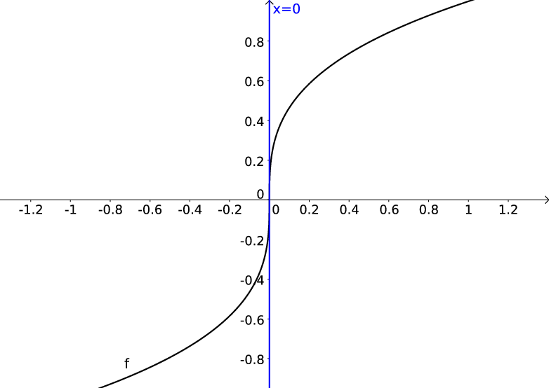
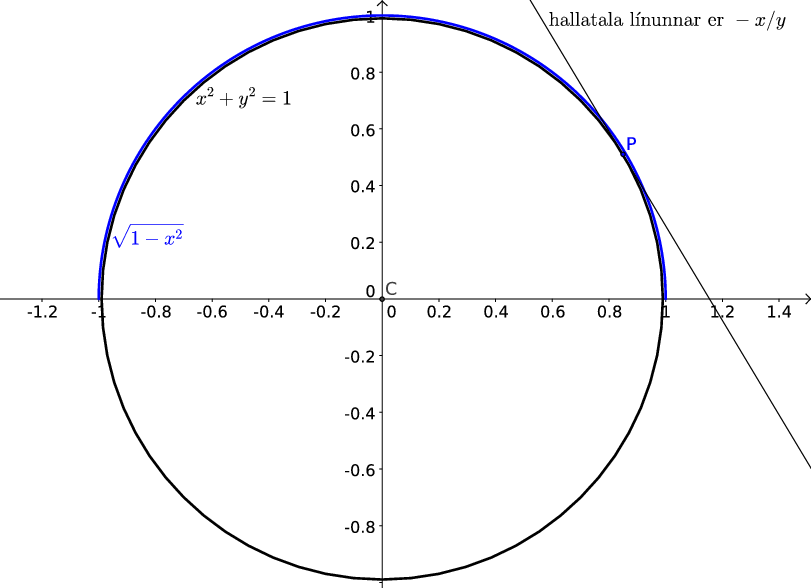

Afleiður
========
.. note::
    **Nauðsynleg undirstaða**

    - :ref:`markgildi`

    - :ref:`samfelldni`

    - :ref:`samskeyting falla <samskeyting>`

    - :ref:`andhverfur falla <andhverfa>`

    - hornaföll, P7

------

.. epigraph::

  *The Quest stands upon the edge of a knife. Stray but a little, and it
  will fail, to the ruin of all. Yet hope remains while the Company is true.*

  \– Galadriel, The Fellowship of the Ring

------

.. index::
    afleiða

.. _afleidur:

Skilgreining á afleiðu
----------------------

Látum :math:`a` vera innri punkt skilgreiningarmengis falls :math:`f`.
:hover:`Afleiða falls,afleiða` :math:`f` *í punkti* :math:`a` er skilgreind sem

.. math:: f'(a)=\lim_{h\rightarrow 0}\frac{f(a+h)-f(a)}{h}.

Ef markgildið er til þá er sagt að fallið :math:`f` sé
:hover:`diffranlegt,diffranlegur` *í
punktinum* :math:`a`, en annars er sagt að fallið sé *ekki diffranlegt í
punktinum* :math:`a`.

Dæmi: afleiða
~~~~~~~~~~~~~

Fallið :math:`f(x) = x^2` er diffranlegt í sérhverjum punkti :math:`a`.
Það sést af því að

.. math::
    \begin{aligned}
    \lim_{h\to 0} \frac{f(a+h)-f(a)}{h}
    &= \lim_{h\to 0} \frac{(a+h)^2-a^2}{h}\\
    &= \lim_{h\to 0} \frac{a^2+2ah+h^2-a^2}{h}\\
    &= \lim_{h\to 0} \frac{2ah+h^2}{h}\\
    &= \lim_{h\to 0} 2a+h = 2a.\end{aligned}

.. ggb:: SUnNEmTG
    :width: 700
    :height: 500
    :img: ./01_afleida.png
    :imgwidth: 12cm

Setning: Diffranleiki í punkti
~~~~~~~~~~~~~~~~~~~~~~~~~~~~~~

Ef fall :math:`f` er diffranlegt í punkti :math:`c` þá er :math:`f`
samfellt í punktinum :math:`c`.

.. warning::
    Fall getur verið samfellt í punkti :math:`c` án þess að það sé
    diffranlegt í :math:`c`.

Dæmi: Diffranleiki í punkti
~~~~~~~~~~~~~~~~~~~~~~~~~~~

Fallið :math:`f(x) = |x|` er samfellt. En það er ekki diffranlegt í
punktinum :math:`x=0`. Það sést af því að

.. math::
    \lim_{h\to 0^+} \frac{f(0+h)-f(0)}{h} = \lim_{h\to 0^+} \frac{|h|}{h} = 1

en

.. math::
    \lim_{h\to 0^-} \frac{f(0+h)-f(0)}{h} = \lim_{h\to 0^-} \frac{|h|}{h} = -1.

Þannig að markgildið :math:`\lim_{h\to 0} \frac{f(0+h)-f(0)}{h}` er ekki til og því er
fallið ekki diffranlegt í :math:`x=0`.

.. index::
    snertill
    sniðill
    seealso: snertill; sniðill
    seealso: sniðill; snertill

Snertill
~~~~~~~~

Afleiðu falls :math:`f` í punktinum :math:`a` fæst með því að taka
:hover:`sniðil,sniðill` í gegnum punktana :math:`(a,f(a))` og :math:`(a+h,f(a+h))`, og
láta svo :math:`h` stefna á :math:`0`.

Þetta gefur hallatölu :hover:`snertilsins,snertill` við graf fallsins í punktinum
:math:`(a,f(a))`

Jafna snertils við graf fallsins í punktingum :math:`a` er línan

.. math:: y = f'(a)(x-a) + f(a).

.. ggb:: 1425869
    :width: 700
    :height: 400
    :img: ./01_05_snertill.png
    :imgwidth: 12cm
    :zoom_drag: true

Athugasemd: Hallatalan :math:`\infty` er ekki leyfð
~~~~~~~~~~~~~~~~~~~~~~~~~~~~~~~~~~~~~~~~~~~~~~~~~~~

Við leyfum ekki :math:`f'(a) = \infty` eða
:math:`f'(a) = -\infty`. Samanber
:math:`f(x) = x^{\frac 13}` í :math:`a=0`,

.. math::

   \lim_{h \to 0} \frac{f(0+h)-f(0)}h =
	\lim_{h \to 0} \frac{h^{\frac 13}}h =
       \lim_{h \to 0} h^{-\frac 23} = \infty.

Hér ætti því jafna snertilsins að vera :math:`x=0`.

Við viljum að snertillinn sé nálgun við graf fallsins fyrir :math:`x` nálægt
:math:`a`, lóðrétt lína er gagnslaus nálgun því hún er ekki skilgreind sem
fall af :math:`x`.

-------

Afleiða sem fall
-----------------

Útvíkkun fyrir lokuð bil
~~~~~~~~~~~~~~~~~~~~~~~~

Ef fallið :math:`f` er skilgreint á lokuðu bili þá getum við skilgreint
afleiðuna í endapunktunum með því að taka markgildi frá hægri/vinstri
eftir því sem við á.

.. index::
    afleiða; hægri/vinstri

Skilgreining: Hægri/vinstri afleiða
~~~~~~~~~~~~~~~~~~~~~~~~~~~~~~~~~~~

(i)  *Hægri afleiða falls* :math:`f` *í punkti* :math:`x` er skilgreind
     sem

     .. math:: f_+'(x)=\lim_{h\rightarrow 0^+}\frac{f(x+h)-f(x)}{h}.

(ii) *Vinstri afleiða falls* :math:`f` *í punkti* :math:`x` er
     skilgreind sem

     .. math:: f_-'(x)=\lim_{h\rightarrow 0^-}\frac{f(x+h)-f(x)}{h}.

Setning
~~~~~~~

Ef :math:`x` er innri punktur í skilgreiningarmengi fallsins :math:`f`
þá er :math:`f` diffranlegt í :math:`x` þá og því aðeins að

.. math::

   f_+'(x)=\lim_{h\rightarrow 0^+}\frac{f(x+h)-f(x)}{h}
   =   f_-'(x)=\lim_{h\rightarrow 0^-}\frac{f(x+h)-f(x)}{h},

og þá er :math:`f'(x)` jafnt og markgildin hér fyrir ofan.

.. note::

  Hægt er að túlka afleiðu falls sem fall í sínum eigin rétti. Lauslega er þá talað um
  að fallið :math:`f(x)` sé diffranlegt ef til er fall :math:`f'(x)` þar sem
  það að skipta út breytunni :math:`x` fyrir einhvern innripunkt :math:`a` í skilgreiningarmengi
  :math:`f` gefur afleiðuna í punktinu :math:`a`. Til þess að skilgreiningin haldi
  vatni endanlega þarf svo að leyfa hægri/vinstri afleiður í jaðarpunktum skilgreiningarmengisins.

  .. index::
      afleiða; diffranlegt fall

Skilgreining: Diffranlegt fall
~~~~~~~~~~~~~~~~~~~~~~~~~~~~~~

Látum :math:`f` vera fall með skilgreiningarmengi :math:`A`. Gerum ráð
fyrir að :math:`A` sé sammengi endanlega margra bila. Við segjum að
fallið :math:`f` sé *diffranlegt* ef það er diffranlegt í öllum innri
punktum :math:`A` og diffranlegt frá vinstri/hægri í jaðarpunktum
:math:`A` eftir því sem við á.

Ritháttur
~~~~~~~~~

Afleiða falls :math:`f` er ýmist táknuð með

.. math:: f', \qquad \frac {df}{dx}, \qquad D_x f \qquad \text{eða} \qquad Df.

Ef við skrifum :math:`y=f(x)` þá má einnig tákna hana með

.. math:: y', \qquad \frac {dy}{dx}, \qquad D_x y \qquad \text{eða} \qquad Dy.

.. warning::
  Enn og aftur er túlkun bókarinnar á hugtakinu diffranlegt fall örlítið lausari
  í reipunum en sú sem er notuð hérna. Hún virkar ágætlega fyrir afleiður í
  öllum innri punktum skilgreiningarmengisins en athugar ekki hvað gerist í
  jaðarpunktum þess.

Dæmi
~~~~

Fallið :math:`f(x) = \sqrt{x}`, :math:`f:[0,\infty[\to {{\mathbb  R}}`
er diffranlegt á menginu :math:`]0,\infty[` og afleiðan er gefin með
:math:`f'(x) = \frac 1{2\sqrt{x}} = \frac 12 x^{-1/2}` þar. Hins vegar
er :math:`f` ekki diffranlegt í :math:`x=0` þrátt fyrir að fallgildið sé
vel skilgreint (og fallið samfellt frá hægri) þar.

Ef :math:`x>0` þá fæst

.. math::

   \begin{aligned}
     \lim_{h\to 0} \frac{\sqrt{x+h}-\sqrt{x}}h &=
     \lim_{h\to 0} \frac{(\sqrt{x+h}-\sqrt{x})(\sqrt{x+h}+\sqrt{x})}{h(\sqrt{x+h}+\sqrt{x})}\\
     &= \lim_{h\to 0} \frac{\sqrt{x+h}^2-\sqrt{x}^2}{h(\sqrt{x+h}+\sqrt{x})}\\
     &= \lim_{h\to 0} \frac{x+h-x}{h(\sqrt{x+h}+\sqrt{x})}\\
     &= \lim_{h\to 0} \frac{1}{\sqrt{x+h}+\sqrt{x}} = \frac{1}{2\sqrt{x}},\end{aligned}

sem segir okkur að :math:`f'(x) = \frac 12 x^{-1/2}`.

Í vinstri endapunkti skilgreingarsvæðisins, :math:`x=0`, þá fæst hins
vegar

.. math::

   \begin{aligned}
     \lim_{h\to 0^+} \frac{\sqrt{h}-\sqrt{0}}h &=
     \lim_{h\to 0^+} \frac{\sqrt{h}}h\\
     &= \lim_{h\to 0^+} \frac{1}{\sqrt{h}} = \infty,\end{aligned}

sem sýnir að fallið er ekki diffranlegt frá hægri í :math:`x=0`.

Hærri afleiður
~~~~~~~~~~~~~~

Skilgreining: Hærri afleiður
^^^^^^^^^^^^^^^^^^^^^^^^^^^^

Látum :math:`f` vera fall. *Afleiðan* :math:`f'` er fall sem skilgreint er
í öllum punktum þar sem :math:`f` er diffranlegt.

Ef fallið :math:`f'` er diffranlegt í punkti :math:`x` þá er afleiða
:math:`f'` í punktinum :math:`x` táknuð með :math:`f''(x)` og kölluð
:hover:`önnur afleiða` :math:`f` í punktinum :math:`x`. Líta má á aðra afleiðu
:math:`f` sem fall :math:`f''` sem er skilgreint í öllum punktum þar sem
:math:`f'` er diffranlegt.

Almennt má skilgreina :math:`n`\ *-tu afleiðu* :math:`f`, táknaða með
:math:`f^{(n)}`, þannig að í þeim punktum :math:`x` þar sem fallið
:math:`f^{(n-1)}` er diffranlegt þá er
:math:`f^{(n)}(x)=\frac{d}{dx}f^{(n-1)}(x)`.

Dæmi: Hærri afleiður
^^^^^^^^^^^^^^^^^^^^

Ef :math:`f(x)  = 3x^2`, þá er

.. math:: f'(x) = 3\frac{d}{dx}x^2 = 3\cdot 2x = 6x

og

.. math:: f''(x) = \frac{d}{dx} 6x = 6.

Ritháttur
^^^^^^^^^

Ritum :math:`y=f(x)`.

Þá má tákna fyrstu afleiðu :math:`f` með

.. math:: y'= f'(x)=\frac{d}{dx}f(x)=D_xf(x)\ =\ D_x y= \frac{dy}{dx},

aðra afleiðuna með

.. math::

   \begin{aligned}
   y'' &=
   f''(x)=\frac{d}{dx}f'(x)=\frac{d}{dx}\frac{d}{dx}f(x)
   = D^2_xf(x)= D^2_x y=\frac{d^2}{dx^2}f(x)=\frac{d^2 y}{dx^2}\end{aligned}

og almennt :math:`n`-tu afleiðuna

.. math::

   \begin{aligned}
   y^{(n)} &= f^{(n)}(x)=\frac{d}{dx}f^{(n-1)}(x)=
   \frac{d}{dx}\Big(\frac{d^{n-1}}{dx^{n-1}}f(x)\Big) \\
   &=D^n_xf(x)\ =\ D^n_x y
   =\frac{d^n}{dx^n}f(x)
   = \frac{d^n y}{dx^n}.\end{aligned}

.. note::
    Venja er að rita :math:`f'''` til að tákna þriðju afleiðu :math:`f` en
    afar sjaldgæft að :math:`f''''` sé notað til að tákna fjórðu afleiðu
    :math:`f` og mun algengara að nota :math:`f^{(4)}`.

--------

Reiknireglur
------------

.. _`Setning 3.3.1`:

Setning: Reiknireglur fyrir diffranleg föll
~~~~~~~~~~~~~~~~~~~~~~~~~~~~~~~~~~~~~~~~~~~~

Látum :math:`f` og :math:`g` vera föll sem eru diffranleg í punkti
:math:`x`. Þá eru föllin :math:`f+g,\ f-g, kf` (þar sem :math:`k` er
fasti) og :math:`fg` diffranleg í punktinum :math:`x`, og ef
:math:`g(x)\neq 0` þá eru föllin :math:`1/g` og :math:`f/g` líka
diffranleg í :math:`x`.

.. note::

  Eftirfarandi formúlur gilda um afleiður fallanna sem talin eru upp hér
  að framan:

    #. :math:`\frac{d}{dx} c=0, c \in \mathbb{R}`

    #. :math:`\frac{d}{dx} x^n = nx^{n-1}, n \in \mathbb{Z}`

    #. :math:`(f+g)'(x)=f'(x)+g'(x)`

    #. :math:`(f-g)'(x)=f'(x)-g'(x)`

    #. :math:`(kf)'(x)=kf'(x)`, þar sem :math:`k` er fasti

    #. :math:`(fg)'(x)=f'(x)g(x)+f(x)g'(x)`

    #. :math:`\left(\frac{1}{g}\right)'(x)=\frac{-g'(x)}{g(x)^2}`, ef :math:`g(x)\neq 0`

    #. :math:`\left(\frac{f}{g}\right)'(x)= \frac{f'(x)g(x)-f(x)g'(x)}{g(x)^2}`, ef :math:`g(x)\neq 0`

.. _`Setning 3.3.2`:

Dæmi: Nokkrar afleiður
~~~~~~~~~~~~~~~~~~~~~~

(i)   :math:`\frac{d}{dx} 1 =  \lim_{h\to 0} \frac{1-1}h = 0`

(ii)  :math:`\frac{d}{dx} x =  \lim_{h\to 0} \frac{x+h-x}h = 1`

(iii) :math:`\frac{d}{dx} x^2 = \lim_{h\to 0} \frac{x^2+2xh+h^2-x^2}h
      = \lim_{h\to 0} \frac{2xh + h^2}h = \lim_{h\to 0} 2x+h= 2x`

Afleiður margliða
~~~~~~~~~~~~~~~~~

Með því að nota setningarnar að ofan þá eigum við ekki í neinum
vandræðum með að diffra margliður. `Setning 3.3.1`_ (i) segir
að við getum diffrað hvern lið fyrir sig, liður (iii) í sömu setningu
segir að við getum tekið fastana fram fyrir afleiðuna og loks segir
Sama setning segir hvernig við diffrum :math:`x^n`.

Dæmi: Afleiða margliðu
~~~~~~~~~~~~~~~~~~~~~~

Finnum afleiðu margliðunnar :math:`p(x) = 4x^3-2x + 5`. Nú er

.. math::

   \begin{aligned}
   \frac{d}{dx} p(x)
   &= \frac{d}{dx}4x^3 - \frac{d}{dx}2x + \frac{d}{dx}5 \\
   &= 4\frac{d}{dx}x^3 -2\frac{d}{dx}x + \frac{d}{dx}5 =
   4\cdot 3x^2 -2\cdot 1 + 0 = 12x^2-2\end{aligned}

--------

Afleiður hornafallanna
----------------------

Kósínus og sínus
~~~~~~~~~~~~~~~~

Setning: Afleiða kósínus og sínus
^^^^^^^^^^^^^^^^^^^^^^^^^^^^^^^^^

.. note::

  Hornaföllin kósínus og sínus eiga sér eftirfarandi afleiður:

  #. :math:`\frac{d}{dx} \sin(x) = \cos(x)`

  #. :math:`\frac{d}{dx} \cos(x) = -\sin(x)`

Dæmi: Afleiða sínus
^^^^^^^^^^^^^^^^^^^

Við viljum finna afleiðu fallsins :math:`f(x)=5x^3\sin(x)`. Við beitum margföldunarreglunni
fyrir afleiður, þ.e. regla 3.1.1.6 auk reglunnar hér að ofan um afleiðu sínus og fáum að

.. math::
  \begin{aligned}
    \frac{d}{dx} (5x^3+\sin(x)) &= \frac{d}{dx} (5x^3) \cdot \sin(x) + (5x^3) \cdot \frac{d}{dx} \sin(x)\\
    &= 15 x^2 \sin(x) + 5x^3\cos(x)
  \end{aligned}

Afleiða tangens
~~~~~~~~~~~~~~~

Setning: Afleiða tangens
^^^^^^^^^^^^^^^^^^^^^^^^

.. note::

  Tangens á sér eftirfarandi afleiðu:

  .. math:: \frac{d}{dx} \tan(x) = \frac{1}{\cos^2(x)}

Dæmi: Afleiða tangens
^^^^^^^^^^^^^^^^^^^^^

Við viljum finna afleiðu fallsins :math:`f(x)=\cos(x)+\tan(x)`. Notum reglu 3.3.1.3
og fáum að

.. math::
  \frac{d}{dx}(\tan(x)+\cos(x)) = \frac{1}{\cos^2(x)}-\sin(x)

.. index::
    keðjureglan

.. _kedjuregla:

--------

Keðjureglan
------------

Setning: Keðjureglan
~~~~~~~~~~~~~~~~~~~~~

Gerum ráð fyrir að :math:`f` og :math:`g` séu föll þannig að :math:`g`
er diffranlegt í :math:`x` og :math:`f` er diffranlegt í :math:`g(x)`.
Þá er samskeytingin :math:`f\circ g` diffranleg í :math:`x` og

.. math:: (f\circ g)'(x) = f'(g(x))\cdot g'(x).

Dæmi
~~~~

Skoðum föllin :math:`f(x) = \sqrt x` og :math:`g(x) = 3x^5`. Bæði þessi föll eru
diffranleg og afleiðurnar eru :math:`f'(x) = \frac 12 x^{-1/2}` og
:math:`g'(x) = 15x^4`. Afleiða samskeytingarinnar :math:`f\circ g` er þá
samkvæmt keðjureglunni

.. math::
        (f\circ g)'(x) = \frac 12 (3x^5)^{-1/2} \cdot 15x^4.

--------

Andhverf föll
-------------

Rifjum upp að gagntæk vörpun :math:`f:X\to Y` hefur andhverfu
:math:`f^{-1}:Y\to X` sem uppfyllir að

.. math:: y=f(x)\qquad\text{þá og því aðeins að}\qquad x=f^{-1}(y).

Sjá :ref:`kafla 1.4 <andhverfa>`.

Athugasemd
~~~~~~~~~~

Látum :math:`f:X \to Y` vera fall sem skilgreint er á mengi :math:`X`. Gerum ráð
fyrir að :math:`f` sé eintækt. Með því að einskorða bakmengi :math:`f` við
myndmengið :math:`\tilde Y = f(X)` þá verður :math:`f:X\to \tilde Y` gagntækt fall.
Þá er til andhverfa :math:`f^{-1}:\tilde Y \to X` sem uppfyllir

.. math:: y=f(x)\qquad\text{þá og því aðeins að}\qquad x=f^{-1}(y).

Setning
~~~~~~~

Fall sem er strangt vaxandi eða strangt minnkandi er eintækt og á sér
því andhverfu.

Eiginleikar
~~~~~~~~~~~

(i)    :math:`y=f^{-1}(x)` þá og því aðeins að :math:`x=f(y)`.

(ii)   Skilgreingarsvæði :math:`f` er myndmengi :math:`f^{-1}`.

(iii)  Myndmengi :math:`f^{-1}` er jafnt skilgreiningarmengi :math:`f`.

(iv)   :math:`f^{-1}(f(x))=x` fyrir öll :math:`x` í skilgreiningarmengi
       :math:`f`.

(v)    :math:`f(f^{-1}(x))=x` fyrir öll :math:`x` í skilgreiningarmengi
       :math:`f^{-1}`.

(vi)   :math:`(f^{-1})^{-1}(x)=f(x)` fyrir öll :math:`x` í
       skilgreiningarmengi :math:`f`, alltsvo :math:`(f^{-1})^{-1}=f`.

(vii)  Graf :math:`f^{-1}` er speglun á grafi :math:`f` um línuna
       :math:`y=x`.

.. index::
    afleiða; andhverfa

Setning: Afleiða andhverfunnar
~~~~~~~~~~~~~~~~~~~~~~~~~~~~~~

Gerum ráð fyrir að fall :math:`f` hafi andhverfu :math:`f^{-1}`. Látum
:math:`x` vera á skilgreiningarmengi :math:`f` og gerum ráð fyrir að
:math:`f` sé diffranlegt í punktinum :math:`f^{-1}(x)` og að
:math:`f'(f^{-1}(x)) \neq 0`. Þá er :math:`f^{-1}` diffranlegt í
punktinum :math:`x` og

.. math:: \left(f^{-1}\right)'(x)=\frac{1}{f'(f^{-1}(x))}

.. note::
    Setningin segir okkur sér í lagi að láréttur snertill við :math:`f`
    svarar til lóðrétts snertils við :math:`f^{-1}`.

--------

Fólgin diffrun
--------------

Dæmi
~~~~

Jafna hrings með geisla 1 og miðju í (0,0) er :math:`x^2+y^2=1`. Við vitum að hægt er að
skrifa efri og neðri helminga hans sem föll af :math:`y`, annars vegar
:math:`y=\sqrt{1-x^2}` og hins vegar :math:`y=-\sqrt{1-x^2}`. Ef við
viljum finna snertil við hringinn getum við notað þessi föll. En þar sem
við vitum að hægt er að skrifa :math:`y` sem fall af :math:`x` þá getum
við einnig diffrað jöfnu hringsins beint með aðstoð keðjureglunnar,

.. math::

   \begin{aligned}
   \frac{d}{dx}(x^2+y^2) &=& \frac{d}{dx} 1\\
       2x + 2y\frac{dy}{dx} &=& 0\\
       y\frac{dy}{dx} &=& -x\\
       \frac{dy}{dx} &=& -\frac xy.\end{aligned}

Setning: Andhverfusetningin
~~~~~~~~~~~~~~~~~~~~~~~~~~~

Látum feril vera gefinn með :math:`F(x,y) =0`, þar sem :math:`F` er
diffranlegt í bæði :math:`x` og :math:`y`. Í punktum þar sem *snertill*
ferilsins er ekki lóðréttur (þ.e. :math:`\frac{d}{dy}F \neq 0`) þá er hægt að
skrifa :math:`y` sem fall af :math:`x` og þá fæst af keðjureglunni að

.. math:: \frac{d}{dx} F(x,y) + \frac{d}{dy}F(x,y) \frac{dy}{dx} = 0,

þ.e.

.. math:: \frac{dy}{dx} = -\frac{\frac{d}{dx} F(x,y)}{\frac{d}{dy} F(x,y)}.

Sjá https://en.wikipedia.org/wiki/Inverse_function_theorem

Með öðrum orðum
~~~~~~~~~~~~~~~

Það kemur í sama stað niður að einangra :math:`y=f(x)`, ef það er
mögulegt, og finna :math:`y'` með því að diffra, eins og að diffra
:math:`F(x,y)=0` og einangra svo :math:`y'=\frac{dy}{dx}`.

Vinnulag
~~~~~~~~

(i)     Diffrum báðar hliðar jöfnunar með tilliti til :math:`x`, og lítum á
        :math:`y` sem fall af :math:`x` sem við diffrum með aðstoð
        keðjureglunnar (og gleymum ekki :math:`y'`)

(ii)    Einangrum :math:`y'`

(iii)   Skiptum :math:`y` út fyrir :math:`f(x)`.

Setning: Hagnýting á fólginni diffrun
~~~~~~~~~~~~~~~~~~~~~~~~~~~~~~~~~~~~~

Ef :math:`n` og :math:`m` eru heilar tölur þá er

.. math:: \frac{d}{dx} x^{\frac nm} = \frac nm x^{\frac nm -1}.

------

Afleiður logra og vísisfalla
-----------------------------

Setning: Afleiður logra og vísisfalla
~~~~~~~~~~~~~~~~~~~~~~~~~~~~~~~~~~~~~

.. note::

  Eftirfarandi gildir um afleiður logra og vísisfalla:

  #. :math:`\frac{d}{dx} e^x = e^x`

  #. :math:`\frac{d}{dx} e^{g(x)}=g'(x)e^x`

  #. :math:`\frac{d}{dx} \ln(x) = \frac{1}{x}`

  #. :math:`\frac{d}{dx} \ln(g(x)) = \frac{1}{x}g'(x)`

  #. :math:`\frac{d}{dx} b^x = b^x \ln(b)`

  #. :math:`\frac{d}{dx} b^{g(x)} = b^{g(x)}g'(x)\ln(b)`

  #. :math:`\frac{d}{dx} \log_b(x) = \frac{1}{x\ln(b)}`

  #. :math:`\frac{d}{dx} \log_b(g(x))=\frac{g'(x)}{g(x)\ln(b)}`

--------

Dæmi: Afleiða vísisfalls
~~~~~~~~~~~~~~~~~~~~~~~~

Við viljum finna afleiðu fallsins :math:`f(x)=3^x`. Samkvæmt reglu 5 hér að ofan
fæst

.. math::
  \begin{align}
    f'(x) &= \frac{d}{dx} 3^x\\
    &= 3^x\ln(3).
  \end{align}

Dæmi: Afleiða lografalls
~~~~~~~~~~~~~~~~~~~~~~~~

Við viljum finna afleiðu fallsins :math:`g(x)=\log_2(x^3)`. Samkvæmt reglu 8 hér
að ofan fæst

.. math::
  \begin{align}
    g'(x) &= \frac{d}{dx} \log_2(x^3)\\
    &= \frac{3x^2}{x^3\ln(2)}.
  \end{align}
