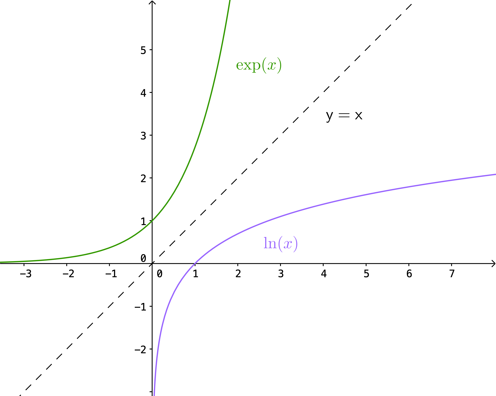

Hagnýting á heildun
===================

.. admonition:: Nauðsynleg undirstaða
	:class: athugasemd

	- Föll

	- Afleiður

	- Heildun

------

.. epigraph::

  *It is a comfort not to be mistaken at all points. Do I not know it only too well!*

  \– Gandalf, The Two Towers

------

Flatarmál svæða
----------------

Setning: Flatarmál milli tveggja ferla
~~~~~~~~~~~~~~~~~~~~~~~~~~~~~~~~~~~~~~~

.. admonition:: Setning
  :class: setning

	Gerum ráð fyrir að :math:`f(x)` og :math:`g(x)` séu samfelld föll þannig að
	:math:`f(x)\geq g(x)` á bilinu :math:`[a,b]`. Látum :math:`R` tákna svæðið sem afmarkast
	af ferlum fallanna tveggja og línanna :math:`x=a` og :math:`x=b`. Þá má reikna
	flatarmál svæðiðsins :math:`R` með

	.. math:: A = \int_a^b (f(x)-g(x)) dx.

	.. image:: ./myndir/kafli06/PMA_flatarmal_milli_tveggja_ferla.png
		:align: center
		:width: 75%

Dæmi: Flatarmál milli tveggja ferla
~~~~~~~~~~~~~~~~~~~~~~~~~~~~~~~~~~~~

.. admonition:: Dæmi
  :class: daemi

	Látum :math:`R` vera svæði sem er takmarkað að ofan af fallinu :math:`f(x)=x+4` og
	að neðan af :math:`g(x)=3-\frac{x}{2}` á bilinu :math:`[1,4]`. Finnum flatarmál
	:math:`R`.

.. admonition:: Lausn
  :class: daemi, dropdown

	Samkvæmt setningunni hér að ofan fæst að

	.. math:: A = \int_1^4 \left(x+4 - \left(3 - \frac{x}{2}\right)\right) dx = \int_1^4 \frac{3}{2}x +1 dx = \left[ \frac{3}{4}x^4 + x \right]_1^4 = 16 - \frac{7}{4} = \frac{57}{4}

	Svo flatarmál svæðisins er :math:`\frac{57}{4}` fereiningar.

Setning: Flatarmál samsettra svæða
~~~~~~~~~~~~~~~~~~~~~~~~~~~~~~~~~~~

.. admonition:: Setning
  :class: setning

	Gerum ráð fyrir því að :math:`f(x)` og :math:`g(x)` séu samfelld á bilinu
	:math:`[a,b]`. Látum :math:`R` tákna svæðið sem myndast milli grafa fallanna og
	er afmarkað af línunum :math:`x=a` og :math:`x=b`. Þá má reikna flatarmál svæðiðisins
	:math:`R` með

	.. math:: A = \int_a^b |f(x)-g(x)| dx.

	.. image:: ./myndir/kafli06/PMA_flatarmal_samsettra_svaeda.png
		:align: center
		:width: 75%

Dæmi: Flatarmál samsettra svæða
~~~~~~~~~~~~~~~~~~~~~~~~~~~~~~~~

.. admonition:: Dæmi
  :class: daemi

	Látum :math:`R` vera svæðið sem myndast milli grafa fallanna :math:`f(x)=\sin(x)`
	og :math:`f(x)=\cos(x)` á bilinu :math:`[0,\pi]`. Finnum flatarmál svæðisins :math:`R`.

.. admonition:: Lausn
  :class: daemi, dropdown

	Samkvæmt setningunni hér að ofan er flatarmál :math:`R`

	.. math:: A = \int_0^\pi |\cos(x)-\sin(x)|.

	Athugum að á bilinu :math:`[0,\frac{\pi}{4}]` gildir að :math:`g(x)\geq f(x)`
	en á bilinu :math:`[\frac{\pi}{4},\pi]` gildir að :math:`f(x)\geq g(x)`. Við
	getum því skipt heildinu í tvennt þannig að

	.. math:: A = \int_0^{\pi/4} (\cos(x)-\sin(x) )dx +  \int_{\pi/4}^{\pi} (\sin(x)-\cos(x)) dx.

	Metum nú heildið og fáum

	.. math:: = \left[\cos(x)-\sin(x) \right]_0^{\pi/4} + \left[\sin(x)-\cos(x) \right]_{\pi/4}^\pi = 2\sqrt{2}.

	Svæðið :math:`R` er því :math:`2\sqrt{2}` fereiningar.

Setning: Heildað m.t.t. :math:`y`
~~~~~~~~~~~~~~~~~~~~~~~~~~~~~~~~~~

.. admonition:: Setning
  :class: setning

	Látum :math:`u(y)` og :math:`v(y)` vera samfelld föll þannig að :math:`u(y) \geq v(y)`.
	Látum :math:`R` tákna svæðið sem afmarkast af gröfum fallanna og línunum :math:`y=d`
	og :math:`y=c`. Þá má reikna flatarmál svæðisins :math:`R` með

	.. math:: A = \int_C^d (u(y)-v(y)) dy.

Dæmi: Heildað m.t.t. :math:`y`
~~~~~~~~~~~~~~~~~~~~~~~~~~~~~~

.. admonition:: Dæmi
  :class: daemi

	Látum :math:`v(y)=\sqrt{y}` og :math:`u(y)=2-y`. Finnum flatarmálið sem myndast
	á milli ferla fallanna á bilinu :math:`[0,1]`.

.. admonition:: Lausn
  :class: daemi, dropdown

	Þar sem línan :math:`2-y` liggur hægra megin við feril fallsins :math:`\sqrt{y}`
	á bilinu þá fæst samkvæmt setningunni hér að ofan fæst að

	.. math:: A = \int_0^1 \left((2-y)-\sqrt{y}\right)dy = \left[2y - \frac{1}{2}y^2 - \frac{2}{3}y^{3/2}\right]_0^1 = \frac{5}{6}.

	Svo svæðið hefur flatarmálið :math:`\frac{5}{6}` fereiningar.

----------

Heildi, vísisföll og lograr
----------------------------

Náttúrulegi logrin sem heildi
~~~~~~~~~~~~~~~~~~~~~~~~~~~~~~

Rifjum upp veldisregluna fyrir heildi sem segir að

.. math:: \int x^n dx = \frac{x^{n+1}}{n+1} + C, n \neq -1.

Augljóst er að þetta virkar ekki þegar :math:`n=-1` því þá væri deilt með 0. Þá
þarf að leiða hugann að því hvað skal gera þegar reynt er að meta heildið

.. math:: \int \frac{1}{x} dx.

Rifjum upp að undirstöðusetning stærðfræðigreiningarinnar segir að

.. math:: \int_1^x \frac{1}{t}dt

sé stofnfall fyrir :math:`1/x`. Það gefur okkur eftirfarandi skilgreiningu.

Skilgreining: Náttúrulegi logrinn sem heildi
~~~~~~~~~~~~~~~~~~~~~~~~~~~~~~~~~~~~~~~~~~~~~

.. admonition:: Skilgreining
  :class: skilgreining

	Fyrir :math:`x>0` má skilgreina náttúrulega logrann sem

	.. math:: \ln(x) = \int_1^x \frac{1}{t}dt.

Setning: Afleiða náttúrulega lograns
~~~~~~~~~~~~~~~~~~~~~~~~~~~~~~~~~~~~

.. admonition:: Setning
  :class: setning

	Fyrir :math:`x>0` gildir að afleiða náttúrulega lograns er gefin með

	.. math::  \frac{d}{dx} \ln(x) = \frac{1}{x}.

Hjálparsetning
~~~~~~~~~~~~~~

.. admonition:: Hjálparsetning
  :class: setning

	Fallið :math:`\ln(x)` er diffranlegt og þar með samfellt.

	Af grafi fallsins :math:`f(x)=\ln(x)` má ljóslega sjá að það er
	samfellt á skilgreiningarmengi þess, þ.e. :math:`]0,\infty[`.

	.. image:: ./myndir/kafli06/PMA_lnx.png
		:align: center
		:width: 50%

Dæmi: Afleiða náttúrulega lograns
~~~~~~~~~~~~~~~~~~~~~~~~~~~~~~~~~

.. admonition:: Dæmi
  :class: daemi

	Reiknum afleiðuna

	.. math:: \frac{d}{dx} \ln(5x^3-2).

.. admonition:: Lausn
  :class: daemi, dropdown

	Notum keðjuregluna og fáum

	.. math:: = \frac{1}{5x^3-2} \cdot 15x^2 = \frac{15x^3}{5x^3-2}.

Setning: Heildi sem skilar náttúrulega logranum
~~~~~~~~~~~~~~~~~~~~~~~~~~~~~~~~~~~~~~~~~~~~~~~~

.. admonition:: Setning
  :class: setning

	Náttúrulegi logrinn er stofnfall fallsins :math:`f(u)=1/u`, þ.e.

	.. math:: \int \frac{1}{u} du = \ln|u|+C.

Dæmi: Heildi sem skilar náttúrulega logranum
~~~~~~~~~~~~~~~~~~~~~~~~~~~~~~~~~~~~~~~~~~~~~

.. admonition:: Dæmi
  :class: daemi

	Reiknum heildið

	.. math:: \int \frac{x}{x^2+4}dx.

.. admonition:: Lausn
  :class: daemi, dropdown

	Notum innsetningu með :math:`u=g(x)=x^2+4`. Þá er

	.. math:: \int \frac{x}{x^2+4} dx = \frac{1}{2}\int \frac{1}{u}du = \frac{1}{2}|u|+C = \frac{1}{2}|x^2+4|+C=\frac{1}{2}\ln(x^2+4)+C.

Setning: Lograreglur
~~~~~~~~~~~~~~~~~~~~

.. admonition:: Lograreglur
  :class: setning

	Ef :math:`a,b>0` og :math:`r` er ræð tala þá gildir

		#. :math:`\ln(1)=0`

		#. :math:`\ln(ab)=\ln(a)+\ln(b)`

		#. :math:`ln(a/b) = \ln(a)-\ln(b)`

		#. :math:`\ln(a^r)=r\ln(a)`

Dæmi: Lograreglur
~~~~~~~~~~~~~~~~~

.. admonition:: Dæmi
  :class: daemi

	Einföldum stæðuna

	.. math:: \ln(9)-2\ln(3) + \ln(1/3).

.. admonition:: Lausn
  :class: daemi, dropdown

	Notum lograreglu 4 til að fá að :math:`2\ln(3)=\ln(3^2)=\ln(9)`. Þá fæst

	.. math:: \ln(9)-\ln(9) + \ln(1/3) = \ln(1/3).

	Þar sem :math:`1/3 = 3^{-1}` getum við notað sömu reglu aftur og fengið að

	.. math:: \ln(1/3)=\ln(3^{-1})=-\ln(3).

Skilgreining á tölur Eulers
~~~~~~~~~~~~~~~~~~~~~~~~~~~~

Hægt er að nota náttúrulega logrann til þess að skilgreina tölu Eulers, þ.e.
óræðu töluna :math:`e`.

Skilgreining: Tala Eulers
~~~~~~~~~~~~~~~~~~~~~~~~~~

.. admonition:: Skilgreining
  :class: skilgreining

	Talan :math:`e` er skilgreind sem sú rauntala sem uppfyllir að :math:`\ln(e)=1`.
	Með öðrum orðum þá skal flatarmál svæðisins sem myndast undir ferli fallsins :math:`y=1/t` og yfir :math:`x`-ás á milli
	línanna :math:`t=1` og :math:`t=e` vera 1. Þetta er sambærilegt því að rita með stærðfræðitáknum að

	.. math:: \int_1^e \frac{1}{t} dt = 1.

	.. image:: ./myndir/kafli06/PMA_e.png
		:align: center
		:width: 50%

Veldisvísifallið
~~~~~~~~~~~~~~~~

Athugum að náttúrulegi logrinn er eintækt fall og á sér því andhverfu. Köllum hana
:math:`\exp(x)`. Samkvæmt skilgreiningu á andhverfu gildir þá að

.. math:: \exp(\ln(x)) = x \text{ fyrir öll } x>0 \text{ og } \ln(\exp(x))=x \text{ fyrir öll } x.

Munum einnig að andhverfa er speglun fallsins um línuna :math:`y=x`

Ef við skoðum grafið gaumgæfilega má sjá að fallið :math:`\exp(x)` er í raun veldisvísisfallið
:math:`e^x`, þ.e. :math:`\exp(x)=e^x`. Af þessu leiðir að veldisvísisfallið er andhverfa
náttúrulega lograns.

Skilgreining: Andhverfa veldisvísisfallsins
~~~~~~~~~~~~~~~~~~~~~~~~~~~~~~~~~~~~~~~~~~~~~

.. admonition:: Skilgreining
  :class: skilgreining

	Fyrir hvaða rauntölu :math:`x` sem er skilgreinum við :math:`y=e^x` sem þá tölu
	sem uppfyllir að :math:`\ln(y) = \ln(e^x)=x`.

	Af þessu leiðir að

	.. math:: e^{\ln(x)} = x \text{ fyrir öll } x>0 \text{ og } \ln(e^x)=x \text{ fyrir öll } x.

Setning: Veldisvísisreglur
~~~~~~~~~~~~~~~~~~~~~~~~~~~

.. admonition:: Veldisvísisreglur
  :class: setning

	Ef :math:`p` og :math:`q` eru rauntölur og :math:`r` er ræð tala þá gildir

	#. :math:`e^pe^q=e^{p+q}`

	#. :math:`\frac{e^p}{e^q}= e^{p-q}`

	#. :math:`(e^p)^r = e^{pr}`

Dæmi: Veldisvísisreglur
~~~~~~~~~~~~~~~~~~~~~~~

.. admonition:: Dæmi
  :class: daemi

	Reiknum afleiðuna

	.. math:: \frac{d}{dt} e^{3t}e^{t^2}.

.. admonition:: Lausn
  :class: daemi, dropdown

	Notum veldisvísisreglu 1 og fáum

	.. math:: = \frac{d}{dt} e^{3t+t^2}.

	Keðjureglan gefur nú

	.. math:: = (3t+t^2)e^{3t+t^2}.

Almennt um logra og vísisföll
~~~~~~~~~~~~~~~~~~~~~~~~~~~~~~

Munum að vísisföll eru föll á forminu :math:`f(x)=a^x` og lograr eru föll sem
hafa formið :math:`\log_b(x)` þar sem :math:`a,b\in \mathbb{R}`.

Skilgreining: Vísisföll skilgreind með veldisvísifallinu og náttúrulega logranum
~~~~~~~~~~~~~~~~~~~~~~~~~~~~~~~~~~~~~~~~~~~~~~~~~~~~~~~~~~~~~~~~~~~~~~~~~~~~~~~~~

.. admonition:: Skilgreining
  :class: skilgreining

	Látum :math:`a>0` og :math:`x \in \mathbb{R}`. Skilgreinum :math:`y=a^x` þannig að

	.. math:: y = a^x = e^{x\ln(a)}.

Þessi skilgreining hjálpar okkur að átta okkur betur á vísisföllum þar sem að :math:`a`
er óræð tala.

Setning: Afleiður og heildi vísisfalla
~~~~~~~~~~~~~~~~~~~~~~~~~~~~~~~~~~~~~~

.. admonition:: Setning
  :class: setning

	Látum :math:`a>0`. Þá gildir að

	.. math:: \frac{d}{dx}a^x = a^x \ln(a)

	og

	.. math:: \int a^x dx = \frac{1}{\ln(a)}a^x+C.

Setning: Afleiða logra
~~~~~~~~~~~~~~~~~~~~~~~

.. admonition:: Setning
  :class: setning

	Látum :math:`b>0`. Þá gildir að

	.. math:: \frac{d}{dx}\log_b(x)=\frac{1}{x\ln(b)}.

Dæmi: Afleiða logra
~~~~~~~~~~~~~~~~~~~~

.. admonition:: Dæmi
  :class: daemi

	Reiknum afleiðuna

	.. math:: \frac{d}{dx}\log_8(7x^2+4).

.. admonition:: Lausn
  :class: daemi, dropdown

	Notum skilgreininguna á afleiðu logra og keðjuregluna til að fá að

	.. math:: \frac{d}{dx}\log_8(7x^2+4) = \frac{1}{(7x^2+4)\ln(8)}(14x).

------

Veldisvísisvöxtur og -hnignun
------------------------------

Veldisvísisvöxtur er til staðar í mörgum líffræðilegum kerfum. Vexti þessara líkana
má lýsa með formúlunni

.. math:: y=y_0e^{kt}

þar sem :math:`y_0`er upphafsástand kerfisins og :math:`k` er jákvæður fasti. Athugið
að um þessi líkön gildir að

.. math:: y' = ky_0e^{kt} = ky.

Þ.e. vaxtarhraði er í hlutfalli við fallgildið. Þetta er eitt af lykileiginleikum
veldisvísisvaxtar.

Setning: Veldisvísisvöxtur
~~~~~~~~~~~~~~~~~~~~~~~~~~

.. admonition:: Setning
  :class: setning

	Veldisvísisvexti má lýsa með formúlunni

	.. math:: y = y_0e^{kt}

	þar sem :math:`y_0`er upphafsástand kerfisins og :math:`k` er jákvæður fasti
	sem kallaður er *vaxtarfasti*.

Dæmi: Veldisvísisvöxtur
~~~~~~~~~~~~~~~~~~~~~~~

.. admonition:: Dæmi
  :class: daemi

	Gefið er að fjöldi baktería í tilraunadiski sé 200 í upphafi og hafi *vaxtarfastann*
	0,02. Fjölgun bakteríanna má lýsa með fallinu

	.. math:: f(t)=200e^{0,02t}

	þar sem :math:`t` er tíminn í mínútum. Hve margar bakteríur
	verða í disknum eftir 5 klst (300 mín)? Hvenær verður fjöldi baktería orðinn 100.000?

.. admonition:: Lausn
  :class: daemi, dropdown

	Þar sem að fallið :math:`f(t)` lýsir fjölda baktería í disknum eftir :math:`t`
	mínútur þá fæst að fjöldi baktería eftir 300 mínútur verður

	.. math:: f(300)=200e^{0,02\cdot 300}\approx 80.686.

	Til að finna hvenær fjöldi baktería verður 100.000 verðum við að láta :math:`f(t)=100.000`
	og einangra svo :math:`t` til að ákvarða tímapunktinn. Fáum

	.. math::
		\begin{align}
			100.000 &= 200e^{0,02t}\\
			500 &= e^{0,02t}\\
			\ln(500) &= 0,02t\\
			t &= \ln(500)/0,02\\
			t & \approx 310,73.
		\end{align}

	Svo eftir tæplega 311 mínútur verður fjöldi baktería orðinn 100.000.

Skilgreining: Tvöföldunartími
~~~~~~~~~~~~~~~~~~~~~~~~~~~~~

.. admonition:: Skilgreing
  :class: skilgreining

	Ef fjöldi eykst með veldisvísisvexti þá er *tvöföldunartíminn* sá tími sem það
	tekur fjöldann að tvöfaldast. Tvöföldunartíma má reikna með

	.. math:: D = \frac{\ln(2)}{k}

Dæmi: Tvöföldunartími
~~~~~~~~~~~~~~~~~~~~~~

.. admonition:: Dæmi
  :class: daemi

	Gerum ráð fyrir að fjöldi fiska í ákveðinni tjörn aukist með veldisvísisvexti.
	Upphaflega voru settir 500 fiskar í tjörnina. Eftir 6 mánuði voru fiskarnir orðnir 1000.
	Eigandi tjarnarinnar mun leyfa vinum og vandamönnum að veiða í tjörninni þegar
	fiskarnir eru orðnir 10.000 talsins. Hvenær mun það gerast?

.. admonition:: Lausn
  :class: daemi, dropdown

	Þar sem að við vitum tvöföldunartíminn eru 6 mánuðir þá vitum við að

	.. math:: 6 = \ln(2)/k \Leftrightarrow k = \frac{\ln(2)}{6}.

	Þar sem við þekkjum vaxtarfastann :math:`k=\frac{\ln(2)}{6}` og upphafsfjöldann :math:`y_0=500`
	þá getum við sett fram jöfnuna

	.. math:: f(t) = 500e^{\frac{\ln(2)}{6}t}

	sem lýsir fjölda fiska í tjörninni á tímapunkti :math:`t`,
	þar sem að :math:`t` er tíminn í mánuðum. Setjum nú :math:`f(t)=10.000` og einangrum
	:math:`t`.

	.. math::
		\begin{align}
			10.000 &= 500e^{\frac{\ln(2)}{6} t}\\
			200 &= e^{\frac{\ln(2)}{6} t}\\
			\ln(20) &= \frac{\ln(2)}{6}t\\
			t &= \frac{6\ln(20)}{\ln(2)}\\
			t &\approx 25,93.
		\end{align}

	Svo eftir tæplega 26 mánuði, örlítið meira en 2 ár, þá geta vinir og vandamenn eigandans
	byrjað að veiða í tjörninni.

Veldisvísishnignun
~~~~~~~~~~~~~~~~~~~

Veldisvísisfallið má einnig nota til að lýsa fjölda sem dregst saman og öðru sambærilegu
eins og niðurbrotstíma geislavirkra efna.

Setning: Veldisvísishnignun
~~~~~~~~~~~~~~~~~~~~~~~~~~~

.. admonition:: Setning
  :class: setning

	Kerfi, þar sem á sér stað veldisvísishnignum, má lýsa með líkaninu

	.. math:: y = y_0 e^{-kt},

	þar sem :math:`y_0` er upphafsástand kerfisins og :math:`k>0` er fasti
	sem kallaður er *hnignunarfasti*.

Setning: Helmingunartími
~~~~~~~~~~~~~~~~~~~~~~~~~

.. admonition:: Setning
  :class: setning

	*Helmingunartími* er sá tími sem það tekur fjölda sem fylgir veldisvísishnignun
	að fækka um helming. Helmingunartíma má reikna með

	.. math:: H = \frac{\ln(2)}{k}.

Dæmi: Helmingunartími
~~~~~~~~~~~~~~~~~~~~~~

.. admonition:: Dæmi
  :class: daemi

	Kolefnisaldursgreining (e. *carbon dating*) er sú aðferð sem hvað flestir tengja
	við veldisvísishnignun. Kolefni-14 (sem gefur frá sér geislavirkar eindir)
	hnignar með reglulegum veldisvísishraða. Svo ef við vitum hve mikið kolefni var
	upphaflega til staðar í hlut og hve mikið kolefni er eftir, getum við ákvarðað aldur
	viðkomandi hlutar. Helmingunartími kolefni-14 er u.þ.b. 5730 ár. Leysum eftirfarandi
	verkefni.

	a) Ef við höfum 100g af kolefni-14 í dag, hve mikið er þá til staðar eftir 50 ár?

	b) Ef hlutur sem upphaflega innihélt 100 g af kolefni inniheldur nú 10g, hve gamall er hann?

.. admonition:: Lausn
  :class: daemi, dropdown

	a) Lausn:
		Við höfum að helmingunartíminn sé 5730 og því gildir að

		.. math:: k = \frac{\ln(2)}{5730}

		samkvæmt skilgreiningu. Þar sem upphafsástand kerfisins er 100g af kolefni fæst
		að líkanið sé

		.. math:: y=100e^{-\frac{\ln(2)}{5730}t}.

		Eftir 50 ár höfum við

		.. math:: y = 100e^{-\frac{\ln(2)}{5730}\cdot 50} \approx 99,40.

		Svo eftir 50 ár eru u.þ.b. 99,40g af carbon-14 eftir.

	b) Lausn:
		Ef við reynum að greina aldur hlutsins verðum við að gera ráð fyrir að :math:`y=10` og einangra :math:`t`. Fáum

		.. math::
			\begin{align}
			 	10 &= 100 e^{-\frac{\ln(2)}{5739}t}\\
				0,1 &= e^{-\frac{\ln(2)}{5739}t}\\
				t &\approx 19035.
			\end{align}

		Svo hluturinn er rétt rúmlega 19.000 ára gamall.
