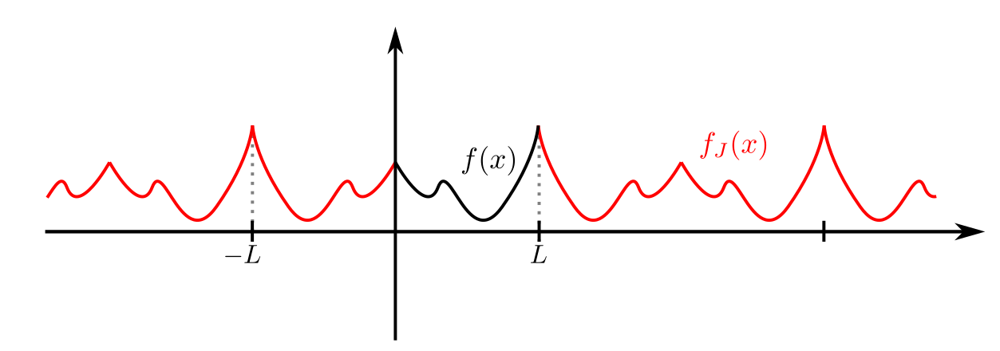
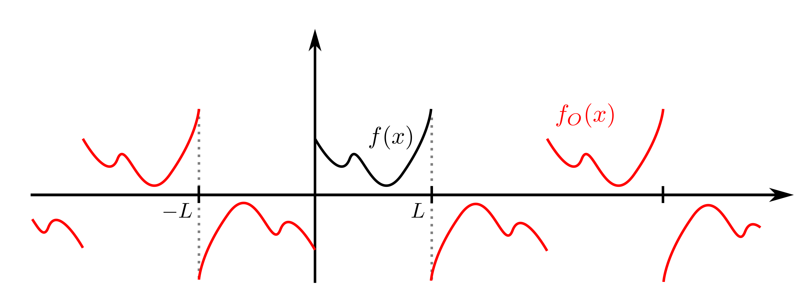

Fourier-raðir
=============

Inngangur
---------

Rifjum upp að ef við höfum grunn af vigrum :math:`x_1,x_2,\ldots,x_n` í :math:`\mathbb{R}^n` má rita sérhvern vigur :math:`y` sem

.. math::
    y = a_1 x_1 + \cdots + a_n x_n

þar sem stuðlarnir :math:`a_1,\ldots,a_n` eru ótvírætt ákvarðaðir. Við munum nú spyrja okkur spurningarinnar, er hægt að gera eitthvað sambærilegt þegar vigurrúmið er óendanlega vítt, t.d. þegar það samanstendur af föllum. Við þekkjum dæmi um slíkt, þegar rita má óendanlega oft diffranlegt fall :math:`f` með Taylor-röð þess

.. math::
    f(x) = a_0\cdot 1 + a_1 x + a_2 x^2 + \cdots, \qquad \text{þar sem} \quad a_n = \frac{f^{(n)}(0)}{n!}.

Í þessum kafla munum við skilgreina svokallaðar Fourier-raðir sem líta svipað út en í stað fallanna :math:`1,x,x^2,\ldots` munum við liða lotubundin föll :math:`f` í grunn sem samanstendur af hornaföllum (eða jafngilt, veldisvísisföllum), finna formúlur fyrir stuðlunum í framsetningunni og loks skoða hvernig má nota raðirnar við lausn hlutafleiðujafna.

Skilgreining
~~~~~~~~~~~~

.. admonition:: Skilgreining
    :class: skilgreining

    Fall :math:`f: \mathbb{R}\to \mathbb{R}` er sagt vera :math:`T`-lotubundið ef :math:`f(x+T) = f(x)` fyrir öll :math:`x\in\mathbb{R}`.

Fourier-raðir
-------------

Við munum skoða tilfellið þegar föllin eru lotubundin með lotu :math:`2\pi` og sjá hvaða skilyrði tryggja að hægt sé að liða slík föll í grunn sem samanstendur af hornaföllunum :math:`\sin(nx)` og :math:`\cos(nx)` annars vegar eða :math:`e^{nix}` hins vegar, þar sem :math:`n\geq 0`.

Skilgreining
~~~~~~~~~~~~

.. admonition:: Skilgreining
    :class: skilgreining

    Látum :math:`I\subseteq \mathbb{R}` vera bil.

    1) Rúmið :math:`L^1(I)` er mengi þeirra falla :math:`f: I \to \mathbb{C}` þannig að

    .. math::
        \int_I |f(x)| dx < \infty.

    2) Rúmið :math:`L^2(I)` er mengi þeirra falla :math:`f: I \to \mathbb{C}` þannig að

    .. math::
        \int_I |f(x)|^2 dx < \infty.

    Ef :math:`f` og :math:`g` eru föll í :math:`L^2(I)` kallast

    .. math::
        \langle f, g \rangle = \frac{1}{|I|} \int_I f(x) \overline{g(x)} dx

    innfeldi þeirra (misjafnt er hvort deilt er með :math:`|I|`, lengdinni á :math:`I`, í skilgreiningunni). Ef :math:`\langle f, g \rangle = 0` segjum við að :math:`f` og :math:`g` séu hornrétt.

.. admonition:: Athugasemd
    :class: athugasemd

    :math:`L^j(I)`, :math:`j=1,2` eru vigurrúm, af því að

    1. Ef :math:`f \in L^j(I)` og :math:`g \in L^j(I)` þá er fallið :math:`f+g \in L^j(I)`

    2. Ef :math:`f \in L^j(I)` þá er :math:`\alpha f \in L^j(I)`, þar sem :math:`\alpha \in\mathbb R`

Skilgreining
~~~~~~~~~~~~

.. admonition:: Skilgreining
    :class: skilgreining

    Ef :math:`f \in L^1([-\pi,\pi])` er :math:`2\pi`-lotubundið þá skilgreinum við Fourier-stuðla þess með

    .. math::
        c_n = c_n(f) = \frac{1}{2\pi} \int_{-\pi}^\pi e^{-inx} f(x) dx, \quad n = \ldots,-2,-1,0,1,2,\ldots,

    Fourier-kósínus-stuðla :math:`f` með

    .. math::
        a_n = a_n(f) = \frac{1}{\pi} \int_{-\pi}^\pi f(x) \cos(nx) dx, \quad n = 0,1,2,\ldots,

    og Fourier-sínus-stuðla :math:`f` með

    .. math::
        b_n = b_n(f) = \frac{1}{\pi} \int_{-\pi}^\pi f(x) \sin(nx) dx, \quad n = 1,2,\ldots.

    Raðirnar

    .. math::
        \frac{a_0}{2} + \sum_{n\geq 1} \left(a_n \cos(nx) + b_n \sin(nx)\right) \quad \text{og} \quad \sum_{n=-\infty}^\infty c_n e^{inx}

    kallast Fourier-raðir :math:`f` og til aðgreiningar er sú fyrri oft nefnd hornafallaröð :math:`f`.

    |
    |

    .. ggb:: makksbrg
      :width: 700
      :height: 300
      :img: polarggb.png
      :imgwidth: 4cm
      :zoom_drag: true

    :math:`2\pi`-lotubundna fallið er skilgreint með því að gefa formúlu fyrir því á bilinu :math:`[0,2\pi]`.

    |
    |

.. admonition:: Athugasemd
    :class: athugasemd

    Þegar :math:`T`-lotubundið fall er heildað yfir eina lotu skiptir ekki máli hvar upphafspunktur heildisins er valinn, þ.e.

    .. math::
        \int_{-T/2}^{T/2} f(x) dx = \int_0^T f(x) dx = \int_\alpha^{\alpha + T}f(x)dx, \quad \text{fyrir öll $\alpha\in\mathbb{R}$.}

Setning - Reiknireglur
~~~~~~~~~~~~~~~~~~~~~~

.. admonition:: Reiknireglur
    :class: setning

    Látum :math:`f,g\in L^1([-\pi,\pi])` vera :math:`2\pi`-lotubundin föll.

    1. Fourier-stuðlarnir eru línulegar varpanir á :math:`L^1([-\pi,\pi])`,

    .. math::
        \begin {align*}
            a_n(\alpha f+\beta g) &= \alpha a_n(f) + \beta a_n(g) \\
            b_n(\alpha f+\beta g) &= \alpha b_n(f) + \beta b_n(g) \\
            c_n(\alpha f+\beta g) &= \alpha c_n(f) + \beta c_n(g)
        \end{align*}

    2. Eftirfarandi samband gildir

    .. math::
        \begin {align*}
        a_0 &= 2c_0, \qquad a_n = c_n + c_{-n}, \qquad b_n = i(c_n-c_{-n}),  \\
        c_0 &= \frac{a_0}{2}, \qquad c_n = \frac{1}{2}(a_n-ib_n), \qquad c_{-n} = \frac{1}{2}(a_n+ib_n), \quad n\geq 1.
        \end {align*}

    3. Ef :math:`g(x) = f(x+\alpha)` , þar sem :math:`\alpha \in \mathbb{R}` þá er :math:`c_n(g) = e^{i n\alpha} c_n(f)` fyrir öll :math:`n=0,\pm 1,\pm2,\ldots`.

    4. Ef :math:`f` er raungilt fall þá eru :math:`a_n(f)` og :math:`b_n(f)` rauntölur og :math:`c_{-n}(f) = \overline{c_n(f)}`.

    5. Ef :math:`f` er jafnstætt fall þá er :math:`b_n(f) = 0` fyrir öll :math:`n=1,2,3,\ldots` og

    .. math::
        a_n(f) = \frac{2}{\pi} \int_0^\pi f(x) \cos(nx) dx.

    6 Ef :math:`f` er oddstætt fall þá er :math:`a_n(f) = 0` fyrir öll :math:`n=0,1,2,\ldots` og

    .. math::
        b_n(f) = \frac{2}{\pi} \int_0^\pi f(x) \sin(nx) dx.

    7. Ef :math:`f,f',\ldots,f^{(m)}` eru í :math:`L_1([-\pi,\pi])` þá er

    .. math::
        c_n(f^{(k)}) = (in)^k c_n(f), \quad 0\leq k \leq m, \quad n \in \mathbb{Z}.

Skilgreining
~~~~~~~~~~~~

.. admonition:: Skilgreining
    :class: skilgreining

    Ef :math:`f \in L^1([-T/2,T/2])` er :math:`T`-lotubundið þá setjum við :math:`\omega = 2\pi/T` og skilgreinum Fourier-stuðla þess með

    .. math::
        c_n = c_n(f) = \frac{1}{T} \int_{-T/2}^{T/2} e^{-in \omega x} f(x) dx, \quad n = \ldots,-2,-1,0,1,2,\ldots,

    Fourier-kósínus-stuðla :math:`f` með

    .. math::
        a_n = a_n(f) = \frac{2}{T} \int_{-T/2}^{T/2} f(x) \cos(n\omega x) dx, \quad n = 0,1,2,\ldots,

    og Fourier-sínus-stuðla :math:`f` með

    .. math::
        b_n = b_n(f) = \frac{2}{T} \int_{-T/2}^{T/2} f(x) \sin(n\omega x) dx, \quad n = 1,2,\ldots.

    Raðirnar

    .. math::
        \frac{a_0}{2} + \sum_{n\geq 1} \left(a_n \cos(n\omega x) + b_n \sin(n\omega x)\right) \quad \text{og} \quad \sum_{n=-\infty}^\infty c_n e^{in\omega x}

    kallast Fourier-raðir :math:`f` og til aðgreiningar er sú fyrri oft nefnd hornafallaröð :math:`f`.

.. admonition:: Athugasemd
    :class: athugasemd

    Sambærilegar reiknireglur fyrir :math:`T`-lotubundin fást út frá reglunum fyrir :math:`2\pi`-lotubundin föll, með því að "skipta :math:`2\pi` út fyrir :math:`T` " á viðeigandi stöðum.

Samleitni Fourier-raða
----------------------

Í þessari grein fjöllum við um skilyrði sem tryggja samleitni Fourier-raða falls og hvenær og í hvaða skilningi fallið er jafnt Fourier-röð sinni. Við munum notast talsvert við innfeldið sem skilgreint er á :math:`L^2([-\pi,\pi])` og setjum því fram nokkrar reiknireglur um innfeldi

Reiknireglur um innfeldi
~~~~~~~~~~~~~~~~~~~~~~~~
Ef :math:`u,v,w\in L^2([-\pi,\pi])` og :math:`\alpha,\beta \in \mathbb{C}` þá gilda eftirfarandi reiknireglur

.. math::

  \begin{gathered}
   {{\langle \alpha u + \beta v,w\rangle}}= \alpha{{\langle u,w\rangle}} + \beta {{\langle v,w\rangle}},\\
   {{\langle u,\alpha v + \beta w\rangle}}= \overline\alpha {{\langle u,v\rangle}} + \overline
   \beta {{\langle u,w\rangle}},\\
   {{\langle u,v\rangle}} = \overline{{{\langle v,u\rangle}}},\\
   {{\langle u,u\rangle}}\geq 0.\end{gathered}

Síðasta reglan leyfir okkur að skilgreina lengd
eða staðal fallsins :math:`u` sem

.. math:: \| u\|= \sqrt{{{\langle u,u\rangle}}}.

Ein mikilvægasta ójafna stærðfræðinnar er Cauchy-Schwarz ójafnan

Cauchy-Schwarz ójafna
~~~~~~~~~~~~~~~~~~~~~

Fyrir :math:`u,v\in L^2([-\pi,\pi])` gildir

.. math::
   |\langle u,v \rangle| \leq \frac{1}{2\pi} \int_{-\pi}^\pi |u(x)v(x)|dx \leq \| u\|\| v\|.

Athugum nú að föllin :math:`e^{inx}` og :math:`e^{imx}` eru hornrétt ef :math:`n\neq m` því þá gildir

.. math::
    \langle e^{inx},e^{imx}\rangle = \frac{1}{2\pi}\int_{-\pi}^\pi e^{(n-m)ix} dx =  \left[\frac{e^{(n-m)ix}}{i(n-m)}\right]_{-\pi}^\pi = 0.

Ef :math:`n=m` gildir hins vegar að :math:`\langle e^{inx},e^{imx}\rangle = 1`.

Ef rita má :math:`2\pi`-lotubundið fall :math:`f` með röð á forminu

.. math::
    f(x) = \sum_{n=-\infty}^\infty c_n e^{inx}

og ef víxla má á heildi og óendanlegri summu í eftirfarandi reikningum þá fæst

.. math::
    \frac{1}{2\pi}\int_{-\pi}^\pi f(x) e^{-imx} dx = \langle f,e^{imx} \rangle = \sum_{n=-\infty}^\infty c_n \langle e^{inx},e^{-imx} \rangle = c_m.

Þar með eru stuðlarnir :math:`c_n` ótvírætt ákvarðaðir og jafnir Fourier-stuðlum fallsins :math:`f` og :math:`f` er jafnt Fourier-röð sinni. Í framhaldinu munum við fjalla betur um þessa reikninga og undir hvaða skilyrðum þeir eru rættlætanlegir.

Regla Pýþagórasar
~~~~~~~~~~~~~~~~~

.. admonition:: Regla Pýþagórasar
    :class: setning

    Ef :math:`u, v\in L^2[-\pi,\pi]` eru hornrétt, þá er

    .. math:: \| u+v\|^2 = \|u\|^2 + \| v\|^2.

Nokkuð einfalt er að sanna eftirfarandi ójöfnu.

Bessel-ójafnan
~~~~~~~~~~~~~~
Ef :math:`f\in L^2([-\pi,\pi])` er :math:`2\pi`–lotubundið og hefur
Fourier-stuðla :math:`c_n=c_n(f)`, þá er

.. math::

  \sum\limits_{n=-\infty}^{+\infty}|c_n|^2 \leq \dfrac
   1{2\pi}\int_{-\pi}^\pi |f(x)|^2\, dx.

Losaralegir reikningar leyfa okkur að færa rök fyrir því að sterkari niðurstaða gildir, ójafnan er í raun jafna:

Ef rita má

.. math::
    f(x) = \sum_{n=-\infty}^\infty c_n e^{inx}

og að því gefnu að víxla megi á óendanlegum summum og heildum í eftirfarandi reikningum þá er

.. math::
    \begin {align*}
    \dfrac
   1{2\pi}\int_{-\pi}^\pi |f(x)|^2\, dx &= \langle f, f\rangle = \langle \sum_{n=-\infty}^\infty c_n e^{inx}, \sum_{m=-\infty}^\infty c_m e^{imx}\rangle \\
   &= \sum_{n=-\infty}^\infty \sum_{m=-\infty}^\infty c_n \overline{c_m} \langle  e^{inx},  e^{imx}\rangle = \sum_{n=-\infty}^\infty \sum_{m=-\infty}^\infty c_n \overline{c_m} \delta_{nm} = \sum_{n=-\infty}^\infty |c_n|^2.
    \end{align*}

Táknið :math:`\delta_{nm}` sem kallast Kronecker-:math:`\delta` og uppfyllir :math:`\delta_{mn} = 1` ef :math:`m=n` en :math:`\delta_{mn}=0` annars. Það er talsvert flóknara að réttlæta þessa niðurstöðu með fullnægjandi hætti en það er hægt og við ræðum niðurstöðuna aftur þegar við fjöllum um Parseval-jöfnuna.

Skilgreining
~~~~~~~~~~~~

.. admonition:: Skilgreining
    :class: skilgreining

    Fall :math:`f` á :math:`\mathbb{R}` er sagt vera samfellt deildanlegt á köflum ef skipta má :math:`\mathbb{R}` í endanlega mörg bil með skiptipunktum :math:`x_1,x_2,\ldots, x_k` þannig að fallið er samfellt diffranlegt á opnu bilunum :math:`]x_j,x_{j+1}[` og afleiðan hefur markgildi frá hægri í vinstri endapunkti bils og markgildi frá vinstri í hægri endapunkti bils. Mengi falla sem eru samfellt deildanleg á köflum er táknað með :math:`PC^1(\mathbb{R})`.

Við munum skoða föll sem eru :math:`2\pi`-lotubundin og tilheyra menginu :math:`PC^1(\mathbb{R})\cap C(\mathbb{R})`, þ.e. eru samfellt diffranleg á köflum og samfelld. Dæmi um slíkt fall er :math:`2\pi`-lotubundna fallið sem er skilgreint með formúlunni :math:`f(x) = x^2` á :math:`[-\pi,\pi]`.

Setning
~~~~~~~

.. admonition:: Setning
    :class: setning

    Ef :math:`f\in PC^1({{\mathbb  R}})\cap C({{\mathbb  R}})` er
    :math:`2\pi`–lotubundið, þá er :math:`c_n(f{{^{\prime}}})=inc_n(f)`,

    .. math:: \sum\limits_{n=-\infty}^{+\infty} |c_n(f)|< +\infty,

    og þar með er Fourier–röðin
    :math:`\sum_{-\infty}^{+\infty}c_n(f)e^{inx}` samleitin í jöfnum mæli á
    :math:`{{\mathbb  R}}`.

    Meginniðurstaða þessarar greinar er eftirfarandi setning sem sýnir undir hvaða skilyrðum og í hvaða skilningi fall er jafnt Fourier-röð sinni. Rifjum upp ritháttinn

    .. math::
        f(x+) = \lim_{y \to x^+} f(y) \quad \text{og} \quad f(x-) = \lim_{y \to x^-} f(y)

Setning - Andhverfuformúla Fouriers
~~~~~~~~~~~~~~~~~~~~~~~~~~~~~~~~~~~

.. admonition:: Setning
    :class: setning

    Ef :math:`f\in PC^1({{\mathbb  R}})` er :math:`2\pi`–lotubundið fall með
    Fourier–stuðla :math:`c_n=c_n(f)`, Fourier-kósínus–stuðla
    :math:`a_n=a_n(f)` og Fourier–sínus–stuðla :math:`b_n=b_n(f)`, þá gildir

    .. math::

      \begin{aligned}
       \tfrac 12\big(f(x+)+f(x-)\big) &=
       \sum\limits_{n=-\infty}^{+\infty} c_ne^{inx} =
       \lim\limits_{N\to+\infty}\sum\limits_{n=-N}^{N} c_ne^{inx}\\
       &=\tfrac 12 a_0 + \sum\limits_{n=1}^\infty \big(a_n \cos nx + b_n\sin
       nx\big).\end{aligned}

    Í punktum :math:`x` þar sem :math:`f` er samfellt gildir
    :math:`f(x)=\tfrac 12\big(f(x+)+f(x-)\big)` og þar með er

    .. math::

      f(x)=
       \sum\limits_{n=-\infty}^{+\infty} c_ne^{inx}
       =\tfrac 12 a_0 + \sum\limits_{n=1}^\infty \big(a_n \cos nx + b_n\sin
       nx\big).

    Ef :math:`f\in PC^1({{\mathbb  R}})\cap C({{\mathbb  R}})`, þá eru
    raðirnar samleitnar í jöfnum mæli á :math:`{{\mathbb  R}}`.

    Þegar :math:`2\pi`-lotubundið fall :math:`f\in L^2([-\pi,\pi])` er ósamfellt gildir almennt ekki að það sé jafnt Fourier-röð sinni í ósamfelldnipunktunum. Við getum samt spurt okkur hvort hægt sé að tala um að fallið sé jafnt Fourier-röð sinni í einhverjum öðrum skilningi. Eftirfarandi setning segir okkur að hlutsumman

    .. math::
        s_N = \sum_{n=-N}^{N}
       c_n(f) e^{in x}

    stefnir á fallið :math:`f` í staðlinum :math:`\|\cdot\|` á :math:`L^2([-\pi,\pi])`.

Setning - Parseval-jafnan
~~~~~~~~~~~~~~~~~~~~~~~~~

.. admonition:: Setning
    :class: setning

    Ef :math:`f\in L^2[-\pi,\pi]` er :math:`2\pi`–lotubundið, þá gildir

    .. math::

      \|f-s_N\|^2=\dfrac 1{2\pi}\int_{-\pi}^{\pi} |f(x)-\sum_{n=-N}^{N}
       c_n(f) e^{in x}|^2\, dx \to 0, \qquad N\to +\infty

    og af þessu leiðir jafna Parseval

    .. math::

      \sum_{n=-\infty}^{+\infty} |c_n(f)|^2 = \dfrac 1{2\pi}\int_{-\pi}^{\pi}
       |f(x)|^2 \, dx,

.. admonition:: Athugasemd
    :class: athugasemd

    Mismunurinn :math:`\|f-\sum_{n=-N}^{N}   c^\ast_n e^{in x}\|^2` nefnist ferskekkja nálgunar :math:`f` með :math:`\sum_{n=-N}^{N} c^\ast_n e^{in x}`. Hægt er að sýna að lágmarks ferskekkja fæst með því að velja stuðlana :math:`c^\ast_n = c_n(f)`.
    
.. %%%%%%FROM HERE
    
Ágrip um samleitni Fourier-raða
-------------------------------

Inngangur
~~~~~~~~~

Við viljum setja fall :math:`f` fram með Fourier-röð :math:`\mathcal F`.

    1. Hvenær er :math:`\mathcal F` samleitin?
    
    2. Hvenær og í hvaða skilningi er fallið jafnt Fourier-röð sinni, þ.e.a.s.  :math:`f= \mathcal F`?
    
    3. Hve góð er framsetningin?
    

:math:`L^2`-föll
~~~~~~~~~~~~~~~~

Gerum ráð fyrir að :math:`f, g: [-\pi, \pi]\to\mathbb R(\mathbb C)` séu :math:`2\pi`-lotubundin föll og :math:`g, f\in L^2([-\pi, \pi])`.
Athugum að

.. math::
    &&\vert\vert f\vert \vert ^2 = \langle f, f\rangle= {1\over 2\pi} \int_{-\pi}^\pi \vert f(x)\vert^2 d x\,,
    \\
    && \langle f, g\rangle= {1\over 2\pi} \int_{-\pi}^\pi f(x)\, \overline{g(x)} d x\,.
    

Þá gildir

1. Cauchy-Schwarz ójafnan:
    
.. math::
    \vert \langle f, g\rangle \vert \le \vert\vert f \vert \vert \, \vert\vert g \vert \vert \,.

2. Regla Pýþagórasar: ef :math:`f, g` eru hornrétt, þ.e.a.s. :math:`\langle f, g\rangle=0`, þá gildir

.. math::
    \vert \vert f+g\vert \vert^2 = \vert\vert f\vert \vert^2 +\vert \vert g\vert \vert^2\,.
    
3. Bessel-ójafnan:

.. math::
    \sum_{n=- \infty}^\infty \vert c_n(f)\vert^2 \le {1\over 2\pi} \int_{-\pi}^\pi \vert f(x)\vert^2 d x\,,

þar sem :math:`c_n(f)` eru Fourier-stuðlar fallsins :math:`f`.

4. Af Bessel-ójafnunni leiðir að

.. math::
    \lim_{n\to \pm \infty} c_n(f)=0\,.
    
5. ''Skekkjan'' stefnir á núll

.. math::
    \lim_{N\to \infty}\vert\vert f-s_N\vert\vert ^2= \lim_{N\to \infty}\int_{-\pi}^\pi \vert f(x)-s_N(x)\vert^2 {d x \over 2\pi} =0 \,,

þar sem

.. math::
    s_N(x)= \sum_{n=-N}^N c_n(f) e^{inx}\,.

6. Parseval-jafna:

.. math::
    \sum_{n=- \infty}^\infty \vert c_n(f)\vert^2 = {1\over 2\pi} \int_{-\pi}^\pi \vert f(x)\vert^2 d x\,,
    
þar sem :math:`c_n(f)` eru Fourier-stuðlar fallsins :math:`f`.

:math:`PC^1`-föll
~~~~~~~~~~~~~~~~~

Gerum ráð fyrir að :math:`f: [-\pi, \pi]\to\mathbb R(\mathbb C)` sé :math:`2\pi`-lotubundið fall og :math:`f\in PC^1(\mathbb R)`. Þá gildir

1. Andhverfuformúla Fouriers:

.. math::
    {f(x^+)+f(x^-)\over 2} &=& \lim_{N\to\infty}\sum_{n=-N}^N c_n(f) e^{inx} = \sum_{n=-\infty}^\infty c_n(f) e^{inx} \\
    &=&{a_0\over 2}+ \lim_{N\to\infty}\sum_{n=1}^N \left\{ a_n(f)\cos(nx)+b_n(f) \sin(nx)\right\}\\
    &=&
        {a_0\over 2}+\sum_{n=1}^\infty \left\{ a_n(f)\cos(nx)+b_n(f) \sin(nx)\right\}\,,

þ.e.a.s. Fourier-röðin fallsins :math:`f` stefnir á  :math:`~{f(x^+)+f(x^-)\over 2}` í hverjum punkti.

:math:`PC^1\cap C`-föll
~~~~~~~~~~~~~~~~~~~~~~~

Gerum ráð fyrir að :math:`f: [-\pi, \pi]\to\mathbb R(\mathbb C)` sé :math:`2\pi`-lotubundið fall og :math:`f\in PC^1(\mathbb R)\cap C(\mathbb R)`. Þá gildir

1. Andhverfuformúla Fouriers:

.. math::
    f(x) &=& \lim_{N\to\infty}\sum_{n=-N}^N c_n(f) e^{inx} = \sum_{n=-\infty}^\infty c_n(f) e^{inx} \\
    &=& {a_0\over 2}+\lim_{N\to\infty}\sum_{n=1}^N \left\{ a_n(f)\cos(nx)+b_n(f) \sin(nx)\right\}=
            {a_0\over 2}+\sum_{n=1}^\infty \left\{ a_n(f)\cos(nx)+b_n(f) \sin(nx)\right\}\,,

þ.e.a.s. Fourier-röðin fallsins :math:`f` stefnir á :math:`f(x)` í hverjum punkti.

2. Fourier-röð fallsins :math:`f` er samleitin í  jöfnum mæli á :math:`\mathbb R`.

3. Reikniregla Fourier-stuðla:

.. math::
    c_n(f')=in \, c_n(f)\,, \qquad a_n(f')=n\, b_n(f)\,, \qquad b_n(f')=-n \,a_n(f)\,.
 

.. %%%%%%%TO HERE

Úrlausn á hlutafleiðujöfnum
---------------------------

Í þessari grein munum við líta á dæmi þar sem hagnýta má Fourier-raðir við lausn jaðargildisverkefna. Byrjum á tveimur mikilvægum skilgreiningum.

Þegar fengist er við ákveðnar tegundir jaðargildisverkefna getur verið gagnlegt að skilgreina lotubundna framlengingu af falli á bili sem annað hvort er oddstæð eða jafnstæð. Með þeim hætti má skilgreina raðir sem uppfylla sjálfkrafa jaðarskilyrðin sem gefin eru.

Jafnstæð framlenging og kósínus-röð
~~~~~~~~~~~~~~~~~~~~~~~~~~~~~~~~~~~

Ef :math:`L>0` og :math:`f: [0,L]\to \mathbb{C}` er fall á endanlegu bili skilgreinum við jafnstæða :math:`2L`-lotubundna framlengingu á :math:`f` með því að setja

.. math::

  f_J(x)=\begin{cases} f(x), & x\in [0,L],\\  f(-x), & x\in
    [-L,0],\end{cases}

og framlengja :math:`f_J` í :math:`2L`-lotubundið fall.

     *Jafnstæð framlenging falls* :math:`f:[0,L]\to \mathbb{C}` *í* :math:`2L` *-lotubundið fall* :math:`f_J`.

Fourier-stuðlar :math:`f_J` eru gefnir með

.. math::

  \begin{aligned}
   a_n(f_J)&=\dfrac 1L \int_{-L}^L f_J(x)\cos \dfrac {n\pi}L
   x \, dx\\
   &=\dfrac 2L \int_{0}^L f_J(x)\cos \dfrac {n\pi}L
   x \, dx\\
   &=\dfrac 2L \int_{0}^L f(x)\cos\dfrac {n\pi}L
   x \, dx, \qquad n=0,1,2,\dots,\\
   b_n(f_J)&=0 \qquad \qquad \qquad\qquad n=1,2,3,\dots.\end{aligned}

Stuðlarnir :math:`a_n` nefnast *Fourier–kósínus–stuðlar* fallsins :math:`f` og röðin

.. math:: \tfrac 12 a_0 + \sum_{n=1}^\infty a_n \cos  \dfrac {n\pi} L x

kallast *Fourier–kósínus–röð* fallsins :math:`f`.

Oddstæð framlenging og sínus-röð
~~~~~~~~~~~~~~~~~~~~~~~~~~~~~~~~~~~

Ef :math:`L>0` og :math:`f: [0,L]\to \mathbb{C}` er fall á endanlegu bili skilgreinum við oddstæða :math:`2L`-lotubundna framlengingu á :math:`f` með því að setja

.. math::
  f_O(x)=\begin{cases} f(x), & x\in ]0,L],\\ 0, & x=0,\\
    -f(-x), & x\in
    ]-L,0[,\end{cases}

og framlengja :math:`f_O` í :math:`2L`-lotubundið fall.

     *Oddstæð framlenging falls* :math:`f:[0,L]\to \mathbb{C}` *í* :math:`2L` *-lotubundið fall* :math:`f_O`.

Fourier-stuðlar :math:`f_O` eru gefnir með

.. math::

  \begin{aligned}
   a_n(f_O)&=0 \qquad\qquad\qquad \qquad n=0,1,2,\dots,\\
   b_n(f_O)&=\dfrac 1L \int_{-L}^L f_O(x)\sin \dfrac {n\pi}L
   x  \, dx\\
   &=\dfrac 2L \int_{0}^L f_O(x)\sin \dfrac {n\pi}L
   x  \, dx\\
   &=\dfrac 2L \int_{0}^L f(x)\sin \dfrac {n\pi}L
   x  \, dx, \qquad n=1,2,\dots.\\\end{aligned}

Stuðlarnir :math:`b_n` nefnast *Fourier–sínus–stuðlar* fallsins :math:`f` og röðin

.. math:: \sum_{n=1}^\infty b_n \sin  \dfrac {n\pi} L x

kallast *Fourier–sínus–röð* fallsins :math:`f`.

.. admonition:: Athugasemd
    :class: athugasemd

    Hægt er að yfirfæra allar reiknireglur og fræðilegar niðurstöður líkt og t.d. andhverfusetninguna beint á Fourier-kósínus og Fourier-sínus raðir. Vísað er í kennslubók fyrir frekari smáatriði.

Setning
~~~~~~~

.. admonition:: Setning
    :class: setning

    Látum :math:`P` vera margliðu af stigi :math:`m` og lítum á jöfnuna

    .. math:: P(D)u=(a_mD^m+a_{m-1}D^{m-1}+\cdots+a_1 D +a_0)u=f(x),

    þar sem :math:`f\in PC^1({{\mathbb  R}})\cap C({{\mathbb  R}})` er
    :math:`T`–lotubundið fall og setjum :math:`\omega=2\pi/T`. Ef
    :math:`c_n(f)=0` fyrir öll :math:`n` þannig að :math:`P(in\omega)=0`, þá
    fæst :math:`T`–lotubundin lausn af gerðinni

    .. math::

      u(x)=\sum_{\substack{n=-\infty\\ P(in\omega)\neq 0}}^{+\infty}
       \dfrac{c_n(f)} {P(in\omega)} e^{in\omega x}, \qquad x\in {{\mathbb  R}}.

    Eftirfarandi dæmi má finna í kennslubók og þar eru reikningar framkvæmdir í smáatriðum.

Dæmi
~~~~

.. admonition:: Dæmi
    :class: daemi

    Notum Fourier-raðir til að leysa jaðargildisverkefnið

    .. math:: u{{^{\prime\prime}}}+{\omega}^2 u=f(x), \qquad u(0)=u(1)=0.

    Það hefur ótvírætt ákvarðaða lausn fyrir sérhvert :math:`f` ef og aðeins ef :math:`{\omega}` er ekki
    heiltölumargfeldi af :math:`{\pi}`. Prófum að liða :math:`u` í Fourier-sínus-röð en þá eru jaðarskilyrðin uppfyllt.

    Lausnin er

    .. math::

      u(x)=\sum\limits_{n=1}^{\infty} \dfrac{f_n}{{\omega}^2-n^2{\pi}^2}
       \sin (n{\pi}x)

    þar sem :math:`f_n` eru Fourier-sínus-stuðlar fallsins :math:`f`.

Dæmi - Sveiflandi strengur
~~~~~~~~~~~~~~~~~~~~~~~~~~

.. admonition:: Dæmi
    :class: daemi

    Lítum á einvíðan streng af lengd :math:`L` sem festur er í báða enda. Táknum frávik hans frá jafnvægi í punkti :math:`x` á tíma :math:`t` með :math:`u(x,t)`. Fallið :math:`u(x,t)` uppfyllir þá bylgjujöfnuna í einni rúmbreytu ásamt jaðarskilyrðunum

    .. math::

      \dfrac{{\partial}^2u}{{\partial}t^2}-
       c^2\dfrac{{\partial}^2u}{{\partial}x^2}=0, \qquad u(0,t)=u(L,t)=0.

    Gerum einnig ráð fyrir því að upphafsstaðan og hraðinn séu þekkt

    .. math::

      u(x,0)=\varphi(x), \qquad {\partial}_tu(x,0)={\psi}(x), \qquad x\in
       ]0,L[.

    Þetta verkefni má leysa með því að liða :math:`u(x,t)` í Fourier-sínus–röð
    með miðað við breytuna :math:`x`. Þannig eru jaðarskilyrðin sjálfkrafa uppfyllt.

    Lausnin verður

    .. math::

      u(x,t)=\sum\limits_{n=1}^{\infty}
       \bigg(\varphi_n\cos\big(n{\pi}ct/L\big) +
       \dfrac{{\psi}_nL}{n{\pi}c} \sin\big(n{\pi}ct/L\big)\bigg)
       \sin(n{\pi}x/L)

    þar sem :math:`\phi_n` og :math:`\psi_n` eru Fourier-sínus-stuðlar fallanna :math:`\phi` og :math:`\psi`.

    Lausnina má einnig rita

    .. math::
      u(x,t)=\sum\limits_{n=1}^{\infty}
       C_n\cos\big(n{\pi}ct/L-{\alpha}_n\big)
       \sin(n{\pi}x/L)

    þar sem

    .. math:: C_n=\sqrt{\varphi_n^2+({\psi}_nL/n{\pi}c)^2}

    kallast sveifluvídd og :math:`{\alpha}_n` kallast fasahliðrun og uppfyllir

    .. math::
      \cos{\alpha}_n= \varphi_n/C_n, \qquad
       \sin{\alpha}_n= ({\psi}_nL)/(n{\pi}cC_n).

Dæmi - Varmaleiðni
~~~~~~~~~~~~~~~~~~

.. admonition:: Dæmi
    :class: daemi

    Reiknum út hitastig :math:`u(x,t)`, í punkti :math:`x` á tíma :math:`t`,  í einvíðri stöng af lengd :math:`L`, sem er einangruð í báðum endapunktunum. Jaðarskilyrðin eru þá að ekkert varmaflæði er í endapunktum stangarinnar,  sem þýðir að afleiða hitastigsins er núll í jaðarpunktunum 0 og :math:`L`. Fallið :math:`u` uppfyllir varmaleiðnijöfnuna og við höfum því eftirfarandi jaðargildisverkefni

    .. math::

      \begin{cases} \dfrac{{\partial} u}{{\partial}t}-{\kappa}
       \dfrac{{\partial}^2 u}{{\partial}x^2}=f(x,t), &0<x<L, \quad t>0,\\
       {\partial}_xu(0,t)={\partial}_xu(L,t)=0, &t>0
       \end{cases}

    með upphafsskilyrðinu

    .. math:: u(x,0)=\varphi(x), \qquad x\in ]0,L[.

    Föllin :math:`f` og :math:`\phi` eru ótiltekin.

    Fallið :math:`u` er liðað í Fourier-kósínus-röð til þess að jaðarskilyrði séu uppfyllt. Þá má sýna að lausnin er

    .. math::
      u(x,t)=\sum_{n=0}^{\infty}
       \bigg(\varphi_ne^{-{\kappa}(n{\pi}/L)^2t}+
       \int_0^te^{-{\kappa}(n{\pi}/L)^2(t-{\tau})}f_n({\tau})\, d{\tau}\bigg)
       \cos(n{\pi}x/L)

    þar sem :math:`\phi_n` og :math:`f_n` eru Fourier-kósínus-stuðlar fallanna :math:`\phi` og :math:`f`.
