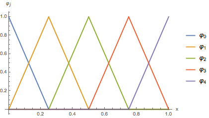
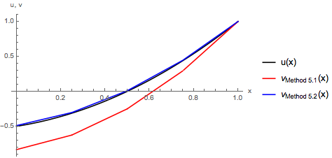
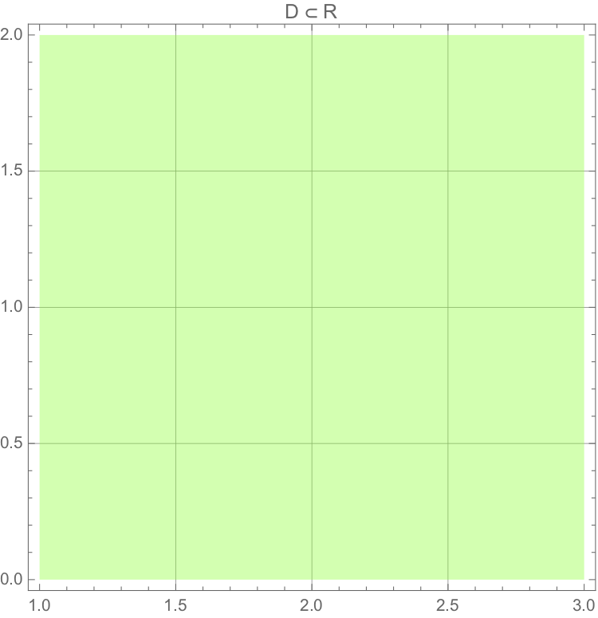
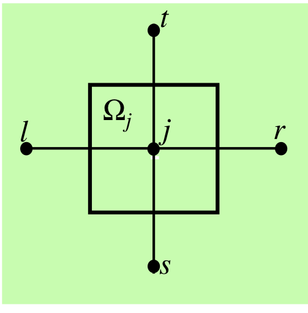
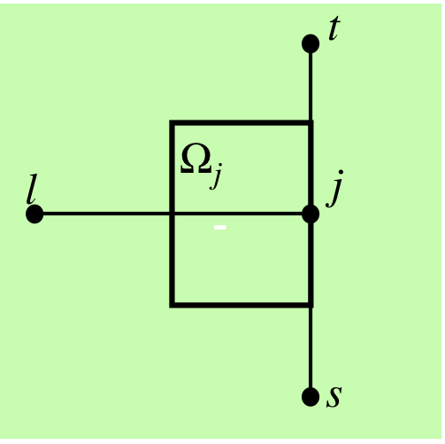

Mismunaaðferðir
===============

Við byrjum á að skoða praktískar og tölulegar aðferðir til þess að nálga lausnir á afleiðujöfnum og hlutafleiðujöfnum með upphafs- og jaðarskilyrðum.

Fyrsta aðferðin sem við ætlum að fjalla um er :hover:`mismunaaðferð`.
Það eru ýmsar útgáfur fyrir mismunaaðferðir, en aðalatriði mismunaaðferða er að þær umbreyta afleiðujöfnum (eða hlutafleiðujöfnum) í algebrujöfnuhneppi.

Mismunaaðferð fyrir venjulegar afleiðujöfnur
--------------------------------------------
.. _ch-5.1:

Við skoðum fyrst jaðargildisverkefni fyrir almenna annars stigs afleiðujöfnu á bili :math:`[a,b]`:

.. math::
    \begin{cases}
    Lu=a_2u''+a_1u'+a_0u=f,& \text{ á } ]a,b[\\
    B_1u=\alpha_1u(a)-\beta_1u'(a)=\gamma_1,&(\alpha_1,\beta_1)\neq (0,0),\\
    B_2u=\alpha_2u(b)+\beta_2u'(b)=\gamma_2,&(\alpha_2,\beta_2)\neq (0,0).
    \end{cases}
  :label: eq.ODE1

Við gerum ráð fyrir að raungildu föllin :math:`a_0, a_1,a_2` séu samfelld í :math:`[a,b]` og fallið :math:`f` sé raungilt.

Við veljum skiptingu á bilinu :math:`[a,b]`, þ.e.

.. math::
    a=x_0<x_1<x_2<\cdots <x_N=b.

Til þess að einfalda reikninga getum við valið að skipta bilinu í jafna hluta, þ.e.

.. math::
    h:= {b-a\over N}, \qquad x_j=a+jh,  \quad j=0, \dots, N.

Athugum að þá gildir :math:`x_{j-1}=x_j-h` og :math:`x_{j+1}=x_j+h`.

Við finnum gildi afleiðujöfnunnar í punktunum :math:`x_j`:

.. math::
    \begin{cases}
    \alpha_1u(x_0)-\beta_1u'(x_0)=\gamma_1,\\
    a_2(x_j)u''(x_j)+a_1(x_j)u'(x_j)+a_0(x_j)u(x_j)=f(x_j), \qquad
    j=1,\dots,N-1,\\
    \alpha_2u(x_N)+\beta_2u'(x_N)=\gamma_2.
    \end{cases}

Við þurfum að finna nálgun fyrir afleiður :math:`u'(x_j),u''(x_j)`.
Það er eðlilegt að nálga afleiður :math:`u'(x_j),u''(x_j)` með samsvarandi mismunakvóta.

Við ætlum að nota eftirfarandi nálgun

1. Í vinstri endapunkti :math:`x_0=a`, notum við

.. math::
    u'(x)\approx \dfrac{u(x+h)-u(x)}h

2. Í innri punktum bilsins :math:`x_1, \dots, x_{N-1}`, notum við

.. math::
    u'(x)\approx \dfrac{u(x+h)-u(x-h)}{2h} \qquad \text{ og } \qquad
    u''(x)\approx \dfrac{u(x-h)-2u(x)+u(x+h)}{h^2},
    :label: eq.approxder

3. Í hægri endapunkti :math:`x_N=b`, notum við

.. math::
    u'(x)\approx \dfrac{u(x)-u(x-h)}h,

Hugmyndin er að umrita hneppi :eq:`eq.ODE1` með nálgununum að ofan og finna lausnir :math:`u(x_j)`.

Af hverjum veljum við nálgunarformúlur :eq:`eq.ODE1`?
Við metum skekkju í nálgunarformúlunum sem við höfum skrifað að ofan.
Gerum ráð fyrir að fall :math:`\varphi\in C^4(I)` á bili :math:`I`, og :math:`x, x+h, x-h` séu í :math:`I`. Þá er

.. math::
    \begin{aligned}
    \varphi(x+h)&=\varphi(x)+\varphi'(x)h+\tfrac 12 \varphi''(x)h^2
    +\tfrac 16 \varphi'''(x)h^3+\tfrac 1{24}\varphi^{(4)}(\xi)h^4,\\
    \varphi(x-h)&=\varphi(x)-\varphi'(x)h+\tfrac 12 \varphi''(x)h^2
    -\tfrac 16 \varphi'''(x)h^3+\tfrac 1{24}\varphi^{(4)}(\eta) h^4,\end{aligned}

þar sem :math:`\xi \in (x,x+h)` og :math:`\eta \in (x-h,x)`.

Við berum saman mismunandi nálgunarformúlur fyrir fyrsta stigs afleiður:

.. math::
    \begin{aligned}
    \varphi'(x)&-\dfrac{\varphi(x+h)-\varphi(x)}h
    =-\tfrac 12 \varphi''(x)h
    -\tfrac 16 \varphi'''(x)h^2-\tfrac 1{24}\varphi^{(4)}(\xi)h^3,\\
    \varphi'(x)&-\dfrac{\varphi(x)-\varphi(x-h)}h
    =\tfrac 12 \varphi''(x)h
    -\tfrac 16 \varphi'''(x)h^2+\tfrac 1{24}\varphi^{(4)}(\eta)h^3,\\
    \varphi'(x)&-\dfrac{\varphi(x+h)-\varphi(x-h)}{2h}
    =-\tfrac 1{12}\varphi'''(x)h^2-\tfrac 1{48}
    \big(\varphi^{(4)}(\xi)-\varphi^{(4)}(\eta)\big) h^3.
    \end{aligned}

Fyrir annars stigs afleiður höfum við:

.. math::
    \varphi''(x)-\dfrac{\varphi(x-h)-2\varphi(x)+\varphi(x+h)}{h^2}
    =-\tfrac 1{24}
    \big(\varphi^{(4)}(\xi)+\varphi^{(4)}(\eta)\big) h^2.

Við sjáum að ef við notum nálgunarformúluna :eq:`eq.approxder` þá er skekkjan af öðru stigi í :math:`h`. Ef við notum fyrstu tvær formúlurnar, þá er skekkjan af fyrsta stigi í :math:`h`. Það segir okkur að þegar :math:`h \ll 1`, þá stefnir skekkjan í nálgunarformúlunni sem við viljum nota hraðar á núll, sem er auðvitað miklu betra.

Til þess að einfalda rithátt skrifum við :math:`u_j=u(x_j)`  og  :math:`f_j=f(x_j)`.
Ennfremur, til þess að leggja áherslu á að :math:`u_j=u(x_j)` er óþekkt stærð sem við viljum reikna út, setjum við að lokum :math:`c_j` í staðinn fyrir :math:`u_j=u(x_j)`.

**Mismunajafna í vinstri endapunkti**

Í vinstri endapunkti :math:`x_0=a` höfum við

.. math::
    \alpha_1u(x_0)-\beta_1u'(x_0)=\gamma_1.

Við nálgum afleiðuna eins og að ofan, þá fáum við

.. math::
    \alpha_1 u_0-\beta_1\dfrac{u_1-u_0}h\approx \gamma_1,

og að lokum notum við :math:`c_j`

.. math::
    \alpha_1c_0-\beta_1\dfrac{c_1-c_0}h= \gamma_1.

**Mismunajafna í innri punktum bilsins**

Í innri punktum bilsins :math:`x_1, \dots, x_{N-1}`, notum við nálgunarformúlur :eq:`eq.approxder`, og að lokum fáum við

.. math::
    a_2(x_j)\dfrac{u_{j-1}-2u_j+u_{j+1}}{h^2}+a_1(x_j)
    \dfrac{u_{j+1}-u_{j-1}}{2h}+a_0(x_j)u_j\approx f_j,

og fyrir :math:`c_j`

.. math::
    a_2(x_j)\dfrac{c_{j-1}-2c_j+c_{j+1}}{h^2}+a_1(x_j)
    \dfrac{c_{j+1}-c_{j-1}}{2h}+a_0(x_j)c_j=f_j.

**Mismunajafna í hægri endapunkti**

Í hægri endapunkti :math:`x_N=b`, notum við nálgarformúluna að ofan, þá fæst

.. math::
    \alpha_2u_N+\beta_2\dfrac{u_N-u_{N-1}}h\approx \gamma_2,

og fyrir :math:`c_{N-1}` og :math:`c_N` þá er

.. math::
    \alpha_2c_N+\beta_2\dfrac{c_N-c_{N-1}}h = \gamma_2.

**Hneppið**

Að lokum tökum við saman nálgunarjöfnurnar í :math:`(N+1)\times(N+1)` hneppi:

.. math::
    \begin{cases}
    \alpha_1c_0-\beta_1\dfrac{c_1-c_0}h= \gamma_1,\\
    a_2(x_j)\dfrac{c_{j-1}-2c_j+c_{j+1}}{h^2}+a_1(x_j)
    \dfrac{c_{j+1}-c_{j-1}}{2h}+a_0(x_j)c_j=f_j,\\
    \alpha_2c_N+\beta_2\dfrac{c_N-c_{N-1}}h = \gamma_2,
    \end{cases}

sem við getum umskrifað sem

.. math::
    \begin{cases}
    \big(\alpha_1+\tfrac {\beta_1}h\big)c_0
    -\tfrac {\beta_1}h c_1= \gamma_1,\\
    \big(\tfrac{a_2(x_j)}{h^2}-\tfrac{a_1(x_j)}{2h}\big) c_{j-1}
    +\big(-\tfrac{2a_2(x_j)}{h^2}+a_0(x_j)\big)c_j
    +\big(\tfrac{a_2(x_j)}{h^2}+\tfrac{a_1(x_j)}{2h}\big) c_{j+1} =f_j, \qquad j=1, \dots, N-1,\\
    -\tfrac{\beta_2}h c_{N-1}+\big(\alpha_2+\tfrac{\beta_2}h \big) c_N = \gamma_2.
    \end{cases}
    :label: eq.firstapprox

Sýnidæmi
~~~~~~~~
.. _example-5.1.1:

.. admonition:: Dæmi
	:class: daemi

	Við lítum á eftirfarandi jaðargildisverkefni:

	.. math::
	    \begin{cases}
	    &\left(x^2+1\right) u''(x)-2 x u'(x)+2 u(x)=1,\qquad  x \in ]0,1[\\
	    &u'(0)+u(0)=0,\\
	    &u(1)=1.
	    \end{cases}

	Fyrst skiptum við bilinu jafnt í tvo hluta,  þ.e.

	.. math::
	    x_0=0, \qquad x_1= 1/2 , \qquad x_2 = 1, \qquad N=2, \qquad h={1 \over 2},

	og við notum nálgunarjöfnurnar :eq:`eq.firstapprox`, og þá fáum við

	.. math::
	    \begin{cases}
	    & 2 c_1-c_0=0, \\
	    & c_2-1=0,\\
	    & 6 c_0-8 c_1+4 c_2=1
	    \end{cases}

	sem gefur okkur

	.. math::
	    c_0= -{3\over 2}, \qquad c_1 = -{3\over 4}, \qquad c_2 =1.

	Ef við veljum :math:`N=4`, þ.e.

	.. math::
	    x_0=0, \quad x_1= 1/4 , \quad x_2 = 1/2, \quad x_3 = 3/4,  \quad x_4 = 1, \qquad N=4, ~~h={1 \over 4},

	þá fáum við

	.. math::
	    \begin{cases}
	    & 3 c_0 -4 c_1=0, \\
	    & c_4 =1,\\
	    & -18 c_0+32 c_1-16 c_2=-1, \\
	    & 22 c_1 -38 c_2+18 c_3=1, \\
	    & 28 c_2-48 c_3+22 c_4 =1.
	    \end{cases}

	Lausnin er

	.. math::
	    c_0=-{5\over 6},~~ c_1=-{5\over 8}, ~~ c_2 = -{1 \over 4},~~ c_3 = {7\over 24}, ~~ c_4 = 1.

	.. figure:: ./Drawings/fig-difference-method.png
	    :width: 85 %
	    :align: center

	*Lausnir fyrir* :math:`N=4, 10, 100` *og lausn* :math:`u(x)={1 \over 2} (2 x^2+x-1).`

	.. figure:: ./Drawings/error-difference-method.png
	    :width: 85 %
	    :align: center

	    *Skekkjan* :math:`|u_j-c_j|`  *í*  :math:`x=1/2`  *sem fall af*  :math:`N`.

Heildun yfir hlutbil
--------------------
.. _ch-5.2:

Við skoðum nú tilfelli þegar afleiðuvirkinn er af Sturm-Liouville gerð, þ.e.

.. math::
    L u= -(p u^\prime)^\prime+ q u,

þar sem við gerum ráð fyrir að fallið :math:`p` sé samfellt diffranlegt á bili :math:`[a,b]`, og fallið :math:`p` sé samfellt á :math:`[a,b]`.

Jaðargildisverkefnið er af gerðinni

.. math::
    \begin{cases}
    Lu=-(pu')'+qu=f,& \text{á } ]a,b[\\
    \alpha_1u(a)-\beta_1u'(a)=\gamma_1,\\
    \alpha_2u(b)+\beta_2u'(b)=\gamma_2.
    \end{cases}

Látum :math:`[c,d]` vera hlutbil af bilinu :math:`[a,b]`.
Við heildum jöfnuna yfir :math:`x\in [c, d]`, þá er

.. math::
    p(c)u'(c)-p(d)u'(d)
    +\int_c^d q(x)u(x)\, dx=\int_c^d f(x)\, dx.

Við viljum finna nálgunarjöfnur fyrir jöfnuna að ofan.
Við notum mismunakvóta til þess að nálga afleiður.
Við veljum skiptingu

.. math::
    x_0 < x_1 < \dots < x_N.

Við nálgum heildi með Riemann-summu með miðpunktsnálgun:

.. math::
    \int_{x_0}^{x_N} \varphi(x)dx= \sum\limits_{j=0}^{N-1} \varphi(m_j)h,

þar sem :math:`m_j` eru miðpunktar hlutbilanna

.. math::
    & m_j= {x_j+ x_{j+1}\over 2}, \qquad j=0, \dots, N-1,\\
    & h = {x_N - x_{0}\over N},\\
    & x_j= x_0+ j h, \qquad j=0, \dots, N.

Athugum að

.. math::
    m_j= {x_j+ x_{j+1}\over 2}= x_j+ {1\over 2} h, \qquad j=0, \dots, N-1.

Eins og við gerðum í :ref:`5.1<ch-5.1>`, þurfum við að skoða jaðarskilyrðin hvert í sínu lagi.

Til þess að einfalda rithátt, fyrir öll :math:`j` táknum við

.. math::
    & u_j=u(x_j), ~~~ f_j=f(x_j), ~~~ p_j=p(x_j),~~~ q_j=q(x_j), \\
    & p_{j+\frac 12}=p(m_j).

**Mismunajafna í vinstri endapunkti bilsins**

Við heildum yfir hlutbilið :math:`[x_0, m_0]`.
Athugum að :math:`m_0-x_0=\frac 12 h`.
Við fáum

.. math::
    p(x_0)u'(x_0)-p(m_0)u'(m_0)
    +\int_{x_0}^{m_0} qu\, dx=\int_{x_0}^{m_0} f\, dx,

sem gefur okkur

.. math::
    u'(x_0)=\dfrac 1{p(x_0)}\bigg(p(m_0)u'(m_0)
    -\int_{x_0}^{m_0}q(x)u(x)\, dx
    +\int_{x_0}^{m_0}f(x)\, dx\bigg).

Við nálgum heildið með

.. math::
    &\int_{x_0}^{m_0}q(x)u(x) dx\approx \frac 12 h q(x_0) u(x_0) = \frac 12 h q_0 u_0, \\
    & \int_{x_0}^{m_0}f(x) dx\approx \frac 12 h f(x_0)= \frac 12 h f_0.

Við nálgum afleiðuna :math:`u'(m_0)` með mismunakvóta:

.. math::
    u'(m_0)\approx {u(x_1)-u(x_0)\over 2 h/2}=  {u_1-u_0\over h}.

Þá er :math:`u'(x_0)`

.. math::
    u'(x_0)\approx\dfrac 1{p_0}\bigg(p_{\frac 12} {u_1-u_0\over h}
    -\frac 12 h q_0 u_0
    +\frac 12 h f_0\bigg).

Nú notum við jaðarskilyrði í :math:`x_0`:

.. math::
    \alpha_1u(a)-\beta_1u'(a)=\gamma_1

sem er nú

.. math::
    \alpha_1u_0-\dfrac {\beta_1}{p_0}\bigg(
    p_{\frac 12}\dfrac{u_1-u_0}{h}
    -\tfrac 12 h q_0u_0+ \tfrac 12 hf_0\bigg)\approx \gamma_1.

Eins og áður setjum við :math:`c_0, c_1` í staðinn fyrir :math:`u_0, u_1` til þess að tákna óþekkta stærð:

.. math::
    \alpha_1 c_0-\dfrac {\beta_1}{p_0}\bigg(
    p_{\frac 12}\dfrac{c_1-c_0}{h}
    -\tfrac 12 h q_0c_0+\tfrac 12 hf_0\bigg)=\gamma_1.

**Mismunajafna í hægri endapunkti**

Við gerum svipað fyrir hlutbilið :math:`[ m_{N-1}, x_N]`:

.. math::
    u'(x_N)=\dfrac 1{p(x_N)}\bigg(p(m_{N-1})u'(m_{N-1})
    +\int_{m_{N-1}}^{x_N}q(x)u(x)\, dx-
    \int_{m_{N-1}}^{x_N}f(x)\, dx\bigg).

Við nálgum heildið með

.. math::
    & \int_{m_{N-1}}^{x_N}q(x)u(x)\, dx \approx \tfrac 12h
    q_Nu_N, \\
    & \int_{m_{N-1}}^{x_N}f(x)\, dx \approx \tfrac 12h f_N,

og afleiðuna :math:`u'(x_{N-1})` með formúlunni

.. math::
    u'(m_{N-1}) \approx\dfrac{u_N-u_{N-1}}{h}.

Þá getum við nálgað jaðarskilyrðið í :math:`x_N`

.. math::
    \alpha_2u(x_N)+\beta_2u'(x_N)=\gamma_2

með

.. math::
    \alpha_2u_N+\dfrac {\beta_2}{p_N}\bigg(
    p_{N-\frac 12}\dfrac{u_N-u_{N-1}}{h}+\tfrac 12h
    q_Nu_N -\tfrac 12h f_N\bigg)\approx\gamma_2.

**Mismunajöfnur í innri punktum skiptingarinnar**

Nú skoðum við hlutbilin  :math:`[m_{j−1}, m_j ]` fyrir :math:`j=1, \dots, N-1`.
Athugum að :math:`x_j` eru miðpunktar bilanna :math:`[m_{j−1}, m_j ]`.

Við heildum jöfnuna yfir :math:`[m_{j−1}, m_j ]`

.. math::
    p(m_{j-1})u'(m_{j-1})-p(m_j)u'(m_j)+\int_{m_{j-1}}^{m_j}q(x)u(x)\, dx
    =\int_{m_{j-1}}^{m_j}f(x)\, dx.

Við nálgum heildið með miðpunktsnálgun

.. math::
    \int_{m_{j-1}}^{m_j}q(x)u(x)\, dx \approx h\ q_ju_j
    \qquad \text{ og } \qquad
    \int_{m_{j-1}}^{m_j}f(x)\, dx \approx h\ f_j,

og afleiður með mismunakvótum

.. math::
    u'(m_j)\approx \dfrac{u_{j+1}-u_j}h \qquad \text{ og } \qquad
    u'(m_{j-1})\approx \dfrac{u_j-u_{j-1}}h.

Þá verður jafnan

.. math::
    p_{j-\frac 12}\dfrac{u_j-u_{j-1}}h
    -p_{j+\frac 12}\dfrac{u_{j+1}-u_j}h
    +h q_ju_j\approx hf_j,

og þegar við stingum :math:`c_j` í jöfnuna í staðinn fyrir :math:`u_j`, fáum við

.. math::
    p_{j-\frac 12}\dfrac{c_{j}-c_{j-1}}{h^2}
    -p_{j+\frac 12}\dfrac{c_{j+1}-c_j}{h^2}
    +q_jc_j= f_j.

**Nálgunarjöfnuhneppið**

Að lokum, er línulega jöfnuhneppið fyrir nálgunargildin

.. math::
    \begin{cases}
    \bigg(\alpha_1+\dfrac{\beta_1}{p_0}
    \bigg(\dfrac{p_{\frac 12}}h+\tfrac 12 hq_0\bigg)\bigg)c_0
    -\dfrac{\beta_1p_{\frac 12}}{p_0h}c_1
    =\gamma_1+\tfrac 12 \dfrac{\beta_1hf_0}{p_0},
    \\
    -\dfrac{p_{j-\frac 12}}{h^2} c_{j-1}
    +\bigg(\dfrac{p_{j-\frac 12}+p_{j+\frac 12}}{h^2}+q_j\bigg) c_j
    -\dfrac{p_{j+\frac 12}}{h^2} c_{j+1}  =f_j, \qquad j=1, \dots, N-1,
    \\
    -\dfrac{\beta_2p_{N-\frac 12}}{p_Nh}c_{N-1}+
    \bigg(\alpha_2+\dfrac{\beta_2}{p_N}\bigg(\dfrac{p_{N-\frac 12}}{h}+\tfrac
    12 h q_N\bigg)\bigg)c_N
    =\gamma_2+\tfrac 12\dfrac{\beta_2h}{p_N}f_N.
    \end{cases}

Sýnidæmi
~~~~~~~~
.. _example-5.2.1:

.. admonition:: Dæmi
	:class: daemi

	Við endurtökum nú sýnidæmi :ref:`5.1.1 <example-5.1.1>`.
	Við sjáum að

	.. math::
	    & p(x)=\frac{1}{x^2+1}, \quad q(x)=-\frac{2}{\left(x^2+1\right)^2},\quad \rho=-\frac{1}{\left(x^2+1\right)^2}, \\
	    & \mathcal L u = {1\over \rho} \left( -(p u^\prime)^\prime +q u\right) = \widetilde{f}, \\
	    & \Rightarrow \left( -(p u^\prime)^\prime +q u\right) = \rho \widetilde{f} := f,

	þar sem :math:`f(x)= -\frac{1}{\left(x^2+1\right)^2}`.
	Þá er jaðargildisverkefnið af gerðinni

	.. math::
	    \begin{cases}
	    u''(x)-\frac{2 x u'(x)}{x^2+1}+\frac{2 u(x)}{x^2+1}=\frac{1}{x^2+1},\\
	    u'(0)+u(0)=0,\\
	    u(1)=1.
	    \end{cases}

	Við notum nálgunarformúlurnar að ofan fyrir :math:`N=4`.
	Athugum að

	.. math::
	    & x_0= 0, ~~ x_1= \frac{1}{4}, ~~ x_2=\frac{1}{2}, ~~ x_3=\frac{3}{4}, ~~ x_4=1,\\
	    & m_0=\frac{1}{8}, ~~ m_1=\frac{3}{8}, ~~ m_2=\frac{5}{8}, ~~ m_3=\frac{7}{8}.

	Línulega hneppið er

	.. math::
	    \begin{cases}
	    1398 c_0-2048 c_1=-65, \\
	    c_4=1, \\
	    84388 c_0-150038 c_1+75140 c_2=4745,\\
	    142400 c_1-246206 c_2+116800 c_3=6497,
	    \\
	    282500 c_2-484886 c_3+222500 c_4 =10057,
	    \end{cases}

	sem gefur okkur

	.. math::
	    c_0= -0.4895, c_1=-0.3024, c_2= 0.0091,
	    c_3= 0.4434, c_4= 1.

	Er þetta betra en í dæmi :ref:`5.1.1 <example-5.1.1>`? Skoðum myndina.

	.. image:: ./Drawings/comparison-51vs52.png
	    :width: 85 %
	    :align: center

Línuleg brúun og þúfugrunnföll
~~~~~~~~~~~~~~~~~~~~~~~~~~~~~~
.. _ch-5.2.2:

Við höfum reiknað út lausnir :math:`c_j` á nálgunarformúlunni.
Hvernig getum við endurgert fallið :math:`u` sem uppfyllir :math:`u_j \approx c_j`?
Við getum notað línulega samantekt til að finna *nálgunarfall* :math:`v\in C[a,b]`, þ.a. :math:`v(x_j)= c_j` og svo :math:`v_j \approx u_j`.

Fyrst skilgreinum við *þúfugrunnföllin* :math:`\varphi_j(x)`, fyrir :math:`j=0, \dots, N`, þ.a.

1. :math:`\varphi_j(x)` eru samfelld,

2. :math:`\varphi_j(x_i)=\delta_{i,j}`.

Við tökum t.d. jafna skiptingu á bilinu :math:`[a,b]`

.. math::
    a=x_0<x_1<x_2<\cdots <x_N=b, \qquad x_j= a + j h, \qquad j=0, \dots, N,

þá eru föllin :math:`\varphi_j(x)` af gerðinni

.. math::
    \begin{aligned}
    \varphi_0(x)&=\begin{cases} \tfrac{x_1-x}{h}, &x\in [x_0,x_1],\\
    0, &\text{annars},
    \end{cases} &
    \varphi'_0(x)&=\begin{cases} \tfrac{-1}{h}, &x\in ]x_0,x_1[,\\
    0, &x\in {{\mathbb  R}}\setminus [x_0,x_1],
    \end{cases}
    \nonumber
    \\
    \varphi_j(x)&=\begin{cases} \tfrac{x-x_{j-1}}{h}, &x\in [x_{j-1},x_j[,\\
    \tfrac{x_{j+1}-x}{h}, &x\in [x_j,x_{j+1}],\\
    0, &\text{annars}.
    \end{cases}&
    \varphi'_j(x)&=\begin{cases} \tfrac{1}{h}, &x\in ]x_{j-1},x_j[,\\
    \tfrac{-1}{h}, &x\in [x_j,x_{j+1}],\\
    0, &x\in {{\mathbb  R}}\setminus [x_{j-1},x_{j+1}].
    \end{cases}
    \\
    \varphi_N(x)&=\begin{cases} \tfrac{x-x_{N-1}}{h}, &x\in [x_{N-1},x_N],\\
    0, &\text{annars}. \nonumber
    \end{cases}&
    \varphi'_N(x)&=\begin{cases} \tfrac{1}{h}, &x\in [x_{m-1},x_m],\\
    0, &\text{annars}. \nonumber
    \end{cases}\end{aligned}

Athugum að föllin :math:`\varphi_j(x)` eru samfelld á :math:`[a,b]`.

    *Þúfugrunnföllin* :math:`\varphi_j(x)` *fyrir dæmin* :ref:`5.1.1<example-5.1.1>` *og* :ref:`5.2.1<example-5.2.1>`. *Hér* :math:`N=4`.

Þá skilgreinum við nálgunarfall :math:`v`, með því að setja

.. math::
    v(x)=c_0\varphi_0(x)+\cdots+c_N\varphi_N (x),

þar sem :math:`c_j` eru lausnir á nálgunarformúlunni.
Það er ljóst að :math:`v` er samfellt á bilinu :math:`[a,b]`, og

.. math::
    v(x_j)= \sum_{i=0}^N c_i\varphi_i(x_j)= c_j.

    *Nálgunarföllin* :math:`v` *fyrir dæmin* :ref:`5.1.1<example-5.1.1>` *og* :ref:`5.2.1<example-5.2.1>`. *Hér* :math:`N=4`.

Mismunaaðferð fyrir hlutaafleiðujöfnur
--------------------------------------
.. _ch-5.3:

Nú lítum við á verkefnið að nálga lausnir á hlutafleiðujöfnum með upphafs- og jaðarskilyrðum.

Látum :math:`D` vera svæði í :math:`R^2` og skoðum eftirfarandi jaðargildisverkefni

.. math::
    \begin{cases}
    Lu=-\nabla\cdot (p\nabla u)+qu=
    -p\nabla^2u-\nabla p\cdot \nabla u+qu=f, \qquad \text{ á } D\\
    \alpha u+\beta\dfrac{\partial u}{\partial n}
    =\gamma, \qquad  \text{á } \ \partial D.
    \end{cases}

Við gerum ráð fyrir að :math:`p\in C^1(\mathbb R^2)` og :math:`q, f` séu samfelld á :math:`\mathbb R^2`. :math:`\alpha,\beta` og :math:`\gamma` séu gefin föll á jaðrinum  :math:`\partial D` þ.a. :math:`(\alpha, \beta)\neq (0,0)` á :math:`\partial D`.

Látum :math:`\partial D_1` vera þann hluta jaðarsins þ.a. :math:`\beta=0`, þá er :math:`u(x,y)=\gamma(x,y)/\alpha(x,y)` fyrir öll :math:`(x,y)\in \partial D_1`. Þá skiptum við jaðrinum í tvö sundurlæg mengi :math:`\partial D=\partial D_1\cup \partial D_2`, og við umskrifum jaðargildisverkenið sem

.. math::
    \begin{cases}
    Lu=-\nabla\cdot (p\nabla u)+qu=f, \quad &\text{á } D\\
    u=\gamma,\quad &\text{á } \ \partial_1 D,\\
    \alpha u+\beta\dfrac{\partial u}{\partial n}
    =\gamma, \quad  &\text{á } \ \partial_2 D,
    \end{cases}
    :label: eq.pde1

þar sem höfum við táknað :math:`\gamma(x,y)/\alpha(x,y)` með :math:`\gamma` á :math:`\partial_1 D` að ofan.

Til þess að nálga lausn :math:`u` á jaðargildisverkefninu :eq:`eq.pde1` þurfum við að undirbúa net á svipaðan hátt og við gerðum í :ref:`5.1<ch-5.1>`. Það sem er ólíkt hér er að við erum í :math:`\mathbb R^2`, þ.e.a.s. við þurfum að byggja skiptingu eftir :math:`x` og :math:`y`.

**Net**

Gerum ráð fyrir að svæðið :math:`D` sé innihaldið í rétthyrningi

.. math::
    R=\{(x,y)\,;\, a\leq x\leq b, c\leq y\leq d\}.

Við tökum :math:`h>0` og við skiptum bilunum á eftirfarandi hátt

.. math::
    x_m=a+mh \qquad \text{ og } \qquad y_n=c+nh, \qquad m,n\in {{\mathbb  N}\cup {0}}.

    *Dæmi af*  :math:`D \subset R \subset {\mathbb R^2}`.

Hnútpunktar í netinu eru :math:`(x_i, y_k)` og línurnar gegnum hnútpunktana eru stikaðar með

.. math::
    {{\mathbb  R}}\ni t\mapsto (a+mh,t) \qquad \text{ og } \qquad
    {{\mathbb  R}}\ni s\mapsto (s,c+nh).

Við sjáum að línurnar skera :math:`\overline D =D\cup\partial D` í punktinum :math:`(x_i, y_k)` , :math:`i=1,\dots, M_1` og :math:`k=1,\dots,M_2`.

Við þurfum að velja hvernig við viljum raða punktunum sem eru í :math:`\overline D`. Til þess að einfalda nálgunarformúlur, er gott að raða punktunum á eftirfarandi hátt:

Setjum :math:`M = M_1 \times M_2`, og

- Allir hnútpunktar eru :math:`(x_j, y_j)` þar sem :math:`j=1, \dots, M`,

- Hnútpunktar :math:`(x_j, y_j)` fyrir  :math:`j=1,+dots, N\leq M` eru í  :math:`D\cup \partial D_2`,

- Hnútpunktar :math:`(x_j, y_j)` fyrir :math:`j=N+1, \dots, M` eru í  :math:`\partial D_1`.

Hugmyndin að baki þessu er að fallgildi  :math:`u` eru þekkt á :math:`\partial D_1` af því að :math:`u` uppfyllir Dirichlet-jaðarskilyrði þar.

**Heildun yfir hlutsvæði**

Gerum ráð fyrir að hlutsvæði :math:`\Omega` sé í :math:`D`, t.d. getur :math:`\Omega` verið hlutrétthyrningur milli :math:`(x_j,y_j)` fyrir :math:`j=1, \dots 4`.

Við heildum jöfnuna yfir :math:`\Omega` og við notum Gauss-setninguna sem gefur okkur

.. math::
    \iint_\Omega \nabla\cdot\big(p\nabla u\big) \, dxdy
    =\int_{\partial\Omega} p\dfrac{\partial u}{\partial n}\, ds,

þá er jafnan í :eq:`eq.pde1`

.. math::
    -\int_{\partial\Omega } p\dfrac{\partial u}{\partial n}\, ds
    +\iint_\Omega qu\, dxdy =\iint_\Omega f\, dxdy.

Við ætlum að nota þessi heildi til þess að nálga lausn :math:`u` í punktunum :math:`(x_j, y_j)` fyrir  :math:`j=1,\dots, N`.

Nálgunarjafna
~~~~~~~~~~~~~

Nú erum við tilbúin til að leiða út nálgunarjöfnur fyrir jaðargildisverkenið :eq:`eq.pde1`. Eins og áður greinum við á milli innri punkta og jaðarpunkta.

**Nálgunarjafna í innri punkti**

Látum :math:`(x_j, y_j)` vera innri punkt í :math:`D`, og :math:`\Omega_j` vera ferninginn með miðju í :math:`(x_j, y_j)` og kantlengdina :math:`h`.
Látum grannpunkta :math:`(x_j, y_j)` vera :math:`(x_l,y_l), (x_r,y_r), (x_s,y_s)` og :math:`(x_t,y_t)`.
Við táknum með :math:`m_{j,k}` miðpunkt línunnar milli :math:`(x_j,y_j)` og :math:`(x_k,y_k)`, og með :math:`S_{j,k}` hlið af :math:`\partial\Omega_j` sem er milli :math:`(x_j,y_j)` og :math:`(x_k,y_k)`.
Athugum að hér eru :math:`j, l, r`, og :math:`s` gefin, á meðan lagt er saman yfir :math:`k=l,r,s, t`.

Við sjáum á myndinni hér:

    *Dæmi af innri punktum*  :math:`(x_j,y_j)`.

Þá er yfir :math:`\Omega_j`

.. math::
    \iint_{\Omega_j} \nabla\cdot\big(p\nabla u\big) \, dxdy
    =\int_{\partial{\Omega}_j} p\dfrac{\partial u}{\partial n}\, ds =
    \sum_{k=l,r,s,t} \int_{S_{j,k}} p\dfrac{\partial u}{\partial n}\, ds.

Við nálgun heildið yfir :math:`S_{j,k}` með því að finna gildi fallsins :math:`p` og afleiðunnar :math:`{\partial u\over \partial n}` í miðpunktum :math:`m_{j,k}`, þá er

.. math::
    \int_{S_{j,k}}p\dfrac{\partial u}{\partial n} \, ds
    \approx p(m_{j,k})\dfrac{\partial u}{\partial n}(m_{j,k}) h
    \approx p(m_{j,k})\dfrac{u(x_k,y_k)-u(x_j,y_j)}{h} h.

Liðirnir sem eftir standa eru nálgaðir með

.. math::
    \iint_{\Omega_j}q u \, dxdy \approx q(x_j,y_j)u(x_j,y_j)\,  h^2,

.. math::
    \iint_{\Omega_j}f \, dxdy \approx f(x_j,y_j)\,  h^2.

Til þess að einfalda rithátt, setjum við :math:`u_k=u(x_k,y_k), q_k=q(x_k,y_k), f_k=f(x_k,y_k)` og :math:`p_{j,k}=p(m_{j,k})`, og að lokum fáum við að jafnan :eq:`eq.pde1` er nálguð með

.. math::
    &&-\int_{\partial\Omega } p\dfrac{\partial u}{\partial n}\, ds
    +\iint_\Omega qu\, dxdy =\iint_\Omega f\, dxdy\\
    &&
    \Rightarrow ~~
    -p_{j,l}(u_l-u_j)
    -p_{j,r}(u_r-u_j)
    -p_{j,s}(u_s-u_j)
    -p_{j,t}(u_t-u_j)
    +q_ju_jh^2\approx f_jh^2.

Við notum :math:`c_k` í staðinn fyrir :math:`u_k` fyrir :math:`k=j,l,r,s,t`, og þá er nálgunarformúlan fyrir innri punktana

.. math::
    \begin{gathered}
    \big(h^{-2}\big({p_{j,l}+p_{j,r}+p_{j,s}+p_{j,t}}\big)+q_j\big)c_j
    \\
    -h^{-2}p_{j,l}c_l
    -h^{-2}p_{j,r}c_r
    -h^{-2}p_{j,s}c_s
    -h^{-2}p_{j,t}c_t
    =f_j.
    \end{gathered}
    :label: eq.approx1

Í sértilfellinu þegar :math:`p=1`, þá fáum við

.. math::
    \big(4{h^{-2}}+q_j\big)c_j
    -{h^{-2}}c_l
    -{h^{-2}}c_r
    -{h^{-2}}c_s
    -{h^{-2}}c_t
    =f_j.
    :label: eq.approx1s

**Nálgunarjafna í jaðarpunkti**

Látum :math:`(x_j,y_j)` vera jaðarpunkt í  :math:`\partial D_2`. Látum grannpunkta :math:`(x_j, y_j)` vera :math:`(x_l,y_l), (x_s,y_s)` og :math:`(x_t,y_t)`.
Við gerum ráð fyrir að línan :math:`S_j` milli miðpunktanna :math:`m_{j,s}` og :math:`m_{j,t}` sé í :math:`\partial D_2`.
Athugum að hér er :math:`k=s, l, t`, og hér er flatarmál svæðisins :math:`\Omega_j` :math:`h^2/2`.

Við sjáum á myndinni hér:

    *Dæmi af jaðarpunktum*  :math:`(x_j,y_j)`.

Við höfum

.. math::
    \iint_{\Omega_j} \nabla\cdot\big(p\nabla u\big) \, dxdy=
    \int_{\partial \Omega_j} p\dfrac{\partial u}{\partial n}\, ds
    =\sum_{k=l,s,t} \int_{S_{j,k}} p\dfrac{\partial u}{\partial n}\, ds
    +\int_{S_{j}} p\dfrac{\partial u}{\partial n}\, ds.

Heildið yfir :math:`S_j` er

.. math::
    \int_{S_{j}} p\dfrac{\partial u}{\partial n}\, ds \approx
    p_j \dfrac{\partial u}{\partial n}(x_j,y_j) \approx p_j {\gamma_j-\alpha_j u_j\over \beta_j} h,

þar sem við höfum notað jaðarskilyrði á :math:`\partial D_2` fyrir :math:`\dfrac{\partial u}{\partial n}(x_j,y_j)`, og táknað :math:`\gamma(x_j,y_j), \alpha(x_j,y_j), \beta(x_j,x_j)` með :math:`\gamma_j,\alpha_j, \beta_j`.

Heildið yfir :math:`S_{j,l}` er

.. math::
    \int_{S_{j,l}} p\dfrac{\partial u}{\partial n} \, ds
    \approx p_{j,l}\dfrac {u_l-u_j} h h,

en heildin yfir :math:`S_{j,s}` og :math:`S_{j,t}` eru gefin með

.. math::
    \int_{S_{j,s}} p\dfrac{\partial u}{\partial n} \, ds
    \approx p_{j,s}\dfrac{u_s-u_j}h\tfrac 12 h
    \qquad \text{ og }  \qquad
    \int_{S_{j,t}} p\dfrac{\partial u}{\partial n} \, ds
    \approx p_{j,t}\dfrac{u_t-u_j}h\tfrac 12 h.

Að lokum þurfum við að nálga heildið með föllum :math:`f` og :math:`q`

.. math::
    \iint_{\Omega_j} q u\, dxdy
    \approx q_ju_j \tfrac 12 h^2
    \quad \text{ og } \quad
    \iint_{\Omega_j} f\, dxdy
    \approx f_j \tfrac 12 h^2.

Að lokum að lokum setjum við saman alla liði og þá er

.. math::
    \begin{gathered}
    \big(2h^{-2}p_{j,l}+h^{-2}p_{j,s}+h^{-2}p_{j,t}
    +2h^{-1}p_j\tfrac{\alpha_j}{\beta_j}+q_j\big)c_j
    \\
    -2h^{-2}p_{j,l}c_l-h^{-2}p_{j,s}c_s-h^{-2}p_{j,t}c_t
    =f_j+2h^{-1}p_j\tfrac{\gamma_j}{\beta_j}.
    \end{gathered}
    :label: eq.approx2

þar sem við höfum skrifað :math:`c_j` í staðinn fyrir :math:`u_j`.

Í sértilfellinu þegar :math:`p=1`, þá fáum við

.. math::
    \big(4h^{-2}
    +q_j+2h^{-1}\tfrac{\alpha_j}{\beta_j}\big)c_j
    -2h^{-2}c_l-h^{-2}c_s-h^{-2}c_t
    =f_j+2h^{-1}\tfrac{\gamma_j}{\beta_j}
    :label: eq.approx2s

**Samantekt**

Til þess að nálga lausnagildi á jaðargildisverkefninu :eq:`eq.pde1` getum við leyst eftirfarandi  jöfnuhneppi:

Fyrir :math:`(x_j, y_j)\in D`:

.. math::
    \begin{gathered}
    \big(h^{-2}\big({p_{j,l}+p_{j,r}+p_{j,s}+p_{j,t}}\big)+q_j\big)c_j
    \\
    -h^{-2}p_{j,l}c_l
    -h^{-2}p_{j,r}c_r
    -h^{-2}p_{j,s}c_s
    -h^{-2}p_{j,t}c_t
    =f_j.\end{gathered}

Fyrir :math:`(x_j, y_j)\in \partial D_2`:

.. math::
    \begin{gathered}
    \big(2h^{-2}p_{j,l}+h^{-2}p_{j,s}+h^{-2}p_{j,t}
    +2h^{-1}p_j\tfrac{\alpha_j}{\beta_j}+q_j\big)c_j
    \\
    -2h^{-2}p_{j,l}c_l-h^{-2}p_{j,s}c_s-h^{-2}p_{j,t}c_t
    =f_j+2h^{-1}p_j\tfrac{\gamma_j}{\beta_j}.\end{gathered}

Fyrir :math:`(x_j, y_j)\in \partial D_1`:

.. math::
    c_j= \gamma_j \,.

Sýnidæmi: Dirichlet-verkefni á ferningi
~~~~~~~~~~~~~~~~~~~~~~~~~~~~~~~~~~~~~~~

.. admonition:: Dæmi
	:class: daemi

	Látum :math:`D` vera  :math:`D=\{(x,y)\,;\, 0<x<1, 0<y<1\}`. Við viljum  leysa Dirichlet-verkefnið yfir :math:`D`:

	.. math::
	    \begin{cases}
	    -\nabla^2u+qu=f,&\text{í } D,\\
	    u(x,y)=\gamma(x,y),& (x,y)\in \partial D.
	    \end{cases}

	Hér erum við í sértilfellinu þegar :math:`p=1`, og :math:`\partial D_2` er ekki til.

	Setjum :math:`h={1\over 3}`. Við röðum punktum þ.a. punktar :math:`(x_j,y_j)` fyrir :math:`j=1, \dots, 4` eru innri punktar og :math:`(x_j,y_j)` fyrir :math:`j=5,\dots, 16` eru jaðarpunktar. Við sjáum þetta á eftirfarandi mynd

	.. image:: ./Drawings/dirichlet-example.png
	    :width: 45 %
	    :align: center

	Fyrir punkta :math:`(x_j,y_j)` með :math:`j=1, \dots, 4`, notum við nálgunarjöfnur :eq:`eq.approx1s`, og þá er

	.. math::
	    \begin{aligned}
	    (36+q_1)c_1-9c_2-9c_3-9c_6-9c_9&=f_1,\\
	    (36+q_2)c_2-9c_1-9c_4-9c_7-9c_{10}&=f_2,\\
	    (36+q_3)c_3-9c_1-9c_4-9c_{11}-9c_{14}&=f_3,\\
	    (36+q_4)c_4-9c_2-9c_3-9c_{12}-9c_{15}&=f_4.\\\end{aligned}

	Fyrir punkta :math:`(x_j,y_j)` með  :math:`j=5,\dots, 16`, notum við nálgunarjöfnur :eq:`eq.approx2s`, og þá er

	.. math::
	    c_j = \gamma_j.

	Það þýðir að við getum leyst jöfnuhneppið fyrir :math:`c_1, \dots, c_4` og þá höfum við

	.. math::
	    \left[  \begin{matrix}
	    36+q_1&-9&-9& 0\\
	    -9&36+q_2&0&-9\\
	    -9&0&36+q_3&-9\\
	    0&-9&-9&36+q_4\\
	    \end{matrix}\right]
	    \left[
	    \begin{matrix}
	    c_1\\c_2\\c_3\\c_4
	    \end{matrix}
	    \right]
	    =\left[
	    \begin{matrix}
	    f_1+9\gamma_6+9\gamma_9,\\
	    f_2+9\gamma_7+9\gamma_{10},\\
	    f_3+9\gamma_{11}+9\gamma_{14},\\
	    f_4+9\gamma_{12}+9\gamma_{15}.\\
	    \end{matrix}
	    \right].

Sýnidæmi: Jaðargildisverkefni á ferningi með blandað jaðarskilyrði
~~~~~~~~~~~~~~~~~~~~~~~~~~~~~~~~~~~~~~~~~~~~~~~~~~~~~~~~~~~~~~~~~~

.. admonition:: Dæmi
	:class: daemi

	Lítum nú á jaðargildisverkefni á :math:`D=\{(x,y)\,;\, 0<x<1, 0<y<1\}`

	.. math::
	    \begin{cases}
	    -\nabla^2u+qu=f,&\text{í } D,\\
	    u(x,y)=\gamma(x,y),& (x,y)\in \partial D_1,\\
	    \alpha(x,y)u(x,y)+\dfrac{\partial u}{\partial n}(x,y)
	    =\gamma(x,y),& (x,y)\in \partial D_2,
	    \end{cases}

	þar sem

	.. math::
	    \begin{aligned}
	    \partial D_1  &= \{(x,y)\,;\, 0<x<1, 0=y, y=1,~~ \text{og} \quad 0<y<1, x=0 \},\\
	    \partial D_2 &= \{(x,y)\,;\, 0<y<1, x=1\}.
	    \end{aligned}

	Athugum að hér er :math:`p=1` og :math:`\beta=1`.
	Setjum :math:`h={1\over 3}`, og röðum punktum þ.a. :math:`(x_j,y_j)` fyrir :math:`j=1,\dots, 6` eru í :math:`\partial D_2` og :math:`(x_j,y_j)` fyrir :math:`j=7, \dots, 16` eru í :math:`\partial D_1`. Við sjáum þetta á eftirfarandi mynd

	.. image:: ./Drawings/mixed-example.png
	    :width: 45 %
	    :align: center

	Fyrir punkta :math:`(x_j,y_j)` með  :math:`j=7,\dots, 16`, þá er

	.. math::
	    c_j = \gamma_j.

	Fyrir punkta :math:`(x_j,y_j)` með :math:`j=1,2,4,5` notum við nálgunarjöfnur :eq:`eq.approx1s`, fyrir punkta :math:`(x_j,y_j)` með :math:`j=3,6` notum við nálgunarjöfnur :eq:`eq.approx2s`, og þá er

	.. math::
	    \begin{aligned}
	    (36+q_1)c_1-9c_2-9c_4-9c_8-9c_{11}&=f_1,\\
	    (36+q_2)c_2-9c_1-9c_3-9c_5-9c_{9}&=f_2,\\
	    (36+q_3+6\alpha_3)c_3-18c_2-9c_6-9c_{10}&=f_3+6\gamma_3,\\
	    (36+q_4)c_4-9c_1-9c_5-9c_{12}-9c_{14}&=f_4.\\
	    (36+q_5)c_5-9c_2-9c_4-9c_{6}-9c_{15}&=f_5.\\
	    (36+q_6+6\alpha_6)c_6-9c_3-18c_{5}-9c_{16}&=f_6+6\gamma_6.\\
	    \end{aligned}

	Við getum skrifað þetta með fylkjajöfnu

	.. math::
	    \begin{gathered}
	    \left[  \begin{matrix}
	    36+q_1&-9&0&-9& 0& 0\\
	    -9&36+q_2&-9&0&-9&0\\
	    0&-18&36+q_3+6\alpha_3&0&0&-9\\
	    -9&0&0&36+q_4&-9&0\\
	    0&-9&0&-9&36+q_5&-9\\
	    0&0&-9&0&-18&36+q_6+6\alpha_6\\
	    \end{matrix}\right]
	    \left[
	    \begin{matrix}
	    c_1\\c_2\\c_3\\c_4 \\ c_5 \\ c_6
	    \end{matrix}
	    \right]\\
	    =\left[
	    \begin{matrix}
	    f_1+9\gamma_8+9\gamma_{11}\\
	    f_2+9\gamma_{9}\\
	    f_3+9\gamma_{10}+6\gamma_3\\
	    f_4+9\gamma_{12}+9\gamma_{14}\\
	    f_5+9\gamma_{15}\\
	    f_6+9\gamma_{16}+6\gamma_6\\
	    \end{matrix}
	    \right].\end{gathered}

Almenn mismunaaðferð á rétthyrningi
-----------------------------------

Við lítum nú á almennt jaðargildisverkefni

.. math::
    \begin{cases}
    -\nabla\cdot\big(p\nabla u\big)+qu=f, &\text{í } D,\\
    \alpha  u + \beta \dfrac{\partial u}{\partial n} = \gamma,&
    \text{á } \partial D,
    \end{cases}
    :label: eq.exercise

á rétthyrningi :math:`D` in :math:`R^2`

.. math::
    D = \ ]a,b[\times ]c,d[ \ = \{(x,y)\, ;\, a<x<b, c<y<d\}.

Við gerum ráð fyrir að :math:`(\alpha,\beta ) \neq (0,0)` fyrir :math:`(x,y) \in \partial D`.

Athugum að í hornunum geta föllin :math:`\alpha, \beta` og :math:`\gamma` verið ósamfelld og afleiðan :math:`\dfrac{\partial u}{\partial n}` getur einnig verið ekki vel skilgreind.

Nú skiptum við rétthyrningnum :math:`D` í reglulegt net með kantlengdina :math:`h`.
Setjum :math:`N=(b-a)/h` og :math:`M=(d-c)/h`, þ.a. :math:`N` og :math:`M` eru  náttúrlegar tölur.

Hvernig getum við tölusett netpunkta í :math:`D`?

**Hnit netpunkta í** :math:`(x,y)` **plani**

Það þýðir að við veljum skiptingu á bilinu í jafna hluta, þ.e.

.. math::
    a=x_1<x_2<x_3<⋯<x_{(N+1)}=b, \qquad c=y_1<y_2<y_3<⋯<y_{(M+1)}=d,

og

.. math::
    x_j=a+(j-1) h, \quad j=1, \dots, N+1\,,\qquad y_k=a+(k-1) h, \quad k=1, \dots, M+1.

Athugum að hér notum við :math:`j, k` sem byrja frá 1 (í staðinn fyrir 0), af því að við höfum í huga að Matlab (eða Octave, eða Mathematica, ...) byrja í 1 í tölusetningu vigra.

1. **Tvívíð tölusetning netpunkta**

Hér setjum við :math:`1\le j \le N+1` og :math:`1 \le k \le M+1`, og við tölusetjum netpunktana með :math:`(x_j, y_k)`.

2. **Einföld tölusetning netpunkta**

Hér  tölusetjum við netpunktana með :math:`(x_i, y_i)` þar sem :math:`i= j+(k-1)(N+1)`. Til dæmis setjum við  :math:`k=1` og skoðum punkta með :math:`i= j+(k-1)(N+1)=j`, þar sem :math:`j=1, \dots, N+1`. Síðan veljum við :math:`k=2` og skoðum punkta með :math:`i= j+(k-1)(N+1)=j+(N+1)`, þar sem :math:`j=1, \dots, N+1`, og svo framvegis.

**Uppbygging forrits**

Til þess að byggja upp jöfnuhneppi :math:`A{\mathbf c}={\mathbf b}` sem nálgar gildi lausna :math:`u(x_j,y_k)` á :eq:`eq.exercise`, þurfum við líta á eftirfarandi tilvik:

1. Innri punktar

 Skoðum innri punkta :math:`(x_j,y_k)`  þar sem :math:`1<j<N+1` og :math:`1<k<M+1`. Við notum nálgunarjöfnuna :eq:`eq.approx2` hér, og við fáum fylkjastök :math:`a_{i,i-\ell}, a_{i,i-1}, a_{i,i+1}, a_{i,i+\ell}` og :math:`a_{i,i}`, þar sem :math:`\ell=N+1`. Í hægri hlið hneppisins er :math:`f_i=f(x_j,y_k)`.

2. Punktar á jöðrum en ekki hornpunktar

 Skoðum punkta á jaðrinum :math:`\partial D` sem eru ekki hornpunktar. Ef :math:`\beta(x_j, y_k)=0`, þá gildir að

.. math::
    c_i=\gamma(x_j,y_k)/\alpha(x_j,y_k).

Það þýðir að jöfnuhneppið hér er :math:`a_{i,i}=1` og í hægri hliðinni :math:`b_i=\gamma(x_j,y_k)/\alpha(x_j,y_k)`.

 Ef :math:`\beta(x_j,y_k))\neq 0`, þá þurfum við nota  nálgunarjöfnuna :eq:`eq.approx2`.

3. Hornpunktar

 Ef :math:`\beta(x_j, y_k)=0`,  vitum við eins og áður hvaða gildi fallið :math:`u` hefur í punktunum.

 Ef :math:`\beta(x_j,y_k))\neq 0`, þurfum við að fara varlega, af því að föllin :math:`\alpha`, :math:`\beta` og :math:`\gamma` geta verið ósamfelld. Gott er að sjá fyrir sér hvað er að gerast í hornpunktinum, og skrifa upp mismunajöfnur.

4. Gefin gildi í einstaka netpunktum

 Ef við viljum (eða vitum) að fallið :math:`u` tekur gefið gildi :math:`U_s` í einhverjum netpunktum, með :math:`s=1, \dots, \mu`. Við tölusetjum slíka punkta með :math:`i`. Þá gildir að einu stök fylkisins :math:`A` í línu :math:`i` sem eru ekki núll eru :math:`a_{i,i}=1`. Á hægri hliðinni höfum við :math:`b_i=U_s`.

Þegar við höfum reiknað út fylkið :math:`A` og vigurinn :math:`b`, þá getum við notað t.d. Matlab, (eða Octave eða Mathematica eða Maple...), til þess að fá nágunargildin :math:`c_i`.
T.d. getum við skrifað í Matlab:

.. code-block::

	S=sparse(A);
	c=S\ b;

Það er líka gott að teikna graf lausnarinnar.
T.d. getum við skrifað í Matlab:

.. code-block::

	surf(x,y,W’)

og jafnhæðarlínur hennar má teikna með:

.. code-block::

	contour(x,y,W’)
