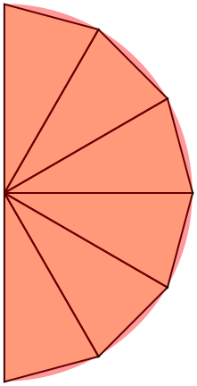
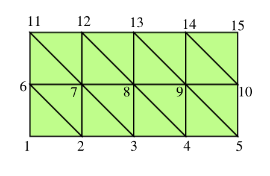
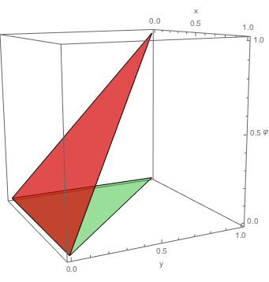
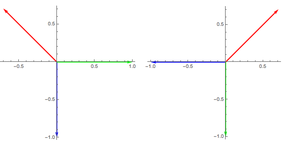
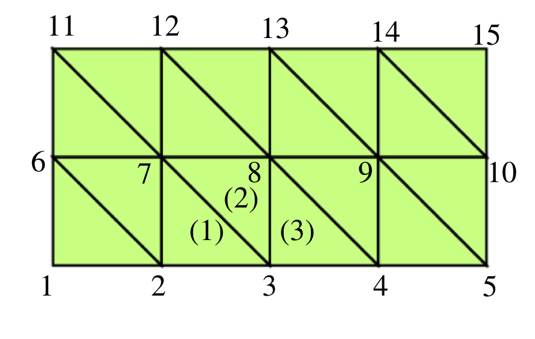

Bútaaðferðir
============

Í þessum kafla fjöllum við um :hover:`bútaaðferð`. Eins og fyrir mismunaaðferðir eru til ólíkar útgáfur og við ætlum að skoða einföldustu tilfellin. Ennfremur,  ætlum við að læra bútaaðferðir fyrir jaðargildisverkefni í :math:`\mathbb R` og :math:`\mathbb{R}^2`.

Hlutheildun, innfeldi og tvílínulegt form
-----------------------------------------

Jaðargildisverkefni í :math:`\mathbb R`
~~~~~~~~~~~~~~~~~~~~~~~~~~~~~~~~~~~~~~~~
.. _ch-6.1.1:

Jaðargildisverkefnin í :math:`\mathbb R` sem við viljum leysa eru

.. math::
    \begin{cases}
    Lu=-(pu')'+qu=f,& \text{ á } ]a,b[,\\
    B_1u=\alpha_1u(a)-\beta_1u'(a)=\gamma_1,&(\alpha_1,\beta_1)\neq (0,0),\\
    B_2u=\alpha_2u(b)+\beta_2u'(b)=\gamma_2,&(\alpha_2,\beta_2)\neq (0,0).
    \end{cases}
    :label: eq.system1

Þá er  afleiðuvirkinn af Sturm-Liouville gerð, og við gerum ráð fyrir að :math:`p` sé samfellt diffranlegt á bili :math:`[a,b]` og :math:`q` sé samfellt á  :math:`[a,b]`.

Við skilgreinum :math:`V` sem mengi raungildra falla sem eru samfelld og samfellt diffranleg á köflum á bilinu  :math:`[a,b]`, þ.e.a.s.

.. math::
    V=\{ \varphi: [a,b]\subset{\mathbb  R}\to {{\mathbb  R}}~; \varphi \in C[a,b]\cap PC^1[a,b] \}.

Athugum að

1. :math:`\varphi^\prime` er heildanlegt fall á bilinu :math:`[a,b]` og undirstöðusetningin gildir í :math:`V`, þ.e.a.s.

.. math::
    \varphi(x)=\varphi(c)+\int_c^x\varphi'(t)\, dt, \qquad
    x,c\in [a,b],

af því að enda þótt :math:`\varphi` sé ekki diffranlegt t.d. í :math:`x_\ell`, þá er :math:`\varphi` í :math:`PC^1[a,b]`, þ.e.a.s. markgildi frá vinstri og hægri af afleiðunni :math:`\varphi^\prime` eru til í :math:`x_\ell`,þ.e. :math:`\varphi^\prime(x_\ell+)` og  :math:`\varphi^\prime(x_\ell-)` eru til og eru endanleg. Með öðrum orðum getum við alltaf skilgreint afleiðuna í :math:`x_\ell` með

.. math::
    \varphi^\prime(x_\ell)=\tfrac 12\big(\varphi^\prime(x_\ell+)+\varphi^\prime(x_\ell-)\big).

2. Ennfremur gildir hlutheildun, þ.e. ef :math:`\varphi, \psi \in V` þá er

.. math::
    -\int_c^d\psi'(x)\varphi(x)\, dx
    =\int_c^d\psi(x)\varphi'(x) \, dx
    -\big[\psi(x)\varphi(x)\big]_c^d
    \qquad c,d\in [a,b].

Munið að í :ref:`3.3.2 <ch-3.3.2>` skilgreindum við

I. Innfeldi

Fyrir  tvö raungild heildanleg föll :math:`\varphi` og :math:`\psi` á bilinu :math:`[a,b]`, þá er innfeldi þeirra skilgreint með

.. math::
    {{\langle \varphi,\psi\rangle}}=\int_a^b \varphi(x)\psi(x)\, dx
    =\int_a^b \varphi \psi \, dx.

Ljóst er að innfeldi er vel skilgreint fyrir föllin í :math:`V`.

II. Tvílínulegt form sem :math:`L` gefur af sér

Látum :math:`L` vera afleiðuvirkja af Sturm-Liouville gerð. Við skilgreinum tvílínulega formið sem :math:`L` gefur af sér með

.. math::
    {{\langle \varphi,\psi\rangle}}_L=\int_a^b\big(p\varphi' \psi'
    +q\varphi \psi\big)\, dx,
    \qquad \varphi, \psi \in V.

Nú ætlum við að nota þetta til þess að undirbúa nálgunarformúlur fyrir :eq:`eq.system1`.
Við tökum :math:`\varphi\in V` og :math:`v\in \mathcal C^2([a,b])` og við reiknum eftirfarandi innfeldi út

.. math::
    {{\langle Lv,\varphi\rangle}} &=& -\int_a^b {d\over dx}\left(p(x){dv\over dx} \right)\varphi dx+ \int_a^b q(x) v(x) \varphi(x) dx
    \\
        &=&
    -\big[pv'\varphi\big]_a^b+ \int_a^b\big(pv'\varphi'+qv\varphi \big) \, dx.

Við sjáum að það er

.. math::
    {{\langle Lv,\varphi\rangle}}={{\langle v,\varphi\rangle}}_L-\big[pv'\varphi\big]_a^b.

1. Ef við gerum ráð fyrir að :math:`\varphi` uppfylli eftirfarandi jaðarskilyrði

.. math::
     \varphi(a)=\varphi(b)=0

þá verður innfeldið :math:`\langle Lv,\varphi\rangle`

.. math::
    {{\langle Lv,\varphi\rangle}}={{\langle v,\varphi\rangle}}_L\,.

2. Ef við gerum ráð fyrir að :math:`v=u` sé **lausn á afleiðujöfnunni** :eq:`eq.system1`, þá er :math:`Lu=f` og innfeldið verður

.. math::
    {{\langle f,\varphi\rangle}}={{\langle u,\varphi\rangle}}_L, \qquad \varphi\in V, ~ \varphi(a)=\varphi(b)=0\,.
    :label: eq.cond1

Jaðargildisverkefnin í :math:`\mathbb{R}^2`
~~~~~~~~~~~~~~~~~~~~~~~~~~~~~~~~~~~~~~~~~~~
.. _ch-6.1.2:

Við viljum halda áfram á svipaðan hátt í :math:`\mathbb{R}^2`. Nú er jaðargildisverkefnið í :math:`D\subset \mathbb{R}^2`

.. math::
    \begin{cases}
    Lu=-\nabla\cdot (p\nabla u)+qu=f, \qquad \text{ á } D,\\
    \alpha u+\beta\dfrac{\partial u}{\partial n}
    =\gamma, \qquad  \text{á } \ \partial D,
    \end{cases}
    :label: eq.system2

og :math:`p\in C^1(D)`, :math:`q` of :math:`f` eru samfelld á :math:`D`. Athugum að :math:`p, q, f` eru föll á :math:`D\subset \mathbb{R}^2`, og :math:`\gamma, \alpha, \beta` eru föll á :math:`\partial D\subset \mathbb{R}^2`.

Athugum

1. Leibniz reglan í :math:`\mathbb{R}^n`

.. math::
    \nabla\cdot \big(\varphi p\nabla u\big)=
    \big(\nabla\cdot(p\nabla u)\big)\varphi
    +p\nabla u  \cdot \nabla \varphi,

af því að

.. math::
    \nabla\cdot (\varphi {\mathbf V})=(\nabla\cdot {\mathbf V})\varphi  + {\mathbf V} \cdot \nabla  \varphi,

og hér :math:`\mathbf V= p\nabla u`.

2. Gauss setning

.. math::
    \iint_D \nabla \cdot (\varphi p\nabla u)\, dA
    =\int_{\partial D} p\dfrac{\partial u}{\partial n}\varphi \, ds

3. Hlutheildun í :math:`\mathbb{R}^2`

Við sjáum að úr 1. og 2. fáum við

.. math::
    -\iint\limits_D\nabla\cdot \big( p\nabla  u\big) \varphi \, dA=
    -\int\limits_{\partial D} p\dfrac{\partial u}{\partial n}\varphi\, ds
    +\iint\limits_D p\nabla  u\cdot \nabla  \varphi\, dA.

Munið að

1. Innfeldi

Gerum ráð fyrir að :math:`\varphi` og :math:`\psi` séu tvö raungild heildanleg föll á :math:`\bar D= D \cap \partial D`, þá er innfeldi þeirra

.. math::
    {{\langle \varphi,\psi\rangle}}=
    \iint_D \varphi(x,y)\psi(x,y)\, dxdy
    =\iint_D \varphi\psi \, dA.

2. Tvílínulegt form sem :math:`L` gefur af sér

Látum :math:`L` vera hlutafleiðuvirkja eins og í verkefninu :eq:`eq.system1`, og gerum ráð fyrir að :math:`\varphi` og :math:`\psi` séu þ.a. fyrsta stigs hlutafleiður þeirra séu vel skilgreindar og takmarkaðar á :math:`D`. Þá skilgreinum við tvílínulega formið með

.. math::
    {{\langle \varphi,\psi\rangle}}_L=\iint\limits_D\big(p\, \nabla  \varphi\cdot \nabla
    \psi +q\, \varphi\psi\big)\, dA.

Við skoðum nú innfeldi milli :math:`Lv` og :math:`\phi`, þar sem :math:`L` er virkinn í :eq:`eq.system2`. Við gerum ráð fyrir að :math:`v\in C^2(\overline D)`.
Þá er

.. math::
    \begin{aligned}
   \langle L v, \varphi\rangle=\iint_D \big(Lv\big) \varphi\, dA
    &=\iint_D\big( p\,  \nabla v\cdot \nabla \varphi+q v\varphi\big)  \,
    dA-\int_{\partial D}p\dfrac{\partial v}{\partial n} \varphi \, ds\\
    &={{\langle v,\varphi\rangle}}_L
    -\int_{\partial D}p\dfrac{\partial v}{\partial n} \varphi \, ds.\end{aligned}

Við sjáum að

1. Ef :math:`\varphi` er núll á jaðrinum :math:`\partial D`, þá er

.. math::
    \langle L v, \varphi\rangle={{\langle v,\varphi\rangle}}_L

2. Ef :math:`v=u` er lausn á jaðarverkefni :eq:`eq.system2`, þá gildir

.. math::
    {{\langle u,\varphi\rangle}}_L={{\langle f,\varphi\rangle}}, \qquad \varphi\in C^1(\overline
    D), \quad \varphi=0 \text{ á } \partial D.
    :label: eq.cond2

Aðferð Galerkins fyrir Dirichlet-verkefnið
------------------------------------------

Galerkin-aðferðir í einni vídd fyrir Dirichlet-verkefni
~~~~~~~~~~~~~~~~~~~~~~~~~~~~~~~~~~~~~~~~~~~~~~~~~~~~~~~
.. _ch-6.2.1:

Við lítum á jaðargildisverkefnið :eq:`eq.system1` í sértilfellinu þegar :math:`\beta_1 =\beta_2=0`, þ.e.a.s. við höfum Dirichlet-verkefni:

.. math::
    \begin{cases}
    Lu=-(pu')'+qu=f,& \text{ á } ]a,b[,\\
    u(a)=\gamma_1/\alpha_1, \quad  u(b)=\gamma_2/\alpha_2.
    \end{cases}
    :label: eq.diri1

Aðalatriðið í Galerkin-aðferð er að smíða nálgunarfall :math:`v(x)` fyrir lausn :math:`u` á Dirichlet-verkefninu að ofan á eftirfarandi hátt

.. math::
    v(x)=\psi_0(x)+c_1\varphi_1(x)+\cdots+c_N\varphi_N(x),

þar sem

1. fallið :math:`\psi_0(x)` er valið þ.a. það uppfyllir jaðarskilyrðin í :eq:`eq.diri1`, þ.e.a.s.

.. math::
    \psi_0(a)=\gamma_1/\alpha_1, \qquad  \psi_0(b)=\gamma_2/\alpha_2,

2. föllin :math:`\varphi_1,\dots,\varphi_N` eru valin þ.a. þau uppfylla óhliðruðu jaðarskilyrðin, þ.e.a.s.

.. math::
    \varphi_j(a)=\varphi_j(b)=0,  \qquad j=1, \dots, N,

3. stuðlanir :math:`c_1, \dots, c_N` eru óþekktir, og markmiðið er að reikna þá út.

Það er ljóst að nálgunarfallið :math:`v` uppfyllir jaðarskilyrðin í :eq:`eq.diri1` *by construction*, þ.e.a.s.

.. math::
    v(a)=\gamma_1/\alpha_1, \qquad  v(b)=\gamma_2/\alpha_2.

Hvernig getum við fundið nálgunargildi :math:`c_1, \dots, c_N`?
Við krefjumst að :math:`v` uppfylli jöfnu :eq:`eq.cond1`, þá er

.. math::
    {{\langle v,\varphi_j\rangle}}_L={{\langle f,\varphi_j\rangle}}, \qquad j=1,2,\dots,N.

Við sjáum að þetta er jafngilt því að

.. math::
    {{\langle \psi_0,\varphi_j\rangle}}_L+\sum_{k=1}^Nc_k{{\langle \varphi_k,\varphi_j\rangle}}_L
    ={{\langle f,\varphi_j\rangle}}, \qquad j=1,\dots,N.

Nú höfum við :math:`N\times N` jöfnuhneppi fyrir :math:`N` nálgunargildi, af því að

.. math::
    \begin{bmatrix}
    \langle \varphi_1, \varphi_1\rangle_L & \langle \varphi_1, \varphi_2\rangle_L & \dots &\langle \varphi_1, \varphi_N\rangle_L \\
    \langle \varphi_2, \varphi_1\rangle_L & \langle \varphi_2, \varphi_2\rangle_L & \dots &\langle \varphi_2, \varphi_N\rangle_L \\
    \vdots & \vdots &\ddots &\vdots \\
    \langle \varphi_N, \varphi_1\rangle_L & \langle \varphi_N, \varphi_2\rangle_L & \dots & \langle \varphi_N, \varphi_N\rangle_L
    \end{bmatrix}
    \begin{bmatrix}
    c_1 \\ c_2 \\ \vdots \\c_N
    \end{bmatrix} =
    \begin{bmatrix}
    -\langle \psi_0, \varphi_1\rangle_L +\langle f, \varphi_1\rangle \\
    -\langle \psi_0, \varphi_2\rangle_L +\langle  f, \varphi_2\rangle\\ \vdots \\ -\langle \psi_0, \varphi_N\rangle_L +\langle  f,\varphi_N\rangle
    \end{bmatrix}.
    :label: eq.matrixG1d

Almennt, ef afleiðuvirki er línulegur, þá er hneppið að ofan línulegt.

**Þýðing og sambandið við jaðargildisverkefnin**

Við sjáum að hugmyndin að baki aðferð Galerkins er frekar ólik m.v. mismunaaðferð.
Í mismunaaðferðum fáum við algebrujöfnuhneppi úr afleiðujöfnum með því að nálga afleiður með mismunakvótum.
Hér fáum við algebrujöfnuhneppi með því þess að krefjast þess að nálgunarfall uppfylli *veika framsetningu* afleiðujöfnunnar, sem er :eq:`eq.cond1`.

Munið að :math:`{{\langle v,\varphi_j\rangle}}_L=\langle L v, \varphi_j\rangle`, þá segir jafnan :eq:`eq.cond1` okkur að

.. math::
    {{\langle (L v-f),\varphi_j\rangle}}=0.

Ef :math:`u` er nákvæm lausn á jöfnunni :eq:`eq.diri1`, það þýðir að :math:`Lu=f`, svo :math:`(L v-f)` er mismunur milli nálgunarfallsins :math:`v` og lausnarinnar :math:`u`, og við krefjumst þess að mismunur þeirra sé  **þverstæður** m.t.t. fallanna :math:`\varphi_j` sem við notum til þess að smiða nálgunarfallið :math:`v`.

Af hverju? Aðalatriðið er að mismunurinn er lágmarkaður ef hann er þverstæður m.t.t. plansins sem er spannað af :math:`\varphi_j, ~j=1, \dots, N`, þ.e.

.. math::
    {{\langle L(v-u),\varphi_j\rangle}}=0.

.. admonition:: Athugasemd
    :class: athugasemd

    Föllin :math:`\varphi_j~j=1, \dots, N` þurfa að vera línulega óháð! Annars hefur fylkið í :eq:`eq.matrixG1d` ekki max stétt!

Galerkin-aðferðir í tveimur víddum fyrir Dirichlet-verkefni
~~~~~~~~~~~~~~~~~~~~~~~~~~~~~~~~~~~~~~~~~~~~~~~~~~~~~~~~~~~

Við lítum á jaðargildisverkefnið :eq:`eq.system2` í sértilfellinu þegar :math:`\beta_1 =\beta_2=0` á :math:`\partial D`, þ.e

.. math::
    \begin{cases}
    Lu=-\nabla\cdot (p\nabla u)+qu=f, \qquad \text{ á } D,\\
    u=\gamma/\alpha, \qquad  \text{á } \ \partial D.
    \end{cases}
    :label: eq.diri2

Við höldum áfram á svipaðan hátt, og við skilgreinum nálgunarfall :math:`v`

.. math::
    v(x,y)=\psi_0(x,y)+c_1\varphi_1(x,y)+\cdots+c_N\varphi_N(x,y),
    (x,y) \in \bar D,

þ.a.

1. fall :math:`\psi_0(x,y)` uppfyllir eftirfarandi jaðarskilyrði

.. math::
    \psi_0(x,y)=\gamma(x,y)/\alpha(x,y), \qquad (x,y) \in \partial D

2. föllin :math:`\phi_j~j=1, \dots, N` uppfylla eftirfarandi jaðarskilyrði

.. math::
    \varphi_j(x,y)=0,  \qquad (x,y) \in \partial D, \qquad j=1, \dots, N,

Það er ljóst að nálgunarfallið  uppfyllir a.m.k. jaðarskilyrðin í :eq:`eq.diri2`.
Eins og áður er markmiðið  að reikna  stuðlana :math:`c_j`, og til þess að ákvarða þá notum við skilyrði :eq:`eq.cond2`,

.. math::
    \langle v, \varphi_j\rangle_L = \langle f , \varphi_j\rangle \,, \qquad j=1, \dots, N,

sem gefur okkur :math:`N` skilyrði fyrir :math:`c_j`

.. math::
    {{\langle \psi_0,\varphi_j\rangle}}_L+\sum_{k=1}^Nc_k{{\langle \varphi_k,\varphi_j\rangle}}_L
    ={{\langle f,\varphi_j\rangle}}, \qquad j=1,\dots,N.

Eins og áður getum við skrifað :math:`N \times N` hneppi, þ.a. :math:`[A]\vec{c} =\vec{b}`, þar sem

.. math::
    A_{jk}={{\langle \varphi_k,\varphi_j\rangle}}_L
    ={{\langle \varphi_j,\varphi_k\rangle}}_L, \qquad j,k=1,\dots,N,

og

.. math::
    b_j={{\langle f,\varphi_j\rangle}}-{{\langle \psi_0,\varphi_j\rangle}}_L, \qquad j=1,\dots,N.

Formlega höfum við sömu hneppi eins og í :math:`\mathbb R`. En nú erum við í :math:`\mathbb{R}^2`, þ.e.a.s. innfeldið og tvílínulega formið innihalda tvöfalt heildi (yfir :math:`x, y`), sjáið :ref:`6.1.2<ch-6.1.2>`.

Bútaaðferð í einni vídd
-----------------------

Hér beinum við  athygli okkar að jaðargildisverkefni í einni vídd þar sem við veljum þúfugrunnföllin til þess að nálga lausn.

Almennt er jaðargildisverkefnið gefið með :eq:`eq.system1`.
Við veljum skiptingu á bili :math:`[a,b]`, þ.e.

.. math::
    a=x_0<x_1<\cdots<x_N=b, ~~~ h:= (b-a)/N, ~~ x_j= a+j h, ~~j=0, \dots, N.

Munið líka að miðpunktar eru gefnir með

.. math::
    m_j= x_j+ h,~~~~j=0, \dots, N-1.

Munið að þúfugrunnföllin eru skilgreind þ.a. :math:`\varphi_j(x_i)=\delta_{ij}`, sjáið :ref:`5.2.2<ch-5.2.2>`.
Sérstaklega, þýðir það að þúfugrunnföllin eru í :math:`V`, og að :math:`\varphi_0(a)=1` og :math:`\varphi_N(b)=1`.

Blönduð jaðarskilyrði í báðum endapunktum
~~~~~~~~~~~~~~~~~~~~~~~~~~~~~~~~~~~~~~~~~

Við gerum ráð fyrir að :math:`\beta_1\neq 0` og :math:`\beta_2\neq 0`.

Við skilgreinum nálgunarfallið

.. math::
    v(x)=c_0\varphi_0(x)+\cdots+c_N\varphi_N(x).

Munið kafla :ref:`6.1.2<ch-6.1.2>`, almennt höfum við

.. math::
    {{\langle u,\varphi\rangle}}_L + p(a)u'(a)\varphi(a)-p(b)u'(b)\varphi(b)
    = {{\langle f,\varphi\rangle}}, \qquad \varphi\in V.
    :label: eq.form1dgenv1

Við sjáum núna að :math:`\varphi(a), \varphi(b)` eru ekki núll almennt, svo við þurfum að skoða jaðarliði líka.
Fyrst notum við jaðarskilyrði í :eq:`eq.system1`, þá fáum við

.. math::
    {{\langle u,\varphi\rangle}}_L  +
    \dfrac {p(a)}{\beta_1}(\alpha_1u(a)-\gamma_1)\varphi(a)
    +\dfrac{p(b)}{\beta_2}(\alpha_2u(b)-\gamma_2)\varphi(b)
    ={{\langle f,\varphi\rangle}}.

Nú stingum við í jöfnuna að nálgunarfallið er gefið með samantekt af þúfugrunnföllum og notum :math:`\varphi_j` í staðinn fyrir :math:`\varphi`. Þá er fyrir :math:`j=0, \dots, N`

.. math::
    \sum_{i=0}^N c_i{{\langle \varphi_i ,\varphi_j\rangle}}_L  +
    \dfrac {p(a)}{\beta_1}(\alpha_1 \sum_{i=0}^N c_i \varphi_i(a)-\gamma_1)\varphi_j(a)
    +\dfrac{p(b)}{\beta_2}(\alpha_2\sum_{i=0}^N c_i \varphi_i(b)-\gamma_2)\varphi_j(b)
    ={{\langle f,\varphi_j\rangle}}.

Það er gagnlegt að skrifa nálgunarformúlur á fylkjaformi, þ.e.a.s.

.. math::
    A{\mathbf c}={\mathbf b}, ~~~\text{þar sem}~~~ A=\big(a_{jk}\big)_{j,k=0}^N.

Stök fylkisins :math:`A` eru gefin með

.. math::
    a_{ji}= {{\langle \varphi_i ,\varphi_j\rangle}}_L+ \dfrac {p(a)\alpha_1}{\beta_1}\varphi_i(a)\varphi_j(a)+\dfrac {p(b)\alpha_2}{\beta_2}\varphi_i(b)\varphi_j(b),~~~i,j=0, \dots, N,

og stuðlar vigursins :math:`\mathbf b` eru gefnir með

.. math::
    b_j
    ={{\langle f,\varphi_j\rangle}}+\dfrac {p(a)\gamma_1}{\beta_1}\varphi_j(a)
    +\dfrac{p(b)\gamma_2}{\beta_2}\varphi_j(b), ~~~j=0, \dots, N.

Við viljum skoða jöfnuhneppið nánar. Munið

T.d. fyrir :math:`j=0` þurfum við bara að reikna eftirfarandi stök

.. math::
    \begin{aligned}
    a_{00}&=\int_{x_0}^{x_1}\big(p(\varphi_0')^2+q\varphi_0^2\big)\, dx+
    \dfrac{p(a)\alpha_1}{\beta_1}
    \\
    a_{01}&=
    \int_{x_0}^{x_1}\big(p\varphi_0'\varphi_1'+q\varphi_0\varphi_1\big)\,
    dx
    \end{aligned}

af því að :math:`\varphi_0` hefur stoð á bili :math:`[x_0,x_1]`, :math:`\varphi_j` með :math:`j=1, \dots, N-1` er ekki núll bara yfir bilið :math:`[x_{j-1},x_{j+1}]` og :math:`\varphi_N` er ekki núll á bili :math:`[x_{N-1},x_{N}]`.

Lítum nú a stuðla hægri hliðarinnar, þá er

.. math::
    b_0=\int_{x_0}^{x_1}f\varphi_0\, dx+\dfrac{p(a)\gamma_1}{\beta_1}
    \approx \dfrac{h f(m_0)}2+\dfrac{p(a)\gamma_1}{\beta_1},

af því að :math:`\varphi_0(a)=1` og :math:`\varphi_0(b)=0`.

Nú viljum við nálga heildið að ofan, við getum haldið áfram eins og áður, t.d.

.. math::
    \begin{aligned}
    a_{00}&=\int_{x_0}^{x_1}\big(p(\varphi_0')^2+q\varphi_0^2\big)\, dx+
    \dfrac{p(a)\alpha_1}{\beta_1}
    \approx \dfrac{p(m_0)}{h}+\dfrac{h q(m_0)}3+\dfrac{p(a)\alpha_1}{\beta_1}
    \\
    a_{01}&=
    \int_{x_0}^{x_1}\big(p\varphi_0'\varphi_1'+q\varphi_0\varphi_1\big)\,
    dx
    \approx -\dfrac{p(m_0)}{h}+\dfrac{h q(m_0)}6.
    \\
    b_0&=\int_{x_0}^{x_1}f\varphi_0\, dx+\dfrac{p(a)\gamma_1}{\beta_1}
    \approx \dfrac{h f(m_0)}6+\dfrac{p(a)\gamma_1}{\beta_1}.\end{aligned}

Fyrir :math:`j=1, \dots, N-1` þurfum við að reikna stökin :math:`a_{jj-1},a_{jj},a_{jj+1}` og líka :math:`\mathbf{b}_j`. Við notum sömu nálgun fyrir heildið, þá er

.. math::
    \begin{aligned}
    a_{j,j-1}&=\int_{x_{j-1}}^{x_j}
    \big( p\varphi_{j-1}'\varphi_j'+q\varphi_{j-1}\varphi_j\big)\, dx
    \approx -\dfrac{p(m_{j-1})}{h}+\dfrac{h q(m_{j-1})}6,\\
    a_{j,j}&=\int_{x_{j-1}}^{x_{j+1}}
    \big( p(\varphi_j')^2+q \varphi_j^2\big)\, dx
    \approx \dfrac{p(m_{j-1})}{h}+\dfrac{p(m_j)}{h}
    +\dfrac{(q(m_{j-1})+ q(m_j))h}3,\\
    a_{j,j+1}&=\int_{x_j}^{x_{j+1}}
    \big( p\varphi_j'\varphi_{j+1}'+q \varphi_j\varphi_{j+1}\big)\, dx
    \approx -\dfrac{p(m_j)}{h}
    +\dfrac{h q(m_j)}6,\\
    b_j&=\int_{x_{j-1}}^{x_{j+1}}f\varphi_j\, dx
    \approx \dfrac{h (f(m_{j-1})+f(m_j))}2.\end{aligned}

Að lokum þurfum við að skoða :math:`j=N`, nú höfum við að :math:`\varphi_N(b)=1`, þá fáum við

.. math::
    \begin{aligned}
    a_{N,N-1}&=\int_{x_{N-1}}^{x_N}
    \big( p\varphi_{N-1}'\varphi_N'+q\varphi_{N-1}\varphi_N\big)\, dx
    \approx -\dfrac{p(m_{N-1})}{h}+\dfrac{h q(m_{N-1})}6,\\
    a_{NN}&=\int_{x_{N-1}}^{x_{N}}
    \big( p\big(\varphi_N'\big)^2+q\varphi_N^2\big)\, dx
    +\dfrac{p(b)\alpha_2}{\beta_2}
    \approx \dfrac{p(m_{N-1})}{h}
    +\dfrac{h q(m_{N-1})}3+\dfrac{p(b)\alpha_2}{\beta_2},\\
    b_N&=\int_{x_{N-1}}^{x_{N}}f\varphi_N\, dx+\dfrac{p(b)\gamma_2}{\beta_2}
    \approx \dfrac{h f(m_{N-1})}2+\dfrac{p(b)\gamma_2}{\beta_2}.\end{aligned}

Fallsjaðarskilyrði
~~~~~~~~~~~~~~~~~~

Lítum á jaðargildisverkefnið :eq:`eq.system1`.

Við gerum ráð fyrir að :math:`\beta_1=0`, þ.e.a.s. að við höfum Dirchlet jaðarskilyrði í vinstri endapunktinum, þ.e. :math:`u(a)=\gamma_1/\alpha_1`.

Þá  setjum við :math:`c_0=\gamma_1/\alpha_1`, svo að nálgunarfallið :math:`v` tekur gildi :math:`\gamma_1/\alpha_1` í punktinum :math:`a`.
Það þýðir að fyrir :math:`j=0` setjum við

.. math::
    a_{00}=1, \quad a_{0j}=0, \ j=1,\dots,N, \ b_0=\gamma_1/\alpha_1,

og jöfnuhneppið er eins og áður.

Ef við höfum Dirchlet jaðarskilyrði í hægri endapunktinum, þ.e.a.s. að :math:`\beta_2=0`, þá veljum við :math:`c_N=\gamma_2/\alpha_2`, svo að nálgunarfallið uppfyllir rétt jaðarskilyrði í :math:`b`.
Þess vegna setjum við

.. math::
    a_{NN}=1, \quad a_{Nj}=0, \ j=0,\dots,N-1, \ b_N=\gamma_2/\alpha_2.

Aðferð Galerkins með almennum jaðarskilyrðum
--------------------------------------------

Við lítum á jaðargildisverkefnið :eq:`eq.system1` og :eq:`eq.system2`. Hér viljum við ekki tilgreina grunn fyrir nálgunarfall, en  ætlum frekar að ákvarða skilyrði og nálgunarformúlur almennt.

Við skilgreinum *veika framsetningu á jaðargildisverkefnunum* með formúlu

.. math::
    {{\langle u,\varphi\rangle}}_{L,B}={{\langle f,\varphi\rangle}}+T_B(\varphi), \qquad
    \varphi\in V_B,
    :label: eq.weakform1d

þar sem

1. :math:`(\psi,\varphi)\mapsto {{\langle \psi,\varphi\rangle}}_{L,B}` er tvílínulegt form sem er bæði háð virkjanum :math:`L` og jaðarskilyrðunum :math:`B`,

2. :math:`\varphi\mapsto T_B(\varphi)` er línulegt form sem er háð jaðarskilyrðunum :math:`B`,

3. :math:`V_B` er mengi af föllum, sem skilgreint er út frá jaðarskilyrðunum.

Við veljum :math:`\psi_0` þ.a. fallið uppfylli viðeigandi jaðarskilyrði, og eftir það veljum við :math:`\varphi_1,\dots,\varphi_N\in V_B` og krefjumst þess að nálgunarfallið :math:`v=\psi_0+c_1\varphi_1+\cdots+\varphi_N` uppfylli línulega jöfnuhneppið :eq:`eq.weakform1d`.

Þá er almennt

.. math::
    {{\langle v,\varphi_j\rangle}}_{L,B}={{\langle f,\varphi_j\rangle}}+T_B(\varphi_j),
    \qquad j=1,\dots,N.

Á fylkjaformi höfum við

.. math::
    a_{jk} &=&{{\langle \varphi_k,\varphi_j\rangle}}_{L,B}
    ={{\langle \varphi_j,\varphi_k\rangle}}_{L,B}, \qquad j,k=1,\dots,N,\\
    b_j &=& {{\langle f,\varphi_j\rangle}}+T_B(\varphi_j)-{{\langle \psi_0,\varphi_j\rangle}}_{L,B},
    \qquad j=1,\dots,N,

sem gefur okkur jöfnuhneppið á fylkjaformi:

.. math::
    A{\mathbf c}={\mathbf b}, ~~~\text{þar sem}~~~ A=\big(a_{jk}\big)_{j,k=1}^N.

Þá höfum við :math:`N` algebrujöfnur fyrir :math:`N` nálgunargildi :math:`c_j, ~j=1, \dots, N`, og við getum reiknað þau út.

Í einni vídd
~~~~~~~~~~~~

Við skoðum nú :eq:`eq.weakform1d` í ólíkum tilfellum.
Munið samkvæmt kafla :ref:`6.1.2<ch-6.1.2>`, höfum við almennt

.. math::
    {{\langle u,\varphi\rangle}}_L + p(a)u'(a)\varphi(a)-p(b)u'(b)\varphi(b)
    = {{\langle f,\varphi\rangle}}, \qquad \varphi\in V.
    :label: eq.form1dgen

I. **Dirichlet-jaðarskilyrði**

Þá er verkefnið eins og :eq:`eq.diri1` sem við  fjölluðum um í :ref:`6.2.1<ch-6.2.1>`. Þá veljum við :math:`\psi_0` þ.a. :math:`\psi_0(a)=\gamma_1/\alpha_1` og :math:`\psi_0(b)=\gamma_2/\alpha_2`.

Hér skilgreinum við mengi falla

.. math::
    V_B=\{\varphi\in V\,;\, \varphi(a)=\varphi(b)=0\},

og þá er

.. math::
    {{\langle u,\varphi\rangle}}_L={{\langle f,\varphi\rangle}},

sem segir okkur að

.. math::
    {{\langle \varphi,\psi\rangle}}_{L,B}={{\langle \varphi,\psi\rangle}}_L ~~~\text{og}~~~ T_B(\varphi)=0 ~~~ \varphi,\psi\in V_B.

II. **Dirichlet jaðarskilyrði í vinstri endapunkti**

Lítum á

.. math::
    \begin{cases}
    Lu=-(pu')'+qu=f, \\
    B_1u=\alpha_1u(a)=\gamma_1,  \\
    B_2u=\alpha_2u(b)+{\beta}_2u'(b)=\gamma_2, \quad \beta_2\neq 0.
    \end{cases}

Nú tökum við

.. math::
    V_B=\{\varphi\in V\,;\, \varphi(a)=0\},

og notum jaðarskilyrði í hægri endapunkti til þess að einfalda tvílínulega formið :eq:`eq.form1dgen`, þ.e.a.s.

.. math::
    {{\langle u,\varphi\rangle}}_L
    +\dfrac{p(b)\alpha_2}{\beta_2}u(b)\varphi(b)
    ={{\langle f,\varphi\rangle}}
    +\dfrac{p(b)\gamma_2}{\beta_2}\varphi(b), ~~~ \varphi\in V_B.

Ef við berum jöfnuna að ofan saman við jöfnu :eq:`eq.weakform1d`,  sjáum við að

.. math::
    {{\langle \varphi,\psi\rangle}}_{L,B}={{\langle \varphi,\psi\rangle}}_L
    +\dfrac{p(b)\alpha_2}{\beta_2}\varphi(b)\psi(b),
    \quad \text{ og } \quad
    T_B(\varphi)=
    \dfrac{p(b)\gamma_2}{\beta_2}\varphi(b),
    \qquad \varphi,\psi\in V_B.

III. **Dirichlet jaðarskilyrði í hægri endapunkti**

Lítum á

.. math::
    \begin{cases}
    Lu=-(pu')'+qu=f, \\
    B_1u={\alpha}_1u(a)-\beta_1u'(a)=\gamma_1, \quad \beta_1\neq 0 \\
    B_2u=\alpha_2u(b)=\gamma_2,
    \end{cases}

og höldum áfram eins og áður. Við skilgreinum

.. math::
    V_B=\{\varphi\in V \,;\, \varphi(b)=0 \},

og með því að nota jaðarskilyrði verður formið :eq:`eq.form1dgen`

.. math::
    {{\langle u,\varphi\rangle}}_L
    +\dfrac {p(a)\alpha_1}{\beta_1}u(a)\varphi(a)
    ={{\langle f,\varphi\rangle}}
    +\dfrac {p(a)\gamma_1}{\beta_1}\varphi(a), \qquad \varphi\in V_B.

Á svipaðan hátt berum við jöfnuna að ofan saman við :eq:`eq.weakform1d`, og sjáum að hér gildir

.. math::
    {{\langle \varphi,\psi\rangle}}_{L,B}={{\langle \varphi,\psi\rangle}}_L
    +\dfrac {p(a)\alpha_1}{\beta_1}\varphi(a)\psi(a)
    \quad \text{ og } \quad
    T_B(\varphi)=\dfrac {p(a)\gamma_1}{\beta_1}\varphi(a),
    \qquad \varphi,\psi\in V_B.

IV. **Blönduð jaðarskilyrði í báðum endapunktum**

Jaðargildisverkefnið er

.. math::
    \begin{cases}
    Lu=-(pu')'+qu=f, \\
    B_1u={\alpha}_1u(a)-\beta_1u'(a)=\gamma_1, \quad \beta_1\neq 0, \\
    B_2u=\alpha_2u(b)+{\beta}_2u'(b)=\gamma_2, \quad \beta_2\neq 0.
    \end{cases}

Ef :math:`\beta_1\neq 0` og :math:`\beta_2\neq 0`, tökum við  :math:`\psi_0` sem núllfallið, þá er nálgunarfallið gefið með

.. math::
    v(x)=c_1\varphi_1(x)+\cdots+c_N\varphi_N(x),
    ~~~~x \in [a,b].

Við getum notað jaðarskilyrðin til þess að einfalda tvílínulega formið :eq:`eq.form1dgen`, þ.e.a.s.

.. math::
    {{\langle u,\varphi\rangle}}_L  +
    \dfrac {p(a)}{\beta_1}(\alpha_1u(a)-\gamma_1)\varphi(a)
    +\dfrac{p(b)}{\beta_2}(\alpha_2u(b)-\gamma_2)\varphi(b)
    ={{\langle f,\varphi\rangle}}.

Ef við berum jöfnuna að ofan saman við jöfnu :eq:`eq.weakform1d`,  skiljum við nú hvað :math:`T_B` er og restin, þ.e.a.s mengi fallanna er

.. math::
    V_B=V,

línulega formið :math:`T_B` er gefið með

.. math::
    T_B(\varphi)=\dfrac {p(a)\gamma_1}{\beta_1}\varphi(a)
    +\dfrac{p(b)\gamma_2}{\beta_2}\varphi(b), \qquad \varphi \in V_B,

og  tvílínulega formið :math:`{{\langle \varphi,\psi\rangle}}_{L,B}` er gefið með

.. math::
    {{\langle \varphi,\psi\rangle}}_{L,B}={{\langle \varphi,\psi\rangle}}_L
    +\dfrac {p(a)\alpha_1}{\beta_1}\varphi(a)\psi(a)
    +\dfrac{p(b)\alpha_2}{\beta_2}\varphi(b)\psi(b),
    \qquad \varphi,\psi\in V_B.

Í tveimur víddum
~~~~~~~~~~~~~~~~

Við viljum skoða veiku framsetninguna :eq:`eq.weakform1d` fyrir jaðargildisverkefni í :math:`\mathbb{R}^2`.
Fyrst er gagnlegt að skrifa jaðargildisverkefnið sem

.. math::
    \begin{cases}
    Lu=-\nabla\cdot (p\nabla u)+qu=f, \quad &\text{á } D\\
    u=\gamma,\quad &\text{á } \ \partial D_1,\\
    \alpha u+\beta\dfrac{\partial u}{\partial n}
    =\gamma, \quad  &\text{á } \ \partial D_2,
    \end{cases}

þar sem

.. math::
    \partial_1D=\{(x,y)\in \partial D\,;\, \beta(x,y)=0\}
    \qquad \text{ og } \qquad
    \partial_2D=\{(x,y)\in \partial D\,;\, \beta(x,y)\neq 0\},

og :math:`\partial D=\partial_1D\cup \partial_2 D` (munið :ref:`5.3<ch-5.3>`). Við gerum alltaf ráð fyrir að :math:`p\in C^1` og :math:`q, f` séu samfelld á :math:`\bar D\subset\mathbb{R}^2`.

Við höldum áfram eins og áður, þ.e.a.s.

1. Fyrst veljum við fallið :math:`\psi_0` þ.a. :math:`\psi_0(x,y) = \gamma(x,y)` fyrir öll :math:`(x,y)\in\partial D_1`.

2. Eftir það, veljum við föllin :math:`\varphi` þ.a. :math:`\varphi(x,y)=0` fyrir :math:`(x,y)\in\partial D_1`. Það þýðir að við veljum

.. math::
    V_B=\{ \varphi\in \mathcal{C}^2(\mathbb R)~~: ~~ \varphi(x,y)=0, ~~ (x,y)\in \partial D_1 \}.

3. Að lokum skilgreinum við nálgunarfallið með :math:`v=\psi_0+c_1\varphi_1+\cdots+c_N\varphi_N` og við krefjumst þess að :math:`v` uppfylli veiku framsetninguna :eq:`eq.weakform1d`.

Við sjáum nú hvað framsetningin :eq:`eq.weakform1d` gefur okkur í :math:`\mathbb{R}^2`.
Munið að í kafla :ref:`6.1.2 <ch-6.1.2>` reiknuðum við að

.. math::
    \langle L u, \varphi\rangle= \langle u, \varphi\rangle_L - \int_{\partial D} p \dfrac{\partial u}{\partial n} \varphi ds\,,

en nú tökum við :math:`\varphi \in V_B` og jaðarinn er :math:`\partial D=\partial_1D\cup \partial_2 D`, þá getum við skrifað

.. math::
    \langle L u, \varphi\rangle= \langle u, \varphi\rangle_L - \int_{\partial D_2} p \dfrac{\partial u}{\partial n} \varphi ds\ =
    \langle u, \varphi\rangle_L - \int_{\partial D_2} p \dfrac{\gamma -\alpha u}{\beta} \varphi ds\,,

þar sem í síðasta skrefi höfum við notað jaðarskilyrði í :math:`\partial D_2`. Nú erum við búin að skrifa niður veiku framsetninguna :eq:`eq.weakform1d` fyrir nálgunarfallið :math:`v` í :math:`\mathbb{R}^2`, þá er

.. math::
    \langle v, \varphi\rangle_L + \int_{\partial D_2} p \dfrac{\alpha v}{\beta} \varphi ds = \langle f, \varphi\rangle + \int_{\partial D_2} p \dfrac{\gamma}{\beta} \varphi ds, \qquad \varphi\in V_B.
    :label: eq.weakformR2

Við berum formúluna :eq:`eq.weakformR2` saman við almennu stæðuna :eq:`eq.weakform1d`, og við sjáum að hér höfum við

.. math::
    {\langle \varphi,\psi\rangle}_{L,B}=
    {{\langle \varphi,\psi\rangle}}_L+\int_{\partial_2D}\dfrac{p\alpha}\beta \varphi\psi\, ds\qquad \varphi,\psi\in V_B,

og

.. math::
    T_B(\varphi)=\int_{\partial_2D}\dfrac{p\gamma}\beta \varphi\, ds,
    \qquad \varphi,\psi\in V_B.

Sýnidæmi
~~~~~~~~

.. admonition:: Dæmi
    :class: daemi

    Lítum á eftirfarandi jaðargildisverkefni

    .. math::
        \begin{cases}
        -\nabla^2 u= -\dfrac{\partial^2 u}{\partial x^2 }-\dfrac{\partial^2 u}{\partial y^2 }=1 &\text{á } \ D,\\
        u(x,0)=1-x, &0<x<1,\\
        \dfrac{\partial u}{\partial n}(0,y)=1-y, &0<y<1,\\
        \dfrac{\partial u}{\partial n}(x,1-x)+u(x,1-x)=0, &0<x<1,
        \end{cases}
        :label: eq.example2d

    þar sem :math:`D` er

    .. math::
        D=\{(x,y)\, ;\, 0<x<1, 0<y<1-x\}.

    Hér höfum við að

    .. math::
        &&\partial D_1 =\{(x,0)\, ;\, 0\leq x\leq 1\},\\
        &&\partial D_2 =\{(0,y)\, ;\, 0<y\leq 1\}\cup \{(x,1-x)\, ;\, 0< x<1\}.

    Við viljum nota aðferð Galerkins til þess að ákvarða nálgunarlausn af gerðinni

    .. math::
        v(x,y)=a+bx+cy+dxy.

    Við byrjum á að skoða Dirichlet skilyrði í :math:`\partial D_1`, og við veljum fallið :math:`\psi_0` þ.a. :math:`\psi_0(x,0)=1-x`, fyrir :math:`x\in [0,1]`.
    Þá getum við valið

    .. math::
        \psi_0(x,y)=1-x, \qquad (x,y)\in \bar D.

    Nú veljum við :math:`\varphi` þ.a. :math:`\varphi(x,0)=0`, fyrir :math:`x\in [0,1]`, þ.e.a.s.

    .. math::
        V_B=\{ \varphi\in C^2(\bar D)~~: ~~\varphi(x,y)=0 \quad (x,y)\in \partial D_1 \}.

    Við þurfum að velja :math:`\varphi`, en með þetta val á fallinu :math:`\psi_0`, er það jafngilt að setja :math:`a=1` og :math:`b=-1`. Það vantar bara að velja föll :math:`\varphi_1, \varphi_2`, sem þurfa að vera núll á jaðrinum :math:`\partial D_1`.
    Við sjáum að einliður :math:`y` og :math:`x y` eru núll á jaðrinum :math:`\partial D_1`, þá getum við tekið

    .. math::
        \varphi_1 (x,y)=y , \qquad \varphi_2(x,y)= x y.

    Við beitum :eq:`eq.weakformR2`, en fyrst skoðum við jaðarliði í :eq:`eq.weakformR2`.
    Athugum að :math:`p(x,y)=1`,  :math:`\alpha(0,y)=0` fyrir :math:`y\in ]0,1]`, og :math:`\gamma(x,1-x)=0` fyrir :math:`x\in ]0,1[`, þá er

    .. math::
        && \int_{\partial D_2} p \dfrac{\alpha v}{\beta} \varphi ds=
        \sqrt 2 \int_0^1 v(x,1-x) \varphi(x,1-x)dx, \\
        && \int_{\partial D_2} p \dfrac{\gamma}{\beta} \varphi ds= \int_0^1 (1-y)\varphi(0,y)dy.

    Athugum að

    .. math::
        \nabla \psi_0(x,y)=(-1,0)^T, \quad \nabla \varphi_1(x,y)= (0,1)^T , \quad \nabla \varphi_2(x,y)=(y,x)^T.

    Fyrir :math:`\varphi_1` verður veika framsetningin :eq:`eq.weakformR2`

    .. math::
        &&\int_D \nabla v \cdot \nabla \varphi_1 dA + \sqrt 2 \int_0^1 v(x,1-x) \varphi_1(x,1-x)dx= \int_D \varphi_1 dA+ \int_0^1 (1-y)\varphi_1(0,y)dy,
        \\
        && c_1 \int_D dA+ c_2 \int_D x dA +\sqrt 2 \int_0^1 \left(1+c_1+c_2 x\right)(1-x)^2dx =\int_D y dA + \int_0^1 (1-y)y dy,

    sem gefur okkur

    .. math::
        c_1(\tfrac 12 +\tfrac{\sqrt 2}{3})+c_2(\tfrac 16 +\tfrac{\sqrt 2}{12})=(\tfrac 13 +\tfrac{\sqrt 2}{3}).

    Við höldum áfram á svipaðan hátt fyrir :math:`j=2`, þá er

    .. math::
        &&\int_D \nabla v \cdot \nabla \varphi_2 dA + \sqrt 2 \int_0^1 v(x,1-x) \varphi_2(x,1-x)dx= \int_D \varphi_2 dA+ \int_0^1 (1-y)\varphi_2(0,y)dy,
        \\
        && \int_D (-y)dA+c_1 \int_D x dA+ c_2 \int_D (x^2+y^2) dA +\sqrt 2 \int_0^1 \left(1+c_1+c_2 x\right)x(1-x)^2dx =\int_D x\, y dA,

    sem gefur okkur

    .. math::
        c_1(\tfrac 16 +\tfrac{\sqrt 2}{12})+c_2(\tfrac 16 +\tfrac{\sqrt 2}{30})=(\tfrac{5}{24} -\tfrac{\sqrt 2}{12}).

    Að lokum fáum við

    .. math::
        c_1=-0.4360,  ~~~~c_2=1.0034,

    þá er nálgunarfallið gefið með

    .. math::
        v(x,y)=1-x-0.4360\, y+1.0034\, xy.

Bútaaðferð í tveimur víddum
---------------------------

Við ætlum að líta á jaðargildisverkefni :eq:`eq.system2`, og hér við viljum nota aðferð Galerkins þar sem svæðinu :math:`\bar D` er skipt í sammengi lokaðra þríhyrninga og nálgunarfallið er línuleg samantekt af þúfugrunnföllum.

Net með þríhyrningum
~~~~~~~~~~~~~~~~~~~~
.. _ch-6.5.1:

Við skiptum svæðinu :math:`\bar D`  í þríhyrninga, eins og í myndunum að neðan.

    *Hálfri skífu skipt í þríhyrninga.*

    *Rétthyrningi skipt í þríhyrninga. Hér er* :math:`N=4` *og* :math:`M=2`.

Við skoðum dæmi með rétthyrningnum :math:`D`

.. math::
    D=\{ (x,y)\in \mathbb{R}^2, ~~ a<x<b, ~~ c<y<d\}\,.

Þar höfum við skiptingu á :math:`x`-ás

.. math::
    a=x_1 < x_2 < \dots < x_N= b, \qquad x_j= a+ (j-1)h \,,~~ j=1, \dots, N+1\,,

þar sem :math:`h=(b-a)/N`, og skiptingu á :math:`y`-ás

.. math::
    c=y_1 < y_2 < \dots < y_M= d, \qquad y_p= c+ (p-1)k \,,~~ p=1, \dots, M+1\,,

þar sem :math:`k=(d-c)/M`. Hornpunktar :math:`(x_j, y_p)` þríhyrninganna eru allir í :math:`\bar D`.
Við veljum að raða punktunum eins og í myndinni, þ.e.a.s. við notum vörpun

.. math::
    \sigma: (j, p) \to \alpha= \sigma(j,p)= j+(p-1)(N+1)\,, ~~ j=1, \dots, N+1\,,~~p=1, \dots, M+1\,,

svo er :math:`\alpha=1, \dots, (M+1)(N+1)`.

Sérhverjum þríhyrningi er lýst sem mengi

.. math::
    T_{A,B,C}=\{(x,y)=(1-s-t)(x_A,y_A)+s(x_B,y_B)+t(x_{C},y_{C})
    \,;\, s,t\in [0,1], s+t\leq 1\},

þar sem :math:`(x_A,y_A), (x_B,y_B)` og :math:`(x_C,y_C)` eru hornpunktar þríhyrningsins. Á myndinni sjáum við  t.d. þríhyrninginn með hornpunkta 1, 2, 6, við táknum hann með :math:`T_{1,2,6}`.

.. admonition:: Athugasemd
    :class: athugasemd

    Röð punktanna skiptir máli hér! Við röðum punktunum *rangsælis* eftir jaðri þríhyrningsins.

Athugum líka að

.. math::
    T_{1,2,6}=T_{6,1,2}=T_{2,6,1}.

Það er gagnlegt að skoða *einingarþríhyrning* með hornpunkta :math:`(0,0), (1,0)` og :math:`(0,1)`. Við táknum hann með :math:`E` og þá er

.. math::
    E=\{(s,t)\,;\, s,t\in [0,1], s+t\leq 1\}.

Þá getum við notað vörpun :math:`t_{A,B,C}` til þess að varpa einingarþríhyrningnum í þríhyrninginn :math:`T_{A,B,C}`, þá er

.. math::
    t_{A,B,C}: ~&E \to T_{A,B,C}\\
    & (s,t) \mapsto (x,y)=(1-s-t)(x_A,y_A)+s(x_B,y_B)+t(x_{C},y_{C}).

Við getum umritað vörpunina á fylkjaform á eftirfarandi hátt

.. math::
    \left[\begin{matrix} x \\ y  \end{matrix}\right]
    =
    \left[\begin{matrix} x_A \\ y_A  \end{matrix}\right]+
    \left[\begin{matrix}   x_B-x_A & x_C-x_A
    \\ y_B-y_A & y_C-y_A
    \end{matrix}\right]
    \left[\begin{matrix}   s\\ t \end{matrix}\right].
    :label: eq.maptriangle

Athugum að vörpunin er gagntæk, og andhverfan :math:`t^{-1}_{A,B,C}` er gefin með

.. math::
    t^{-1}_{A,B,C}: ~&T_{A,B,C} \to E\\
    & \left[\begin{matrix}   x\\ y \end{matrix}\right] \mapsto  \left[\begin{matrix}   s\\ t \end{matrix}\right]
    =
    \frac{1}{d}\left[\begin{matrix}   y_C-y_A & -(x_C-x_A)
    \\ -(y_B-y_A) & x_B-x_A
    \end{matrix}\right]
    \left[\begin{matrix}   x-x_A\\ y-y_A \end{matrix}\right],

þar sem :math:`d` er ákveða fylksins í :eq:`eq.maptriangle`.

Seinna munum við nota flatarmál þríhyrningsins :math:`T_{A,B,C}` og massamiðju :math:`M_{A,B,C}`, og þau eru gefin með

.. math::
    && area(T_{A,B,C})= \frac{|d|}{2}, \\
    && M_{A,B,C}=\tfrac 13\big((x_A,y_A)+(x_B,y_B)+(x_C,y_C)\big).

Þúfugrunnföll
~~~~~~~~~~~~~

Við ætlum að nota þúfugrunnföll til þess að nálga lausn á :eq:`eq.system2`. Við skilgreinum þúfugrunnföll á :math:`\bar D` á eftirfarandi hátt:

.. math::
    &&\varphi_A: T_{A,B,C} \to [0,1] \,, \text{þ.a.}~~
    \varphi(x_A,y_A)=1\,, ~~\varphi(x_B,y_B)=\varphi(x_C,y_C)=0 \,
    \\
    && \varphi_A ~~\text{er samfellt og línulegt}.

Við sjáum í dæmi að neðan graf fallsins :math:`\varphi_3` fyrir einingarþríhyrninginn :math:`E_{1,2,3}`.
Það er ljóst að graf fallsins :math:`\varphi_A` er plan í :math:`\mathbb{R}^3` sem tengir punktana

.. math::
    (x_A,y_A,1), ~~~ (x_B,y_B,0), ~~~ (x_C,y_C,0).

    *Dæmi um graf fallsins* :math:`\varphi_3` *skilgreint yfir einingarþríhyrninginn* :math:`E_{1,2,3}`.

Við skilgreinum fall :math:`\varphi_E` eins og grunnfallið á einingarþríhyrningnum :math:`E` sem tekur gildið 1 í punktinum :math:`(0,0)`. Þá er

.. math::
    \varphi_E(s,t)=1-s-t, \qquad (s,t)\in E,

og við fáum :math:`\varphi_E(0,0)=1` og :math:`\varphi_E(1,0)=\varphi_E(0,1)=0`.

Hvernig getum við smíðað fallið :math:`\varphi_A` alment? Við notum vörpunina :math:`t_{A,B,C}`, þ.e.a.s. við vörpum þríhyrningnum :math:`T_{A,B,C}` í einingarþríhyrninginn :math:`E` og við lesum úr því :math:`\varphi_E`, þ.e.

.. math::
    \varphi_A(x,y)=\varphi_E(t_{A,B,C}^{-1}(x,y)).

Ef við viljum t.d. skrifa niður :math:`\varphi_A`, þá er

.. math::
    \varphi_A(x,y)=\tfrac 1d \left((x_C-x_B)y-(y_C-y_B)x+x_B y_C-x_C y_B\right),
    :label: eq.defvarphiA

og það er ljóst að :math:`\varphi_A(x_B,y_B)=\varphi_A(x_C,y_C)=0` og :math:`\varphi_A(x_A,y_A)=1`.

Athugum að fallið :math:`\varphi_B` á :math:`T_{A,B,C}`, sem er skilgreint eins og :math:`\varphi_B(x_A,y_A)=\varphi_B(x_C,y_C)=0` og :math:`\varphi_B(x_B,y_B)=1`, er gefið með

.. math::
    \varphi_B(x,y)=\tfrac 1d \left((x_A-x_C)y-(y_A-y_C)x+x_C y_A-x_A y_C\right).
    :label: eq.defvarphiB

Það er hjálplegt að skoða einginleika fallanna :math:`\varphi_A`, af því að við ætlum að nota þá til þess að reikna út veiku framsetningu jaðargildisverkefnisins.

**Eiginleikar þúfugrunnfallanna**

Fyrst ætlum við að skoða eiginleika þúfugrunnfallanna sem við munum nota seinna.
Við lítum á :math:`\varphi_A` og :math:`\varphi_B` sem eru skilgreind á :eq:`eq.defvarphiA` og :eq:`eq.defvarphiB`.

1. Stigull fallsins :math:`\varphi_A` er gefinn með

.. math::
    \nabla\varphi_A(x,y)={1\over d}\left(-(y_C-y_B),(x_C-x_B)\right).

2. Þá er eftirfarandi heildi gefið með

.. math::
    \int_{T_{A,B,C}}\nabla\varphi_A \cdot \nabla\varphi_A \,dx dy={1\over 2 |d|} \left((x_C-x_B)^2+(y_C-y_B)^2\right).

3. Fyrir eftirfarandi heildi, fáum við

.. math::
     \int_{T_{A,B,C}}\nabla\varphi_A \cdot \nabla\varphi_B\, dx dy={1\over 2 |d|} \left(-(x_B-x_C)(x_A-x_C)-(y_B-y_C)(y_A-y_C)\right).

4. Athugum að

.. math::
    \varphi_A(M_{C,B,C})=\varphi_A\left(\tfrac 13(x_A+x_B+x_C),\tfrac 13(y_A+y_B+y_C)\right)=\tfrac 13.

**Ritháttur í kennslubókinni**

Við getum notað sama rithátt og í kennslubókinni, þá skilgreinum við eftirfarandi *hliðarvigra*

.. math::
    {\mathbf l}_A=(x_C-x_B,y_C-y_B), \qquad
    {\mathbf l}_B=(x_A-x_C,y_A-y_C), \qquad
    {\mathbf l}_C=(x_B-x_A,y_B-y_A).

Við sjáum að hliðarvigrarnir liggja á mótlægum hliðum :math:`T_{A,B,C}` við hornpunkta númer :math:`A, B` og :math:`C` miðað við rangsælis umferðarstefnu eftir jaðrinum.

Við snúum hliðarvigrunum um :math:`\pi/2` réttsælis og þá fáum við

.. math::
    {\mathbf l}_A^R=(y_C-y_B,-x_C+x_B,), \qquad
    {\mathbf l}_B^R=(y_A-y_C,-x_A+x_C,), \qquad
    {\mathbf l}_C^R=(y_B-y_A,-x_B+x_A,).

Vigrarnir :math:`{\mathbf l}_A^R, {\mathbf l}_B^R, {\mathbf l}_C^R` eru hornréttir á hliðarnar á móti hornum númer :math:`A, B` og :math:`C` og snúa í stefnu ytri þvervigurs.
Sjáið mynd fyrir einingarþríhyrninginn :math:`E`.

    *Hliðarvigrarnir*  :math:`{\mathbf l}_A, {\mathbf l}_B, {\mathbf l}_C`  *(rautt, blátt og grænt) til vinstri og vigrarnir* :math:`{\mathbf l}_A^R, {\mathbf l}_B^R, {\mathbf l}_C^R`  *til hægri (rautt, blátt og grænt).*

Þá getum við notað hliðarvigrana til þess að skrifa niður eiginleika þúfugrunnfallanna, þ.e.

1. Stigull fallsins :math:`\varphi_A` er gefinn með

.. math::
    \nabla\varphi_A(x,y)=-{{\mathbf l}_A^R\over d},

og líka fyrir föllin :math:`\varphi_B, \varphi_C`,

.. math::
    \nabla\varphi_B(x,y)=-{{\mathbf l}_B^R\over d},\qquad
    \nabla\varphi_C(x,y)=-{{\mathbf l}_C^R\over d}.

2. Innfeldi stiglanna er gefið með

.. math::
    \nabla\varphi_\alpha(x,y)\cdot \nabla\varphi_\beta(x,y)={{\mathbf l}_\alpha^R\cdot {\mathbf l}_\beta^R\over d^2}={{\mathbf l}_\alpha\cdot {\mathbf l}_\beta\over d^2},
    \qquad \alpha, \beta=A, B, C.

.. %%%%%%%FROM HERE

Dirichlet-verkefni
~~~~~~~~~~~~~~~~~~
.. _ch-dirichlet:

    *Rétthyrningi skipt í þríhyrninga. Hér er* :math:`N=4` *og* :math:`M=2`.

Munið að við viljum finna lausn á eftirfarandi jaðargildisverkefni

.. math::
    \begin{cases}
    Lu=-\nabla\cdot (p\nabla u)+qu=f, \quad &\text{á } D\\
    u={\gamma},\quad &\text{á } \ \partial D\,,
    \end{cases}

þar sem :math:`D` er gefið með

.. math::
    D=\{ (x,y)\in \mathbb{R}^2, ~~ a<x<b, ~~ c<y<d\}\,.

Við gerum alltaf ráð fyrir að :math:`p\in C^1` og :math:`q, f` séu samfelld á :math:`\bar D\subset\mathbb{R}^2`.

Við skiptum :math:`D` í þríhyrninga eins og í mynd að ofan og eins og við gerðum í :ref:`6.5.1<ch-6.5.1>`.

Við táknum með

1. :math:`S` sammengi þríhyrninganna á svæðinu :math:`\bar D`,

2. :math:`Q` mengi talna sem svara til punktanna á :math:`\partial D` sem uppfylla Dirichlet jaðarskilyrði,

3. :math:`R` mengi talna sem svara til punktanna á :math:`D`,

4. :math:`P` fjölda allra punkta, athugum að :math:`P=(N+1)(M+1)`,

Við skilgreinum nálgunarfallið sem

.. math::
    v(x,y)=\sum_{\alpha=1}^P c_\alpha\varphi_\alpha(x,y), \qquad (x,y)\in S.

Athugum að :math:`\alpha=1,\dots, P` og við notun vörpunina :math:`\alpha=\sigma(j,p)=j+(p-1) (N+1)`.

I. Innri punktar

Fyrir innri punkta þurfum við að finna nálgunarformúlur, og við notum veiku framsetninguna.
Munið að veika framsetningin er þá

.. math::
    \langle \mathcal L u, \varphi_\beta\rangle=
    \langle u, \varphi_\beta \rangle_L=\langle f, \varphi_\beta\rangle,\qquad \beta\in R.

Nú erum við búin og getum reiknað út veiku framsetninguna fyrir nálgunarfallið og :math:`\varphi_\beta` með :math:`\beta\in R`.

Á vinstri hliðinni höfum við

.. math::
    \langle v, \varphi_\beta \rangle_L =
    \sum_{\alpha=1}^P c_\alpha \int_S \left(p \nabla \varphi_\alpha \cdot \nabla \varphi_\beta +q \varphi_\alpha \varphi_\beta\right) dA.

Á hægri hliðinni höfum við

.. math::
    \langle f, \varphi_\beta\rangle= \int_S f\varphi_\beta dA.

Á fylkjaformi :math:`A{\mathbf c}={\mathbf b}` er

.. math::
    && a_{\beta, \alpha}= \int_S \left(p \nabla \varphi_\alpha \cdot \nabla \varphi_\beta +q \varphi_\alpha \varphi_\beta\right) dA\,,
    \\
    && b_\beta = \int_S f\varphi_\beta dA\,.

Nú þurfum við að reikna út heildin að ofan. Við nálgum þau með því að nota reglu "miðpunktanna", það þýðir að fyrir sérhvert samfellt fall :math:`\psi` nálgum við heildi yfir þríyrning :math:`T_{A,B,C}` á eftirfarandi hátt

.. math::
    \int_{T_{A,B,C}} \psi(x,y)dA\approx \psi\left(\tfrac{x_A+x_B+x_C}{3},\tfrac{y_A+y_B+y_C}{3}\right) area(T_{A,B,C}) ={|d|\over 2}\psi(M_{A,B,C})\,

þar sem :math:`M_{A,B,C}` er massmiðja þríhyrningsins :math:`T_{A,B,C}`.

Við skoðum ýmsa liði.

1. Í :math:`b_\beta` höfum við

.. math::
    \int_S f\varphi_\beta dA\approx \sum_{T_{\beta}}f(M_{(\beta)}){|d|\over 6},

af því að :math:`\varphi_\beta(M_{(\beta)})=\tfrac 13`. Athugum að summan hér þýðir að við þurfum að summa bara yfir þríhyrninga sem hafa punkt :math:`\beta` fyrir hornpunkt (munið skilgreinguna á þúfugrunnföllum).

2. Í :math:`b_\beta` og í :math:`a_{\beta \alpha}` höfum við

.. math::
    \int_S p \nabla \varphi_\alpha \cdot \nabla \varphi_\beta dA \approx
    \sum_{T_{\beta}} p(M_{(\beta)}){{\mathbf l}_\alpha^R\cdot {\mathbf l}_\beta^R\over 2|d|}=\sum_{T_{\beta}} p(M_{(\beta)}){{\mathbf l}_\alpha\cdot {\mathbf l}_\beta\over 2|d|},

þar sem summan er yfir þríhyrninga sem hafa punkt :math:`\beta` fyrir hornpunkt. Munið að innfeldi :math:`\nabla \varphi_\alpha \cdot \nabla \varphi_\beta` er ekki núll aðeins ef :math:`\alpha` og :math:`\beta` eru tveir hornpunktar :math:`T_{\beta}`.

3. Í :math:`b_\beta` og í :math:`a_{\beta \alpha}` höfum við

.. math::
    \int_S q \varphi_\alpha \varphi_\beta dA \approx \sum_{T_{\beta}} q(M_{(\beta)}){|d|\over 18},

af því að :math:`\varphi_\beta(M_{(\beta)})=\tfrac 13`. Aftur, við summun yfir þríhyrninga sem hafa punkt :math:`\beta` fyrir hornpunkt.

.. attention::
    Í kennslubókinni er heildið að ofan nálgað á eftirfarandi hátt

    .. math::
        \int_{T_{A,B,C}} \psi(x,y)\, dA
        \approx \tfrac{|d|}{6}\big(\psi_{A,B}+\psi_{B,C}+\psi_{C,A}\big),

    þar sem :math:`\psi` er samfellt fall, :math:`\psi_{A,B}, \psi_{B,C}` og :math:`\psi_{C,A}` tákna gildi fallsins :math:`\psi` í miðpunktum hliðanna :math:`AB, BC` og :math:`CA`.

Af 2. og 3. leiðir að

.. math::
    \int_S \left(p \nabla \varphi_\alpha \cdot \nabla \varphi_\beta + q \varphi_\alpha \varphi_\beta\right) dA \approx
    \sum_{T_{\beta}}\left(p(M_{(\beta)}){{\mathbf l}_\alpha\cdot {\mathbf l}_\beta\over 2|d|}+q(M_{(\beta)}){|d|\over 18}\right).

.. attention::
    Í kennslubókinni er heildið að ofan nálgað á eftirfarandi hátt

    .. math::
        \int_{S}\big(p\nabla \varphi_\alpha\cdot \nabla \varphi_\beta
        +q\varphi_\alpha\varphi_\beta\big)\, dA
        \approx
        \sum_{T_{\beta}}\dfrac {p(M_{(\beta)})}{2 |d|}{{\mathbf l}_\alpha\cdot {\mathbf l}_\beta}
        +\sum_{T_{\beta}}\begin{cases}
        \tfrac 1{12} q(M_{(\beta)})\, |d|,& \alpha=\beta,\\
        \tfrac 1{24} q(M_{(\beta)})\, |d|,& \alpha\neq \beta.
        \end{cases}

Að lokum, fáum við fyrir innri punktana

.. math::
    && a_{\beta \alpha}=\sum_{T_{\beta}}\left(p(M_{(\beta)}){{\mathbf l}_\alpha\cdot {\mathbf l}_\beta\over 2|d|}+q(M_{(\beta)}){|d|\over 18}\right)\\
    && b_\beta=\sum_{T_{\beta}}f(M_{(\beta)}){|d|\over 6}

þar sem :math:`\beta\in R`, summan :math:`\sum_{T_{\beta}}` þýðir að við þurfum að summa bara yfir þríhyrninga sem hafa punkt :math:`\beta` fyrir hornpunkt, og innfeldi :math:`{{\mathbf l}_\alpha}\cdot {\mathbf l}_\beta` er núll ef :math:`\alpha` og :math:`\beta` eru ekki tveir hornpunktar :math:`T_{\beta}`.

2. Punktar á jaðrinum

Við þurfum að krefjast að :math:`v` uppfyllir Dirichlet-jaðarskylirði, þess vegna setjum við

.. math::
    && a_{\beta \beta}=1\,,\\
    && a_{\alpha \beta}=0\,, \quad \text{ef} \quad \alpha\neq \beta
    \\
    && b_\beta=\gamma(x_j, y_p)\,,

fyrir :math:`\beta\in Q`.

.. %%%%%%TO HERE

.. %%% I REMOVED ALL THE SECTION GO HEAD!

.. _ch-exdir:

Sýnidæmi
~~~~~~~~

.. admonition:: Dæmi
    :class: daemi

    .. figure:: ./Drawings/triangle-grid-numbers.png
        :align: center

        *Rétthyrningi skipt í þríhyrninga. Hér er* :math:`N=4` *og* :math:`M=2`.

    Við lítum á Dirichlet jaðarskilyrði, þ.e.

    .. math::
        \begin{cases}
        -\nabla^2 u +q u= f \qquad D\\
        u=\gamma \qquad \partial D,
        \end{cases}

    þar sem svæði :math:`D` er :math:`D=\{(x,y)\in \mathbb{R}^2~~: x\in]a, b[, ~~ y\in ]c, d[\}`. Við notum net eins og á myndinni að ofan, eins og við gerðum í :ref:`6.5.1<ch-6.5.1>`.

    Hornpunktar :math:`1,2,3,4,5,6,10,11,12,13,14` og 15 eru í :math:`\partial D_1`. Innri punktar eru 7,8 og 9.

    Skoðum :math:`\beta=8`. Það eru 6 þríhyrningar sem hafa :math:`\beta=8` fyrir hornpunkt. Það þýðir að þegar við reiknum :math:`a_{\beta=8,\alpha}`, eru einu stök fylkisins sem eru ekki núll þau sem hafa :math:`\alpha=7,3,4,9,13,12`.

    Þegar við skiptum bilinu í jafna hluta, eins og við gerðum í :ref:`6.5.1<ch-6.5.1>`, þá er

    .. math::
        area(T)={|d|\over 2} ={h k\over 2},

    og

    .. math::
        \int_S \nabla \phi_\beta\cdot \nabla \phi_\beta dA=
        {1\over 2 h k}\left(2 h^2+2 k^2 +2 (k^2+h^2)\right)=
        {2\over h k}\left(k^2+h^2\right),

    .. math::
        \int_S q \phi_\beta  \phi_\beta dA= {h k\over 18} \left(q(M_1)+q(M_2)+q(M_3)+q(M_4)+q(M_5)+q(M_6)\right),

    þar sem :math:`M_i` eru miðjupunktar fyrir 6 þríhyrninga sem hafa :math:`\beta` fyrir hornpunkt.

    Þetta gefur fyrir :math:`\beta=8`

    .. math::
        a_{\beta,\beta}=\tfrac{2}{h k}(k^2+h^2) +{h k\over 18} \left(q(M_1)+q(M_2)+q(M_3)+q(M_4)+q(M_5)+q(M_6)\right).

    Fyrir :math:`\alpha\neq \beta=8`, fáum við

    1.

    .. math::
        \int_S \nabla \phi_\alpha\cdot \nabla \phi_\beta dA=0  \quad \alpha=4, 12

    af því að hliðarvigrarnir :math:`\mathbf{l}_\alpha,\mathbf{l}_\beta` eru hornréttir. Ennfremur höfum við

    .. math::
        \int_S q \phi_\alpha \phi_\beta dA={hk\over 18}(q(M_{2(5)})+q(M_{3(6)}))  \quad \alpha=4, 12,

    og það gefur

    .. math::
        a_{\beta,\alpha}={hk\over 18}(q(M_{2(5)})+q(M_{3(6)})) \qquad \text{með}\qquad \alpha=\sigma(j+1,p-1),  \alpha=\sigma(j-1,p+1).

    Athugum að við notum :math:`\beta=\sigma(j,p)`.

    2.

    .. math::
        \int_S \nabla \phi_\alpha\cdot \nabla \phi_\beta dA=-{h^2\over 2 h k} 2=-{h\over k}  \quad \alpha=3, 13,

    af því að hliðarvigurinn :math:`\mathbf{l}_\alpha` er láréttur, og það eru tveir þríhyrningar sem hafa :math:`\alpha, \beta` fyrir hornpunkta.

    Ennfremur höfum við

    .. math::
        \int_S q \phi_\alpha \phi_\beta dA={hk\over 18}(q(M_{1(4)})+q(M_{2(5)}))  \quad \alpha=3, 13,

    og það gefur

    .. math::
        a_{\beta,\alpha}=-{h\over k}+{hk\over 18}(q(M_{1(4)})+q(M_{2(5)}))  \qquad \text{með}\qquad \alpha=\sigma(j,p-1),\alpha=\sigma(j,p+1) .

    3.

    .. math::
        \int_S \nabla \phi_\alpha\cdot \nabla \phi_\beta dA=-{k^2\over 2 h k} 2=-{k\over h}  \quad \alpha=7, 9,

    af því að hliðarvigurinn :math:`\mathbf{l}_\alpha` er lóðréttur, og það eru tveir þríhyrningar sem hafa :math:`\alpha, \beta` fyrir hornpunkta.

    Ennfremur höfum við

    .. math::
        \int_S q \phi_\alpha \phi_\beta dA={hk\over 18}(q(M_{6(4)})+q(M_{1(3)}))  \quad \alpha=7, 9,

    og það gefur

    .. math::
        a_{\beta,\alpha}=-{k\over h} +{hk\over 18}(q(M_{6(4)})+q(M_{1(3)})) \qquad \text{með}\qquad \alpha=\sigma(j-1,p),\alpha=\sigma(j+1,p).

    Skoðum vigurinn :math:`\mathbf b`, þá er

    .. math::
        b_\beta=\langle f, \varphi_\beta\rangle= \frac{h k}{6} \left(f(M_1)+f(M_2)+f(M_3)+f(M_4)+f(M_5)+f(M_6)\right).

    Við þurfum að endurtaka aðferðina fyrir :math:`\beta=7,8,9`.

    Fyrir jaðarpunkta þurfum við að setja

    .. math::
        a_{\beta,\beta }=1,  \qquad b_\beta=\gamma(x_j, y_p),

    þar sem :math:`\beta=\sigma(j,p)`.

.. %%%% FROM HERE TO THE END

Jaðargildisverkefni með Neumann jaðarskilyrðum
~~~~~~~~~~~~~~~~~~~~~~~~~~~~~~~~~~~~~~~~~~~~~~~

    *Rétthyrningi skipt í þríhyrninga. Hér er* :math:`N=4` *og* :math:`M=2`.

Við viljum finna lausn á eftirfarandi jaðargildisverkefni

.. math::
    \begin{cases}
    Lu=-\nabla\cdot (p\nabla u)+qu=f, \quad &\text{á } D\\
    u={\gamma},\quad &\text{á } \ \partial D_1,\\
    \dfrac{\partial u}{\partial n}
    =0, \quad  &\text{á } \ \partial D_2,
    \end{cases}

þar sem

.. math::
    \partial_1D=\{(x,y)\in \partial D\,;\, \beta(x,y)=0\}
    \qquad \text{ og } \qquad
    \partial_2D=\{(x,y)\in \partial D\,;\, \beta(x,y)\neq 0\},

og :math:`\partial D=\partial_1D\cup \partial_2 D` (munið :ref:`5.3<ch-5.3>`). Við gerum alltaf ráð fyrir að :math:`p\in C^1` og :math:`q, f` séu samfelld á :math:`\bar D\subset\mathbb{R}^2`.

Ennfremur, :math:`D` er :math:`D=\{(x,y)\in \mathbb{R}^2~~: a < x <b, ~~ c< y < d\}`. Við notum net eins og á myndinni að ofan, eins og við gerðum í :ref:`6.5.1<ch-6.5.1>`.

Við táknum með

1. :math:`S` sammengi þríhyrninganna á svæðinu :math:`\bar D`,

2. :math:`Q` mengi talna sem svara til punktanna á :math:`\partial D_1` sem uppfylla Dirichlet jaðarskilyrði,

3. :math:`R` mengi talna sem svara til punktanna á :math:`\partial D_2 \cup D`,

4. :math:`P` fjölda allra punkta, athugum að :math:`P=(N+1)(M+1)`,

Við skilgreinum nálgunarfallið sem

.. math::
    v(x,y)=\sum_{\alpha=1}^P c_\alpha\varphi_\alpha(x,y), \qquad (x,y)\in S.

Munið að :math:`\alpha=\sigma(j,p)=j+(N+1)(p-1)`.

Við þurfum að finna nálgunarformúlur, eins og áður viljum við nota veiku framsetninguna.
Athugum að við ætlum að nota veiku framsetninguna eins og í :ref:`6.5.3<ch-dirichlet>`.

Þá gildir fyrir :math:`\varphi_\beta` með :math:`\beta\in R`

.. math::
    \langle \mathcal L u, \varphi_\beta\rangle=
    \langle u, \varphi_\beta \rangle_L =\langle f, \varphi_\beta\rangle, \qquad \beta\in R.

Nú erum við búin og getum reiknað út veiku framsetninguna fyrir nálgunarfallið og :math:`\varphi_\beta` með :math:`\beta\in R`.
Við nálgun heildi eins og í :ref:`6.5.3<ch-dirichlet>`.

Skoðum

1. Innri punkta og punkta á :math:`\partial D_2`

Við getum notað niðurstöður úr kafla :ref:`6.5.3<ch-dirichlet>`. Þá er

.. math::
    && a_{\beta \alpha}=\sum_{T_{\beta}}\left(p(M_{(\beta)}){{\mathbf l}_\alpha\cdot {\mathbf l}_\beta\over 2|d|}+q(M_{(\beta)}){|d|\over 18}\right)\\
    && b_\beta=\sum_{T_{\beta}}f(M_{(\beta)}){|d|\over 6}

þar sem :math:`\beta\in R`, summan :math:`\sum_{T_{\beta}}` þýðir að við þurfum að summa bara yfir þríhyrninga sem hafa punkt :math:`\beta` fyrir hornpunkt, og innfeldi :math:`{{\mathbf l}_\alpha}\cdot {\mathbf l}_\beta` er núll ef :math:`\alpha` og :math:`\beta` eru ekki tveir hornpunktar :math:`T_{\beta}`.

Athugið að mismunurinn á innri punktunum og punktunum á :math:`\partial D_2` er í fjölda þríhyrninga sem hafa punkt :math:`\beta` fyrir hornpunkt. Ef :math:`\beta` er á :math:`\partial D_2`, þá höfum við aðeins þrjá þríhyrninga sem hafa punkt :math:`\beta` fyrir hornpunkt (en ekki sex þríhyrninga eins og fyrir innri punkta).

2. Punktar á :math:`\partial D_1`

Eins og áður höfum við

.. math::
    && a_{\beta \beta}=1\,,\\
    && a_{\alpha \beta}=0\,, \quad \text{ef} \quad \alpha\neq \beta
    \\
    && b_\beta=\gamma(x_j, y_p)\,,

fyrir :math:`\beta\in Q`.

Sýnidæmi
~~~~~~~~

    *Rétthyrningi skipt í þríhyrninga. Hér er* :math:`N=4` *og* :math:`M=2`.

Lítum á eftirfarandi jaðagildisverkefni

.. math::
    \begin{cases}
    Lu=-\nabla\cdot\nabla u+qu=f, \quad &\text{á } D\\
    u={\gamma},\quad &\text{á } \ \partial D_1,\\
    \dfrac{\partial u}{\partial n}
    =0, \quad  &\text{á } \ \partial D_2,
    \end{cases}

þar sem

.. math::
    && D=\{ (x,y)\in \mathbb{R}^2, ~~ a<x<b, ~~ c<y<d\}\,,
    \\
    &&\partial D_1 =\{ (x,y)\in \mathbb{R}^2, ~~ (a,y),~~ c\le y\le d\}\cup \{ (x,y)\in \mathbb{R}^2, ~~ (b,y),~~ c\le y\le d\}\,,
    \\
    &&\partial D_2 =\partial D\setminus\partial D_1\,.

og :math:`q, f` séu samfelld á :math:`\bar D\subset\mathbb{R}^2`.
Við skiptum :math:`D` í þríhyrninga eins og í mynd að ofan og eins og við gerðum í :ref:`6.5.1<ch-6.5.1>`.

Hornpunktar :math:`1,6,11` og :math:`5,10,15` eru í :math:`\partial D_1`. Innri punktar eru :math:`7,8` og :math:`9`. Hornpunktar :math:`2,3,4` og :math:`12,13,14` eru í :math:`\partial D_2`.

1. Innri punktar.

Fyrir innri punkta fáum við niðurstödur eins og í  :ref:`sýnidæmi<ch-exdir>`.

2. Punktar á :math:`\partial D_2`.

Skoðum :math:`\beta=3` (sjáið mynd að ofan). Það eru 3 þríhyrningar sem hafa :math:`\beta=3` fyrir hornpunkt. Það þýðir að þegar við reiknum :math:`a_{\beta=3,\alpha}`, eru einu stök fylkisins sem eru ekki núll þau sem hafa :math:`\alpha=2,3,4,7,8`.

2a. Ef :math:`\alpha=3`:

.. math::
    &&a_{\beta,\beta}=\tfrac{1}{2 h k}(k^2+h^2 +k^2+h^2) +{h k\over 18} \left(q(M_1)+q(M_2)+q(M_3)\right)\\
    &&= \tfrac{k^2+h^2}{ h k}+{h k\over 18} \left(q(M_1)+q(M_2)+q(M_3)\right).

Fyrir :math:`\alpha\neq \beta=3`, fáum við

2b. Ef :math:`\alpha=2, 4`:

.. math::
    \int_S \nabla \phi_\alpha\cdot \nabla \phi_\beta dA=-\tfrac{k^2}{2 hk}  \quad \alpha=2, 4,

af því að hliðarvigurinn :math:`\mathbf{l}_\beta` er lóðréttur, og það er einn þríhyrningur sem hefur :math:`\alpha, \beta` fyrir hornpunkta.

.. math::
    \int_S q \phi_\alpha \phi_\beta dA={hk\over 18}q(M_{1(3)})  \quad \alpha=2, 4,

og það gefur

.. math::
    a_{\beta,\alpha}=-\tfrac{k}{2h}+{hk\over 18}q(M_{1(3)}) \qquad \text{með}\qquad \alpha=\sigma(j-1,p),  \alpha=\sigma(j+1,p).

Athugum að við notum :math:`\beta=\sigma(j,p)`.

2c. Ef  :math:`\alpha=8`:

.. math::
    \int_S \nabla \phi_\alpha\cdot \nabla \phi_\beta dA=-{h^2\over 2 h k} 2=-{h\over k}  \quad \alpha=8,

Athugið að það eru tveir þríhyrningar sem hafa :math:`\alpha, \beta` fyrir hornpunkta.

Ennfremur höfum við

.. math::
    \int_S q \phi_\alpha \phi_\beta dA={hk\over 18}(q(M_{2})+q(M_{3}))  \quad \alpha=8,

og það gefur

.. math::
    a_{\beta,\alpha}=-{h\over k}+{hk\over 18}(q(M_{2)})+q(M_{3}))  \qquad \text{með}\qquad \alpha=\sigma(j,p+1) .

2d. Ef :math:`\alpha=7`:

.. math::
    \int_S \nabla \phi_\alpha\cdot \nabla \phi_\beta dA=0  \qquad \text{með}\qquad \alpha=7,

af því að hliðarvigrarnir :math:`\mathbf{l}_\alpha` og :math:`\mathbf{l}_\beta` eru hornréttir.

Ennfremur höfum við

.. math::
    \int_S q \phi_\alpha \phi_\beta dA={hk\over 18}(q(M_{1})+q(M_{2}))  \quad \alpha=7

af því að það eru tveir þríhyrningar sem hafa :math:`\alpha, \beta` fyrir hornpunkta,

og það gefur

.. math::
    a_{\beta,\alpha}={hk\over 18}(q(M_{1})+q(M_{2})) \qquad \text{með}\qquad \alpha=\sigma(j-1,p+1).

Skoðum vigurinn :math:`\mathbf b`, þá er

.. math::
    b_\beta=\langle f, \varphi_\beta\rangle= \frac{h k}{6} \left(f(M_1)+f(M_2)+f(M_3)\right).

Við þurfum að endurtaka aðferðina fyrir :math:`\beta=2,3,4`.

3. Fyrir jaðarpunkta á :math:`\partial D_1` þurfum við að setja

.. math::
    a_{\beta,\beta }=1,  \qquad b_\beta=\gamma(x_j, y_p),

þar sem :math:`\beta=\sigma(j,p)`.

Jaðargildisverkefni með almennum jaðarskilyrðum eins og kennslubókinni
~~~~~~~~~~~~~~~~~~~~~~~~~~~~~~~~~~~~~~~~~~~~~~~~~~~~~~~~~~~~~~~~~~~~~~

    *Rétthyrningi skipt í þríhyrninga. Hér er* :math:`N=4` *og* :math:`M=2`.

Munið að við viljum finna lausn á eftirfarandi jaðargildisverkefni

.. math::
    \begin{cases}
    Lu=-\nabla\cdot (p\nabla u)+qu=f, \quad &\text{á } D\\
    u={\gamma\over \alpha},\quad &\text{á } \ \partial D_1,\\
    \alpha u+\beta\dfrac{\partial u}{\partial n}
    =\gamma, \quad  &\text{á } \ \partial D_2,
    \end{cases}

þar sem

.. math::
    \partial_1D=\{(x,y)\in \partial D\,;\, \beta(x,y)=0\}
    \qquad \text{ og } \qquad
    \partial_2D=\{(x,y)\in \partial D\,;\, \beta(x,y)\neq 0\},

og :math:`\partial D=\partial_1D\cup \partial_2 D` (munið :ref:`5.3<ch-5.3>`). Við gerum alltaf ráð fyrir að :math:`p\in C^1` og :math:`q, f` séu samfelld á :math:`\bar D\subset\mathbb{R}^2`.

Við táknum með

1. :math:`S` sammengi þríhyrninganna á svæðinu :math:`\bar D`,

2. :math:`Q` mengi talna sem svara til punktanna á :math:`\partial D_1` sem uppfylla Dirichlet jaðarskilyrði,

3. :math:`R` mengi talna sem svara til punktanna á :math:`\partial D_2 \cup D`,

4. :math:`P` fjölda allra punkta, athugum að :math:`P=(N+1)(M+1)`,

5. :math:`\partial S_1` sammengi línustrika sem tengja hornpunkta á :math:`\partial D_1` (athugum að ef t.d. :math:`\bar D` er rétthyrningur, þá er :math:`\partial S_1=\partial D_1`)

6. :math:`\partial S_2` sammengi línustrika sem nálga :math:`\partial D_2`.

Við skilgreinum nálgunarfallið sem

.. math::
    v(x,y)=\psi_0(x,y)+\sum_{\alpha\in R} c_\alpha\varphi_\alpha(x,y), \qquad (x,y)\in S.

Við veljum fallið :math:`\psi_0` þ.a. það hefur gildi :math:`{\gamma\over \alpha}` á jaðrinum :math:`\partial D_1`, þá er

.. math::
    \psi_0(x,y)=\sum_{\alpha\in Q} {\gamma_\alpha\over \alpha_\alpha} \varphi_\alpha(x,y),

þar sem við höfum táknað :math:`\gamma(x_i, y_j)` með :math:`\gamma_\alpha` og munið að :math:`\alpha=\sigma(i,j)=i+(N+1)(j-1)` og :math:`(x_i,y_j)\in \partial D_1`.
Athugum að  :math:`{\gamma_\alpha\over \alpha_\alpha}` er bara rauntala.

Þá gildir fyrir :math:`\varphi_\beta` með :math:`\beta\in R`

.. math::
    \langle \mathcal L u, \varphi_\beta\rangle=
    \langle u, \varphi_\beta \rangle_L -\int_{\partial S_2} p\dfrac{\partial u}{\partial n} \varphi_\beta ds=
    \langle u, \varphi_\beta \rangle_L +\int_{\partial S_2} p\frac{\alpha}{\beta} u\varphi_\beta ds-\int_{\partial S_2} p\frac{\gamma}{\beta} \varphi_\beta ds.

Veika framsetningin er þá

.. math::
    \langle u, \varphi_\beta \rangle_L +\int_{\partial S_2} p\frac{\alpha}{\beta} u\varphi_\beta ds= \langle f, \varphi_\beta\rangle+ \int_{\partial S_2} p\frac{\gamma}{\beta} \varphi_\beta ds, \qquad \beta\in R.

Nú erum við búin og getum reiknað út veiku framsetninguna fyrir nálgunarfallið og :math:`\varphi_\beta` með :math:`\beta\in R`.

Á vinstri hliðinni höfum við

.. math::
    \langle v, \varphi_\beta \rangle_L =
    \sum_{\alpha\in R} c_\alpha \int_S \left(p \nabla \varphi_\alpha \cdot \nabla \varphi_\beta +q \varphi_\alpha \varphi_\beta\right) dA
    +\sum_{\alpha\in Q} {\gamma_\alpha\over \alpha_\alpha} \int_S \left(p \nabla \varphi_\alpha \cdot \nabla \varphi_\beta +q \varphi_\alpha \varphi_\beta\right) dA,

.. math::
    \int_{\partial S_2} p\frac{\alpha}{\beta} v\varphi_\beta ds=
    \sum_{\alpha\in R} c_\alpha\int_{\partial S_2} p\frac{\alpha}{\beta} \varphi_\alpha \varphi_\beta ds+
    \sum_{\alpha\in Q} {\gamma_\alpha\over \alpha_\alpha} \int_{\partial S_2}p\frac{\alpha}{\beta} \varphi_\alpha \varphi_\beta ds\,.

Á hægri hliðinni höfum við

.. math::
    &&\langle f, \varphi_\beta\rangle= \int_S f\varphi_\beta dA
    \\
    && \int_{\partial S_2} p\frac{\gamma}{\beta} \varphi_\beta ds\,.

Á fylkjaformi :math:`A{\mathbf c}={\mathbf b}` er

.. math::
    && a_{\beta, \alpha}= \int_S \left(p \nabla \varphi_\alpha \cdot \nabla \varphi_\beta +q \varphi_\alpha \varphi_\beta\right) dA+\int_{\partial S_2} p\frac{\alpha}{\beta} \varphi_\alpha \varphi_\beta ds,
    \\
    && b_\beta = \int_S f\varphi_\beta dA+\int_{\partial S_2} p\frac{\gamma}{\beta} \varphi_\beta ds-
    \sum_{\alpha\in Q} {\gamma_\alpha\over \alpha_\alpha} \left(\int_S \left(p \nabla \varphi_\alpha \cdot \nabla \varphi_\beta +q \varphi_\alpha \varphi_\beta\right) dA+\int_{\partial S_2}p\frac{\alpha}{\beta} \varphi_\alpha \varphi_\beta ds\right)\,.

Nú þurfum við að reikna út heildin að ofan. Við nálgum þau með því að nota reglu "miðpunktanna", það þýðir að fyrir sérhvert samfellt fall :math:`\psi` nálgum við heildi yfir þríyrning :math:`T_{A,B,C}` á eftirfarandi hátt

.. math::
    \int_{T_{A,B,C}} \psi(x,y)dA\approx \psi\left(\tfrac{x_A+x_B+x_C}{3},\tfrac{y_A+y_B+y_C}{3}\right) area(T_{A,B,C}) ={|d|\over 2}\psi(M_{A,B,C})\,

þar sem :math:`M_{A,B,C}` er massmiðja þríhyrningsins :math:`T_{A,B,C}`.

Við skoðum ýmsa liði.

1. Í :math:`b_\beta` höfum við

.. math::
    \int_S f\varphi_\beta dA\approx \sum_{T_{\beta}}f(M_{(\beta)}){|d|\over 6},

af því að :math:`\varphi_\beta(M_{(\beta)})=\tfrac 13`. Athugum að summan hér þýðir að við þurfum að summa bara yfir þríhyrninga sem hafa punkt :math:`\beta` fyrir hornpunkt (munið skilgreinguna á þúfugrunnföllum).

2. Í :math:`b_\beta` og í :math:`a_{\beta \alpha}` höfum við

.. math::
    \int_S p \nabla \varphi_\alpha \cdot \nabla \varphi_\beta dA \approx
    \sum_{T_{\beta}} p(M_{(\beta)}){{\mathbf l}_\alpha^R\cdot {\mathbf l}_\beta^R\over 2|d|}=\sum_{T_{\beta}} p(M_{(\beta)}){{\mathbf l}_\alpha\cdot {\mathbf l}_\beta\over 2|d|},

þar sem summan er yfir þríhyrninga sem hafa punkt :math:`\beta` fyrir hornpunkt. Munið að innfeldi :math:`\nabla \varphi_\alpha \cdot \nabla \varphi_\beta` er ekki núll aðeins ef :math:`\alpha` og :math:`\beta` eru tveir hornpunktar :math:`T_{\beta}`.

3. Í :math:`b_\beta` og í :math:`a_{\beta \alpha}` höfum við

.. math::
    \int_S q \varphi_\alpha \varphi_\beta dA \approx \sum_{T_{\beta}} q(M_{(\beta)}){|d|\over 18},

af því að :math:`\varphi_\beta(M_{(\beta)})=\tfrac 13`. Aftur, við summun yfir þríhyrninga sem hafa punkt :math:`\beta` fyrir hornpunkt.

.. attention::
    Í kennslubókinni er heildið að ofan nálgað á eftirfarandi hátt

    .. math::
        \int_{T_{A,B,C}} \psi(x,y)\, dA
        \approx \tfrac{|d|}{6}\big(\psi_{A,B}+\psi_{B,C}+\psi_{C,A}\big),

    þar sem :math:`\psi` er samfellt fall, :math:`\psi_{A,B}, \psi_{B,C}` og :math:`\psi_{C,A}` tákna gildi fallsins :math:`\psi` í miðpunktum hliðanna :math:`AB, BC` og :math:`CA`.

Af 2. og 3. leiðir að

.. math::
    \int_S \left(p \nabla \varphi_\alpha \cdot \nabla \varphi_\beta + q \varphi_\alpha \varphi_\beta\right) dA \approx
    \sum_{T_{\beta}}\left(p(M_{(\beta)}){{\mathbf l}_\alpha\cdot {\mathbf l}_\beta\over 2|d|}+q(M_{(\beta)}){|d|\over 18}\right).

.. attention::
    Í kennslubókinni er heildið að ofan nálgað á eftirfarandi hátt

    .. math::
        \int_{S}\big(p\nabla \varphi_\alpha\cdot \nabla \varphi_\beta
        +q\varphi_\alpha\varphi_\beta\big)\, dA
        \approx
        \sum_{T_{\beta}}\dfrac {p(M_{(\beta)})}{2 |d|}{{\mathbf l}_\alpha\cdot {\mathbf l}_\beta}
        +\sum_{T_{\beta}}\begin{cases}
        \tfrac 1{12} q(M_{(\beta)})\, |d|,& \alpha=\beta,\\
        \tfrac 1{24} q(M_{(\beta)})\, |d|,& \alpha\neq \beta.
        \end{cases}

4. Í síðasta skrefi þurfum við að nálga jaðarheildin yfir :math:`\partial S_2` í veiku framsetningunni. Við notum reglu Simpsons, sem segir að

.. math::
    \int_a^b f(t)\, dt\approx \tfrac 16\big(f(a)+4f(\tfrac
    12(a+b))+f(b)\big)(b-a)

Við táknum opna línustrikið sem liggur í :math:`\partial S_2` milli punkta :math:`A` og :math:`B` með :math:`S_{A,B}`,  lengd þess með :math:`|S_{A,B}|`, og miðpunkt þess með :math:`m_{A,B}`.

Athugum að

.. math::
    \varphi_A(m_{A,B})=\varphi_B(m_{A,B})=\tfrac 12\qquad
    \varphi_C(m_{A,B})=0.

Þá fáum við

.. math::
    \begin{gathered}
    \int_{S_{A,B}} \psi\,
    \varphi_\alpha^2\, ds
    \approx \tfrac 16\big(\psi(x_\alpha,y_\alpha)+ \psi(m_{A,B})\big)
    |S_{A,B}|,  \qquad \alpha=A,B,
    \\
    \int_{S_{A,B}} \psi\,
    \varphi_A\varphi_B\, ds
    \approx \tfrac 16 \psi(m_{A,B}) |S_{A,B}|, \\
    \int_{S_{A,B}} \psi \,
    \varphi_\alpha\, ds
    \approx \tfrac 16\big(\psi(x_\alpha,y_\alpha)+2\psi(m_{A,B})\big) |S_{A,B}|
    \qquad \alpha=A,B.\end{gathered}

Að lokum fáum við fyrir jaðarheildin

.. math::
    \begin{gathered}
    \int_{S_{A,B}}\dfrac{p \alpha}{\beta}
    \varphi_\alpha^2\, ds
    \approx \dfrac 16\bigg(
    p(x_\alpha,y_\alpha)
    \dfrac{\alpha(x_\alpha,y_\alpha)}
    {\beta(x_\alpha,y_\alpha)}
    +p(m_{A,B})
    \dfrac{\alpha(x_A,y_A)+\alpha(x_B,y_B)}
    {\beta(x_A,y_A)+\beta(x_B,y_B)}
    \bigg) |S_{A,B}|, \quad \alpha=A,B.
    \end{gathered}

.. math::
    \int_{S_{A,B}}\dfrac{p \alpha}{ \beta}
    \varphi_A\varphi_B\, ds
    \approx \frac 16
    p(m_{A,B}) \dfrac{\alpha(x_A,y_A)+\alpha(x_B,y_B)}
    {\beta(x_A,y_A)+\beta(x_B,y_B)} |S_{A,B}|.

.. math::
    \int_{S_{A,B}}\dfrac{p \gamma}{\beta}
    \varphi_\alpha\, ds
    \approx \dfrac 16\bigg(
    p(x_\alpha,y_\alpha)
    \dfrac{\gamma(x_\alpha,y_\alpha)}
    {\beta(x_\alpha,y_\alpha)}
    +2
    p(m_{A,B})
    \dfrac{\gamma(x_A,y_A)+\gamma(x_B,y_B)}
    {\beta(x_A,y_A)+\beta(x_B,y_B)}
    \bigg) |S_{A,B}|, \quad j=A,B.

Til þess að reikna út jaðarheildi yfir :math:`\partial S_2` þurfum við að summa yfir öll línustrikin sem liggja í :math:`\partial S_2`.

