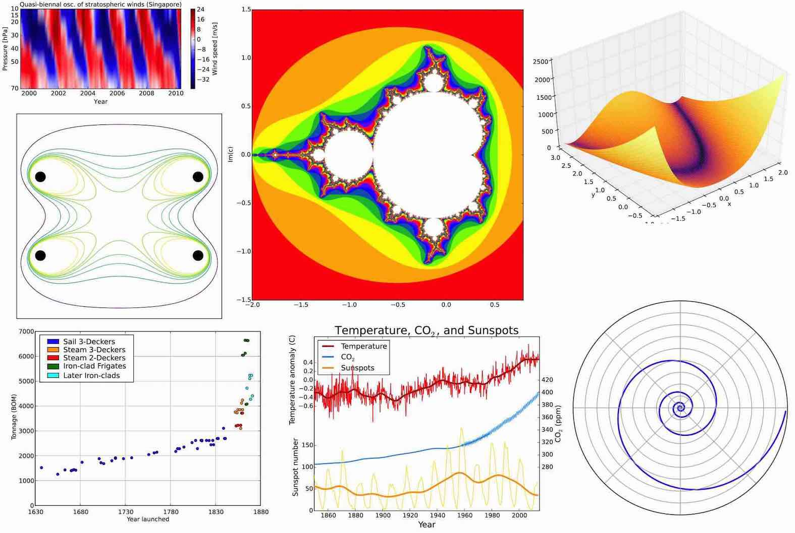

.. include:: rst-include

.. _teikning-með-matplotlib:             

Teikning með Matplotlib
=======================

Inngangur
~~~~~~~~~

Matplotlib er teiknipakki fyrir Python sem er byggður á tölvugrafík í
Matlab-kerfinu. Með Matplot er hægt að teikna (eða birta, sýna) myndir
(*images*), hæðarlínur (*countours*), *skatterplott*, línurit og gröf (*line
plots*) og þrívíðar *upplýstar* myndir. Pakkinn er þannig að framendinn
(*frontend*) eða skilgreining teikningarinnar er aðskilinn frá bakendanum
(*backend*) sem birtir hana. Þannig er hægt að skrifa forrit sem býr til
teikningu, og svo er hægt að sýna teikninguna inni í Jupyter-bók, sem sjálfstæðan
glugga á skjá, á vef, í pdf-skjali, í Latex-skjali, á prentara o.s.frv. án þess
að breyta teikniforritinu sjálfu. Auk þess er hægt að fá alls kyns viðbætur við
Matlplotlib, t.d. fyrir kortagerð, þrívíða teikningu, og samskipti við Excel,
svo fáeinar séu nefndar. Eftirfarandi mynd sýnir dæmi um myndir teiknaðar
með Matplotlib.

   Matplotlib myndir

.. attention::
   Hér verður talað um teikniskipanir þegar strangt tiltekið ætti kannski frekar
   að tala um teikniföll: scatter-fallið, plot-fallið o.s.frv. Einn kostur við
   að segja frekar *skipun* er að það veldur síður ruglingi þegar verið er að
   teikna föll.

.. _einfaldar-myndir:
   
Einfaldar myndir
~~~~~~~~~~~~~~~~

Undirbúningur teikningar
------------------------
   Venjulegasta notkun Matplotlib er að nota undirpakkann *pyplot* og í
   Matplotlib notendahandbókinni er mælt með að flytja hann inn sem *plt*, svo
   það er fyrir vikið alsiða. Teiknaðar myndir birtast sjálfkrafa inni í
   bókinni, neðan við forritsreitinn. Hér er kafli sem hægt er að setja fremst í
   vinnubók sem teiknar, þar sem bætt hefur verið við skipunum sem láta rúðunet
   teiknast undir öðrum teiknuðum hlutum, breyta sjálfgefinni stærð myndar, og
   laga galla á *savefig*.

   .. code:: python

      # Frumstilling teikningar
      import matplotlib.pyplot as plt
      plt.rc('axes', axisbelow=True)
      plt.rc('figure', figsize=(8,4)) # (6,4) er sjálfgefið
      plt.rc('savefig',bbox='tight')  # laga galla á savefig

.. _skatter-plott-og-línurit:
      
Punktarit (*scatter-plot*) og línurit
-------------------------------------
   Ein mikilvægasta notkunin á Matplotlib er teikna myndir af talnalistum, sem
   geta hvort sem er verið venjulegir Python listar eða NumPy vigrar eins og við
   kynnumst í :numref:`numpy`. kafla.

   Hér er forrit sem teiknar punktana :math:`(x,y)` þar sem :math:`y = \sqrt
   x` fyrir :math:`x = 0, 1, 2, 3, 4, 5` og tengir þá með beinum línustrikum.
   Skipunin ``plt.figure`` býr til nýja mynd og tilgreinir breidd hennar og
   hæð, scatter-skipunin teiknar punktana sjálfa með flatarmál u.þ.b. 40
   ferpunkta (punktur ≈ 1/3 mm) og plot-skipunin teiknar strikin á
   milli þeirra. Að lokum teiknar grid rúðunet.
   
   .. code:: python

      from math import sqrt
      x = list(range(6))
      y = [sqrt(xi) for xi in x]
      plt.figure(figsize=(7,3))
      plt.scatter(x,y,s=50)
      plt.plot(x,y)
      plt.grid(True)

   .. figure:: myndir/matplotlib-kynning.png
      :align: center
      :figwidth: 11cm

   .. attention::
      Stærð myndarinnar er gefin í tommum og (6,4) er sjálfgefið. Myndin er sköluð
      niður í ca. 2/3 þegar hún birtist á venjulegum fartölvuskjá, en er (a.m.k.
      nokkurnvegin) ósköluð ef bókin er prentuð sem pdf.
      
   .. admonition:: Æfing: 
      :class: aefing

      Afritið skipanirnar að ofan inn í Colab og keyrið. Prófið að breyta:

      - fjölda punkta
      - stærð myndarinnar
      - stærð punktanna (aftasti stikinn í ``scatter``)
      - sleppa rúðunetinu

.. _sulurit:
        
Súlurit
-------
   Hér er búið til súlurit (*histogram*) af normaldreifðum slembigögnum. Stikinn
   ``bins`` gefur fjölda súlna og ``range`` gefur svæðið á x-ás sem súluritið
   nær yfir. Kallið ``gauss(mu,sigma)`` skilar slemitölu úr normaldreifingu með
   meðaltal mu og staðalfrávik sigma (Gauss-dreifing er annað nafn á normaldreifingu)

   .. code:: python

         import matplotlib.pyplot as plt
         from random import gauss
         x = [gauss(0,1) for i in range(500)]
         plt.hist(x, bins=12, range=(-3,3))
         plt.xlabel('x')
         plt.ylabel('fjöldi gilda á hverju bili (af 500)')
         plt.show()

   .. figure:: myndir/sulurit.png
      :align: center
      :figwidth: 11cm

   .. admonition:: Æfing: 
      :class: aefing

      Prófið skipanirnar að ofan. Prófið að fækka og fjölga punktum. Prófið líka að
      nota 6 súlur (það þarf að breyta bæði bins og range).
   
   .. attention::
      Skipunin ``plt.show()`` er valkvæð þegar teiknað er beint í úttaksglugga í
      vinnubók, en það er hægt að opna sérstakan glugga með myndinni og þá þarf
      þessa skipun. Notkun hennar hefur þann viðbótarkost að losna við aukaupplýsingar
      sem sumar teikniskipanir skrifa ef þær eru aftast í vinnubók.

   Skipunin ``hist`` reiknar sjálf hæð hverrar súlu en það er líka hægt að láta
   hæð súlnanna koma úr lista eða vigri með því að nota skipunina ``bar``. Um það
   er sýnt dæmi í næsta kafla.

.. _teikningar-af-gögnum-í-skrám:
                    
Teikningar af gögnum í skrám
~~~~~~~~~~~~~~~~~~~~~~~~~~~~

.. _innlestur-talnagagna:

Innlestur talnagagna í dálkum
-----------------------------
Algengt er að maður vilji teikna upplýsingar sem eru geymdar í skrám, og oft eru
það dálkar í skránni sem þarf að teikna. Ef ``xy.txt`` er skrá með tveimur talnadálkum þá má lesa hana inn og teikna með skipununum:

.. code:: python

   x = []
   y = []
   with open("xy.txt") as f:
      for lína in f:
          (xs, xy) = lína.split()
          x.append(float(xs))
          y.append(float(xy))
   plt.plot(x,y)

en svo væri líka hægt að nota föllin ``lesa_skrá`` og ``dálkur`` sem gefin eru í `Verkefni 14
<https://cs.hi.is/t1a/verkefni/#dalkar-i-csv-skra-t6>`_

.. code:: python

   xy = lesa_skrá("xy.txt")
   x = dálkur(xy,0,float)
   y = dálkur(xy,1,float)
   plt.plot(x,y)

.. _dæmi-um-teikningu-talnagagna:
   
Dæmi um teikningu talnagagna
----------------------------
Hér eru tvö sýnidæmi um teikningu gagna sem eru fengin úr gagnaskrám með
``lesa_skrá`` og ``dálkur``, það fyrra teiknar punktarit (*scatter plot*) og það
síðara súlurit.

.. admonition:: Sýnidæmi: Eðlisþyngd og bræðslumark 
   :class: synidaemi

   Í kafla :numref:`csv-lestur-bilafmark` og í `Verkefni 14
   <https://cs.hi.is/t1a/verkefni/#dalkar-i-csv-skra-t6>`_ var skoðuð skrá með
   bræðslumarki og eðlisþyngd fjögurra málma. Hér er forrit sem teiknar
   punktarit af `skránni <https://cs.hi.is/t1a/malmar.txt>`_.

   .. code:: python

      málmar = lesa_skrá("https://cs.hi.is/t1a/malmar.txt", haus=True)
      nafn = dálkur(málmar, 0)
      eþ = dálkur(málmar, 1, float)
      brm = dálkur(málmar, 2, int)
      plt.scatter(eþ, brm, s=40, color='Red')
      plt.grid(True)
      plt.xlim(0,20)
      plt.ylim(800,1800)
      for (x,y,n) in zip(eþ, brm, nafn):
        plt.text(x, y, n + " ", fontsize=16, color='DarkBlue', 
                 ha="right", va="center")
      plt.xlabel('Eðlisþyngd g/ml')
      plt.ylabel('Bræðslumark °C')

   Hér fylgir myndin sem birtist, og tækifærið hefur verið notað til að sýna
   hvernig hægt er að skrifa texta inn á mynd með ``plt.text`` (sjá töflu
   :numref:`%s<text-fallið>`)

   .. figure:: myndir/malmar.jpg
      :align: center
      :figwidth: 10cm   
   
.. admonition:: Sýnidæmi: Kosningasúlurit
   :class: synidaemi

   Hér er dæmi sem teiknar súlurit af kosningaúrslitunum 2021 sem voru á dagskrá
   í skiladæmi 6 haustið 2021, sjá `verkefni 13
   <https://cs.hi.is/t1a/verkefni/#kosningaurslit-s6>`_:

   .. code:: python

      plt.figure(dpi=100)
      kosn = lesa_skrá("https://cs.hi.is/t1a/kosningar-2021.txt", haus=True)
      x = range(len(kosn))
      listi = dálkur(kosn,0)
      atkvæði = dálkur(kosn,1,int)
      plt.bar(x, atkvæði, color="tomato")
      plt.xticks(x, listi);
      plt.ylabel('Atkvæði')
      plt.title('Úrslit alþingiskosninga 2021')
      plt.show()

   Hér er verður x listinn [0,1,2...10] (það voru 11 framboðslistar). Hér er
   `listi <https://en.wikipedia.org/wiki/Web_colors#Extended_colors>`_ yfir liti.
   Forritið teiknar svo þessa mynd:

   .. figure:: myndir/kosningar-2021.jpg
      :align: center
      :figwidth: 13cm

Töflur yfir Matplotlib-skipanir
~~~~~~~~~~~~~~~~~~~~~~~~~~~~~~~

Hér er listi yfir nokkrar aðal teikniskipanirnar ásamt tilvísunum í kaflana þar
sem um þær er fjallað. Eins og framar í þessum fyrirlestrarnótum er kaflinn
fyrst og fremst hugsaður til uppflettingar og ekki til að læra utanað.

.. list-table:: Helstu teikniskipanir
   :widths: auto

   * - ``figure``
     - Býr til mynd (kafli :numref:`skatter-plott-og-línurit` og :numref:`fínna-graf`)
   * - ``scatter``
     - Teiknar punkta í tilgreindum x- og y-hnitum (:numref:`skatter-plott-og-línurit`)
       
       ..
          og :numref:`teikning-punktasafns`)
          
   * - ``plot``
     - Teiknar línustrik sem tengja saman punkta
       :numref:`dæmi-um-plot` og :numref:`einfalt-graf`)
   * - ``hist``
     - Teiknar súlurit yfir tíðni – hæð súlna fæst með talningu
       (:numref:`sulurit` og :numref:`dæmi-um-hist`)
   * - ``bar``
     - Teiknar súlurit með gefinni súluhæð (:numref:`dæmi-um-teikningu-talnagagna`)
   * - ``savefig``
     - Vistar teikningu í png-skrá (``savefig("skrá.png")``)
   * - ``text``
     - Skrifar texta inn á mynd (sjá töflu :numref:`%s<text-fallið>`)
       (:numref:`innlestur-talnagagna`)
   * - ``show``
     - Birtir mynd (þarf ekki ef teiknað er í glugga í vinnubók (:numref:`sulurit`)

.. csv-table:: Texti settur inn á mynd
   :widths: auto
   :delim: ;
   :name: text-fallið

    ``text(x,y,"texti")``     ; skrifar texta aftan við punkt (x,y)
    ``text(..., fontsize=n)`` ; – með n punkta letri (:numref:`innlestur-talnagagna`)
    ``text(...,va="top")``    ; – neðan við punkt (*vertical alignment*) (:numref:`innlestur-talnagagna`)
    ``text(...,va="bottom")`` ; – ofan við punkt (eða center/baseline)
    ``text(...,ha="left")``   ; – aftan við punkt (*horizontal algn*)
    ``text(...,ha="center")`` ; – með punkt í miðjum texta (eða right)
           
Teikniskipanirnar bjóða svo upp á fjölda stýristika (*control parameters*) til að
stjórna lit teikninga, breidd súlna, leturstærð, merkingum ása o.s.frv. Auk
stýristikanna eru svo notaðar ýmsar hjálpar- eða stýriskipanir til breyta mörkum
ása, bæta við skýringartextum, rúðuneti o.fl. Næstu töflur gefar yfirlit
yfir helstu stýristika og stýriskipanir.

.. list-table:: Helstu stikar í **plot**, **hist** og **bar**
   :widths: 3 8
   :name: plothiststýring

   * - ``color``
     - Litur línurits (grafs) eða súlurits. Má skammstafa r, g, b, y, w, k |br|
       (black), c (cyan), m (magenta) eða nota streng með `litanafni
       <https://en.wikipedia.org/wiki/Web_colors#Extended_colors>`_ c |br|
       ``color`` má skammstafa ``c`` í plot en ekki í hist og bar
       (:numref:`dæmi-um-teikningu-talnagagna` og :numref:`dæmi-um-plot`).

   * - ``alpha``
     - gagnsæi, 0 alveg gagnsætt, 1 alveg ógagnsætt (sjálfgefið)

   * - ``linewidth`` eða ``lw``
     - Breidd línu í línuriti eða súluramma í súluriti. Eining punktar |br|
       (~1/3 mm), sjálfgefið lw=1.5 (:numref:`dæmi-um-plot`)

   * - ``linestyle`` eða ``ls``
     - Línutegund, getur t.d. verið ``''`` (engin lína) ``':'`` |br|
       (punktalína), ``'-'`` (heil lína, sjálfgefið) (:numref:`dæmi-um-plot`)

   * - ``marker``
     - Merki fyrir punkta í plot. Algengur marker er ``'o'`` (en líka má nota |br|
       ``'.' '+' 'x'`` og fleiri); plot-skipun með ``marker = 'o', ls=''`` |br|
       gefur svipaða niðurstöðu og ``scatter`` með sjálfgefnum stikum (:numref:`dæmi-um-plot`)

   * - ``markersize`` eða ``ms``
     - Stærð *markers* í ``plot``, sjálfgefið 6 punktar (~2 mm) (k.
       :numref:`dæmi-um-plot`)

   * - ``edgecolor`` eða ``ec``
     - Litur á rönd súlna eða merkja. Ein tegund súlurita notar |br|
       ``color='w', ec='k'`` (:numref:`dæmi-um-hist`)

   * - ``label``
     - gefur súlutegund eða línuriti *skýringu*, notað með ``legend``-skipun,
       (sjá töflu :numref:`%s<plothjálparskip>`) (:numref:`dæmi-um-legend`)
       

   * - ``bins``
     - fjöldi súlna (:numref:`sulurit` og :numref:`dæmi-um-hist`)

   * - ``range``
     - ytri mörk súlurits (gott að velja bins í samræmi við range) (k.
       :numref:`sulurit` og :numref:`dæmi-um-hist`)

   * - ``rwidth``
     - "relative width" (sjálfgefið 1.0) (:numref:`dæmi-um-hist`)

.. list-table:: Helstu stikar í **scatter**
   :widths: 1 4
   :name: scatterstýring

   * - ``marker``
     - Merki fyrir punkta, sjá *marker* í töflu :numref:`%s<plothiststýring>`

   * - ``s``
     - stærð punkta, flatarmál í *ferpunktum* (punktur ≈ 1/3 mm). |br|
       Má vera vigur og þá fær hver punktur sína stærð (:numref:`dæmi-um-plot`)

   * - ``color``
     - litur (allir punktar í sama lit), sjá *color* í töflunni að ofan

   * - ``c``
     - vigur af litum (hver punktur í sínum lit). Má vera vigur af |br|
       tölum og þá litast punktarnir með litaskala (*color map*).

   * - ``alpha``
     - gagnsæi, sjá töfluna að ofan

   * - ``edgecolor``
     - litur á rönd punkta

.. Attention::
     
   Sjálfgefin punktastærð er 36 = 6^2, sem gefur sömu stærð og ``o``-merki í
   plot-skipun með *markersize* 6 (sem er sjálfgefna stærðin í plot). Ath. að það
   er ekki stutt að skrifa :code:`size` í stað :code:`s`

   Þessar fyrirlestrarnótur skauta (ennþá) framhjá umfjöllun um **litaskala**, og
   við látum duga að vísa í 4. kaflann í `Python Data Science Handbook
   <https://jakevdp.github.io/PythonDataScienceHandbook>`_.
       
.. list-table:: Helstu hjálparskipanir fyrir teikningar
   :widths: 1 3
   :name: plothjálparskip

   * - ``plt.xlim(min,max)``
     - stillir neðri og efri mörk x-áss (kafli :numref:`þrjú-dæmi`)

   * - ``plt.ylim(min,max)``
     - Stillir neðri og efri mörk y-áss (:numref:`þrjú-dæmi`)

   * - ``plt.title(strengur)``
     - setur fyrirsögn á teikningu (:numref:`dæmi-um-teikningu-talnagagna`)

   * - ``plt.xlabel(strengur)``
     - setur textaskýringu við x-ás (:numref:`sulurit`, :numref:`dæmi-um-plot`
       og :numref:`dæmi-um-hist`)

   * - ``plt.ylabel(strengur)``
     - setur textaskýringu við y-ás (:numref:`sulurit`, :numref:`dæmi-um-plot`
       og :numref:`dæmi-um-hist`)

   * - ``plt.xticks(listi)``
     - setur merkingar á tilgreindar staðsetningar á x-ás |br|
       (``listi`` gæti t.d. verið ``range(0,6)``)
       (:numref:`dæmi-um-teikningu-talnagagna`)

   * - ``plt.yticks(listi)``
     - setur merkingar á tilgreindar staðsetningar á y-ás

   * - ``plt.tickparams(length=l,`` |br|
       ``width=w, direction="in")``
     - stillir strikin við ásamerkingarnar (l og w mælt í punktum (1/3 mm); |br|
       í stað ``"in"`` má nota ``"out"``)

   * - ``plt.grid(True)``
     - teiknar rúðunet (nota má ``grid(True, axis='y')`` fyrir bara láréttar línur)
       (:numref:`skatter-plott-og-línurit`, :numref:`dæmi-um-legend` og
       :numref:`dæmi-um-hist`)

   * - ``plt.box(False)``
     - fjarlægir ramma utanum teikningu (:numref:`fínna-graf`)

   * - ``plt.axvline(x)``
     - bætir við lóðréttri línu (sjálfgefið er x = 0) (:numref:`fínna-graf` og
       :numref:`graf-vísisfallsins`)

   * - ``plt.axhline(y)``
     - bætir við láréttri línu (sjálfgefið er y = 0) (:numref:`fínna-graf` og
       :numref:`graf-vísisfallsins`)

   * - ``plt.legend()``
     - bætir við kassa með skýringum á línum/skatter-punktum/súlum |br|
       sem búnar voru til með ``label``; sjá töflu :numref:`%s<plothiststýring>`
       (:numref:`dæmi-um-legend`)

       
Loks er hér `hlekkur <https://matplotlib.org/api/pyplot_summary.html>`_  á yfirlit yfir allar Matplotlib-skipanir.

.. _þrjú-dæmi:

Þrjú dæmi um teikningar
~~~~~~~~~~~~~~~~~~~~~~~
Til frekari glöggvunar eru hér þrjú viðbótardæmi og nokkrar æfingar.

.. _dæmi-um-plot:

Dæmi um plot
------------
   .. code:: python

      from math import sqrt
      x = range(5)
      y = [sqrt(t) for t in x]
      plt.figure(figsize=(4, 1.8), dpi=90) # dpi=72 sjálfgefið
      plt.plot(x, y, lw=3, ls=':', c='r', marker='o', ms=8)
      plt.xlabel('x')
      plt.ylabel('y = √x')

   .. figure:: myndir/rauttgraf.png
      :align: center
      :figwidth: 7cm

   .. admonition:: Æfing: Stikar í plot
      :class: aefing

      Prófið þessar skipanir. Prófið að breyta:

      - dpi (*dots-per-inch*; myndin stækkar)
      - lw (*line width*)
      - ls (*line style*, prófið –)
      - c (*color* prófið t.d. b)
      - marker (prófið + og x)
      - ms (*marker size*)

.. _dæmi-um-legend:
        
Dæmi um legend
--------------
   .. code:: python

      from math import pi, sin
      from random import random
      t = [k*2*pi/30 for k in range(31)]
      s = [sin(x) for x in t]
      y = [random() for k in range(30)]
      plt.figure(figsize=(5,2))
      plt.plot(t, s, label='sin(x)')
      plt.plot(t, y, label='slembitölur')
      plt.grid(True)
      plt.legend();

   .. figure:: myndir/legend-daemi.png
      :align: center
      :figwidth: 9cm

   .. admonition:: Æfing: Legend
      :class: aefing

      Prófið þessar skipanir. Prófið svo að bæta við cos(x) með tilheyrandi
      label. Prófið líka að fjölga punktunum (það þarf að breyta bæði 30 og 31 í
      stærri tölur).
      
.. _dæmi-um-hist:
      
Dæmi um hist
------------
   .. code:: python
      
      from random import gauss
      x = [gauss(0,1) for i in range(500)]
      plt.figure(figsize = (6,3))
      plt.hist(x, bins=12, range=(-3,3), rwidth=0.8, color='c', ec='k');
      plt.xlabel('x-gildi');
      plt.ylabel('fjöldi');
      plt.grid(True, axis='y')

   .. figure:: myndir/sulur2.png
      :align: center
      :figwidth: 11cm

   .. admonition:: Æfing: Súlurit
      :class: aefing

      Prófið skipanirnar og einhverjar breytingar á þeim. Stikunum er lýst í töflu
      :numref:`%s <plothiststýring>`

                 
.. _groffalla:                 
                 
Teikning af gröfum falla
~~~~~~~~~~~~~~~~~~~~~~~~

Við byrjum þennan kafla á æfingu, sem snýst bæði um efni undanfarandi kafla og
þessa. Lesendur eru hvattir til að spreyta sig á henni áður en þeir lesa áfram
því hér á eftir koma svör við ýmsum atriðum í henni.

..
   .. Æfing
   .. hint::
      Opnið vinnubókina :h:`<a href="fallateikning.ipynb"
      download="fallateikning.ipynb"><b>Fallateikning</b></a>` Colab og fylgið
      leiðbeiningum í henni. 

Til að teikna graf er byrjað á að núllstilla með því að keyra:

.. code:: python

   import matplotlib.pyplot as plt
   plt.rc('axes', axisbelow=True)
   def linspace(a,b):
      return [a + (b-a)*i/200 for i in range(201)]

Með ``linspace(a,b)`` fæst listi með 200 jafnt dreifðum þétt liggjandi
:math:`x`-gildum á bilinu frá a til b, og svo reiknum við fallsgildin :math:`y =
f(x)` í öllum þessum :math:`x`-um og nálgum graf fallsins með því að teikna
línustrik sem tengja alla punktana.

.. _einfalt-graf:

Einfalt graf
------------
Við getum teiknað graf sínus-fallsins á bilinu :math:`[0, 4\pi]` með:

   Forrit:
      .. code:: python

          from math import pi, sin, cos, exp
          x = linspace(0, 4*pi)
          y = [sin(xi) for xi in x]
          plt.plot(x, y);

   Úttak:       
      .. figure:: myndir/output_3_0.png
         :align: center
         :figwidth: 9cm

.. _fínna-graf:                    
                    
Fínna graf
----------
Hægt er að bæta ýmsu við forritsbúinn í kafla :numref:`einfalt-graf`. Byrjum á að afrita hann og endurbætum hann svo:

   -  teygjum á grafinu (breikkum myndina) með skipuninni
      ``plt.figure(figsize=(12,4))`` (á undan plot).

   -  Svo má bæta við rúðuneti með ``plt.grid``

   -  Það er hægt að teikna x- og y-ása með ``plt.axhline`` og
      ``plt.axvline``. Notið með stika ``c='k'`` til að fá svarta ása.

   -  Við getum látið x-ásinn ná t.d. frá -0.2 til :math:`4\pi` með
      ``plt.xlim([-0.2, 4*pi])``.

   -  Það má fjarlægja rammann með ``plt.box(False)``

   -  Síðasta tötsið fæst með ``plt.tick_params(length=0)``

   Forrit (sjá úttak í svari við lið 3):
      .. code:: python
         
         plt.figure(figsize=(15,4))
         plt.grid(True)
         plt.axvline(c='k')
         plt.axhline(c='k')
         plt.box(False)
         x = linspace(0, 4*pi)
         y = [sin(xi) for xi in x]
         plt.plot(x, y)
         plt.xlim([-0.2, 4*pi])
         plt.tick_params(length=0);

.. _kósínus-bætt-við:
         
Kósínus bætt við
----------------
Teiknum í framhaldi :math:`y = \cos x` inn á sömu mynd.

   Forrit:
      .. code:: python
                
         yc = [cos(xi) for xi in x]
         plt.plot(x, yc)

   Úttak (úr :numref:`fínna-graf` og :numref:`kósínus-bætt-við`):
      .. figure:: myndir/output_6_0.png
         :align: center
         :figwidth: 16cm

.. _graf-vísisfallsins:
                    
Graf vísisfallsins exp(x)
-------------------------
Teiknum nú nýja mynd með :math:`y = e^x` á bilinu :math:`[-5, 2]`.

   Forrit:
      .. code:: python
         
         x = linspace(-5, 2)
         plt.figure(figsize=(9,6)); plt.grid(True)
         plt.axvline(c='k'); plt.axhline(c='k')
         plt.box(False)
         plt.plot(x, [exp(t) for t in x])
         plt.xlim([-5, 2])
         plt.tick_params(length=0)
         
   Úttak:
      .. figure:: myndir/output_7_0.png
         :align: center
         :figwidth: 12cm

.. admonition:: Æfing: Fallateikning.
   :class: aefing

   Æfið ykkur í að teikna föll með því að nota hugmyndir í þessum kafla.
