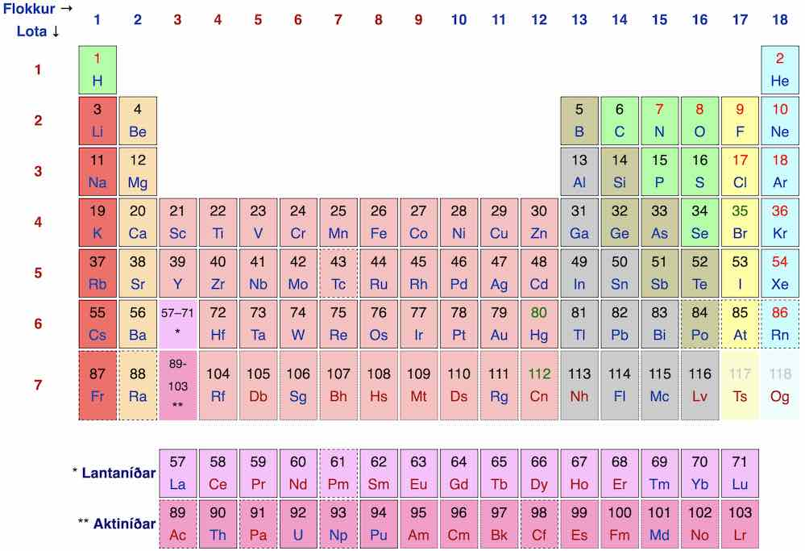
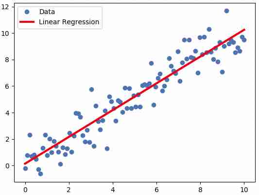
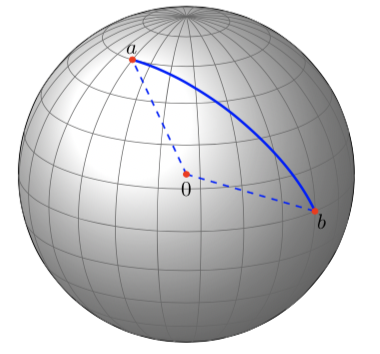

.. include:: rst-include

Verkefni
========

Skila- og tímadæmin þar sem verkefnin eru notuð í Tölvunarfræði 1a 2021 eru sýnd í svigum.

1. Annars stigs jafna (S3)
~~~~~~~~~~~~~~~~~~~~~~~~~~
Skrifið forrit sem leysir annars stigs jöfnu

.. math:: a x^2 + b x + c = 0

Fallið á að lesa inn :math:`a`, :math:`b` og :math:`c` með ``input``-skipunum
(með viðeigandi beiðnum til notanda). Ef jafnan hefur tvær lausnir á forritið að
skrifa „Lausnirnar eru:“ og síðan lausnirnar, ef hún hefur eina lausn á að
skrifa hana með viðeigandi skýringu og ef engin lausn er skal skrifa skilaboð um
það. Lausn eða lausnir eru gefnar með formúlunni

.. math::
   x = \frac{-b \pm \sqrt{b^2 - 4ac}}{2a}

Ef stærðin undir kvaðratrótinni er neikvæð þá er engin lausn, ef
hún er núll er ein lausn, annars tvær. Gerið auk þess ráð fyrir
þeim möguleika að :math:`a` sé 0. Ef :math:`b` er ekki líka 0 þá er jafnan fyrsta
stigs og forritið á að skrifa að svo sé, ásamt lausninni (sem er
þá ein). Látið :math:`b` og :math:`c` vera gefin með afmælisdegi ykkar (dagur og mánuður) og prófið forritið fyrir fjórar mismunandi jöfnur, fyrsta
stigs jöfnuna :math:`bx + c = 0` og annars stigs jöfnur sem hafa enga, eina og tvær
lausnir þar á meðal jöfnuna :math:`x^2 + bx + c = 0`. Setjið viðeigandi skjölunarstreng  fremst í forritið.

2. Simpsons-regla (S3)
~~~~~~~~~~~~~~~~~~~~~~
Skrifa skal forrit til að nálga heildi með svonefndri *Simpsons-regla*. Í trapisureglu er heildisbilinu skipt í :math:`n` hlutbil, fallið sem heilda skal nálgað með beinum línustrikum og heildi þess nálgað með flatarmálinu undir þessum línustrikum. Í Simpsonsreglu er fallið hinsvegar nálgað (eða *brúað* eins og það er kallað) með parabólum og heildið nálgað með flatarmálinu undir þeim. Skoðið endilega Wikipedíu-grein `um aðferðina <https://en.wikipedia.org/wiki/Simpson%27s_rule>`_.

Simpsons-formúlan er eftirfarandi:

.. math::
   \int_{a}^{b} f(x) \, dx \approx 
   \frac{\Delta x}{3}\left(f(x_0) + 4f(x_1)+2f(x_2)+
   4f(x_3)+2f(x_4)+\cdots+4f(x_{n-1}) + f(x_{n})\right)

þar sem :math:`\Delta x = \displaystyle{\frac{b-a}{n}}`, :math:`x_i=a+i\Delta x`, :math:`i = 0,\ldots, n` og :math:`n` er slétt tala.

Skrifið fall ``simpson(f,a,b,n)`` sem nálgar heildið af ``f`` frá ``a``
til ``b`` með samsettri Simpsons-reglu með ``n`` hlutbilum.

Prófið með heildunum:

.. math::  (*)\quad\int_1^2\frac{\sin(x)}{x} dx
           \qquad\quad\text{og}\qquad\quad
           (**)\quad\int_0^1\exp(x) dx

með 4 hlutbilum. Ef rétt er forritað ætti að fást :math:`(*)` 0.65933 og
:math:`(**)` 1.71832. Rétt gildi eru 0.65933 og 1.71828, og trapisuregla með 4
bilum gefur 0.65863 og 1.72722.

Heildið líka eitthvert sjálfvalið fall þar sem afmælisdagur ykkar kemur við sögu.

3. Viðsnúningur (S3)
~~~~~~~~~~~~~~~~~~~~
a) Skrifið fall ``hausaftast(L)`` sem færir haus L aftast. Ef kallað er með
   :code:`L=[1,2,3,4]` ætti að koma út :code:`L=[2,3,4,1]`. Prófið líka með
   lista búnum til útfrá afmælisdegi (t.d. 3.8.1999 :math:`\to` :code:`[3,8,99]`).

b) Skrifið fall ``snúavið(L)`` sem snýr við lista. Hér er reiknirit:

   .. code::

      fall snúavið(L)
          n := lengd L
          M := tómur listi
          fyrir i = n-1,n-2,...,0:
              setja i-ta stak L afast í M
          skila M
          
   Prófið að snúa við ``L=[1,2,3,4]`` sem ætti að skila ``[4,3,2,1]``
   og líka afmælisdagalistanum úr a-lið.

4. Orðaleikur (S4)
~~~~~~~~~~~~~~~~~~
Til að leysa þetta dæmi gæti gagnast að skoða lausn á T3.3

a) Skrifið fall ``telja(s)`` sem byrjar á nota ``s.split()`` til að búa til
   lista af einstökum orðum í ``s`` og telur síðan hve margir stafir eru í
   hverju orði. fallið á að skila lista með þessari talningu. Þannig ætti

   ``telja("Afi minn og amma mín")``

   að skila listanum ``[3,4,2,4,3]``. Prófið líka að telja stafi í nafninu
   ykkar (t.d. ``telja("Kristján Jónasson")``).

b) Búið til fall ``hrópa(s)`` sem skrifar ``s`` út með stórum stöfum og tveimur
   upphrópunarmerkjum. Hrópið svo nafnið ykkar :)

c) Til að athuga hvort stafur ``c`` sé hástafur má spyrja: ``c == c.upper()``.
   Skrifið fall ``stórir(s)`` sem skilar lista af rökgildum með i-ta gildið
   satt ef i-ta orðið í :code:`s` byrjar á stórum staf. Prófið.

5. Kvaðratrót (S4)
~~~~~~~~~~~~~~~~~~
Um útreikning kvaðratrótar er fjallað í kafla 7.5 í `Think Python <https://greenteapress.com/wp/think-python-2e/>`_ kennslubókinni.
Þar stendur að hægt sé að nota Newtons aðferð, og að ef byrjað er með einhverja
nálgun :math:`x` við :math:`\sqrt{a}` þá fáist betri nálgun, :math:`y` með því
að reikna:

.. math:: (*)\hspace{4cm} y = \frac{x + a/x}{2}

Formúluna má m.a. rökstyðja þannig að ef :math:`x` er nákvæmt gildi þá er :math:`x^2 =
a` svo að :math:`x = a/x`. Hinsvegar ef :math:`x` er aðeins minna en
kvaðratrótin þá þá verður :math:`a/x` aðeins stærra en hún (og öfugt) og því
ætti meðaltal :math:`x` og :math:`a/x` að vera betri nálgun. Svo má athuga hve
nálgunin er góð með því að skoða muninn á :math:`x` og :math:`y`. Ef t.d.

.. math:: (**)\hspace{4cm}|x - y| < \varepsilon

þar sem :math:`\varepsilon = 10^{-4}` er hún orðin nokkuð góð.

a. Skrifið Python-fall, ``krót(a)`` sem útfærir þessa hugmynd. Byrjið með
   upphafsgildið ``x = 1`` og finnið svo betri og betri lausn með því að nota
   while-lykkju sem reiknar :math:`(*)` aftur og aftur og heldur áfram þangað
   til :math:`(**)` er uppfyllt. Prófið að reikna :math:`\sqrt{9}` og
   :math:`\sqrt{10}` (rétt gildi 3.16227766017).

b. Búið nú til nýja útgáfu af fallinu sem er með tvo inntaksstika, töluna ``a`` og
   nákvæmnikröfu :code:`eps`, og telur auk þess hve margar ítrekanir eru teknar.
   Látið það skila bæði lokanálguninni og ítrekanafjöldanum (sbr. fyrra
   sýnidæmið í kafla :numref:`virka`). Skrifið niðurstöður með hæfilegum
   skýringartextum: lokanálgun, ítrekanafjölda, og muninn á réttri kvaðratrót og
   lokanálgun. Prófið með nokkrum mismunandi gildum á :math:`a` (m.a. eitthvað
   mjög stórt gildi) og :math:`\varepsilon`, (m.a. gildi sem er ekkert mjög
   lítið, t.d. 0.1 eða 0.01). Bætið við textareit og skrifið örfá orð um
   niðurstöðu þessarar prófunar.

6. Meðaltal og staðalfrávik (T4)
~~~~~~~~~~~~~~~~~~~~~~~~~~~~~~~~~~~~~~
Skrifið fall ``tölfræði(x)`` sem skilar pari ``(m, s)`` með meðaltali og staðalfráviki stakanna í listanum ``x`` með því að nota formúlurnar: 

.. math::
   m &= \frac{1}{n}\sum_{i=0}^{n-1}{x[i]}\\
   s &= \sqrt{\frac{1}{n-1}\sum_{i=0}^{n-1}(x[i] - m)^2}

Prófið með ``x = [3,7,7,1]`` (á að skila ``[4.5, 3.0]``) og líka með lista ``[d,m,á]`` búnum til úr fæðingardegi..

7. Bóluröðun (T4)
~~~~~~~~~~~~~~~~~
Hér er reiknirit sem raðar n-staka lista x með bóluröðun `bubble sort <https://en.wikipedia.org/wiki/bubble_sort>`_, sem snýst um að rúlla í gegn um stökin og ef tvö samliggjandi stök eru í öfugri röð þá er víxlað á þeim. Þetta er endurtekið þar til öll stökin eru í röð. Minnstu stökin bobbla smám saman eins og loftbólur fremst í listann.

.. code:: text
          
   víxlað = satt
   meðan víxlað
      víxlað = ósatt
      fyrir i=1,...,n-1:
         ef x[i-1] > x[i] þá
            víxla á x[i-1] og x[i]
            víxlað = satt
              
Þýðið þetta reiknirit yfir í Python-fall ``bóluröðun(x)``. Athugið að til að víxla á breytum ``x`` og ``y`` má nota :code:`(x,y) = (y,x)`. Prófið með því að raða listanum ``[3,8,1,2,5,4]``.

8. Pólhnit (T4)
~~~~~~~~~~~~~~~
Lesið aðeins um `pólhnit <https://en.wikipedia.org/wiki/Polar_coordinate_system>`_
á Wikipediu áður en þið spreytið ykkur á eftirfarandi verkefni.

a. Skrifið fall ``pol2rec(r,theta)`` sem skilar pari ``(x,y)``, til að breyta úr
   pólhnitum yfir í rétthyrnd hnit með eftirfarandi formúlum:

   .. math::
      x &= r \cos{\theta}\\
      y &= r \sin{\theta}

   Prófið að breyta :math:`(r,\theta) = (4,35°)` yfir í rétthyrnd hnit :math:`x`
   og :math:`y` (á að gefa :math:`x=3.277`, :math:`y=2.294`). Munið að nota
   ``math.radians`` til að breyta gráðum í radíana.

b. Skrifið svo annað fall, ``rec2pol(x,y)`` sem skilar ``(r,theta)`` og breytir
   í hina áttina með formúlunum:

   .. math::
      \theta &= \operatorname{atan2}(y,x)\\
      r &= \sqrt{x^2 + y^2}

   Prófið að breyta svarinu sem fékkst í a-lið aftur til baka í pólhnit.

   .. admonition:: Athugasemd
      :class: athugid

      Stærðfræðifallið `atan2 <https://en.wikipedia.org/wiki/Atan2>`_
      sem er líka til í Python er sérhannað til að breyta úr rétthyrndum hnitum
      í pólhnit. Það skilar horni :math:`\theta` á bilinu :math:`(-\pi,\pi]`
      þannig að :math:`\tan \theta = y/x`, nema ef :math:`x=0`, þá skilar fallið
      :math:`\pm\pi/2` með sama formerki og :math:`y`. Hornið er valið þannig að
      það sé stefnuhorn vigursins :math:`(x,y)`.

9. Uppflettitafla afturábak (T4)
~~~~~~~~~~~~~~~~~~~~~~~~~~~~~~~~
Hugsum okkur að ``ísl_ens`` sé uppflettitafla sem geymir ensk-íslenska orðabók.
Hún gæti t.d. innihaldið pörin:

- ``"reipi"`` :math:`\to` ``"rope"``
- ``"hús"`` :math:`\to` ``"house"`` og
- ``"rauður"`` :math:`\to` ``"red"``.

Ef við vilum búa til ensk-íslenska orðabók gætum við snúið töflunni við og
fengið pörin ``"rope"`` :math:`\to` ``"reipi"``, ``"house"`` :math:`\to`
``"hús"`` o.s.frv.

a. Skrifið fall ``snúavið(U)`` sem snýr uppflettitöflu við á þennan hátt. Gerið
   ráð fyrir að taflan ``U`` varpi engum tveimur lyklum í sama gildið. Prófið
   með orðaskránni að framan og búið til ``ens-ísl``.

b. Skrifið nýja útgáfu af fallinu, ``snúavið2(U)``, sem er ekki með slíkri
   einkvæmnitakmörkun. Það á að skila nýrri uppflettitöflu ``V`` sem er þannig að ef
   ``g`` er gildi sem tveir lyklar varpast í, ``U[x] = U[y] = g`` þá á ``V`` að
   varpa ``g`` í lista með ``x`` og ``y``, ``V[g] = [x,y]``. Bætið nú tveimur pörum:

   - ``"tómarúm"`` :math:`\to` ``"vaccum"``
   - ``"ryksuga"`` :math:`\to` ``"vaccum"``

   við ``ísl_ens`` og prófið ``snúavið2``.

10. Skrá með íslenskum orðum (S5)
~~~~~~~~~~~~~~~~~~~~~~~~~~~~~~~~~
Þetta verkefni er lauslega byggt á verkefnum í 9. kafla `Think Python
<https://greenteapress.com/wp/think-python-2e/>`_ kennslubókarinnar. Þar er ekki
gert ráð fyrir að skrár séu lesnar beint af netinu, en það er hinsvegar hægt með
pakka sem heitir ``urllib`` og það verður gert hér. Auk pakkans þarf tvö
strengjaföll sem ekki eru nefnd í :numref:`söfn`. og :numref:`helstu-aðgerðir`.
kafla: ``s.strip()`` sem hendir línuskiptatákni aftan af s og
``s.decode`` sem umskrifar *utf-8*-streng sem Python-streng (sjá athugasemd
um utf-8 hér neðar).

Hér er forritsbútur, sem flytur inn ``urllib`` og skilgreinir jafnframt fall
``allarlínur`` sem nota má til að lesa inn textaskrá:

.. code:: Python
          
   from urllib.request import urlopen
   # f = urlopen("https://slóð/að/skrá") opnar skrá f á netinu

   def allarlínur(f):
      '''skilar lista með öllum línum skrár f, 
      utf-8 afkóðuðum og án línuskiptatákna'''
      return [l.decode('utf-8') for l in f.read().splitlines()]

Í skrá með veffang `cs.hi.is/t1a/ord.txt <https://cs.hi.is/t1a/ord.txt>`_ eru 217
þúsund íslensk orð. Þið getið skoðað skrána með því að smella á hlekkinn. Í
verkefninu sem hér fylgir þarf að nota ýmsar strengjaaðgerðir sem lýst er í
kafla :numref:`strengir`.

a. Lesið skrána inn og prentið út fyrstu 5 orðin og líka tíu þúsundasta hvert
   orð og öll orð sem eru lengri en 30 stafir.

b. Spegilorð (*palindrome*) er orð sem er eins lesið afturábak og áfram (t.d.
   kajak). Skrifið rökfall ``spegilorð(s)`` sem kannar hvort ``s`` sé spegilorð
   [rökfall er fall sem skilar ``True`` eða ``False`` og prófið. Skrifið í
   framhaldi út öll spegilorð í skránni, 10 á hverja línu. Fyrsta linan ætti að
   verða:

      :code:`abba, afa, aga, agga, aka, ala, alla, ama, amma, ana,`

   .. admonition:: Leiðbeiningar
      :class: python
   
      Til að snúa við streng ``s`` má nota ``s[::-1]``. Það þarf
      að nota ``end=`` í print-skipun sbr. kafla :numref:`útprentun`, og svo þarf
      að nota teljara sem fylgist með hvað er búið að prenta mörg orð á línuna og
      þegar þau eru orðin 10 er farið í nýja línu með ``print()`` og teljarinn
      núllstilltur. Fyrsta línan sem prentast ætti að vera:

c. **Aukadæmi:** Finnið það orð í skránni sem hefur hlutfallslega flesta samhljóða.         

.. admonition:: Athugasemd
   :class: athugid

   `UTF-8 <https://en.wikipedia.org/wiki/UTF-8>`_ er staðall til að geyma
   bókstafi og önnur rittákn í tölvum. Staðallinn hefur á síðasta áratug eða svo
   orðið alsráðandi í tölvuheiminum, og eru 97% allra vefsíðna skráð með honum.
   Hver stafur er geymdur í einu til fjórum bætum. Algengustu tákn og stafir,
   þ.m.t. allir enskir bókstafir nota eitt bæti, aðrir bókstafir allra evrópskra
   tungumála þurfa tvö bæti, en sjaldgæfari stafir og tákn þurfa þrjú
   eða fjögur bæti. Strengir í forritunarmálum, þ.m.t. Python eru hinsvegar `ekki
   geymdir <https://dev.to/bplevin36/python-strings-are-not-utf-8-2dfj>`_ með
   UTF-8 sniði heldur ýmist sem *Latin-1*, *UTF-16* eða *UTF-32*. Þetta er gert
   til að öll tákn hvers strengs séu jafn mörg bæti, sem flýtir t.d. fyrir
   uppflettingu á *i*-ta sæti.
              
11. Fjöldi stafa í skrafli (S5)
~~~~~~~~~~~~~~~~~~~~~~~~~~~~~~~
a. Í þessu verkefni á að búa til töflu yfir hlutfallslega tíðni hvers stafs í
   skránni ``ord.txt`` úr verkefni 10, og jafnframt hvað sú tíðni samsvarar
   mörgum heilum stöfum af 98, sem er heildarfjöldi stafa í pokanum sem notaður
   er í borðspilinu skrafli (*scrabble*). Taflan ætti að byrja svona:

   .. code:: text

      stafur  tíðni  fjöldi
      –––––––––––––––––––––
        a     9.80%    10
        á     1.27%     1
        b     1.34%     1

   .. admonition:: Leiðbeiningar
      :class: python

      Byrjið á að skoða athugasemdina að neðan, þ.m.t. vefsíðu
      netskraflara. Skrána ord.txt má opna og lesa inn eins og í verkefni 10. Ef
      ``s`` er strengur og ``L`` er listi af strengjum þá má skeyta þeim saman
      aðskildum með ``s`` með því að rita ``s.join(L)``, til dæmis:

      .. code:: Python

         L = ["már", "mús", "mý"]
         s1 = ",".join(L)         # gefur "már,mús,mý
         s2 = "".join(L)          # gefur "mármúsmý"

      Þannig má fá langan streng ``öllorð`` með öllum orðum skrárinnar í runu
      með því beita ``join`` með tóma strengnum á útkomuna úr ``allarlínur``.
      Skoðið byrjunina á öllorð með ``print(öllorð[:40])``. Svo má t.d. finna
      hlutfallslega tíðni a með ``ta = öllorð.count("a")/n`` þar sem ``n =
      len(öllorð)``. Tilsvarandi heill fjöldi a-a af 98 fengist með
      ``round(ta*98)``. Hægt er að rúlla í gegn um alla stafina með for-lykkju
      og strengnum:

         :code:`stafróf = "aábcdðeéfghiíjklmnoópqrstuúvwxyýzþæö"`

b. **Aukaspurning:** Ef rétt er reiknað sést að allmargir stafir gefa fjöldann
   0. Í skrafli er hinsvegar amk. einn stafur af hverri gerð í pokanum. Ef við
   hækkum öll núllin upp í einn fást of margir stafir. Lýsum einni leið til að
   leiðrétta það. Byrjum á að búa til uppflettitöflu ``fj`` þannig að ``fj[c]``
   sé fjöldi af staf c skv. a-lið, nema við látum ``fj[c] = max(1,round(ta*98))``.
   Hér er tilvalið að nota yfirgrip. Við látum:
   
   .. code:: Python

      búnir = [c for c in stafróf if fj[c] == 1]
      eftir = [c for c in stafróf if fj[c] > 1]
      N = 98 - len(búnir)

   Nú má fara aftur í gegn um lykkju eins og í a-lið, nema hvað aðeins er rúllað
   í gegn um stafina í ``eftir``, í stað 98 kemur N, og svo þarf n að vera fjöldi
   stafa í skránni sem eru í ``eftir``. Aftur er hægt að nota yfirgrip:

      ``n = sum([öllorð.count(c) for c in eftir])``.

   Útfærið þessa hugmynd og athugið hver heildarfjöldi stafa verður.

.. admonition:: Athugasemd: Um skrafl
   :class: athugid

   Í skrafli eru mismargir stafir af hverri gerð í pokanum eins og skoða má á
   `vefsíðu netskraflara <https://netskrafl.is/help>`_: það eru t.d. ellefu a,
   og átta r, en ekki nema tvö ó og eitt h. Stafirnar gefa líka mismunandi mörg
   stig. Fjöldi eintaka af hverjum staf er nokkurnveginn í hlutfalli við tíðni
   stafanna í íslenskum orðalista svipuðum þeim sem er í skránni *ord.txt*, og
   gildi hvers stafs er líka tengt þessari tíðni.

12. Sameining nafnaskrár og einkunnaskrár (T5)
~~~~~~~~~~~~~~~~~~~~~~~~~~~~~~~~~~~~~~~~~~~~~~
Útbúnar hafa verið tvær skrár með gervigögnum: Sú fyrri, `https://cs.hi.is/t1a/nofn.txt <https://cs.hi.is/t1a/nofn.txt>`_, inniheldur prófnúmer og nöfn og sú seinni `https://cs.hi.is/t1a/einkunn.txt <https://cs.hi.is/t1a/einkunn.txt>`_ inniheldur prófnúmer og einkunnir.

a. Skrifið forrit sem les ``nofn.txt`` líkt og gert er í sýnidæminu í kafla `8.2.4
   <https://cs.hi.is/t1a/kafli08/#innlestur-textaskrar-af-vefnum>`_, og prentar
   hana jafnóðum út án þess þó að nota enumerate. Byrjað er að keyra

     :code:`from urllib.request import urlopen`

   og síðan er skráin opnuð með urlopen. For-lykkjan verður einfaldlega ``for
   lína in f:`` og inni í henni þarf að senda línuna í gegn um bæði ``strip`` og
   ``decode`` áður en hún er prentuð út.

b. Skrifið fall `númer_nafn(s)` sem hefur stika streng með sniði eins og ``s = "123
   Jón J. Jónsson"`` og skilar tveimur gildum, númerinu og nafninu.

     :code:`(nr, nafn) = númer_nafn(s)`

   ætti að skila nr = 123 og nafn = ``"Jón J. Jónsson"``. **Leiðbeiningar:**
   Hægt er að nota fallið ``s.split``, sem getur tekið viðfang ``maxsplit=n``
   til að fá mest n skiptingar. Svo mætti jafnvel skila niðurstöðunni úr split
   yfir í par: :code:`(x,y) = split("A B C", maxsplit=1)` mundi skila ``x =
   "A"`` og ``y = "B C"``.

c. Skrifið líka hjálparfall til að skipta upp línu sem er lesin úr einkunn.txt.
   Athugið að breyta einkunninni í float.

d. Skrifið forrit sem les ``nofn.txt`` inn í uppflettitöflu (*dictionary*)
   ``nafn_tafla`` þannig að ``nafn_tafla[nr]`` gefi nafn próftaka með prófnúmer
   ``nr``. Lesið ``einkunn.txt`` með sama hætti inn í uppflettitöflu
   ``eink_tafla`` frá prófnúmerum. Að lokum á forritið að renna í gegn um
   prófnúmerin í ``eink_tafla``, fletta upp nafni hvers nemanda í
   ``nafn_tafla``, og skrifa allt þrennt: prófnúmer, einkunn, og nafn. Líklega
   er þægilegast að lesa skrárnar eins og gert er í a-lið, síðan eru föllin í b-
   og c-lið notuð til að kljúfa innlesnar línur upp áður en viðkomandi gildi eru
   sett inn í uppflettitöflurnar.

e. Skrifið forrit sem ákvarðar hver fékk hæstu einkunnina og skrifar nafn
   hans/hennar ásamt einkunninni (gera má ráð fyrir að það sé bara einn). Notið
   lykkju og uppfærið inni í lykkjunni, í hvert sinn sem einkunn er hærri en sú
   hæsta sem sést hefur, bæði hæstu einkunnina og nafn þess sem hana fékk.
   Forritið ætti að skrifa: `Íris María Birgisdóttir var hæst með 10.0`).

13. Kosningaúrslit (S6)
~~~~~~~~~~~~~~~~~~~~~~~
a. **Útprentun úrslita.** Í skránni `https://cs.hi.is/t1a/kosningar-2021.txt <https://cs.hi.is/t1a/kosningar-2021.txt>`_
   eru úrslit nýjustu Alþingiskosninga (eftir endurtalningu í NV-kjördæmi).
   Lesið skrána með urlopen og read á svipaðan hátt og gert er í verkefnum 10 og
   12 og skrifið niðurstöðuna með eftirfarandi sniði:

   .. code:: text

      Flokkur Atkvæði Hlutfall Þingsæti
      –––––––––––––––––––––––––––––––––
         B     34501    17.3%     13
         C     16628     8.3%      5
      ...

   Athugið að það þarf að lesa alla töfluna inn í lista fyrst svo hægt sé að
   reikna heildarfjölda atkvæða til að geta reiknað hlutfall hvers flokks.

b. **Aukamenn.** Það eru nokkuð flóknar reglur notaðar til að finna þingsætafjöldan og ekki
   víst að alltaf komi sanngjörn niðurstaða. Til að skoða það mætti reikna
   svonefnda **sætishluti**, eða þingsætin sem brot, og sleppa þeim flokkum sem ekki
   komu manni inn (til þess þarf að fá 5% heildaratkvæða, og J, O og Y náðu því
   ekki). Gerum ráð fyrir að upplýsingarnar í töflunni í a-lið, flokkar, atkvæði
   og hlutföll, séu í listum ``flokkur``, ``atkv`` og ``hlutf`` og ``n`` sé
   heildarfjöldi flokka. Þá má nota yfirgrip (*comprehension*) til að búa til lista
   yfir flokka sem ná manni inn:

      ``fl_inni = [flokkur[i] for i in range(n) if hlutf[i] > 0.05]``
   
   (sbr. kafla :numref:`yfirgrip`). Tilsvarandi lista ``atkv_inni`` má búa til
   með sama hætti. Það voru 8 flokkar sem náðu inn mönnum og 63 þingsæti alls.
   Hér er formúla sem gefur þingsætin sem brot:

   .. math:: s_i = 63 \frac{a_i}{\sum\limits_{i=1}^8 a_i}

   þar sem :math:`a_i` eru atkvæðin sem flokkur :math:`i` fékk (stak :math:`i` í
   ``atkv_inni``) og :math:`s_i` eru sætin sem hann fær (í brotum).

   Reiknið sætishluti í brotum eins hér hefur verið lýst og prentið töflu eins
   og í a-lið, en bara með þeim 8 flokkum sem komu manni að, og með
   viðbótardálki með sætishlutunum.

   Bætið svo við textareit og segið örfá orð um það hvort niðurstaðan hafi verið
   sanngjörn eða hvort einhver flokkur (eða flokkar) hafi grætt (fengið
   *aukamann*), og þá á kostnað hverra.

c. **Tafla með flokkanöfnum.** Í skránni ``https://cs.hi.is/t1a/flokkar.txt`` eru
   listabókstafir í fyrsta dálki og þar fyrir aftan eru nöfn flokkanna, sem geta
   verið tvö eða fleiri orð. Lesið þessa töflu inn í uppflettitöflu eins og gert
   er í verkefni 12d (=Tímadæmi 5). Skrifið svo út töflu eins og gert var í
   a-lið, en með nýjum dálki með nöfnum flokkanna, sem flett er upp í
   uppflettitöflunni.

Athugið að allar töflurnar sem þið prentið út þurfa að vera snyrtilegar, með
fyrirsögnum, hæfilegum aukastafafjölda í tölum, vinstri-jöfnuðum textadálkum
og hægri-jöfnuðum talnadálkum.

14. Dálkar í CSV-skrá (T6)
~~~~~~~~~~~~~~~~~~~~~~~~~~
Í verkefnum 12 voru einstakir dálkar í skrá lesnir inn í uppflettitöflur, og í
verkefni 13 voru dálkarnir lesnir inn í lista, sennilega með því að nota
``listi.append(stak)`` inni í for-lykkju. Í kafla :numref:`csv-lestur-dalka` var
skoðað hvernig hægt er að lesa dálk úr CSV-skrá og hér æfum við okkur í því

a. 
   .. figure:: myndir/aefing-14.jpg
      :align: right
      :figwidth: 8cm

   **Ný textaskrá í Colab.** Það er hægt að búa til skrá í *content* möppunni í
   Colab með því að smella á möppu- táknið á vinstri spássíu, hægri-smella svo á
   möppuna með upp-örinni og velja svo *New file* sbr. myndina hér t.h.

   Síðan má opna skrána með því að tvísmella á hana og svo má slá gögn inn í
   hana. Með því að smella á nafn skrárinnar efst í hægri spássíu vistast
   breytingar. Notið þessa aðferð til að búa til skrá ``malmar.txt`` með
   innihaldinu sem er sýnt í kafla :numref:`csv-lestur-bilafmark` (og líka `hér
   <https://cs.hi.is/t1a/malmar.txt>`_).

b. **Náð í dálk**. Hér á að ná í lista með eðlisþyngdum. Búið til lesara fyrir
   málma-skrána eins og gert er í kafla :numref:`csv-lestur-bilafmark`, en
   breytið honum svo í lista í staðinn fyrir að nota hann í for-lykkju, eins og
   útskýrt er í kafla :numref:`csv-lestur-dalka`. Náið loks í eðlisþyngdirnar úr
   dálki 1 sem kommutölur eins og líka er útskýrt í þeim kafla. |br| |br|

c. **Innlestrarföll.** Hér eru tvö föll þar sem búið er að pakka saman öllum
   aðgerðunum sem notaðar eru í b-lið. Þessi föll eru líka á vinnubók fyrir
   tímadæmi 6 á Canvas-síðu námskeiðsins og þar er líka ensk útgáfa af þeim.
   Fyrra fallið ræður meira að segja við að lesa skrá af netinu. Prófið að lesa
   skrána `https://cs.hi.is/t1a/malmar.txt <https://cs.hi.is/t1a/malmar.txt>`_.

   .. code:: python

      import csv
      from urllib.request import urlopen

      def lesa_skrá(skrá, haus=False, afmark=" "):
        '''Skilar lista af listum, sem hver geymir atriði í einni línu skrár
        lesa_skrá('https://slóð/að/skrá', ...) les skrá af netinu
        lesa_skrá(... haus=True) sleppir hauslínu
        lesa_skrá(... afmark="x") notar x sem afmarkara (delimiter), bil er sjálfgefið
        '''
        if skrá.startswith("https://") or skrá.startswith("https://"):
          lines = [l.decode() for l in urlopen(skrá)]
        else:
          with open(skrá) as f: lines = f.readlines()
        reader = csv.reader(lines, delimiter=afmark, skipinitialspace=True)
        if haus: next(reader)
        L = list(reader)
        return L

      def dálkur(L, k, tag=str):
        '''skilar dálki k í lista af listum L fengnum úr lesa_skrá
        dálkur(L, k, tag=float) skilar lista af kommutölum
        dálkur(L, k, tag=int) skilar lista af heiltölum
        '''
        dálkur_k = [tag(l[k]) for l in L]
        return dálkur_k
             
15. Hiti og úrkoma (S7)
~~~~~~~~~~~~~~~~~~~~~~~
Í þessu verkefni notum við aftur föllin ``lesa_skrá`` og ``dálkur`` úr verkefni
14. Hér er tengill á `Collab-vinnubók
<https://colab.research.google.com/drive/15VLFqbRLpy1Gw5HxjBrRDVBeCivtZhb8?usp=sharing>`_
þar sem þau eru skilgreind í byrjunarreit, sem auk þess flytur inn Matplotlib
o.fl., og hér er `vinnubók með enskum útgáfum
<https://colab.research.google.com/drive/1ZN_OXUTBz6A9C8cb6e1aoChEBkt-p2Wg?usp=sharing>`_
þessara falla.

a. **Veðurskrá lesin.** Í skránni `cs.hi.is/t1a/hiti-urkoma.txt
   <https://cs.hi.is/t1a/hiti-urkoma.txt>`_ eru gögn um meðalárshita og úrkomu í
   Stykkishólmi 1949–2018. Lesið gögnin í skrána inn í þrjá lista og prentið út
   upplýsingar fyrir fyrstu 5 og síðustu 5 árin (``x[-5:]`` gefur öftustu 5 stök í x).

b. **Meðalhiti og köld ár.** Notið föllin í köflum :numref:`söfn-af-tölum` og :numref:`allar-runur` til að
   finna:

   - meðalhita allra áranna (summa deilt með fjölda)

   - kaldasta árið og meðalhita þess (notið ``min`` til að finna hitann og
     ``R.index`` til að finna árið)

   - hve mörg ár voru með meðalhita undir 3°C (hér má nota yfirgrip
     (*comprehension*) sem býr til lista af rökgildum og svo ``R.count()`` en
     það má líka nota einhverja aðra aðferð).

c. **Línurit af hita.** Teiknið línurit af hitanum með ártal á x-ás ásamt 11 ára hlaupandi
   þríhyrningsmeðaltali sem lítur svona út eða því sem næst:

   .. figure:: myndir/stykkisholmshiti.jpg
      :align: center
      :figwidth: 16cm
       
   Hér er fall til að reikna svoleiðis hlaupandi meðaltal (ef d er sleppt í
   kallinu fær það sjálfgefið gildi 5, sem gefur 11 ár).

   .. code:: python
             
      def hlaupmeðal(x, d=5):
        """skilar lista með hlaupandi (2d+1)-sæta þríhyrn ingsmeðaltali"""
        n = len(x)
        hm = [0]*n
        for i in range(n):
          m = max(0,i-d)
          M = min(n,i+d+1)
          w = [d-abs(k-i) for k in range(m,M)]
          hm[i] = sum([x[m+j]*w[j] for j in range(M-m)])/sum(w)
        return hm

d. **Súlurit af úrkomu** Teiknið súlurit af úrkomunni sem lítur nokkurnvegin
   svona út (myndin er 5x2 tommur og liturinn heitir 'chocolate' en þið megið
   velja lit að vild):

   .. figure:: myndir/stykkisholmsurkoma.jpg
      :align: center
      :figwidth: 10cm
       
e. **Punktarit af úrkomu og hita.** Teiknið að lokum punktarit (*scatter plot*)
   af úrkomu og hita. Byrjið á að fá mynd eins og þá sem er vinstra megin að neðan.

   Búið svo til til mynd eins og þá sem er hægra megin með því að láta c-stika í
   ``scatter`` vera lista með ártölum. Kallið loks á ``plt.colorbar(label="ár")``
   (notið samt ykkar nafn á ártalalistanum) og þá birtist litaskalinn sjálfkrafa.

   Hvað segja þessar myndir? [örstutt svar í textareit].

   .. figure:: myndir/stykkisholmsskatter.jpg
      :align: center
      :figwidth: 18cm

16. Innsetningarröðun og *Pythontutor* (T7)
~~~~~~~~~~~~~~~~~~~~~~~~~~~~~~~~~~~~~~~~~~~
a. Ein einfaldasta röðunaraðferðin er innsetningarröðun (*insertion sort*).
   Forritið fyrsta reikniritið í lýsingu hennar á `Wikipediu
   <https://en.wikipedia.org/wiki/Insertion_sort#Algorithm>`_ í Python falli.
   Notið paragildisgjöf, ``(x,y) = (y,x)`` til að víxla (*swap*) í 5. línu
   reikniritsins. Prófið að raða listanum `[3,8,1,2,5,4]`.

b. Á vefsíðan `pythontutor.com <https://pythontutor.com>`_ er hægt að keyra
   forrit skref fyrir skref og skoða hvernig gildi á breytum breytast. Setjið
   forritið sem þið skrifuðuð í a-lið inn á þessa síðu og prófið ykkur áfram.

17. Fallateikning (T7)
~~~~~~~~~~~~~~~~~~~~~~
a. Skrifið forrit sem reiknar fallsgildi fallsins:

   .. math:: f(x) = (x+3)(x+2)x(x-2)(x-3)

   Prófið t.d. að reikna f(1) (á að gefa 24)

b. Búið til vandaða teikningu af fallinu á bilinu :math:`[-3.4, 3.4]` sbr. kafla
   `9.6 <https://cs.hi.is/t1a/kafli09/#teikning-af-grofum-falla>`_. Notið
   ``linspace`` fallið og stikana/föllin ``xlim``, ``ylim``, ``xticks``,
   ``yticks``, ``linewidth``, ``color``, ``axvline``, ``axhline``, ``grid``,
   ``box`` og ``tick_params`` með hæfilegum viðföngum.

18. Numpy og vigrar (T7)
~~~~~~~~~~~~~~~~~~~~~~~~
Búið til vigrana :math:`x = (6,7,18)` og :math:`y = (1,1,6)`. Reiknið svo:

a. :math:`y - x`
b. :math:`2y + x`
c. :math:`(x + y)\cdot(x - y)`
d. :math:`\|x\|^2 - \|y\|^2`
e. :math:`\|x + y\|\cdot\|x - y\|`

19. Shell-röðun (S8)
~~~~~~~~~~~~~~~~~~~~
.. figure:: myndir/shell-sort.jpg
   :align: right
   :figwidth: 10cm

Árið 1959 kom út `grein <https://dl.acm.org/doi/pdf/10.1145/368370.368387>`_
eftir Donald L Shell með hraðvirku reikniriti til að raða :math:`N` tölum (eða
öðrum hlutum) sem síðar var kallað *Shell-sort*. Það er áhugavert að skoða
greinina, sérstaklega hvernig reikniritið er sett fram með svonefndu
*flæðiriti*, en í byrjun tölvualdar voru þau algeng. Reikniritið vinnur með
minnkandi runu af bilum (*gaps*), :math:`b_1 > b_2 >...> b_n = 1`. Í fyrstu
umferð er sætum :math:`0, b_1, 2b_1,\ldots` raðað með innsetningarröðun (sjá
verkefni 16), þvínæst sætum :math:`1, 1+b_1, 1+2b_1,\ldots`, o.s.frv. þar til
allar hlutrunur sæta með millibili :math:`b_1` eru komnar í röð. Þetta er svo
endurtekið fyrir öll bilin. Í upphaflegu grein Shells var :math:`b_k` valið sem
:math:`\left\lfloor N/2^k \right\rfloor` en síðan hafa menn þróað ýmsar aðrar
bilarunur (:math:`\left\lfloor x \right\rfloor = \operatorname{int}(x)`; þ.e.
sker aukastafi af :math:`x`).

Hér er reiknirit sem Shell-raðar lista ``a[0],a[1]...a[N-1]`` með upphaflegu bilarununni:

.. code:: text

   fyrir k = 1,2,3,...:
      bil = int(N/2^k)
      ef bil < 1 þá út úr lykkju
      fyrir i = 0, 1,..., bil-1:
          raða a[i], a[i+bil], a[i+2*bil],... með innsetningarröðun

Skrifið Python-fall sem Shell-raðar. Byrjið á að leysa verkefni 16 ef þið eruð
ekki þegar búin að því (eða kíkið á lausn T7). Það er hægt að nota
heiltöludeilingu (``//``) til að reikna ``bil`` og hlutrunan í neðstu línunni
fæst með ``a[i:N:bil]``. Byggið á reikniritinu að framan (og alls ekki ná í
tilbúið forrit af netinu). Prófið að raða listunum ``[8,3,2]`` og
``[8,5,1,9,6,2,1,7,11,3]``, og auk þess einum sjálfvöldum lista með 12 tveggja
stafa tölum.

20. Raðað í íslenska stafrófsröð (S8)
~~~~~~~~~~~~~~~~~~~~~~~~~~~~~~~~~~~~~
Bæði ``sort``-fallið og ``sorted``-aðferðin sem útskýrð eru köflum
:numref:`bua-til-sofn` og :numref:`bara-listar` geta raðað lista af strengjum í
enskri stafrófsröð, en því miður lenda séríslenskir stafir ekki á réttum stað í
röðinni. Séríslensku stafirnir eru aftast og ekki í réttri röð. Til að laga
þetta þarf dálítið stúss. Bæði föllin geta tekið viðbótarviðfang, ``key`` sem er
fall til að breyta röðinni. Einfalt dæmi er að rita:

   ``L.sort(key=str.lower)``

til að raða lista af af strengjum í enska stafrófsröð óháð því hvort þeir hafa
lágstafi eða hástafi. Hér er slíkt fall fyrir íslenska stafrófsröð (sem KJ tókst
að böggla saman í allmörgum tilraunum). Áhugasamir geta ef þeir vilja stúderað
það og e.t.v. lært eitthvað af því (notkunin ``íslenska.a`` er kölluð "function
attribute")

.. code:: python

   def íslenska(s):
       """notað sem 'key' í sort eða sorted til að raða í íslenska stafrófsröð,
       t.d. print(sorted(['ár','bára','bali','akur'], key=íslenska))"""
       return [íslenska.k.get(c.lower(),0) for c in s]
       return t
   íslenska.a = list('0123456789aábcdðeéfghiíjklmnoópqrstuúvwxyýzþæö')
   íslenska.k = dict(zip(íslenska.a, range(1,len(íslenska.a)+1)))

a. Notið ``sort`` eða ``sorted`` til að raða listanum ``["Ýmir", "Una",
   "Ása", "Örn", "Þór", "Már", "Mist"]``, fyrst án þess að nota ``key`` (það
   kemur bandvitlaus röð) og svo með ``key``.

b. Lesið skrána ``cs.hi.is/t1a/nofn.txt`` sem rædd er í verkefni 12 inn í tvo
   lista, ``nafn`` og ``prófnúmer``. Þið getið t.d. notað föllin ``lesa_skrá``
   og ``dálkur`` sbr. verkefni 14. Raðið svo nöfnunum í íslenska stafrófsröð og
   prentið út, eitt á hverja línu.

c. Til að fá tilsvarandi prófnúmer aftan við hvert nafn er t.d. hægt að nota
   uppflettitöflu. Ef L1 og L2 eru jafnlangir listar þá gefur:

      ``tafla = dict(zip(L1, L2))``

   töflu frá L1 til L2 (þannig að ef x er í L1 þá verður ``tafla[x]``
   tilsvarandi stak í L2). Búið til slíka uppflettitöflu frá nöfnum yfir í
   prófnúmer og prentið nýja töflu með prófnúmerum.

21. Sínussveiflur (S8)
~~~~~~~~~~~~~~~~~~~~~~
Teiknið mynd af fallinu :math:`f(x) = \sin x + \sin 2x - 2 \sin 3x` á bilinu
:math:`[-\pi, 3\pi]`, sbr. dæmi V17. Hér er dæmi um slíka mynd með ýmsum
fídusum, en ekki er farið fram á að þeir séu allir notaðir.

.. figure:: myndir/sinsveiflur.jpg
   :align: center
   :figwidth: 16cm

[til að láta ásamerkingarnar koma við ásana sjálfa notaði ég gúgltöfrabrögð:
``for s in ['left','bottom']: plt.gca().spines[s].set_position('zero')``]

22. Málmavinnsla (T8)
~~~~~~~~~~~~~~~~~~~~~
Í lotukerfinu hefur hvert frumefni **sætistölu** (*atomic number*), **lotu**
(*period*) og **flokk** (*group*). Sætistalan gefur fjölda rafeinda
(*electrons*) eða róteinda (*protons*) í óhlöðnu atómi, lotan segir til um hve
mörg hvel (*atomic orbitals*) af rafeindum óhlaðið atóm hefur, en flokkurinn
gefur til kynna fjölda rafeinda á ytri hvelum. Fyrir utan helíum eru :math:`F`
rafeindir á ysta hveli í atómum í flokki :math:`F` fyrir :math:`F = 1, 2` og
:math:`F - 10` rafeindir eru þar ef :math:`11 \leq F \leq 18`. Í flokkum 3–10 er
fjöldinn 1–2, oftast 2.

   **Lotukerfið** eins og það birtist á `íslensku Wikipedíunni
   <https://is.wikipedia.org/wiki/Lotukerfið>`_. Á `ptable.com
   <https://ptable.com>`_ er önnur ágæt gagnvirk (*interactive*) útgáfa.
              
Ysta hvel telst fullskipað ef þar eru 8 rafeindir (2 fyrir helíum). Ef þær eru 1–3
myndar atómið gjarna jákvæða jón, t.d. :math:`\text{Na}^+`, :math:`\text{Ca}^{2+}` eða
:math:`\text{Al}^{3+}`, og ef þær eru 5–7 verður jónin neikvæð, t.d. :math:`\text{Cl}^–` eða
:math:`\text{N}^{3–}`. Frumefni með fullskipað ysta hvel, helíum, neon, argon o.s.frv.
nefnast **eðallofttegundir** (*noble gases*).

a. **Sætistölur eðallofttegunda** Hægt er að reikna sætistölu eðallofttegundar nr. :math:`k`,
   :math:`s_k`, með eftirfarandi formúlu:

   .. math::
      s_k = \dfrac{(k+1)(k+2)(k+3)}{6} +
      \begin{cases}
      -2             &\text{ ef }k\text{ er oddatala}\\
      \dfrac{k}{2}-1 &\text{ ef }k\text{ er slétt}
      \end{cases}

   Skrifið fall sem reiknar skv. þessari formúlu og prófið það fyrir
   :math:`k=1,2,...,7`. Ath. að allar deilingar ganga upp svo gott er að nota
   ``//`` virkjan svo útkoman verði heiltala.

b. **Lotur og flokkar** Hægt er að ákvarða lotu frumefnis með því að skoða hvar sætistala
   þess lendir á milli eðallofttegunda. Ef :math:`s` er sætistalan og

   .. math:: s_{k-1} < s \leq s_k

   þá er frumefnið í lotu :math:`k`. Flokkurinn fæst svo með:

   .. math::
      F =
      \begin{cases}
      1                     &\text{ef }s = 1\\
      s - s_{k-1}           &\text{ef }1 < s \leq s_{k-1} + 2\\
      \max(3, 18 + s - s_k) &\text{annars}
      \end{cases}
      
   Skrifið föll ``lota(s)`` og ``flokkur(s)`` sem ákvarða lotu og flokk
   frumefnis með sætistölu :math:`s`. Prófið með a.m.k. fjórum frumefnum, þar á
   meðal einhverjum af sjaldgæfu jarðmálmunum, sem hafa sætistölur á bilinu
   57–71 og eru í lotu 6 og flokki 3 skv. lotukerfinu á :numref:`mynd
   %s<lotukerfi>`. **Leiðbeining:** Lotuna má finna með while-lykkju og
   fallinu úr a-lið. Til að finna flokkinn er gott að nota if–elif–else.

   .. figure:: myndir/gull.jpg
      :align: right
      :figwidth: 10cm

      **Gull og kvikasilfur.** Mynd úr bókinni "Efnið" sem kom út í bókaflokknum
      "Alfræðasafn AB" árið 1968.

c. **Íslensk og ensk málmanöfn.** Með skipununum í kafla
   :numref:`skrár-úr-excel` má lesa skrána `https://cs.hi.is/t1a/allir-malmar.csv
   <https://cs.hi.is/t1a/allir-malmar.csv>`_ inn í vigra *efnatákn*, *nafn*,
   *sætistala*, *eðlisþyngd*, *bræðslumark* og *enskt_nafn*. Gerið það og búið í
   framhaldi til uppflettitöflu milli nafnanna með aðstoð ``dict`` eins og gert er í
   verkefni 20c. Náið líka í fallið ``íslenska`` úr sama verkefni og notið
   töfluna og þetta fall til að prenta út orðalista með íslenskum málmanöfnum í
   stafrófsröð ásamt enskum þýðingum.

d. **Eðlisþyngd eftir sæti.** Teiknið punktarit af sætistölu og eðlisþyngd sem
   er litað með lotu í lotukerfinu (sbr. verkefni 15 – ath. að Matplotlib getur
   teiknað hvort sem er lista af tölum eða NumPy vigra). Munið að bæta
   ``colorbar`` við myndirnar.

e. **Fleiri myndir??** Ef tími vinnst til má t.d. teikna samskonar mynd af sætistölu
   og bræðslumarki.

23. Kosningaúrslit í lit (S9)
~~~~~~~~~~~~~~~~~~~~~~~~~~~~~
Í kafla :numref:`dæmi-um-teikningu-talnagagna` var gefið sýnidæmi um einfalda
teikningu súlurits af kosningaúrslitum 2021. Þar voru föllin *lesaskrá* og
*dálkur* úr verkefefni 14 notuð til að lesa gögnin. Í þessu verkefni verða
gögnin lesin með NumPy og jafnframt búið til fínna súlurit þar sem:

- súlurnar eru litaðar í flokkslitum
- nöfn flokkanna koma neðan við hverja súlu
- atkvæði eru sýnd í prósentum
- þingsætafjöldi er skrifaður ofan við hverja súlu

Hér er mynd af súluritinu sem stefnt er að:

   .. figure:: myndir/kosningar-2021-í-lit.jpg
      :align: center
      :figwidth: 13cm

a. **Úrslit kosninganna** eru í skránni `https://cs.hi.is/t1a/kosningar-2021.txt
   <https://cs.hi.is/t1a/kosningar-2021.txt>`_. Það eru þrír dálkar, með
   listabókstaf, atkvæðatölu og þingsætafjölda fyrir hvert framboð. Skrána er
   hægt að lesa með ``numpy.loadtxt`` eins og lýst er í kafla
   :numref:`numpy-skrár-með-textadálkum`. Skrifið fall ``lesaúrslit()`` sem les
   þessa skrá og skilar þremur listum, ``listi``, ``atkvæði`` og ``þingsæti`` með
   innihaldinu. Prófið.
  
b. **Flokkslitina** má finna á `Wikipedíu
   <https://is.wikipedia.org/wiki/Sni%C3%B0:Flokkslitur>`_ sem HEX-strengi, en
   það er í lagi því Matplotlib skilur það. Litirnir hafa verið lagaðir
   lítilsháttar og settir ásamt flokksnöfnum í skrána
   `https://cs.hi.is/t1a/flokkslitir.txt
   <https://cs.hi.is/t1a/flokkslitir.txt>`_. Þar sem flokksnöfnin innihalda bil
   eru dálkarnir afmarkaðir með kommum. Skráin er sem sé CSV-skrá og hana má
   lesa eins og útskýrt er í kafla :numref:`skrár-úr-excel`.

   Skrifa skal fall ``lesalitinöfn`` sem les skrána og skilar þremur
   strengjalistum, ``stafur``, ``litur`` og ``nafn`` með innihaldinu. Það er
   eitt smá-vesen: Litirnir byrja á ``#`` sem NumPy tekur sem *comment*. Til að
   það gerist ekki þarf að kalla á loadtxt með

      ``A = np.loadtxt(skrá, ..., comments=None).T``

   Takið eftir að við notum annað breytunafn fyrir listabókstafina en í a-lið svo
   þau ruglist ekki saman. Prófið.
   
c. **Uppflettitöflur.** Í verkefni 20c er sýnt hvernig auðvelt er að búa til
   uppflettitöflur úr listum. Hér á að nota tvær töflur til að fletta upp lit og
   nafni sem svara til listabókstafs:

      litatafla: listabókstafur :math:`\longrightarrow` litur |br|
      nafnatafla: listabókstafur :math:`\longrightarrow` flokksnafn

   Skrifið fall sem býr til þessar töflur og skilar svo tveimur listum þar sem búið
   er að fletta upp í þeim. Kallið á fallið á að vera:

      ``(litir, nöfn) = litirognöfn(listi,stafur,litur,nafn)``

   Þegar búið er að búa til litatöfluna má nota yfirgrip (*comprehension*) til að
   búa til litalistann:

      ``litir = [litatafla[st] for st in listi]``

   og eins fyrir nöfnin. Prófið.

   [Athugið að það eru 11 stök í vigrunum með kosningaúrslitunum, en 14 í
   vigrunum sem koma úr b-lið. Hins vegar verða vigrarnir ``litir`` og ``nöfn``
   bara með 11 stökum, því við flettum bara upp á stöfunum í ``listi`` sem hefur
   lengd 11.]
   
d. **Einfalt súlurit.** Nú er auðvelt að búa til fyrstu útgáfu litaða súluritsins.
   Náð er í nauðsynleg gögn með því kalla á föllin sem búin voru til í liðum
   a–c. Svo er fjöldi súlna og staðsetning þeirra á x-ás fundin með ``n =
   len(listi)`` og ``x = range(n)``. Þá má teikna með:

      ``plt.bar(x, atkvæði, color = litir)``

e. **Fullgert súlurit.** Nú á smám saman að bæta atriðum við súluritið til að fullgera það.
   Atkvæðahlutfallið er auðvelt að reikna í NumPy með því að deila summu atkvæða
   upp í atkvæðavigurinn: ``hlutfall = atkvæði/sum(atkvæði)`` og nota svo
   hlutfall í staðinn fyrir atkvæði í plt.bar-skipuninni. Til að fá það sem
   prósentur má kalla á eftirfarandi (töfra)fall.

   .. code:: python
             
      def prósentuformat(ás):
         """merkir ás ("x" eða "y") með prósentum"""
         from matplotlib.ticker import FuncFormatter
         ásar = plt.gca() # get current axes
         xy = ásar.xaxis if ás=="x" else ásar.yaxis
         xy.set_major_formatter(FuncFormatter('{0:.0%}'.format))

   Flokkanöfnin eru sett neðan við hverja súlu með `xticks`-skipun eins og í
   sýnidæminu í kafla :numref:`dæmi-um-teikningu-talnagagna`, en hinsvegar þarf
   að skrifa þau lóðrétt, og það er gert með viðfangi ``rotation``, nánar
   tiltekið:

      ``plt.xticks(x, nöfn, rotation="vertical")``

   Þá er eftir að skrifa inn þingsætin. Til þess er notuð skipunin ``text``,
   sbr. :numref:`töflu %s <text-fallið>` og líka fyrra sýnidæmið í
   :numref:`kafla %s <dæmi-um-teikningu-talnagagna>`. Við förum í lykkju yfir
   x-hnitin í vigrunum og skrifum hvern þinsætafjölda ofan við sína súlu, t.d. í
   13 punkta letri. Vigurinn hlutfall gefur y-hnit fyrir textana.

   Þá er bara eftir síðsta töttsið. Stækkum y-ás með ``plt.ylim(...)``, bætum
   við titli, skýringu við y-ás, láréttum netlínum með ``plt.grid(axis="y")``.
   Mestu snyrtipinnarnir losa sig að lokum við *tick*-merkin með
   `plt.tick_params(length=0)`.

24. Jafna bestu línu (T9)
~~~~~~~~~~~~~~~~~~~~~~~~~

Oft er línulegt samband á milli gagna, þannig að breytur stækka samhliða, en þó með ákveðinni skekkju, sbr. myndina hér til hliðar.

Með **aðferð minnstu kvaðrata** (*linear least squares method*) er fundin
**jafna bestu línu** með því að lágmarka kvaðratsummu fjarlægða milli línunnar
og gefins punktasafns, eins og lesa má um á `Wikipediu
<https://en.wikipedia.org/wiki/Linear_least_squares#Example>`_. Það er líka hægt
að finna **jöfnu bestu parabólu** eins og sýnt er aðeins aftar í sömu
Wikipedíugrein.

Eftirfarandi skipanir:

.. code:: python
          
   (a,b) = np.polyfit(u, v, deg=1)
   (A,B,C) = np.polyfit(u, v, deg=2)

skila stuðlum í jöfnu bestu línu og jöfnu bestu parabólu fyrir punktasafnið :math:`(u_0, v_0), (u_1, v_1)\ldots`, þannig að jöfnur línunnar og parabólunnar eru:

.. math::
   y &= a x + b \\
   y &= A x^2 + B x + C

Til að teikna línuna eða parabóluna er hægt að nota aðferðir kafla :numref:`groffalla`, en reyndar er hægt að einfalda málið með því að notfæra sér numpy reikninga. Til teikna línuna á bilinu :math:`[x_\text{min}, x_\text{max}]` má t.d. nota:

.. code:: python
          
   xp = np.linspace(xmin, xmax)
   yp = a*xp + b
   plt.plot(xp,yp,...)

Reyndar þyrfti ekki nema tvo punkta á línunni, til dæmis ``xp = np.linspace(xmin, ymin, 2)`` (eða ``xp = np.array([xmin,ymin])``), en parabólan þarf fleiri punkta.
   
a. Skoðið framangreinda Wikipedugrein.

b. Í verkefni 15e (sjá `lausnir
   <https://colab.research.google.com/drive/1SwWmaHJmdOQrlq38ym3Q3Laq6TdL47g7?usp=sharing>`_)
   voru teiknaðar myndir af meðalárshita og ársúrkomu í Stykkishólmi 1949–2018.
   Gögnin eru í skránni `cs.hi.is/t1a/hiti-urkoma.txt
   <https://cs.hi.is/t1a/hiti-urkoma.txt>`_ og þau má lesa inn í þrjá vigra með:

      ``(ár, hiti, úrk) = np.loadtxt("https://cs.hi.is/t1a/hiti-urkoma.txt").T``

   Gerið það og ákvarðið jöfnu bestu línu fyrir hita á x-ás og úrkomu á y-ás.
   Teiknið bæði gögn og línu inn á sömu mynd. Látið myndina hafa stærð (12,6).

c. Teiknið nú punktarit af ári og ársmeðalhita, og teiknið inn á hana bæði bestu
   línu og bestu parabólu. Setjið inn hæfilegar merkingar, m.a. ramma með
   ``legend``-skýringum.

25. Reikningar með NumPy (T9)
~~~~~~~~~~~~~~~~~~~~~~~~~~~~~
A. Gefnir eru eftirfarandi vigrar og fylki:

   .. math::
      a = (3,2,8),\quad b = (2,0,1), \quad c = (-2,1,5)

   .. math::
      A = \begin{pmatrix}2&4&7\\3&4&8\\4&6&9\end{pmatrix}
      \quad\text{og}\quad
      B = \begin{pmatrix}5&5&5\\6&6&6\\7&8&9\end{pmatrix}

   a. Finnið :math:`a\cdot b - \dfrac{c\cdot(Bb)}{3\|c\|}`
   b. Finnið :math:`2(A^\text{T} + B^2)(a - 2b)`
   c. Ákvarðið :math:`\det(A)` og :math:`A^{-1}`
   d. Leysið jöfnuhneppið :math:`Ax = b`

   e. Palli er með fimmkalla og tíkalla í vasanum, alls 23 peninga, samtals
      170 kr. Hvað er hann með mikið af hvorri mynt?

B. Skrifið fall til að leysa jöfnurnar:

   .. math::
      \sum_{j=0}^{i-1}(i-j)x_j + x_i = 2\quad (i=0,1,\ldots,n-1)

   sbr. sýnidæmi og æfingu í kafla :numref:`jofnur-med-n-othekktum`.
   Prófið með n = 4 (ætti að gefa :math:`x=(2,0,-2,-2)`
       
26. Körfuboltamenn (S10)
~~~~~~~~~~~~~~~~~~~~~~~~
Skráin `cs.hi.is/t1a/karfa.txt <https://cs.hi.is/t1a/karfa.txt>`_ inniheldur þrjá
dálka með aldri hæð og þyngd 1064 bandarískra körfuboltamanna. Notið
``np.loadtxt`` til að lesa skrána inn í þrjá vigra t.d. `aldur`, `hæð` og
`þyngd` eða `a`, `h` og `þ`. Eftirfarandi teikningar þarf að gera sæmilega
snyrtilega, m.a. merkja ása og setja inn titla og passa að þær séu mátulega
stórar. Þeir sem vilja mega setja einhverjar teikningar hlið við hlið með því að
nota ``plt.subplot``, sbr. einfalda lýsingu `hér
<https://www.w3schools.com/python/matplotlib_subplots.asp>`_.

a. Teiknið þrjú (einföld) súlurit af aldri, hæð og þyngd.

b. Teiknið punktarit með hæð á x-ás og þyngd á y-ás. Finnið svo og teiknið jöfnu
   bestu línu inn á myndina (sbr. verkefni 24)
   
c. Miðtölu (*median*) vigurs `x` má finna með `np.median(x)` (helmingur staka
   `x` er minni en miðtalan og helmingur stærri). Hver er miðtala aldurs
   körfuboltamannanna. Notið miðtöluna til að skipta gögnunum í tvennt (með
   rökvísun), *yngri* og *eldri*. Finnið meðalhæð þeirra yngri og þeirra eldri.

27. Kínverskt jöfnuhneppi (S10)
~~~~~~~~~~~~~~~~~~~~~~~~~~~~~~~
Hér er dæmi úr gömlu kínversku handriti frá því á fyrstu öld f.Kr. Leysið það með NumPy:

   *Nokkrir ætla að leggja í púkk til að kaupa hlut. Ef hver borgar átta peninga
   eru þrír peningar afgangs en ef hver borgar sjö vantar fjóra upp á. Hve
   margir eru kaupendur og hvað kostar hluturinn?*

28. Fjarlægð milli borga (S10)
~~~~~~~~~~~~~~~~~~~~~~~~~~~~~~

Ef sett er hnitakerfi í gegn um miðju jarðar þá verður þrívíður vigur sem byrjar
í miðjunni og endar á stað á yfirborðinu með breidd :math:`b` og lengd
:math:`l`:

.. math::
   \pmatrix{R\sin l \cos b\\R\cos l \cos b\\R\sin b}

þar sem :math:`R` er radíus jarðar, :math:`R \approx 6370\ \text{km}`. Í
stærðfræðigreiningu eru :math:`R`, :math:`\lambda` og :math:`\theta` kölluð
kúluhnit (*spherical coordinates*). Hnattstaða Reykjavíkur er u.þ.b. 64°N og
22°W, og hattstaða London u.þ.b. 51.5°N og 0°W.

Horn :math:`\theta` milli vigra :math:`x` og :math:`y` má reikna með:

.. math:: \theta = \arccos\frac{x\cdot y}{\|x\| \|y\|}

[**ATH:** Þessa hornformúlu vantaði í fyrstu útgáfu verkefnisins]          

a. Reiknið hornið milli Reykjavíkur og London mælt frá miðju jarðar.

b. Lengd hringboga í hring með radíus :math:`r` sem spannar horn sem er
   :math:`\theta` radíanar er

   .. math::
      L = \theta r

   (sbr. `hringbogi á Wikipediu <https://en.wikipedia.org/wiki/Circular_arc>`_.
   Reiknið fjarlægðina milli Reykjavíkur og London (Siri segir 1890 km)
   
Munið að það þarf að breyta gráðum í radíana og öfugt með ``math.radians`` og
``math.degrees`` (eða np-útgáfum af þessum föllum)

29. Æfing í tölvugrafík (T10)
~~~~~~~~~~~~~~~~~~~~~~~~~~~~~
Til að teikna flatarmynd sem lýst er með :math:`2\times n` fylki (sbr. kafla
:numref:`myndmengi-með-einni`) og til að hliðra slíkri mynd má nota eftirfarandi föll:

.. code:: python
          
   def teikna_fylki(A): 
      # Teiknar 2 x n flatarmyndarfylki
      plt.plot(A[0],A[1], lw=3, color='k')

   def hliðra(A, h):
      # Leggur h við alla dálka A
      return A + np.reshape(h,(2,1))

Seinna fallið notar það trix að byrja á að breyta h í 2×1 fylki, og afgangurinn
gerist sjálfkrafa. Þegar tölvuteikning er hugsuð sem teikning af
myndum í hnitakerfi fer oft best á að láta einingar á x- og y-ás vera jafnar.
Það fæst með skipuninni plt.axis("equal") (sem er því miður ekki hægt að setja í
byrjunarreit–það er eiginlega Matplotlib-lús)

Hér er `vinnubók
<https://colab.research.google.com/drive/1Rj_lfG6Lhmjh8AuZuhsvbX_Q_BW_wYQU>`_
sem nota má til að leysa eftirfarandi verkefni:

1. **Flatarmynd lýst með 2xn fylki.** Búið til fylkið

   .. math::
      M = \begin{pmatrix}
      0 & 3 & 3 & 0 & 0 & \text{nan} & 1 & 2 \\
      0 & 0 & 2 & 2 & 0 & \text{nan} & 1 & 1
      \end{pmatrix}

   og teiknið myndina sem það lýsir (rétthyrningur með striki). Notið svo
   30°-skekkingarfylki til að breyta honum í samsíðung og teiknið hann.

2. **Snúningsfylki.** Skrifið fall sem skilar snúningsfylki fyrir almennt horn
   og snúningspunktinn :math:`(0,0)`. Notið það til að snúa rétthyrningnum í
   lið 1 og teiknið útkomuna.
   
3. **Sammiðja rétthyrningar.** Búið til fylki fyrir rétthyrning sem er 5 x 3 að
   stærð með minni rétthyrning sem er 3 x 1 að stærð í miðjunni (stærri
   rétthyrningurinn hefur neðra vinstra horn í :math:`(0,0)` en sá minni í
   :math:`(1,1)`). Teiknið myndina sem kemur út með ``teikna_fylki``.

4. **Þríhyrningur með hæð.** Búið til fylki T sem lýsir þríhyrningi með hornpunkta
   :math:`A = (1,0)`, :math:`B = (3,2)` og :math:`C = (4,0)` með lóðréttu striki (hæð)
   frá :math:`B` niður á hliðina :math:`AC`. Teiknið.

5. **Hliðra–snúa–hliðra.** Búið til fall sem notar snúningsfylkisfallið úr lið 2
   ásamt fallinu `hliðra` til að snúa um almennt horn og almennan punkt. Notið
   það til að snúa þríhyrningnum í lið 4 um 180° um punktinn :math:`B` og teiknið bæði
   upphaflega þríhyrninginn og þann snúna inn á sömu mynd.

6. **Snúa–spegla–snúa.** Búið nú til fall sem skilar fylki sem speglar um gefna
   línu :math:`y = ax` með því að snúa, spegla og snúa til baka (notið
   fylkjamargföldun). Hornið sem línan myndar við x-ás fæst með :math:`\arctan
   a`. Prófið að spegla þríhyrningnum í lið 4 um línuna :math:`y = x`.

**Athugið:** Í lið 2 skilar fallið snúningsfylki (t.d. R), og svo má margfalda
myndafylki með því til að snúa myndinni (t.d. ``teikna_fylki(R @ mynd)``. Sama
framgangsmáta má nota í lið 6, en í lið 5 þarf myndafylkið að vera stiki (t.d.
``hiðra_snúa_hliðra(mynd, horn, punktur)`` því ekki er hægt að skeyta saman
hliðrun og margföldun saman í eina fylkjaaðgerð.

30. Stærð jarðskjálfta (S11)
~~~~~~~~~~~~~~~~~~~~~~~~~~~~
Stærð jarðskjálfta (nánar tiltekið vægisstærð, *moment magnitude*) er gefin með formúlunni

.. math:: M = \frac{2}{3}(\log_{10} M_0 - 9.1)

þar sem :math:`M_0` er heildavægi (orka) skjálftans í newtonmetrum (Nm) og :math:`\log_{10}` er logri með grunntölu 10. 

a. Skrifið fall sem reiknar (og skilar) stærð jarðskjálfta fyrir gefið vægi.
   Hafið skjölunarstreng með. Prófið með :math:`M_0 = 10^{16}`, sem á að skila
   :math:`M = 4.6`.

b. 20. október 2020 varð stór jarðskjálfti nálægt Krýsuvík. Á netinu má finna
   þrjár mælingar á orku skjálftans frá þremur alþjóðlegum
   jarðskjálftamiðstöðvum:

   .. table::
      :widths: 1 2 3

      +-------+----------+--------------------------+
      |Miðstöð| Land     |:math:`M_0`               |
      +-------+----------+--------------------------+
      |USGS   |Bandaríkin|:math:`3.20 \cdot 10^{17}`|
      +-------+----------+--------------------------+
      |GCMT   |Bandaríkin|:math:`3.29 \cdot 10^{17}`|
      +-------+----------+--------------------------+
      |GFZ    |Þýskaland |:math:`2.90 \cdot 10^{17}`|
      +-------+----------+--------------------------+

   Skrifið forrit sem býr til uppflettitöflu ``stærð`` með orku
   jarðskjálftanna skv. miðstövunum þremur (þannig t.d. að ``stærð["USGS"]`` sé
   ``3.20e17``), og skrifar í framhaldi út töflu yfir niðurstöðuna sem byrjar
   svona:

   .. code:: text
          
      Miðstöð   Stærð
      –––––––––––––––
      USGS      5.60
      ...
    
31. Töluleg diffrun (S11)
~~~~~~~~~~~~~~~~~~~~~~~~~
a. Eftirfarandi formúlu má nota til að nálga afleiðu falls í punkti :math:`a`:

   .. math::  f'(a) \approx \frac{f(a+h) - f(a-h)}{2h} 

   þar sem :math:`h` er lítil tala. Skrifið fall ``töldiff(f, a, h)`` sem
   reiknar slíka nálgun og skilar henni. Prófið með :math:`f(x) = \sqrt{x}`,
   :math:`a = 4` og :math:`h = 10^{-4}` (sem ætti að skila tölu sem er nálægt
   :math:`\frac{1}{2\sqrt{4}}`).

b. Skrifið nú töflu yfir nálgunina fyrir :math:`h = 10^{-k}, k=1,...10,` og
   látið fylgja með dálk sem sýnir hve skekkjan er mikil. Merkið með :math:`*`
   línuna þar sem skekkjan er minnst.

32. Valkvæðir stikar (S11)
~~~~~~~~~~~~~~~~~~~~~~~~~~
Föll geta haft **valkvæða stika** sem taka sjálfgefin gildi ef þeim er sleppt.
Þannig hefur print-fallið tvo valkvæða stika, ``sep`` og ``end``, sbr. kafla
:numref:`útprentun`. Eftirfarandi dæmi, sem reiknar n-tu rót, sýnir hvernig hægt
er að skilgreina fall með valkvæðan stika. Fallið reiknar kvaðratrót ef
seinna viðfanginu er sleppt og prentar því út ``rætur: 4 og 2``.

.. code:: python

   import math
   def rót(x, n=2):  # skilar n-tu rót (n=2 er sjálfgefið)
      return x**(1/n)

   a = rót(16)
   b = rót(16, 4)
   print(f"rætur: {a} og {b}") 

a. Skrifið svona fall fyrir logra (*logarithm*) með grunntölu :math:`a` skv. formúlunni:

   .. math:: \log_a(x) = \frac{\ln x}{\ln a}

   þar sem :math:`ln` er náttúrulegi logrinn, sem í Python er reiknaður með
   ``math.log(x)``. Látið a vera valkvæðan stika með sjálfgefið gildi 10. Prófið
   að reikna :math:`\log_{10}(100)`, :math:`\log_3(243)` og :math:`\log_{2}(128)` sem ætti
   að gefa 2, 5 og 7.

b. Skrifið fall sem prentar lista af tölum með nauk stöfum fyrir aftan kommu með
   nauk = 4 sjálfgefið. Ef það fær listann:

      ``[[math.exp(x) for x in range(6)]``

   og nauk = 3 ætti það að prenta út ``[1.000, 2.718, 7.389, 20.086, 54.598, 148.413]``. 

33. Póker (T11)
~~~~~~~~~~~~~~~
Þetta verkefni byggir á æfingunni í kafla :numref:`random-einingin`. Spil er
táknað með pari ``(sort, gildi)`` þar sem sortin er á bilinu 0–3 (hjarta, spaði,
tígull, lauf) og gildi er á bilinu 1–13. Til að vinna með spilabunka er hentugt
að nota fallið ``sample`` sem dregur n stök af handahófi úr lista, t.d. svona:

.. code:: python
          
   from random import sample, seed
   L = list(range(10))              # listinn [0,1,2,3,...,9]
   seed(42)                         # svo alltaf komi sama út
   S = sample(L,4)                  # dregur 4 stök af handahófi
   print(s)                         # prentar [1, 0, 4, 9]
   
Hér er reitur með lausn á æfingunni í kafla :numref:`random-einingin`, sem metur
með hermun líkurnar á því að fá tvær tvennur í póker. Lausnin er örlítið breytt
frá þeirri sem gefin var í fyrirlestri 9. nóv. 2021.

.. code:: python
          
   from random import randint, sample, seed

   sort = ['hjarta', 'spaða', 'tígul', 'laufa']
   nafn = ['', 'ás', 'tvistur', 'þristur', 'fjarki', 'fimma', 'sexa',
           'sjöa', 'átta', 'nía', 'tía', 'gosi', 'drottning', 'kóngur']

   def slembispil():  # Skilar spili af handahófi
       litur = randint(0, 3)
       gildi = randint(1, 13)
       return (litur, gildi)

   def pókerhönd():  # Skilar lista með 5 slembispilum
     hönd = []
     for i in range(5):
       hönd.append(slembispil())
     return hönd

   def prentaspil(spil):
     # Prentar par sem spil, t.d. (2,7) ––> "tígulsjöa"
     (litur, gildi) = spil
     print(sort[litur] + nafn[gildi])

   def með_tvær_tvennur(hönd):
     # Skilar sönnu ef hönd geymir tvær tvennur
     gildi = [h[1] for h in hönd]
     M = set(gildi)                 # búa til mengi
     if len(M) != 3: return False   # það verða að vera 3 gildi
     for spil in M:
       talning = gildi.count(spil)
       if talning > 2: return False # og ekkert spil má koma 3svar
     return True                    # það eru tvær tvennur!

   def herma(N):
     fjöldi = 0
     for k in range(N):
       hönd = pókerhönd()
       if með_tvær_tvennur(hönd):
         fjöldi += 1
     hlutfall = fjöldi/N
     print(f'Hlutfall með tvær tvennur: {hlutfall*100:.2f}%')

   herma(10000)

a. Setjið þessi föll inn í Colab og prófið þau með ýmsu móti. Ákvarðið m.a.
   nokkurnvegin líkurnar á að fá tvær tvennur með þessari aðferð við að gefa
   spil.

b. Endurbætið nú fallið ``pókerhönd`` sem er gallað að því leyti að sama spil
   getur komið fyrir tvisvar. Eftirfarandi skipun dugar til að búa til bunka
   með 52 spilum sem svo er hægt að draga úr með ``sample``.
   
      ``bunki = [(litur, gildi) for litur in range(4) for gildi in range(1,14)]``

   .. figure:: myndir/jacks-and-queens.jpg
      :align: right
      :figwidth: 7cm

      Fullt hús

c. Endurtakið hermunina með endurbættu falli. Finnið á netinu hvað eru miklar
   líkur á að fá tvær tvennur og berið saman.

d. Skrifið nú föll sem kanna hvort höndin geymi:
   
   1. tvennu
   2. þrennu
   3. fullt hús (3 + 2)
   4. lit (t.d. eintómir spaðar)

   Hermið slíkar hendur og berið saman við raunveruleg gildi fengin af netinu.

34. Dæmi af prófi 2020 (S12)
~~~~~~~~~~~~~~~~~~~~~~~~~~~~
Eftirfarandi dæmi voru á prófi í Tölvunarfræði 1a í desember 2020. Þetta voru
dæmi 2 til 4 af 5 og giltu alls 60%.

A. Vaxtareikningur
++++++++++++++++++
   
1. Skrifið fall með stika u, p, k, m sem reiknar heildarvexti, :math:`v`,
   af upphæð :math:`u` sem er á :math:`p`\% vöxtum í :math:`k` ár og
   :math:`m` mánuði skv. formúlunni

   .. math:: 
      v = u(1 + a)^k\left(1 + \frac{am}{12}\right) - u
      \text{, þar sem }a = \frac{p}{100}

   Skerið af aura (með fallinu ``int``), hafið viðeigandi skjölunarstreng í
   fallinu, og prófið það með því að reikna 2% vexti af 10000 kr. í 3 ár og 4
   mánuði (ætti að gefa 682 kr.).

2. Reiknið heildarvexti til dagsins í dag ef 25000 kr. hefðu verið lagðar inn
   á 3% vexti á fæðingardegi ykkar (nálgið aldur ykkar í heilan mánuð), og
   reiknið jafnframt út hlutfall vaxtanna af upphaflegri upphæð. Notið
   f-strengi til að skrifa niðurstöðurnar með hæfilegum skýringartexta.

3. Skrifið fall sem ákvarðar hve mörg ár og mánuði það tekur upphæð á :math:`n`\%
   vöxtum að tvöfaldast (notið t.d. tvöfalda lykkju, og ``return`` á viðeigandi
   stað). Prófið með n = 13 (ætti að gefa 5 ár og 8 mánuði) og með :math:`n` gefnu
   með fæðingarmánuði ykkar (t.d. 8 fyrir ágúst).

B. Kennitölur og vartöluprófun
++++++++++++++++++++++++++++++

Skv. Wikipediu er kennitala númer á forminu DDMMÁÁ-NNPÖ þar sem DDMMÁÁ er
fæðingardagur, -mánuður og -ár, NN er slembitala, P er prófsumma eða vartala, og
Ö táknar fæðingaröld. Til að finna vartöluna eru fyrstu átta tölurnar
margfaldaðar með tölunum 3, 2, 7, 6, 5, 4, 3 og 2 frá vinstri til hægri,
margfeldin eru svo lögð saman og afgangur þegar deilt er í summuna með 11
fundinn. Ef afgangurinn er 0 er vartalan 0, ef hann er 1 er talan ónothæf sem
kennitala, en annars fæst vartalan með því að draga afganginn frá 11.

1. Skrifið fall sem ákvarðar hvort kennitala sem gefin er með 10 stafa streng
   (án bandstriks) sé með rétta vartölu og skilar svarinu sem rökgildi (``True``
   eða ``False``). Prófið með ``"9999999999"`` og líka með eigin kennitölu.

2. Í skránni https://cs.hi.is/t1a/kennitolur.txt eru skáldaðar upplýsingar um 15
   próftaka, prófnúmer, kennitölur og nöfn. Lesið skrána inn í þrjá lista með
   því að nota ``np.loadtxt(..., dtype=str).T`` (þá verða kennitölurnar
   strengir) og birtið töflu með innihaldinu.

3. Vartöluprófið kennitölurnar (í for-lykkju). Ein þeirra stenst ekki prófun.
   Hvaða nemandi á hana?

4. Hér er listi yfir mánaðarnöfn: `['janúar', 'febrúar', 'mars', 'apríl', 'maí',
   'júní', 'júlí', 'ágúst', 'september', 'október', 'nóvember', 'desember']`.
   Skrifið fall sem tekur við kennitölu og skilar tilsvarandi fæðingardegi með
   sniði: "17. ágúst 1958". Prófið með eigin kennitölu, og líka kennitölu
   einhvers í skránni sem fæddur er á annari öld.

C. Uppflettitöflur
++++++++++++++++++
Lesið skrána sem notuðu var í dæmi B inn í þrjá lista eins og gert var þar.

1. Búið til uppflettitöflu (*dictionary*) sem varpar nafni í tilsvarandi
   prófnúmer (nafn er lykill og prófnúmer er gildi).

2. Skrifið forrit sem skrifar út lista (með haus) yfir nöfn og prófnúmer í
   íslenskri stafrófsröð. Listinn gæti byrjað svona:

   .. code:: text

      NAFN                         PRÓFNÚMER
      Anton Ingi Þórsson             4854
      Ágúst Guðni Ingason            6558
         
   **Leiðbeining:** Notið uppflettitöfluna úr lið 1. Hér á eftir er svo fall sem
   nota má fyrir röðunina (með því að nota `key=íslenska` sem viðfang í
   `sort` eða `sorted`, sjá verkefni 20).

   .. code:: python

      def íslenska(s):
         # notað sem 'key' í sort eða sorted til að raða í íslenska stafrófsröð,
         # t.d. print(sorted(['ár','bára','bali','akur'], key=íslenska))"""
         return [íslenska.k.get(c.lower(),0) for c in s]
      íslenska.a = list('aábcdðeéfghiíjklmnoópqrstuúvwxyýzþæö')
      íslenska.k = dict(zip(íslenska.a, range(1,len(íslenska.a)+1)))
   
3. Hér er listi yfir prímtölur númer 1 til 25:

   .. code:: python
             
      P = [2,3,5,7,11,13,17,19,23,29,31,37,41,43,47,53,59,61,67,71,73,79,83,89,97]
       
   Búið til uppflettitöflu, ``nrp``, sem hægt er að nota til að fletta upp hvar
   gefin prímtala er í röðinni. Hún á sem sé að varpa lyklinum ``P[i]`` yfir í
   ``i+1`` (ekki ``i`` af því Python byrjar að telja í 0). Notið for-lykkju sem
   rennir í gegn um ``P`` til að búa til uppflettitöfluna. Skrifið í framhaldi
   fall með tvo stika, tölu og ``nrp``. Ef talan er stærri en 99 á fallið að
   skrifa að hún sé of stór, en annars á það að fletta upp í uppflettitöflunni
   og skrifa niðurstöðu uppflettingarinnar. Ef tölunum 13, 16 og 103 er flett
   upp gæti komið út:

   .. code:: text
             
      13 er 6. prímtalan
      16 er ekki prímtala
      103 er of stór

35. Fleiri dæmi af prófi 2020 (S13)
~~~~~~~~~~~~~~~~~~~~~~~~~~~~~~~~~~~
Hér eru dæmi 1 og 5 af prófinu í desember 2020.

A. Efnisspurningar
++++++++++++++++++

1. Gerið í stuttu máli grein fyrir hugtökunum *viðfang* (*argument*) og *stiki*
   (*parameter*), bæði með skilgreiningum og dæmi.

2. Segið frá listum og samstæðum (*tuples*): hverning má búa til lista og
   samstæðu og hvað felst í að listar eru breytanlegir en samstæður ekki.
   Útskýrið hvernig nota má par (samstæða tveggja gilda) til að láta fall skila
   tveimur niðurstöðum (t.d. með dæmi). Nefnið tvær aðgerðir sem beita má á
   lista en ekki samstæður.

3. Útskýrið, t.d. með dæmum, muninn á aðgerðunum + og * þegar þeim er beitt á
   a) Lista
   b) NumPy vigra

4. [**ATH: Þetta dæmi er ekki úr námsefninu 2021**]. Gerið grein fyrir hugtakinu
   endurkvæmt fall (*recursive function*). Skilgreinið það, segið frá hvernig
   komið er í veg fyrir að forrit með endurkvæmu falli keyri endalaust, og gefið
   dæmi um endurkvæmt fall.

B. Teikning falla
+++++++++++++++++
1. Notið Matplotlib til að teikna feril fallsins:
    
   .. math:: 
      f_a(x) = \frac{(2-x)^{2a}\ln(1+x)}{e^{a}}   
    
   á bilinu :math:`[0,2]` þegar :math:`a=8`. Gætið þess að ferillinn verði nægilega
   sléttur ("smooth"), merkið ása með **x** og **y** og setjið titil: **Teikning
   falls**. Athugið að í Python heitir náttúrulegi logrinn ``log``.

2. Teiknið nú nýja mynd sem sýnir öll föllin :math:`f_a(x)` fyrir :math:`a = 2, 4, 6, 8` á
   bilinu :math:`[0,2]`. Frekari fyrirmæli eru:

   - stærð myndar 8 x 4 tommur
   - *dpi* = 100
   - myndin skal hafa rúðunet, merkingar á ásum og titil
   - *legend* skal gefa gildi :math:`a`
   - x-ás skal ná frá 0 til 2 og y-ás frá 0 til 1
   - x-hnitin :math:`0, 0.2,\ldots 2` á að merkja á ásinn (*ticks*)   
