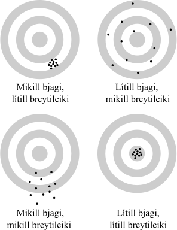

.. _c.fratilrauntilgagna:

Frá tilraun til gagna
=====================

Ef tölfræðileg rannsókn á að vera vel úr garði gerð er nauðsynlegt að
gæta þess að ákveðin skilyrði séu uppfyllt. Þar ber helst að nefna
*úrtakshögun*, *blindun* og *endurtekningar* en þessi atriði falla undir
það sem tölfræðingar kalla *tilraunahögun* (e. experimental design).

Tilraunahögun er einn mikilvægasti þáttur hverrar rannsóknar og sé illa
að henni staðið getur farið svo að rannsakendur geti ekki fylgt eftir
neinum af þeim markmiðum sem þeir upphaflega settu sér. Léleg
tilraunahögun getur jafnvel orsakað að rannsakendur haldi fram
orsakasamböndum sem eru í raun röng.

Því miður eru fjölmörg dæmi um slíkt og oftar en ekki má skýra
,,furðufréttir“ af sérkennilegum útkomum rannsókna með lélegri hönnun
tilraunarinnar. Enn fremur er oft ógerlegt að leiðrétta fyrir slæmri
tilraunahögun. Í verstu tilfellunum eru allar mælingar ónothæfar og
rannsóknin ónýt! Góðu fréttirnar eru þær að veigamestu atriðin sem hafa
þarf í huga eru ekki mörg og mikilvægi þeirra er hægt að rökstyðja með
einföldum dæmum.

Í þessum kafla fetum við í gegnum þau spor sem þarf að stíga frá því að
tölfræðileg rannsókn er áformuð og þangað til gögn eru tilbúin til
tölfræðilegrar úrvinnslu. Við byrjum á að kynnast hugtökunum *þýði* og
*úrtak* í kafla :numref:`%s <s.urtakogthydi>` og ræðum því næst um *breytur* og
ýmsar gerðir þeirra í kafla :numref:`%s <s.breytur>`. *Bjagi* og *breytileiki*
eru þau tvö meginhugtök sem torvelda okkur að draga ályktanir af
tölulegum upplýsingum. Þau eru efni kafla :numref:`%s <s.bjagiogbreytileiki>`.
Meginvopn okkar í baráttunni við bjaga er *úrtakshögun*, sem verður
tekin fyrir í kafla :numref:`%s <s.urtakshogun>`, og *blindun*, í kafla
:numref:`%s <s.blindun>`. Sé nægjanlega vel að þessum atriðum staðið er unnt að
nota *stýrða tilraun* til að fullyrða um *orsakasamband* sem eru efni
kafla :numref:`%s <s.orsakasamband>`.

.. _s.urtakogthydi:

Úrtak og þýði
-------------

Úrtak og þýði
~~~~~~~~~~~~~

Eitt af því fyrsta sem hafa ber í huga þegar tölfræðirannsókn er
fyrirhuguð er að skilgreina nákvæmlega hver viðfangsefni rannsóknarinnar
eru. Það köllum við að skilgreina hvert *þýði* rannsóknarinnar er.

Þýði (population)
^^^^^^^^^^^^^^^^^

.. attention::

    *Þýði* rannsóknar er safn allra viðfangsefna sem draga á ályktanir um.

--------------

Ef fjöldi þeirra viðfangsefna er óendanlegur segjum við að þýðið sé
óendanlegt. Annars er það endanlegt. Til sumra rannsókna svarar eingöngu
eitt þýði, til annarra svara mörg þýði sem við berum þá gjarnan saman.
Yfirleitt er æði dýrt og stundum hreinlega ómögulegt að ætla sér að skrá
mælingar hjá sérhverju viðfangsefni þýðisins. Því vinnum við nær
undantekningarlaust aðeins með hluta þýðisins, sem við köllum *úrtak*.

Úrtak (sample)
^^^^^^^^^^^^^^

.. attention::

    *Úrtak* er safn viðfangsefna sem eru valin úr tilteknu þýði.

--------------

.. _g.thydiurtak:

.. figure:: myndir/Thydi_urtak.svg
    :align: center
    :alt: Þýði og úrtak 

    Þýði og úrtak 

Ef þýðið okkar er til dæmis allir íslenskir ríkisborgarar þá er úrtak úr
því þýði safn einstaklinga með íslenskan ríkisborgararétt, það er hluti
af öllum þeim sem ríkisborgararéttinn hafa. Mynd :numref:`%s <g.thydiurtak>`
sýnir dæmigert þýði og úrtak. Þýðið er allir karlarnir á myndinni og
þeir sem búið er að draga hring um eru úrtakið. Best er ef viðfangsefnin
í úrtakinu eru valin á handahófskenndan hátt en þá tölum við um
*slembiúrtak*.

Hvert úrtak getur eingöngu verið úr einu þýði, en það má taka mörg úrtök
úr sama þýðinu. Ef við gerum rannsókn á fleiri en einu þýði tökum við að
minnsta kosti eitt úrtak úr sérhverju þýðanna.

.. _s.breytur:

Breytur
-------

Breytur
~~~~~~~

Þegar við höfum áttað okkur á því hvert þýði rannsóknarinnar er vaknar
næsta spurning: Hvernig er best að lýsa því? Í tölfræðiúrvinnslu setjum
við sérhvern eiginleika viðfangsefna okkar fram sem *breytu*.

Breyta (variable)
^^^^^^^^^^^^^^^^^

.. attention::

    *Breyta* er ákveðinn eiginleiki sem við skráum niður eða mælum á
    viðfangsefnunum í úrtakinu okkar.

--------------

Stundum skráum við eingöngu eina breytu hjá hverju viðfangsefni, stundum
margar. Séu viðfangsefni okkar menn gætum við til dæmis skráð niður
aldur, kyn, þyngd og blóðþrýsting hjá sérhverjum einstaklingi. Þá höfum
við mælingar á fjórum breytum fyrir sérhvert viðfangsefni. Breytur
skiptast gróflega í tvær gerðir, *talnabreytur* og *flokkabreytur*,
eftir því hvort þær taka gildi sem eru mæld í tölulegum einingum eða
ekki.

Flokkabreytur (categorical variables)
^^^^^^^^^^^^^^^^^^^^^^^^^^^^^^^^^^^^^

.. attention::

    *Flokkabreytur* (e. categorical variables) eru ekki mældar í tölulegum
    einingum, heldur segja, eins og nafnið gefur til kynna, til um það hvaða
    flokki viðfangsefnið tilheyrir.

--------------

Dæmi um flokkabreytur sem lýsa einstaklingum eru kyn, hæsta prófgráða
sem viðkomandi hefur lokið, póstnúmer lögheimilis og hvort
einstaklingurinn reyki eða sé reyklaus. Gildin sem flokkabreyta getur
tekið eru oft kölluð *flokkar* hennar.

Röðuð flokkabreyta (ordinal categorical variable)
^^^^^^^^^^^^^^^^^^^^^^^^^^^^^^^^^^^^^^^^^^^^^^^^^

.. attention::

    Þegar flokkabreyta er *röðuð* (e. ordinal categorical variable) er flokkum
    hennar raðað í stærðarröð.

--------------

Óröðuð flokkabreyta (categorical variable)
^^^^^^^^^^^^^^^^^^^^^^^^^^^^^^^^^^^^^^^^^^

.. attention::

    Þegar flokkabreyta er *óröðuð* (e. categorical variable) er flokkum hennar
    ekki raðað í stærðarröð.

--------------

Kyn er gott dæmi um óraðaða flokkabreytu, þar sem ekki er eðlilegt að
tala um hversu mikið einstaklingar hafi af kyni og að sama skapi er
kynjunum ekki raðað í stærðarröð. Annað dæmi um óraðaða flokkabreytu
væri breytan hárlitur sem hefði flokkana ljóst, dökkt og rautt. Breytan
hæsta prófgráða er hins vegar gott dæmi um raðaða flokkabreytu. Algengt
er að breytan hafi flokkana grunnskólapróf, stúdentspróf/iðnnám,
BS/BA-próf, MS/MA-próf og að lokum doktorsgráða. Þar hefur einstaklingur
með MA-gráðu lokið hærri prófgráðu heldur en einstaklingur með BA-gráðu
og með því móti er flokkunum raðað í stærðarröð.

Talnabreytur (numerical variables)
^^^^^^^^^^^^^^^^^^^^^^^^^^^^^^^^^^

.. attention::

    *Talnabreytur* (e. numerical variables) taka töluleg gildi sem eru mæld í
    tilteknum einingum.

--------------

Talnabreytur eru frábrugðnar flokkabreytum að því leyti að þær taka ætíð
töluleg gildi sem eru mæld í tilteknum einingum. Dæmi um talnabreytur
sem lýsa einstaklingum eru aldur (mældur í árum), hæð (mæld í cm), þyngd
(mæld í kg) og púls (mæld í slögum á mínútu). Talnabreytum er sömuleiðis
skipt upp í tvær gerðir, eftir því hvort þær eru *samfelldar* eða
*strjálar*.

Samfelldar breytur (continuous variables)
^^^^^^^^^^^^^^^^^^^^^^^^^^^^^^^^^^^^^^^^^

.. attention::

    Þegar talnabreyta getur tekið hvaða gildi sem er á einhverju bili þá
    segjum við að hún sé *samfelld*. Eingöngu talnabreytur geta verið
    samfelldar.

--------------

Sem dæmi um samfelldar breytur má nefna hárlengd, þyngd, líftíma og
hitastig. Lengd á einu mannshári getur verið 20 cm. Hún getur líka verið
21 cm, 20.8, 20.4 cm eða hvaða tala sem er á milli 20 cm og 21 cm. Einu
skorðurnar eru nákvæmni mælitækjanna okkar.

Strjálar breytur (discrete variables)
^^^^^^^^^^^^^^^^^^^^^^^^^^^^^^^^^^^^^

.. attention::

    Ef breytur eru ekki samfelldar segjum við að þær séu *strjálar*. Allar
    flokkabreytur eru strjálar og sumar talnabreytur.

--------------

Dæmi um strjálar talnabreytur eru til dæmis fjöldi eggja í hreiðri,
gildi sem kemur upp í teningakasti og heildarfjöldi marka sem skoruð eru
í knattspyrnuleik.

Sumar strjálar breytur geta tekið gífurlega mörg gildi. Hugsum okkur sem
dæmi fjölda bíla í mismunandi löndum. Það er breyta sem getur tekið
fjölmörg gildi, á mjög breiðu bili, en fjöldinn er samt alltaf heil
tala. Því getur breytan ekki tekið hvaða gildi sem er á einhverju bili.
Það er ekkert land með 1684927.4 bíla. Tölfræðiúrvinnsla á strjálum
talnabreytum sem taka mjög mörg gildi getur verið snúin. Því er oft
farin önnur af tveimur leiðum, að skipta breytunni upp í raðaða
flokkabreytu eða þá að beita þeirri nálgun að líta á hana sem samfellda
talnabreytu.

Að gefnu tilefni viljum við brýna muninn á strjálum talnabreytum og
flokkabreytum sem taka töluleg gildi. Stundum eru flokkabreytur kóðaðar
með tölum eins og til dæmis flokkabreytan póstnúmer lögheimils
einstaklings. Þá er hætt við að þeim sé ruglað við strjálar
talnabreytur. Góð leið til að forðast slíkan rugling er að skoða nánar
mælieininginuna sem breytan er mæld í. Þegar breyta er talnabreyta hafa
einingarnar sem hún er mæld í einhverja merkingu. Viðfangsefni sem
hlýtur mælinguna 2 á tiltekinni breytu hefur tvöfalt meira af þeirri
breytu en viðfangsefni með mælinguna 1. Þannig hefur tveggja ára barn
lifað tvöfalt lengur en ársgamalt barn. Það er fráleitt að tala svo um
flokkabreytuna póstnúmer, sem þó er kóðuð með tölum. Póstnúmerið 220
(Hafnarfjörður) er ekki það sama og tvöfalt magn af póstnúmerinu 110
(Árbær). Það er líka rangt að segja að sá sem býr í Árbæ hafi minna af
póstnúmeri en sá sem býr í Hafnarfirði, þó talan 110 sé minni en talan
220. Tölulega gildið er flokkunartæki.

Þegar viðfangsefnunum er lýst með fleiri en einni breytu getum við
stundum skipt breytunum upp í *svarbreytur* og *skýribreytur*.

.. _em.svarbreyturogskyribreytur:

Svarbreytur og skýribreytur (response and explanatory variables)
^^^^^^^^^^^^^^^^^^^^^^^^^^^^^^^^^^^^^^^^^^^^^^^^^^^^^^^^^^^^^^^^

.. attention::

    Fyrir sérhvert viðfangsefni mun gildi *skýribreytu* þess hafa áhrif á
    það hvaða gildi *svarbreytan* mun taka. Til einnar svarbreytu geta
    svarað margar skýribreytur sem hafa áhrif á hana.

--------------

Hugsum okkur að verið sé að kanna áhrif saltlakkríss á blóðþrýsting.
Fólk borðar mismikið magn af saltlakkrís og eftir klukkutíma er
blóðþrýstingur þeirra mældur og munurinn kannaður. Þetta er skýrt dæmi
um svarbreytu og skýribreytu. Við teljum að blóðþrýstingurinn, sem er
svarbreytan, breytist eftir því sem magn skýribreytunnar saltlakkríss
breytist. Takið eftir að gildi skýribreytu hafa áhrif á gildi
svarbreytunnar, en ekki öfugt. Hár blóðþrýstingur lætur okkur ekki borða
mikinn saltlakkrís, það er saltlakkrísinn sem veldur háum blóðþrýstingi.
Þessi munur verður mikilvægur þegar við fjöllum um orsakasambönd seinna
í kaflanum og aftur þegar við kynnumst aðhvarfsgreiningu í kafla
:numref:`%s <c.adhvarfsgreining>`.

.. _ss.nyjarbreytur:

Nýjar breytur búnar til
~~~~~~~~~~~~~~~~~~~~~~~

Oft getur verið gagnlegt að nota mælingarnar okkar til að búa til nýjar
breytur í gagnasafnið. Það má gera á ýmsa vegu. Þegar unnið er með
talnabreytur gætum viljum við sem dæmi oft skipta um einingu á breytunni
okkar, eins og þegar lengdir eru mældar í tommum en við viljum vinna með
lengdir í sentimetrum. Við gætum líka viljað beita formúlum á eina eða
fleiri talnabreytu til þess að búa til nýja breytu, eins og þegar hæð og
þyngd er notuð til að reikna líkamsþyngdarstuðul (BMI).

Þegar unnið er með flokkabreytur er algengt að flokkabreytan sé
óþarflega fínskipt. Dæmi um slíkt væri ef við hefðum spurt hvert
póstnúmer einstaklings væri en okkur nægði í raun að vita í hvaða
sveitarfélagi hann byggi. Þá er okkur óhætt að búa til nýja breytu þar
em við sameinum alla flokka sem tilheyra saman sveitafélaginu. Sú breyta
lýsir þá sveitarfélagi en ekki póstnúmeri.

Að lokum eru flokkabreytur einnig búnar til með því að beita skilyrðum á
eina eða fleiri talnabreytu eða flokkabreytu. Sem dæmi þá skilgreinir
alþjóðaheilbrigðismálastofnunin (WHO) einstakling með háþrýsting ef að
annað hvort slagbilsþrýstingur er yfir 140 mm Hg og/eða
lagbilsþrýstingur er yfr 90 mm Hg. Við gætum viljað nota mælingar á
talnabreytunum slagbilsþrýstingur og lagbilsþrýstingur til að búa til
nýja flokkabreytu, háþrýstingur sem segir til um hvort einstaklingur er
með háþrýsting eða ekki.

.. _s.bjagiogbreytileiki:

Bjagi og breytileiki
--------------------

Bjagi og breytileiki
~~~~~~~~~~~~~~~~~~~~

Tölfræðilega eru tvö meginatriði sem torvalda okkur að meta eðli þeirra
breyta sem við erum að kanna. Þau eru *bjagi* og *breytileiki*
mælinganna, sjá mynd :numref:`%s <g.bjagi>`.

Breytileiki (variability)
^^^^^^^^^^^^^^^^^^^^^^^^^

.. attention::

    *Breytileiki* verður vegna þess að breyturnar sem við erum að skoða eru
    slembni háðar og því geta útkomur mælinganna breyst í hvert sinn sem
    tilraunin er framkvæmd.

--------------

Við beitum tölfræði vegna þess að mælingarnar sem við skoðum eru alltaf
háðar einhverri *slembni* (e. randomness). Slembnin getur átt sér ýmsar
orsakir. Algengasta orsökin er sú að við vinnum með úrtök en ekki allt
þýðið. Það er slembið hvaða viðfangsefni veljast í úrtakið hverju sinni
sem veldur því að niðurstöðurnar geta breyst í hvert sinn sem nýtt úrtak
er valið og rannsóknin endurtekin.

Þeim meiri breytileika sem mælingar hafa, þeim mun erfiðara er að átta sig á
þeim lögmálum sem þær lúta. Breytileiki mælinga er bundinn eðli þeirra
viðfangsefna sem verið er að skoða og við höfum engar leiðir til að
minnka hann. Hins vegar gera endurtekningar okkur kleift að fá skýrari
mynd af þeirri reglu sem mælingarnar fylgja. Ef við framkvæmum mælingu á
eingöngu einu viðfangsefni er engin leið fyrir okkur að meta hversu stór
sá breytileiki er. Um leið og við höfum mælingu á fleiri en einu
viðfangsefni, það er *endurtekningu*, höfum við einhverja hugmynd um það
á hvaða bili mælingarnar geta legið. Því fleiri endurtekningar, því
betur vitum við hversu breytilegar mælingarnar geta verið. Þessi
breytileiki er lykilatriði í allri ályktunartölfræði, sem er stærsti
hluti þeirrar tölfræði sem þessi bók fjallar um.

Bjagi (bias)
^^^^^^^^^^^^

.. attention::

    *Bjagi* verður þegar aðferðirnar gefa markvisst bjagaða mynd af þýðinu
    sem verið er að skoða.

--------------

Bjagi er í eðli sínu gerólíkur breytileika. Á meðan breytileiki er
bundinn í eðli mælinganna og þannig á vissan hátt ,,sannur“ í eðli sínu,
veldur bjagi því að við fáum kerfisbundið skakka mynd af viðfangsefnunum
sem við erum að skoða og því viljum við lágmarka hann með öllum ráðum.
Sá bjagi sem við munum fjalla um getur átt sér tvennar orsakir. Annars
vegar verður hann þegar viðfangsefnin í úrtakinu eru valin á
kerfisbundið bjagaðan hátt. Þá er talað um *úrtaksbjaga*. Úrtakshögun
snýr að því að lágmarka úrtaksbjaga og er hún viðfangsefni kafla
:numref:`%s <s.urtakshogun>`. Hins vegar geta væntingar bæði rannsakanda og
viðfangsefna valdið kerfisbundið bjöguðum mælingum. Þá er um
*rannsakandabjaga* og *lyfleysuáhrif* að ræða. *Blindun* er notuð til að
lágmarka þann bjaga og er hún viðfangsefni kafla :numref:`%s <s.blindun>`.

.. _g.bjagi:

    Bjagi og breytileiki 

.. _s.urtakshogun:

Úrtakshögun
-----------

Úrtakshögun
~~~~~~~~~~~

Fyrsta viðfangsefni tilraunahögunar sem við tökum fyrir er *úrtakshögun*
(e. sampling). *Úrtakshögun* snýr bæði að því hvernig úrtak er valið úr
þýði en einnig hvaða viðfangsefnum er úthlutað hvaða inngrip. Markmið
úrtakshögunar er ætíð það sama fyrir allar gerðir rannsókna, að lágmarka
*úrtaksbjaga* (e. sampling bias).

Úrtaksbjagi (Sampling bias)
^^^^^^^^^^^^^^^^^^^^^^^^^^^

.. attention::

    *Úrtaksbjagi* verður þegar ákveðin viðfangsefni þýðis eru líklegri til
    að vera valin í úrtak heldur en önnur.

--------------

Því meiri sem úrtaksbjaginn er því verr endurspeglar úrtakið þýðið. Sé
bjaginn of mikill verður ekki hægt að álykta um þýðið út frá úrtakinu og
því engin ályktunartölfræði möguleg! Besta leiðin til að forðast
úrtaksbjaga er að velja slembiúrtak, því slembiúrtök eru laus við bjaga.
Athugið að séum við að framkvæma tilraun þar sem viðfangsefnum er skipt
í hópa sem hljóta ólík inngrip þurfum við ekki eingöngu að gæta þess
hvernig úrtakið er valið heldur einnig að gæta þess hvernig
viðfangsefnum er skipt upp í hópa.

Slembival (randomization)
^^^^^^^^^^^^^^^^^^^^^^^^^

.. attention::

    Það að velja slembið, eða *slembival*, þýðir að velja handahófskennt
    þannig að öll viðfangsefni eru jafnlíkleg til að vera valin.

--------------

Úrtak sem er valið með slembivali kallast *slembiúrtak* (e. random sample).
Við munum fjalla um þrjár gerðir af slembiúrtökum: *einfalt
slembiúrtak*, *lagskipt slembiúrtak* og *parað slembiúrtak*.

.. _ss.einfaltoglagskiptslembiurtak:

Einfalt og lagskipt slembiúrtak
~~~~~~~~~~~~~~~~~~~~~~~~~~~~~~~

Einfalt slembiúrtak (simple random sample)
^^^^^^^^^^^^^^^^^^^^^^^^^^^^^^^^^^^^^^^^^^

.. attention::

    Þegar við framkvæmum *einfalt slembiúrtak* veljum við einstaklinga af
    handahófi úr öllu þýðinu.

--------------

Lagskipt slembiúrtak (stratified random sample)
^^^^^^^^^^^^^^^^^^^^^^^^^^^^^^^^^^^^^^^^^^^^^^^

.. attention::

    Þegar við framkvæmum *lagskipt slembiúrtak* er þýðinu fyrst skipt niður
    í nokkur lög eða hópa og síðan eru viðfangsefni valin með einföldu
    slembiúrtaki úr hverju lagi fyrir sig. Fjöldi viðfangsefna sem valinn er
    úr hverju lagi verður að vera ákveðinn fyrirfram en hann má vera
    mismikill eftir lögum.

--------------

Lagskipting getur komið að góðum notum þegar verið er að rannsaka
fyrirbæri þar sem utanaðkomandi breytur, aðrar en þær sem ætlunin er að
rannsaka, hafa áhrif á mælingarnar á viðfangsefnunum. Dæmi um slíkt væri
ef bera ætti orkuinnihald í matarræði saman við ákefð hreyfingar
Íslendinga. Orkuþörf og þar af leiðandi orkuinnihald í mat er ólík eftir
kynjunum og því myndum við fá skýrari mynd af sambandi orkuneyslu og
hreyfingar ef við hefðum jafnt kynjahlutfall í mælingunum okkar. Það
myndum við gera með því að velja lagskipt slembiúrtak, t.d. 20 karlmenn
af handahófi og 20 konur af handahófi og bera saman orkuneyslu og
hreyfingu hjá þeim hóp. Lagskipt slembiúrtak getur einnig verið afar
gagnlegt þegar viðfangsefnin skiptast niður í svo misstóra hópa að ef
við myndum velja einfalt slembiúrtak úr öllum lögunum væri hætta á að
velja sárafá eða engin viðfangsefni úr minnstu hópunum.

Hugsum okkur til dæmis að við vildum kanna mun á árstekjum eftir
sveitarfélögum. Ef við veldum fólk af handahófi úr þjóðskrá myndu
gróflega 2/3 viðfangsefnanna koma af höfuðborgarsvæðinu. Því myndum við
heldur kjósa að velja af handahófi úr hverju sveitarfélagi fyrir sig.
Takið þó vel eftir því að það má alls ekki slaka á kröfunum um að velja
slembið úr hverjum hópi fyrir sig sem í þessu tilviki eru
sveitarfélögin.

.. _ss.paradslembiurtak:

Parað slembiúrtak
~~~~~~~~~~~~~~~~~

Parað slembiúrtak (paired random sample)
^^^^^^^^^^^^^^^^^^^^^^^^^^^^^^^^^^^^^^^^

.. attention::

    *Parað slembiúrtak* fæst þegar viðfangsefnin í þýðinu eru pöruð saman
    tvö og tvö og síðan er ákveðinn fjöldi para valinn af handahófi í
    úrtakið.

--------------

Paraðar mælingar koma líkt og lagskipt slembiúrtök að góðum notum þegar
mælingarnar okkar eru mjög breytilegar vegna áhrifa utanaðkomandi
breyta, annarra en þeirra sem ætlunin var að rannsaka. Sér í lagi eru
paraðar mælingar vinsælar þegar slíkar utanaðkomandi breytur eru mjög
margar og jafnvel erfitt að festa hönd á þær. Sú er oft raunin þegar
verið er að rannsaka fólk og aðrar flóknar lífverur.

Með pöruðu slembiúrtaki lágmörkum við áhrif utanaðkomandi breyta með því
að para saman viðfangsefni sem hafa mjög lík eða sömu gildi á
utanaðkomandi breytum. Raunverulega mælingin sem við höfum þá áhuga á að
skoða er mismunur mælinganna hjá hverju og einu pari. Stundum eru
viðfangsefnin jafnvel pöruð við sig sjálf. Þá er til dæmis fyrst
framkvæmd mæling án inngrips og síðan önnur mæling að inngripi loknu og
þær tvær mælingar paraðar saman, ef slíkt er við hæfi.

Hugsum okkur að við höfum tvær gerðir af hlaupaskóm og viljum kanna
hvort þær hafi mismikil áhrif á hlaupahraða. Við gætum valið af
handahófi tvo hópa af fólki, látið annan hópinn hlaupa kílómeter í einni
gerðinni og hinn hópinn hlaupa sömu vegalengd í hinni gerðinni. Að því
loknu myndum við kanna muninn á meðaltíma hópanna tveggja. Slíkt væri
dæmi um óparaðar mælingar og þá myndum við líta á hópana tvo sem sitt
hvort úrtakið, hvort úr sínu þýði. Vandamál þeirrar aðferðar er að
hlaupahraði fólks er mjög breytilegur og því gæti þurft mikinn fjölda
einstaklinga í hvorn hóp til að meta með góðu móti þann mun sem má rekja
til hlaupaskónna en ekki annarra utanaðkomandi þátta. Við gætum einnig
framkvæmt sömu tilraun með pöruðum mælingum. Þá myndi hver hlaupari
hlaupa kílómeterinn tvisvar, eina ferð í hvoru pari, og að lokum væri
munurinn á hlaupahraða hvers einstaklings reiknaður. Að vísu gæti tíminn
í fyrri ferðinni verið betri, vegna þess að þá væri hlauparinn óþreyttur
en þann bjaga má leiðrétta með því að láta helming hlauparanna hlaupa
fyrst í annarri gerðinni en hinn helminginn hlaupa fyrst í hinni
gerðinni. Með þessu móti hverfur sá breytileiki í mælingunum sem rekja
má til ólíkrar hlaupagetu viðfangsefnanna og því þarf ekki eins stórt
úrtak til að fá skýra mynd af áhrifum hlaupaskónna.

Við munum fjalla nánar um paraðar mælingar og ályktanir um mun á
meðaltölum þeirra í kafla :numref:`%s <s.paradarmaelingar>`.

Hvað ef slembiúrtak er ógerlegt?
~~~~~~~~~~~~~~~~~~~~~~~~~~~~~~~~

Stundum valda erfiðleikar í framkvæmd því að við getum ómögulega valið
slembiúrtak úr þýði. Þá er farin önnur af tveimur leiðum:

1. Að skilgreina þýðið upp á nýtt þannig að úrtakið verði slembiúrtak.

    Dæmi um slíkt væri að skilgreina þýði Íslendinga sem eru skráðir í
    símaskrána í stað þýðis allra Íslendinga. Vandamálið við þá aðferð er
    það að þá eiga ályktanir okkar eingöngu við um þá Íslendinga sem eru
    skráðir í símaskrána sem er ef til vill ekki það sem við viljum.

2. Að sætta sig við bjagann.

    Þá þurfum við að gera grein fyrir úrtaksbjaganum í umfjöllun okkar og
    ræða ítarlega hvaða afleiðingar hann getur haft í för með sér.
    Stundum getum við leyft okkur að gera ráð fyrir því að bjaginn sé
    léttvægur með tilliti til þess sem við erum að rannsaka. Þá getur
    verið meira viðeigandi að sætta sig við bjagann heldur en að
    skilgreina þýðið upp á nýtt.

Hugsum okkur að við viljum kanna stafakunnáttu 4 ára barna á Íslandi.
Ein leið til þess væri að velja slembiúrtak leikskólabarna. Vissulega
eru ekki öll 4 ára börn í leikskólum, svo úrtakið verður bjagað. Við
gætum sagt sem svo að þýðið sé eingöngu leikskólabörn á Íslandi. Hin
leiðin væri sú að tiltaka að undantekningarnar séu svo fáar, langflest 4
ára börn eru í leikskóla svo við getum fært rök fyrir því að bjaginn
verði ekki mikill.

Algengar úrtaksaðferðir sem ekki eru slembiúrtök
~~~~~~~~~~~~~~~~~~~~~~~~~~~~~~~~~~~~~~~~~~~~~~~~

*Sjálfboðaliðaúrtök* (e. voluntary response sampling) og *aðgengisúrtök*
(e. convenience sampling) eru tvö dæmi um úrtaksaðferðir sem gefa ekki
slembiúrtök en eru þó mikið notaðar.

**Sjálboðaliðaúrtök** eiga við þegar viðfangsefnin eru fólk og þá eru
eingöngu framkvæmdar mælingar á þeim sem bjóða sig fram til þess. Hér
verður úrtaksbjagi vegna þess að ákveðin viðfangsefni geta verið
líklegri til að bjóða sig fram en önnur. Oft getur sá bjagi orðið svo
mikill að lítið er hægt að álykta út frá þeim mælingum sem fengnar eru.

19. október 2010 var spurt í Reykjavík síðdegis: ,,Hversu sammála eða
ósammála ertu að banna þjóðkirkjunni aðgang að grunn- og leikskólum? “
Könnunin er dæmigerð ,,netkönnun“, hýst á léninu visir.is en allir
lesendur vefsíðunnar geta svarað spurningunni. Slíkar netkannanir eru
klassískt dæmi um sjálfboðaliðaúrtök og eru stórkostlega bjagaðar. Í
fyrsta lagi sjá eingöngu lesendur síðunnar spurninguna og þeir eru svo
sannarlega ekki slembiúrtak úr þjóðinni. Í öðru lagi svara lesendur
yfirleitt eingöngu spurningum sem höfða til þeirra. Í þessu tiltekna
dæmi er sennilegt að áhugafólk um trúmál vilji koma skoðun sinni á
framfæri sem og kennarar og foreldrar barna.

**Aðgengisúrtök** eru fengin þegar eingöngu eru framkvæmdar mælingar á
þeim viðfangsefnum sem eru (þægilega) aðgengileg rannsakendum. Þar
verður úrtaksbjagi vegna þess að ákveðin viðfangsefni þýðisins eru
líklegri til að vera aðgengileg rannsakendum en önnur. Sá bjagi getur
verið mikill og valdið því að ekki er hægt að draga ályktanir út frá
fengnum mælingum.

Dæmi um slíkt væri að velja í úrtak vegfarendur í Kringlunni frá klukkan
17 til 19 á fimmtudegi. Slíkt þýði er augljóslega bjagað. Í því eru
væntanlega að megninu til íbúar í nærliggjandi hverfum sem ekki vinna á
kvöldin og svo mætti lengi telja. Að minnsta kosti er ljóst að slíkt
úrtak getur ekki verið lýsandi fyrir alla Íslendinga.

.. _ss.vontunmaelinga:

Vöntun mælinga
~~~~~~~~~~~~~~

Vöntun mælinga (missing values)
^^^^^^^^^^^^^^^^^^^^^^^^^^^^^^^

.. attention::

    Ef ekki tekst að framkvæma mælingu á öllum þeim viðfangsefnunum sem hafa
    verið valin í úrtak er sagt að það *vanti mælingu* fyrir viðkomandi
    viðfangsefni.

--------------

Vöntun mælinga snýr því ekki að því hvernig úrtak er valið og ætti því
strangt til tekið ekki að eiga heima í kafla um úrtakshögun. Hins vegar
má oft sjá rannsóknir þar sem vöntun mælinga er mjög mikil, jafnvel
vantar upp undir helming allra mælinga. Þá má ekki framkvæma
tölfræðiúrvinnslu eingöngu á þeim viðfangsefnum sem hægt var að
framkvæma mælingar á, eins og ekkert hefði í skorist, því það er í raun
sambærilegt því að minnka úrtakið eftir á. Það getur verið stórkostlega
vafasamt því oft er líklegra að það vanti frekar mælingar hjá ákveðnum
viðfangsefnum heldur en öðrum og þá er um leið líklegra að þau
viðfangsefni lendi ekki í minnkaða ,,úrtakinu“ sem veldur úrtaksbjaga!

Það er til dæmis vel þekkt að kjósendur eru ekki allir búnir að gera upp
hug sinn, eða tilbúnir til að gefa upp afstöðu sína, nokkrum dögum fyrir
þingkosningar og að atkvæði þeirra skiptast öðruvísi heldur en atkvæði
annarra kjósenda. Þetta útskýrir að miklu leyti þann mun sem ætíð má
finna í skoðanakönnunum fyrir kosningar og svo kosningaúrslitunum
sjálfum. Að sjálfsögðu má tína til aðra þætti en þeir verða ekki
tíundaðir hér.

.. _s.blindun:

Blindun
-------

Þegar við framkvæmum tilraun viljum við geta tryggt að sjáist munur á
mælingunum okkar megi rekja hann til inngripanna sem við beitum en ekki
annarra utanaðkomandi áhrifa. Þið hafið nú séð hvernig val á
viðfangsefnum í úrtök getur valdið bjaga ef ekki er nægilega vel að
gætt. Þann bjaga kölluðum við *úrtaksbjaga*.

Nú munum við áfram fjalla um atriði sem bjaga mælingar en nú eiga þau
sér aðrar orsakir. Annars vegar verður bjaginn vegna þess að
rannsakandinn býst við því að sjá mismunandi niðurstöður eftir því hvaða
inngripum er beitt. Hins vegar vegna þess að viðfangsefnin geta sýnt mun
í mælingum vegna þess að þau telja að inngripið hafi áhrif á þann
eiginleika sem verið er að mæla. Yfirleitt valda báðir þessir bjagar því
að meiri áhrif mælast af beitingu inngrips en raunverulega eru. Í slæmum
tilvikum orsakar það að rannsakendur draga ranglega ályktanir um ágæti
gagnslausra inngripa.

Rannsakandabjagi og lyfleysuáhrif
~~~~~~~~~~~~~~~~~~~~~~~~~~~~~~~~~

Rannsakandabjagi (experimenters bias)
^^^^^^^^^^^^^^^^^^^^^^^^^^^^^^^^^^^^^

.. attention::

    *Rannsakandabjagi* verður þegar væntingar rannsakanda um áhrif inngrips
    hafa áhrif á mælingarnar á viðfangsefnunum.

--------------

Rannsakandabjagi getur komið til á bæði beina og óbeina vegu. Bein áhrif
verða þegar væntingar rannsakanda valda bjaga í því hvernig hann skráir
niður mælingarnar. Óbein áhrif verða þegar væntingar rannsakandans valda
breytingum á viðfangsefninu sjálfu. Sem dæmi um bein áhrif má nefna að
búist rannsakandi við lágum mælingum gæti hann frekar lesið að málband
sýni 15.4 cm en 15.5 cm þegar mælingin er nákvæmlega mitt á milli. Sem
dæmi um óbein áhrif gæti rannsakandi átt erfitt með að leyna undrun
sinni þegar svör viðmælenda (sem væru þá mælingarnar) eru í mótsögn við
kenningar rannsakandans. Viðmælandinn gæti skynjað þá undrun og því
ósjálfrátt efast um svör sín og jafnvel breytt þeim, eða öðrum sem á
eftir fylgja.

Þrátt fyrir að rannsakandinn sjálfur valdi rannsakandabjaga á
mælingunum, má alls ekki skilja sem svo að munurinn í mælingunum komi
til vegna ásetnings rannsakandans. Að sjálfsögðu göngum við út frá því
að sérhver rannsakandi vilji vanda gerð rannsóknar sinnar sem mest hann
má og forðast allt það sem gæti bjagað niðurstöðurnar. Rannsakandabjagi
er því ekki ætlunarverk rannsakanda heldur óhjákvæmileg afleiðing og
ekkert annað en góð tilraunahögun getur komið í veg fyrir hann. Það er
að rannsakandinn viti ekki hvort viðfangsefnið hafi hlotið inngrip eða
ekki.

Væntingar rannsakandans eru ekki einar um að geta valdið bjöguðum
niðurstöðum, væntingar viðfangsefnanna geta sömuleiðis haft mikil áhrif
á útkomur mælinga. Góð leið til að komast hjá þeim bjaga er að nota
lyfleysur.

Lyfleysa (placebo)
^^^^^^^^^^^^^^^^^^

.. attention::

    *Lyfleysa* er sérhvert inngrip sem viðfangsefni telur ranglega að sé
    inngripið sem mæla á.

--------------

Lyfleysa getur verið hveititafla í stað blóðþrýstingslyfs,
,,nikótínplástur“ með engu nikótíni, ,,gerviheilun“, það er að segja
hvað eina sem viðfangsefnið getur ekki greint mun á hvort sé ,,alvöru“
inngrip - eða plat!

.. _em.lyfleysuahrif:

Lyfleysuáhrif (placebo effect)
^^^^^^^^^^^^^^^^^^^^^^^^^^^^^^

.. attention::

    Þann mun í mælingum viðfangsefna sem við sjáum fyrir og eftir
    lyfleysuinngrip köllum við *lyfleysuáhrif*.

--------------

Hugsum okkur hóp fólks sem þjáist af höfuðverk. Hópnum er skipt í tvennt
og öðrum hópnum gefið virkt höfuðverkjalyf en hinum hópnum gefin
lyfleysa. Fólkið er svo beðið um að meta hversu mikið höfuðverkurinn
batnaði við inntöku. Munur á höfuðverk fyrir og eftir að lyfleysan er
gefin eru lyfleysuáhrif.

Yfirleitt eru rannsóknir framkvæmdar með það fyrir augum að staðfesta að
tilteknir eiginleikar inngrips hafi merkjanleg áhrif á ákveðna
eiginleika viðfangsefnanna. Í dæminu hér að ofan væri markmiðið að sýna
að virku efnin í höfuðverkjalyfinu hafi merkjanleg áhrif á höfuðverk hjá
viðkomandi einstaklingum. Takið eftir því að bæði hópurinn sem fékk
lyfið og sá sem fékk lyfleysuna verða fyrir lyfleysuáhrifum. Það er
báðir hóparnir töldu sig vera að hljóta tiltekið inngrip og trú þeirra á
að inngripið virki hafði áhrif á matið sem fékkst. Sá munur sem skýrist
með virku efnunum í lyfjunum er því eingöngu **munurinn** á hópunum
tveimur eftir að inngripinu var beitt, sjá mynd :numref:`%s <g.lyfleysuahrif>`.
Því er þess krafist af lyfjum að þau sýni virkni umfram lyfleysuáhrif.

.. _g.lyfleysuahrif:

.. figure:: myndir/lyfleysa.svg
    :align: center
    :alt: Lyfleysuáhrif 

    Lyfleysuáhrif 

Mörgum gæti þótt það smámunasemi að þurfa að leiðrétta fyrir
lyfleysuáhrifum, enda ætla margir að þau áhrif séu hér um bil hverfandi.
Því er síður en svo farið og eru smáskammtalækningar (hómópatía) ágætt
dæmi. Smáskammtalækningar hafa ávallt verið mjög umdeildar og hafa
fjölmargar rannsóknir sýnt fram á að áhrif þeirra séu engu meiri en
lyfleysuáhrif [1]_. Neðri deild breska þingsins hefur í því tilliti
lýst því yfir að flokka skuli smáskammtalækningar sem lyfleysuinngrip
[2]_. Þrátt fyrir það starfar fjöldi manns við smáskammtalækningar hér
á landi sem og annars staðar í heiminum.

Athugið einnig að notkun lyfleysu er eitt og sér ekki nægjanlegt
skilyrði til að sýna fram á virkni inngripa heldur þarf tilraunin einnig
að uppfylla ákveðnar kröfur um úrtakshögun sem þið kynntust í kafla
:numref:`%s <s.urtakshogun>` og nægjanlegan fjölda endurtekinna mælinga. Þessi
skilyrði verða tekin saman í kafla :numref:`%s <s.orsakasamband>`.

Einblindar og tvíblindar rannsóknir
~~~~~~~~~~~~~~~~~~~~~~~~~~~~~~~~~~~

Þar sem rannsakandabjagi og lyfleysuáhrif geta verið töluverð, flokkum
við tilraunir eftir því hvort gerðar eru ráðstafanir til að lágmarka
þann bjaga. Þeir tveir flokkar sem notaðir eru kallast annars vegar
*einblindar rannsóknir* og hins vegar *tvíblindar rannsóknir*.

Tvíblindar rannsóknir (double-blind trials)
^^^^^^^^^^^^^^^^^^^^^^^^^^^^^^^^^^^^^^^^^^^

.. attention::

    Þegar rannsókn er *tvíblind* vita hvorki rannsakandi né viðfangsefni
    tilraunarinnar hvaða inngrip hvert viðfangsefni hlýtur. Athugið að
    inngrip getur verið lyfleysuinngrip.

--------------

Með öðrum orðum eru bæði rannsakandinn og viðfangsefnið blind á það
hvaða inngripi var beitt í hverju tilviki. Stundum verðum við að sætta
okkur við að ekki sé hægt að dylja það fyrir rannsakandanum hvaða
inngripi var beitt, það sé til dæmis augljóst í hverju tilviki. Þá er
tvíblind rannsókn ekki möguleg en hins vegar væri hægt að framkvæma
*einblinda rannsókn*.

Einblindar rannsóknir (single-blind trials)
^^^^^^^^^^^^^^^^^^^^^^^^^^^^^^^^^^^^^^^^^^^

.. attention::

    Þegar rannsókn er *einblind* vita annað hvort viðfangsefnin eða
    rannsakandinn ekki hvaða inngripi er beitt.

--------------

.. _s.orsakasamband:

Orsakasamband
-------------

Orsakasamband
~~~~~~~~~~~~~

Tölfræðilegar rannsóknir geta verið af ýmsum toga. Ein mikilvæg gerð
rannsókna er *stýrð tilraun*.

.. _em.styrdtilraun:

Stýrð tilraun (controlled experiment)
^^^^^^^^^^^^^^^^^^^^^^^^^^^^^^^^^^^^^

.. attention::

    Til að rannsókn geti flokkast sem stýrð tilraun þurfa tvö atriði að vera
    til staðar:
    
    #) Rannsakandinn getur stýrt því hvaða viðfangsefni hljóta hvaða
       inngrip.
    
    #) Mælingar eru framkvæmdar á viðfangsefnum bæði fyrir og eftir að
       inngripinu er beitt.

--------------

Ímyndum okkur að við ætlum að kanna samband reykinga og líkamsþyngdar
með því að framkvæma mælingar á 100 viðfangsefnum sem væri skipt í tvo
jafnstóra hópa. Ein aðferð væri að velja af handahófi 50 reykingamenn og
50 reyklausa einstaklinga og mæla líkamsþyngd þeirra. Sú aðferð myndi þó
ekki flokkast undir stýrða tilraun. Dæmi um stýrða tilraun væri að velja
100 reyklausa einstaklinga og mæla líkamsþyngd þeirra. Velja síðan 50
þeirra af handahófi og láta þá reykja einn pakka af sígarettum á dag á
meðan hinir 50 myndu ekki reykja. Að ári liðnu yrði líkamsþyngd beggja
hópa könnuð aftur.

Ef við höfum framkvæmt stýrða tilraun stjórnum við því alfarið hvaða
inngrip viðfangsefnin hljóta en mælingin er ekki framkvæmd fyrr en eftir
að við höfum tekið þá ákvörðun. Því eru mælingarnar ætíð svarbreytur en
inngripin skýribreytur. Inngripin geta haft áhrif á mælingarnar en ekki
öfugt.

.. _em.godtilraun:

Hvaða skilyrði ætti stýrð tilraun að uppfylla?
^^^^^^^^^^^^^^^^^^^^^^^^^^^^^^^^^^^^^^^^^^^^^^

.. attention::

    Sérhver rannsakandi ætti að leitast við að tilraun hans uppfylli
    eftirfarandi skilyrði:
    
    #) Úrtakshögun.
    
        Viðfangsefni eru valin úr þýðinu með slembiúrtaki og/eða skipt í hópa
        með slembivali.
    
    #) Blindun.
    
        Rannsóknin er tvíblind en einblind ef því verður ekki komið við.
    
    #) Endurtekningar.
    
        Inngripinu er beitt á endurtekinn fjölda viðfangsefna.

--------------

Markmið margra rannsókna er að geta fullyrt hvaða áhrif tiltekin inngrip
hafa á viðfangsefnin okkar. Uppfylli stýrð tilraun skilyrðin í kassa
:numref:`%s <em.godtilraun>` verður sá munur sem greinist á mælingunum eingöngu
skýrður með inngripunum sem beitt var en ekki öðrum utanaðkomandi
áhrifum. Þannig er hægt að fullyrða að tilteknu inngripin hafi valdið
þeim mun á eiginleika viðfangsefnanna sem mældur var. Það getum við
orðað sem svo að við getum fullyrt um *orsakasamband* inngripanna á þær
breytur sem við mælum hjá viðfangsefnunum okkar.

Orsakasamband (causation)
^^^^^^^^^^^^^^^^^^^^^^^^^

.. attention::

    **Orsakasamband** milli tveggja breyta er þegar gildi einnar breytu
    hefur áhrif á þau gildi sem önnur breyta mun taka. Eingöngu verður sýnt
    fram á orsakasamband með stýrðum tilraunum.

--------------

Skýrt dæmi um samband, sem þó er ekki orsakasamband, er samband milli
drukknana og íssölu á Benidorm. Einstaklingur er ekki líklegri til að
drukkna í sjónum þótt hann hafi borðað ís fyrr um daginn. Þó drukkna
fleiri þá daga sem íssala er mikil en þegar íssala er lítil. Ástæðan er
einfaldlega sú að þegar hlýtt er úti flykkist fólk á ströndina, þar sem
það getur drukknað. Þá daga selst jafnframt mikið af ís. Á köldum dögum
er enginn í sjónum og því lítill möguleiki á að drukkna. Þá daga selst
minna af ís.

Mynd :numref:`%s <g.orsakasamband>` lýsir sambandi tveggja breyta, :math:`x` og
:math:`y`. Vinstra megin á myndinni er orsakasamband milli breytanna en
ekki á myndinni hægra megin. Myndin hægra megin lýsir dæminu hér að ofan
þar sem :math:`x` og :math:`y` eru drukknanir og ísát en :math:`z` er
hitastig.

.. _g.orsakasamband:

.. figure:: myndir/Orsakasamband.svg
    :align: center
    :alt: Orsakasamband 

    Orsakasamband 

Dæmi
----

Dæmi
~~~~

Birgir er mikill listakokkur og almennur áhugamaður um matarvenjur
Íslendinga. Hann framkvæmir könnun þar sem hann velur handahófskennt
úrtak 20 manna og 20 kvenna og spyr þau hversu oft í viku þau borði
heitan mat í hádeginu. Birgir listakokkur skráir mælinguna 1 hjá
tilteknu viðfangsefni ef það borðar heitan hádegismat einu sinni í viku,
2 ef það borðar heitan mat tvisvar í viku og svo framvegis. Að hámarki
skráir hann mælinguna 7 ef viðfangsefnin borða heitan hádegismat alla
daga vikunnar.

a) Er breytan sem Birgir skráir talnabreyta eða flokkabreyta?

#) Er breytan sem Birgir skráir samfelld eða strjál?

Dæmi
~~~~

Hverjar af eftirtöldum breytum eru samfelldar og hverjar eru strjálar?

a) Fjöldi eggja í andahreiðrum við Tjörnina.

#) Stjörnumerki nemenda í Vogaskóla

#) Fjöldi alþingismanna sem eiga jeppa.

#) Lengd höfuðhára á nýfæddum börnum.

#) Þyngd jólatrjáa sem seld eru hjá Flugbjörgunarsveitinni.

Dæmi
~~~~

Heiða Dóra kannar hvort samband sé á milli skulda einstaklinga og
fæðingarmánaða þeirra. Hún skoðar skuldastöðu 100 handahófsvaldra
einstaklinga og skráir tvær breytur. Önnur þeirra er heildarupphæð sem
einstaklingarnir skulda. Hin breytan tekur gildi frá 1 upp í tólf eftir
því í hvaða mánuði einstaklingarnir eru fæddir (1 fyrir janúar, 2 fyrir
febrúar o.s.frv). Af hvaða gerð væri réttast að skrá breyturnar sem
Heiða Dóra mælir?

Dæmi
~~~~

Hverjar af eftirtöldum breytum eru talnabreytur og hverjar eru
flokkabreytur?

a) Innsláttarhraði unglinga á lyklaborði.

#) Litur á jólaseríum í gluggum landsmanna.

#) Fjöldi bifreiða sem aka um Suðurgötuna föstudaginn 3. febrúar 2012.

#) Ferðamáti sálfræðinema til og frá Háskóla Íslands.

#) Fjöldi innsláttavillna í þessari bók.

Dæmi
~~~~

Fjóla rannsakar beinþynningu hjá íslenskum konum og kannar hvaða áhrif
mataræði og hreyfing spila þar inn. Hún mælir beinþéttni
handahófsvalinna kvenna (í :math:`mg/cm^2`) og spyr þær einnig hversu
mikið þær hreyfi sig (lítið, í meðallagi eða mikið) og hvort þær neyti
mjólkurvara (aldrei, stundum, oft). Með hvaða hætti væri rétt að skrá
þessar breytur?

Dæmi
~~~~

María kannar hljóðvist í leikhússölum borgarinnar. Hún mætir á eina
leiksýningu af hverju einasta verki sem sett er upp á Höfuðborgarsvæðinu
í desember og skráir mesta hljóðstyrkinn sem mældist á sýningunni (í
desíbelum). Af hvaða gerð er breytan sem María mælir?

Dæmi
~~~~

Skráið niður dæmi um þrjár samfelldar og þrjár strjálar talnabreytur.

Dæmi
~~~~

Hvort væri hentugra að skrá fjölda systkina sem einstaklingur á sem
strjála eða samfellda talnabreytu? En fjölda barrnála á grenitré?
Rökstyðjið svar ykkar.

Dæmi
~~~~

Kári kannar gerðir kenninafna á Íslandi. Hann velur 1000 manna
handahófsúrtak úr þjóskrá og kannar hvort einstaklingar beri ættarnöfn
og hvort þeir kenni sig við móður eða föður. Af hvaða gerð er breytan
sem Kári skráir?

Dæmi
~~~~

Birgir er mikill listakokkur og almennur áhugamaður um matarvenjur
Íslendinga. Hann framkvæmir könnun þar sem hann velur handahófskennt
úrtak 20 manna og 20 kvenna og spyr þau hversu oft í viku þau borði
heitan mat í hádeginu. Er úrtakið sem Birgir valdi dæmi um: lagskipt
slembiúrtak, einfalt slembiúrtak, parað slembiúrtak eða sjálfboðaúrtak?

Dæmi
~~~~

Finn langar að kanna meðalfjölda veitingastaða sem ferðamenn á
gistihúsum heimsækja á meðan dvöl þeirra stendur. Til þess útbjó hann
spurningalista sem lágu í móttöku allra gistihúsa á Höfuðborgarsvæðinu.
Könnunin var auglýst mjög vel og gestir hvattir til að taka þátt og
skila svörunum í þar til gerða kassa sem einnig lágu í móttökunni. Hvert
er helsta vandamálið við tilraunahögun könnunarinnar hans Finns?

Dæmi
~~~~

Gunnar Þór þrekþjálfari telur að það séu sterk tengsl milli matarvenja
og heilsu. Hann framkvæmir því tilraun þar sem hann parar saman tvo og
tvo nemendur, sem valdir voru með slembiúrtaki, sem honum þykir svipaðir
að þreki. Hann lætur svo annan meðlim hvers pars á sérstakt mataræði á
meðan hinn borðar eins og hann er vanur. Þáttakendur eru á þessu mataræði
í 4 vikur en að því loknu eru framkvæmd þrekpróf á öllum einstaklingunum.

a) Er úrtakið sem Gunnar Þór valdi dæmi um: lagskipt slembiúrtak,
   einfalt slembiúrtak, parað slembiúrtak eða sjálfboðaúrtak?

#) Hverjir eru helstu vankantarnir á tilraunahögun Gunnars Þórs?

Dæmi
~~~~

Agnar vill kanna hvers konar auglýsingar höfða best til viðskiptavina.
Hann sendir því stuttan spurningalista á alla vini sína á Facebook en
til að tryggja hátt svarhlutfall gefur hann öllum þeim sem svara
könnuninni lítinn happdrættismiða þar sem í vinning er 10 þúsund króna
inneign í útivistarbúð. Hvað er athugavert við tilraunahögun Agnars?

Dæmi
~~~~

Fríðu langar að kanna meðalfjölda veitingastaða sem ferðamenn á
gistihúsum heimsækja á meðan dvöl þeirra stendur. Hún hefur hins vegar
þá kenningu að smekklega klæddir ferðamenn (að hennar mati) heimsæki
fleiri veitingastaði heldur en þeir síður smekkvísu. Hún framkvæmir
könnun þar sem hún velur 100 gesti af handahófi, spyr þá hversu marga
veitingastaði þeir hafi heimsótt og skráir að því loknu hjá sér hversu
smekklega henni finnst þeir klæddir (á skalanum 1 til 10). Hvert er
helsta vandamálið við tilraunahögun könnuninarinnar hennar Fríðu?

Dæmi
~~~~

Einar telur að of mikið sjónvarpsáhorf valdi offitu hjá börnum. Hann
framkvæmir því rannsókn þar sem hann velur 100 börn af handahófi úr
þjóðskrá, skráir nákvæmlega sjónvarpsáhorf þeirra og mælir líkamsfitu
þeirra. Hann kemst að þeirri niðurstöðu að börn sem horfa á sjónvarp í
meira en þrjár klukkustundir á dag eru tvöfalt líklegri til að þjást af
offitu heldur en þau sem horfa skemur á sjónvarpið. Getur Einar fullyrt
út frá þessari rannsókn að sjónvarpsáhorf valdi offitu hjá börnum?
Rökstyðjið svar ykkar.

--------------

.. [1]
   Shang, A., Huwiler-Muntener, K., Nartey, L., Juni, P., Dorig, S.,
   Sterne, J. A. og fleiri. 2005. ,,Are the clinical effects of
   homoeopathy placebo effects? Comparative study of placebo-controlled
   trials of homoeopathy and allopathy“, *Lancet*, 366: 726–732.

.. [2]
   House of Commons Science and Technology Committee. ,,Evidence Check
   2: Homeopathy Fourth Report of Session 2009–10“.
