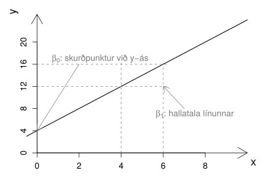
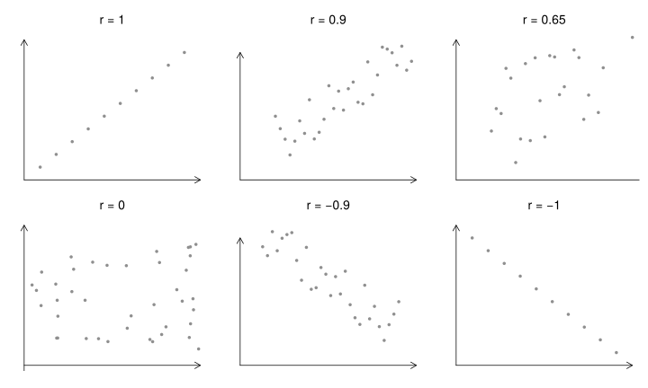

.. _c.lysanditolfraedi:

Lýsandi tölfræði
================

Eins og við sögðum í :numref:`%s <c.fratilrauntilgagna>`. kafla snýst tölfræði
um að fá sem mestar upplýsingar út úr tölulegum gögnum. Ein góð aðferð
til þess er að nota *lýsistærðir* sem eru tölur sem lýsa tilteknum
eiginleikum mælinga. Við hefjum þennan kafla á almennri umfjöllun um
lýsistærðir (kafli :numref:`%s <s.lysistaerdir>`) og kynnum þar *vísa* til
sögunnar, rithátt gerir okkur kleift að skrifa formúlur sem lýsa því
hvernig lýsistærðir eru reiknaðar.

Við munum fjalla um fjölmargar lýsistærðir sem lýsa *miðju* (kafli
:numref:`%s <s.lysistaerdfyrirmidju>`) og *breytileika*
(:numref:`%s <s.lysistaerdirfyrirdreifd>`) breyta. Þau hugtök munum við skýra
nánar þegar að þeim kemur. Að því loknu tekur við umfjöllun um
lýsistærðir sem lýsa samspili tveggja breyta. Fyrst ber að nefna
*fylgni* (kafli :numref:`%s <s.fylgni>` sem við notum til að lýsa sambandi
tveggja samfelldra breyta. Þar á eftir koma lýsistærðir sem lýsa
sambandi tveggja strjálla breyta. Fyrst fjöllum við um lýsistærðir sem
lýsa sambandi tveggja hlutfalla (kafli :numref:`%s <s.sambandhlutfalla>`) og að
því loknu fjöllum við um fjórar lýsistærðir til að lýsa
flokkunaraðferðum í kafla :numref:`%s <s.flokkunaradferdir>`. Við ljúkum
umfjöllunun okkar í kafla :numref:`%s <s.samantektumlysistaerdir>` með stuttri
samantekt á hvenær er við hæfi að nota þær lýsistærðir sem við höfum
fjallað um miðað við gerð og dreifingu breytanna sem þær lýsa.

.. _s.lysistaerdir:

Lýsistærðir
-----------

Lýsistærðir
~~~~~~~~~~~

.. _em.lysistaerd:

Lýsistærð (statistic)
^^^^^^^^^^^^^^^^^^^^^

.. attention::

    *Lýsistærð* er tala sem verður reiknuð með einhverjum ákveðnum hætti út
    frá mælingunum okkar.

--------------

Dæmi um lýsistærðir eru lýsistærðin meðaleinkunn, reiknuð út frá öllum
lokaeinkunnum. Hún gefur okkur upplýsingar um hversu vel nemandi hefur
staðið sig í skóla. Annað dæmi um lýsistærð er heildar stigafjöldi,
reiknuð út frá úrslitum leikja. Hana getum við notað til að meta hvernig
lið hefur staðið sig á Íslandsmóti.

Eins og þið sjáið eru lýsistærðir hvarvetna í umhverfi okkar, enda gefa
þær okkur miklar upplýsingar um gögnin á skýran og fljótlegan hátt. Til
eru margar gerðir lýsistærða sem lýsa ólíkum eiginleikum mælinga.
Algengustu lýsistærðirnar eru meðaltal og staðalfrávik en þið hafið
sennilega heyrt um fleiri lýsistærðir eins og til dæmis stærsta gildi,
tíðasta gildi og miðgildi.

Lýsistærðir geta bæði tekið saman mælingar á mörgum viðfangsefnum eða
margar mælingar á sama viðfangsefni. Við getum til dæmis mælt púls hjá
20 hlaupurum og reiknað meðalpúls þeirra. Við getum líka mælt púlsinn
hjá sama hlauparanum eftir 20 hlaup og reiknað meðalpúlsinn hjá þessum
tiltekna hlaupara.

Hvort sem mælingarnar eru framkvæmdar oft á sama viðfangsefni eða á
mörgum viðfangsefnum látum við :math:`n` standa fyrir fjölda þeirra
mælinga sem við erum að skoða, í litla dæminu að ofan er :math:`n=20`.
Að sama skapi er hefð fyrir því að tákna mælingarnar með bókstafnum
:math:`x`, en á bókstafinn hengjum við tölu sem kallast *vísir* sem
segir til um númer hvað hver og ein tiltekin mæling er. Ef við vitum
ekki í hvaða röð mælingarnar bárust ákveðum við af handahófi hvaða
mæling er fyrsta mælingin og hver sú síðasta.

Vísir (index)
^^^^^^^^^^^^^

.. attention::

    Gerum ráð fyrir að við höfum :math:`n` mælingar á tiltekinni breytu og
    köllum mælingarnar :math:`x_1, \ldots, x_n`. Tölurnar
    :math:`1, \ldots, n`, sem mælingarnar eru tölusettar eftir kallast
    *vísar* (e. indices) mælinganna.

--------------

.. note::

    Þannig hefur fyrsta mælingin, :math:`x_1`, vísinn einn, mæling
    :math:`x_2` hefur vísinn tvo og svo framvegis. Síðasta mælingin
    :math:`x_n` hefur vísinn :math:`n` en við getum líka talað um ótilgreind
    :math:`x_i` þar sem það er ekki ákvarðað hvert gildið á vísinum
    :math:`i` er. Þá stendur :math:`x_i` fyrir hvaða mælingu sem er.

--------------

Segjum sem svo að við höfum þrjár mælingar á efri mörkum blóðþrýstings,
121 mmHg, 110 mHg og 132 mmHg. Þá væri :math:`x_1 = 121` mmHg,
:math:`x_2=110` mmHg og :math:`x_3=132` mmHg. Við getum líka látið
vísana vísa til ákveðinna mælinga, þó að við vitum ekki hver númer
þeirra eru. Þannig látum við :math:`x_{\text{min}}` tákna minnstu
mælinguna. Hún hefur vísinn ,,min“ sem stendur einfaldlega fyrir númer
þeirrar mælingar með minnsta gildið. Að sama skapi notum við
:math:`x_{\text{max}}` til að tákna stærstu mælinguna, hvert svo sem
númer hennar er.

Ef við höfum mælingar á fleiri en einni breytu, notum við mismunandi
bókstafi til að lýsa mismunandi breytum. Þannig getum við til dæmis
verið með mælingar :math:`x_1, \ldots x_{10}` á breytunni :math:`X` og
mælingar :math:`y_1, \ldots, y_{14}` á breytunni :math:`Y`. Ef
mælingarnar á breytunum :math:`X` og :math:`Y` eru gerðar á sömu
viðfangsefnunum, þá gætum við þess að mælingar á sömu viðfangsefnunum
hljóti sama vísi. Þannig stæði :math:`x_5` og :math:`y_5` fyrir mælingar
á breytunum :math:`X` og :math:`Y` fyrir viðfangsefni númer fimm.

.. _s.lysistaerdfyrirmidju:

Lýsistærðir fyrir miðju
-----------------------

Lýsistærðir fyrir miðju
~~~~~~~~~~~~~~~~~~~~~~~

Orðið *miðja* getur haft ólíka merkingu eftir því hverju það á að lýsa.
Með miðju hrings eigum við t.d. við miðpunkt hringsins og miðja tímabils
er sá tímapunktur sem er mitt á milli upphafs og loka tímabilsins.
Hugtakið miðja er líka notað til að lýsa mælingum en ólíkt dæmunum hér á
undan er um nokkrar ólíkar leiðir að velja til að reikna miðjuna út.
Fyrst skulum við hugleiða nánar hvað við eigum við með *miðju mælinga*
(e. central tendency).

Miðja mælinga (central tendency)
^^^^^^^^^^^^^^^^^^^^^^^^^^^^^^^^

.. attention::

    Þegar við finnum *miðju* mælinga fyrir tiltekna breytu reiknum við út þá
    tölu sem er samtímis næst öllum mælingunum á breytunni okkar í
    einhverjum skilningi. Til þess eru nokkrar ólíkar aðferðir sem geta
    gefið ólíkar niðurstöður.

--------------

Oftast þyrpast flestar mælingarnar okkar í kringum miðjuna en verða
stopulli eftir því sem lengra dregur frá henni. Því getur miðja verið
mjög lýsandi fyrir mælingar. Það eru til nokkrar ólíkar aðferðir við að
reikna miðju mælinga en munur þeirra liggur í því hvaða reglu við notum
til að ákvarða hvaða tala er samtímis *næst* öllum mælingunum. Það er
háð dreifingu mælinganna hver aðferðanna lýsir miðju mælinganna best.
Sérhver þessara aðferða skilar einni tölu sem er reiknuð út frá
mælingunum með ákveðnum hætti, það er, hún reiknar tiltekna lýsistærð.
Athugið að oftar en ekki munu ólíkar lýsistærðir hljóta mismunandi
útkomur. Í þessum hluta munum við fjalla um fimm mismunandi lýsistærðir
sem allar lýsa miðju mælinga.

#) Miðja spannar (e. mid range)

#) Tíðasta gildi (e. mode)

#) Miðgildi (e. median)

#) Meðaltal (e. mean, arithmetic mean)

#) Vegið meðaltal (e. weighted mean)

Hér á eftir munum við fjalla nánar um þessar fimm gerðir lýsistærða
fyrir miðju, hverju þær lýsa og hvenær er viðeigandi að nota þær.

.. _ss.midjaspannar:

Miðja spannar
~~~~~~~~~~~~~

*Miðja spannar* er meðaltal stærstu og minnstu mælinganna. Hún er
gífurlega viðkvæm fyrir útlögum (breytist mikið eftir því hvort og hvaða
útlagar eru í mælingunum) og því ekki mikið notuð í tölfræðiúrvinnslu.
Hún getur þó verið gagnleg ef mælingarnar dreifast þétt um miðjuna.
Eingöngu er hægt að lýsa talnabreytum með miðju spannar.

Miðja spannar (mid range)
^^^^^^^^^^^^^^^^^^^^^^^^^

.. attention::

    Gerum ráð fyrir því að við höfum :math:`n` mælingar
    :math:`x_1, x_2, ... x_n`. Látum :math:`x_{\text{min}}` tákna þá minnstu
    og :math:`x_{\text{max}}` þá stærstu. *Miðja spannar* er reiknuð með
    
    .. math::
       \text{Miðja spannar} = \frac{x_{\text{min}} + x_{\text{max}}}{2}
       :label: eq.midjaspannar

--------------

Sýnidæmi: Miðja spannar
^^^^^^^^^^^^^^^^^^^^^^^

.. tip::

    Við höfum eftirfarandi mælingar: ``1, 2, 3, 5, 9, 9, 15``. Finnið miðju
    spannar.
    
    Við finnum miðju spannar með jöfnu :eq:`eq.midjaspannar`
    
    .. math:: \text{Miðja spannar} = \frac{x_{\text{min}} + x_{\text{max}}}{2} = \frac{1+15}{2} = 8

.. _ss.tidastagildi:

Tíðasta gildi
~~~~~~~~~~~~~

*Tíðasta gildið* er sú útkoma sem oftast kemur fyrir í mælingunum okkar.
Það er sú eina af lýsistærðunum fyrir miðju sem er fjallað um í þessari
bók sem er hægt er að nota til að lýsa óröðuðum flokkabreytum. Hins
vegar er ekki við hæfi að reikna tíðasta gildið þegar mældar eru
samfelldar talnabreytur.

Tíðasta gildi (mode)
^^^^^^^^^^^^^^^^^^^^

.. attention::

    Gerum ráð fyrir því að við höfum :math:`n` mælingar
    :math:`x_1, x_2, ... x_n`. *Tíðasta gildið* er sú útkoma sem oftast
    kemur fyrir í mælingunum okkar. Ef fleiri en ein tala koma jafn oft (og
    oftast) fyrir eru þær allar tíðustu gildin.

--------------

Sýnidæmi: Tíðasta gildi
^^^^^^^^^^^^^^^^^^^^^^^

.. tip::

    Við höfum eftirfarandi mælingar: ``1, 2, 2, 3, 5, 9, 9, 15``. Hvert er
    tíðasta gildið?
    
    Tíðustu gildin eru 2 og 9.

.. _ss.midgildi:

Miðgildi
~~~~~~~~

*Miðgildi* er sú mæling sem er í miðju mælisafnsins ef þeim er raðað í
stærðarröð. Helmingur mælinga í safninu eru minni en miðgildið og
helmingur er stærri. Útlagar hafa lítil sem engin áhrif á miðgildi og
einnig gefur það góða mynd af miðju mælinganna þó dreifing þeirra sé
skekkt. Miðgildi er því mikið notað til að lýsa miðju mælinga. Miðgildi
má nota til að lýsa öllum talnabreytum en einnig röðuðum flokkabreytum.

Miðgildi (median)
^^^^^^^^^^^^^^^^^

.. attention::

    Gerum ráð fyrir því að við höfum :math:`n` mælingar
    :math:`x_1, x_2, ... x_n`. Byrjum á að raða þessum mælingum upp í
    stærðarröð, frá minnsta gildi upp í stærsta gildið. Reiknum svo
    
    .. math::
       \text{Sæti í röð} = 0.5 \cdot (n+1)
       :label: eq.midgildi
    
    Miðgildi er oft táknað með :math:`M`. Það fer eftir því hvort :math:`n`
    sé oddatala eða slétt tala hvernig við reiknum út miðgildið.
    
    -  Ef :math:`n` er oddatala þá er miðgildið staðsett í sæti
       :math:`0.5\cdot(n+1)` í röðinni.
    
    -  Ef :math:`n` er slétt tala þá er miðgildið meðaltalið af þeim tveimur
       mælingum sem standa við sæti :math:`0.5\cdot(n+1)` í röðinni.
    
    VARÚÐ: :math:`0.5\cdot(n+1)` er númerið á sætinu í röðinni, ekki
    miðgildið sjálft!

--------------

Sýnidæmi: Miðgildi - :math:`n` er oddatala
^^^^^^^^^^^^^^^^^^^^^^^^^^^^^^^^^^^^^^^^^^

.. tip::

    Við höfum eftirfarandi mælingar: ``1, 2, 3, 5, 9, 9, 15``. Finnið
    miðgildið.
    
    Mælingarnar eru í réttri röð, þ.e.a.s. frá lægsta gildi og upp í hæsta
    gildi. Við reiknum út sæti í röð með jöfnu :eq:`eq.midgildi`.
    
    .. math:: \text{Sæti í röð} = 0.5\cdot (n+1) = 0.5\cdot 8 = 4
    
    og þá fæst að miðgildið stendur í sæti númer 4. Miðgildið er því,
    :math:`M` = 5.

Sýnidæmi: Miðgildi - :math:`n` er slétt tala
^^^^^^^^^^^^^^^^^^^^^^^^^^^^^^^^^^^^^^^^^^^^

.. tip::

    Við höfum eftirfarandi mælingar: ``1, 2, 3, 5, 9, 9, 15, 17``. Finnið
    miðgildið.
    
    Mælingarnar eru í réttri röð, þ.e.a.s. frá lægsta gildi og upp í hæsta
    gildi. Við reiknum út sæti í röð með jöfnu :eq:`eq.midgildi`.
    
    .. math:: \text{Sæti í röð} = 0.5 \cdot (n+1) = 0.5 \cdot 9 = 4.5
    
    miðgildið er því meðaltalið af tölunum sem standa í 4. og 5. sæti.
    Miðgildið er því, :math:`M` = :math:`\frac{5+9}{2}` = 7.

.. _ss.medaltal:

Meðaltal
~~~~~~~~

Meðaltal er án vafa algengasta lýsistærðin fyrir miðju mælinga. Þó er
það viðkvæmt fyrir útlögum og einnig gefur það ekki rétta mynd af miðju
mælinganna ef dreifing þeirra er skekkt. Meðaltal er eingöngu hægt að
reikna fyrir talnabreytur.

Meðaltal (mean, arithmetic mean)
^^^^^^^^^^^^^^^^^^^^^^^^^^^^^^^^

.. attention::

    Gerum ráð fyrir því að við höfum :math:`n` mælingar
    :math:`x_1, x_2, ... x_n`. *Meðaltalið* fæst með því að leggja
    mælingarnar saman og deila í með fjölda mælinga.
    
    .. math::
       \bar{x} = \frac{x_1 + x_2 + ... x_n}{n} = \frac{\sum_{i=1}^{n} x_i}{n}
       :label: eq.medaltal

--------------

.. note::

    Táknið :math:`\sum` kallast summutákn og er notað til að lýsa summu
    talna. Sem dæmi má nefna er :math:`\sum_{i=1}^{3} x_i` það sama og
    :math:`x_1 + x_2 + x_3`. Stærðin :math:`\sum_{i=1}^{n} x_i` táknar summu
    allra mælinga :math:`x_i` með ótilgreindan vísi :math:`i`, sem tekur
    fyrst gildið 1 þá 2 og svo öll heiltölugildi upp í :math:`n`. Það er,
    :math:`\sum_{i=1}^{n} x_i` er það sama og
    :math:`x_1 + x_2 + \cdots + x_n`.

--------------

Sýnidæmi: Summutákn og vísar
^^^^^^^^^^^^^^^^^^^^^^^^^^^^

.. tip::

    Finnið :math:`\sum_{i=4}^{7} x_i`.
    
    :math:`\sum_{i=4}^{7} x_i = x_4 + x_5 + x_6 + x_7`.

Sýnidæmi: Meðaltal
^^^^^^^^^^^^^^^^^^

.. tip::

    Við höfum eftirfarandi mælingar: ``1, 2, 3, 5, 9, 9, 15``. Finnið
    meðaltal mælinganna.
    
    Við notum jöfnu :eq:`eq.medaltal` og reiknum
    
    .. math:: \bar{x} = \frac{\sum_{i=1}^{n} x_i}{n} = \frac{1 + 2 + 3 + 5 + 9 + 9 + 15}{7} = \frac{44}{7} = 6.29

.. _ss.vegidmedaltal:

Vegið meðaltal
~~~~~~~~~~~~~~

Þegar meðaltal er reiknað eins og hér að ofan, með jöfnu
:eq:`eq.medaltal`, fá allar mælingarnar sama vægi. Í sumum tilfellum
viljum við gefa mælingunum misjafnt vægi, þá er talað um *vegið
meðaltal*. Vegið meðaltal er eingöngu reiknað fyrir talnabreytur.

Vegið meðaltal (weighted mean)
^^^^^^^^^^^^^^^^^^^^^^^^^^^^^^

.. attention::

    Gerum ráð fyrir því að við höfum :math:`n` mælingar
    :math:`x_1, x_2, ... x_n` og vægi þeirra :math:`w_1, w_2, ... w_n`.
    Vegið meðaltal er reiknað sem
    
    .. math::
       \bar{x}_w = \frac{w_1 \cdot x_1 + w_2 \cdot x_2 + ... w_n \cdot x_n}{w_1 + w_2 + ... + w_n}
       = \frac{\sum_{i=1}^{n} w_i \cdot x_i}{\sum_{i=1}^{n} w_i}
       :label: eq.vegidmedaltal

--------------

Sýnidæmi: Vegið meðaltal
^^^^^^^^^^^^^^^^^^^^^^^^

.. tip::

    Gunnar landfræðinemi hefur lokið eftirfarandi námskeiðum og hlotið
    einkunnirnar sem sjá má hér að neðan. Einnig er tekið fram hversu margar
    einingar námskeiðin eru.
    
    +------------------------------------------+-----------+-----------------+
    | Námskeið                                 | Einkunn   | Einingafjöldi   |
    +==========================================+===========+=================+
    | Náttúrulandfræði                         | 7         | 8               |
    +------------------------------------------+-----------+-----------------+
    | Kortagerð                                | 9         | 8               |
    +------------------------------------------+-----------+-----------------+
    | Mannvistarlandfræði                      | 7         | 8               |
    +------------------------------------------+-----------+-----------------+
    | Vinnulag í landfræði og ferðamálafræði   | 8         | 6               |
    +------------------------------------------+-----------+-----------------+
    | Eðlisfræði G                             | 6         | 8               |
    +------------------------------------------+-----------+-----------------+
    | Jarðfræði 2A                             | 9         | 8               |
    +------------------------------------------+-----------+-----------------+
    | Fólksfjöldabreytingar                    | 9         | 6               |
    +------------------------------------------+-----------+-----------------+
    | Tölfræði                                 | 10        | 8               |
    +------------------------------------------+-----------+-----------------+
    
    Hver er meðaleinkunn Gunnars landfræðinema ef tekið er tillit til
    mismunandi einingafjölda námskeiðanna, þ.e.a.s. hver er vegin
    meðaleinkunn Gunnars landfræðinema?
    
    Til að reikna út vegið meðaltal einkunnanna notum við jöfnu
    :eq:`eq.vegidmedaltal`. :math:`x`-in í jöfnunni eru einkunnirnar og
    :math:`w`-in vægin (við viljum gefa einkunnunum misjafnt vægi eftir því
    hversu margar einingar námskeiðin eru). Við setjum inn í jöfnuna og fáum
    
    .. math:: \bar{x}_w = \frac{\sum_{i=1}^{n} w_i \cdot x_i}{\sum_{i=1}^{n} w_i} = \frac{8\cdot7+8\cdot9+8\cdot7+6\cdot8+8\cdot6+8\cdot9+6\cdot9+8\cdot10}{8+8+8+6+8+8+6+8} = 8.10

.. _s.samanburduralysistaerdumfyrirmidju:

Samanburður á meðaltali og miðgildi
~~~~~~~~~~~~~~~~~~~~~~~~~~~~~~~~~~~

Meðaltal og miðgildi eru þær lýsistærðir sem oftast eru notaðar til að
lýsa miðju gagna. Það er gagnlegt að skoða gögnin myndrænt og reyna að
átta sig á dreifingu gagnanna (sjá kafla :numref:`%s <ss.logundreifinga>`) áður
en ákvörðun er tekin um hvaða lýsistærð lýsir miðju gagnanna best. Sé
dreifingin skekkt, tvíkryppu- eða fjölkryppudreifing er meðaltal ekki
góður mælikvarði á miðju. Í þessum tilvikum er miðgildið betri kostur.
Sé dreifingin nálægt því að vera samhverf eru meðaltalið og miðgildið
svipuð og jöfn ef dreifingin er alveg samhverf.

Samanburður á meðaltali og miðgildi
^^^^^^^^^^^^^^^^^^^^^^^^^^^^^^^^^^^

.. attention::

    -  Ef dreifingin er skekkt til hægri er meðaltalið hærra en miðgildið.
    
    -  Ef dreifingin er samhverf er meðaltalið og miðgildið það sama.
    
    -  Ef dreifingin er skekkt til vinstri er meðaltalið lægra en miðgildið.
    
    Þetta má sjá á mynd :numref:`%s <g.medaltalmidgildi>`

--------------

.. _g.medaltalmidgildi:

.. figure:: myndir/medaltal_midgildi.svg
    :align: center
    :alt: Samanburður á meðaltali og miðgildi 

    Samanburður á meðaltali og miðgildi 

Útlagar geta haft mikil áhrif á meðaltal. Hins vegar hafa þeir ekki
mikil áhrif á miðgildi og því er miðgildi betri mælikvarði á miðju gagna
ef útlagar eru í gagnasafninu. Hér að neðan má sjá stuðlarit af
gagnasafni sem inniheldur útlaga. Við hlið stuðlaritsins hefur meðaltal
og miðgildi safnsins verið reiknað með og án útlagans. Sjá má að
meðaltalið stækkar um 1.35 á meðan miðgildið stækkar eingöngu um 0.03.

+---------------------------------------------------------------------------------------------------------------------------------------------------------------------------------------------------------------------------------------------------------------------------------------------------------------------------------------------+------------------------------------------------------------------------------------------------------------------------------------------------------------------------------------+ 
|    .. image:: myndir/utlagi2.svg                                                                                                                                                                                                                                                                                                            |                                                                                                                                                                                    | 
|       :width: 200%                                                                                                                                                                                                                                                                                                                          |    :math:`\begin{array}{c}\text{Meðaltal með útlaga} = 2.77\\ \text{Meðaltal án útlaga} = 1.42\\ \text{Miðgildi með útlaga} = 1.79\\ \text{Miðgildi án útlaga} = 1.76 \end{array}` | 
+---------------------------------------------------------------------------------------------------------------------------------------------------------------------------------------------------------------------------------------------------------------------------------------------------------------------------------------------+------------------------------------------------------------------------------------------------------------------------------------------------------------------------------------+ 

.. _s.lysistaerdirfyrirdreifd:

Lýsistærðir fyrir breytileika
-----------------------------

Lýsistærðir fyrir breytileika
~~~~~~~~~~~~~~~~~~~~~~~~~~~~~

Þið hafið nú séð nokkrar ólíkar aðferðir til að finna miðju mælinga.
Valið á hverri þeirra við beitum veltur á dreifingu gagnanna. Annar
áhugaverður og oft og tíðum ekki síður mikilvægur eiginleiki sem við
viljum kanna er *breytileiki* gagnanna en breytileiki er sá eiginleiki
sem hvað mest er notaður til að meta breytileika mælinganna sem við erum
að skoða.

Breytileiki mælinga (spread)
^^^^^^^^^^^^^^^^^^^^^^^^^^^^

.. attention::

    *Breytileiki mælinga* er aðferð sem lýsir því hversu nálægt miðju sinni
    mælingarnar liggja.

--------------

Það eru til margar aðferðir til að lýsa breytileika mælinga sem henta
mælingum misvel, líkt og aðferðirnar sem lýsa miðju mælinga. Þar sem
breytileiki lýsir því hversu nálægt miðjunni mælingarnar liggja er val á
lýsistærð fyrir breytileika háð því hvaða lýsistærð er notuð fyrir miðju
mælinganna. Til dæmis er ekki við hæfi að nota lýsistærð sem lýsir
fjarlægð mælinga frá meðaltali ef miðgildi var notað til lýsa miðju
þeirra. Þær lýsistærðir sem við munum fjalla um eru

#) Spönn/dreifisvið (e. range)

#) Fjórðungamörk (e. quartiles)

#) Fimm tölu samantekt (e. five number summary)

#) Fjórðungaspönn (e. interquartile range)

#) Prósentumörk (e. percentiles)

#) Dreifni/fervik (e. variance)

#) Staðalfrávik (e. standard deviation)

#) Frávikshlutfall (e. coefficient of variation)

.. _ss.sponn:

Spönn
~~~~~

Spönn er mismunur stærstu og minnstu mælingarinnar. Hún er því mjög
viðkvæm fyrir útlögum og þar að auki er hún eingöngu reiknuð út frá
tveimur af mælingunum okkar. Gildi allra hinna mælingana skipta engu!
Spönn verður því að teljast heldur rýr mælikvarði á breytileika mælinga,
líkt og miðja spannar getur verið ófýsilegur mælikvarði á miðju mælinga.
Hins vegar er spönn auðskiljanleg flestu fólki sama hve litla
tölfræðiþekkingu það hefur og þannig má nota hana til að gefa breiðum
hópi fólks mynd af dreifingu mælinga með fljótlegum hætti. Af þeim sökum
er spönn afar mikið notuð í fjölmiðlum, eins og að tveimur tímum hafi
munað á fyrsta og síðasta keppanda í langhlaupi. Spönn má reikna fyrir
allar talnabreytur en einnig raðaðar flokkabreytur.

Spönn (range)
^^^^^^^^^^^^^

.. attention::

    Gerum ráð fyrir að við höfum :math:`n` mælingar
    :math:`x_1, x_2, ... x_n` og látum :math:`x_{\text{min}}` tákna þá
    minnstu og :math:`x_{\text{max}}` þá stærstu. *Spönn* gagnanna er
    reiknuð með
    
    .. math::
       \text{Spönn} = x_{\text{max}} - x_{\text{min}}
       :label: eq.sponn

--------------

Sýnidæmi: Spönn
^^^^^^^^^^^^^^^

.. tip::

    Höfum eftirfarandi mælingar: ``1, 2, 3, 5, 9, 9, 15.`` Reiknið spönn
    mælinganna.
    
    Við reiknum spönn gagnanna með jöfnu :eq:`eq.sponn` og fáum
    
    .. math:: \text{Spönn} = x_{\text{max}} - x_{\text{min}} = 15 - 1 = 14

.. _ss.fjordungsmork:

Fjórðungamörk
~~~~~~~~~~~~~

Sé miðgildi notað til að lýsa miðju mælinga er yfirleitt við hæfi að
nota *fjórðungamörk* til að lýsa breytileika þeira. Fjórðungamörkin eru
þrjú og er algengt að kalla þau, :math:`Q_1, Q_2` og :math:`Q_3`. Í
sumum kennslubókum og ritum eru fjórðungamörkin kölluð
:math:`Q_{25\%}, Q_{50\%}` og :math:`Q_{75\%}`. Við munum halda okkur
við fyrri ritháttinn í þessari bók.

    | :math:`Q_1`: Um fyrsta fjórðungamarkið gildir að 25% af mælingunum eru lægri en :math:`Q_1`.
    |       :math:`Q_1` er því miðgildi neðri helmings mælinganna, að undanskildu miðgildinu.

    | :math:`Q_2`: Um annað fjórðungamarkið gildir að 50% af mælingunum eru lægri en :math:`Q_2`.
    |       :math:`Q_2` er því miðgildið , :math:`Q_2 = M`.

    | :math:`Q_3`: Um þriðja fjórðungamarkið gildir að 75% af mælingunum eru lægri en :math:`Q_3`.
    |       :math:`Q_3` er því miðgildi efri helmings mælinganna, að undanskildu miðgildinu.

Til eru nokkrar aðferðir við að reikna fjórðungamörk en við munum halda
okkur við eftirfarandi aðferð þegar við reiknum fjórðungamörkin í
höndunum. Tölfræðihugbúnaðir nota oft aðeins flóknari aðferðir en
niðurstöðurnar eru yfirleitt mjög svipaðar. Fjórðungamörk má reikna
fyrir allar talnabreytur sem og raðaðar flokkabreytur.

Fjórðungamörk (quartiles)
^^^^^^^^^^^^^^^^^^^^^^^^^

.. attention::

    Gerum ráð fyrir að við höfum :math:`n` mælingar
    :math:`x_1, x_2, ... x_n`. Byrjum á að raða mælingum upp í stærðarröð,
    frá lægsta gildinu upp í hæsta gildið. Reiknum svo
    
    .. math::
       \begin{aligned}
       \text{$Q_1$ - sæti í röð:} &= 0.25 \cdot (n+1) \\
       \text{$Q_2$ - sæti í röð:} &= 0.50 \cdot  (n+1)\\
       \text{$Q_3$ - sæti í röð:} &= 0.75 \cdot (n+1) \end{aligned}
       :label: eq.fjordungsmork
    
    -  :math:`Q_1` er mælingin sem stendur í sæti :math:`0.25\cdot(n+1)` eða
       meðaltalið af þeim tveimur mælingum sem standa við sæti
       :math:`0.25 \cdot (n+1)` í röðinni.
    
    -  :math:`Q_2` er mælingin sem stendur í sæti :math:`0.50\cdot(n+1)` eða
       meðaltalið af þeim tveimur mælingum sem standa við sæti
       :math:`0.50 \cdot (n+1)` í röðinni.
    
    -  :math:`Q_3` er mælingin sem stendur í sæti :math:`0.75\cdot(n+1)` eða
       meðaltalið af þeim tveimur mælingum sem standa við sæti
       :math:`0.75 \cdot (n+1)` í röðinni.

--------------

.. _ex.fjordungsmork:

Sýnidæmi: Fjórðungamörk
^^^^^^^^^^^^^^^^^^^^^^^

.. tip::

    Við höfum eftirfarandi mælingar: ``1, 2, 3, 5, 9, 9, 15, 17``. Finnið
    fjórðungamörk mælinganna.
    
    Mælingarnar eru í réttri röð, þ.e.a.s. frá lægsta gildi og upp í hæsta
    gildi. Við byrjum því á að reikna í hvaða sæti gildin sem við þurfum til
    að reikna fjórðungamörkin sitja í. Til þess notum við jöfnu
    :eq:`eq.fjordungsmork`:
    
    .. math::
       \begin{aligned}
       \text{$Q_1$ - sæti í röð: } 0.25 \cdot (n+1) &=& 0.25 \cdot 9 = 2.25 \\
       \text{$Q_2$ - sæti í röð: } 0.50 \cdot (n+1) &=& 0.50 \cdot 9 = 4.50 \\
       \text{$Q_3$ - sæti í röð: } 0.75 \cdot (n+1) &=& 0.75 \cdot 9 = 6.75 \\\end{aligned}
    
    Þá fæst að :math:`Q_1` er meðaltal gildanna sem standa í sætum 2 og 3.
    Tölurnar sem standa í sætum 2 og 3 eru 2 og 3 og við fáum
    
    .. math:: Q_1 = \frac{2+3}{2} = 2.5
    
    :math:`Q_2` er meðaltal gildanna sem standa í sætum 4 og 5. Tölurnar sem
    standa í sætum 4 og 5 eru 5 og 9 og við fáum
    
    .. math:: Q_2 = \frac{5+9}{2} = 7
    
    :math:`Q_3` er meðaltal gildanna sem standa í sætum 6 og 7. Tölurnar sem
    standa í sætum 6 og 7 eru 9 og 15 og við fáum
    
    .. math:: Q_3 = \frac{9+15}{2} = 12

.. _ss.fimmtolusamantekt:

Fimm tölu samantekt
~~~~~~~~~~~~~~~~~~~

Fimm tölu samantekt er afar hnitmiðuð og fljótleg leið til að gefa
miklar upplýsingar um bæði miðju og breytileika gagnanna. Fyrir vikið er
hún mikið notuð.

Fimm tölu samantekt (five-number summary)
^^^^^^^^^^^^^^^^^^^^^^^^^^^^^^^^^^^^^^^^^

.. attention::

    *Fimm-tölu samantekt* samanstendur af minnsta gildi (e. min),
    fjórðungamörkunum og stærsta gildi (e. max), þ.e.a.s.
    
    .. math:: \text{min}, \ Q_1, \ Q_2, \ Q_3, \ \text{max}

--------------

Sýnidæmi: Fimm tölu samantekt
^^^^^^^^^^^^^^^^^^^^^^^^^^^^^

.. tip::

    Höfum eftirfarandi mælingar: ``1, 2, 3, 5, 9, 9, 15, 17``. Við fundum
    fjórðungamörkin í dæmi :numref:`%s <ex.fjordungsmork>` og er þau:
    :math:`Q_1 = 2.5`, :math:`Q_2 = 7` og :math:`Q_3 = 12`.
    
    Fimm-tölu samantekt gagnasafnsins er því:
    
    .. math:: \text{min} = 1, \ Q_1 = 2.5, \ Q_2 = 7, \ Q_3 = 12 \ \text{og max} = 17

.. _ss.fjordungasponn:

Fjórðungaspönn
~~~~~~~~~~~~~~

*Fjórðungaspönn* er reiknuð út frá fjórðungamörkunum, nánar til tekið
mismunur fyrsta og þriðja fjórðungamarksins. Líkt og fjórðungamörkin
ætti því að nota hana þegar miðgildi en ekki meðaltal er notað til að
lýsa miðju mælinganna. Ólíkt spönn er fjórðungaspönn ekki viðkvæm fyrir
útlögum og því mun áreiðanlegri mælikvarði á breytileika mælinga.
Fjórðungaspönn er eingöngu við hæfi að reikna fyrir talnabreytur en ekki
raðar flokkabreytur.

Fjórðungaspönn (interquartile range)
^^^^^^^^^^^^^^^^^^^^^^^^^^^^^^^^^^^^

.. attention::

    Gerum ráð fyrir að við höfum :math:`n` mælingar
    :math:`x_1, x_2, ... x_n` og látum :math:`Q_1` tákna fyrsta
    fjórðungamark og :math:`Q_3` þriðja fjórðungamark. *Fjórðungaspönn*
    gagnanna er táknuð með :math:`IQR` og reiknuð með
    
    .. math::
       IQR = Q_3 - Q_1
       :label: eq.fjordungssponn

--------------

Sýnidæmi: Fjórðungaspönn
^^^^^^^^^^^^^^^^^^^^^^^^

.. tip::

    Höfum eftirfarandi mælingar: ``1, 2, 3, 5, 9, 9, 15, 17``. Finnið
    fjórðungaspönn mælinganna.
    
    Við sáum í dæmi :numref:`%s <ex.fjordungsmork>` að :math:`Q_1 = 2.5` og
    :math:`Q_3 = 12`. Við notum nú jöfnu :eq:`eq.fjordungssponn` til að
    finna fjórðungaspönn gagnanna:
    
    .. math:: IQR = 12-2.5 = 9.5

.. _ss.prosentumork:

Prósentumörk
~~~~~~~~~~~~

Hugmyndin að baki *prósentumörkum* (e. percentiles) er svipuð og sú að baki
fjórðungamörkum nema í stað þess að skoða eingöngu mörkin við 25% eða
75% mælinganna getum við leyft hvaða hlutfall sem er.

.. _em.prosentumork:

Prósentumörk (percentile)
^^^^^^^^^^^^^^^^^^^^^^^^^

.. attention::

    Með :math:`a\%` prósentumörkum er átt við þá tölu sem er þannig að
    :math:`a\%` mælinganna hafa lægra gildi en sú tala.

--------------

Með 10% prósentumörkum er þá átt við þá tölu sem er þannig að 10%
mælinganna hafa lægra gildi en sú tala. Sé til dæmis 10% prósentumarkið
talan 8 þá eru 10% mælinganna lægri en 8. Líkt og með fjórðungamörkin
eru nokkrar ólíkar leiðir til þess að reikna prósentumörk og er það nær
aldrei gert ,,í höndunum“ heldur er notast við tölfræðihugbúnað.
Prósentumörk má reikna fyrir talnabreytur sem og raðaðar flokkabreytur.

.. _ss.dreifni:

Dreifni
~~~~~~~

*Dreifni* lýsir fjarlægð mælinga frá meðaltali þeirra. Því er eingöngu
við hæfi að nota dreifni sem mælikvarða á breytileika þegar meðaltal
hefur verið notað til að lýsa miðju mælinganna. Þar af leiðandi er
eingöngu hægt að reikna dreifni fyrir talnabreytur.

Dreifni (variance)
^^^^^^^^^^^^^^^^^^

.. attention::

    Gerum ráð fyrir að við höfum :math:`n` mælingar
    :math:`x_1, x_2, ... x_n`. Dreifni mælinga er táknuð :math:`s^2` og er
    reiknuð með
    
    .. math::
       s^2 = \frac{\sum_{i=1}^{n}(x_i - \bar{x})^2}{n-1}
       :label: eq.dreifni
    
    :math:`s^2` = 0 þá og því aðeins að allar mælingarnar séu jafnar, annars
    er :math:`s^2` ávallt stærra en 0. Því lengra sem mælingarnar liggja frá
    meðaltalinu því hærra verður :math:`s^2`.

--------------

.. note::

    Til að reikna *dreifni* þurfum við að:
    
    #) Reikna meðaltal mælinganna
    
    #) Draga meðaltalið frá sérhverri mælingu
    
    #) Hefja allar útkomurnar úr lið 2 í annað veldi
    
    #) Leggja saman allar útkomurnar í lið 3
    
    #) Deila útkomunni í lið 4 með :math:`n`-1.

--------------

.. _ex.dreifni:

Sýnidæmi: Dreifni
^^^^^^^^^^^^^^^^^

.. tip::

    Höfum eftirfarandi mælingar: ``2, 2, 3, 5, 8``. Finnið dreifni
    mælisafnsins.
    
    Við byrjum á að finna meðaltalið og notum til þess jöfnu
    :eq:`eq.medaltal`
    
    .. math:: \bar{x} = \frac{2 + 2 + 3 + 5 + 8}{5} = \frac{20}{5} = 4
    
    Gerum nú litla töflu. Fyrsti dálkurinn í töflunni inniheldur gögnin. Í
    dálki tvö er meðaltal gagnasafnsins dregið frá mælingunum línu fyrir
    línu. Í þriðja dálknum er talan í dálki númer tvö hafin í annað veldi og
    í síðustu línu dálksins eru allar tölur dálksins lagðar saman. Þetta er
    talan í teljaranum í jöfnu :eq:`eq.dreifni`.
    
    +---------------+-------------------------+-----------------------------+
    | :math:`x_i`   | :math:`x_i - \bar{x}`   | :math:`(x_i - \bar{x})^2`   |
    +===============+=========================+=============================+
    |   2           |   2-4 = -2              | 4                           |
    +---------------+-------------------------+-----------------------------+
    |   2           |   2-4 = -2              | 4                           |
    +---------------+-------------------------+-----------------------------+
    |   3           |   3-4 = -1              | 1                           |
    +---------------+-------------------------+-----------------------------+
    |   5           |   5-4 = 1               | 1                           |
    +---------------+-------------------------+-----------------------------+
    |   8           |   8-4 = 4               | 16                          |
    +---------------+-------------------------+-----------------------------+
    
    .. math:: \sum_{i=1}^{n}(x_i - \bar{x})^2 = 26
    
    Til að reikna dreifnina þurfum við að lokum að deila með :math:`(n-1)`
    samkvæmt jöfnu :eq:`eq.dreifni`.
    
    .. math:: s^2 = \frac{\sum_{i=1}^{n}(x_i - \bar{x})^2}{n-1} = \frac{26}{4} = 6.5

.. _ss.stadalfravik:

Staðalfrávik
~~~~~~~~~~~~

*Staðalfrávik* mælinga er einfaldlega kvaðratrótin af dreifni þeirra.
Því ætti, líkt og með dreifnina, eingöngu að nota staðalfrávik þegar
meðaltal er notað til að lýsa miðju gagna. Því má eingöngu reikna
staðalfrávik fyrir talnabreytur. Staðalfrávik er sennilega mest notaða
lýsistærðin fyrir breytileika mælinga og því mikilvægt að ná góðum tökum
og skilningi á meðferð hennar.

Staðalfrávik (standard deviation)
^^^^^^^^^^^^^^^^^^^^^^^^^^^^^^^^^

.. attention::

    Gerum ráð fyrir að við höfum :math:`n` mælingar
    :math:`x_1, x_2, ... x_n`. Staðalfrávik mælinga er táknað með :math:`s`
    og er reiknað með
    
    .. math::
       s = \sqrt{\frac{\sum_{i=1}^{n}(x_i - \bar{x})^2}{n-1}}
       :label: eq.stadalfravik
    
    :math:`s` = 0 þá og því aðeins að allar mælingarnar eru jafnar, annars
    er :math:`s` ávallt stærra en 0. Því lengra sem mælingarnar liggja frá
    meðaltalinu því hærra verður :math:`s`.

--------------

.. note::

    Til að reikna *staðalfrávik* þurfum við að:
    
    #) Reikna dreifnina með því að nota jöfnu :eq:`eq.dreifni`
    
    #) Taka kvaðratrót af dreifninni

--------------

Sýnidæmi: Staðalfrávik
^^^^^^^^^^^^^^^^^^^^^^

.. tip::

    Höfum eftirfarandi mælingar: ``2, 2, 3, 5, 8``. Finnið staðalfrávik
    mælisafnsins.
    
    Við þurfum að byrja á að finna dreifni mælisafnsins en þar sem þetta eru
    sömu tölur og í dæmi :numref:`%s <ex.dreifni>` höfum við nú þegar reiknað hana,
    :math:`s^2 = 6.5`. Staðalfrávikið finnum við nú með því að taka
    kvaðratrót af dreifninni skv. jöfnu :eq:`eq.stadalfravik`.
    
    .. math:: s = \sqrt{s^2} = \sqrt{6.5} = 2.55

.. _ss.fravikshlutfall:

Frávikshlutfall
~~~~~~~~~~~~~~~

Það er oft erfitt að bera saman staðalfrávik gagna þegar mælingarnar eru
í misjöfnum mælieiningum eða meðaltal þeirra er mjög frábrugðið. Í þeim
tilvikum reiknum við frávikshlutfall til að bera saman breytileika
tveggja eða fleiri hópa. Það er táknað með :math:`CV`.

Frávikshlutfall (coefficient of variation)
^^^^^^^^^^^^^^^^^^^^^^^^^^^^^^^^^^^^^^^^^^

.. attention::

    *Frávikshlutfall* reiknum við með
    
    .. math:: CV = \frac{s}{\bar{x}}
    
    Eftir því sem :math:`CV` er hærra því breytilegri eru gögnin.

--------------

.. _s.samanburduralysistaerdumfyrirdreifd:

Samanburður á lýsistærðum fyrir breytileika
~~~~~~~~~~~~~~~~~~~~~~~~~~~~~~~~~~~~~~~~~~~

Dreifni og staðalfrávik eru notuð til að lýsa breytileika mælinganna
umhverfis meðaltalið og á aðeins að nota þegar meðaltal er notað sem
mælikvarði á miðju. Staðalfrávik er yfirleitt notað fram yfir dreifni
þar sem mælieiningin á staðalfrávikinu er sú sama og á mælingunum
(hugsið ykkur að ef mælingarnar okkar eru í metrum, :math:`m`, þá er
staðalfrávikið í einingunni :math:`m` en dreifnin í :math:`m^2`).
Staðalfrávik er viðkvæmt fyrir skekkingu og útlögum. Aðeins fáir útlagar
geta gert staðalfrávikið mjög hátt. Séu mælingarnar skekktar eða ef
útlagar eru til staðar er fimm tölu samantekt besti mælikvarðinn á
breytileika gagnanna.

.. _s.fylgni:

Fylgnistuðull
-------------

Við höfum nú séð fjölmargar leiðir til að lýsa miðju og breytileika
einstakra samfelldra talnabreyta. Nú er komið að því að skoða fleira en
eina breytu í einu. *Fylgnistuðull úrtaks* eða einfaldlega *fylgni* er
lýsistærð sem lýsir sambandi tveggja samfelldra talnabreyta.
Fylgnistuðul getum við eingöngu notað til að lýsa *línulegu sambandi*
(kassi :numref:`%s <em.linulegtsamband>`). Til að átta okkur á því skulum við
fyrst rifja upp jöfnu beinnar línu.

.. _ss.jafnabeinnarlinu:

Jafna beinnar línu
~~~~~~~~~~~~~~~~~~

.. _em.jafnabeinnarlinu:

Jafna beinnar línu (straight line equation)
^^^^^^^^^^^^^^^^^^^^^^^^^^^^^^^^^^^^^^^^^^^

.. attention::

    Jafna beinnar línu lýsir línulegu sambandi tveggja breyta, :math:`y` og
    :math:`x`. Jöfnuna má skrifa sem
    
    .. math::
       y =  \beta_0 +  \beta_1x
       :label: eq.jafnabeinnarlinu
    
    þar sem :math:`\beta_0` er *skurðpunktur* (e. intercept) línunnar við y-ás
    og :math:`\beta_1` er *hallatala* (e. slope) línunnar.

--------------

.. note::

    :math:`\beta_0` er því jafnt gildinu á :math:`y` þegar gildið á
    :math:`x` er jafnt og núll og :math:`\beta_1` segir okkur hversu mikið
    :math:`y` breytist við einnar einingar breytingu á :math:`x`.
    
    Reikna má út hallatöluna með því að velja sér tvo punkta á línunni,
    :math:`(x_1,y_1)` og (:math:`x_2,y_2`) og reikna
    
    .. math:: \beta_1 = \frac{y_2-y_1}{x_2-x_1}

--------------

Á mynd :numref:`%s <g.jafnabeinnarlinu>` má sjá beina línu og hvernig lesa má úr
gildi skurðpunkts og hallatölu línunnar.

.. _g.jafnabeinnarlinu:

    Jafna beinnar línu 

.. _em.linulegtsamband:

Línulegt samband
^^^^^^^^^^^^^^^^

.. attention::

    Við segjum að samband tveggja breyta sé *línulegt* (e. linear) ef nota má
    jöfnu beinnar línu til spá fyrir um gildi annarrar breytunnar breytunnar
    út frá gildi hinnar. Breytan á :math:`x`-ás kallast óháða breytan en
    breytan á :math:`y`- ás kallast háða breytan.

--------------

.. _ss.fylgnistudull:

Fylgnistuðull úrtaks
~~~~~~~~~~~~~~~~~~~~

.. _em.fylgnistudull:

Fylgnistuðull úrtaks (sample coefficient of correlation)
^^^^^^^^^^^^^^^^^^^^^^^^^^^^^^^^^^^^^^^^^^^^^^^^^^^^^^^^

.. attention::

    Gerum ráð fyrir að við höfum :math:`n` mælingar á tveimur breytum
    :math:`x` og :math:`y`. Táknum meðaltal og staðalfrávik :math:`x`
    breytunnar með :math:`\bar{x}` og :math:`s_{x}` og meðaltal og
    staðalfrávik :math:`y` breytunnar með :math:`\bar{y}` og :math:`s_{y}`.
    Fylgnistuðul úrtaksins reiknum við með
    
    .. math:: r = \frac{1}{n-1} \sum_{i=1}^n \left( \frac{x_i - \bar{x}}{s_x}\right) \left( \frac{y_i - \bar{y}}{s_y}\right)

--------------

Fylgnistuðullinn :math:`r` er alltaf á bilinu -1 til 1. Sé hann nálægt
núlli segjum við að það sé lítil fylgni milli breytanna en sé hann
nálægt 1 eða -1 segjum við að það sé mikil fylgni milli þeirra.

Mikilvægt er að muna að fylgni og fylgnistuðull eru aðeins mælikvarðar á
**línulegt** samband. Það getur verið skýrt samband á milli tveggja
breyta þó það sé ekki endilega línulegt. Skoðum nú aftur mynd
:numref:`%s <g.punktaritstefna>`. Eðlilegt væri að nota :math:`r` til að mæla
samband breytanna á efri myndunum tveimur þar sem um er að ræða línulegt
samband (jákvætt til vinstri en neikvætt til hægri) en ekki á myndunum
fyrir neðan þar sem sambandið er ólínulegt.

.. _g.punktaritstefna:

.. figure:: myndir/xy1.svg
    :align: center
    :alt: Punktarit þar sem samband breyta er línulegt (að ofan) og ólínulegt (að neðan) 

    Punktarit þar sem samband breyta er línulegt (að ofan) og ólínulegt (að neðan) 

Stefna og styrkleiki línulegs sambands
~~~~~~~~~~~~~~~~~~~~~~~~~~~~~~~~~~~~~~

Stefna línulegs sambands
^^^^^^^^^^^^^^^^^^^^^^^^

.. attention::

    Formerki fylgnistuðulsins segir til um það hver *stefna* línulegs
    sambands er. Hún er annað hvort jákvæð eða neikvæð. Ef fylgnistuðull
    tveggja breyta er jákvæður segjum við að fylgni þeirra sé *jákvæð*. Ef
    fylgnistuðull tveggja breyta er neikvæður segjum við að fylgni þeirra sé
    *neikvæð*.

--------------

Þegar fylgni er jákvæð stækka gildi háðu breytunnar þegar gildi óháðu
breytunnar stækka. Þegar fylgni er neikvæð minnka gildi háðu breytunnar
þegar gildi óháðu breytunnar stækka.

Styrkleiki línulegs sambands
^^^^^^^^^^^^^^^^^^^^^^^^^^^^

.. attention::

    Algildi (e. absolute value) fylgnistuðuls lýsir *styrkleika* línulega
    sambandsins sem gildir milli breytanna. Hann segir okkur hversu vel við
    getum ákvarðað gildi svarbreytunnar út frá gildi skýribreytunnar.

--------------

Gætið ykkar á því að styrkleiki línulegs sambands segir ekkert til um
það hversu mikið háða breytan stækkar eða minnkar eftir því sem óháða
breytan stækkar heldur eingöngu hversu gott sambandið er. Ef
:math:`r = 0` er ekkert línulegt samband á milli breytanna. Ef
:math:`r=-1` eða :math:`r=1` vitum við nákvæmlega hvert gildi háðu
breytunnar verður ef við þekkjum gildi óháðu breytunnar. Þegar
:math:`r=-1` segjum við að *fullkomið neikvætt* samband gildi milli
breytanna en ef :math:`r=1` segjum við að sambandið sé *fullkomið
jákvætt*. Því lengra sem :math:`r` liggur frá 0 (í báðar áttir) því
sterkari er fylgnin, það er þeim betur getum við spáð fyrir um gildi
háðu breytunnar út frá gildi óháðu breytunnar. Á mynd
:numref:`%s <g.punktaritr>` má sjá nokkur punktarit þar sem stefna og styrkleiki
fylgni breytanna er mismunandi.

.. _g.punktaritr:

    Punktarit fyrir mismunandi gildi á :math:`r` 

*Orsakasamband* (e. causation) er til staðar þegar breyting á einni breytu
**veldur** breytingu í annarri breytunni eins og rætt var um í kafla
:numref:`%s <s.orsakasamband>`. Oft má finna sterka fylgni á milli breyta þó svo
að orsakasamband sé ekki til staðar. Í mörgum tilfellum eru breyturnar
þá undir áhrifum þriðju breytunnar sem þá er kölluð *dulin breyta*
(e. lurking variable). Sem dæmi má nefna að fylgni má finna á milli fjölda
seldra ísa og fjölda seldra fellihýsa. Það er nokkuð ljóst að það að
margir ísar séu seldir veldur ekki að mörg fellihýsi seljist (eða
öfugt). Hér er ekki um orsakasamband að ræða heldur eru báðar breyturnar
háðar þriðju breytunni, hitastigi sem er dulin breyta. Því dugar há
fylgni aldrei ein og sér til að fullyrða að orsakasamband sé á milli
tveggja breyta. Varist að draga ályktanir um orsakasamband á þeirri
forsendu að fylgni sé milli breytanna.

.. _s.sambandhlutfalla:

Lýsistærðir fyrir samband hlutfalla
-----------------------------------

Nú höfum við séð hvernig fylgni lýsir sambandi tveggja samfelldra
talnabreyta. Þegar um samband tveggja strjálla breyta er að ræða hins
vegar af mörgum lýsistærðum að taka. Sú fyrsta sem við kynnumst er
*áhættuhlutfall*.

.. _ss.ahaettuhlutfall:

Áhættuhlutfall
~~~~~~~~~~~~~~

*Áhættuhlutfall* (e. relative risk) er mikið notað þegar borin eru saman
hlutföll í tveimur þýðum. Þá hefur annað þýðið yfirleitt tiltekinn
eiginleika sem verið er að athuga en hitt þýðið er viðmiðunarþýði af
einhverri gerð. Dæmi um slíkt er að bera saman algengi lungnakrabbameins
hjá reykingafólki og þeim sem ekki reykja. Hér er ,,áhugaverði“
eiginleikinn reykingar en breytan sem er mæld er segir hvort viðkomandi
sé með lungnakrabbamein eða ekki. Áhættuhlutfall er sér í lagi mikið
notað þegar annað þýðið hlýtur eitthvert ákveðið inngrip en hitt þýðið
hlýtur lyfleysumeðferð (sjá kassa :numref:`%s <em.lyfleysuahrif>`).

Áhættuhlutfall (relative risk)
^^^^^^^^^^^^^^^^^^^^^^^^^^^^^^

.. attention::

    *Áhættuhlutfall*, táknað RR, er hlutfall breytu í þýðinu með
    eiginleikann sem verið er að athuga, táknað :math:`p_1`, deilt með
    hlutfalli sömu breytu í viðmiðunarþýðinu, táknað :math:`p_2`.
    
    .. math:: RR = \frac{p_1}{p_2}

--------------

Með því að skoða áhættuhlutfall erum við því að leiðrétta fyrir
lyfleysuáhrifum eða öðrum utanaðkomandi áhrifum sem eru til staðar hjá
bæði viðmiðunarþýðinu og þýðinu með eiginleikann sem við höfum áhuga á.

Túlkun áhættuhlutfalls
^^^^^^^^^^^^^^^^^^^^^^

.. attention::

    -  Sé RR = 1 er hlutfallið það sama í þýðunum tveimur.
    
    -  Sé RR <1 er hlutfallið minna hjá þýðinu með áhugaverða eiginleikann
       en í viðmiðunarþýðinu.
    
    -  Sé RR >1 er hlutfallið meira hjá þýðinu með áhugaverða eiginleikann
       en í viðmiðunarþýðinu.

--------------

Gögn af þessu tagi eru oft sett upp í 2x2 töflur líkt og töflu
:numref:`%s <t.tafla>`. Þar sem við erum að skoða hlutföll tölum við til
einföldunar um að mælingarnar sé ,,með“ eða ,,án“ breytunnar sem verið
er að skoða. Ef við táknum fjölda mælinga með breytuna í áhugaverða
þýðinu með :math:`a`, fjölda mælinga án hennar í sama þýði :math:`b`,
fjölda mælinga með breytuna í viðmiðunarþýðinu :math:`c` og fjölda
mælinga án hennar með :math:`d` þá verður áhættuhlutfallið einfaldlega
talan :math:`\frac{a}{a+b}/\frac{c}{c+d}`.

.. _t.tafla:

.. table::
    Framsetning mælinga þegar áhættuhlutfall og/eða gagnlíkindi eru könnuð. 

    +--------+------------------+------------------+
    |        | Áhugavert þýði   | Viðmiðunarþýði   |
    +========+==================+==================+
    |        | a                | c                |
    +--------+------------------+------------------+
    |        | b                | d                |
    +--------+------------------+------------------+
    | Alls   | a+b              | c+d              |
    +--------+------------------+------------------+

Sýnidæmi: Áhættuhlutfall
^^^^^^^^^^^^^^^^^^^^^^^^

.. tip::

    Birna Margrét kannar hvort höfuðverkir séu algengari meðal skokkara en
    annarra. Hún velur 80 skokkara, skráða í hlaupahópa í Reykjavík, af
    handahófi. Meðal þeirra reynast 8 sem fá höfuðverki á tveggja vikna
    fresti eða oftar. Til viðmiðunar valdi hún 80 einstaklinga úr þjóðskrá
    af svipuðu aldursbili og spurði þá um tíðni höfuðverkja. Af þeim
    reyndust 16 fá höfuðverki á tveggja vikna fresti eða oftar. Hvert er
    áhættuhlutfall þess að fá höfuðverki eftir því hvort fólk skokkar
    reglulega eða ekki?
    
    +---------------------------+-------------+---------+
    |                           | Skokkarar   | Aðrir   |
    +===========================+=============+=========+
    | Fá tíða höfuðverki        | 8           | 16      |
    +---------------------------+-------------+---------+
    | Fá ekki tíða höfuðverki   | 72          | 64      |
    +---------------------------+-------------+---------+
    | Alls                      | 80          | 80      |
    +---------------------------+-------------+---------+
    
    Áhættuhlutfallið er
    
    .. math:: \frac{8}{80}/\frac{16}{80} = 0.1/0.2 = 0.5
    
    Skokkar eru því 50% ólíklegri til að þjást af tíðum höfuðverkjum heldur
    en þeir sem ekki skokka.

.. _ss.gagnlikindahlutfall:

Gagnlíkindahlutfall
~~~~~~~~~~~~~~~~~~~

*Gagnlíkindahlutfall* (e. odds ratio) er notað við sömu aðstæður og
áhættuhlutfall. Það hefur hins vegar þann kost fram yfir
áhættuhlutföllin að gera minni kröfur um tilraunahögun þegar gögnunum er
safnað. Þegar við notum áhættuhlutföll erum við að túlka líkur þess að
einstaklingar í einu þýði hljóti tiltekna breytu gagnvart líkum
einstaklinga í öðru þýði á að hljóta breytuna. Til að meta þær líkur
þurfum við að velja einstaklinga af handahófi úr hvoru þýði fyrir sig.
Slíkt getur verið afar óhentugt þegar fjöldi viðfangsefna sem hljóta
breytuna ef mjög lágt. Sem dæmi má nefna ef breytan sem við erum að
kanna er hvort viðkomandi hafi heilaæxli eða ekki. Þar sem heilaæxli eru
afar fátíð gætum við þurft að hafa gífulega stór úrtök til að meta
líkurnar með góðum hætti.

Gagnlíkindahlutföll leyfa okkur hins vegar að snúa úrtakshöguninni ,,á
hvolf“. Þegar við reiknum gagnlíkindahlutföll erum við ekki að meta
líkur og vegna þess hvernig þau eru reiknuð getum við leyft okkur að
velja einstaklinga af handahófi eftir því hvaða gildi breytunnar þeir
hljóta (en ekki hvoru þýðinu þeir tilheyra). Við gætum sem dæmi valið 20
einstaklinga með heilaæxli og 20 einstaklinga ekki með heilaæxli og
kannað hvoru þýðinu þeir tilheyra. Enn fremur gildir að ef líkurnar á að
hljóta breytuna eru litlar verða áhættuhlutföll og gagnlíkindahlutföll
svipuð svo gagnlíkindahlutföll geta hjálpað okkur að meta
áhættuhlutfallið í þeim tilvikum.

.. _em.gagnlikindi:

Gagnlíkindi (odds)
^^^^^^^^^^^^^^^^^^

.. attention::

    Ef líkurnar á að tiltekinn atburður eigi sér stað eru :math:`p`, þá eru
    *gagnlíkindi* atburðarins, táknaðar með :math:`o` reiknaðar með jöfnunni
    
    .. math:: o = \frac{p}{1-p}

--------------

Gagnlíkindahlutfall er hlutfall tveggja gagnlíkinda. Í stuttu máli má
segja að *gagnlíkindi* (e. odds) séu líkurnar á því að tiltekinn atburður
eigi sér stað deildar með líkunum á því að hann gerist ekki.

Gagnlíkindahlutfall (odds ratio)
^^^^^^^^^^^^^^^^^^^^^^^^^^^^^^^^

.. attention::

    *Gagnlíkindahlutfall*, táknað OR, eru gagnlíkindi breytu í þýðinu með
    eiginleikann sem verið er að athuga, táknað :math:`o_1`, deildar með
    gagnlíkindum sömu breytu í viðmiðunarþýðinu, táknaðar :math:`o_2`.
    
    .. math:: OR = \frac{o_1}{o_2}

--------------

Séu niðurstöðurnar settar fram eins og í töflu 16.1 verður
gagnlíkindahlutfallið :math:`\frac{a}{b} / \frac{c}{d} = ad/bc`. Líkt og
þegar við skoðum áhættuhlutfall höfum við mestan áhuga á því að kanna
hvort gagnlíkindahlutfallið sé stærra eða minna en einn, því það segir
til um hvort þýðið hefur meiri gagnlíkindi á að ,,hljóta“ breytuna eða
ekki.

Túlkun gagnlíkindahlutfalls
^^^^^^^^^^^^^^^^^^^^^^^^^^^

.. attention::

    -  Sé OR = 1 eru gagnlíkindin þær sömu í þýðunum tveimur.
    
    -  Sé OR <1 eru gagnlíkindin minni hjá þýðinu með áhugaverða
       eiginleikann en í viðmiðunarþýðinu.
    
    -  Sé OR >1 eru gagnlíkindin meiri hjá þýðinu með áhugaverða
       eiginleikann en í viðmiðunarþýðinu.

--------------

Sýnidæmi: Gagnlíkindahlutfall
^^^^^^^^^^^^^^^^^^^^^^^^^^^^^

.. tip::

    Svanhildur er að kanna hvort samband sé milli fitulifur og áfengissýki.
    Hún kannaði 100 handahófsvalda sjúklinga með fitulifur og komst að því
    að 75 þeirra voru áfengissjúkir. Hins vegar kannaði hún 100
    handahófsvalda sjúklinga sem ekki höfðu greinst með fitulifur og
    reyndust 15 þeirra áfengissjúkir. Niðurstöður hennar eru því
    eftirfarandi:
    
    +-----------------+-----------------+----------------------+
    |                 | Áfengissjúkir   | Ekki áfengissjúkir   |
    +=================+=================+======================+
    | Með fitulifur   | 75              | 25                   |
    +-----------------+-----------------+----------------------+
    | Án fitulifur    | 15              | 85                   |
    +-----------------+-----------------+----------------------+
    
    Hvert er gagnlíkindahlutfall fitulifur fyrir áfengissjúka gagnvart þeim
    sem ekki eru áfengissjúkir?
    
    Gagnlíkindahlutfallið er
    
    .. math:: \frac{75\cdot 85}{15 \cdot 25} = \frac{6375}{375} = 17
    
    Svo áfengissjúkir hafa 17 sinnum meiri gagnlíkindi á að þróa með sér
    fitulifur heldur en þeir sem ekki eru áfengissjúkir.

.. _s.flokkunaradferdir:

Lýsistærðir fyrir flokkunaraðferðir
-----------------------------------

Lýsistærðir fyrir flokkunaraðferðir
~~~~~~~~~~~~~~~~~~~~~~~~~~~~~~~~~~~

Að lokum munum við fjalla um tvö hugtök sem eru notuð til að lýsa gæðum
flokkunaraðferða sem flokka viðfangsefni í tvo hópa. Flokkunaraðferð er
í raun einhver aðferð sem við notum til að meta hvort viðfangsefni hafa
tiltekinn eiginleika eða ekki. Við getum byggt flokkunaraðferðina á
mælingum á nánast öllu milli himins og jarðar. Sem dæmi má nefna púls,
hitastig við sjávarmál á miðnætti, fjöldi gesta eða hvað annað sem við
kemur eiginleikanum og viðfangsefnunum sem við erum að skoða. Oftar en
ekki byggja flokkurnaraðferðir á mælingum á fleiri en einni breytu.

Hugtökin *næmi* (e. sensitivity) og *sértæki* (e. specificity) koma til kastanna
þegar við höfum tök á að kanna nánar viðfangsefnin og sjá hvort
flokkunaraðferðin hafi flokkað viðfangsefnin rétt. Mælingarnar okkar
geta verið af fjórum toga, sannar eða falskar jákvæðar og sannar eða
falskar neikvæðar.

Sannar og falskar, jákvæðar og neikvæðar mælingar
^^^^^^^^^^^^^^^^^^^^^^^^^^^^^^^^^^^^^^^^^^^^^^^^^

.. attention::

    -  Sannar jákvæðar (SJ): Mælingar sem eru **flokkaðar með** eiginleikann
       og hafa hann **í raun**.
    
    -  Falskar jákvæðar (FJ): Mælingar sem eru **flokkaðar með**
       eiginleikann en hafa hann **ekki í raun**.
    
    -  Sannar neikvæðar (SN): Mælingar sem eru **flokkaðar án** eiginleikans
       og hafa hann **ekki í raun**.
    
    -  Falskar neikvæðar (FN): Mælingar sem eru **flokkaðar án**
       eiginleikans en hafa hann **í raun**.

--------------

Mörgum finnst hugtökin skýrari þegar þau eru sett upp í litla töflu eins
og töflu :numref:`%s <t.naemni>`. Þá teljum við fjölda mælinga sem falla undir
hvern og einn flokk.

.. _t.naemni:

.. table::
    Sannar og falskar, jákvæðar og neikvæðar mælingar. 

    +---------------------------------+--------------------+-------------------+
    |                                 | Með eiginleikann   | Án eiginleikans   |
    +=================================+====================+===================+
    | Flokkuð með eiginleikann        | SJ                 | FJ                |
    +---------------------------------+--------------------+-------------------+
    | Ekki flokkuð með eiginleikann   | FN                 | SN                |
    +---------------------------------+--------------------+-------------------+

Næmi (sensitivity)
^^^^^^^^^^^^^^^^^^

.. attention::

    *Næmi* flokkunaraðferðar er fjöldi sannra jákvæðra mælinga deildur með
    samanlögðum fjölda sannra jákvæðra og falskra neikvæðra mælinga.
    
    .. math:: \frac{SJ}{SJ + FN}

--------------

Næmi er því í raun hlutfall þeirra viðfangsefna sem flokkuð eru með
eiginleikann af öllum þeim viðfangsefnum sem hafa hann í raun (hvort sem
þau voru flokkuð með hann eða ekki). Hún segir okkur því hversu vel
aðferðin *nemur* eða finnur þau viðfangsefni sem bera eiginleikann.

Sértæki (specificity)
^^^^^^^^^^^^^^^^^^^^^

.. attention::

    *Sértæki* flokkunaraðferðar er fjöldi sannra neikvæðra mælinga deildur
    með samanlögðum fjölda sannra neikvæðra og falskra jákvæðra mælinga.
    
    .. math:: \frac{SN}{SN + FJ}

--------------

Sértæki er því í raun hlutfall þeirra viðfangsefna sem flokkuð eru án
eiginleikans af öllum þeim viðfangsefnum sem eru í raun á hans (hvort
sem þau voru flokkuð með hann eða ekki). Hún segir okkur því hversu vel
aðferðinni gengur að flokka eingöngu þau sem viðfangsefni sem bera
eiginleikann, með hann.

Sýnidæmi: Sértæki
^^^^^^^^^^^^^^^^^

.. tip::

    Ingunn hefur mikinn áhuga á afbrotafræði. Hún vinnur með úrtak 40 manna
    sem öll voru ákærð í Héraðsdómi Reykjavíkur og búið er að úrskurða í
    málum þeirra. Dag einn birtist Harry Potter í heimsókn til hennar með
    galdratæki sem gerir henni kleift að sjá hvort einstaklingarnir höfðu í
    raun og veru framið þá glæpi sem þau voru ákærð fyrir. Í ljós kom að af
    12 sakfelldum einstaklingum var 1 í raun saklaus. Hins vegar voru 8
    einstaklingar ranglega sýknaðir. Tölfræðilega getum við litið svo á að
    Héraðsdómur sé að flokka einstaklinga með eiginleikann ,,sekur“.
    
    Teljið fjölda sannra og falskra jákvæðra og neikvæðra flokkana hjá
    Héraðsdómi og setjið upp í litla töflu. Hvert er næmið og sértækið?
    
    Niðurstöður Ingunnar eru eftirfarandi:
    
    +------------+-------+-----------+
    |            | Sek   | Saklaus   |
    +============+=======+===========+
    | Sakfelld   | 11    | 1         |
    +------------+-------+-----------+
    | Sýknuð     | 8     | 20        |
    +------------+-------+-----------+
    
    Næmi Héraðsdóms er :math:`11/(11+8) = 11/19` sem er um það bil 0.58.
    Héraðsdómur hefur því numið 58% sekra einstaklinga (það er, náð að
    sakfella 58% þeirra sem voru í raun sekir).
    
    Sértæki Héraðsdóms er :math:`20/(20+1) = 20/21` sem er um það bil 0.95.
    Héraðsdómur sýknar þvi 95% allra sem saklausir eru.

Næmi og sértæki hanga saman að því leyti að eftir því sem næmi eykst þá
minnkar sértækið og öfugt. Það fer eftir eðli þess eiginleika sem við
erum að skoða hvort við viljum hafa næmið hátt á kostnað sértækisins eða
öfugt. Ef það er brýnt að finna nær öll viðfangsefnin sem bera
eiginleikann og það gerir lítið þó svo að viðfangsefni séu ranglega
flokkuð með hann höfum við næmið mjög hátt. Ef það gerir minna til þó að
viðfangsefni séu ranglega greind án eiginleikans viljum við yfirleitt
hafa sértækið gott.

Tökum sem dæmi þegar verið er að skima eftir meðgöngusykursýki hjá
verðandi mæðrum. Til þess eru oft notaðar þvagprufur. Ef þvagprufan
greinir of mikinn sykur í þvagi er því fylgt eftir með sykurþolsprófi
svo það er verðandi móður og barni að meinalausu þó svo að þvagprufan
flokki móðurina ranglega með sykursýki. Hins vegar getur það verði
barninu lífshættulegt ef sykursýki móðurinnar greinist ekki svo í þessu
tilviki myndum við sætta okkur við lítið sértæki til að hafa næmið gott.

Tvö önnur hugtök, náskyld næmi og sértæki eru *jákvætt-* (e. positive-) og
*neikvætt forspárgildi* (e. negative predictive value). Jákvæða
forspárgildið er hlutfall mælinga sem reyndust hafa eiginleika af þeim
mælingum sem voru flokkaðar með hann. Neikvæða forspárgildið er hlutfall
mælinga sem reyndust ekki hafa eiginleika af þeim mælingum sem voru ekki
flokkaðar með hann.

Jákvætt forspárgildi (positive predictive value)
^^^^^^^^^^^^^^^^^^^^^^^^^^^^^^^^^^^^^^^^^^^^^^^^

.. attention::

    *Jákvætt forspárgildi* flokkunaraðferðar er fjöldi sannra jákvæðra
    mælinga deildur með samanlögðum fjölda sannra jákvæðra og falskra
    jákvæðra mælinga.
    
    .. math:: \frac{SJ}{SJ + FJ}

--------------

Neikvætt forspárgildi (negative predictive value)
^^^^^^^^^^^^^^^^^^^^^^^^^^^^^^^^^^^^^^^^^^^^^^^^^

.. attention::

    *Neikvætt forspárgildi* flokkunaraðferðar er fjöldi sannra neikvæðra
    mælinga deildur með samanlögðum fjölda sannra neikvæðra og falskra
    neikvæðra mælinga.
    
    .. math:: \frac{SN}{SN + FN}

--------------

.. _s.samantektumlysistaerdir:

Samantekt um lýsistærðir
------------------------

Við ljúkum þessum kafla á stuttu yfirliti yfir þær lýsistærðir sem við
höfum séð og í hvaða tilvikum þær skulu notaðar. Byrjum á að skoða þær
lýsistærðir sem lýsa einni breytu. Þar sáum við fimm lýsistærðir sem
lýsa miðju og átta sem lýsa breytileika. Hvaða lýsistærðir eru
viðeigandi hverju sinni fer eftir gerð og dreifingu gagnanna sem við
ætlum að lýsa.

Í Töflu :numref:`%s <t.lysitafla>` hér fyrir neðan höfum við tekið saman þessar
lýsistærðir og birt í töflu sem sýnir með hvaða gerð af breytum er
viðeigandi að nota þær.

.. _t.lysitafla:

.. table::
    Tafla sem sýnir hvaða lýsistærð er viðeigandi að nota fyrir hverja gerð af breytu. 

    +-----------------------+---------------------+----------+---------+----------+------------+
    |                       |                     | flokkabreyta       | talnabreyta           |
    +                       +                     +----------+---------+----------+------------+
    |                       |                     | óröðuð   | röðuð   | strjál   | samfelld   |
    +-----------------------+---------------------+----------+---------+----------+------------+
    |                       | Miðja spannar       |          |         | x        | x          |
    +                       +---------------------+----------+---------+----------+------------+
    |                       | Tíðasta gildi       | x        | x       | x        |            |
    +                       +---------------------+----------+---------+----------+------------+
    | Lýsistærð miðju       | Miðgildi            |          | x       | x        | x          |
    +                       +---------------------+----------+---------+----------+------------+
    |                       | Meðaltal            |          |         | x        | x          |
    +                       +---------------------+----------+---------+----------+------------+
    |                       | Vegið meðaltal      |          |         | x        | x          |
    +-----------------------+---------------------+----------+---------+----------+------------+
    |                       | Spönn/dreifisvið    |          | x       | x        | x          |
    +                       +---------------------+----------+---------+----------+------------+
    |                       | Fjórðungamörk       |          | x       | x        | x          |
    +                       +---------------------+----------+---------+----------+------------+
    |                       | Fimm tölu samantekt |          | x       | x        | x          |
    +                       +---------------------+----------+---------+----------+------------+
    | Lýsistærð breytileika | Fjórðungaspönn      |          |         | x        | x          |
    +                       +---------------------+----------+---------+----------+------------+
    |                       | Prósentumörk        |          | x       | x        | x          |
    +                       +---------------------+----------+---------+----------+------------+
    |                       | Dreifni/fervik      |          |         | x        | x          |
    +                       +---------------------+----------+---------+----------+------------+
    |                       | Staðalfrávik        |          |         | x        | x          |
    +                       +---------------------+----------+---------+----------+------------+
    |                       | Frávikshlutfall     |          |         | x        | x          |
    +-----------------------+---------------------+----------+---------+----------+------------+

Þegar unnið er með samfelldar talnabreytur er algengast er að nota
meðaltal eða miðgildi til að lýsa miðju og staðalfrávik eða
fjórðungamörk til að lýsa breytileika. Það fer eftir dreifingu gagnanna
hvort par lýsistærða á við og því er góð regla að skoða gögnin myndrænt
áður en ákveðið er hvort par af lýsistærðum skuli nota. Tafla
:numref:`%s <t.meanmedtafla>` hér að neðan sýnir hvaða par af lýsistærðum á við
hverju sinni.

.. _t.meanmedtafla:

.. table::
    Tafla sem sýnir hvort meðaltal/staðalfrávik eða miðgildi/fjórðungamörk eru meira viðeigandi til að lýsa talnabreytum með tilsvarandi dreifingu. 

    +---------------------+-----------------------------+------------------------------+
    |                     | Miðja: meðaltal             | Miðja: miðgildi              |
    +                     +                             +                              +
    | Einkenni gagnanna   | Breytileiki: staðalfrávik   | Breytileiki: fjórðungamörk   |
    +---------------------+-----------------------------+------------------------------+
    | Samhverf dreifing   | x                           |                              |
    +---------------------+-----------------------------+------------------------------+
    | Skekkt dreifing     |                             | x                            |
    +---------------------+-----------------------------+------------------------------+
    | Útlagi              |                             | x                            |
    +---------------------+-----------------------------+------------------------------+

Við sáum einnig nokkrar lýsistærðir sem lýsa sambandi tveggja breyta.
Fylgni notum við til að lýsa sambandi tveggja samfelldra breyta en til
að lýsa sambandi tveggja strjálla breyta höfðum við alls sex
lýsistærðir: Áhættuhlutfall og gagnlíkindahlutfall lýsa hlutföllum
hlutfalla, en næmi, sértæki, jákvætt- og neikvætt forspárgildi lýsa
gæðum flokkunaraðferða. Það hvaða lýsistærð er viðeigandi í hvaða
tilviki fer ekki eftir dreifingu strjálu breytanna, heldur tilraunahögun
rannsóknarinnar.

Dæmi
----

Dæmi
~~~~

Ögmundur er mikill áhugamaður um hæð kvenna í ætt sinni. Hann ákvað að
framkvæma litla tilraun þar sem hann spurði fjórar frænkur sínar og
móður um hæð þeirra. Niðurstöðurnar voru:

``162, 173, 158, 155, 185``.

a) Reiknið: meðaltal, miðgildi, fjórðungamörk, dreifni, staðalfrávik,
   spönn, frávikshlutfall og fimm tölu samantekt.

#) Síðasta mælingin sem Ögmundur tók var hæð móður sinnar sem mældist
   185 cm á hæð. Sé 1.5\ :math:`\cdot`\ IQR reglan fyrir útlaga notuð,
   er mæling móður Ögmundar útlagi?

Dæmi
~~~~

Finnið fjórðungamörk og teiknið kassarit fyrir eftirfarandi mælisafn.

``230, 222, 265, 289, 302, 201, 354, 289, 254, 322.``

Dæmi
~~~~

Á fyrstu önn Sigga sæta í matvælafræði var hann í 4 námskeiðum:
Líffræði, tölfræði, efnafræði og sælgætisfræði. Námskeiðin voru
mismargar einingar. Í lokaprófunum fékk hann eftirfarandi einkunnir:

+-----------------+------------+---------------+
| Námskeið        | Einingar   | Lokaeinkunn   |
+=================+============+===============+
| Líffræði        | 6          | 7.5           |
+-----------------+------------+---------------+
| Tölfræði        | 8          | 9             |
+-----------------+------------+---------------+
| Efnafræði       | 8          | 6             |
+-----------------+------------+---------------+
| Sælgætisfræði   | 14         | 10            |
+-----------------+------------+---------------+

Hver er vegin meðaleinkunn Sigga sæta?

Dæmi
~~~~

Hvert af eftirfarandi gildir um hægri skekkta dreifingu:

a) Miðgildið er minna en meðaltalið.

#) Miðgildið er stærra en meðaltalið.

#) Staðalfrávik er góður mælikvarði á dreifð.

#) Meðaltal er góður mælikvarði á miðju.

Dæmi
~~~~

Hver eru gagnlíkindi þess að fá upp landvætti þegar krónu er kastað?

Dæmi
~~~~

Líkurnar á því að Rafn fari út að skokka einhvern handahófsvalinn dag
eru 70%. Hins vegar eru líkurnar á því að Bjarni Kristinn vinur hans
fari út að skokka 55%.

a) Hver eru gagnlíkindi þess að Rafn fari út að skokka einhvern
   handahófsvalinn dag?

#) Hver eru gagnlíkindi þess að Bjarni Kristinn fari út að skokka
   einhvern handahófsvalinn dag?

#) Hvert er gagnlíkindahlutfallið að Rafn fari út að skokka einhvern
   handahófsvalinn dag á móti því að Bjarni Kristinn fari út að skokka?

Dæmi
~~~~

Líkurnar á því að reykingamaður greinist með lungnakrabbamein eru 37%.
Líkunar á því að einstaklingur sem ekki reykir greinist með sams konar
krabbamein eru hins vegar 7%.

a) Hver eru gagnlíkindi þess að reykingamaður greinist með
   lungnakrabbamein?

#) Hver eru gagnlíkindi þess að einstaklingur sem ekki reykir greinist
   með lungnakrabbamein?

#) Hvert er áhættuhlutfall þess að reykingamaður greinist með
   lungnakrabbamein á móti þeim sem ekki reykir?

#) Hvert er gagnlíkindahlutfall þess að reykingamaður greinist með
   lungnakrabbamein á móti þeim sem ekki reykir?

Dæmi
~~~~

Gæði HIV prófs voru könnuð á 100000 manna úrtaki. Fyrst var HIV prófið
framkvæmt á einstaklingunum en að því loknu voru niðurstöður prófanna
staðfestar með ítarlegri prófunum. Af þessum 100000 einstaklingum
greindi prófið 5450 með HIV. 475 þeirra báru sjúkdóminn í raun. Í
úrtakinu voru þar að auki 25 manns sem prófið greindi ranglega ekki með
sjúkdóminn.

a) Setjið niðurstöðurnar upp í töflu sem sýnir fjölda falskra og sannra
   jákvæðra og neikvæðra mælinga.

#) Hvert er næmi og sértæki HIV prófsins?

#) Hvert er jákvætt og neikvætt forspárgildi HIV prófsins?

Dæmi
~~~~

Vala Kolbrún kannar áreiðanleika nýs þungunarprófs. Hún fær 50 þungaðar
konur til að taka þungunarprófið og af þeim fá 49 jákvæða niðurstöðu.
Hún fær einnig 40 konur sem ekki eru þungaðar til að taka prófið og af
þeim fá 5 jákvæða niðurstöðu. Hvert er næmi og sértæki þungunarprófsins?
Hvert er jákvætt og neikvætt forspárgildi þungunarprófsins?

Dæmi
~~~~

Valli vinnur í Bóksölu Stúdenta. Hann er orðinn langþreyttur á því að
öryggisleitarhliðið gefur æði oft frá sér viðvörunarhljóð þó svo að ekki
hafi verið gerð tilraun til að fara með ógreiddar vörur út úr búðinni.
Hvort hefur öryggisleitarhliðið of lágt næmi eða sértæki?

Dæmi
~~~~

Birna Margrét kannar samband skuldastöðu fólks og hjátrúargirni þess.
Hún hefur samband við 40 manns á vanskilaskrá og af þeim reyndust 25
vera mjög hjátrúarfullir. Hún hafði einnig samband við 50 manns sem ekki
eru á vanskilaskrá og af þeim reyndust 23 vera mjög hjátrúarfullir.
Hvert er gagnlíkindahlutfall þess að vera á vanskilaskrá hjá mjög
hjátrúarfullum á móti þeim sem ekki eru mjög hjátrúarfullir?

Dæmi
~~~~

a) Hvenær er næmi hærra en jákvætt forspárgildi?

#) Hvenær er sértæki hærra en neikvætt forspárgildi?
