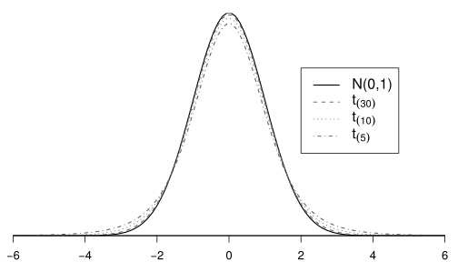
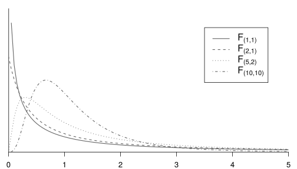

.. _c.likindafraedi:

Líkindafræðileg undirstaða
==========================

Nú höfum við lokið umfjöllun okkar um lýsandi tölfræði en
ályktunartölfræðin bíður enn. Í ályktunartölfræði lítum við svo á að
mælingarnar okkar séu slembni háðar, hver svo sem orsökin er. Því geta
mismunandi mælingar fengist í hvert sinn sem rannsóknin er endurtekin og
um leið vitum við ekki hver gildi mælinganna verða fyrr en eftir að við
höfum safnað þeim. Til að lýsa þessu fyrirbæri notum við
líkindafræðilegt hugtak sem nefnum *slembistærð* sem er
meginumfjöllunarefni þessa kafla.

Við byrjum á almennri umfjöllun um hugtakið slembistærð í kafla
:numref:`%s <s.slembistaerdir>` og kynnumst þar afar mikilvægu hugtaki,
*líkindadreifingu slembistærða*. Að því loknu (kafli
:numref:`%s <s.vaentigildislembi>`) fjöllum við um mikilvæga stærðfræðilega
eiginleika slembistærða og hefjum þar á eftir umfjöllun um slembistærðir
sem lýsa strjálum breytum (kafli :numref:`%s <s.strjalarlikindadreifingar>`) og
kynnumst *tvíkosta líkindadreifingu* og *Poisson líkindadreifingu*.

Í kafla :numref:`%s <s.samfelldarlikindadreifingar>` fjöllum við um
slembistærðir sem lýsa samfelldum breytum. Að því loknu tekur við
umfjöllun um fjórar gerðir samfelldra líkindadreifinga. Við byrjum á að
fjalla um *normaldreifinguna* en hún er án efa sú dreifing sem mest er
notuð innan tölfræðinnar.Að því loknu munum við fjalla um þrjár aðrar
gerðir líkindadreifinga, :math:`t`-dreifingu, :math:`\chi^2`-dreifingu
og :math:`F`-dreifingu, sem við munum nota þegar kemur að
ályktunartölfræði.

.. _s.slembistaerdir:

Slembistærðir
-------------

Slembistærðir
~~~~~~~~~~~~~

Í ályktunartölfræði lítum við svo á að þeim breytum sem við höfum áhuga
á að draga ályktanir um megi lýsa með slembistærð.

Slembistærð (random variable)
^^^^^^^^^^^^^^^^^^^^^^^^^^^^^

.. attention::

    *Slembistærð* lýsir útkomu breytu áður en hún er mæld.

--------------

Hugsum okkur að við viljum framkvæma rannsókn þar sem við könnum hversu
hátt hlutfall flugfarþega á Keflavíkurflugvelli hefur fartölvu meðferðis
í flugið. Við framkvæmum litla tilraun þar sem við veljum nokkra
flugfarþega af handahófi og skráum niður breytu sem tekur gildið 1 ef
farþeginn hafði fartölvu meðferðis í flugið en 0 ef ekki. Slembistærðin
sem lýsir þessari útkomu þessarar breytu myndi annars vegar segja okkur
að eingöngu gildin 0 og 1 væru mögulegar útkomur og hins vegar hversu
líklegt að útkoman sé 0 og hversu líklegt að hún sé 1 - áður en
tilraunin er framkvæmd!

Slembistærðir eru ekki tölur í venjulegum skilningi heldur eins konar
slembið fyrirbæri sem mun verða að einhverri tölu. Til að láta það ríma
við mælingarnar okkar, þarf útkoman sem við skráum að vera **tölur**.
Það þýðir að ef breytan sem við erum að mæla er flokkabreyta þá þurfum
við að kóða flokkana yfir í tölur með einhverjum hætti. Séum við að mæla
kyn gætum við til dæmis táknað útkomuna ,,karl“ með 0 og útkomuna
,,kona“ með ,,1“ og þar fram eftir götunum. Flest tölfræðiforrit gera
það sjálfkrafa fyrir okkur.

Gætið þess að rugla ekki slembistærð saman við gildi sem hún hefur
tekið. Áður en við mælum hvort að flugfarþegi er með fartölvu eða ekki
getur slembistærðin sem því lýsir vissulega tekið gildið einn, en það er
út í hött að kalla töluna 1 slembistærð - það er ekkert slembið við
hana. Einn er alltaf einn og getur aldrei mögulega orðið núll. Til að
gera greinarmun á slembistærð og þeim gildum sem hún hefur tekið erum
við mjög nákvæm með rithátt.

Ritháttur slembistærða (syntax for random variables)
^^^^^^^^^^^^^^^^^^^^^^^^^^^^^^^^^^^^^^^^^^^^^^^^^^^^

.. attention::

    Við táknum slembistærð með **stórum** staf, oft :math:`X`, eða staf úr
    gríska stafrófinu, t.d. :math:`\beta`.
    
    Við táknum gildi sem slembistærð **hefur tekið** með **litlum** staf,
    oft :math:`x`, eða með því að setja hatt yfir stafinn, t.d
    :math:`\hat \beta`.

--------------

Víkjum nú aftur að flugfarþegunum. Við lítum svo á að til sé ein
slembistærð sem lýsir því hvort að flugfarþegi af handahófi muni hafa
fartölvu meðferðis. Köllum slembistærðina :math:`X`. Í hvert sinn sem
kannað er hvort flugfarþegi sé með fartölvu, fæst ný útkoma sem að
slembistærðin :math:`X` hefur tekið. Þegar við höfum mörg gildi sem sama
slembistærðin hefur tekið tölusetjum við gildin með vísum
(:math:`x_1, x_2, x_3` o.s.frv.). Takið eftir samræminu við tölusetningu
margra mælinga á sömu breytunni í kafla :numref:`%s <c.lysanditolfraedi>`. Þessi
samsvörun er engin tilviljun. Við lítum á endurteknar mælingar á sömu
breytunni sem mörg gildi sem sama slembistærðin hefur tekið.

.. _ss.strjalsamfslembi:

Strjálar og samfelldar slembistærðir
~~~~~~~~~~~~~~~~~~~~~~~~~~~~~~~~~~~~

Við flokkum slembistærðir í *strjálar slembistærðir* og *samfelldar
slembistærðir* eftir því hvort breyturnar sem þær lýsa séu strjálar eða
samfelldar.

Strjálar slembistærðir (discrete random variables)
^^^^^^^^^^^^^^^^^^^^^^^^^^^^^^^^^^^^^^^^^^^^^^^^^^

.. attention::

    *Strjálar slembistærðir* lýsa strjálum breytum. Þær geta eingöngu tekið
    endanlega mörg gildi á sérhverju takmörkuðu bili.

--------------

Dæmi um strjálar slembistærðir eru til dæmis talan sem upp kemur í
teningakasti eða fjöldi auglýsinga sem sýndar verða fyrir kvöldfréttir
handahófsvalinn dag.

Í þessu riti er fjallað um tvær gerðir af strjálum slembistærðum. Önnur
gerðin getur tekið hvaða heiltölugildi sem er. Hin gerðin getur eingöngu
tekið endanlega mörg heiltölugildi sem ná frá 0 upp í einhverja tölu
:math:`n`.

Samfelldar slembistærðir (continuous random variables)
^^^^^^^^^^^^^^^^^^^^^^^^^^^^^^^^^^^^^^^^^^^^^^^^^^^^^^

.. attention::

    *Samfelldar slembistærðir* lýsa samfelldum breytum. Þær geta tekið hvaða
    gildi sem er á einhverju bili.

--------------

Dæmi um samfellda slembistærð er hæð handahófsvalinna kvenna. Hún getur
tekið hvaða gildi sem er á bilinu frá 50 cm upp í 250 cm. Annað dæmi er
hitastig í Reykjavík handahófsvalinn dag. Það getur tekið hvaða gildi
sem er á bilinu frá -30\ :math:`^\circ`\ C upp í 30\ :math:`^\circ`\ C.

.. _ss.likindadreifingslembistaerda:

Líkindadreifing slembistærða
~~~~~~~~~~~~~~~~~~~~~~~~~~~~

Við getum reiknað líkurnar á því að útkoma slembistærða hljóti tiltekin
gildi eða eitthvert gildi á tilteknu bili. Venjan er að nota ritháttinn
hér að neðan til að tákna þessar líkur.

.. _e.rithattur:

Ritháttur fyrir líkindi slembistærða
^^^^^^^^^^^^^^^^^^^^^^^^^^^^^^^^^^^^

.. attention::

        | :math:`P(X \leq a)`: Táknar líkur þess að útkoma slembistærðarinnar :math:`X` verði
        | :math:`\qquad`:math:`\qquad`:math:`\text{ }`:math:`\text{ }` **minni eða jöfn** gildinu :math:`a`.
        
        | :math:`P(X \geq a)`: Táknar líkur þess að útkoma slembistærðarinnar :math:`X` verði
        | :math:`\qquad`:math:`\qquad`:math:`\text{ }`:math:`\text{ }` **stærri eða jöfn** gildinu :math:`a`.
        
        | :math:`P(a \leq X \leq b)`: Táknar líkur þess að útkoma slembistærðarinnar :math:`X` verði
        | :math:`\qquad`:math:`\qquad`:math:`\qquad`:math:`\text{ }` **á milli** :math:`a` og :math:`b`, bæði gildin meðtalin.
        
        | :math:`P(X = a)`: Táknar líkur þess að útkoma slembistærðarinnar :math:`X` verði
        | :math:`\qquad`:math:`\qquad`:math:`\text{ }`:math:`\text{ }` **nákvæmlega** gildið :math:`a`.

--------------

Sýnidæmi: Ritháttur fyrir líkindi slembistærða
^^^^^^^^^^^^^^^^^^^^^^^^^^^^^^^^^^^^^^^^^^^^^^

.. tip::

    Notið rithátt fyrir líkindi slembistærða til að tákna eftirfarandi:
    
    a) líkurnar á því að útkoma slembistærðarinnar :math:`X` verði minni eða
       jöfn 3.
    
    b) líkurnar á því að útkoma slembistærðarinnar :math:`X` verði stærri
       eða jöfn 3.
    
    c) líkurnar á því að útkoma slembistærðarinnar :math:`X` verði
       nákvæmlega -10.
    
    d) líkurnar á því að útkoma slembistærðarinnar :math:`X` verði stærri
       eða jöfn 1, en þó ekki stærri en 3.

    a) :math:`P(X \leq 3)`
    
    b) :math:`P(X \geq 3)`
    
    c) :math:`P(X = -10)`
    
    d) :math:`P(1 \leq X \leq 3)`

*Líkindadreifing* slembistærðar gefur okkur líkur þess að útkomur hennar
taki tiltekin gildi. Með þeim hætti gefur hún okkur allar þær
upplýsingar sem hægt er að hafa um slembistærðina. Hún er skilgreind með
ólíkum hætti fyrir samfelldar og strjálar slembistærðir.

Líkindadreifing slembistærða (probability distribution of random variables)
^^^^^^^^^^^^^^^^^^^^^^^^^^^^^^^^^^^^^^^^^^^^^^^^^^^^^^^^^^^^^^^^^^^^^^^^^^^

.. attention::

    *Líkindadreifing* slembistærðar er regla sem segir okkur hvaða gildi
    slembistærðin getur tekið og enn fremur:
    
    :math:`P(X=a)` \ fyrir öll gildi :math:`a` sem hún getur tekið ef líkindadreifingin er **strjál**.
        
    :math:`P(a \leq X \leq b)` \ fyrir öll gildi :math:`a` og :math:`b` ef líkindadreifingin er **samfelld**.

--------------

.. note::

    Skilgreininguna að ofan má líka orða svo:
    
    Fyrir strjálar slembistærðir finnum við, fyrir hvaða mögulegu útkomu sem
    er, líkurnar á því að slembistærðin taki það gildi.
    
    Fyrir samfelldar slembistærðir finnum við, fyrir hvaða bil sem er,
    líkurnar á að útkoma slembistærðarinnar verði á því bili.

--------------

Strjálar og samfelldar líkindadreifingar
^^^^^^^^^^^^^^^^^^^^^^^^^^^^^^^^^^^^^^^^

.. attention::

    Ef slembistærð er **strjál** segjum við að líkindadreifing hennar sé
    strjál.
    
    Ef slembistærð er **samfelld** segjum við að líkindadreifing hennar sé
    samfelld.

--------------

Þar sem slembni margra þeirra breyta sem við skoðum er svipuð í eðli
sínu haga slembistærðirnar sem þær lýsa sér svipað og hafa þar af
leiðandi svipaða líkindadreifingu. Við segjum þá að líkindadreifingar
slembistærðanna séu af sömu *gerð*. Ein slík gerð er til dæmis
normaldreifing sem margir kannast við.

Til eru nokkrar gerðir af bæði strjálum og samfelldum líkindadreifingum
sem ná að lýsa stórum flokki breyta. Þeim þurfa allir sem nota og beita
tölfræði að kunna skil á. Við munum fjalla um mikilvægustu gerðir bæði
strjálla og samfelldra líkindadreifinga. Þá sjáum við jafnframt hvers
vegna dreifingarnar eru skilgreindar á mismunandi hátt eftir því hvort
þær eru strjálar eða samfelldar.

Hvort sem líkindadreifingar eru strjálar eða samfelldar þá eiga þær það
sameiginlegt að þeim má lýsa með tölum sem kallast *stikar*
líkindadreifingarinnar.

Stiki (parameter)
^^^^^^^^^^^^^^^^^

.. attention::

    Sérhverri gerð líkindadreifingar er lýst með tölum sem kallast *stikar*
    líkindadreifingarinnar. Mismunandi stikar lýsa mismunandi
    líkindadreifingum og yfirleitt eru stikarnir bara einn eða tveir. Ef við
    vitum af hvaða gerð líkindadreifing slembistærðar er þá gefa gildin á
    stikum hennar allar þær upplýsingar sem hægt er að fá um slembistærðina.

--------------

Til að geta talað stuttort og skýrt um þær slembistærðir sem fylgja
algengustu líkindadreifingunum sem og stikunum sem lýsa þeim, hafa
nokkrir bókstafir verið teknir frá fyrir þessar dreifingar, sem og
stikana þeirra. Þannig er til dæmis bókstafurinn :math:`N` notaður til
að lýsa gerðinni normaldreifingu og grísku stafirnir :math:`\mu` og
:math:`\sigma^2` lýsa stikunum tveimur sem henni er lýst með. Þannig
segir fullyrðingin :math:`X \sim N(\mu,\sigma^2)` að slembistærðin
:math:`X` fylgi normaldreifingu þar sem gildi stikanna eru :math:`\mu`
og :math:`\sigma^2`. Þessi ritháttur verður sýndur samhliða
líkindadreifingunum sem kynntar eru.

Takið eftir að ef við vitum af hvaða gerð líkindadreifing slembistærðar
er þá gefa gildin á stikum hennar allar þær upplýsingar sem hægt er að
fá um slembistærðina. Því kemur það ekki á óvart að stikar munu spila
stórt hlutverk þegar við förum í ályktunartölfræði í kafla
:numref:`%s <c.alyktunartolfraedi>`.

Tökum nú saman það sem við fórum yfir í þessum hluta. Hægt er að reikna
líkur þess að slembistærðir taki tiltekin gildi. Þeim líkum er lýst með
líkindadreifingu slembistærðanna sem gefa okkur allar mögulegar
upplýsingar um þær. Margar slembistærðir hafa líkindadreifingar af
ákveðnum þekktum gerðum. Hverri gerð líkindadreifingar er lýst með tölum
sem kallast stikar og til hverrar gerðar af líkindadreifingum tilheyra
mismunandi stikar. Ef við vitum af hvaða gerð líkindadreifing er þá gefa
gildi stika hennar allar þær upplýsingar sem hægt er að fá um
líkinadreifinguna.

.. _s.vaentigildislembi:

Stærðfræðilegir eiginleikar slembistærða
----------------------------------------

.. _ss.iid:

Óháðar og einsdreifðar slembistærðir
~~~~~~~~~~~~~~~~~~~~~~~~~~~~~~~~~~~~

Nú munum við fjalla um hugtök sem lýsa sambandi tveggja eða fleiri
slembistærða en ekki hverri einstakri slembistærð. Þessi hugtök eru
*hæði*, *óhæði* og *einsdreifni*.

Óháðar slembistærðir (independent random variables)
^^^^^^^^^^^^^^^^^^^^^^^^^^^^^^^^^^^^^^^^^^^^^^^^^^^

.. attention::

    Við segjum að tvær slembistærðir séu *óháðar* ef útkoma annarrar
    slembistærðarinnar hefur engin áhrif á hver útkoma hinnar
    slembistærðarinnar verður.

--------------

Ímyndum okkur að við ætlum að kasta teningi og krónu. Látum
slembistærðina :math:`X` vera útkomuna úr teningakastinu en
slembistærðina :math:`Y` vera útkomuna úr krónukastinu. Við trúum því að
það séu allar útkomur jafnlíklegar í hvert sinn sem teningi er kastað og
þá skiptir engu máli hvaða útkoma kom úr krónukastinu. Það getum við
orðað sem svo að við trúum því að útkoman í teningakastinu sé óháð
útkomunni í krónukastinu, það er að slembistærðirnar :math:`X` og
:math:`Y` séu óháðar.

Háðar slembistærðir (dependent random variables)
^^^^^^^^^^^^^^^^^^^^^^^^^^^^^^^^^^^^^^^^^^^^^^^^

.. attention::

    Við segjum að tvær slembistærðir séu *háðar* ef þær eru ekki óháðar, það
    er ef útkoma annarrar breytunnar veldur því að einhverjar útkomur hinnar
    breytunnar verði líklegri eða ólíklegri en ella.

--------------

Fjöldinn allur af slembistærðum eru háðar. Hugsum okkur nú að
slembistærðin :math:`X` sé hæð skólabarns sem valið er af handahófi úr
fyrsta bekk í Melaskóla og að slembistærðin :math:`Y` sé þyngd sama
barns. Ef útkoma :math:`X` er há tala (hávaxið barn), þá er útkoma
:math:`Y` líklegri til að vera sömuleiðis há tala (þyngra barn) - og
öfugt. Því eru slembistærðirnar :math:`X` og :math:`Y` háðar.

Ef óháðar slembistærðir hafa allar sömu líkindadreifingu þá segjum við
að þær séu *óháðar og einsdreifðar*.

Óháðar og einsdreifðar slembistærðir (iid random variables)
^^^^^^^^^^^^^^^^^^^^^^^^^^^^^^^^^^^^^^^^^^^^^^^^^^^^^^^^^^^

.. attention::

    Við segjum að slembistærðir :math:`X_1, \ldots, X_n` séu *óháðar*
    (e. indipendent) ef hver þeirra er óháð öllum hinum og *einsdreifðar*
    (e. identically distributed) ef þær hafa allar sömu líkindadreifingu.

--------------

Þegar slembistærðir eru óháðar og einsdreifðar gerum við engan
greinarmun á því að sjá tíu útkomur tíu ólíkra slembistærða, þ.e.a.s.
eina útkomu fyrir hverja slembistærð, eða að sjá tíu mismunandi útkomur
sem að sama slembistærðin tók. Þá notum við stundum orðalagið að hafa
*óháðar mælingar* á sömu slembistærðinni. Skoðum nú aftur flugfarþegana
okkar. Ef að flugfarþegarnir eru valdir af algjöru handahófi eru
líkurnar á því að einn flugfarþegi hafi fartölvu meðferðis óháðar
líkunum á því að einhver annar hafi fartölvu meðferðis. Því getum við
litið svo á að við höfum tíu óháðar mælingar á sömu slembistærðinni.

Úrvinnsla okkar í tölfræði byggist æði oft á því að mælingarnar okkar
séu útkomur óháðra og einsdreifðra slembistærða. Það er, við teljum að
við höfum í höndunum útkomur endurtekinna mælinga á sömu breytunni og
enn fremur trúum við að útkoma einnar mælingar hafi ekki áhrif á útkomu
hinna mælinganna og þar af leiðandi séu mælingarnar óháðar. Óhæði og
einsdreifni mælinga verður eingöngu tryggð með góðri úrtakshögun sem
farið var í í kafla :numref:`%s <s.urtakshogun>`.

Lögmál mikils fjölda
~~~~~~~~~~~~~~~~~~~~

Það er óhætt að fullyrða að *meðaltal* sé algengasta lýsistærðin sem við
vinnum með. Bæði er einfalt að reikna og skilja útkomu meðaltals og ekki
er verra að meðaltal hefur afskaplega góða stærðfræðilega eiginleika. Sá
fyrsti sem við munum kynnast er *lögmál mikils földa*. . Látum :math:`X`
vera slembistærðina sem tekur gildið 0 ef upp kemur þorskur þegar krónu
er kastað, en 1 ef landvættirnir koma upp. Krónunni var kastað 20 sinnum
og upp komu þessar útkomur:

.. math:: 1, 1, 0, 1, 1, 1, 0, 0, 1, 0, 0, 0, 1, 1, 0, 1, 0, 1, 1, 0

Skoðum nú hvernig meðaltal mælinganna breytist eftir því sem mælingunum
fjölgar. Meðaltal fyrstu mælingar er einungis einn. Meðaltal fyrstu
tveggja er (1+1)/2, sem er líka einn. Meðaltal fyrstu þriggja er
(1+1+0)/3 sem er tveir þriðju. Alls fáum við eftirfarandi niðurstöður:

+-------------+--------+--------+--------+--------+--------+--------+--------+--------+--------+--------+
| Fjöldi:     | 1      | 2      | 3      | 4      | 5      | 6      | 7      | 8      | 9      | 10     |
+-------------+--------+--------+--------+--------+--------+--------+--------+--------+--------+--------+
| Meðaltal:   | 1.00   | 1.00   | 0.67   | 0.75   | 0.80   | 0.83   | 0.71   | 0.62   | 0.67   | 0.60   |
+-------------+--------+--------+--------+--------+--------+--------+--------+--------+--------+--------+
+-------------+--------+--------+--------+--------+--------+--------+--------+--------+--------+--------+
| Fjöldi:     | 11     | 12     | 13     | 14     | 15     | 16     | 17     | 18     | 19     | 20     |
+-------------+--------+--------+--------+--------+--------+--------+--------+--------+--------+--------+
| Meðaltal:   | 0.55   | 0.50   | 0.54   | 0.57   | 0.53   | 0.56   | 0.53   | 0.56   | 0.58   | 0.55   |
+-------------+--------+--------+--------+--------+--------+--------+--------+--------+--------+--------+

.. _g.lmfmynd:

.. figure:: myndir/logmalmikilsfjolda1.svg
    :align: center
    :alt: Lögmál mikils fjölda 

    Lögmál mikils fjölda 

Vinstra megin á mynd :numref:`%s <g.lmfmynd>` má sjá myndrænt hvernig meðaltalið
á dæminu hér að ofan breytist. Hægra megin á sömu mynd má sjá svipaða
tilraun þeirri hér að ofan en nú var krónunni kastað 1000 sinnum. Á
myndinni má sjá hvernig meðaltal útkomanna okkar færðist nær og nær einu
ákveðnu gildi eftir því sem fleiri og fleiri útkomur voru notaðar til að
reikna meðaltalið. Þetta ákveðna gildi má líta á sem raunverulegt
meðaltal slembistærðarinnar. Í tölfræði köllum við þetta gildi
*væntigildi* slembistærðarinnar, og þegar við á, *meðaltal þýðisins*.

Væntigildi slembistærða (Expected value)
^^^^^^^^^^^^^^^^^^^^^^^^^^^^^^^^^^^^^^^^

.. attention::

    *Væntigildi slembistærðar* er *raunverulegt* meðaltal
    slembistærðarinnar. Það er ýmist táknað með :math:`\mu` eða
    :math:`E[X]`. Það er einnig kallað *meðaltal þýðis* (e. population mean)
    þegar við á.

--------------

Hugsum okkur nú að við viljum meta meðalhæð Íslendinga með slembiúrtaki
tekið úr þýðinu Íslendingar. Það er handahófskennt hvaða einstaklingar
veljast í úrtakið hverju sinni. Ef við tökum fleiri en eitt úrtak mun
meðaltal mælinganna breytast í hvert sinn sem nýtt úrtak er valið. Hins
vegar fyrirfinnst eitthvert eitt raunverulegt gildi, sem við fyndum ef
við mældum hæð allra Íslendinga og reiknuðum meðaltalið. Það er meðaltal
þýðisins og væntigildi slembistærðarinnar ,,meðalhæð Íslendinga“. Það er
sjaldnast svo að við þekkjum meðaltal þýðisins.

Skoðum einnig krónukastið hér að ofan. Við vitum aldrei hvort upp kemur
þorskur eða landvættir en þó munu þau koma upp álíka oft ef krónunni er
kastað nægjanlega oft. Hér á ekki við að tala um meðaltal þýðis, heldur
er nær að tala um hið raunverulega meðaltal krónukastanna. Þar sem það
er jafnlíklegt að upp komi þorskur eða landvættir, er jafnlíklegt að
slembistærðin taki gildið 0 eða 1, svo raunverulegt meðaltal
slembistærðarinnar ,,krónukast“ er 1/2.

Við sáum jafnframt í krónukastinu hvernig meðaltal mælinganna færðist
nær og nær 1/2 eftir því sem fjöldi mælinga jókst. Þetta er *lögmál
mikils fjölda*.

Lögmál mikils fjölda (law of large numbers)
^^^^^^^^^^^^^^^^^^^^^^^^^^^^^^^^^^^^^^^^^^^

.. attention::

    Eftir því sem fjöldi mælinga á slembistærð :math:`X` eykst þá stefnir
    meðaltal mælinganna, táknað :math:`\bar x`, nær *væntigildi*
    slembistærðarinnar, táknað :math:`\mu` eða :math:`E[X]`.

--------------

Lögmál mikils fjölda segir okkur að eftir því sem við höfum stærra úrtak
því nær meðaltali þýðisins verður meðaltal útkomanna okkar. Það segir
okkur líka að eftir því sem við höfum fleiri mælingar á breytu, því nær
raunverulegu meðaltali breytunnar verður meðaltal mælinganna.

Stundum viljum við fjalla samtímis um væntigildi tveggja slembistærða,
til dæmis :math:`X` og :math:`Y`. Þá er vonlaust að nota sama táknið,
:math:`\mu`, fyrir væntigildi þeirra beggja. Það vandamál má leysa á tvo
vegu. Annars vegar með því að láta :math:`\mu_X` tákna væntigildi
slembistærðarinnar :math:`X` og :math:`\mu_Y` væntigildi
slembistærðarinnar :math:`Y` en hins vegar með því að láta :math:`E[X]`
tákna væntigildi slembistærðarinnar :math:`X` og samsvarandi
:math:`E[Y]` fyrir :math:`Y`.

Dreifni slembistærða, :math:`Var[X]`
^^^^^^^^^^^^^^^^^^^^^^^^^^^^^^^^^^^^

.. attention::

    Á sama hátt og slembistærðir hafa raunverulegt meðaltal, hafa þær einnig
    *raunverulega dreifni*. Hana táknum við ýmist með :math:`\sigma^2`, eða
    :math:`Var[X]`. Hún er einnig kölluð *dreifni þýðis* (e. population
    variance) þegar við á.

--------------

Línuleg umbreyting á samfelldum slembistærðum
~~~~~~~~~~~~~~~~~~~~~~~~~~~~~~~~~~~~~~~~~~~~~

Oft eru mælingar á samfelldum breytum ekki á þeim kvarða sem við hefðum
viljað. Oftar en ekki dugar **línuleg umbreyting** til að koma gögnunum
á kvarða sem við skiljum.

Línuleg umbreyting (Linear transformation)
^^^^^^^^^^^^^^^^^^^^^^^^^^^^^^^^^^^^^^^^^^

.. attention::

    *Línuleg umbreyting* slembistærðarinnar :math:`X` með
    samlagningarstuðulinn :math:`a` og margföldunarstuðulinn :math:`b` er
    slembistærðin :math:`a + bX`.

--------------

Við margföldum sem sagt sérhvert gildi með tölunni :math:`b` og leggjum
sérhverja útkomu við töluna :math:`a`.

Að breyta til baka
^^^^^^^^^^^^^^^^^^

.. attention::

    Ef slembistærðin :math:`Y` er fengin með línulegu umbreytingunni
    :math:`Y = a + bX`, þá er slembistærðin :math:`X` fengin með formúlunni:
    
    .. math:: X = \frac{Y - a}{b}

--------------

Væntigildi og dreifni eftir línulega umbreytingu
^^^^^^^^^^^^^^^^^^^^^^^^^^^^^^^^^^^^^^^^^^^^^^^^

.. attention::

    Ef :math:`X` er slembistærð og :math:`a` og :math:`b` eru gefnar tölur,
    þá eru væntigildi og dreifni línulegu umbreytingarinnar :math:`a + bX`
    stærðirnar:
    
    .. math:: E[a + bX] = a + b\cdot E[X]
    
    og
    
    .. math:: Var[a + bX] = b^2 Var[X]

--------------

.. _s.strjalarlikindadreifingar:

Strjálar líkindadreifingar
--------------------------

Núna skulum við skoða nánar strjálar líkindadreifingar, þ.e.a.s.
líkindadreifingar sem að lýsa strjálum breytum. Strjálum
líkindadreifingum er best lýst með *massafalli*.

.. _ss.massafall:

Massafall
~~~~~~~~~

Massafall (mass function)
^^^^^^^^^^^^^^^^^^^^^^^^^

.. attention::

    Með *massafalli* (e. mass function) reiknum við líkur stakra útkoma
    strjálla slembistærða. Við táknum massafallið með :math:`f(x)` og það má
    skrifa sem
    
    .. math::
       f(x) = P(X = x)
       :label: eq.massafall
    
    Um massafallið gildir að
    
    .. math::
       \begin{aligned}
       f(x) &\geq 0\end{aligned}
       :label: eq.strjalsstaerriedajafntognull
    
    .. math::
       \begin{aligned}
       \sum_{\text{yfir öll x}} f(x) & = 1 \end{aligned}
       :label: eq.strjalsummaeinn
    
    Við notum stöplarit, sjá kafla :numref:`%s <s.myndraenastrjalumbreytum>`, til að
    lýsa massafalli myndrænt.

--------------

.. note::

    Jöfnu :eq:`eq.massafall` má lesa sem ,,massafallið gefur líkurnar á að
    slembistærðin :math:`X` taki gildið :math:`x`\ “, þar sem :math:`x`
    getur verið hvaða tala sem er. Jafna
    :eq:`eq.strjalsstaerriedajafntognull` segir okkur að massafallið er
    alltaf stærra eða jafnt og núll og jafna :eq:`eq.strjalsummaeinn` segir
    okkur að ef við leggjum saman gildin sem massafall :math:`X` tekur fyrir
    öll gildi á :math:`x` verði útkoman einn.

--------------

Dæmigert stöplarit sem lýsir massafalli má sjá á mynd
:numref:`%s <g.stoplaritmassafalls>`. Á x-ásnum má sjá mögulegar útkomur
slembistærðarinnar og á y-ásnum má sjá líkurnar á þessum útkomum.

.. _g.stoplaritmassafalls:

.. figure:: myndir/binom0.svg
    :align: center
    :alt: Stöplarit massafalls 

    Stöplarit massafalls 

Takið eftir samsvörunni milli strjálla slembistærða og strjálla breyta.
Við notum stöplarit til að lýsa strjálum slembistærðum myndrænt á sama
hátt og við notum stöplarit til að lýsa strjálum breytum myndrænt, hvort
sem þær eru talna- eða flokkabreytur.

.. _ss.reglur:

Reiknireglur fyrir strjálar slembistærðir
~~~~~~~~~~~~~~~~~~~~~~~~~~~~~~~~~~~~~~~~~

Áður en við ræðum um strjálar líkindadreifingar og reiknum út líkur á að
slembistærð taki ákveðið gildi, skulum við skoða nokkrar reglur sem munu
koma að góðum notum síðar í kaflanum. Þessar reglur sýna okkur hvernig
umrita má líkur svo auðveldara verði fyrir okkur að reikna þær.

.. _e.reglur:

Reiknireglur fyrir strjálar slembistærðir
^^^^^^^^^^^^^^^^^^^^^^^^^^^^^^^^^^^^^^^^^

.. attention::

    Þegar reikna á líkur fyrir strjála slembistærð :math:`X` má oft auðvelda
    útreikninga með því að snúa líkunum við
    
    .. math::
       \begin{aligned}
       P(X \leq k)  = &  1 - P(X > k)\end{aligned}
       :label: eq.reglur1
    
    .. math::
       \begin{aligned}
       %= 1 - P(X \geq {k+1})
       P(X < k)     = &  1 - P(X \geq k)\end{aligned}
       :label: eq.reglur2
    
    .. math::
       \begin{aligned}
       P(X \geq k)  = &  1 - P(X < k)\end{aligned}
       :label: eq.reglur3
    
    .. math::
       \begin{aligned}
        %= 1 - P(X \leq k-1)
       P(X > k)     = &  1 - P(X \leq k)\end{aligned}
       :label: eq.reglur4
    
    þar sem :math:`k` getur verið hvaða mögulega útkoma sem :math:`X` getur
    tekið.

--------------

.. note::

    Nota skal jöfnu :eq:`eq.reglur1` ef reikna á líkurnar að gildi
    slembistærðarinnar :math:`X` verði **minna eða jafnt** tölunni
    :math:`k`.
    
    Nota skal jöfnu :eq:`eq.reglur2` ef reikna á líkurnar að gildi
    slembistærðarinnar :math:`X` verði **minna en** talan :math:`k`.
    
    Nota skal jöfnu :eq:`eq.reglur3` ef reikna á líkurnar að gildi
    slembistærðarinnar :math:`X` verði **stærra eða jafnt** tölunni
    :math:`k`.
    
    Nota skal jöfnu :eq:`eq.reglur4` ef reikna á líkurnar að gildi
    slembistærðarinnar :math:`X` verði **stærra en** talan :math:`k`.

--------------

.. _s.binom:

Tvíkostadreifingin
~~~~~~~~~~~~~~~~~~

Mörg tölfræðileg viðfangsefni fjalla um sams konar tilraunir sem eru
endurteknar mörgum sinnum. Ef hver og ein þessara tilrauna uppfyllir
skilyrðin í kassa :numref:`%s <em.bernoulli>`, flokkast þær hver og ein sem
*Bernoulli tilraun* og þá má reikna líkur alls kyns mögulegra uppákoma á
þægilegan hátt.

.. _em.bernoulli:

Bernoulli tilraun (Bernoulli trial)
^^^^^^^^^^^^^^^^^^^^^^^^^^^^^^^^^^^

.. attention::

    Sérhver tilraun í safni endurtekinna tilrauna flokkast sem *Bernoulli
    tilraun* ef eftirfarandi gildir:
    
    #) Hver tilraun hefur aðeins tvær mögulegar útkomur. Það er venja að
       kalla þessar útkomur *jákvæða útkomu* (e. success) og *neikvæða útkomu*
       (e. failure).
    
    #) Líkurnar á jákvæðri útkomu eru þær sömu í hverri tilraun fyrir sig.
    
    #) Útkoma í einni tilraun hefur ekki áhrif á útkomu í annarri tilraun,
       þ.e.a.s. mælingarnar eru óháðar (e. independent).

--------------

.. note::

    Skilyrði 2 er jafngilt því að líkurnar á neikvæðri útkomu séu þær sömu í
    hverri tilraun fyrir sig, þar sem líkurnar á neikvæðri útkomu eru ávallt
    1 mínus líkurnar á jákvæðri útkomu.

--------------

Oft höfum við eingöngu áhuga á því að reikna hversu oft við sjáum
jákvæða útkomu meðal safns Bernoulli tilrauna. Við gætum til dæmis
viljað reikna líkurnar á því að fá tvær sexur (sem væru þá jákvæða
útkoman) þegar teningi er kastað fimm sinnum. Þá er þægilegt að líta á
heildarfjölda jákvæðra útkoma sem eina slembistærð, :math:`X`. Hún hefur
þekkta líkindadreifingu, sem kallast *tvíkostadreifingin* og er henni
lýst með stikunum :math:`n`, sem er fjöldi Bernoulli tilrauna sem
framkvæmdar eru, og :math:`p` sem er líkurnar á því að hver og ein
Bernoulli tilraun heppnist.

.. _em.tvikostadreifingin:

Tvíkostadreifingin (binomial distribution)
^^^^^^^^^^^^^^^^^^^^^^^^^^^^^^^^^^^^^^^^^^

.. attention::

    Látum :math:`X` fylgja tvíkostadreifingu með stikana :math:`n` og
    :math:`p`, táknað :math:`X \sim B(n, p)`. Ef :math:`k` er eitthvert
    gildanna :math:`\{0,1,2,...`\ n\ :math:`\}` má reikna líkurnar á að
    slembistærðin :math:`X` taki gildið :math:`k` með massafalli
    tvíkostadreifingarinnar :
    
    .. math::
       P(X = k) = \binom{n}{k} p^k (1-p)^{n-k}, \hspace{1cm} k = 0,1,2,...n
       :label: eq.tvikostadreifing
    
    þar sem :math:`\binom{n}{k}` er tvíliðustuðullinn. Sjá kassa
    :numref:`%s <em.tvilidustudull>`.

--------------

.. note::

    Slembistærðin :math:`X` táknar fjölda jákvæðra tilrauna úr :math:`n`
    Bernoulli tilraunum þar sem :math:`p` eru líkurnar á jákvæðri útkomu í
    hverri tilraun fyrir sig. Mögulegur fjöldi jákvæðra útkoma spannar frá 0
    til :math:`n` svo :math:`X` getur mögulega tekið gildin
    :math:`\{0,1,2,...`\ n\ :math:`\}`.

--------------

.. _em.tvilidustudull:

Tvíliðustuðullinn (binomial coefficient)
^^^^^^^^^^^^^^^^^^^^^^^^^^^^^^^^^^^^^^^^

.. attention::

    Tvíliðustuðullinn (e. binomial coefficient) er táknaður með
    :math:`\binom{n}{k}`. Hann er jafn fjölda möguleika á að fá :math:`k`
    jákvæðar útkomur í :math:`n` tilraunum og er reiknaður með
    
    .. math::
       \binom{n}{k} = \frac{n!}{k!(n-k)!},
       :label: eq.tvilidustudull
    
    þar sem :math:`k! = k\cdot(k-1)\cdot(k-2)\cdot ... \cdot(1)`. Sér í lagi
    er :math:`0! = 1`.

--------------

Sýnidæmi: Tvíliðustuðullinn
^^^^^^^^^^^^^^^^^^^^^^^^^^^

.. tip::

    Á hve marga vegu má fá nákvæmlega tvo þorska þegar krónu er kastað
    fjórum sinnum?
    
    Táknum útkomuna landvætti með L og útkomuna þorsk með Þ og skrifum
    útkomurnar í sömu röð og þær koma fyrir í krónukastinu. Mögulegar leiðir
    til að fá tvær jákvæðar útkomur eru þá
    
    ::
    
        LLÞÞ ÞÞLL ÞLLÞ LÞÞL LÞLÞ ÞLÞL
    
    Þetta eru sex mögulegar leiðir. Munið að tvíliðustuðullinn gefur okkur á
    hversu marga vegu við getum fengið :math:`k` jákvæðar útkomur í
    :math:`n` tilraunum. Í þessu tilviki er :math:`k=2` og :math:`n=4` svo
    við hefðum einnig getað reiknað beint :math:`\binom{4}{2} = 6`.

Sýnidæmi: Tvíkostadreifingin
^^^^^^^^^^^^^^^^^^^^^^^^^^^^

.. tip::

    Hvaða líkindadreifingu fylgir slembistærðin :math:`X`, sem lýsir því
    hversu oft sexa kemur upp þegar teningi er kastað fimm sinnum?
    
    Þar sem teningnum er kastað fimm sinnum er :math:`n=5`. Líkurnar á því
    að upp komi sexa í hvert og eitt skipti eru :math:`1/6` og því er
    :math:`p=1/6`. Þá getum við sagt að :math:`X` fylgi tvíkostadreifingu
    með stuðlana :math:`p = 1/6` og :math:`n=5` eða :math:`X \sim B(5,1/6)`.

.. _ex.tvikostkronukast:

Sýnidæmi: Tvíkostadreifingin
^^^^^^^^^^^^^^^^^^^^^^^^^^^^

.. tip::

    Benni hefur gaman af því að kasta krónum. Hverjar eru líkurnar á því að
    Benni fái nákvæmlega tvo þorska þegar hann kastar krónu fjórum sinnum?
    
    Látum :math:`X` tákna fjölda þorska sem upp koma (við skilgreinum þorsk
    sem jákvæða útkomu). Áður en við reiknum líkurnar þurfum við að finna
    hvaða líkindadreifingu :math:`X` fylgir.
    
    Að kasta upp krónu er Bernoulli tilraun þar sem það eru aðeins tvær
    mögulegar útkomur þorskur, jákvæð og landvættir, neikvæð. Líkurnar á
    jákvæðri útkomu eru þær sömu í hverri tilraun fyrir sig (líkurnar eru
    alltaf 0.5) og útkomurnar eru óháðar.
    
    Þar sem við framkvæmum Bernoulli tilraunir 4 sinnum fylgir :math:`X`
    tvíkostadreifingu með :math:`n` = 4, :math:`p` = 0.5 og við getum
    skrifað :math:`X \sim B(4,0.5)`. Við getum því notað jöfnu
    :eq:`eq.tvikostadreifing` til að reikna líkurnar. Byrjum á að reikna út
    gildið á tvíliðustuðlinum með jöfnu :eq:`eq.tvilidustudull`
    
    .. math:: \binom{n}{k} = \binom{4}{2} = \frac{4!}{2!(4-2)!} = \frac{4 \cdot 3 \cdot 2 \cdot 1}{2\cdot 1 \cdot(2 \cdot 1)} = 6
    
    og reiknum svo líkurnar með jöfnu :eq:`eq.tvikostadreifing`
    
    .. math:: P(X = 2) = \binom{n}{k} p^k (1-p)^{n-k} = \binom{4}{2} 0.5^2 (1-0.5)^{4-2} = 6 \cdot 0.5^2 \cdot 0.5^2 = 0.3750
    
    Líkurnar á að fá 2 þorska þegar krónu er kastað 4 sinnum eru því 37.5%.

Sýnidæmi: Tvíkostadreifingin
^^^^^^^^^^^^^^^^^^^^^^^^^^^^

.. tip::

    Teiknið upp massafall slembistærðarinnar :math:`X` sem táknar fjölda
    jákvæðra útkoma þegar krónu er kastað fjórum sinnum.
    
    Við sáum í dæmi :numref:`%s <ex.tvikostkronukast>` að :math:`X` fylgir
    tvíkostadreifingu með stikana :math:`p=0.5` og :math:`n = 4`.
    
    Til þess að teikna massafallið þurfum við að reikna líkurnar fyrir allar
    mögulegar útkomur :math:`X`, það er að segja við þurfum að finna auk
    :math:`P(X=2)` sem við fundum í dæmi :numref:`%s <ex.tvikostkronukast>`,
    :math:`P(X=0)`, :math:`P(X=1)`, :math:`P(X=3)` og :math:`P(X=4)`. Þetta
    gerum við á sama máta og í dæmi :numref:`%s <ex.tvikostkronukast>` og við fáum
    að
    
    .. math:: P(X=0) = 0.0625, \ P(X=1)= 0.25, \ P(X=3)= 0.25, \  P(X=4) = 0.0625
    
    Massafallið má sjá hér að neðan.
    
    .. figure:: myndir/binom1.svg
        :align: center
        :alt: Mynd

Sýnidæmi: Tvíkostadreifingin
^^^^^^^^^^^^^^^^^^^^^^^^^^^^

.. tip::

    Ólöf kastar teningi þrisvar sinnum. Hverjar eru líkurnar á að hún fái
    einu sinni sexu í þessum þremur köstum?
    
    Köllum nú :math:`X` fjölda skipta þegar upp kemur sexa. Áður en við
    reiknum líkurnar þurfum við að finna hvaða líkindadreifingu :math:`X`
    fylgir.
    
    Hér er um Bernoulli tilraun að ræða þar sem við lítum svo á að það séu
    aðeins tvær mögulegar útkomur (fá sexu, jákvæð, og fá ekki sexu,
    neikvæð) líkurnar á jákvæðri útkomu eru þær sömu í hverri tilraun fyrir
    sig (líkurnar eru alltaf 1/6) og útkomurnar eru óháðar.
    
    Þar sem við framkvæmum Bernoulli tilraunir 3 sinnum fylgir :math:`X`
    tvíkostadreifingu með :math:`n` = 3, :math:`p` = 1/6 og við getum
    skrifað :math:`X \in B(3,1/6)`. Við getum því notað jöfnu
    :eq:`eq.tvikostadreifing` til að reikna líkurnar og fáum
    
    .. math:: P(X = 1) = \binom{3}{1} (1/6)^1 (1-1/6)^{3-1} = 3 \cdot (1/6)^1 \cdot (5/6)^2 = 0.3472
    
    Líkurnar eru því um 34.7%.
    
    Teiknum að lokum massafall :math:`X`, :math:`X \in B(3,1/6)`.
    
    .. figure:: myndir/binom3.svg
        :align: center
        :alt: Mynd

Sýnidæmi: Tvíkostadreifingin
^^^^^^^^^^^^^^^^^^^^^^^^^^^^

.. tip::

    Jói er mikið fyrir radísur og ákveður því að prófa að gróðursetja nokkur
    radísufræ. Jói hefur aldrei komið nálægt garðrækt og ákveður því að fara
    rólega í sakirnar í byrjun og gróðursetur 8 radísufræ. Hann hringir svo
    stoltur í móður sína sem er radísusérfræðingur mikill. Af áralangri
    reynslu veit hún að líkurnar á að radísufræ verði að fullvaxta radísu
    eru :math:`75\%` miðað við aðstæðurnar í garðinum hans Jóa. Hverjar eru
    líkurnar á að öll fræin hans Jóa verði að fullvaxta radísum og hvaða
    forsendur þurfa að gilda svo útreikningarnir séu réttir?
    
    Reikna má líkurnar með að því að nota tvíkostadreifinguna en þá verður
    að gilda að atburðirnir séu óháðir. Gerum ráð fyrir at atburðirnir séu
    óháðir og notum jöfnu :eq:`eq.tvikostadreifing` til að reikna líkurnar.
    Notum :math:`X` til að tákna fjölda radísufræja sem verða að radísu,
    :math:`X \in B(8,0.75)`.
    
    .. math:: P(X = 8) = \binom{8}{8} (0.75)^8 (1-0.75)^{8-8} = 0.10
    
    Líkurnar eru því 10% en útreikningarnir gilda aðeins ef atburðirnir eru
    óháðir.

Sýnidæmi: Tvíkostadreifingin
^^^^^^^^^^^^^^^^^^^^^^^^^^^^

.. tip::

    Stjórnendur framleiðslufyrirtækis hér í bæ huga mikið að gæðamálum og
    halda þeir fram að líkurnar á að vara sem framleidd er í fyrirtækinu sé
    gölluð séu 0.1%. Séu 100 vörur frá fyrirtækinu valdar af handahófi,
    hverjar eru líkurnar á að engin þeirra sé gölluð? Gerið ráð fyrir að
    atburðirnir séu óháðir.
    
    Látum :math:`X` tákna fjölda gallaðra vara, :math:`X \in B(100,0.001)`.
    Við notum jöfnu :eq:`eq.tvikostadreifing` til að reikna líkurnar á að
    engin vara sé gölluð:
    
    .. math:: P(X = 0) = \binom{100}{0} (0.001)^0 (1-0.001)^{100-0} = 0.999^{100} = 0.90
    
    Líkurnar eru því 90%.

Við höfum nú séð að reikna má líkurnar á að slembistærðin :math:`X` taki
eitthvert ákveðið gildi :math:`k` með jöfnu :eq:`eq.tvikostadreifing`.
Auk þess að reikna :math:`P(X=k)` höfum við oft áhuga á að reikna
:math:`P(a \leq X \leq b)`, :math:`P(a < X < b)`, :math:`P(X \leq k))`,
:math:`(X < k)`, :math:`P(X \geq k))` eða :math:`(X > k)`. Við getum
reiknað allar þessar líkur með jöfnu :eq:`eq.tvikostadreifing` ásamt því
að nota reglurnar í kassa :numref:`%s <e.reglur>`. Skoðum nú nokkur dæmi sem
sýna hvernig þetta er gert.

Sýnidæmi: Tvíkostadreifingin
^^^^^^^^^^^^^^^^^^^^^^^^^^^^

.. tip::

    Sigga kastar krónu 10 sinnum. Táknum fjölda þorska með :math:`X`,
    :math:`X \sim B(10,0.5)`.
    
    a) Hverjar eru líkurnar á því að Sigga fái á milli 4 og 6 þorska?
    
    b) Hverjar eru líkurnar á því að Sigga fái 3 eða færri þorska?
    
    c) Hverjar eru líkurnar á því að Sigga fái 8 eða fleiri þorska?
    
    d) Hverjar eru líkurnar á því að Sigga fái fleiri en 2 þorska?
    
    e) Teiknið massafall :math:`X`.
    
    a. Finnum nú líkurnar á því að fjöldi þorska verði á milli 4 og 6:
    :math:`P(4 \leq X \leq 6)`
    
    Til að reikna þessar líkur verðum við að leggja saman líkurnar á því að
    fá 4, 5 og 6 þorska eða
    
    .. math:: P(4 \leq X \leq 6) = P(X = 4) + P(X = 5) + P(X = 6)
    
    Við notum jöfnu :eq:`eq.tvikostadreifing` og fáum
    
    .. math:: P(4 \leq X \leq 6) = 0.2051 + 0.2461 + 0.2051 = 0.6563
    
    Líkurnar á því að fá milli 4 og 6 þorska þegar krónu er kastað 10 sinnum
    eru því um 65.6%.
    
    b. Finnum nú líkurnar á því að fjöldi þorska verði 3 eða færri:
    :math:`P(X \leq 3)`.
    
    Til að reikna þessar líkur verðum við að leggja saman líkurnar að fá 0,
    1, 2 og 3 þorska eða
    
    .. math:: P(X \leq 3) = P(X = 0) + P(X = 1) + P(X = 2) + P(X = 3)
    
    Við notum jöfnu :eq:`eq.tvikostadreifing` og fáum
    
    .. math:: P(X \leq 3) = 0.0010 + 0.0098 + 0.0439 + 0.1172 = 0.1719
    
    Líkurnar eru því um 17.2%.
    
    VARÚÐ: Ef beðið hefði verið um líkurnar á að fá færri en 3 þorska væru
    líkurnar:
    
    .. math:: P(X<3) = P(X = 0) + P(X = 1) + P(X = 2) = 0.0527
    
    c. Finnum nú líkur þess að fjöldi þorska verði 8 eða fleiri:
    :math:`P(X \geq 8)`.
    
    Til að reikna þessar líkur verðum við að leggja saman líkurnar á því að
    fá 8, 9, eða 10 þorska (við köstum krónunni 10 sinnum og því getur
    fjöldi þorska ekki verið fleiri en 10) eða
    
    .. math:: P(X \geq 8) = P(X = 8) + P(X = 9) + P(X = 10)
    
    Við notum jöfnu :eq:`eq.tvikostadreifing` og fáum
    
    .. math:: P(X \geq 8) = 0.0439 + 0.0098 + 0.0010 = 0.0547
    
    Líkurnar eru því um 5.5%.
    
    VARÚÐ: Ef beðið hefði verið um líkurnar á að fá fleiri en 8 þorska væru
    líkurnar
    
    .. math:: P(X>8) = P(X = 9) + P(X = 10) = 0.0108
    
    d. Finnum nú líkur á því að fjöldi þorska verði fleiri en 2:
    :math:`P(X > 2)`.
    
    Við getum reiknað þessar líkur sem
    
    .. math:: P(X > 2) = P(X = 3) + P(X = 4) + ... + P(X = 10)
    
    en auðveldara er að nota jöfnu :eq:`eq.reglur4` til að umskrifa líkurnar
    
    .. math:: P (X > 2) = 1 - P(X \leq 2) = 1 - (P(X = 2) + P(X = 1) + P(X = 0))
    
    Við notum jöfnu :eq:`eq.tvikostadreifing` og fáum
    
    .. math:: P (X > 2) = 1 - (0.0439 + 0.0098 + 0.0010) = 0.9453
    
    Líkurnar á að fá fleiri en tvo þorska eru því um 94.5%.
    
    e. Teiknum nú massafall slembibreytunnar :math:`X`,
    :math:`X \in B(10,0.5)`.
    
    .. figure:: myndir/binom2.svg
        :align: center
        :alt: Mynd

Væntigildi og dreifni tvíkostadreifingarinnar
^^^^^^^^^^^^^^^^^^^^^^^^^^^^^^^^^^^^^^^^^^^^^

.. attention::

    Ef :math:`X` fylgir tvíkostadreifingu, :math:`X \sim B(n,p)` þá gildir
    
    .. math::
       \begin{aligned}
       \text{E}[X] & =  np\end{aligned}
       :label: eq.vaentigilditvikostadreifingar
    
    .. math::
       \begin{aligned}
       \text{Var}[X] & =  np(1-p)\end{aligned}
       :label: eq.dreifnitvikostadreifingar

--------------

Sýnidæmi: Væntigildi og dreifni tvíkostadreifingarinnar
^^^^^^^^^^^^^^^^^^^^^^^^^^^^^^^^^^^^^^^^^^^^^^^^^^^^^^^

.. tip::

    Árni Pétur ætlar að kasta teningi 900 sinnum. Látum :math:`X` tákna
    fjölda skipta sem fjarki kemur upp, :math:`X \sim B(900,1/6)`. Finnið
    :math:`\text{E}[X]` og :math:`\text{Var}[X]`.
    
    Við notum jöfnur :eq:`eq.vaentigilditvikostadreifingar` og
    :eq:`eq.dreifnitvikostadreifingar` og fáum
    
    .. math::
       \begin{aligned}
       \text{E}[X] & = np \ = \ 900 \cdot 1/6 = 150\\
       \text{Var}[X] & = np(1-p) \ = \ 125 \end{aligned}

.. _s.poisson:

Poisson dreifingin
~~~~~~~~~~~~~~~~~~

Poisson dreifingin er oft notuð til að lýsa fjölda slembinna atvika sem
eiga sér stað **á ákveðinni einingu** en mögulegar útkomur hafa engin
efri mörk. Einingarnar geta sem dæmi verið tímabil, svæði eða einhver
hlutur. Sem dæmi má nefna fjölda símtala til nemendaskrár **á** mínútu,
fjölda hreindýra **á** ferkílómetra og fjölda innsláttarvillna **á**
blaðsíðu.

Poisson dreifingin hefur bara einn stika sem er táknaður með
:math:`\lambda`. Hann lýsir því hvað við væntum að margar jákvæðar
útkomur eigi sér stað að meðaltali á tiltekinni mælieiningu. Við setjum
engar skorður á hvaða heiltölugildi slembistærð :math:`X`, sem fylgir
Poisson dreifingu, getur tekið. Sama hvað við skoðum hátt gildi eru ætíð
einhverjar líkur á því að :math:`X` taki það gildi (þó þær geti verið
agnarsmáar).

Poisson dreifingin (Poisson distribution)
^^^^^^^^^^^^^^^^^^^^^^^^^^^^^^^^^^^^^^^^^

.. attention::

    Látum :math:`X` fylgja Poisson dreifingu með stikann :math:`\lambda`,
    táknað :math:`X \sim \text{Pois}(\lambda)`. Ef :math:`k` er eitthvert
    jákvætt heiltölugildi (núll meðtalið) má reikna líkurnar á að
    slembistærðin :math:`X` taki gildið :math:`k` með massafalli Poisson
    dreifingarinnar :
    
    .. math::
       P(X = k) = \frac{e^{-\lambda}\lambda^k}{k!}
       :label: eq.poisson

--------------

.. note::

    Slembistærðin :math:`X` lýsir fjölda jákvæðra útkoma á tiltekna
    mælieiningu, þar sem :math:`\lambda` er meðafjöldi jákvæðra útkoma á
    hverja einingu. Það eru engin efri mörk á fjölda jákvæðra útkoma svo
    :math:`X` getur mögulega tekið hvaða gildi :math:`\{0,1,2,...\}` sem er.
    
    Bókstafurinn :math:`e` í jöfnu :eq:`eq.poisson`, stendur fyrir ákveðna
    tölu, sem er kölluð :math:`e`. Gildi hennar er um það bil 2.72. Töluna
    :math:`e` má, líkt og töluna :math:`\pi`, finna á flestum vasareiknum.
    Hún er þá yfirleitt táknuð með :math:`e^x`.

--------------

Sýnidæmi: Poisson dreifingin
^^^^^^^^^^^^^^^^^^^^^^^^^^^^

.. tip::

    Anna Vigdís er á hraðferð og veltir því fyrir sér hversu löng biðröðin
    verði á hraðkassanum í Krónunni úti á Granda. Meðalfjöldi kúnna sem koma
    að hraðkassanum er 1.5 á mínútu. Hvaða líkindadreifingu má nota til að
    lýsa fjölda kúnna sem koma að hraðkassanum á hverri mínútu?
    
    Það eru engin efri mörk á því hve margir kúnnar geta staðið við kassann
    hverju sinni og við vitum meðalfjöldann sem kemur að kassanum á hverri
    mínútu. Því notum við Poisson dreifinguna til að lýsa fjölda kúnna sem
    koma að kassanum á hverri mínútu með stikann :math:`\lambda = 1.5` eða
    :math:`X \sim \text{Pois}(1.5)`

Jafna :eq:`eq.poisson` sýnir okkur hvernig reikna má líkurnar á að
slembistærð :math:`X` sem fylgir Poisson dreifingunni taki eitthvert
ákveðið gildi :math:`k`. Eins og með tvíkostadreifinguna höfum við oft
áhuga á að reikna aðrar líkur eða :math:`P(a \leq X \leq b)`,
:math:`P(a < X < b)`, :math:`P(X \leq k)`, :math:`P(X < k)`,
:math:`P(X \geq k)` eða :math:`P(X > k)`. Við getum reiknað allar þessar
líkur með jöfnu :eq:`eq.poisson` ásamt því að nota reglurnar í kassa
:numref:`%s <e.reglur>`.

Sýnidæmi: Poisson dreifingin
^^^^^^^^^^^^^^^^^^^^^^^^^^^^

.. tip::

    Nú fjöllum við aftur um Önnu Vigdísi og fjölda kúnna sem koma að
    hraðkassanum í Krónunni á hverri mínútu. Meðalfjöldi kúnna sem koma að
    kassanum er 1.5 á mínútu.
    
    Finnið líkurnar á að
    
    a. 3 kúnnar komi að kassanum á einni mínútu.
    
    b. í mesta lagi 2 kúnnar komi að kassanum á einni mínútu.
    
    c. í minnsta lagi 1 kúnni komi að kassanum á einni mínútu.

    a. Finnum líkurnar á að 3 kúnnar komi að kassanum á einni mínútu.
    
    Við vitum að meðalfjöldi kúnna á mínútu er 1.5. Því er
    :math:`\lambda = 1.5`. Við notum jöfnu :eq:`eq.poisson` og fáum
    
    .. math:: P(X = 3) = \frac{e^{-1.5}1.5^3}{3!} = 0.1255
    
    Líkurnar eru því um 12.5%.
    
    b. Finnum líkurnar á að í mesta lagi 2 kúnnar komi að kassanum á einni
    mínútu.
    
    Til að reikna líkurnar á að í mesta lagi 2 kúnnar komi að kassanum
    þurfum við að leggja saman líkurnar á að það komi enginn, ein eða tvær
    manneskjur að kassanum á einni mínútu. Við notum jöfnu :eq:`eq.poisson`
    
    .. math::
       \begin{aligned}
       P(X \leq 2) &=& P(X = 0) + P(X = 1) + P(X = 2)\\
       &=& 0.2231 + 0.3347 + 0.2510 \\
       &=& 0.8088 \end{aligned}
    
    Líkurnar eru því um 80.9%.
    
    c. Finnum líkurnar á að í minnsta lagi 1 kúnni komi að kassanum á einni
    mínútu.
    
    Líkurnar á að í minnsta lagi einn kúnni komi að kassanum má skrifa sem
    
    .. math:: P(X \geq 1)
    
    Þessar líkur getum við ekki reiknað beint þar sem það eru engin efri
    mörk. Við notum því jöfnu :eq:`eq.reglur3` til að umskrifa líkurnar og
    fáum
    
    .. math::
       \begin{aligned}
       P(X \geq 1) &=& 1 - P(X < 1)\\
       &=& 1 - P(X = 0)\\
       &=& 1 - 0.2231\\
       &=& 0.7769 \end{aligned}
    
    Líkurnar eru því um 77.7%.
    
    Teiknum að lokum massafall slembibreytunnar :math:`X`,
    :math:`X \in P(1.5)`.
    
    .. figure:: myndir/pois1.svg
        :align: center
        :alt: Mynd

Þegar reikna á líkur á að slembistærð sem fylgir Poisson dreifingu taki
eitthvert gildi fáum við :math:`\lambda` oft gefið sem fjölda á annarri
einingu en þeirri sem við viljum vinna með. Við gætum til dæmis vitað
fjölda tilkynntra bilana af fólksbílagerð á hverjum degi en við viljum
lýsa fjölda tilkynntra bilana á viku. Þá væri gefna einingin dagur en
einingin sem við viljum vinna með er vika. Þá þarf að laga
:math:`\lambda` að nýrri einingu.

Poisson dreifingin löguð að nýrri einingu
^^^^^^^^^^^^^^^^^^^^^^^^^^^^^^^^^^^^^^^^^

.. attention::

    Gerum ráð fyrir að slembistærðin :math:`X \sim \text{Pois}(\lambda)`
    lýsi fjölda jákvæðra útkoma á tiltekinni einingu. Þá lýsir slembistærðin
    :math:`Y \sim \text{Pois}(a\cdot\lambda)` fjölda jákvæðra útkoma á
    :math:`a` einingum.

--------------

Sýnidæmi: Poisson dreifingin löguð að nýrri einingu
^^^^^^^^^^^^^^^^^^^^^^^^^^^^^^^^^^^^^^^^^^^^^^^^^^^

.. tip::

    Gerum ráð fyrir að fjöldi tilkynntra bilana af ákveðinni fólksbílagerð
    fylgi Poisson dreifingu með stikann :math:`\lambda = 8`. Hvaða
    líkindadreifingu fylgir fjöldi tilkynntra bilana á hverri viku?
    
    Látum slembistærðina :math:`X` tákna fjölda tilkynntra bilana á hverjum
    **degi**. Þá er gildir að :math:`X \sim \text{Pois}(8)`. Látum
    slembistærðina :math:`Y` tákna fjölda tilkynntra bilana á hverri
    **viku**. Þar sem það eru 7 dagar í hverri viku, er meðalfjöldi bilana á
    hverri viku :math:`7\cdot8` = 56. Því fylgir :math:`Y` Poisson dreifingu
    með stikann :math:`\lambda = 7\cdot 8=56` eða
    :math:`Y \sim \text{Pois}(56)`.

Sýnidæmi: Poisson dreifingin löguð að nýrri einingu
^^^^^^^^^^^^^^^^^^^^^^^^^^^^^^^^^^^^^^^^^^^^^^^^^^^

.. tip::

    Enn fjöllum við um Önnu Vigdísi og fjölda kúnna sem koma að hraðkassanum
    í Krónunni á hverri mínútu. Meðalfjöldi kúnna sem koma að kassanum er
    1.5 á mínútu. Hverjar eru líkurnar á því að 4 kúnnar komi að kassanum á
    tveimur mínútum.
    
    Við vitum að meðalfjöldi kúnna á **einni** mínútu er 1.5 =
    :math:`\lambda`. Nú eigum við að reikna líkurnar á að 4 kúnnar komi að
    kassanum á **tveimur** mínútum og þarf því að aðlaga :math:`\lambda` að
    nýrri einingu.
    
    Þar sem meðalfjöldi kúnna á einni mínútu er 1.5 reiknum við með því að á
    meðaltali komi :math:`2 \cdot 1.5 = 3` kúnnar á tveimur mínútum. Við
    notum því :math:`\lambda = 3`. Notum jöfnu :eq:`eq.poisson` og fáum
    
    .. math:: P(X = 4) = \frac{e^{-3}3^4}{4!} = 0.1680
    
    Líkurnar eru því um 16.8%.

Sýnidæmi: Poisson dreifingin
^^^^^^^^^^^^^^^^^^^^^^^^^^^^

.. tip::

    Gerum ráð fyrir að fjöldi fæðinga á spítala nokkrum fylgi Poisson
    dreifingu með meðaltal 3 fæðingar á vakt.
    
    a) Hverjar eru líkurnar á að á einni vakt fæðast fleiri en eitt barn?
    
    b) Hverjar eru líkurnar á að á tveimur vöktum fæðist sex börn?
    
    a. Við vitum að meðalfjöldi fæðinga er 3. Því er :math:`\lambda = 3`.
       Við gerum ekki reiknað líkurnar beint þar sem það eru engin efri
       mörk. Við notum því jöfnu :eq:`eq.reglur4` til að umskrifa líkurnar
       og jöfnu :eq:`eq.poisson` til að reikna líkurnar og fáum
    
       .. math::
          \begin{aligned}
          P(X > 1) &=& 1 - P(X \leq 1)\\
          &=& 1 - P(X = 1) - P(X = 0)\\
          &=& 1 - 0.15 - 0.05 = 0.80 \end{aligned}
    
       Líkurnar eru því 80%.
    
    b. Við eigum að finna líkurnar á að á tveimur vöktum fæðist sex börn,
       því notum við :math:`\lambda = 2\cdot 3 = 6`. Við reiknum líkurnar
       með jöfnu :eq:`eq.poisson`
    
       .. math:: P(Y = 6) = \frac{e^{-6}6^6}{6!} = 0.16
    
       Líkurnar eru því 16%.

Væntigildi og dreifni Poisson dreifingar
^^^^^^^^^^^^^^^^^^^^^^^^^^^^^^^^^^^^^^^^

.. attention::

    Ef :math:`X` fylgir Poisson dreifingu,
    :math:`X \in \text{Pois}(\lambda)` þá gildir
    
    .. math::
       \begin{aligned}
       \text{E}[X] & =  \lambda\end{aligned}
       :label: eq.vaentigildipoisson
    
    .. math::
       \begin{aligned}
       \text{Var}[X] & =  \lambda \end{aligned}
       :label: eq.dreifnipoisson

--------------

Sýnidæmi: Poisson dreifingin
^^^^^^^^^^^^^^^^^^^^^^^^^^^^

.. tip::

    Látum :math:`X` tákna slembistærð sem fylgir Poisson dreifingu með
    :math:`\lambda = 2`. Finnið væntigildi og dreifni :math:`X`.
    
    Notum jöfnur :eq:`eq.vaentigildipoisson` og :eq:`eq.dreifnipoisson` og
    fáum
    
    .. math::
       \begin{aligned}
       \text{E}[X] & = & \lambda \ = \ 2\\
       \text{Var}[X] & = & \lambda \ = \ 2 \end{aligned}

Samanburður á tvíkosta- og Poisson dreifingunni
^^^^^^^^^^^^^^^^^^^^^^^^^^^^^^^^^^^^^^^^^^^^^^^

Oft vill vefjast fyrir fólki hvort tvíkostadreifingin eða Poisson
dreifingin eigi betur við til að lýsa strjálum breytum. Því viljum við
skerpa á hvaða tilfelli eiga við hvora dreifingu:

-  Tvíkostadreifinguna notum við þegar við höfum **endanlegan** fjölda
   tilrauna og við vitum **líkurnar** á því að hver og ein tilraun
   heppnist.

-  Poisson dreifinguna notum við þegar við höfum **engin efri mörk** á
   fjölda tilrauna og við vitum **meðalfjölda** jákvæðra útkoma **á
   tiltekna einingu**.

Poisson dreifinguna má, líkt og tvíkostadreifinguna, tengja við
Bernoulli tilraunir sjá kassa :numref:`%s <em.bernoulli>`. Það gerum við þó
einungis þegar fjöldi tilrauna er gríðarmikill og líkurnar á að hver og
ein Bernoulli tilraun sé jákvæð eru litlar. Í því tilviki fáum við mjög
svipaðar niðurstöður með því að nota Poisson dreifinguna í stað
tvíkostadreifingarinnar. Það er mun auðveldara að reikna tilteknar líkur
með Poisson dreifingunni heldur en tvíkostadreifingunni þegar :math:`n`
er mjög stórt og því kjósum við heldur að nota Poisson dreifinguna í
þeim tilfellum. Þetta má orða sem svo að Poisson dreifingin sé góð
*nálgun* (e. approximation) á tvíkostadreifingunni þegar :math:`n` er
mjög stórt.

.. _s.samfelldarlikindadreifingar:

Samfelldar líkindadreifingar
----------------------------

Samfelldar líkindadreifingar
~~~~~~~~~~~~~~~~~~~~~~~~~~~~

Meginmunur samfelldra og strjálla slembistærða er sá að samfelldar
slembistærðir geta tekið hvaða gildi sem er á einhverju bili. Þar af
leiðandi eru líkurnar á að samfelld slembistærð taki eitthvert eitt
tiltekið gildi engar, þ.e.

.. math::
   P(X = x) = 0
   :label: eq.samfelldnull

Athugið að þetta gildir um hvert eitt og einasta gildi sem slembistærðin
getur tekið! Því gildir að

.. math:: P(a \leq X \leq b) = P(a < X \leq b) = P(a \leq X < b) = P(a < X < b)

þegar :math:`X` er samfelld. Munið að þetta gildir almennt ekki um
strjálar slembistærðir, samanber kassa :numref:`%s <e.reglur>`.

.. _e.reiknireglursamfelldar:

Reiknireglur fyrir samfelldar slembistærðir
^^^^^^^^^^^^^^^^^^^^^^^^^^^^^^^^^^^^^^^^^^^

.. attention::

    Um samfellda slembistærð :math:`X` gildir að:
    
    .. math::
       P(X > a) = 1 - P(X < a)
       :label: eq.snualikindum
    
    .. math::
       P(a < X <  b) = P(X < b) - P(X < a)
       :label: eq.likindiabili

--------------

Við sáum hvernig sérhverri strjálli dreifingu er lýst með massafalli sem
við notum til að reikna líkur á að slembistærð sem fylgir strjálli
dreifingu taki ákveðið gildi. Sú aðferð er hins vegar ónothæf til að
lýsa samfelldum slembistærðum, þar sem líkurnar á því að þær taki
ákveðið stakt gildi eru alltaf núll, sama hvert gildið er, samanber
jöfnu :eq:`eq.samfelldnull`. Þess í stað lýsum við líkunum á því að
samfelldar slembistærðir taki gildi á tilteknum **bilum**.

Skoðum nú aftur reiknireglurnar í kassa :numref:`%s <e.reiknireglursamfelldar>`.
Þær fela í sér að ef við viljum reikna líkurnar á því að :math:`X` lendi
á tilteknu bili, þá dugir okkur að geta reiknað :math:`P(X < x)` fyrir
hvaða :math:`x` sem er. Með öðrum orðum, reiknað líkurnar á því að
slembistærðin taki gildi sem er minna en eitthvað ákveðið
viðmiðunargildi :math:`x`, fyrir hvaða viðmiðunargildi :math:`x` sem er.
*Dreififall* (e. distribution function) er einmitt fallið sem reiknar
þessar líkur.

Dreififall (Distribution function)
^^^^^^^^^^^^^^^^^^^^^^^^^^^^^^^^^^

.. attention::

    Með *dreififalli* reiknum við líkurnar á að samfelld slembistærð
    :math:`X` taki gildi sem er minna en viðmiðunargildið :math:`x`. Við
    táknum dreififallið með :math:`F(x)` og það má skrifa sem
    
    .. math:: F(x) = P(X < x)

--------------

.. note::

    Við stingum viðmiðunargildi :math:`x` inn í fallið og fáum út líkurnar á
    því að slembistærðin :math:`X`, sem dreififallið lýsir, taki gildi sem
    er minna en :math:`x`.

--------------

Ekki er til lokuð formúla til að lýsa dreififalli margra algengra
líkindadreifinga, eins og t.d. normaldreifingarinnar. Þess í stað er
henni lýst með *þéttifalli* líkindadreifingarinnar.

Þéttifall og þéttiferill (Density function and density curve)
^^^^^^^^^^^^^^^^^^^^^^^^^^^^^^^^^^^^^^^^^^^^^^^^^^^^^^^^^^^^^

.. attention::

    *Þéttifall* (e. density function) er táknað með :math:`f(x)` og kallast
    graf þess *þéttiferill* (density curve). Flatarmálið undir þéttiferlinum
    milli tveggja stærða :math:`a` og :math:`b` er jafnt :math:`P(a<X<b)`,
    líkunum á því að slembistærðin taki gildi á milli :math:`a` og
    :math:`b`. Þetta er sýnt á mynd :numref:`%s <g.thettiferill>`.

--------------

.. note::

    Þar sem líkurnar á að slembistærð taki hvaða gildi sem er eru 100% eða
    1, er heildarflatarmálið undir þéttiferlinum öllum alltaf 1. Ef þið
    þekkið til heildunar þá hafið þið kannski áttað ykkur á því að
    dreififallið er einmitt stofnfall þéttifallsins.

--------------

.. _g.thettiferill:

.. figure:: myndir/norm10.svg
    :align: center
    :alt: Þéttiferill þéttifalls samfelldrar dreifingar 

    Þéttiferill þéttifalls samfelldrar dreifingar 

.. _s.normaldreifingin:

Normaldreifing
~~~~~~~~~~~~~~

Eins og nefnt var í upphafi kaflans er normaldreifingin mest notaða
líkindadreifing tölfræðinnar. Lýsa má margs konar breytum með
normaldreifingu svo sem hæð, blóðþrýstingi, þyngd og svo mætti lengi
telja og mikilvægi hennar verður enn ljósara þegar farið verður í
höfuðsetningu tölfræðinnar í kafla :numref:`%s <c.alyktunartolfraedi>`.
Normaldreifingunni er lýst með stikunum :math:`\mu`, sem er meðaltal
hennar og :math:`\sigma^2` sem er dreifni hennar.

Normaldreifingin (normal distribution)
^^^^^^^^^^^^^^^^^^^^^^^^^^^^^^^^^^^^^^

.. attention::

    Gerum ráð fyrir að slembistærðin :math:`X` fylgi normaldreifingu með
    meðaltal :math:`\mu` og dreifni :math:`\sigma^2`, táknað
    :math:`X \sim N(\mu , \sigma^2)`. Þá er þéttifall hennar, táknað með
    :math:`\phi(x)`, gefið með
    
    .. math::
       f(x) = \phi(x) = \frac{1}{\sigma \sqrt{2 \pi }}e^{-\frac{1}{2}(\frac{x-\mu}{\sigma})^2}
       :label: eq.normaldreifing
    
    Dreififall normaldreifingarinnar er táknað með :math:`\Phi(x)`.

--------------

.. note::

    Meðaltal normaldreifingarinnar er táknað með :math:`\mu` en dreifni
    hennar er táknuð með :math:`\sigma^2`. Staðalfrávik hennar er þar af
    leiðandi :math:`\sigma`. Dreififallið :math:`\Phi(x)` er jafnt
    :math:`P(X < x)` og gefur því líkurnar á að slembistærðin :math:`X` taki
    gildi sem er minna en :math:`x`. Það er ekki hægt að skrifa einfalda
    jöfnu fyrir :math:`\Phi(x)`.

--------------

Til að ná góðum tökum á normaldreifingunni er mikilvægt að átta sig á
því hvernig þéttiferill hennar lítur út og hvaða áhrif stikarnir
:math:`\mu` og :math:`\sigma^2` hafa á hann. Þéttiferillinn er
samhverfur og bjöllulaga og miðja hans er :math:`\mu`, meðaltal
dreifingarinnar. Dreifnin, :math:`\sigma^2` stýrir því hins vegar hversu
flatur ferillinn er. Þeim stærri sem :math:`\sigma^2` er, þeim flatari
er ferillinn og toppur hans lægri.

Á mynd :numref:`%s <g.tvaernormaldreifingar>` má sjá tvær normaldreifingar.
Meðaltal dreifinganna, :math:`\mu`, er það sama þar sem miðja þeirra er
á sama stað. Dreifni dreifingar 1 er hins vegar minni en dreifni
dreifingar 2. Á mynd :numref:`%s <g.thrjarnormaldreifingar>` má sjá þrjár
normaldreifingar sem allar hafa sömu dreifnina. Meðaltal dreifingar 1 er
það lægsta og meðaltal dreifingar 3 það hæsta.

.. _g.tvaernormaldreifingar:

.. figure:: myndir/norm1.svg
    :align: center
    :alt: Tvær normaldreifingar með sama meðaltal en ólíka dreifni 

    Tvær normaldreifingar með sama meðaltal en ólíka dreifni 

.. _g.thrjarnormaldreifingar:

.. figure:: myndir/norm2.svg
    :align: center
    :alt: Þrjár normaldreifingar með sömu dreifni en ólík meðaltöl 

    Þrjár normaldreifingar með sömu dreifni en ólík meðaltöl 

68-95-99.7% reglan
^^^^^^^^^^^^^^^^^^

.. attention::

    Fyrir sérhverja normaldreifingu með meðaltal :math:`\mu` og dreifni
    :math:`\sigma^2` og þar af leiðandi staðalfrávik :math:`\sigma` gildir
    að
    
    -  u.þ.b. 68% mælinga munu liggja innan við eitt staðalfrávik frá
       meðaltalinu
    
    -  u.þ.b. 95% mælinga munu liggja innan við tvö staðalfrávik frá
       meðaltalinu
    
    -  u.þ.b. 99.7% mælinga munu liggja innan við þrjú staðalfrávik frá
       meðaltalinu
    
    Þetta má sjá á mynd :numref:`%s <g.68reglan>`

--------------

.. _g.68reglan:

.. figure:: myndir/norm3.svg
    :align: center
    :alt: 68-95-99.7% reglan 

    68-95-99.7% reglan 

Stöðluð normaldreifing
^^^^^^^^^^^^^^^^^^^^^^

Normaldreifing með meðaltal :math:`\mu = 0` og dreifni
:math:`\sigma^2 = 1` er kölluð staðlaða normaldreifingin. Hefð er fyrir
því að tákna slembibreytur sem fylgja stöðluðu normaldreifingunni með
bókstafnum :math:`Z`.

Staðlaða normaldreifingin (Standardized normal distribution)
^^^^^^^^^^^^^^^^^^^^^^^^^^^^^^^^^^^^^^^^^^^^^^^^^^^^^^^^^^^^

.. attention::

    Ef slembistærðin :math:`X` fylgir normaldreifingu með meðaltal
    :math:`\mu` og dreifni :math:`\sigma^2`, skrifað
    
    .. math:: X \sim N(\mu,\sigma^2)
    
    þá fylgir
    
    .. math::
       Z = \frac{X - \mu}{\sigma}
       :label: eq.stadladanormal
    
    normaldreifingu með meðaltal 0 og dreifni 1, skrifað
    
    .. math:: Z \sim N(0,1)

--------------

.. _em.sambandxogz:

Samband :math:`X` og :math:`Z`
^^^^^^^^^^^^^^^^^^^^^^^^^^^^^^

.. attention::

    Ef slembistærðin :math:`X` fylgir normaldreifingu með meðaltal
    :math:`\mu` og dreifni :math:`\sigma^2`, :math:`X \in N(\mu,\sigma^2)`,
    og slembistærðin :math:`Z` fylgir stöðluðu normaldreifingunni,
    :math:`Z \in N(0,1)`, þá gildir að
    
    .. math::
       P(X \leq x) = P(Z \leq z)
       :label: eq.xz
    
    þar sem :math:`z = \frac{x- \mu}{\sigma}`.

--------------

Aðgerðina :math:`z = \frac{x- \mu}{\sigma}` köllum við að *staðla* og í
kassa :numref:`%s <em.notkunnormtoflu>` sjáum við hvernig nota má hana til að
reikna líkur fyrir hvaða normaldreifðu slembistærð sem er út frá
stöðluðu normaldreifingunni.

Líkur normaldreifðra slembistærða
^^^^^^^^^^^^^^^^^^^^^^^^^^^^^^^^^

Dreififallið :math:`\Phi(z)` gefur líkurnar á að normaldreifing sem
fylgir stöðluðu normaldreifingunni taki gildi sem er minna en :math:`z`,
þ.e.

.. math:: \Phi(z) = P(Z < z)

Viðmiðunargildið :math:`z` sem við reiknum líkurnar fyrir er kallað
:math:`z` *-gildið*. Mynd :numref:`%s <g.normtafla>` sýnir samband dreififallsins
:math:`\Phi(z)` og þéttiferils normaldreifingarinnar. Líkurnar
:math:`\Phi(z)` eru jafnar flatarmálinu undir þéttiferlinum vinstra
megin við :math:`z`-gildið.

.. _g.normtafla:

.. figure:: myndir/norm4.svg
    :align: center
    :alt: Staðalaða normaldreifingin. 

    Staðalaða normaldreifingin. 

Þar sem ekki er hægt að skrifa einfalda formúlu fyrir :math:`\Phi(z)`
eru búnar til gildistöflur þar sem útkoma dreififallsins hefur verið
reiknuð fyrir fjölmörg viðmiðunargildi :math:`z`. Umræddar gildistöflur
eru eingöngu birtar fyrir *stöðluðu normaldreifinguna* og því þarf að
*staðla* gildin okkar áður en flett er upp í töflunni. Sú aðferð er
útskýrð í kassa :numref:`%s <em.notkunnormtoflu>`. Í kafla :ref:`T.1 <a.normaltafla>`
má finna gildistöflu fyrir stöðluðu normaldreifinguna.

Ef finna á líkurnar

.. math:: P(Z > z)

notum við okkur jöfnu :eq:`eq.snualikindum`

.. math:: P(Z > z) = 1 - P(Z < z)

Þetta er sýnt vinstra megin á mynd :numref:`%s <g.normreglur>`. Ef finna á
líkurnar á að :math:`Z` liggi á bilinu frá :math:`a` til :math:`b` notum
við jöfnu :eq:`eq.likindiabili`

.. math:: P(a < Z < b) = P(Z < b) - P(Z < a)

Þetta er sýnt hægra megin á mynd :numref:`%s <g.normreglur>`. Munið að töfluna
er eingöngu hægt að nota fyrir stöðluðu normaldreifinguna.

.. _g.normreglur:

.. figure:: myndir/norm5.svg
    :align: center
    :alt: :math:`P(Z > z)` og :math:`P(a < Z < b)` þar sem :math:`Z \sim N(0,1)` 

    :math:`P(Z > z)` og :math:`P(a < Z < b)` þar sem :math:`Z \sim N(0,1)` 

.. _em.notkunnormtoflu:

Notkun töflu stöðluðu normaldreifingarinnar
^^^^^^^^^^^^^^^^^^^^^^^^^^^^^^^^^^^^^^^^^^^

.. attention::

    Hægt er að nota töfluna á tvo vegu:
    
    #) Ef við viljum finna líkurnar sem svara til ákveðins viðmiðunargildis:
       Ef gildið er fengið úr staðlaðri normaldreifingu er það gildi sjálft
       :math:`z`-gildið. Ef gildið er ekki fengið úr staðlaðri
       normaldreifingu finnum við staðlaða :math:`z`-gildið með
    
       .. math:: z = \frac{x - \mu}{\sigma}
    
       Við finnum :math:`z`-gildið í töflunni (feitletrað) og líkurnar eru
       :math:`\Phi(z)` gildið því á hægri hlið.
    
    #) Ef við viljum finna hvaða viðmiðunargildi svarar til ákveðinna
       líkinda: Við finnum líkurnar, eða þær líkur sem þeim eru næstar,
       meðal :math:`\Phi(z)`-gildanna í töflunni og z-gildið stendur
       (feitletrað) því á vinstri hlið.
    
       Ef viðmiðunargildið er ekki fengið úr staðlaðri normaldreifingu
       þurfum við að *varpa* :math:`z`-gildinu aftur í upphaflegu
       dreifinguna, svo tilsvarandi gildi verður
    
       .. math::
          x = \mu + z \sigma
          :label: eq.varpaurstadlada

--------------

Skoðum nú með tveimur dæmum hvernig nota skal töfluna. Í fyrra dæminu (í
þremur liðum) þekkjum við viðmiðunargildið og viljum finna líkurnar en í
því seinna þekkjum við líkurnar en viljum finna viðmiðunargildið.

Sýnidæmi: Normaldreifingin
^^^^^^^^^^^^^^^^^^^^^^^^^^

.. tip::

    Í USA þurfa nemendur að þreyta staðlað próf, svokallað SAT próf, áður en
    þeir fara í menntaskóla. Gera má ráð fyrir því að einkunnir nemenda á
    prófinu séu u.þ.b. normaldreifðar með meðaltal 1026 og staðalfrávik 209.
    Köllum nú einkunnirnar :math:`X`, :math:`X \sim N(1026,209^2).`
    
    a) Reiknið líkurnar á að einkunn nemanda sem þreytir prófið og valinn er
       af handahófi sé lægri en 720, þ.e.a.s. :math:`P(X \leq 720)`.
    
    b) Reiknið líkurnar á að einkunn nemanda sem þreytir prófið og valinn er
       af handahófi sé hærri en 820, þ.e.a.s. :math:`P(X \geq 820).`
    
    c) Reiknið líkurnar á að einkunn nemanda sem þreytir prófið og valinn er
       af handahófi sé á bilinu 720 og 820, þ.e.a.s.
       :math:`P(720 \leq X \leq 820).`
    
    a. Við höfum :math:`X \sim N(1026,209^2)` og viljum reikna
    
    .. math:: P(X < 720)
    
    Áður en við getum notað töfluna þurfum við að staðla:
    
    .. math:: \frac{720 - 1026}{209} = -1.46
    
    Þá fæst, skv. jöfnu :eq:`eq.xz`
    
    .. math:: P(X < 720) = P(Z < -1.46)
    
    Við notum töfluna og finnum að :math:`\Phi(z) = 0.0721` eða u.þ.b. 7%
    líkur.
    
    .. figure:: myndir/norm6.svg
        :align: center
        :alt: Mynd
    
    b. Við höfum :math:`X \sim N(1026,209^2)` og viljum reikna
    
    .. math:: P(X > 820)
    
    Áður en við getum notað töfluna þurfum við að staðla:
    
    .. math:: \frac{820 - 1026}{209} = -0.99
    
    Þá fæst, skv. jöfnum :eq:`eq.snualikindum` og :eq:`eq.xz`
    
    .. math:: P(X > 820) = P(Z > -0.99) = 1 - P(Z < -0.99)
    
    :math:`\Phi(-0.99) = 0.1611`, svo líkurnar eru 1-0.1611 = 0.8389 eða
    u.þ.b. 84%.
    
    .. figure:: myndir/norm7.svg
        :align: center
        :alt: Mynd
    
    c. Við höfum :math:`X \sim N(1026,209^2)` og viljum reikna
    
    .. math:: P(720 < X < 820)
    
    Við náum í stöðluðu gildin frá í a) og b) lið.
    
    Við fáum þá, skv. jöfnum :eq:`eq.snualikindum` og :eq:`eq.xz`:
    
    .. math:: P(720 < X < 820) = P(-1.46 < Z < -0.99) = P(Z < - 0.99) - P(Z < -1.46)
    
    Við vorum búin að fletta upp að :math:`\Phi(-0.99) = 0.1611` og
    :math:`\Phi(-1.46) = 0.0721` svo líkurnar eru
    
    .. math:: 0.1611 - 0.0721 = 0.089
    
    eða u.þ.b. 9%.
    
    .. figure:: myndir/norm8.svg
        :align: center
        :alt: Mynd

Sýnidæmi: Normaldreifingin
^^^^^^^^^^^^^^^^^^^^^^^^^^

.. tip::

    Hvaða einkunn þarf nemandi að ná í SAT prófinu ætli hann sér að vera í
    hópi 10\ :math:`\%` efstu nemendanna?
    
    Sé nemandi í hópi :math:`10\%` efstu nemendanna eru :math:`90\%` nemenda
    með lægri einkunn en hann. Við viljum því finna hvaða viðmiðunargildi
    svarar til þess að líkur þess að taka gildi minna en það séu
    :math:`90\%`.
    
    Til þess þurfum við að finna það :math:`z`-gildi sem er þannig að
    :math:`\Phi(z)` sé sem næst 0.9. Við sjáum i töflunni að það gildi sem
    kemst næst því er :math:`z=1.28` en :math:`\Phi(1.28) = 0.8997` sem er
    mjög nærri 0.9.
    
    Einkunnir nemendanna fylgdu ekki stöðluðu normaldreifingunni heldur var
    :math:`X \sim N(1026,209^2)` svo við verðum að varpa :math:`z`-gildinu í
    upphaflegu dreifinguna með því að nota jöfnu :eq:`eq.varpaurstadlada`
    
    .. math:: x = \mu + z \sigma
    
    Lágmarkseinkunnin er því
    :math:`1026 + 1.28 \cdot 209 = 1292.5 \ \text{stig}`.
    
    .. figure:: myndir/norm9.svg
        :align: center
        :alt: Mynd

Rithátturinn :math:`z_{a}`
^^^^^^^^^^^^^^^^^^^^^^^^^^

Síðar í þessari bók, þegar farið verður í ályktunartölfræði, munum við
nota töflu stöðluðu normaldreifingarinnar mikið. Því kynnum við til
sögunnar þægilegan rithátt sem við munum nota héðan í frá. Í tilviki
stöðluðu normaldreifingarinnar er hann :math:`z_{a}` en þið munuð síðar
í þessum kafla sjá dæmi um þennan rithátt fyrir fleiri
líkindadreifingar.

Rithátturinn :math:`z_{a}`
^^^^^^^^^^^^^^^^^^^^^^^^^^

.. attention::

    Með :math:`z_{a}` táknum við það :math:`z`-gildi sem er þannig að
    slembistærð sem fylgir stöðluðu normaldreifingunni hefur líkurnar
    :math:`a` að taka gildi sem er **minna** en :math:`z_{a}`.

--------------

.. note::

    Þetta má skrifa sem:
    
    .. math:: a = P(Z < z_a),
    
    þar sem :math:`Z` fylgir stöðluðu normaldreifingunni. :math:`z_{a}` er
    því :math:`a`-ta prósentumark (sjá kafla :numref:`%s <ss.prosentumork>`)
    stöðluðu normaldreifingarinnar.

--------------

Sýnidæmi: Rithátturinn :math:`z_{a}`
^^^^^^^^^^^^^^^^^^^^^^^^^^^^^^^^^^^^

.. tip::

    Notið töflu staðlaðrar normaldreifingar í kafla :ref:`T.1 <a.normaltafla>` til
    að finna :math:`z_{0.95}`.
    
    Hér þekkjum við líkurnar en okkur vantar :math:`z`-gildið. Við finnum
    því 0.95 meðal :math:`\Phi`-gildanna í töflunni og lesum z-gildið við
    hlið þess. Í töflunni má sjá að
    
    .. math:: \Phi(1.64) = 0.95
    
    svo
    
    .. math:: z_{0.95} = 1.64

Normaldreifingarrit
^^^^^^^^^^^^^^^^^^^

Margar tölfræðilegar aðferðir eru háðar því að gögnin sem þeim er beitt
á fylgi normaldreifingu. Áður en aðferðirnar eru notaðar þarf því að
ganga úr skugga um að svo sé raunin. Ýmsar aðferðir finnast til þess og
er algengt að nota svonefnt *normaldreifingarrit*. Normaldreifingarrit
er myndræn aðferð til að kanna hvort gögn fylgi normaldreifingu eða
ekki. Normaldreifingarrit eru sjaldan gerð í höndunum heldur er notast
við tölfræðiforrit en mikilvægt er að kunna að túlka þau.

Normaldreifingarrit (normal probability plot)
^^^^^^^^^^^^^^^^^^^^^^^^^^^^^^^^^^^^^^^^^^^^^

.. attention::

    Ef punktarnir á normaldreifingarritinu liggja nálægt beinu línunni sem
    sýnd er á ritinu og endapunktarnir báðum megin sveigjast ekki afgerandi
    upp eða niður þá er ásættanlegt að gera ráð fyrir að gögnin fylgi
    normaldreifingu.

--------------

Á mynd :numref:`%s <g.normaldreifingarrit>` má sjá stuðlarit og
normaldreifingarrit af þremur gagnasöfnum. Ekki er hægt að gera ráð
fyrir að gagnasöfn 1 og 3 fylgi normaldreifingu þar sem punktarnir eru
ekki nægilega nálægt beinu línunni. Það má aftur á móti gera ráð fyrir
að gagnasafn 2 fylgi normaldreifingu þar sem punktarnir á
normaldreifingarritinu liggja nálægt beinu línunni.

.. _g.normaldreifingarrit:

.. figure:: myndir/normaldreifingarrit.svg
    :align: center
    :alt: Normaldreifingarrit 

    Normaldreifingarrit 

.. _s.adrarsamfelldar:

Aðrar samfelldar líkindadreifingar
~~~~~~~~~~~~~~~~~~~~~~~~~~~~~~~~~~

Nú tekur við umfjöllun um aðrar líkindadreifingar en normaldreifinguna.
Sú fyrsta sem við munum fjalla um er t-dreifingin, eða Student’s t. Hún
er samfelld líkindadreifing sem minnir á normaldreifinguna. Hún er
bjöllulaga og samhverf um meðaltal dreifingarinnar sem er 0. Við munum
nota t-dreifinguna til að framkvæma ályktunartölfræði í köflum
:numref:`%s <c.alyktanirumtalnabreytur>` og :numref:`%s <c.adhvarfsgreining>`.

.. _ss.tdreifing:

t-dreifing
^^^^^^^^^^

t-dreifingin hefur einn stika sem kallast frígráður . Hann ræður lögun
hennar. Við táknum fjölda frígráða með bókstafnum :math:`k`. t-dreifingu
með :math:`k` frígráður táknum við með :math:`t_{(k)}`.

t-töflu má finna í kafla :ref:`T.2 <a.ttafla>`. Við flettum upp í töflunni
eftir fjölda frígráða. Gildin sem við fáum út úr töflunni táknum við með
:math:`t_{a,(k)}`. Um :math:`t_{a,(k)}` gildir að slembistærð sem fylgir
t-dreifingu með :math:`k` frígráður hefur líkurnar :math:`a` að taka
gildi sem er **minna** en :math:`t_{a,(k)}`. Dálkur er valinn eftir
:math:`a`-gildinu en lína eftir fjölda frígráða.

Rithátturinn :math:`t_{a,(k)}`
^^^^^^^^^^^^^^^^^^^^^^^^^^^^^^

.. attention::

    Með :math:`t_{a,(k)}` táknum við það :math:`t`-gildi sem er þannig að
    slembistærð sem fylgir t-dreifingu með :math:`k` frígráður hefur
    líkurnar :math:`a` að taka gildi sem er **minna** en :math:`t_{a,(k)}`.
    Þetta má skrifa sem:
    
    .. math:: a = P(T < t_{a,(k)}),
    
    þar sem :math:`T` fylgir t-dreifingu með :math:`k` frígráður.
    :math:`t_{a,(k)}` er því :math:`a`-ta prósentumark t-dreifingar með
    :math:`k` frígráður.

--------------

Eftir því sem fjöldi frígráða eykst því meira líkist t-dreifingin
stöðluðu normaldreifingunni. Á mynd :numref:`%s <g.tdreifingar>` má sjá nokkrar
t-dreifingar ásamt stöðluðu normaldreifingunni.

.. _g.tdreifingar:

    Nokkrar t-dreifingar 

Sýnidæmi: Flett upp í t-töflu
^^^^^^^^^^^^^^^^^^^^^^^^^^^^^

.. tip::

    Finnið :math:`t_{0.95,(17)}`.
    
    Við notum t-töfluna í kafla :ref:`T.2 <a.ttafla>`. Við veljum
    :math:`a = 0.95` dálkinn og :math:`k = 17` línuna í töflunni og fáum út
    að :math:`t_{0.95,(17)}` = 1.740.
    
    .. figure:: myndir/t2.svg
        :align: center
        :alt: Mynd

.. _ss.kikvadratdreifing:

:math:`\chi^2`-dreifing
^^^^^^^^^^^^^^^^^^^^^^^

:math:`\chi^2`-dreifingin, lesist kí-kvaðrat dreifingin, er samfelld
líkindadreifing og er hún mikið notuð í ályktunartölfræði. Hún er ekki
samhverf eins og normaldreifingin. :math:`\chi^2`-dreifingin hefur einn
stika, kallaður frígráður, sem ræður lögun hennar. Eins og í
t-dreifingunni notum við :math:`k` til að tákna fjölda frígráða.
:math:`\chi^2`-dreifingu með :math:`k` frígráður táknum við með
:math:`\chi^2_{(k)}`. Meðaltal :math:`\chi^2`-dreifingar er jafnt fjölda
frígráða hennar. Á mynd :numref:`%s <g.chisqdreifingar>` má sjá nokkrar
:math:`\chi^2`-dreifingar.

.. _g.chisqdreifingar:

.. figure:: myndir/chisq1.svg
    :align: center
    :alt: Nokkrar :math:`\chi^2`-dreifingar 

    Nokkrar :math:`\chi^2`-dreifingar 

:math:`\chi^2`-töflu má finna í kafla :ref:`T.3 <a.chisqtafla>`. Við
flettum upp í töflunni eftir fjölda frígráða. Gildin sem við fáum út úr
töflunni táknum við með :math:`\chi^2_{a,(k)}`. Um
:math:`\chi^2_{a,(k)}` gildir að slembistærð sem fylgir
:math:`\chi^2`-dreifingu með :math:`k` frígráður hefur líkurnar
:math:`a` á að taka gildi sem er **minna** en :math:`\chi^2_{a,(k)}`.
Við veljum dálk eftir :math:`a`-gildinu en línu eftir fjölda frígráða.

Rithátturinn :math:`\chi^2_{a,(k)}`
^^^^^^^^^^^^^^^^^^^^^^^^^^^^^^^^^^^

.. attention::

    Með :math:`\chi^2_{a,(k)}` táknum við það :math:`\chi^2`-gildi sem er
    þannig að slembistærð sem fylgir :math:`\chi^2`-dreifingu með :math:`k`
    frígráður hefur líkurnar :math:`a` að taka gildi sem er **minna** en
    :math:`\chi^2_{a,(k)}`. Þetta má skrifa sem:
    
    .. math:: a = P(\chi^2 < \chi^2_{a,(k)}),
    
    þar sem :math:`\chi^2` fylgir :math:`\chi^2`-dreifingu með :math:`k`
    frígráður. :math:`\chi^2_{a,(k)}` er því :math:`a`-ta prósentumark
    :math:`\chi^2`-dreifingar með :math:`k` frígráður.

--------------

Sýnidæmi: Flett upp í :math:`\chi^2`-töflu
^^^^^^^^^^^^^^^^^^^^^^^^^^^^^^^^^^^^^^^^^^

.. tip::

    Finnið :math:`\chi^2_{0.95,(4)}`.
    
    Við notum :math:`\chi^2`-töfluna í kafla :ref:`T.3 <a.chisqtafla>`. Við
    veljum :math:`a = 0.95` dálkinn og :math:`k = 4` línuna í töflunni og
    fáum út að :math:`\chi^2_{0.95,(4)}` = 9.488.
    
    .. figure:: myndir/chisq2.svg

.. _ss.fdreifing:

F-dreifing
^^^^^^^^^^

F-dreifingin er samfelld líkindadreifing sem við munum nota þegar kemur
að ályktunartölfræði. Líkt og :math:`\chi^2`-dreifingin er hún ekki
samhverf. F-dreifingin hefur tvo stika sem við köllum frígráður og
táknum með :math:`v_1` og :math:`v_2`. Lögun dreifingarinnar ræðst af
fjölda frígráða. F-dreifingu með :math:`v_1` og :math:`v_2` fjölda
frígráða táknum við með :math:`F_{(v_1,v_2)}`.

Fjórar F-töflur má finna í kafla :ref:`T.4 <a.ftafla10>` til
:ref:`T.7 <a.ftafla1>` og þarf að passa vel að nota þá réttu hverju sinni.
Töflurnar fjórar eru fyrir fjögur mismunandi :math:`a`-gildi,
:math:`a = 0.90`, :math:`a = 0.95`, :math:`a = 0.975` og
:math:`a = 0.99`. Dálkarnir í töflunum tákna mismunandi gildi á
:math:`v_1` og línurnar mismunandi gildi á :math:`v_2`. Gildin sem við
fáum út úr töflunni táknum við svo með :math:`F_{a,(v_1,v_2)}`. Um
:math:`F_{a,(v_1,v_2)}` gildir að slembistærð sem fylgir F-dreifingu með
:math:`v_1` og :math:`v_2` frígráður hefur líkurnar :math:`a` á að taka
gildi sem er **minna** en :math:`F_{a,(v_1,v_2)}`. Á mynd
:numref:`%s <g.fdreifingar>` má sjá nokkrar F-dreifingar.

.. _g.fdreifingar:

    Nokkrar F-dreifingar 

Rithátturinn :math:`F_{a,(v_1,v_2)}`
^^^^^^^^^^^^^^^^^^^^^^^^^^^^^^^^^^^^

.. attention::

    Með :math:`F_{a,(v_1,v_2)}` táknum við það :math:`F`-gildi sem er þannig
    að slembistærð sem fylgir :math:`F`-dreifingu með :math:`v_1` og
    :math:`v_2` frígráður hefur líkurnar :math:`a` að taka gildi sem er
    **minna** en :math:`F_{a,(v_1,v_2)}`. Þetta má skrifa sem:
    
    .. math:: a = P(F < F_{a,(v_1,v_2)}),
    
    þar sem :math:`F` fylgir :math:`F`-dreifingu með :math:`v_1` og
    :math:`v_2` frígráður. :math:`F_{a,(v_1,v_2)}` er því :math:`a`-ta
    prósentumark :math:`F`-dreifingar með :math:`v_1` og :math:`v_2`
    frígráður.

--------------

Sýnidæmi: Flett upp í F-töflu
^^^^^^^^^^^^^^^^^^^^^^^^^^^^^

.. tip::

    Finnið :math:`F_{0.95,(7,12)}`.
    
    Við notum :math:`F`-töfluna í kafla :ref:`T.5 <a.ftafla5>` þar sem
    :math:`a = 0.95`. Við veljum dálk :math:`v_1 = 7` og línu
    :math:`v_2 = 12` og fáum út að :math:`F_{0.95,(7,12)}` = 2.913.
    
    .. figure:: myndir/f2.svg
        :align: center
        :alt: Mynd

Dæmi
----

Dæmi
~~~~

Hvert er gildi tvíliðustuðulsins :math:`\binom{8}{2}`?

Dæmi
~~~~

Framkvæmum eftirfarandi tilraun: Við köstum teningi fjórum sinnum. Látum
:math:`X` tákna fjölda skipta sem annað hvort fimma eða sexa koma upp.
:math:`X` fylgir þá tvíkostadreifingu með stikana :math:`n` og
:math:`p`. Hver eru gildin á :math:`n` og :math:`p`?

Dæmi
~~~~

Sé teningi kastað 8 sinnum. Hverjar eru líkurnar að fá:

a) þrisvar sinnum fimmu?

#) tvo eða færri ása?

#) færri en þrjár sexur?

#) slétta tölu í öllum köstunum?

Dæmi
~~~~

Atli líkindafræðingur ákveður að spila í happdrætti þar sem margir
vinningar eru í boði. Líkurnar á að vinna á hvern miða í happdrættinu
eru 1/100 eða 0.01. Atli ákveður að freista gæfunnar og kaupir 10 miða.

a) Hverjar eru líkurnar á að Atli vinni vinning á nákvæmlega einn af
   miðunum?

#) Hverjar eru líkurnar á að Atli vinni vinning á að minnsta kosti einn
   af miðunum?

Dæmi
~~~~

Gerum ráð fyrir að fjöldi Kötlugosa á öld fylgi Poisson dreifingu með
stikann :math:`\lambda` = 2. Hverjar eru líkurnar á að minnsta kosti
eitt Kötlugos verði á öld?

Dæmi
~~~~

Líkurnar á að harður diskur af ákveðinni gerð bili á fyrsta árinu eftir
að hann er tekinn í notkun er 0.1 eða :math:`10\%`. Tökum nú úrtak af
stærð 20 og gerum ráð fyrir að hörðu diskarnir séu óháðir. Við fylgjumst
með diskunum í eitt ár og að ári loknu teljum við fjölda bilaðra diska.
Látum nú :math:`X` tákna fjölda harðra diska sem bila á fyrsta árinu.

a) Hvaða dreifingu fylgir slembistærðin :math:`X`, fjöldi harðra diska
   sem bila á fyrsta árinu?

#) Hvert er væntigildi :math:`X`, fjölda harðra diska sem bila á fyrsta
   árinu?

#) Hverjar eru líkurnar á að nákvæmlega þrír diskar úr úrtakinu muni
   bila á fyrsta árinu?

Dæmi
~~~~

Gerum ráð fyrir að meðalfjöldi marka á mínútu í handboltaleik sé 0.8.
Notum nú :math:`Y` til að tákna fjölda marka á mínútu.

a) Hvaða dreifingu er eðlilegt er að gera ráð fyrir að slembistærðin
   :math:`Y`, fjöldi marka á mínútu, fylgi?

#) Hverjar eru líkurnar á að í handboltaleik séu skoruð nákvæmlega tvö
   mörk á mínútu?

#) Hverjar eru líkurnar á að í handboltaleik séu skoruð nákvæmlega fimm
   mörk á þremur mínútum?

Dæmi
~~~~

Hlutfall kvenkyns eðla af ákveðinni gerð sem fæðast á hitabeltiseyju
langt langt í burtu er 0.48. Hverjar eru líkurnar á að í sex (einbura)
fæðingum fæðist nákvæmlega þrjár kvenkyns eðlur?

Dæmi
~~~~

Á hversu marga máta má fá þrjá þorska sé krónu kastað sjö sinnum?

Dæmi
~~~~

Skiptiborðið í Arion banka fær að meðaltali 2.4 símtöl á mínútu. Reiknið
líkurnar á að skiptiborðið fái:

a) þrjú símtöl á einni mínútu.

#) að minnsta kosti tvö símtöl á einni mínútu.

#) fleiri en þrjú símtöl á einni mínútu.

#) sex símtöl á tveimur mínútum.

#) sjö símtöl á þremur mínútum.

Dæmi
~~~~

Stefnt er að því að sólarrafvæða vita hér á landi á næstu árum. Því er
haldið fram að spara megi rafmagnsnotkun vitanna um helming í 40%
tilfella. Hverjar eru líkurnar á að rafmagnsnotkun minnki um helming í:

a) fjórum af fimm vitum sem hafa verið sólarrafvæddir?

#) að minnsta kosti fjórum af fimm vitum sem hafa verið sólarrafvæddir?

#) færri en tveimur af fimm vitum sem hafa verið sólarrafvæddir?

#) tveimur eða færri af fimm vitum sem hafa verið sólarrafvæddir?

Dæmi
~~~~

Fjöldi bíla sem fer yfir kindahlið á sveitavegi nokkrum á Snæfellsnesi
er að meðaltali 1.8 á mínútu. Reiknið líkurnar að á einni mínútu fari:

a) enginn bíll yfir hliðið.

#) tveir bílar yfir hliðið.

#) færri en tveir bílar yfir hliðið.

#) einn eða fleiri bílar yfir hliðið.

Dæmi
~~~~

Að meðaltali seljast 1.8 Corny sælgætisstykki á hverjum klukkutíma í
Select versluninni á Birkimel. Georg er samviskusamur starfsmaður og
hefur tekið eftir því sér til skelfingar að öll Corny sælgætisstykkin
eru búin í versluninni. Hann hringir í ofboði eftir fleiri stykkjum en
þau eru ekki væntanleg fyrr en eftir klukkutíma.

a) Hverjar eru líkurnar á því að Georg fá engan viðskiptavin sem hefði
   hug á því að kaupa sér Corny stykki á þeim tíma?

#) Um leið og Georg hefur lagt niður símtólið uppgötvar hann sér til
   mikillar ánægju að eitt Corny stykki leynist í Kit-kat kassanum.
   Hverjar eru nú líkurnar á því að Georg geti fullnægt eftirspurn
   viðskiptavina um Corny sælgætisstykki, ef einhver verður, næsta
   klukkutímann.

Dæmi
~~~~

Finnið eftirfarandi gildi í viðeigandi töflu:

a) :math:`z_{0.975}`, :math:`z_{0.1}`, :math:`z_{0.05}`,
   :math:`z_{0.95}`.

#) :math:`t_{0.95, (40)}`, :math:`t_{0.90, (3)}`,
   :math:`t_{0.975, (17)}`, :math:`t_{0.05, (12)}`.

#) :math:`\chi^2_{0.95, (1)}`, :math:`\chi^2_{0.05, (2)}`,
   :math:`\chi^2_{0.975, (17)}`, :math:`\chi^2_{0.99, (3)}`.

#) :math:`F_{0.95, (10,20)}`, :math:`F_{0.90, (20,10)}`,
   :math:`F_{0.975, (3,17)}`, :math:`F_{0.99, (5,5)}`.

Dæmi
~~~~

Hvert er gildið á :math:`\Phi(z)` þegar:

a) z = -0.82?

#) z = 1.96?

#) z = 1.65?

#) z = 0.0?

Dæmi
~~~~

Ögmundur er að fást við normaldreifingu með meðaltal 8 og dreifni 4.
Hann hefur gildið :math:`x` = 10. Hvert er tilsvarandi staðlað z-gildi?

Dæmi
~~~~

Slembistærðin :math:`Z` fylgir staðlaðri normaldreifingu,
:math:`Z \sim N(0,1)`. Reiknið:

a) :math:`P(Z < 2.5)`.

#) :math:`P(Z \leq 2.5)`.

#) :math:`P(Z > 2.5)`.

#) :math:`P(Z = 2.5)`.

Dæmi
~~~~

Þyngd sex ára barna í landi nokkru fylgir normaldreifingu með meðaltal
21 kg og staðalfrávik 2.8 kg. Sé barn valið af handahófi, hverja eru
líkurnar á að barnið sé:

a) léttara en 20 kg?

#) þyngra en 30 kg?

#) á bilinu 17 til 19 kg?

#) á bilinu 25 til 27 kg?

#) 21 kg?

Dæmi
~~~~

Gerum ráð fyrir að slembistærðin :math:`Z` fylgi stöðluðu
normaldreifingunni. Hvert er gildið á :math:`z` ef
:math:`P(Z > z) =  0.0287`?

Dæmi
~~~~

Sigrún er mikil áhugakona um samgöngumál og er mikið í mun að breyta
samgönguvenjum stúdenta Háskóla Íslands. Hún hefur sér í lagi áhuga á að
skoða hversu langa vegalengd stúdentar sem ferðast á einkabílum aka frá
heimili sínu og í Háskólann. Sigrún hefur undir höndum metnaðarfulla
skýrslu sem verkfræðistofa hér í bæ vann. Í henni segir að gera megi ráð
fyrir vegalengd þeirra nemenda sem aka á einkabílum í Háskólann fylgi
normaldreifingu með meðaltal 8.2 kílómetrar og staðalfrávik 2.2
kílómetrar.

a) Sé nemandi sem notar einkabíl til að komast í Háskólann valinn af
   handahófi, hverjar eru líkurnar á að hann aki 8.2 kílómetra í
   skólann?

#) Sé nemandi sem notar einkabíl til að komast í Háskólann valinn af
   handahófi, hverjar eru líkurnar að hann þurfi að aka meira en 10
   kílómetra til að komast í skólann?

#) Sé nemandi sem notar einkabíl til að komst í Háskólann valinn af
   handahófi, hverjar eru líkurnar á að hann þurfi að aka á milli 10 og
   12 kílómetra til að komast í skólann?

#) Sé nemandi sem notar einkabíl til að komst í Háskólann valinn af
   handahófi, hverjar eru líkurnar á að hann þurfi að aka minna en 3.7
   kílómetra til að komast í skólann?

#) Hversu langt þyrfti nemandi að aka að lágmarki til að vera í hópi
   þeirra 10% nemenda sem aka hve lengst í Háskólann?

#) Hversu langt mætti nemandi að aka að hámarki til að vera í hópi
   þeirra 20% nemenda sem aka hve styst í Háskólann?

Dæmi
~~~~

Vísindamaður nokkur frá fjarlægu landi hefur mikinn áhuga á simpönsum.
Eftir áralanga rannsóknir á þessum frændum okkar þróaði vísindamaðurinn
simpansagreindarvísitölu sem hann kallaði SIQ. Rannsóknir hans sýndu
einnig að SIQ í ákveðnum hóp simpansa fylgir normaldreifingu með
meðaltal 100 stig og staðalfrávik 16 stig.

a) Sé simpansi valinn af handahófi úr hópnum, hverjar eru líkurnar á að
   hann hafi greindarvísitölu sem er hærri en 120 stig?

#) Sé simpansi valinn af handahófi úr hópnum, hverjar eru líkurnar á að
   hann hafi greindarvísitölu á bilinu 90 til 120 stig?

#) Hversu háa SIQ þarf simpansi að hafa til að vera meðal 10% greindustu
   simpansa í hópnum?

Dæmi
~~~~

Normaldreifing nokkur hefur þéttifallið
:math:`\displaystyle f(x)=\phi(x)=\frac{1}{4\sqrt{2\pi}}e^{-\frac{1}{2}(\frac{x-10}{4})^2}.`
Hver eru meðaltal hennar og dreifni?

Dæmi
~~~~

Þyngd íslenskra karlmanna á aldrinum 25 til 35 ára fylgir u.þ.b.
normaldreifingu með meðaltal 85.6 kg og staðalfrávik 9.1 kg.

a) Sé íslenskur karlmaður á aldrinum 25 til 35 ára valinn af handahófi
   hverjar eru líkurnar að hann sé þyngri en 100 kg?

#) Sé íslenskur karlmaður á aldrinum 25 til 35 ára valinn af handahófi
   hverjar eru líkurnar að hann sé léttari en 75 kg?

#) Sé íslenskur karlmaður á aldrinum 25 til 35 ára valinn af handahófi
   hverjar eru líkurnar að hann sé á milli 75 og 100 kg?

#) Sé íslenskur karlmaður á aldrinum 25 til 35 ára valinn af handahófi
   hverjar eru líkurnar að hann sé nákvæmlega 85.6 kg?

#) Sigga landfræðinema þykir bjórinn góður og er hann með dálítið stóra
   ístru fyrir vikið. Læknirinn hans hefur svolitlar áhyggjur af
   holdarfari Sigga og ráðleggur honum að megra sig. Siggi ákveður því
   að létta sig og setur sér það markmið að ná þeirri þyngd þannig að,
   að minnsta kosti 30% íslenskra karlmanna á aldrinum 25 til 35 ára séu
   þyngri en hann. Hvaða þyngd þarf Siggi að ná?
