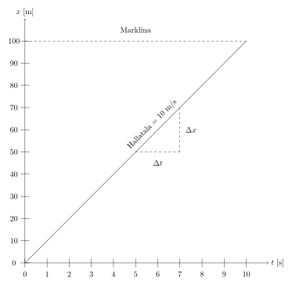
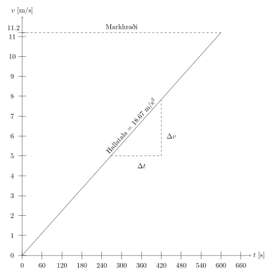

Hraði og hröðun
===============

Hraði
-----

*Hraði* (e. velocity) hlutar á hreyfingu er skilgreindur sem breyting á staðsetningu á tímaeiningu.
Algengast er að nota metra á sekúndu (m/s) í útreikningum, enda er það úr SI-einingakerfinu, en í daglegu tali er oft talað um kílómetra á klukkustund.

Táknum staðsetningu hlutar við tímann :math:`t_1` með :math:`x_1` og staðsetningu við tímann :math:`t_2` með :math:`x_2` þá reiknum við meðalhraðann með

.. math::
  v=\frac{x_2-x_1}{t_2-t_1}=\frac{\Delta x}{\Delta t}

.. note::
  Gríski stafurinn :math:`\Delta` (stórt delta) er oft notaður í eðlisfræði og stærðfræði til að tákna mismun og breytingar.

.. note::
  Hraði hefur bæði stærð og stefnu og er því :ref:`vigur <s.vigrar>` .
  Hraði getur verið í allar stefnur :math:`(x,y,z)` svo hraðavigurinn er yfirleitt táknaður með :math:`\overline{v}=(v_x, v_y, v_z)` .
  Í þessum kafla er fengist við einvíðar hreyfingar, þar sem allar færslur eru eftir sömu línunni, þ.e. aðeins einn þáttur hraðavigursins er ekki núll.

.. tip::

  Allra bestu hlaupararnir í 100 metra spretthlaupi klára hlaupið á um 10 sekúndum. Hver er meðalhraði hlauparanna í kílómetrum á klukkustund?

  **Lausn**

  Meðalhraði hlauparanna, í metrum á sekúndu, er:

  .. math::
    \frac{100\text{ m}}{10\text{ s}}=10\frac{\text{m}}{\text{s}}

  Breytum kílómetrum í metra og sekúndum í klukkustundir.
  Við vitum að :math:`1 \text{ km} = 1 \cdot 10^3 \text{ m} =1000 \text{ m}` og :math:`1 \text{ klst}=60 \text{ mínútur}=60\cdot60 \text{ sekúndur}=3600 \text{ sekúndur}`

  Því gildir að:

  .. math::
    \begin{aligned}
      \frac{1 \text{ km}}{1000 \text{ m}}&=1 \\
      \frac{1 \text{ klst}}{3600\text{ s}}&=1
    \end{aligned}

  Það má alltaf margfalda stærð með 1 og því getum við breytt :math:`10` m/s í km/klst með því að margfalda:

  .. math::
    \begin{aligned}
      10\frac{\text{ m}}{\text{ s}}&=10\frac{\text{ m}}{\text{ s}}\cdot \frac{1 \text{ km}}{1000 \text{ m}} \cdot \frac{3600\text{ s}}{1 \text{ klst}}\\
      &=\frac{10\cdot 1 \cdot 3600}{1000 \cdot 1} \frac{\text{ km}}{\text{ klst}} \\
      &=36 \frac{\text{km}}{\text{klst}}
    \end{aligned}

  því einingarnar styttast út.

-----------------------

.. eqt:: daemi-hradi1

  **Æfingadæmi** Hversu langt kemst maður sem gengur á hraðanum :math:`v=3 \text{ m/s}` á einni mínútu?

  A) :eqt:`I` 300 metra

  #) :eqt:`I` 3 metra

  #) :eqt:`C` 180 metra

  #) :eqt:`I` Ekkert af ofangreindu

  .. eqt-solution::
    Í einni mínútu eru 60 sekúndur. Við margföldum saman hraðann og tímann og fáum:

    .. math::
      60\text{ s} \cdot 3 \text{ m/s} = 180 \text{ m}

-----------------------

Hröðun
------
*Hröðun* (e. acceleration) hlutar á hreyfingu er skilgreindur sem breyting á hraða á tímaeiningu.
Ef hraði hlutar við tímann :math:`t_1` er :math:`v_1` og hraðinn við tímann :math:`t_2` er :math:`v_2` þá reiknum við hröðunina með:

.. math::
  a=\frac{v_2-v_1}{t_2-t_1}=\frac{\Delta v}{\Delta t}

Þegar hröðunin er núll þá er hraðinn fastur, þ.e. ekki að breytast með tíma.

.. note::
  Líkt og hraði þá er hröðun líka :ref:`vigur <s.vigrar>` með stærð og stefnu.
  Hröðunarvigurinn er yfirleitt táknaður með :math:`\vec{a}=(a_x,a_y,a_z)` .

  **Hröðunarvigurinn og hraðavigurinn eru ekki endilega samstefna.**

.. tip::
  Til þess að eldflaug geti komist úr þyngdarsviði jarðarinnar þarf hún að ferðast með hraðanum :math:`11.2` km/s.
  Hve mikla hröðun mun eldflaugin verða fyrir ef hún fer af stað úr kyrrstöðu og er komin í lausnarhraðann eftir 10 mínútur?

  **Lausn**

  10 mínútur eru 600 sekúndur, hér er því :math:`t_2=600` s og :math:`v_2=11.2` km/s :math:`=11200` m/s. Þar sem eldflaugin byrjar í kyrrstöðu er :math:`v_1=0` m/s og :math:`t_1=0`.
  Því þarf hröðunin að vera

  .. math::
    a=\frac{v_2-v_1}{t_2-t_1} =\frac{11200 \text{m/s}-0 \text{m/s}}{600 \text{s}-0\text{s}}=\frac{11200 \text{m/s}}{600\text{s}}=18.67 \text{m/s}^2

-----------------------

.. eqt:: daemi-hrodun

  **Æfingadæmi** Hver er hraði eldflaugar eftir tvær sekúndur ef hún byrjar með hraðann :math:`v_i=3\text{ m/s}` og hægir á sér með hröðuninni :math:`a=-1 \text{ m/s}^2`?

  A) :eqt:`C` :math:`v_f=1\text{m/s}`

  #) :eqt:`I` :math:`v_f=-1\text{m/s}`

  #) :eqt:`I` :math:`v_f=2\text{m/s}`

  #) :eqt:`I` Ekkert af ofangreindu

  .. eqt-solution::
    Hröðun er breyting á hraða á tímaeiningu, þ.e.

    .. math::

    	a=\frac{\Delta v}{\Delta t}

    Umritum þessa jöfnu og fáum

    .. math::

      \Delta v= a\Delta t = -1\frac{\text{m}}{\text{s}^2}\cdot 2\text{s} = -2\frac{\text{m}}{\text{s}}

    Þar sem :math:`\Delta v = v_f-v_i` þá sést að :math:`v_f = v_i+\Delta v = 3\text{ m/s}-2\text{ m/s}=1\text{ m/s}`

-----------------------

Myndræn túlkun
--------------

Sé *staðsetning* hlutar (:math:`x`) teiknuð upp sem fall af tíma (:math:`t`) þá táknar hallatala grafsins *hraða* hlutarins, enda er :math:`v=\frac{\Delta x}{\Delta t}`. Hér er það gert fyrir fyrra dæmið:

Gröf sem sýna staðsetningu sem fall af tíma eru oft kölluð :math:`x-t` gröf.

-----------------

Sé *hraði* hlutar (:math:`v`) teiknaður upp sem fall af tíma (:math:`t`) þá táknar hallatala grafsins *hröðun* hlutarins, enda er :math:`a=\frac{\Delta v}{\Delta t}`. Hér er það gert fyrir seinna dæmið:

Gröf sem sýna hraða sem fall af tíma eru oft kölluð :math:`v-t` gröf.

----------------

.. note::
  Á :math:`x-t` grafi þýðir lárétt lína að *staðsetning hlutarins sé föst*, þ.e. að staðsetning hans sé ekki að breytast. Þá hlýtur hraði hlutarins að vera núll (:math:`v=0`) því hallatala línunnar er núll.

  Á :math:`v-t` grafi þýðir lárétt lína að *hraði hlutarins sé fastur*, þ.e. að hraði hans sé ekki að breytast. Þá hlýtur hröðun hlutarins að vera núll (:math:`a=0`) því hallatala línunnar er núll.

.. tip::
  Blettatígur sér antílópu í 35 m fjarlægð og hleypur af stað.
  Einni sekúndu síðar hefur antílópan áttað sig á hættunni og hleypur af stað.
  Blettatígrar geta hlaupið á 99 km/klst (en aðeins í 100 metra sprettum) en antílópur geta hlaupið á hraðanum 81 km/klst og hafa þol í lengri vegalengdir.
  Ef gert er ráð fyrir hraðabreyting dýranna taki engan tíma (e. immediate, instantaneous), mun antílópan lifa af? Ef ekki, hvenær nær blettatígurinn bráðinni?

  **Lausn**

  Byrjum á að breyta í SI-einingar. Fyrir blettatígurinn:

  .. math::
    99 \frac{\text{ km}}{\text{ klst}}\cdot \frac{1\text{ klst}}{3600\text{ s}} \cdot \frac{1000\text{ m}}{1 \text{ km}} = \frac{99}{3.6} \frac{\text{m}}{\text{s}} = 27.5\frac{\text{m}}{\text{s}}

  Fyrir antílópuna:

  .. math::
    81 \frac{\text{ km}}{\text{ klst}} =  \frac{81}{3.6} \frac{\text{ m}}{\text{ s}} = 22.5\frac{\text{ m}}{\text{ s}}

  Á þessari fyrstu sekúndu kemst blettatígurinn 27.5 metrum nær antílópunni, þá eru 7.5 metrar á milli þeirra.
  Mismunurinn á hraða þeirra er :math:`27.5\frac{\text{ m}}{\text{ s}}-22.5\frac{\text{ m}}{\text{ s}}=5\frac{\text{ m}}{\text{ s}}` .
  Því myndi það taka blettatígurinn :math:`\frac{7.5\text{ m}}{5 \text{m/s}}=1.5 \text{ s}` að loka bilinu og ná antílópunni.
  Blettatígurinn nær antílópunni **2.5 sekúndum** eftir að hann hleypur af stað.

  Svona dæmi er oft þægilegt að leysa myndrænt. Hér er staðsetning dýranna teiknuð sem fall af tíma, en blái ferillinn táknar antílópuna og rauða blettatígurinn. Sjá má að hallatala rauða ferilsins er meiri en bláa, vegna þess að blettatígurinn hleypur hraðar en antílópan. Þar sem hallatölur línanna er ekki sú sama hljóta línurnar að skerast, ef blettatígurinn getur hlaupið nógu lengi. Blettatígurinn nær antílópunni þegar ferlarnir skerast en hefðu ferlarnir ekki skorist hefði antílópan komist undan. Tíminn :math:`t=3.6363` m/s er merktur inn því það er tíminn sem það tæki blettatígurinn að verða örmagna eftir sinn 100 metra sprett.

  .. figure:: ./myndir/hradi/antilopa.svg
    :align: center

.. _s.hreyfijofnur:

Augnablikshraði og augnablikshröðun
-----------------------------------

Ef það er hröðun í kerfinu þá er hraði hlutar ekki jafn allan tímann, en þarf að reikna *augnablikshraða* hlutarins.
Þá er hraðinn reiknaður með að skoða staðsetninguna með afar stuttu millibili, við tímann :math:`t` og :math:`t+h` þar sem :math:`h` er mjög lítil tala.
Það er það sama og að reikna *afleiðu* (diffra, deilda, e. differentiate) staðsetningarinnar m.t.t. tíma:

.. math::
  v=\lim_{h\to 0} \frac{x_{t+h}-x_{t}}{(t+h) - t} = \lim_{h\to 0}\frac{x_{t+h}-x_{t}}{h} = \frac{dx}{dt}

Sömuleiðis er *augnablikshröðun* hlutar afleiða hraðans m.t.t. tíma:

.. math::
  a=\lim_{h\to 0} \frac{v_{t+h}-v_{t}}{(t+h) - t} = \lim_{h\to 0}\frac{v_{t+h}-v_{t}}{h} = \frac{dv}{dt}

Út frá þessum skilgreiningum getum við leitt út *hreyfijöfnurnar* (e. kinematic equations) fyrir hlut sem hefur upphafsstaðsetningu :math:`x_0` , upphafshraða :math:`v_0` og fasta hröðun :math:`a`:

----------------------------------------------------

.. math::
    \begin{aligned}
      v&=v_0+a\cdot t \qquad &\text{Hraði sem fall af tíma} \\
      x&=x_0 + v_0 \cdot t + \frac{1}{2} a\cdot t^2 \qquad & \text{Staðsetning sem fall af tíma} \\
      v^2 &=v_0^2+2a\cdot (x-x_0) \qquad & \text{Tímaóháða jafnan} \\
      x-x_0 &=\frac{1}{2}(v_0 + v)\cdot t \qquad & \text{Færsla}
    \end{aligned}

----------------------------------------------------

.. admonition:: Útleiðsla á hreyfijöfnum
  :class: setning, dropdown

  Hröðun er afleiða hraðans og því má lýsa sem afleiðujöfnu:

  .. math::
    \begin{aligned}
      &\text{Upphaflega jafnan} &    a &=\frac{dv(t)}{dt} \\
      &\text{Umritum} &    dv(t) &=  a\cdot dt \\
      &\text{Heildum beggja vegna} &     \int_0^t dv &= a \cdot \int_0^t dt \\
      &\text{ } &       v(t)-v(0) &= a\cdot (t-0) \\
      &\text{} & v(t) &= a\cdot t +v_0
    \end{aligned}

  sem er einmitt jafnan fyrir hraða sem fall af tíma.

  Hraði er afleiða staðsetningarinnar :math:`v(t)=\frac{dx(t)}{dt}= a\cdot t +v_0`.

  .. math::
    \begin{aligned}
      &\text{Upphaflega jafnan} & \frac{dx(t)}{dt}&= a\cdot t +v_0\\
      &\text{Umritum}  &  dx(t) &=  (a\cdot t +v_0) dt\\
      &\text{Heildum} & \int_0^x dx &= \int_0^t (a\cdot t +v_0) dt \\
      &\text{ } & x(t)-x_0 &= \frac12 a\cdot t^2 + v_0 \cdot t \\
      & \text{ } & x(t) &= x_0 + v_0 \cdot t +\frac12 a\cdot t^2
    \end{aligned}

  sem er einmitt jafnan fyrir staðsetningu sem fall af tíma.

  Tímaóháðu jöfnuna má leiða út með því að setja saman þessar tvær jöfnur. Fyrst þarf að einangra tímann úr jöfnunni sem lýsir hraða sem fall af tíma og svo er hann settur inn fyrir tímann í jöfnunni sem lýsir staðsetningunni.

  .. math::
    \begin{aligned}
      &\text{} & v(t) &= a\cdot t +v_0 \\
      &\text{Umritum} &  t &= \frac{v-v_0}{a} \\
      &\text{Jafna fyrir } x(t) & x&=  x_0 + v_0 \cdot t +\frac12 a\cdot t^2 \\
      &\text{Setjum tímann inn}  &  x&=x_0+ v_0 \cdot \frac{v-v_0}{a} +\frac12 a\cdot \left( \frac{v-v_0}{a} \right)^2\\
      &\text{Margfalda inn í sviga} & x&=x_0+ \cdot \frac{v_0\cdot v-v_0^2}{a} +\frac{v^2+v_0^2-2v\cdot v_0}{2 a}\\
      &\text{Margfalda með 2}a & 2a\cdot x &= 2a\cdot x_0 +2v\cdot v_0 -2v_0 +v^2 +v_0^2- 2v\cdot v_0\\ 
      &  & 2a(x-x_0)&=v^2-v_0^2 \\
      & & v^2&=v_0^2 + 2a\cdot (x-x_0)
    \end{aligned}

.. tip::
  Bíll bíður á rauðu ljósi. Þegar ljósið verður grænt fær bíllinn samstundis hröðunina :math:`6 \frac{\text{ m}}{\text{ s}^2}` . Hve hratt fer hann eftir 5 sekúndur og hve langt í burtu er hann?

  **Lausn**

  Notum :ref:`hreyfijöfnurnar <s.hreyfijofnur>` :

  .. math::
    \begin{aligned}
      v&=v_0+a\cdot t = 0\frac{\text{ m}}{\text{ s}}+6 \frac{\text{ m}}{\text{ s}^2} \cdot 5\text{ s} \\
      v&= 30 \frac{\text{ m}}{\text{ s}}\\
      x&=x_0 + v_0 \cdot t + \frac{1}{2} a\cdot t^2 = 0\text{ m}+0\frac{\text{ m}}{\text{ s}}\cdot 5\text{ s} + \frac{1}{2}\cdot 6 \frac{\text{ m}}{\text{ s}^2} \cdot (5\text{ s})^2 \\
      x&= 75\text{ m}
    \end{aligned}

Afstæður hraði
--------------

*Afstæður hraði* (eða innbyrðis hraði, e. relative velocity) er hraði eins hlutar miðað við hreyfingar annars hlutar. Í raun er hraði alls afstæður, en við miðum langoftast við yfirborð jarðar þegar við tölum um hraða okkar, vindsins og bílanna í kringum okkur.

Þegar þú ekur eftir vegi virðast bílarnir sem fara hraðar en þú fara áfram en þeir sem fara hægar virðast vera að bakka, þó að einhver sem stendur í vegkantinum sér að allir bílarnir eru að keyra í sömu átt. Þegar tveir athugendur mæla hraða bíls sem er á hreyfingu munu þeir fá sömu niðurstöðu ef þeir eru sjálfir á hreyfingu, t.d. gangandi eða á hjóli, vegna þess að þeir væru að mæla hraða bílsins *miðað við sjálfa sig*. Athugendur mynda í kringum sig það sem við köllum *viðmiðunarkerfi* þar sem þeir geta mælt hraða og staðsetningu bílsins miðað við sjálfa sig.

Ef fyrirbærið :math:`P` er á hreyfingu miðað við viðmiðunarkerfi :math:`B` og :math:`B` er að hreyfast miðað við viðmiðunarkerfið :math:`A` þá er hraði fyrirbærisins :math:`P` miðað við :math:`A`:

.. math::

	v_{P/A} = v_{P/B} + v_{B/A}

þar sem :math:`v_{x/y}` er hraði :math:`x` miðað við kerfið :math:`y`.

.. tip::
  Reiðhjól og gangandi maður eru að ferðast í sömu átt. Reiðhjólið fer á hraðanum :math:`v_h=6 \text{ m/s}` (miðað við jörðina) en maðurinn á :math:`v_g=1 \text{ m/s}` (líka miðað við jörðina). Hver er hraði hjólsins miðað við manninn?

  **Lausn**

  Köllum nú jörðina :math:`A`, manninn :math:`B` og reiðhjólið :math:`P`. Þá er :math:`v_h=v_{P/A}` og :math:`v_g=v_{B/A}`.

  Við erum að leita að hraða :math:`P` miðað við :math:`B`, :math:`v_{P/B}`. Umritum jöfnuna :math:`v_{P/A} = v_{P/B} + v_{B/A}` og fáum

  .. math::

  	v_{P/B} = v_{P/A}-v_{B/A}

  Þannig að hraði hjólsins miðað við manninn er

  .. math::

  	v_{P/B} = v_{P/A}-v_{B/A} = 6 \text{ m/s} - 1 \text{ m/s} = 5 \text{ m/s}

Hraði ljóss og hljóðs
---------------------

Hljóð berst frá uppsprettu sinni til eyrna okkar með því að hrista efnið sem ber það (t.d. loft eða vatn), en hraði hljóðbylgnanna fer eftir því hvaða efni það er og hvert hitastig þess er. Hraði hljóðs í lofti við 20°C er:

.. math::

	v_{loft} = 344 \text{m/s}

en hraði hljóðs í vatni við 20°C er meira en fjórfalt hraðari:

.. math::

	v_{vatn} = 1480 \text{m/s}

Ljós er *rafsegulbylgjur* (e. electromagnetic waves) sem berast fra uppsprettu sinni til augna okkar með því að skapa truflanir í raf- og segulsviði. Ljós getur borist um tómarúm (en það getur hljóð ekki) en efni hægir örlítið á ljósi. Ljóshraði er hæsti hraði sem mögulegur er í heiminum, ekkert getur farið hraðar en ljós, en í lofttæmi er ljóshraðinn:

.. math::

	c = 3.00\cdot 10^8 \text{m/s}

Það er ekki aðeins sýnilegt ljós sem fer um á þessum ógnarhraða heldur gera útvarpsbylgjur (þ.m.t. þráðlaust netmerki, Wi-Fi) það líka.

--------------

.. eqt:: daemi-ljos

  **Æfingadæmi** Ef það eru :math:`1.496\cdot10^{11}\text{m}` til sólarinnar, hve langan tími líður milli þess að ljósið fer frá sólinni þar til það berst til okkar?

  A) :eqt:`I` 600 sekúndur

  #) :eqt:`I` :math:`4.5 \cdot 10^{11}\text{s}`

  #) :eqt:`C` 8.3 mínútur

  .. eqt-solution::
    Hraði er breyting á staðsetningu á tímabili, þ.e.

    .. math::

      v=\frac{\Delta x}{\Delta t}

    Umritum þessa jöfnu og fáum

    .. math::

      \Delta t=\frac{\Delta x}{v} =\frac{1.496\cdot10^{11}\text{m}}{3.00\cdot 10^8 \text{m/s}} = 498.7 \text{s}

    Breytum nú sekúndum í mínútur:

    .. math::

    	498.7\text{s} \cdot \frac{1 \text{mín}}{60 \text{s}} = 8.3 \text{mín}

------------------

Þyngdarhröðun
-------------

Allt sem er nálægt yfirborði jarðarinnar verður fyrir sömu hröðun í átt að miðju jarðarinnar (í daglegu tali köllum við þessa átt *niður*).
Við táknum þessa tilteknu hröðun, *þyngdarhröðun*, með :math:`g`.

Þyngdarhröðunin :math:`g` bendir alltaf í átt að miðju jarðar.
Stærð :math:`g` er dálítið mismunandi eftir staðsetningu, bæði hæð yfir miðju jarðar (lækkandi með hæð) og því á hvaða breiddargráðu mælt er (lægra við miðbaug en hærra við pólana) en á Íslandi er gildið við sjávarmál

.. math::
  g=9.82\frac{\text{ m}}{\text{ s}^2}

.. tip::
  Una stendur á Golden Gate brúnni í San Fransisco og ætlar að taka mynd af útsýninu. Þar er þyngdarhröðunin 9,80 m/s :math:`^2` .
  Henni bregður og missir símann sinn yfir handriðið, síminn steypist að yfirborði sjávarins, 67 metrum neðar.

  Hve hratt hreyfist síminn þegar hann skellur á yfirborðinu? Hve langan tíma tekur fallið?
  (Gera má ráð fyrir að síminn byrji í kyrrstöðu og að engin loftmótstaða sé).

  .. figure:: ./myndir/hradi/goldenuna.svg
    :width: 40%
    :align: center

  **Lausn**

  Notum :ref:`hreyfijöfnurnar <s.hreyfijofnur>` , fyrst tímaóháðu jöfnuna til að reikna hraðann:

  .. math::
    \begin{aligned}
      v^2 &= v_0^2 + 2a\cdot (x-x_0) = \left( 0\frac{\text{ m}}{\text{ s}}\right)^2+ 2\cdot g \cdot(67-0) \text{m}\\
      v^2 &= 1313.2 \frac{\text{ m}^2}{\text{ s}^2} \\
      v &= \sqrt{1313.2 \frac{\text{ m}^2}{\text{ s}^2}} = 36.2 \frac{\text{ m}}{\text{ s}}
    \end{aligned}

  Notum síðan hraðajöfnuna til að finna tímann sem fallið tekur:

  .. math::
    \begin{aligned}
      v&=v_0+a\cdot t \\
      t&=\frac{v-v_0}{a} = \frac{36.2 \frac{\text{ m}}{\text{ s}}}{9.80 \frac{\text{ m}}{\text{ s}^2}} \\
      t&=3.7 \text{s}
    \end{aligned}

  .. figure:: ./myndir/hradi/unasimi.svg
    :width: 20%
    :align: center

.. tip::

  Körfubolta er kastað beint upp með hraðanum :math:`v_0=5 \frac{\text{ m}}{\text{ s}}` .
  Hve hátt drífur boltinn?

  **Lausn**

  Boltinn ferðast upp á við, en þyngdarhröðunin togar í hann og hægir þannig á honum.
  Að endingu hefur þyngdarhröðunin hægt það mikið á honum að hann stoppar í augnablik áður en hann fellur á ný til jarðar.

  Höfum því upphafshraðann :math:`v_0=5 \frac{\text{ m}}{\text{ s}}`, lokahraðann :math:`v=0 \frac{\text{ m}}{\text{ s}}` og hröðun :math:`g=9.82\frac{\text{ m}}{\text{ s}^2}`.
  Upphafleg staðsetning boltans er :math:`x_0=0`, en við leitum að hæðinni :math:`x` .

  Hér þarf að fara varlega með formerki! Við vitum að hröðunin stefnir niður en upphafshraðinn upp. Því reiknum við með :math:`g` sem neikvæðri tölu.

  .. math::
    \begin{aligned}
      v^2 &=v_0^2+2a\cdot (x-x_0)\\
      \left(0 \frac{\text{ m}}{\text{ s}}\right) &= \left(5 \frac{\text{ m}}{\text{ s}}\right)^2+2\cdot(-9.82\frac{\text{ m}}{\text{ s}^2}) \cdot(x-0 \text{m}) \\
      x &= \frac{\left(5 \frac{\text{ m}}{\text{ s}}\right)^2}{-2\cdot(-9.82\frac{\text{ m}}{\text{ s}^2})} = 1.27 \text{ m}
    \end{aligned}

  .. figure:: ./myndir/hradi/asakarfa.svg
    :width: 20%
    :align: center

.. tip::
  SpaceX ætlar að skjóta upp eldflaug.
  Vélar eldflaugarinnar gefa henni hröðun :math:`a_1=30.0\text{ m/s}^2` upp á við.
  Eftir 10 sekúndur bila vélarnar og eldflaugin verður í frjálsu falli.

  * Hve langt kemst skutlan upp áður en hún tekur að falla í átt að jörðu?
  * Hver verður hraði eldflaugarinnar þegar hún brotlendir aftur á jörðinni?
  * Hvenær brotlendir hún á jörðinni?

  **Lausn**

  Munum að allir hlutir nálægt yfirborði jarðar fá hröðunina :math:`g=9.82\text{ m/s}^2` , sama hvort þeir eru á hreyfingu eða verða fyrir öðrum hröðunum.
  Við gerum ráð fyrir að eldflaugin fari ekki mjög langt og verði þess vegna fyrir þeirri hröðun allan tímann.
  Heildarhröðunin á eldflaugina á meðan kveikt er á vélunum er því :math:`a_1-g=30.0\text{ m/s}^s-9.8\text{ m/s}^2 = 20.2\text{ m/s}^2` .
  Skiptum reikningum okkar upp í nokkra hluta (0 er upphafsástand, 1 er þegar vélarnar bila, 2 er þegar flaugin er í hámarkshæð og 3 þegar hún brotlendir).

  Notum nú :ref:`hreyfijöfnurnar <s.hreyfijofnur>` til að reikna hve hratt flaugin fer þegar vélarnar bila.

  .. math::
    \begin{aligned}
      v_1&=v_0+a\cdot t_1 \\
      v_1&=v_0+(a_1-g)\cdot t_1 \\
      v_1&= 0 \text{ m/s} + (30\text{ m/s}^s-9.82\text{ m/s}^2) \cdot 10 \text{ s} \\
      v_1 &= 201.8 \text{ m/s} \\
    \end{aligned}

  Þá er eldflaugin í hæðinni:

  .. math::
    \begin{aligned}
      x_1&=x_0 + v_0 \cdot t_1 + \frac{1}{2} a\cdot t_1^2 \\
      x_1&=x_0 + v_0 \cdot t_1 + \frac{1}{2} (a_1-g)\cdot t_1^2 \\
      x_1&= 0\text{ m} + 0 \text{ m/s} \cdot 10 \text{ s} +\frac12 (30\text{ m/s}^s-9.82\text{ m/s}^2) \cdot (10 \text{ s})^2 \\
      x_1&=1009 \text{ m}\\
    \end{aligned}

  .. figure:: ./myndir/hradi/flokid2.svg
    :align: center
    :width: 50%

  Þegar vélarnar bila er flaugin í :math:`1009 \text{ m}` hæð yfir yfirborði, ferðast upp á við með hraðanum :math:`201.8 \text{ m/s}` og verður fyrir þyngdarhröðuninni :math:`g= 9.82 \text{ m/s}` *niður á við*.
  Reiknum nú hvenær hraði flaugarinnar er orðinn :math:`v_2=0 \text{ m/s}` .

  .. math::
    \begin{aligned}
      v_2&=v_1+a\cdot t_2 \\
      v_2&=v_1-g\cdot t_2 \\
      t_2&=\frac{v_2-v_1}{-g} = \frac{0 \text{ m/s}-201.8 \text{ m/s}}{-9.82 \text{ m/s}^2}\\
      t_2&=20.5 \text{ s}
    \end{aligned}

  Þá er eldflaugin í hæðinni:

  .. math::
    \begin{aligned}
      x_2 &= x_1 + v_1 \cdot t_2 + \frac{1}{2} (-g)\cdot t_2^2 \\
      x_2 &= 1009 \text{ m} + 201.8 \text{ m/s} \cdot 20,5 \text{ s} - \frac12 \cdot 9.82 \text{ m/s}^2 \cdot (20,5 \text{ s})^2 \\
      x_2 &= 3082 \text{ m} \\
    \end{aligned}

  .. figure:: ./myndir/hradi/flokid3.svg
    :align: center
    :width: 45%

  Nú byrjar hún að falla til jarðarinnar úr þessari hæð.
  Hún hefur enn hröðunina :math:`g=9.82\text{ m/s}^2` niður á við. Notum tímaóháðu jöfnuna:

  .. math::
    \begin{aligned}
      v_3^2 &=v_2^2+2(-g)\cdot (x_0-x_2) \\
      v_3&= \pm \sqrt{0\text{ m/s} + 2\cdot (-9.82\text{ m/s}^2)(0\text{ m} - 3082\text{ m} )    } \\
      v_3 &= - 246 \text{ m/s}
    \end{aligned}

  Veljum neikvætt formerki á :math:`v_3` kemur vegna þess að hraðinn stefnir niður á við.
  Reiknum að lokum hve langan tíma fallið til jarðarinnar tekur:

  .. math::
    \begin{aligned}
      x_0-x_2 &=\frac{1}{2}(v_2 + v_3)\cdot t_3\\
      t_3 &= \frac{x_0-x_2}{\frac12 (v_2 + v_3)} \\
      t_3 &= \frac{0-3082\text{ m}}{\frac12 (0 - 246 \text{ m/s})} \\
      t_3 &= 25 \text{ s}\\
    \end{aligned}

  Þessi misheppnaða svaðilför eldflaugarinnar tekur hana því :math:`t_1+t_2+t_3=55.5 \text{s}` .

  .. image:: ./myndir/hradi/flokid.svg
    :width: 60 %
    :align: center

--------------

.. eqt:: daemi-gravity

  **Æfingadæmi** 
        Jón kastar bolta beint upp í loftið með hraðann :math:`v_i`. Hver er hraði boltans þegar Jón grípur hann aftur? (Gerum ráð fyrir engri loftmótsstöðu)

  A) :eqt:`C` Hraðinn við lendingu er sá sami, :math:`v_f=v_i`

  #) :eqt:`I` Boltinn fer hraðar þegar hann lendir, :math:`v_f>v_i`

  #) :eqt:`I` Boltinn fer hægar þegar hann lendir, :math:`v_f<v_i`

  #) :eqt:`I` Jón mun aldrei grípa boltann

  .. eqt-solution:: 
    
    Þegar boltanum er kastað þá hefur hann upphafshraðann :math:`v` en þyngdarhröðunin :math:`g` hægir á honum þar til hann stoppar í tiltekinni hæð. Þá snýr boltinn við og byrjar að falla til jarðar. Á tímanum sem það tekur boltann að falla niður sömu vegalengd þá eykur þyngdarhröðunin :math:`g` hraða boltans jafn mikið og hún hægði á boltanum á leiðinni upp. Þess vegna er hraði boltans sá sami í upphafi og í lokin, þó :math:`v_i` og :math:`v_f` bendi í gagnstæðar stefnur.

    .. figure:: ./myndir/hradi/bolti.svg
      :width: 75 %
      :align: center
