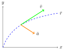
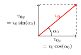
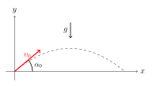
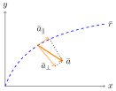

Hreyfing í tveimur víddum
=========================
Hingað til hefur verið fjallað um einvíða hreyfingu, þar sem staðsetning, hraði og hröðun eru öll eftir sömu beinu línunni.
Í eðlisfræði er hins vegar nauðsynlegt að geta lýst hreyfingu í tveimur og jafnvel þremur víddum.

Hlutur á hreyfingu hefur breytilega staðsetningu sem táknuð má með ferli í hnitakerfi.

Hraði hlutarins er snertill við feril hlutarins og
hröðun hans bendir alltaf inn í kúpta hluta ferilsins.

Ferillinn er bein lína ef hraði hlutarins hefur fasta stefnu, þ.e. hluturinn hefur enga hröðun eða ef hröðunin er samsíða hreyfingunni. Ef hröðunin er ekki samsíða hreyfingunni þá veldur hún breytingu á stefnu hraðans og þá beygir ferillinn í átt að ferlinum.

Hröðunarvigurinn segir til um hvernig hraðinn og stefna hans eru að breytast.

Afstæður hraði
--------------

Jafnan fyrir afstæða hreyfingu gildir líka í fleiri víddum, en þá notum við vigra:

.. math::

	\overline{v}_{P/A} = \overline{v}_{P/B} + \overline{v}_{B/A}

.. tip::
  Flugvél setur stefnuna beint norður á við og flýgur á hraðanum :math:`v_f= 20 \text{ m/s}` (miðað við loftið). Loftið flæðir til austurs með stífri vestanátt, :math:`v_v =15\text{ m/s}`, sem vélin berst með. Hver er hraði flugvélarinnar og stefna hraðans miðað við jörðu?

  **Lausn**

  Köllum nú flugvélina :math:`P`, vindinn :math:`B` og jörðina :math:`A`.
  Hér notum við vigursamlagningu. Hreyflar vélarinnar gefa henni hraða :math:`v_f` í stefnu norður (stefnu :math:`y` - áss). Þá er:

  .. math::

  	\overline{v}_{P/B} = \begin{pmatrix} 0 \\ v_f \end{pmatrix} = \begin{pmatrix} 0 \\ 20  \end{pmatrix} \text{m/s}

  Vindurinn blæs frá vestri til austurs, til hægri (í stefnu :math:`x` - áss). Því er:

  .. math::

  	\overline{v}_{B/A} = \begin{pmatrix} v_v \\ 0 \end{pmatrix} = \begin{pmatrix} 15 \\ 0 \end{pmatrix} \text{m/s}

  Leggjum nú saman vigrana :math:`\overline{v}_f` og :math:`\overline{v}_v`:

  .. math::
    \begin{aligned}
  	\overline{v}_{P/A} &= \overline{v}_{P/B} + \overline{v}_{B/A} \\
    &= \begin{pmatrix} 0  \\ 20 \end{pmatrix} \text{m/s} + \begin{pmatrix} 15 \\ 0 \end{pmatrix} \text{m/s} \\
    &= \begin{pmatrix} 15 \\ 20 \end{pmatrix} \text{m/s}
    \end{aligned}

  .. figure:: ./myndir/2d/flugvel.svg
    :align: center
    :width: 35%

  Hraði flugvélarinnar miðað við jörðina er því lengdin á :math:`\overline{v}_{P/A}`:

  .. math::
    \begin{aligned}
  	|\overline{v}_{P/A}| &= \sqrt{(15\text{ m/s})^2+(20\text{ m/s})^2} \\
    &=\sqrt{625 (\text{m/s}})^2 \\
    &= 25 \text{ m/s}
    \end{aligned}

  Vélin er því að fara á :math:`25\text{ m/s}`, en stefna hraðans er í norðaustur.

Kasthreyfing
------------

*Kasthreyfing* (e. projectile motion) er þegar hlutur er á hreyfingu í þyngdarsviði, fær upphafshraða í tiltekna stefnu og verður ekki fyrir neinni hröðun nema þyngdarhröðun.
Í okkar einfölduðu kerfum er gerum við ráð fyrir að loftmótstaða sé engin og þá verða allir *kastferlar* (e. trajectories) hluti af fleygboga, eins og við munum leiða út á eftir.

.. tip::
  Tveir eins boltar eru látnir falla til jarðar úr sömu hæð, bolta 1 er sleppt úr kyrrstöðu en bolta 2 er kastað lárétt áfram.
  Gerum ráð fyrir engri loftmótstöðu.
  Hvor boltanna lendir á undan?

  **Lausn**

  Á báða boltana verkar sama þyngdarafl, svo þeir fá sömu hröðun niður sem nemur þyngdarhröðuninni og fá báðir sívaxandi hraða niður á við.

  Bolti 1 mun því hreyfast lóðrétt niður á við.
  Bolti 2 mun halda áfram að hreyfast lárétt því hann verður ekki fyrir neinni hröðun í lárétta stefnu (þetta er afleiðing :ref:`fyrsta lögmáls Newtons <s.newton>`).
  Hröðunin sem bolti 2 verður fyrir lóðrétt hefur engin áhrif á lárétta hreyfingu hans (og lárétta hreyfingin hefur engin áhrif á lóðrétta hröðun).

  Boltarnir tveir byrjuðu báðir með sama lóðrétta hraðann (engan) og verða fyrir sömu lóðréttu hröðuninni.
  Þeir ferðast því samtímis niður á við og lenda því *á sama tíma*.

  .. image:: ./myndir/2d/tveirboltar.svg
    :align: center
    :width: 40%

  Ferill bolta 1 er lóðrétt strik en ferill bolta 2 er fleygbogi, því hann hefur hreyfingu í tvær stefnur.

Við lausn dæma um kasthreyfingar eru :ref:`hraðajöfnurnar<s.hreyfijofnur>` notaðar.
Það borgar sig að teikna mynd til að átta sig á dæminu.
Þá þarf að ákveða hnitakerfi, en venjan er að hafa :math:`x`-ás láréttan og :math:`y`-ás lóðréttan þannig á þyngdarhröðun bendi niður.
Upphafspunkt hnitakerfisins er þægilegast að setja í upphaf kastins, enda geta hnitin :math:`(x_0,y_0)=(0,0)` einfaldað reikning töluvert.
Eina hröðunin sem er í þessu kerfi er þyngdarhröðunin og því er :math:`a_x=0` og :math:`a_y=-g`
Þá eru jöfnurnar fyrir staðsetningu sem fall af tíma eftirfarandi:

.. math::
  \begin{aligned}
    x &= x_0 + v_{0,x} \cdot t \\
    y &= y_0 + v_{0,y} \cdot t - \frac{1}{2} g \cdot t^2
  \end{aligned}

.. tip::
  Sagan segir að landið Gambía á vesturströnd Afríku hafi orðið til þegar breski flotinn sigldi upp Gambíuána, skaut úr fallbyssum sínum á báða borða og eignuðu sér landið innan færis fallbyssanna.
  Ef upphafshraði fallbyssukúlu er :math:`\overline{v} = (v_x, v_y) = (50,42)` m/s, hversu breið yrði Gambía?

  **Lausn**

  Byrjum á að teikna mynd.
  Stillum hnitakerfinu upp þannig að fallbyssan sé í :math:`(x_0,y_0) = (0,0)`, x-ásinn liggi út frá ánni í skotstefnuna og y-ásinn er upp.
  Gerum ráð fyrir að hæð lendingarstaðarins sé jöfn hæð fallbyssunnar, þ.e. :math:`y_1=0` .
  Takið eftir að :math:`y`-ásinn er skilgreindur upp en þá er þyngdarhröðunin neikvæð (:math:`a=-g=-9.8 \text{m/s}^2`).

  .. image:: ./myndir/2d/gambia.svg
    :align: center
    :width: 60%

  Köllum lokahnit kúlunnar þegar hún lendir :math:`(x_1,y_1)` en þar sem við vitum að hún endar á yfirborði jarðarinnar þá er :math:`y_1=0`, þ.a. lokahnit kúlunnar eru :math:`(x_1,y_1) = (x_1,0)`.
  Finnum hve lengi kúlan er í loftinu með því að finna tímann :math:`t_1` þegar :math:`y_1=0` .

  .. math::
    \begin{aligned}
      y_1 &= y_0 + v_{0,y} \cdot t - \frac{1}{2} g \cdot t^2 \\
      0 &= 0 + v_{0,y} \cdot t - \frac{1}{2} g \cdot t^2
    \end{aligned}

  Þetta er annars stigs margliða sem hefur tvær lausnir. Önnur lausnin er að :math:`t=0` en við höfum ekki áhuga á þeirri lausn af því hún er bara upphaf kasthreyfingarinnar. Hin lausnin er

  .. math::

  	t_1=\frac{v_{0,y}}{\frac{1}{2} g} = \frac{42\text{m/s}}{\frac{1}{2}\cdot 9.8\text{m/s}^2} = 8.58\text{s}

  Nú getum við notað sömu hreyfijöfnu, í þetta skipti fyrir :math:`x`-hnitin, til að finna hversu langt fallbyssan drífur.

  .. math::
    \begin{aligned}
      x_1 &= x_0 + v_0 \cdot t_1\\
      &= 0 + 50 \cdot 8.58  \\
      &= 429 \text{ m}
    \end{aligned}

  Fallbyssukúlan lendir því 429 metrum frá ánni og breidd Gambíu er tvöföld sú lengd: 858 m.

Finnum nú jöfnu fyrir ferlinum sem hlutur ferðast eftir í loftinu og sannfærum okkur um að hann sé fleygbogi.
Skoðum hlut sem hefur upphafshraða :math:`\overline{v}_0` í stefnu hornsins :math:`\alpha_0` og upphafsstaðsetningu :math:`(x_0,y_0)=(0,0)` .

Byrjum á því að liða :math:`\overline{v}_0` í :math:`x` - og :math:`y` - stefnu.

.. math::
  \begin{aligned}
    v_{0x} &= v_0\cos(\alpha_0) \\
    v_{0y} &= v_0\sin(\alpha_0)
  \end{aligned}

Því næst notum við :ref:`hreyfijöfnurnar <s.hreyfijofnur>`.
Hröðunin í :math:`x` - stefnu er núll svo staðsetningin í :math:`x` - stefnu er

.. math::
  x=v_{0x} t = v_0\cos(\alpha_0)t

Hröðunin í :math:`y` - stefnu er :math:`a_y=-g` svo staðsetningin í :math:`y-` stefnu er:

.. math::
  y=v_{0y} t - \frac{1}{2}gt^2 = v_0\sin(\alpha_0) t- \frac{1}{2}gt^2

Einangrum :math:`t` út frá jöfnunni fyrir :math:`x`: :math:`t=x/(v_0\cos(\alpha_0))` og setjum inn í jöfnuna fyrir :math:`y` . Þá fæst

.. math::
  \begin{aligned}
    y& =v_0\sin(\alpha_0)t - \frac{1}{2}gt^2 \\
    y&= v_0\sin(\alpha_0) \cdot \frac{x}{v_0\cos(\alpha_0)} - \frac{1}{2}g  \left(\frac{x}{v_0\cos(\alpha_0)}\right)^2\\
    y&= \frac{\sin(\alpha_0)}{\cos(\alpha_0)} x - \frac{1}{2}g \frac{x^2}{v_0^2\cos^2(\alpha)} \\
    y&=\tan(\alpha_0) x - \frac{g}{2v_0\cos^2(\alpha_0)}x^2
  \end{aligned}

Ferill hlutar í kasthreyfingu hefur því lögun fleygboga :math:`y=ax^2+bx+c` þar sem

.. math::
  \begin{aligned}
    a&=-\frac{g}{2v_0\cos^2(\alpha_0)}\\
    b&=\tan(\alpha_0) \\
    c&=0
  \end{aligned}

------------------------

Út frá jöfnunni fyrir ferlinum er meðal annars hægt að sjá hvar hluturinn lendir.
Þá finnum við fyrir hvaða :math:`x` hæð boltans :math:`y` er núll, sem gerist tvisvar: í upphafi (:math:`x=0`) og þegar

.. math::
  \begin{aligned}
    x&=\frac{2\tan(\alpha_0)v_0^2\cos^2(\alpha_0)}{g}\\
    &=\frac{2\sin(\alpha_0)\cos(\alpha_0)v_0^2}{g} \\
    &= \frac{\sin(2\alpha_0)v_0^2}{g} \\
  \end{aligned}

því :math:`\sin(2\alpha)=2\sin(\alpha)\cos(\alpha)` .

------------------------

Það er líka hægt að finna hámarkshæð hlutar í kasthreyfingu með því að finna hágildi þessarrar jöfnu.
Þá finnum við hvar afleiða fallsins með tilliti til :math:`x` er núll.

Afleiðan er

.. math::
  y'=\tan(\alpha_0)-\frac{g}{v_0^2\cos^2(\alpha_0)}x

Hápunktur fleygbogans er því þegar :math:`y'=0` eða:

.. math::
  \begin{aligned}
    x&=\frac{\tan(\alpha_0)v_0^2\cos^2(\alpha_0)}{g} \\
    &= \frac{\sin(\alpha_0)\cos(\alpha_0) v_0^2}{g}\\
    &= \frac{\sin(2\alpha_0)v_0^2}{2g}
  \end{aligned}

.. ggb:: mkyudgwh

.. note::
  Munið að eðlisfræði gengur ekki út á að muna jöfnur, heldur að kunna hvernig og hvenær á að nota þær.
  Til dæmis er ástæðulaust að leggja mikla vinnu í að muna þessar formúlur, þegar það er lítið mál að leiða þær út frá hreyfijöfnunum eða að fletta þeim upp.
  Við lausn bæði heimavekefna og prófdæma þá munið þið alltaf hafa aðgang að formúlublaði.

-------------------

.. eqt:: daemi-kast

  **Æfingadæmi** Hvað þarf kasthornið :math:`\alpha_0` að vera til þess að kasta sem lengst fyrir fastan upphafshraða :math:`v_0`?

  A) :eqt:`I` :math:`60^{\circ}`

  #) :eqt:`C` :math:`45^{\circ}`

  #) :eqt:`I` :math:`30^{\circ}`

  #) :eqt:`I` Ekkert af ofangreindu

  .. eqt-solution::
    Við höfum leitt út jöfnu fyrir lengd kasts:

    .. math::
      x= \frac{\sin(2\alpha_0)v_0^2}{g}

    Til þess að finna fyrir hvaða horn :math:`x` verður sem stærst þá diffrum við jöfnuna m.t.t. :math:`\alpha_0` og finnum fyrir hvaða :math:`\alpha_0` niðurstaðan er núll:

    .. math::

    	\frac{dx}{d\alpha_0} = \frac{v_0^2}{g} \cos(2\alpha_0) \cdot 2

    Þá vitum við að :math:`\frac{dx}{d\alpha_0}=0` ef :math:`\cos(2\alpha_0)=0` (af því allar hinar stærðirnar eru fastar, óháðar :math:`\alpha_0`).

    :math:`\cos(\theta)=0` ef :math:`\theta=90 ^{\circ}+ h\cdot 180 ^{\circ}` þar sem :math:`h` er heiltala. Hjá okkur er :math:`\theta=2\alpha_0` svo kastlengdin er mest þegar :math:`\alpha_0=45^{\circ} + h\cdot 90 ^{\circ}`. Við sjáum að lausnin :math:`\alpha_0=45^{\circ}` (þ.e. :math:`h=0`) er eina lausnin sem kemur til þar sem hinar kasta í allt aðrar áttir en þá sem við erum að skoða.

    Þið gætuð líka hafa fundið út úr þessu með því að prófa mismunandi horn í smáforritinu hér að ofan.

-------------------

Hringhreyfing
-------------

Hröðunarvigurinn :math:`\overline{a}` hefur stefnu sem er óháð stefnu hraðavigursins :math:`\overline{v}`, en segir til um hvernig hraðavigurinn er að breytast.
Þægilegt er að vinna með hröðunarvigurinn :math:`\overline{a}` í tveimur hlutum, annars vegar þáttinn samsíða hraðavigrinum (:math:`a_\parallel`)
og hins vegar hornrétta þáttinn (:math:`a_\perp`) en þættir hröðunarvigursins hafa mismunandi áhrif á hraðavigurinn.

:math:`a_\parallel` hefur bara áhrif á lengd hraðavigursins, sem oft er kölluð *ferð* hlutarins (e. speed).

:math:`a_\perp` hefur bara áhrif á stefnu hraðavigursins, þ.e. segir til um hvernig hluturinn er að beygja.

Ef hlutur hefur bara hröðun sem er hornrétt á hraðavigurinn (:math:`a_\parallel =0`) þá beygir hluturinn endalaust í sömu áttina en lengd hraðavigursins er föst, þ.e. *ferð* hlutarins er fasti. Úr verður *jöfn hringhreyfing* (e.uniform circular motion).

.. tip::

  Hringekja snýst með jöfnum hraða.
  Barn á hringekjunni hefur hraðavigur sem er snertill við hringinn í staðsetningu barnsins.
  Þar sem snúningshraðinn er jafn er ferð barnsins fasti, en hraðavigurinn er samt sem áður stöðugt að breytast.
  Stefnan er það eina sem breytist svo barnið hlýtur að hafa hröðun sem er hornrétt á hraðann, þ.e. beint inn að miðjunni.

  .. figure:: ./myndir/2d/hringekja.svg
    :align: center
    :width: 40%

  Þessi hröðun kallast *miðsóknarhröðun* (e.centripetal acceleration).

Um jafna hringhreyfingu gilda eftirfarandi jöfnur:

.. math::
  \begin{aligned}
    v &= \frac{2 \pi R}{T} \\
    |\overline{a}|= a_\perp &= \frac{v^2}{R}\\
    &= \frac{4 \pi^2 R}{T^2}
  \end{aligned}

Þar sem :math:`R` er radíus hringferilsins og :math:`T` er umferðartíminn (tíminn sem það tekur að fara einn hring).

------------------------

.. eqt:: daemi-hring

  **Æfingadæmi** Hvaða miðsóknarhröðun finnur barn fyrir á hringekju sem fer nákvæmlega 7 hringi á mínútu ef það situr 2.00 metra frá snúningsásnum?

  A) :eqt:`C` :math:`1.07 \text{ m/s}^2`

  #) :eqt:`I` :math:`9.21 \text{ m/s}^2`

  #) :eqt:`I` :math:`2.15 \text{ m/s}`

  #) :eqt:`I` :math:`0.342 \text{ m/s}^2`

  .. eqt-solution::

    Notum jöfnu fyrir jafna hringhreyfingu: :math:`|\overline{a}|= \frac{4 \pi^2 R}{T^2}`. Finnum umferðartímann :math:`T` sem segir okkur hve margar sekúndur það tekur hringekjuna að fara einn hring. Við vitum að hringekjan fer :math:`7` hringi á einni mínútu, þ.e. 60 sekúndum. Það tekur því :math:`T= 60/7 \text{s}` að fara einn hring. Þá fáum við:

    .. math::

    	|\overline{a}|= \frac{4 \pi^2 R}{T^2} = \frac{4\pi^2 \cdot (2\text{ m})}{(\frac{60 \text{ s}}{7})^2} = 1.07 \text{ m/s}^2

------------------------

Þegar hlutur í hringhreyfingu hefur ekki fasta ferð er talað um *ójafna hringhreyfingu* (e.nonuniform circular motion).
Þá er hröðunarvigurinn ekki hornréttur á hraðann og lengd hraðavigursins breytileg með tíma.

Takið eftir að stærðirnar :math:`\frac{d |\overline{v}|}{dt}` og :math:`\Bigl|\frac{d \overline{v}}{dt}\Bigr|` eru ekki endilega jafnar.
Sú fyrri, afleiða ferðarinnar :math:`|\overline{v}|`, er sá þáttur hröðunarinnar sem er samsíða hraðanum, :math:`a_{\parallel}`.
Hún er núll í jafnri hringhreyfingu þar sem ferðin er fasti.
Sú seinni er stærð afleiðu hraðans sem er stærð hröðunarvigursins.
Hún er aðeins núll þegar hraðavigurinn er fasti, þ.e. þegar engin hröðun er. Þá ferðast hluturinn í beina línu með föstum hraða.

.. tip::
  Lykkja á rússíbana er dæmi um ójafna hringhreyfingu.
  Ferð rússíbanavagnsins er ekki fasti á meðan hann ferðast eftir lykkjunni, heldur er mest neðst og minnst efst.
  Takið eftir hvernig hröðunavigurinn breytist og reynið að sjá fyrir ykkur þætti hans á mismunandi stöðum í lykkjunni.

  .. figure:: ./myndir/vinna/nonuniform.svg
    :width: 40%
    :align: center
