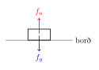
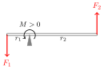

Kraftar
=======

*Kraftur* (e. force) er orð sem við notum um samspil hluta sem veldur breytingu á hreyfingu þeirra, þ.e. valda því að hlutirnir fá hröðun. Kraftar eru :ref:`vigrar <s.vigrar>`, sem þýðir að þeir hafa  *bæði stærð og stefnu*.
SI- einingin fyrir krafta er *Newton*, táknað :math:`\text{N}`. Eitt Newton er sá kraftur sem þarf til þess að gefa :math:`1 \text{ kg}` massa hröðunina :math:`1 \frac{\text{m}}{\text{s}^2}` .
Kraftar eru margfeldi massa og hröðunar og því má skrifa eininguna Newton sem :math:`1\text{ N} = 1 \text{ kg}\cdot \frac{\text{m}}{\text{s}^2}` .

.. note::
  Athugið að í eðlisfræði er *massi* ekki það sama og þyngd, þó að í daglegu tali sé þyngd oft notað fyrir bæði.

  *Massi* (e. mass) hlutar lýsir því hve mikið efni er í honum og er eins sama hvar í alheiminum hann er. SI-eining massa er kílógramm.

  *Þyngd* (e. weight) hlutar er stærð þyngdarkraftsins sem á hann verkar, þ.e. margfeldi massans við þyngdarhröðunina :math:`g`. SI-eining þyngdar er Newton.

Kraftar eru oftast táknaðir með :math:`F` eða :math:`f`, frá enska heitinu *force*. :math:`F` er þá táknið fyrir þyngdarkraft og aðra krafta sem beitt er á hluti en :math:`f` táknar viðbragðskrafta eins og t.d. núning.

.. tip::
  Skoðum samlagningu kraftvigra.
  Inga og Gunna eru í reipitogi. Inga togar í reipið beint til vinstri með kraftinum :math:`F_I=1000 \text{N}` en Gunna beint til hægri með kraftinum :math:`F_G = 1200 \text{N}`. Í hvaða átt hreyfist reipið?

  **Lausn**
  Þar sem krafar Ingu og Gunnu eru vigrar notum við vigursamlagningu til þess að skoða hver heildarkrafturinn er á reipið.

  .. figure:: ./myndir/kraftar/reipitog.svg
    :align: center
    :width: 70%

  Kraftvigur Ingu bendir til vinstri, þ.a. :math:`x` hnit hans er neikvætt.

  .. math::
    \overline{F}_I = \begin{pmatrix} -1000 \\ 0 \end{pmatrix} \text{N}

  Kraftvigur Gunnu bendir til hægri, þ.a. :math:`x` hnit hans er jákvætt.

  .. math::
    \overline{F}_G = \begin{pmatrix} 1200 \\ 0 \end{pmatrix}  \text{N}

  Leggjum nú saman vigrana:

  .. math::
    \begin{aligned}
    \overline{F}_{net} &= \overline{F}_I + \overline{F}_G \\
    &= \begin{pmatrix} -1000 \\ 0 \end{pmatrix}  \text{N} + \begin{pmatrix} 1200 \\ 0 \end{pmatrix}  \text{N} \\
    &= \begin{pmatrix} 200 \\ 0 \end{pmatrix}  \text{N}
    \end{aligned}

  Samanlagður krafturinn sem verkar á reipið er því :math:`F_{net}=\begin{pmatrix} 200 \\ 0 \end{pmatrix} \text{N}`. Reipið mun því hreyfast til hægri og Gunna vinnur reipitogið. Þetta kemur okkur ekkert á óvart, enda togar hún fastar í reipið.

.. _s.newton:

Lögmál Newtons
--------------
Enski eðlisfræðingurinn `Isaac Newton <https://is.wikipedia.org/wiki/Isaac_Newton>`_ setti fram þrjú lögmál um krafta á 17. öld, en þau mynda grunn þess hluta eðlisfræðinnar sem er kölluð aflfræði (e. classical mechanics).

Fyrsta lögmál Newtons
~~~~~~~~~~~~~~~~~~~~~
"Hlutur sem enginn kraftur verkar á helst kyrr eða ferðast áfram á jöfnum hraða."

Þetta lögmál er oft nefnt **tregðulögmálið** og segir m.a. að bolti muni liggja kyrr á jörðinni þangað til einhver sparkar í hann og að boltinn muni halda áfram að rúlla endalaust, nema núningur hans við grasflötina hægi á honum.

Kraftar valda hröðun svo að tregðulögmálið gildir þegar enginn kraftur er til staðar eða þegar allir kraftarnir sem eru ýta hver á móti öðrum.
Hröðun er afleiða hraðans, svo ef hröðunin er núll þá er hraðinn :math:`\overline{v}` er fasti, svo hluturinn er annað hvort kyrr eða ferðast á jöfnum hraða.

.. _s.lnII:

Annað lögmál Newtons
~~~~~~~~~~~~~~~~~~~~
"Kraftur sem verkar á hlut er margfeldi massa hlutarins og hröðunar sem hann verður fyrir."

.. math::
   \overline{F} = m \overline{a}

Kraftur og hröðun eru vigrar sem hafa sömu stefnu og massi er einskonar hlutfallsstuðull milli krafts og hröðunar.
Þannig má túlka massa sem *tregðustuðul*, þ.e. fyrir mikinn massa fæst lítil hröðun fyrir gefinn kraft. Massi hlutar segir okkur hve erfitt það er að breyta hraða hans.

Þriðja lögmál Newtons
~~~~~~~~~~~~~~~~~~~~~
"Sérhvert átak á sér gagnátak." Það þýðir að alltaf þegar kraftur verkar frá einum hlut til annars þá ýtir sá síðari á móti.

.. math::
   \overline{F}_{AB} = -\overline{F}_{BA}

:math:`F_{AB}` er kraftur sem hlutur A veldur á B og :math:`F_{BA}` er verkun B á A.
Kraftarnir eru jafnstórir en stefna gegn hvorum öðrum.

Normalkraftur
-------------
Hlutur sem liggur kyrrstæður á borði er í kraftajafnvægi (fyrst hann er ekki á hreyfingu getur ekki verið nein hröðun) og samkvæmt fyrsta lögmálinu mun hann vera kyrrstæður áfram meðan svo er.
Þó að hluturinn se kyrrstæður þýðir það samt ekki að engir kraftar verki á hann.
Þyngdarkrafturinn togar hann niður að borðinu og samkvæmt þriðja lögmálinu er jafnstór kraftur frá borðinu sem ýtir hlutnum upp.
Sá kraftur er kallaður normalkraftur, oft táknaður :math:`f_{n}` .

Normalkraftar eru hornréttir á yfirborðið sem þeir koma frá. Nafnið kemur einmitt þaðan, en *normalvigur* er vigur sem er hornréttur á annan, líka kallað þvervigur. Á hallandi yfirborði er normalkrafturinn minni en á láréttu yfirborði, en þetta verður skoðað nánar með dæmi síðar.

Núningskraftur
--------------
Núningskraftar eru kraftar sem verða á milli yfirborða og vinna gegn hreyfingu þeirra miðað við hvort annað.
Núningur finnst í nær öllum kerfum, hann er ástæða þess við getum farið um á hjóli; það er kraftur milli dekkjanna og malbiksins sem ýtir hjólinu áfram þegar dekkin snúast. Annars myndi hjólið spóla og standa í stað, eins og gerist þegar það er mikil hálka.
Skautasvell er einmitt dæmi um kerfi þar sem er nær enginn núningur og hefur afar lítil áhrif á útreikninga dæmisins. Ef núningurinn er mjög lítill getum við leyft okkur að hunsa hann.

Núningur kemur frá því að yfirborð hluta eru ekki alveg slétt, þó okkur sýnist þau vera það.

Stærð núningskrafts er háður stærð normalkraftsins með stuðli sem er kallaður núningsstuðull, :math:`\mu_k` :

.. math::

	f_{nún} = \mu_k f_n

.. tip::
  **(a)** Ásta ætlar að toga þungan kassa eftir steypugólfi og beitir til þess krafti :math:`F_{tog}` á kassann.
  Kassinn hreyfist ekki. Af hverju ekki?

  **(b)** Ásta togar fastar og kassinn fær hröðun í átt til hennar. Hvaða kraftar verka á kassann og Ástu?

  **Lausn**

  **(a)** Fyrst kassinn hreyfist ekki er hraði hans fasti (í núlli) og því hlýtur heildarkrafturinn sem verkar á hann að vera núll.
  Skoðum kraftana betur:

  Kassinn verður fyrir þyngdarkrafti :math:`F_g` og gólfið ýtir á móti með jafnstórum en gagnstefna normalkrafti :math:`f_n`.
  Kraftarnir tveir stytta hvorn annan út og það helst óbreytt þó Ásta togi í kassann.

  Fyrst kassinn hreyfist ekki þýðir það að summa kraftanna sem verka á hann er núll.
  Því hlýtur að vera núningskraftur sem er að toga á móti þegar Ásta togar í kassann.
  Á meðan kassinn hreyfist ekki er núningskrafturinn jafnstór togkraftinum sem Ásta beitir.

  .. figure:: ./myndir/kraftar/asta.svg
    :align: center
    :width: 60%

  **(b)** Þar sem kassinn fær hröðun er heildarkrafturinn á hann ekki lengur núll.
  Togkraftur Ástu er núna meiri en núningskrafturinn.
  Þetta eru þó ekki allir kraftarnir sem verka í þessum aðstæðum. Samkvæmt 3. lögmáli Newtons koma kraftar í pörum jafnsstórra og andstæðra krafta.
  Þegar Ásta togar í kassann verður því líka til kraftur jafnstór togkraftinum sem verkar á hana.
  Ef hún stæði á sleipu gólfi myndi hún fá hröðun í átt að kassanum (og sennilega detta á hausinn), því núningskraftur hennar við gólfið yrði ekki nægur til að vega á móti togkraftinum.

  Því eru fjórir kraftar sem verka á Ásta og kassann: togkraftapar á milli þeirra og núningskraftur undir þeim báðum.
  Auk þess, auðvitað, verða bæði Ásta og kassinn fyrir þyngdarkrafti og normalkrafti frá gólfinu.

  .. figure:: ./myndir/kraftar/asta2.svg
    :align: center
    :width: 60%

.. tip::
  Hokkípökkur með massa :math:`m = 0.15` kg rennur á svelli með hraðanum :math:`\overline{v}_0 = 5 \text{m/s}`  .
  Núningskrafturinn milli hokkípökksins og svellsins er :math:`\overline{f}_{nún} = 0.3 \text{N}`.

  Hvaða kraftar verka á pökkinn?
  Hversu langt rennur pökkurinn áður en hann stöðvast?

  **Lausn**

  Byrjum á að teikna kraftamynd.

  .. figure:: ./myndir/kraftar/hockey.svg
    :width: 70%
    :align: center

  Pökkurinn verður fyrir þyndarkrafti :math:`f_g` og normalkrafti :math:`f_n` vegna hans, auk núningskraftsins :math:`f_{nún}` sem bendir gegn hreyfingunni af því hann er að reyna að hægja á pökknum.

  Upphafshraðinn :math:`v_0` er merktur inn rauður.

  Þyngdarkrafturinn og normalkrafturinn eru jafnstórir og gagnstefna og stytta því hvorn annan út.
  Það er því engin hreyfing í :math:`y` stefnu og við megum gera ráð fyrir að það muni vera þannig áfram.

  Það er því bara hreyfing í eina stefnu, eftir x-ásnum, svo við getum sleppt hinum víddum kraftanna.
  Þá þarf ekki að pæla í stefnu vigranna, þeir sem benda í eina átt fá jákvætt gildi, en þeir sem benda í hina fá neikvætt gildi.
  Höfum því hraðann jákvæðan og núningskrafturinn neikvæðan.

  Látum pökkinn byrja í miðju hnitakerfisins, svo :math:`x_0 = 0` .
  Notum annað lögmál Newtons til að finna hröðunina sem núningskrafturinn gefur pökknum, þ.e. hve mikið hann hægir á honum.

  .. math::
    f_{nún} = m a \Rightarrow a = \frac{f_{nún}}{m} = \frac{-0.3 \text{N}}{0.15 \text{kg}} = -2 \text{m/s}^2

  Takið eftir að hröðunin er neikvæð eins og krafturinn.
  Notum nú eina af :ref:`hreyfijöfnunum <s.hreyfijofnur>` til að finna lokastaðsetninguna:

  .. math::
    v^2 - v_0^2 &= 2 a (x - x_0) \\
    (0 \text{m/s})^2 - (5 \text{m/s})^2 &= 2(-2\text{m/s}^2)(x-0\text{m}) \\
    \Rightarrow x &= \frac{25 \text{m}^2\text{/s}^2}{4\text{m/s}^2}   = 6.25 \text{m}

  Pökkurinn rennur því  :math:`6.25` m á svellinu áður en hann stöðvast vegna núningskraftsins.

.. tip::
  :math:`5.00\text{kg}` kassi liggur kyrrstæður á skáplani með hallann :math:`\theta = 30°` .
  Hver þarf núningskrafturinn á milli kassans og skáplansins (:math:`f_{nún}`) að vera til þess að kassinn haldist kyrr?

  **Lausn**

  Byrjum á að teikna kraftamynd.

  .. figure:: ./myndir/kraftar/skaplan.svg
    :width: 70%
    :align: center

  Á kassann verkar þyngdarkraftur :math:`F_g` beint niður.
  Normalkrafturinn :math:`f_n` ýtir á kassann, hornrétt af yfirborði skáplansins.
  Núningskrafturinn :math:`f_{nún}` liggur samsíða skáplaninu, upp eftir því.
  Við teiknum alla kraftana út frá miðju kassans.

  Nú er komið að því að við veljum okkur hnitakerfi en þar eru tveir góðir kostir. Við getum annað hvort búið til hnitakerfi "eins og venjulega", þ.e. þannig að :math:`x`-ás hnitakerfisins sé láréttur og :math:`y`-ásinn sé samsíða þyngdarhröðuninni, svona:

  .. figure:: ./myndir/kraftar/skaplanhornrett.svg
    :width: 70%
    :align: center

  Hér er þyngdarkrafturinn samsíða :math:`y` - ásnum en normal- og núningskraftarnir eru hvorki samsíða :math:`x`- né :math:`y`- ásnum.
  Hinn valmöguleikinn er að snúa hnitakerfinu þannig að :math:`x`-ásinn sé samsíða skápaninu og :math:`y`-ásinn hornrétt á hann, svona:

  .. figure:: ./myndir/kraftar/skaplanhnit.svg
    :width: 70%
    :align: center

  Hér er normalkrafturinn :math:`f_n` samsíða :math:`y`- ásnum og núningskrafturinn samsíða :math:`x`-ásnum en þyngdarkrafturinn samsíða hvorugum.

  Markmið okkar í þessu dæmi er að skoða hvernig kraftarnir verka á hlutinn og við viljum að það sé enginn nettókraftur á kassann. Það þýðir að við viljum að þegar við leggjum saman kraftavigrana þá sé niðurstaðan núll, þ.e. að þættir vigranna í hverja stefnu hnitakerfisins styttist út. Við veljum að hafa hnitakerfið á ská, því þá þurfum við bara að liða þyngdarkraftinn í stað þess að liða bæði núningskraftinn og normalkraftinn.

  Liðum þyngdarkraftinn í þann hluta sem er samsíða skáplaninu, :math:`F_{g,x}` og þann sem er hornrétt á það, :math:`F_{g,y}`.

  .. figure:: ./myndir/kraftar/skaplanhnit2.svg
    :width: 70%
    :align: center

  Til þess að kassinn haldist kyrr þurfa samanlagðir kraftar í hvora stefnu, :math:`x` - og :math:`y`, að vera núll.
  Því þarf normalkrafturinn að vera jafnstór :math:`y` - þætti þyngdarkraftsins og núningskrafturinn að vera jafnstór :math:`x` - þættinum.

  Þyngdarkrafturinn er:

  .. math::
    F_g = m \cdot g = 5.00 \text{kg} \cdot 9.80 \text{m/s} = 49.0 \text{N}

  Þá er þáttur hans samsíða skáplaninu:

  .. math::
    F_{g,x} = F_g \sin{\theta} = 49.0 \text{N} \cdot \sin{30°} = 24.5 \text{N}

  Þar með hlýtur núningskrafturinn að vera :math:`f_{nún} = F_{g,x}= 24.5 \text{N}` .

  Að sama skapi er normalkrafturinn jafnstór :math:`y` - þætti þyngdarkraftsins:

  .. math::

  	f_n = F_{g,y} = F_g \cos{\theta} 49.0 \text{N} \cdot \cos(30°) = 42.4 \text{N}

.. note::
  Þyngdarkrafturinn bendir *alltaf* beint niður til jarðar. Normalkraftur milli hluta verkar alltaf hornrétt á snertiflöt hlutanna. Núningskraftur er alltaf hornréttur á normalkraftinn.

Gormkraftur
-----------

Gormar, eða aðrir teygjanlegir hlutir, koma gjarnan fyrir í eðlisfræðilegum kerfum. Hver gormur á sér einkennandi *gormstuðul* (e. spring constant) :math:`k` sem segir til um hve erfitt það er að teygja gorminn umfram náttúrulega lengd sína. Til þess að teygja gorm með gormstuðul :math:`k` um vegalengdina :math:`x` þarf kraftinn:

.. math::

	F_x=kx

Við getum séð frá jöfnunni að einingin fyrir :math:`k` er :math:`\text{N/m}`. Þessi jafna er oft kölluð *Lögmál Hookes* og hún gildir fyrir flesta gorma, svo lengi sem við erum ekki að teygja þá of mikið.

.. note::
  Lögmál Hookes gildir fyrir gorma, hvort sem verið er að þjappa þá eða teygja.

-------------------

.. eqt:: daemi-kragorm

  **Æfingadæmi** Hversu mikið lengist gormur með gormstuðul :math:`k=100 \text{ N/m}` saman þegar massinn :math:`m=2.00\text{ kg}` er hengdur í hann?

  .. figure:: ./myndir/kraftar/gormur.svg
    :width: 45%
    :align: center

  #) :eqt:`I` :math:`20.4\text{ m}`

  #) :eqt:`I` :math:`5.10 \text{ m}`

  #) :eqt:`C` :math:`0.196 \text{m}`

  .. eqt-solution::

    Þyngdarhröðun jarðar dregur í massann :math:`m` með krafti :math:`F_g=mg`. Þá lengist gormurinn um :math:`x` og togar í massann í hina áttina með krafti :math:`F_x=kx`. Nú er massinn í kraftajafnvægi (fyrst hann er kyrr) og því er :math:`F_g=F_x`:

    .. math::
      \begin{aligned}
        F_g&=F_x\\
        mg&=kx \\
        x&=\frac{mg}{k} =\frac{2.00\text{kg}\cdot 9.80 \text{m/s}^2}{100\text{N/m}} \\
        x&= 0.196 \text{m}
      \end{aligned}

-------------------

Vægi
----

*Vægi* (e. torque) er margfeldi vogararms og krafts hornrétt á arminn. Það er oft táknað með :math:`M` eða gríska stafnum :math:`\tau` (tá) og einingarnar eru Newton metrar :math:`1\text{N m}=1 \frac{\text{N m}^2}{\text{s}^2}`.

.. math::

	M=F\cdot r \qquad  \qquad  M_{tot} = \sum_i M_i= \sum_i F_i\cdot r_i

Þar sem :math:`r` er fjarlægð kraftsins :math:`F` frá tilteknum punkt, sem reikna á vægið um.
Vægi er skilgreint sem jákvætt ef það veldur hreyfingu rangsælis.

Hér má sjá tvo jafnstóra krafta, :math:`F_1` og :math:`F_2`, verka á sitt hvorn endann á stöng sem hvílir á veltipunkti (grái þríhyrningurinn).
Báðir kraftarnir gefa jákvætt vægi á stönguna um veltipunktinn, en vægið frá :math:`F_2` er meira vegna þess að armurinn er lengri, :math:`r_2>r_1`. Heildarvægið um veltipunktinn er þá summan:

.. math::

	M_{tot} = \sum_i M_i = M_1 + M_2 = F_1r_1+F_2r_2

.. tip::
  Kassi er fastur á enda 6 metra langrar stangar og verkar þar með kraftinum :math:`F_k=500\text{ N}`. Stöngin getur velt um punkt, :math:`A`, einum metra frá kassanum. Hve stór þarf krafturinn :math:`F` að vera til halda kassanum kyrrum?

  .. figure:: ./myndir/kraftar/vog.svg
    :align: center
    :width: 60%

  **Lausn**

  Krafturinn :math:`F_k` veldur jákvæðu vægi um punktinn A, en :math:`F` veldur neikvæðu vægi. Kassinn mun hreyfast upp ef vægið frá :math:`F` er jafn stórt og vægið frá :math:`F_k`, þ.e. að heildarvægið um punktinn :math:`A` þarf að vera núll.

  Reiknum nú heildarvægið um punktinn :math:`A` :

  .. math::
    \sum M_A = F_k \cdot 1 \text{ m} + (-F)\cdot 5 \text m = 500 \text{N m}-F\cdot 5\text{ m}

  Heildarvægið er núll ef :math:`500 \text{N m}=F \cdot 5\text{ m}` þ.e.

  .. math::
    F=\frac{500 \text{N m}}{5\text{m}} = 100 \text{N}
