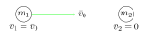
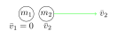
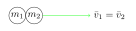
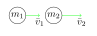
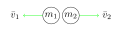

Skriðþungi
==========

Hugsum okkur hlut sem hefur fastan massa :math:`m`. Nú verður þessi hlutur fyrir einhverjum kröftum, en skv. fyrsta lögmáli Newtons getum við skrifað:

.. math::
  \sum \overline{F} = m\overline{a}

þar sem :math:`\overline{a}` er hröðunin sem hluturinn fær vegna kraftanna. Þar sem hröðun er tímaafleiða hraða, :math:`\overline{a} = \frac{d\overline{v}}{dt}`, þá getum við skrifað:

.. math::
  \sum \overline{F} = m \frac{d\overline{v}}{dt}

Við skilgreinum *skriðþunga* (e. momentum) hlutar á hreyfingu sem margfeldi massans og hraðans sem hann er á.

.. math::

  \overline{p}=m\overline{v}

.. note::

	Þar sem skriðþungi er margfeldi vigurs (hraðans) og skalarstærðar (massans) þá sjáum við að *skriðþungi er vigur*. Eining skriðþunga er :math:`\text{kg}\cdot\text{m/s}` sem er það sama og :math:`\text{N}\cdot\text{s}`

Massamikill hlutur á miklum hraða hefur því mikinn skriðþunga á meðan massalitlir hlutir á hægri hreyfingu mjög lítinn.

Því gildir að summa kraftanna sem verka á hlut er jöfn breytingunni sem verður á skriðþunga hlutarins.

.. math::
  \sum \overline{F} = \frac{d\overline{p}}{dt}

Þetta þýðir því að það ef koma á massamiklum hlut á mikla hreyfingu úr kyrrstöðu þarf mikinn kraft.
Hugsaðu þér að þú sért að versla í innkaupakerru. Í upphafi ferðarinnar er kerran tóm og hún lætur auðveldlega að stjórn. Eftir því sem vörurnar safnast í hana, þyngist hún og það verður sífellt erfiðara (krefst meiri krafts) að koma henni af stað. Að sama skapi er erfitt að stoppa hana sé hún komin á skrið.

.. tip::
  :math:`m=1600` kg bíll keyrir áfram á :math:`|\overline{v}|=5` m/s.
  Skriðþungi hans er :math:`|\overline{p}|=m|\overline{v}|= 1600\text{ kg}\cdot 5 \text{m} /\text{s} = 8000 \text{ kg } \text{m} /\text{s}`.
  Hér er massamikill hlutur á hægri hreyfingu. Væri bíllinn að fara tvöfalt hraðar myndi skriðþunginn tvöfaldast líka.

  Byssukúla hefur hraðann :math:`|\overline{v}|=965` m/s og hefur massann :math:`4.2` g :math:`=0.0042` kg.
  Skriðþungi hennar er þá  :math:`|\overline{p}|=m|\overline{v}| =0.0042\text{kg} \cdot 965\text{m} /\text{s} = 40.5  \text{ kg } \text{m} /\text{s}`. Hér er massalítill hlutur á miklum hraða, meira en tvöföldum hljóðhraða.

Atlag
-----
Hugsum okkur hlut sem verður fyrir kröftum (sem hafa summuna :math:`\sum \overline{F}`) frá tímanum :math:`t_1` til tímans :math:`t_2`. Þá er *atlag* (e. impulse) kraftsins margfeldi kraftanna við lengd tímabilsins:

.. math::
  \overline{J} = \sum \overline{F}(t_2-t_1) = \sum \overline{F} \Delta t

Ef hluturinn verður fyrir sama kraftinum allt tímabilið þá er atlagið jafnt breytingunni á skriðþungnanum:

.. math::
  \overline{J} = \overline{p_2} - \overline{p_1} = \Delta \overline{p}

.. tip::
  Hvað þarf að beita miklum (jöfnum) krafti til þess að stöðva 50 kg innkaupakerru sem fer á 6 m/s, ef það þarf að takast á 3 sekúndum?

  .. figure:: ./myndir/skrth/kerra.svg
    :align: center
    :width: 60%

  Skriðþunginn í upphafi er :math:`p_1 = mv_1 = 50 \text{ kg} \cdot 6 \text{m/s} = 300 \text{kg m/s}` . Skriðþunginn í lokin er :math:`p_2 = 0` því :math:`v_2=0`. Við gerum ráð fyrir að aðeins einn kraftur verki, :math:`\overline{F}`, svo :math:`\sum \overline{F} = \overline{F}` . Þar sem krafturinn verkar bara í einni vídd þá dugar að hugsa bara um stærð vigursins, :math:`F`. Hér er :math:`\Delta t = 3 \text{ s}`

  .. math::
    \begin{aligned}
    J=F\Delta t &= \Delta p  = p_2-p_1\\
    F &= \frac{p_2-p_1}{\Delta t} \\
     &= \frac{0-300 \text{kg m/s}}{3 \text{ s}} \\
     &= -100 \text{ N}
    \end{aligned}

  Krafturinn fær neikvætt gildi því hann bendir á móti hreyfingunni.

Varðveisla
----------

Varðveisla, líkt og orka, er varðveitt stærð í lokuðu eðlisfræðilegu kerfi. Skriðþungi kerfis er varðveittur *ef summa allra kraftanna sem verka á kerfið er núll*.

Skriðþungi einstakra hluta innan kerfisins getur vel breyst, t.d. í árekstrum, en heildarskriðþunginn er varðveittur.

Ef við táknum skriðþunga kerfis fyrir einhvern atburð með :math:`p_i` (:math:`i` fyrir initial í ensku) og skriðþunga kerfisins eftir atburðinn með :math:`p_f` (:math:`f` fyrir final í ensku) þá getum við sett fram skriðþungavarðveislu fyrir kerfið með:

.. math::

	\overline{p}_i=\overline{p}_f

.. note::
  Skriðþungi er varðveittur ef engir kraftar koma utan frá.

.. tip::

  Skytta heldur laust á riffli þannig að þegar hún hleypir af skoti getur hann hreyfst afturfyrir sig. Riffillinn hefur massann :math:`m_r=3.00\text{ kg}` og kúla sem hann skýtur hefur massann :math:`m_k=5.00\text{ g} = 5.00\cdot 10^{-3}\text{ kg}`. Ef kúlan fer á hraðanum :math:`|\overline{v}_k| = 300 \text{ m/s}` til hægri, hve hratt kastast riffillinn til vinstri við skotið?

  **Lausn**

  Hér getum við gert ráð fyrir að engir utanaðkomandi kraftar séu að verki, þar sem skyttan heldur laust á rifflinum (þ.e. er ekki að ýta á móti hreyfingunni). Vegna þess að allar hreyfingarnar í þessu dæmi gerast eftir sömu línunni (kúlan ferðast í aðra áttina en riffillinn í hina) þá þarf lítið að velta því fyrir sér að skriðþungi er vigur. Það er einfaldara að hugsa að kúlan hafi jákvæðan hraða (fari áfram) en að riffillinn hafi neikvæðan (fari afturábak).

  Skriðþunginn fyrir skotið er núll, af því bæði byssan og kúlan eru kyrrstæðar (hafa hraðann :math:`v_i=0`), þ.e. :math:`p_{k,i} = 0`, :math:`p_{r,i}=0`.

  Heildarskriðþunginn fyrir skotið er:

  .. math::

  	p_i=p_{k,i} +p_{r,i} = 0 \text{ kg m/s}

  Þar sem skriðþunginn er varðveittur þarf hann líka að vera núll eftir skotið, þó báðir hlutirnir séu á hreyfingu, þ.e. :math:`p_i=p_f`

  Byssukúlan er massalítil en fer hratt og hefur skriðþungann:

  .. math::

  	p_{k,f} = m_k v_k = 5.00\cdot 10^{-3}\text{ kg} \cdot 300 \text{ m/s} = 1.50 \text{N s}

  Heildarskriðþunginn eftir skotið er:

  .. math::

  	p_f=p_{k,f} + p_{r,f}

  Skriðþungavarðveisla gefur okkur að :math:`p_f =0 \text{ kg m/s}` og því er :math:`p_{r,f} =- p_{k,f}`
  Þar sem við vitum bæði hraðann og skriðþungann er lítið mál að finna hraða riffilsins:

  .. math::

  	v_{r,f} = \frac{p_{r,f}}{m_{r}} = \frac{-1.5 \text{ kg m/s}}{3.00 \text{kg}} = -0.5 \text{m/s}

Hugsum okkur tvær kúlur á núningslausu borði (það að borðið sé núningslaust gefur okkur vísbendingu um að engir utanaðkomandi kraftar, eins og núningur, eru að verki). Þær hafa massa :math:`m_1` og :math:`m_2` og önnur þeirra (2) er kyrr á meðan hin (1) hefur hraðann :math:`{v}_0`.

Hér erum við að fjalla um hraða eftir beinni línu og því getum við hunsað það tímabundið að skriðþungi sé vigur.

Þá er heildarskriðþungi kerfisins fyrir áreksturinn :math:`{p}_i=m_1\overline{v}_0`.
Við skulum kalla hraða kúlu 1 eftir áreksturinn :math:`{v}_1` en hraða kúlu 2 :math:`{v}_2`. Hvað gerist þegar þær rekast saman?

Fullkomlega fjaðrandi árekstur
~~~~~~~~~~~~~~~~~~~~~~~~~~~~~~

Kúlurnar gætu verið þannig gerðar að þær skelli harkalega saman. Það er kallað *fullkomlega fjarðandi árekstur* þegar kúla 2 rekur við öllum skriðþunganum sem kúla 1 hafði. Þá stendur kúla 1 eftir kyrr (:math:`v_1=0`) en kúla 2 ferðast áfram með einhvern hraða :math:`v_2`. Heildarskriðþunginn eftir áreksturinn er því :math:`p_f=m_2v_2`

Fyrst skriðþunginn er varðveittur þá er:

.. math::
  \begin{aligned}
    p_i&=p_f \\
    m_1 v_0 &= m_2 v_2
  \end{aligned}

þ.a. hraði seinni kúlunnar eftir áreksturinn er:

.. math::
  v_2 = \frac{m_1 v_0}{m_2}

Ef kúlurnar tvær hafa sama massann :math:`m_1=m_2` þá mun seinni kúlan fara áfram með hraðanum :math:`v_2=v_0`

Fullkomlega ófjaðrandi árekstur
~~~~~~~~~~~~~~~~~~~~~~~~~~~~~~~

En hvað ef kúlurnar eru þannig gerðar að þær klístrist saman við áreksturinn? Þá er talað um *fullkomlega ófjaðrandi árekstur* og kúlurnar myndu ferðast áfram, klesstar saman, en með annan hraða en fyrir árekstur. Heildarskriðþunginn eftir áreksturinn er þá skriðþungi kúlu 1 auk skriðþunga kúlu 2:

.. math::
  \begin{aligned}
    p_f&=p_1+p_2 \\
    &= m_1v_1 +m_2v_2
  \end{aligned}

Hér er skriðþunginn líka varðveittur, svo:

.. math::
  \begin{aligned}
    p_i&=p_f \\
    m_1 v_0 &= m_1v_1 +m_2v_2 \\
    m_1 v_0 &= (m_1+m_2)v_2
  \end{aligned}

því þær fara á sama hraða eftir áreksturinn :math:`v_1=v_2`. Því er hraðinn sem þær fara á:

.. math::
  v_1=v_2 = \frac{m_1v_0}{m_1+m_2}

Ef kúlurnar hafa sama massann :math:`m_1=m_2` þá er hraðinn sem kúlurnar ferðast saman á hálfur upprunalegi hraðinn: :math:`v_1=v_2=\frac12 v_0`.

Önnur tilvik
~~~~~~~~~~~~

Langflestir árekstrar hluta í raunveruleikanum eru hvorki fullkomlega fjaðrandi né fullkomlega ófjaðrandi.
Skriðþunginn á engu að síður að vera varðveittur.

Það getur gerst að fyrri kúlan ýti seinni af stað en haldi sjálf áfram líka (en hægar). Þá þarf að gilda að samanlagður skriðþungi kúlnanna eftir áreksturinn sé jafn skriðþunganum fyrir áreksturinn:

.. math::
  m_1v_0 = m_1v_1+m_2v_2

Þetta er jafna með tvær óþekktar stærðir, :math:`v_1` og :math:`v_2`. Því eru til *óendanlega margar* lausnir á þessu verkefni og við myndum þurfa meiri upplýsingar til að leysa það. Í raunveruleikanum myndi þetta ráðast af eiginleikum efnanna, hvort þau eru hörð eða mjúk. Ein lausn er að önnur kúlan endi á að fara þrefalt hraðar en hin (:math:`v_2 = 3v_1`) .

Það eru líka til lausnir þar sem fyrri kúlan fær hraða í gagnstæða átt og skoppar til baka. Þá er :math:`v_1<0`

Varðveisla í tveimur víddum
---------------------------
