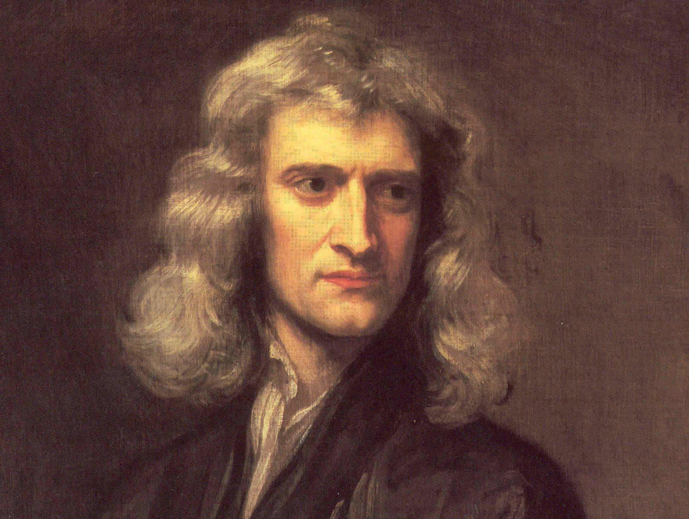

Um námsefnið
============

  | *Vandinn að skrifa er í því fólginn að þegja yfir nógu mörgu.*
  | -Halldór Kiljan Laxness, Úngur eg var (1976)

Um námsefnið
------------

Þetta námsefni er ætlað þeim sem vilja læra eða rifja upp undirstöðuatriði í efnafræði.

Farið er yfir helstu atriði efnafræðinnar sem gott er að hafa góð tök á í upphafi námsins en efnið er sett fram til að gefa verðandi nemendum tækifæri til að skerpa á þessum atriðum áður en kennsla hefst.

Hafa ber í huga að í námskeiðum í efnafræði er líklega farið ítarlegra í flest þessara atriða. Þetta er að námsefni sem margir hafa séð í menntaskóla og því getur reynst vel að rifja það upp. Þessi síða gæti einnig nýst
til hliðsjónar í efnafræðinámskeiðum.

Námsefnið var unnið með styrk úr `Kennslumálasjóði HÍ <http://sjodir.hi.is/kennslumalasjodur>`__ og við gerð þess var m.a. stuðst við efni frá síðunni `Efnafræði.is <http://www.efnafraedi.is>`__.

Hvað er efnafræði?
-------------------

Efnafræði er grein raunvísindanna þar sem skoðuð er hegðun efna; efnasambanda og frumefna, og hvernig myndun, sundrun og víxlverkun þeirra mynda alheiminn sem þekkist í dag.
Efnafræðin er ein af grunnstoðum raunvísindanna, en hún kemur við á flestum sviðum, s.s. eðlisfræði og líffræði. Hún er því oft kölluð *miðstöð vísindanna* (e. The Central Science).

Hagnýting efnafræðinnar er ekki ný af nálinni, en fundist hafa leifar af 100 þúsund ára gamalli vinnslu á  `okkur <https://is.wikipedia.org/wiki/Okkur>`__. Mannkynið hefur þá stundað efnahvörf lengi, þar sem það elsta er
*bruni*. Hagnýting efnafræðinnar kom langt á undan fræðilegum skilningi en fyrstu hugmyndir um tilveru atóma komu fram 380 árum f.kr. hjá `Demókrítós <https://is.wikipedia.org/wiki/Dem%C3%B3kr%C3%ADtos>`__ en hann var forsprakki *eindahyggjunar* (e. `atomism <https://en.wikipedia.org/wiki/Atomism>`__). Þessi kenning hefur að miklu leyti verið afsönnuð en var þó á réttri leið. Efnafræðin sem skipulögð fræðigrein á rætur sínar að rekja til upphaf 17. aldar, en fram að því einkenndist efnafræðin af gullgerðarmönnum (e. Alchemists) svo sem `Isaac Newton <https://is.wikipedia.org/wiki/Isaac_Newton>`__ en
orðið "Chemistry" er komið af orðinu "`Alchemy <https://en.wikipedia.org/wiki/Alchemy>`__".

  Isaac Newton

Mikið vatn hefur runnið til sjávar síðan þá en nútímaefnafræðin tekur fyrir breitt svið, allt frá skammtaefnafræði (e. `Quantum Chemistry <https://en.wikipedia.org/wiki/Quantum_chemistry>`__) sem tekur fyrir víxlverkun staka einda, til kjarnasamruna í sólinni.

.. warning::

  Þetta efni var skrifað sumarið 2019 og er birt með fyrirvara um villur. Ef rekist er á villur, hvort sem stafsetnings eða efnislegar, má endilega láta vita með tölvupóst í *sef6@hi.is* eða *sgg23@hi.is*
