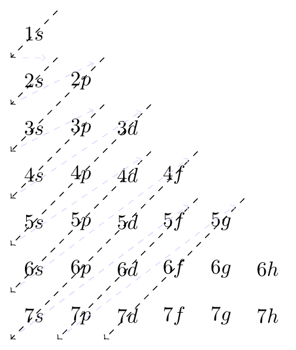
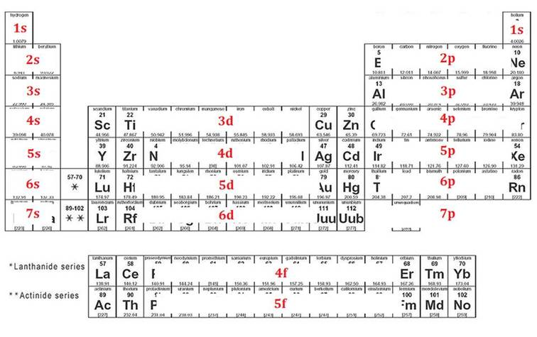

Skammtafræði
==============

Rafeindaskipan
--------------

Rafeindir raða sér ekki tilviljunarkennt kringum kjarnann, heldur skipa þau sér á *rafeindahvolf* (e. shell) þar sem þau eru fyllt eftir orkulegri hagkvæmni. Efni reynir alltaf að stefna að *orkulægsta* ástandandinu, enda er það stöðugast. Þá er mikilvægt að geta greint hvað er orkulægsta ástandið.

Frumefni hafa allt að 7 rafeindahvolf og eru þau númeruð með *n* eða *höfuðskammtatölunni* (e. `principal quantum number <https://en.wikipedia.org/wiki/Principal_quantum_number>`_) sem tekur gildi :math:`n=1,2,3,...`

Rafeindahvolfið skiptist svo í undirhvolf (e. subshells). Þessi fjögur undirhvolf eru númeruð með :math:`\ell` eða *hverfiþungaskammtatölunni* (e. `Azimuthal quantum number <https://en.wikipedia.org/wiki/Azimuthal_quantum_number>`_) sem tekur gidli :math:`\ell=\{0,1,2,3\}`. Undirhvolfin eru oftar táknuð með :math:`\ell=\{s,p,d,f\}`.
Undirhvolfin eru einnig fyllt eftir orkulegri hagkvæmni, þ.e. *orkulægstu* svigrúmin eru fyllt fyrst. Röðin á þeim má sjá hér á myndinni fyrir neðan en þau eru fyllt á sama hátt og örvarnar stefna ofan frá og niður. :math:`\require{mhchem}`

Orkuþrepið :math:`1s` svarar til skammtatalnanna :math:`n=1` og :math:`\ell=0` og er orkulægsta ástandið. Þrepið :math:`3d` svarar til :math:`n=3`, :math:`\ell=2` og er sjöunda lægsta ástandið.
Hafa ber í huga, eins og sjá má á mynd, að orkuþrep :math:`3d` er orkuhærra en :math:`4s`.

Hvernig skal finna rafeindaskipan frumefnis?
~~~~~~~~~~~~~~~~~~~~~~~~~~~~~~~~~~~~~~~~~~~~

Fjöldi rafeinda er jafn sætistölu frumefnis. Til að finna hvernig rafeindirnar raða sér í kringum kjarnann má nota eftirfarandi mynd, en þá er hægt að byrja efst vinstra megin og rafsvigrúmin fyllt í þeirri röð sem þau koma fyrir. Unnið er til hægri og niður þangað til komið er að frumefninu sem verið er að skoða.

Fjöldi rafeinda á hverju svigrúmi er jafn fjölda frumefna í hverju undirsvigrúmi, þ.e. það komast 2 rafeindir í :math:`s` svigrúm, 6 rafeindir í :math:`p` sigrúm, 10 rafeindir í :math:`d` svigrúm og að lokum 14 rafeindir í :math:`f` svigrúm.

.. tip::
  **Hver er rafeindaskipan brennisteins** (:math:`\ce{S}`) **? En blýs** (:math:`\ce{Pb}`) **?**

  Brennisteinn hefur sætistöluna 16 og því 16 rafeindir. Byrjum á vetni í :math:`1s` og vinnum okkur að svigrúmi :math:`3p`, þar sem brennisteinn er. Þá er rafeindaskipanin:

  .. math::
      1s^2 2s^2 2p^6 3s^2 3p^{\textbf{4}}

  Eins og sjá má eru einungis 4 rafeindir í :math:`3p` svigrúminu (þó þær mættu vera 6) þar sem samanlagður fjöldi þarf að vera 16 (:math:`2+2+6+2+4 = 16`).

  Hægt er að beita sömu aðferðarfræði á blý, en núna koma :math:`d` og :math:`f` svigrúm til leiks. Blý hefur sætistöluna 82 og því 82 rafeindir. Blý liggur í svigrúmi :math:`6p` í lotukerfinu og er það því lokastöðin. Með því að vinna sig til hægri og niður fæst:

  .. math::
      1s^2 2s^2 2p^6 3s^2 3p^6 4s^2 3d^{10} 4p^6 5s^2 4d^{10} 5p^6 6s^2 5d^{10} 4f^{14} 6p^2

  Þá sést að heildarfjöldi rafeinda er :math:`2+2+6+2+6+2+10+6+2+10+6+2+10+14+2 =82`

.. warning::
  Þessi röð rafeindanna er rétt fyrir flest frumefni en reglan er þó ekki algild. Fyrir suma hliðarmálma er þessi röð undirsvigrúmanna ekki endilega orkulega hagkvæmust og þegar ákvarða á rafeindaskipan þeirra þarf að taka tillit til sértilvika fyrir hverja rafeindahýsingu.

.. _s.gildisrafeindir:

Gildisrafeindir
---------------

*Gildisrafeindir* (e. valence electrons) eru þær rafeindir sem eru á ysta hveli frumefnis sem geta tekið þátt í að mynda efnatengi. Fjölda gildisrafeinda er auðvelt að finna út frá lotukerfinu fyrir utan gildisrafeindir hliðarmálmanna, lanþaníðanna og aktiníðanna. Alkalímálmar (eins og :math:`\ce{Li}` og :math:`\ce{Na}`) hafa eina gildisrafeind á meðan halógenar (eins og :math:`\ce{F}` og :math:`\ce{Cl}`) hafa 7. Fyrir flest efni eru rafeindir í d og f svigrúmunum ekki gildisrafeindir.

Gildisrafeindir eru einkum þýðingarmiklar í hvarfgirni efna vegna þess að frumefni leitast eftir að hafa 8 gildisrafeindir á ysta hvoli. Þetta heitir *áttureglan* (e. octate rule).
Atóm geta komið fjölda gildisrafeinda í átta með nokkrum leiðum: þau geta t.d. myndað *sameind* þar sem þau deila gildisrafeindum með öðrum atómum í *efnatengjum*, eða *jónast* (e. ionize) þar sem þau kasta af sér umframrafeindum.

.. note::
 Eðalgastegundir eru einstaklega stöðugar, vegna þess að þær uppfylla átturegluna. Þær eru því mjög óhvarfgjarnar eða óvirkar (e. inert)

Þegar rita á rafeindaskipan stórra frumefna er vaninn að telja ekki upp öll hvolfin og rafeindirnar sem þar eru, heldur einungis rafeindir á ysta hvolinu og tákn eðalgastegundarinnar fyrir framan í hornklofa. Þetta er gert til að einfalda ritháttin auk þess sem gildisrafeindir koma mun oftar við sögu en þær sem eru innar.

.. tip::

 **Hver er rafeindaskipan blýs, skrifað með þessum styttri rithátt?**

 Nú er Xenon eðalgastegundin í lotunni fyrir ofan blý. Því er byrjað þar og þá fæst:

  .. math::
    [Xe] 6s^2 5d^{10} 4f^{14} 6p^{2}

 Ef rafeindir á d og f svigrúmum eru ekki talin með sést að blý hefur :math:`2+2=4` gildisrafeindir.

Rafeindaskipan áframhald
------------------------

Rafeindir hafa fleiri en þessar tvær skammtatölur sem hafa verið nefndar, :math:`n` og :math:`\ell` . Auk þeirra eru :math:`m_{\ell}`, *segulskammtatalan* (e. `magnetic quantum number <https://en.wikipedia.org/wiki/Magnetic_quantum_number>`_) og :math:`m_S`  sem er  *spunaskammtatalan* (e. `spin quantum number <https://en.wikipedia.org/wiki/Spin_quantum_number>`_). :math:`m_\ell` segir til um í hvaða átt svigrúmið snýr en :math:`m_S` segir aftur á móti til um *spuna* rafeindarinnar.

Ekki verður farið nánar út í það hér en gott að vita að engar tvær rafeindir á atómi hafa sömu fjórar skammtatölur og skammtatölurnar er hægt að tilgreina á myndrænan hátt.
Þá fær hvert hvolf og undirhvolf kassa sem rafeindirnar eru svo merktar inn á. Fjöldi kassa fer eftir gerð undirhvolfa og eru helmingur fjölda rafeinda á fullu undirhvolfi.
Að lokum eru svo rafeindirnar táknaðar sem örvar sem snúa upp eða niður, sem tilgreinir spuna rafeindarinnar. Fullt hvolf hefur þá rafeind bæði upp og niður í hverjum kassa. Þetta skýrist best með dæmi:

.. tip::

 **Tilgreindu fulla rafeindaskipan brennisteins** (:math:`\ce{S}`).

 Brennisteinn er númer 16 í lotukerfinu en síðasta eðalgasið á undan því er Neon, sem hefur 10 rafeindir. Brennisteinn hefur þess vegna 6 gildisrafeindir,  2 á :math:`3s`og 4 á :math:`4p`. Byrjum á að teikna upp kassana fyrir svigrúmin, en þar sem það komast 2 rafeindir á :math:`s` hvolf teiknum við einn kassa fyrir það, en á :math:`p` hvolf komast 6, þannig við teiknum 3 kassa.

  .. figure:: ./myndir/atom/syni1.svg
    :align: center
    :width: 40%

 Byrjum á því að fylla tvær rafeindir inn í 3s svigrúmið og látum aðra þeirra benda upp en hina niður:

  .. figure:: ./myndir/atom/syni2.svg
    :align: center
    :width: 40%

 Með einungis 4 rafeindir er 3p svigrúmið ekki fullt og því þarf að passa hvernig fylla skal í það. Fyrst skal fylla í alla kassana (eða sem flesta kassa) með bara einni ör og eftirstandandi rafeindir fylltar inn eftir það. Þ.e. *ekki setja tvær örvar í kassa, meðan það eru enn tómir kassar*.
 Það er gert til að fylgja eftir svokallaðari *reglu Hund's*.

  .. figure:: ./myndir/atom/syni3.svg
    :align: center
    :width: 40%

  .. figure:: ./myndir/atom/syni4.svg
    :align: center
    :width: 40%

.. admonition:: Regla Hunds
  :class: setning, dropdown

  *Regla Hund's* segir til um að það sé orkulega hagkvæmast og þannig stöðugast þegar rafeindir skipa sér stakar á svigrúm, meðan kostur er. Þær hafa þá sama spuna.

  Þessi regla er oft kölluð *strætisvagnareglan*, þar sem vaninn er að setjast ekki í sætisröð með öðrum, ef það er tóm sætisröð í vagninum.

