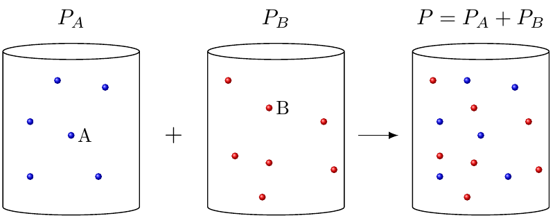

Kjörgaslögmálið
===============

Þrýstingur
----------

*Þrýstingur* (e. pressure) er vel þekktur í daglegu lífi og kemur við sögu m.a. í hverjum andardrætti. :math:`\require{mhchem}`

Þegar talað er um þrýsting, er hann oftast notaður í samhenginu með gasi, þó svo að hann kemur einnig við sögu fyrir vökva og fast efni.

Þrýstingur er táknaður með :math:`P` og er skilgreindur sem kraftur á flatarmál eða:

.. math::

  P=\frac FA

Hérna er :math:`F` kraftur, mældur í newtonum, og :math:`A` er flatarmál í fermetrum. SI-eining þrýstings er því *Newton á fermetra* einnig kallað *Pascal*, táknað :math:`\text{Pa}`.

Fyrir uppblásna blöðru er þrýstingurinn inni í henni sem heldur henni uppblásinni. Þessi þrýstingur fæst með *árekstri sameinda á veggi blöðrunnar*.
Sameindir í gasfasa eru á stöðugri hreyfingu og óumflýjanlega munu þær rekast á veggi blöðrunnar. Þessi árekstrar veita þann kraft sem þarf til að halda blöðrunni útþaninni.

Sameindir í andrúmsloftinu klessa einnig utan á blöðruna og valda þrýsting í hina áttina. Ef blaðran er hvorki að minnka né stækka er þrýstingurinn innan í og utan við blöðruna jafn.

Einingar
~~~~~~~~

Þrýstingur getur verið gefinn til kynna með mörgum einingum sem hafa allar verið skilgreindar með ákveðið markmið í huga. SI-einingin er Pascal, táknuð :math:`\text{Pa}`, en hún er mjög lítil og því hentar betur að nota aðrar einingar í efnafræði. Það er mikilvægt að vita hvernig hægt er að breyta á milli þeirra. :math:`\require{cancel}`

.. math::

  \begin{array}{c}
  \text{Loftþrýstingur við sjávarmál}\\
  \hline
  760 \text{ mmHg}\\
  760\text{ torr}\\
  1 \text{ atm}\\
  101\ 325 \text{ Pa}\\
  1,01325 \text{ bar}\\
  \hline
  \end{array}

.. tip::

 **Hvað er 251 kPa mörg torr?**

 Hér liggur beint við að breyta fyrst í *atm*, og þaðan af í *torr*:

 .. math::

  251 \bcancel{\text{kPa}} \cdot \frac{1\bcancel{ \text{ atm}}}{101,325 \bcancel{\text{ kPa}}} \cdot \frac{ 760 \text{ torr}}{1 \bcancel{ \text{ atm}}} =1880 \text{ torr}

Kjörgas
-------

Þrýstingur í gasi stjórnast einna helst af *þremur* þáttum:

Rúmmál
  Því minna rúmmáli sem gasið er í, því líklegra er fyrir sameindirnar að rekast á veggina. Þrýtingur eykst því fyrir minna rúmmál. Þetta er kallað *lögmál Boyles*

  .. math::

    P \propto \frac 1V

  :math:`\propto` stendur fyrir "í hlutfalli við", þ.e. ef rúmmálið er tvöfaldast, þá helmingast þrýstingurinn.

Hitastig
 Því heitara sem gasið er, því meira hreyfist það, og rekst því oftar á veggina. Þrýstingur eykst því fyrir aukið hitastig. Þetta er kallað *lögmál Charles*

 .. math::

   P \propto T

Fjöldi móla
  Því fleiri mól af eindum sem eru innan veggja íláts, því fleiri eindir rekast á veggi á hverjum tíma. Þrýstingurinn eykst því með fleiri mólum af gasi. Þetta er kallað *Lögmál Avogadros*

  .. math::

    P \propto n

*Kjörgas* (e. ideal gas) gerir ráð fyrir línulegu sambandi milli allra þessara þátta, þ.e. að lögmálin þrjú eru uppfyllt. Það er mjög góð nálgun, meðan fjöldi móla er hóflegur. Það sem kjörgas gerir ekki ráð fyrir, er að eindirnar byrja að hafa áhrif á hvora aðra.

Nú má hugsa sér krakka í klessubílum, þar sem allir hafa bundið fyrir augun. Ef einn krakki klessir á veggi vallarins 10 sinnum á klukkutíma er hægt að áætla að tveir krakkar klessa samtals 20 sinnum á veggina á klukkustund ef völlurinn er stór. Sambærilega má áætla að fyrir helmingi minni völl eða tvöfaldan hraða, klessi hver krakki 20 sinnum á veggina.
En ef það mæta allt í einu 100 krakkar í viðbót á völlinn, er erfiðara að áætla að fjöldi árekstra við veggina hundraðfaldast. Þá eru sumir krakkar fastir í miðjunni og þeir klessa meira á hvora aðra, í stað veggjanna. Þetta er sama sagan fyrir *raungös* (e. real gas).

Raungös eru gös með raunverulega hegðun, á meðan kjörgas hegðar sér eftir fullkomnu módeli.
Kjörgas er ekki til í alvörunni, en það er hægt að reikna með því að raungas hagi sér eins og kjörgas í sumum aðstæðum, eins og t.d. í andrúmsloftinu. Það auðveldar reikninga til muna og hægt er að setja fram *kjörgaslögmálið* (e. ideal gas law):

.. math::

  PV= nRT

Hér er :math:`R` gasfastinn og gildi hans fer eftir því hvaða einingar eru notaðar. Hægt er að finna þessi gildi t.d. `hér <https://www.cpp.edu/~lllee/gasconstant.pdf>`_. Þá er mikilvægt að nota alltaf hitastig í Kelvin.

Fyrst um sinn skulum við gera ráð fyrir að kjörgaslögmálið gildi, en gott er að hafa í huga takmörk þess.

.. tip::

 **Hver er þrýstingurinn fyrir 0,1 mól af gasi í 1,4 L íláti við 25°C?**

 Hér er hægt að byrja á að einangra þrýstinginn úr kjörgaslögmálinu

 .. math::

  \begin{aligned}
  PV &=nRT\\
  P &= \frac{nRT}{V}
  \end{aligned}

 Nú liggur beint við að stinga inn gildum. Ekki má gleyma að hitastigið þarf að vera í kelvin!

 .. math::

  \begin{aligned}
  P &=\frac{0,1 \bcancel{\text{ mól}} \cdot 8,314 \frac{\bcancel{\text{L}} \text{ kPa}}{\bcancel{\text{K}} \bcancel{\text{mól}}} \cdot (273,15+25)\bcancel{\text{ K}}}{1,4 \bcancel{\text{ L}}}\\
    &=177 \text{ kPa}
    \end{aligned}

.. tip::

 **Metangasi og súrefni er blandað í lokuðum gaskút og kveikt er í blöndunni þ.a. eftirfarandi hvarf á sér stað**

 .. math::

   \ce{CH4(g) + 2O2(g) -> CO_2(g) + 2H2O(g)}

 **Upphafsþrýstingur gasblöndunnar er 200 kPa. Ef upphafshitastig gasblöndunnar er 300 K, en hitnar við brunann í 700K, hver er lokaþrýstingurinn?**

 Hér er gert ráð fyrir kjörgasi. Fyrir lokaðan gaskút breytist rúmmálið ekki, þ.e :math:`\Delta V=0` eða :math:`V_i=V_f`.

 Á efnahvarfinu sést að þrjú mól hvarfast og þrjú myndast, þ.e *fjöldi móla breytist ekki*. Þá er :math:`\Delta n=0`. Setjum þá upp kjörgasjöfnuna, bæði fyrir gasblönduna í upphafi og eftir brunann:

 .. math::

  \begin{aligned}
              P_iV_i &=n_iRT_i                &    P_fV_f &=n_fRT_f\\
  \end{aligned}

 Fyrst að mólin og rúmmál breytast ekki, er hægt að leiða út jöfnuna:

 .. math::

  \frac{P_i}{T_i}=\frac{n_i R}{V_i}=\frac{n_f R}{V_f} =  \frac{P_f}{T_f}

 Þetta er ekkert annað en lögmál Charles's. Nú er hægt að einangra :math:`P_f` og stinga inn gildum:

 .. math::

   \begin{aligned}
   P_f &= \frac {T_f}{T_i} P_i \\
       &= \frac {700 \text{ K}}{300 \text{ K}} \cdot 200 \text{ kPa}\\
       &= 467 \text{ kPa}
   \end{aligned}

Hlutþrýstingur
--------------

Fyrir gasblöndu er gagnlegt að skilgreina *hlutþrýsting* (e. partial pressure). Þetta er þrýstingur sem hver og ein gastegund í blöndunni myndi hafa, ef hún væri ein og sér í ílátinu. Fyrir gasblöndu er svo heildarþrýstingurinn samanlagður hlutþrýstingur alla gastegundanna. Þetta er kallað *lögmál Daltons*.

.. math::

  P_\text{heild}=P_A + P_B + P_C + \dots

Samkvæmt kjörgaslögmálinu fæst að hlutfallið milli móla af gastegundum er jafnt og hlutfallið af hlutþrýsting:

.. math::

  \frac{n_{\text{A}}}{n_{\text{heild}}} = \frac{P_{\text{A}}}{P_{\text{heild}}}

Þessu er hægt að endurraða og þá fæst:

.. math::

  P_{\text{A}} = \frac{n_{\text{A}}}{n_{\text{heild}}} \cdot P_{\text{heild}}

.. tip::

 **Andrúmsloftið er 21% súrefni sem mólarhlutfall. Hver er hlutþrýstingur súrefnis við sjávarmál í torr?**

 Nú er hægt að stinga inn gildum í jöfnuna fyrir ofan. Þá fæst:

 .. math::

    \begin{aligned}
    P_{\ce{O2}} &= \frac{n_{\ce{O2}}}{n_{\text{loft}}} \cdot P_{\text{loft}}\\
            &= 0,21 \cdot 760 \text{ torr}\\
            &= 160 \text { torr}
    \end{aligned}
