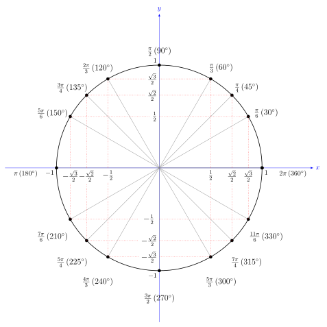
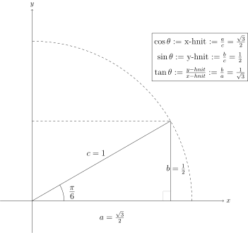
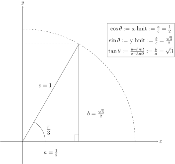
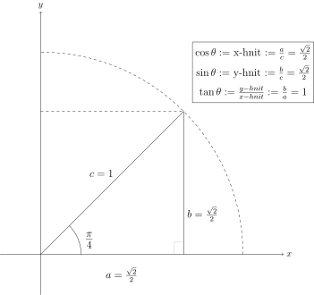
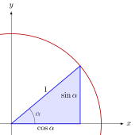

Hornaföll
=========

Bogaeiningar
------------
Í daglegu tali notum við yfirleitt mælieininguna :hover:`gráður, gráða` til þess að mæla horn.
Samkvæmt skilgreiningu skiptir hún hringnum í þrjúhundruð-og-sextíu jafna hluta og einn slíkur hluti er kallaður ein gráða.
Stærðfræðilega séð þykir talan :math:`360` ekkert merkilegri en aðrar tölur og því engin ástæða til að búa til mælieiningakerfi byggt á henni.
Í raun er til miklu náttúrulegri leið til að skilgreina nýja mælieiningu á horn.
Hana köllum við :hover:`bogaeiningu, bogaeining` en hún er skilgreind á eftirfarandi máta:

Skilgreining
~~~~~~~~~~~~
Látum :math:`\alpha` vera horn. Köllum oddpunkt hornsins :math:`O`.
Teiknum hring með :hover:`geisla, geisli` :math:`1` og miðju í punktinum :math:`(0,0)`.
Armar hornsins skera hringinn í tveimur punktum :math:`A` og :math:`B`.
Stærð hornsins :math:`\alpha` er þá jafnt lengd :hover:`bogans, bogi` á milli punktanna :math:`A` og :math:`B`.


.. note::
	Samkvæmt þessari skilgreiningu þá er heill hringur :math:`2 \pi` bogaeiningar því það er :hover:`ummál` hrings með geisla :math:`1`.

	.. math::
		2\pi\text{ Rad} = 360°

Bogaeiningar eru oft kallaðar radíanar og þær má tákna með :math:`\text{Rad}`, en það er yfirleitt ekki gert. Ef það er ekki merkt að horn sé mælt í gráðum, þá er það mælt í radíönum.

---------------------------------------------------

Það er hægt að breyta á milli gráða og bogaeininga svona:

.. math::
	x \quad \text{Rad} = \left(x \cdot \frac{360}{2 \pi}\right)° \qquad og \qquad  x°=\left( x \cdot \frac{2 \pi}{360}\right) \text{Rad}

.. tip::

	Skrifum :math:`\frac{\pi}{6}` í gráðum.

	**Lausn**

	Til þess finnum við hversu stór hluti hornið :math:`\frac{\pi}{6}` er úr hringnum, en heill hringur er :math:`2 \pi`.
	Höfum :math:`\frac{\pi/6}{2 \pi}=\frac{1}{12}` , svo :math:`\frac{\pi}{6}` er :math:`\frac{1}{12}` úr hring.
	Nú þurfum við bara að margfalda þessa stærð með :math:`360^{\circ}` og fáum :math:`\frac{1}{12}\cdot 360^{\circ} = 30^{\circ}`.

	Það er líka hægt að nota formúlurnar í skilgreiningunni hér að ofan:

	.. math::
	 	\frac{\pi}{6} \text{Rad} = \left(\frac{\pi}{6} \cdot \frac{360}{2 \pi}\right)° = 30°

.. tip::

	Skrifum :math:`70^{\circ}` í bogaeiningum.

	**Lausn**

	Finnum hversu stórt hlutfall :math:`70^{\circ}` er úr heilum hring, :math:`70/360`, og margföldum með :math:`2 \pi`. Fáum:

	.. math::
		\frac{70}{360} \cdot 2 \pi=\frac{7}{18} \pi

	Lausnin er því að :math:`70^{\circ}=\frac{7}{18}\pi`. Það er líka hægt að nota formúlurnar í skilgreiningunni hér að ofan:

	.. math::
		70°=\left( 70 \cdot \frac{2 \pi}{360}\right) \text{Rad} = \frac{7\pi}{18}

Kósínus og sínus
----------------

Eingingahringurinn
~~~~~~~~~~~~~~~~~~

Hringurinn með miðju í punktinum :math:`(0,0)` í hnitakerfinu og radíus einn er kallaður :hover:`einingarhringurinn, einingarhringur`. Í þessum kafla munum við nota einingarhringinn og bogaeiningar til að skilgreina :hover:`hornaföll, hornafall`.

Kósínus og sínus
~~~~~~~~~~~~~~~~
Nú er markmiðið að skýra stærðirnar :math:`\cos(\alpha)` og :math:`\sin(\alpha)`.

Teiknum einingarhring í :hover:`hnitakerfið, hnitakerfi`.
Setjum blýantinn okkar í punktinn :math:`(1,0)` og færum hann rangsælis eftir einingarhringnum þar til blýanturinn er búinn að færast um vegalengdina :math:`\alpha`. (Ef :math:`\alpha` er neikvæð tala förum við réttsælis um vegalengdina :math:`\alpha`). Hér er í lagi þó að :math:`\alpha` sé stór tala og við förum marga hringi á einingarhringinn.


Munum að :math:`\alpha` er horn í bogalengdum og er jafnt lengd bogans frá upphafspunktinum.

Þegar blýanturinn er búinn að ferðast um vegalengdina :math:`\alpha` þá stoppum við og mörkum punktinn :math:`P` inn á hnitakerfið þar sem stoppað var.
Kósínus af horninu :math:`\alpha` er nú skilgreindur sem :math:`x`-hnit punktsins :math:`P`, og sínus af horninu :math:`\alpha` er skilgreindur sem :math:`y`-hnit punktsins :math:`P`. Við táknum þessi föll með :math:`\cos(\alpha)` og :math:`\sin(\alpha)`.


.. note::
	Bæði kósínus og sínus eru :math:`2 \pi`-:hover:`lotubundin` föll. Ef við förum heilan hring, sem er :math:`2 \pi`, þá endum við í sama punkti og fáum því sama gildið.

Hornafallið tangens, :math:`\tan`, er skilgreint sem hlutfallið á milli :math:`\sin` og :math:`\cos`.

.. math::
	\tan(\alpha) = \frac{\sin(\alpha)}{\cos(\alpha)}

Þar sem :math:`\cos(\alpha) \neq 0`

Hægt er að nota allar hliðar þríhyrningsins sem myndast til að finna gildin á :math:`\cos(\alpha), \sin(\alpha)` og :math:`\tan(\alpha)`.


Hér er :math:`c` kölluð :hover:`langhliðin, langhlið`, :math:`a` kölluð :hover:`aðlæg skammhlið, aðlæg hlið` og :math:`b` kölluð :hover:`mótlæg skammhlið, mótlæg hlið` miðað við hornið :math:`\alpha`.

Amma illa
~~~~~~~~~
Sumum þykir þægilegt að nota eftirfarandi töflu til þess að muna hvaða hlutföll hliðanna gefur hvaða hornafall.
Hér stendur :math:`\text{a}` fyrir *aðlæga* skammhlið, :math:`\text{m}` fyrir *mótlæga* skammhlið og :math:`\text{l}` fyrir *langhlið*.

.. math::
	\begin{array}{| c | c | c | c | c |}
		\hline
		& \cos(\alpha) & \sin(\alpha) & \tan(\alpha) & \\
		\hline
		& \text{a} &	\text{m} & \text{m} & \text{(a)}\\
		\hline
		\text{(i)} &	\text{l} & \text{l} & \text{a} &  \\
		\hline
	\end{array}

:math:`\cos` af horni í þríhyrningi er aðlæg deilt með langhlið (:math:`\text{a}/\text{l}`).

:math:`\sin` af horni er mótlæg deilt með langhlið (:math:`\text{m}/\text{l}`).

:math:`\tan` er mótlæg deilt með aðlægri skammhlið (:math:`\text{m}/\text{a}`).

Þekkt gildi á hornaföllum
-------------------------

Skoðum nú nokkur gildi á :math:`\alpha` í samhengi við útskýringuna á hornaföllunum hér að ofan.

Munið að við látum blýant byrja í punktinum :math:`(1,0)` og færum okkur eftir einingarhringnum eins langt og :math:`\alpha` segir til um, og endum í punkti :math:`P`.

1. Ef :math:`\alpha=0` þá færum við okkur ekki neitt. Við endum í sama punkti og við byrjum í og þess vegna verður :math:`P=(1,0)`. Þess vegna er :math:`\cos(0)=1` og :math:`\sin(0)=0`.
2. Ef :math:`\alpha=\pi/2` þá færum við okkur rangsælis um fjórðung af hringnum (ummál hringsins er :math:`2\pi`). Við endum semsagt í topppunkti hringsins sem hefur hnit :math:`P=(0,1)` svo :math:`\cos(\pi/2)=0` og :math:`\sin(\pi/2)=1`.
3. Ef :math:`\alpha=\pi` þá færum við okkur rangsælis um hálfan hring. Þá erum við stödd í punktinum :math:`P=(-1,0)` svo að :math:`\cos(\pi)=-1` og :math:`\sin(\pi)=0`.

Vel þekkt gildi á hornaföllunum má lesa úr myndinni að neðan.
Stærðir hornanna eru merktar utan á hringinn og :math:`x` - og :math:`y` - hnit þeirra eru merkt á ásana.
Mikilvægt er að þekkja einingarhringinn og geta notað hann.
Við lesum gildin á kósínus á :math:`x` - ásnum og  gildin á sínus á :math:`y` - ásnum.

Þannig sést til dæmis á myndinni að :math:`\cos(5\pi/6)=-\frac{\sqrt{3}}{2}` (:math:`x`-ásinn) og :math:`\sin(5\pi/6)=\frac12` (:math:`y`-ásinn). Einnig er il dæmis :math:`\cos(7\pi/4)=\frac{\sqrt{2}}{2}` og :math:`\sin(7\pi/4)=-\frac{\sqrt{2}}{2}` og svona gætum við haldið áfram.




.. warning::
	Það getur borgað sig að hafa þessi gildi á hreinu!

	.. math::
		\begin{array}{| c | c | c | c |}
			\hline
			& \alpha = 30°  = \frac{\pi}{6} & \alpha = 60° = \frac{\pi}{3} & \alpha = 45° = \frac{\pi}{4} \\
			\hline
			\cos(\alpha) & \frac{\sqrt{3}}{2} &	\frac{1}{2} & \frac{\sqrt{2}}{2} \\
			\hline
			\sin(\alpha) &	\frac{1}{2} & \frac{\sqrt{3}}{2} & \frac{\sqrt{2}}{2} \\
			\hline
			\tan(\alpha) & \frac{\sqrt{3}}{3} & \sqrt{3} & 1 \\
			\hline
		\end{array}

Til þess að læra gildin getur reynst vel að skoða þríhyrningana sem myndast út frá einingarhringnum þegar :math:`\alpha` tekur gildin :math:`\frac{\pi}{6}, \frac{\pi}{3} \text{ og } \frac{\pi}{4}`.

Hér er rétthyrndi þríhyrningurinn sem myndast þegar við erum í :math:`30°` eða :math:`\frac{\pi}{6}` stefnu:




Hér er rétthyrndi þríhyrningurinn sem myndast þegar við erum í :math:`60°` eða :math:`\frac{\pi}{3}` stefnu:



Hér er rétthyrndi þríhyrningurinn sem myndast þegar við erum í :math:`45°` eða :math:`\frac{\pi}{4}` stefnu:




Tangens og kótangens
--------------------
Við skilgreinum föllin tangens og kótangens þannig:

.. math::
	\tan(\alpha)=\frac{\sin(\alpha)}{\cos(\alpha)}, \qquad (\cos(\alpha)\neq 0 )

.. math::
	\cot(\alpha)=\frac{\cos(\alpha)}{\sin(\alpha)}, \qquad (\sin(\alpha)\neq 0)

Myndir af hornaföllum
---------------------
Hér eru myndir af gröfum hornafallanna, þar sem hornið er eftir :math:`x` - ásnum.
Takið eftir að öll föllin eru lotubundin með lotu :math:`2\pi`.


-----------------

Takið eftir að kósínusinn lítur næstum alveg eins út og sínusinn, eini munurinn á gröfunum er að búið er að hliðra öðru um :math:`\frac{\pi}{2}` miðað við hitt.

.. math::
	\cos(\alpha) = \sin\left(\frac{\pi}{2} - \alpha\right)

.. math::
	\sin(\alpha) = \cos\left(\frac{\pi}{2} - \alpha\right)

Sínusinn og kósínusinn eru takmörkuð föll, takmörkuð af einum að ofan og mínus einum að neðan.
Það þýðir að þau taki *aldrei* gildi sem eru stærri en 1 eða minni en -1.

.. note::
	Ein af mikilvægum eiginleikum :math:`\cos` og :math:`\sin` er að
	 * :math:`\cos` er **jafnstætt** fall
	 	* :math:`\cos(-\alpha) = \cos(\alpha)`

	 * :math:`\sin` er **oddstætt** fall
	 	* :math:`\sin(-\alpha) = -\sin(\alpha)`

-----------------


-----------------

Tangensinn er ekki takmarkaður heldur stefnir á plús eða mínus óendanlegt á sumum stöðum.
Þá hefur :math:`\tan(x)` :hover:`lóðfellur, aðfella` þar sem :math:`\cos(x)=0`, því þá er :math:`\tan(x) = \frac{\sin(x)}{\cos(x)}` ekki skilgreint.

-----------------


-----------------

Á sama hátt er kótangensinn eru ekki takmarkaður heldur stefnir á plús eða mínus óendanlegt á sumum stöðum. Einnig hefur :math:`\cot(x)` :hover:`lóðfellur, aðfella` þar sem :math:`\sin(x)=0`, því þá er :math:`\cot(x) = \frac{\cos(x)}{\sin(x)}` ekki skilgreint.


.. _s.hornaföll:

Hornafallareglur
----------------
Hornaföllin hafa marga nytsamlega eiginleika. Rökstyðjum hér nokkrar hornafallareglur:

**1.** Rökstyðjum að

.. math::
	\begin{aligned}
	\cos(-\alpha)&=\cos(\alpha) \\
	&\text{og} \\
	\sin(-\alpha)&=-\sin(\alpha)
	\end{aligned}

Byrjum í punktinum :math:`(1,0)` og færum okkur *rangsælis* eftir einingarhringnum um vegalengdina :math:`\alpha` . Mörkum þar punktinn :math:`P_1`.
Færum okkur svo úr :math:`(1,0)` *réttsælis* um :math:`\alpha` og mörkum þar inn :math:`P_2`.


Auðvelt er að sjá að punktarnir hafa sömu :math:`x`-hnit þannig að :math:`\cos(-\alpha)=\cos(\alpha)` .
Hins vegar hafa :math:`y`-hnitin öfug formerki miðað við hvort annað, svo :math:`\sin(-\alpha)=-\sin(\alpha)`.

------------------

**2.** Rökstyðjum að

.. math::
	\begin{aligned}
	\cos(\pi-\alpha)&=-\cos(\alpha) \\
	&\text{og} \\
	\sin(\pi-\alpha)&=\sin(\alpha)
	\end{aligned}

Við mörkum aftur tvo punkta inn á hnitakerfið.

:math:`P_1` mörkum við með því að færa okkur um hornið :math:`\pi-\alpha`, en það er gert með því að færa sig fyrst rangsælis um :math:`\pi` en svo aftur til baka réttsælis um hornið :math:`\alpha`.
:math:`P_2` mörkum við inn á hnitakerfið með því að færa okkur um hornið :math:`\alpha` rangsælis.


Þá er auðvelt að sjá að :math:`P_1` og :math:`P_2` hafa sömu :math:`y`-hnit þannig að :math:`\sin(\pi-\alpha)=\sin(\alpha)` .
Þá hafa :math:`x`-hnit punktanna gagnstæð formerki, þannig að :math:`\cos(\pi-\alpha)=-\cos(\alpha)`. En það er einmitt það sem við erum að reyna að rökstyðja.

------------------

Hægt er að rökstyðja fleiri reglur á svipaðan hátt, en það getur verið auðveldara að sjá þær myndrænt fyrir sér en að reyna að muna þær allar.

Setjum fram nokkrar slíkar reglur.


.. math::
	\begin{aligned}
	\cos(-\theta)&=\cos \theta\\
	\sin(-\theta)&=-\sin\theta\\
	& \\
	\cos(\pi-\theta)&=-\cos \theta\\
	\sin(\pi-\theta)&=\sin \theta\\
	& \\
	\cos(\theta+\pi)&=-\cos \theta\\
	\sin(\theta+\pi)&=-\sin \theta\\
	& \\
	\cos\left(\frac{\pi}{2}-\theta\right)&=\sin\theta\\
	\sin\left(\frac{\pi}{2}-\theta\right)&=\cos\theta
	\end{aligned}

Almennt eru gildi :math:`\cos(\alpha), \sin(\alpha)` og :math:`\tan(\alpha)` jákvæð í fyrsta fjórðungi, svo eru gildi :math:`\sin(\alpha)` jákvæð í öðrum fjórðungi, :math:`\tan(\alpha)` í þriðja, og :math:`\cos(\alpha)` í fjórða. Sjáum á mynd hvaða hornaföll eru jákvæð hvar.


Tvöföld horn
------------
Lítum á horn af gerðinni :math:`2x` þar sem :math:`x` er einhver tala. Við höfum eftirfarandi reglur um tvöföld horn:

.. math::
	\begin{aligned}
	\sin(2x)&=2 \cos(x) \sin(x) \\
	\quad\\
	\cos(2x)&= \cos^2(x)-\sin^2(x) \\
	&= 2\cos^2(x)-1 \\
	&= 1-2 \sin^2(x)
	\end{aligned}

Þessar reglur eru nytsamlegar í útreikningum.

Andhverfur hornafallanna
------------------------

:hover:`Andhverfur hornafallanna`, bogafall ― :math:`\arcsin, \arccos` og :math:`\arctan` ― eru :hover:`andhverfur, andhverfa` fallana :math:`\sin, \cos` og :math:`\tan`.

Skoðum aðeins jöfnuna

.. math::
	\sin(x) = 0

Hvað ef við viljum einangra :math:`x` út úr þessari jöfnu?
Nú gæti einhver stungið upp á að :math:`x = 0` sé lausnin því að :math:`\sin(0) = 0`.
Það svar er rétt, en þó aðeins að hluta til, því að þessi jafna hefur í raun óendanlega margar lausnir.
Tökum eftir að :math:`x = \pi` er einnig lausn á þessari jöfnu sem og :math:`x = 2 \pi`.
Raunin er að :math:`n \cdot \pi` er lausn á þessari jöfnu fyrir öll :math:`n \in \mathbb{Z}`.

Allar lausnirnar sem til eru á :math:`\sin(x) = 0` eru á forminu :math:`x=n \cdot \pi, \quad (n \in \mathbb{Z})`.
Þess vegna skrifum við stundum

.. math::
	\sin^{-1}(0) = \{n \pi ; \; n \in \mathbb{Z}\}

þar sem veldið :math:`^{-1}` táknar andhverft fall.
Þetta gildir auðvitað um fleiri tölur en :math:`0`.

Jafnan :math:`\sin(x) = a` hefur á sama hátt óendanlega margar lausnir :math:`x` fyrir öll :math:`a \in [−1, 1]`.
Hins vegar er auðvelt að sjá að **nákvæmlega ein** af þessum lausnum er á bilinu :math:`[−\pi/2, \pi/2]`.
Við skilgreinum þess vegna nýtt fall :math:`\arcsin` sem að er þannig að

.. math::
	\arcsin(a) = x_0

þá og því aðeins að :math:`x_0` sé talan af bilinu :math:`[−\pi/2, \pi/2]` sem uppfyllir jöfnuna

.. math::
	\sin(x_0) = a

Því er :math:`arcsin` hálfgerð andhverfa sínusfallsins vegna þess að

.. math::
	\sin(\arcsin(x)) = x \qquad \text{fyrir öll } x \in [−1, 1]

**Hún nær þó ekki að verða algjör andhverfa því að það öfuga gildir ekki**.
Það er, ekki er hægt að fullyrða að :math:`\arcsin(\sin(x))` sé jafnt og x.
Til dæmis er :math:`\sin(2\pi) = 0` og :math:`\arcsin(0) = 0` og því fæst

.. math::
	\arcsin(\sin(2\pi)) = \arcsin(\sin(0)) = 0

Við skulum nú skilgreina andhverfur allra hornafallanna formlega:

Skilgreining
~~~~~~~~~~~~

Andhverfa sínusar
`````````````````

:math:`\arcsin: \; [-1,1] \rightarrow [−\pi/2, \pi/2]` er fallið sem uppfyllir

.. math::
	\sin(\arcsin(x)) = x \qquad \text{fyrir öll  } x \in [−1, 1]

.. warning::
	Athugum að :math:`\arcsin(x)` er oft ritað :math:`\sin^{-1}(x)`


Hér er graf :math:`\arcsin(x)`.

.. tip::
	Hverjar eru lausnir :math:`\sin(v)=\frac12`, þ.e. hvað er :math:`\sin^{-1} \left(\frac12 \right)` ?

	Hér er gildið :math:`\frac12 >0` og því leitum við að lausnum á fyrsta og öðrum fjórðungi einingahringsins, því þar er :math:`\sin(v)\geq 0`.

	Skoðum einingarhringinn:

	.. figure:: ./myndir/horna/hringad1.svg
		:align: center
		:width: 100%

	Við sjáum að þegar :math:`v=\frac{\pi}{6}=30^\circ` þá er :math:`\sin(v) = \frac12`. Það gildir líka þegar :math:`v=\frac{5\pi}{6} = 150^\circ`, því :math:`\sin(\pi-u) = \sin(u)` fyrir öll :math:`u` .

	Því eru allar lausnir :math:`\sin(v)=\frac12`

	.. math::

		v =
		\begin{cases}
		\frac{\pi}{6} + n\cdot 2\pi \\
		\frac{5\pi}{6} + n \cdot 2\pi
		\end{cases}

	fyrir öll :math:`n \in \mathbb{Z}`, eins og sjá má á mynd hér að neðan:

	.. image:: ./myndir/horna/hringad1a.svg
		:align: center
		:width: 100%


Andhverfa kósínusar
```````````````````

:math:`\arccos: \; [-1,1] \rightarrow [0, \pi]` er fallið sem uppfyllir

.. math::
	\cos(\arccos(x)) = x \qquad \text{fyrir öll  } x \in [−1, 1].

.. warning::
 	Athugum að :math:`\arccos(x)` er oft ritað :math:`\cos^{-1}(x)`.


Hér er graf :math:`\arccos(v)`.

.. tip::
	Hverjar eru lausnir :math:`\cos(x)=\frac{\sqrt{3}}{2}`, þ.e. hvað er :math:`\cos^{-1}\left( \frac{\sqrt{3}}{2} \right)`?

	Hér er :math:`\frac{\sqrt{3}}{2} >0` svo við skoðum lausnir á fyrsta og fjórða fjórðungi einingahringsins, því þar er :math:`\cos(u)>0`.

	Skoðum einingarhringinn:

	.. figure:: ./myndir/horna/hringad2.svg
		:align: center
		:width: 100%

	Við sjáum að

	.. math::
		\cos\left(\frac{\pi}{4}\right)= \frac{\sqrt{3}}{2}

	Þá er líka

	.. math::
		\cos\left(\frac{-\pi}{4}\right) = \cos\left(\frac{7\pi}{4}\right) = \frac{\sqrt{3}}{2}

	því :math:`\cos(u) = \cos(-u)` fyrir öll :math:`u`.

	Þá eru allar lausnir :math:`\cos(v)=\frac{\sqrt{3}}{2}`

	.. math::

		v =
		\begin{cases}
		\frac{\pi}{4} + n\cdot 2\pi \\
		\frac{-\pi}{4} + n \cdot 2\pi
		\end{cases}

	fyrir öll :math:`n \in \mathbb{Z}`, eins og sjá má á mynd hér að neðan:

	.. image:: ./myndir/horna/hringad2a.svg
		:align: center
		:width: 100%


Andhverfa tangens
`````````````````

:math:`\arctan: \; [-\infty,\infty] \rightarrow [−\pi/2, \pi/2]` er fallið sem uppfyllir

.. math::
	\tan(\arctan(x)) = x \qquad \text{fyrir öll  } x \in [−\infty, \infty]

.. warning::
 	Athugum að :math:`\arctan(x)` er oft ritað :math:`\tan^{-1}(x)`.


Hér er graf :math:`\arctan(v)`.

.. tip::
	Hverjar eru lausnir :math:`\tan(v)=-\sqrt{3}`, þ.e. hvað er :math:`\tan^{-1} (-\sqrt{3})` ?

	Hér er :math:`-\sqrt{3} <0` svo við skoðum lausnir á öðrum og fjórða fjórðungi einingahringsins því þar er :math:`\tan(u)<0`.

	:math:`\tan(v)` er hlutfallið á milli :math:`\sin(v)` og :math:`\cos(v)` og út frá einingarhringnum getum við fundið að þegar :math:`v=\frac{2\pi}{3}` þá er :math:`\sin(v) = \frac{\sqrt{3}}{2}` og :math:`\cos(v) = -\frac12`.

	.. math::
		\begin{aligned}
		\tan(v) &= \frac{\sin(v)}{\cos(v)} \\
		&= \frac{\sqrt{3}/2}{-1/2} \\
		&= -\sqrt{3}
		\end{aligned}

	Önnur lausn er :math:`v=\frac{5\pi}{3}`, því :math:`\tan(u) = \tan(u+\pi)`.
	Við getum sannfært okkur um að það passi með því að reikna:

	.. math::
		\begin{aligned}
		\tan\left(\frac{5\pi}{3}\right) &= \frac{\sin(5\pi/3)}{\cos(5\pi/3)} \\
		&= \frac{-\sqrt{3}/2}{1/2} \\
		&= - \sqrt{3}
		\end{aligned}

	.. figure:: ./myndir/horna/hringad3.svg
		:align: center
		:width: 100%

	Þá eru allar lausnir :math:`\tan(v)=-\sqrt{3}`

	.. math::
		v=\frac{2\pi}{3} + n \cdot \pi

	fyrir öll :math:`n \in \mathbb{Z}`, eins og sjá má á mynd hér að neðan:

	.. image:: ./myndir/horna/hringad3a.svg
		:align: center
		:width: 100%


Tengsl í rúmfræði
-----------------

Regla Pýþagórasar
~~~~~~~~~~~~~~~~~

Rifjum upp að fyrir :hover:`rétthyrndan þríhyrning, rétthyrndur þríhyrningur` gildir

.. math::
	a^2+b^2=c^2

þar sem :math:`c` er langhliðin. Þessi regla nefnist regla Pýþagórasar.

Með því að horfa á einingarhringinn fáum við samband á milli kósínusar og sínusar, með hjálp reglu Pýþagórasar. Við skilgreindum kósínus sem :math:`x`-hnit og sínus sem :math:`y`-hnit. Við vitum að langhliðin hefur lengd :math:`1` þar sem hringurinn hefur radíus :math:`1`. Við fáum því:

.. math::
	\cos^2(\alpha)+\sin^2(\alpha)=1



Sínusreglan
~~~~~~~~~~~
Í :math:`\triangle ABC` gildir

.. math::
	\frac{a}{\sin(A)} = \frac{b}{\sin(B)} = \frac{c}{\sin(C)}

Þar sem :math:`A`, :math:`B` og :math:`C` eru horn þríhyrningsins og :math:`a`, :math:`b` og :math:`c` eru lengdir hliðanna

---------------


Kósínusreglan
~~~~~~~~~~~~~
Í :math:`\triangle ABC` gildir

.. math::
	\begin{aligned}
	a^2 &= b^2+c^2-2\cdot b \cdot c \cdot \cos(A) \\
	b^2 &= a^2+c^2-2\cdot a \cdot c \cdot \cos(B) \\
	c^2 &= b^2+a^2-2\cdot b \cdot a \cdot \cos(C) \\
	\end{aligned}


Hornafallareglurnar
-------------------

Athugið að horn eru yfirleitt táknuð með stöfum á borð við :math:`\theta` , :math:`\alpha` , :math:`u` og :math:`v`.
Hornaföll eru jafnan táknuð sem föll af :math:`x`.

Hér á eftir koma reglur sem eru mikið notaðar.

Grunnreglan
~~~~~~~~~~~

.. math::
	\sin^2(\theta) + \cos^2(\theta) = 1


Hliðrunarreglur
~~~~~~~~~~~~~~~

.. math::
	\begin{aligned}
	1.& \qquad \cos(-\theta)=\cos \theta\\
	2.& \qquad \sin(-\theta)=-\sin\theta\\
	3.& \qquad \cos(\pi-\theta)=-\cos \theta\\
	4.& \qquad \sin(\pi-\theta)=\sin \theta\\
	5.& \qquad \cos(\theta+\pi)=-\cos \theta\\
	6.& \qquad \sin(\theta+\pi)=-\sin \theta\\
	7.& \qquad \cos\left(\frac{\pi}{2}-\theta\right)=\sin\theta\\
	8.& \qquad \sin\left(\frac{\pi}{2}-\theta\right)=\cos\theta
	\end{aligned}


Summuformúlur
~~~~~~~~~~~~~

**1.**

.. math::
	\sin( u + v ) = \sin(u)  \cos(v) + \cos(u) \sin(v)

**2.**

.. math::
	\sin( u - v ) = \sin(u) \cos(v) - \cos(u) \sin(v)

**3.**

.. math::
	\cos( u + v ) = \cos(u)  \cos(v) - \sin(u)  \sin(v)

**4.**

.. math::
	\cos( u - v ) = \cos(u)  \cos(v) + \sin(u)  \sin(v)

**5.**

.. math::
	\tan(u-v) = \frac{\tan(u) - \tan(v)}{1 + \tan(u)  \tan(v)}

**6.**

.. math::
	\tan(u+v) = \frac{\tan(u) + \tan(v)}{1 - \tan(u)  \tan(v)}


Tvöföldunarformúlur
~~~~~~~~~~~~~~~~~~~

**1.**

.. math::
	\sin(2u) = 2\sin(u)\cos(u)

**2.**

.. math::
	\begin{aligned}
	\cos(2u)&= \cos^2(u)-\sin^2(u) \\
	&= 2\cos^2(u)-1 \\
	&= 1-2 \sin^2(u)
	\end{aligned}

**3.**

.. math::
	\tan(2u) = \frac{2\tan(u)}{1-\tan^2(u)}


Helmingunarformúlur
~~~~~~~~~~~~~~~~~~~

**1.**

.. math::
	\sin^2(u) = \frac{1- \cos(2u)}{2} \qquad \text{eða} \qquad \sin\left(\frac{u}{2}\right) = \pm \sqrt{\frac{1- \cos(u)}{2} }

**2.**

.. math::
	\cos^2(u) = \frac{1+ \cos(2u)}{2} \qquad \text{eða} \qquad \cos\left(\frac{u}{2}\right) = \pm \sqrt{\frac{1+ \cos(u)}{2} }

**3.**

.. math::
	\tan^2(u) = \frac{1- \cos(2u)}{1+\cos(2u)} \qquad \text{eða} \qquad \tan\left(\frac{u}{2}\right) = \pm \sqrt{\frac{1- \cos(u)}{1+\cos(u)} }


Summu- og margfeldisformúlur
~~~~~~~~~~~~~~~~~~~~~~~~~~~~

**Margfeldisritháttur í summurithátt**

 **1.**

 .. math::
	\sin(u)\sin(v) = \frac{1}{2}\left(\cos(u-v) - \cos(u+v)\right)

 **2.**

 .. math::
	\cos(u)\cos(v) = \frac{1}{2}\left(\cos(u-v) + \cos(u+v)\right)

 **3.**

 .. math::
	\sin(u)\cos(v) = \frac{1}{2}\left(\sin(u+v) + \sin(u-v)\right)

 **4.**

 .. math::
	\cos(u)\sin(v) = \frac{1}{2}\left(\sin(u+v) - \sin(u-v)\right)


**Summuritháttur í margfeldisrithátt**

 **1.**

 .. math::
	\sin(u) + \sin(v) = 2\sin\left(\frac{u+v}{2}\right)\cos\left(\frac{u-v}{2}\right)

 **2.**

 .. math::
	\sin(u) - \sin(v) = 2\cos\left(\frac{u+v}{2}\right)\sin\left(\frac{u-v}{2}\right)

 **3.**

 .. math::
	\cos(u) + \cos(v) = 2\cos\left(\frac{u+v}{2}\right)\cos\left(\frac{u-v}{2}\right)

 **4.**

 .. math::
	\cos(u) - \cos(v) = -2\sin\left(\frac{u+v}{2}\right)\sin\left(\frac{u-v}{2}\right)
